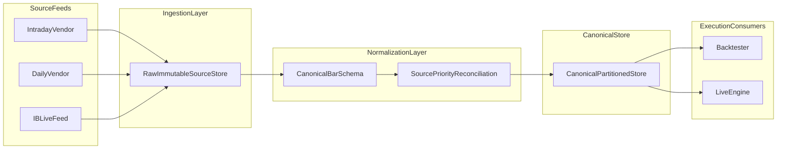

# Data Sourcing

This SaaS platform uses the exact same canonical market-data architecture as the core Trading-Algo repository.

## Core problem

Data sources differ in schema, timestamps, roll conventions, adjustment methods, coverage, and latency. If strategy/backtest code queries raw source feeds directly, assumptions leak and live-vs-research parity drifts.

## Canonical architecture



## Layer responsibilities

### Ingestion layer (bronze)

Store source-faithful immutable records:

- source-partitioned namespaces
- event timestamp plus ingest timestamp
- idempotent writes

### Normalization layer (silver)

Each source adapter maps feed-specific records to one canonical schema and internal instrument IDs.

```python
{
  "instrument_id": str,
  "resolution": str,
  "ts_event": datetime,
  "ts_ingest": datetime,
  "open": float,
  "high": float,
  "low": float,
  "close": float,
  "volume": int,
  "source": str,
  "adjusted": bool,
  "roll_convention": str,
}
```

### Canonical store (gold)

Backtester and live engine query canonical bars only.

Recommended SaaS default:

- Parquet on object storage
- partitioning by `(instrument, resolution, year)`
- query via DuckDB/Polars/Spark by workload

## IB as live updater

IB data lands as a source feed, then reconciliation applies configured source priority and writes canonical winners with provenance.

## Source priority and conflict resolution

Priority is config-driven (never hardcoded). Example:

```yaml
resolution: "1d"
instrument_class: "futures"
priority:
  - source: vendor_daily
    condition: available and not flagged
  - source: ib
    condition: fallback

resolution: "1m"
priority:
  - source: vendor_intraday
  - source: ib
```

Conflicts (for example close deviation above threshold) must be logged and alertable.

## Shared Trading-Algo implementation

SaaS mirrors this repository implementation:

- policy config: `deployment/config/canonical_source_priority.json`
- policy loader: `utils/data/source_reconciliation.py`
- architecture reference: `docs/library/Data/canonical_data_architecture.md`
- Norgate rebuild flow: `docs/library/Data/NORGATE_MIGRATION.md`
- IB splice reconciliation: `utils/cache/runtime/ib_candle_ratio_align.py`
- live upsert path: `scripts/enigma_live_forecast.py` (`upsert_tws_candles`)

## Mandatory IB append rule

Every IB daily append must:

1. append only sessions newer than canonical max date
2. apply ratio splice adjustment `anchor_close / first_new_ib_close`
3. rebuild derived timeframe aggregates from reconciled daily bars
