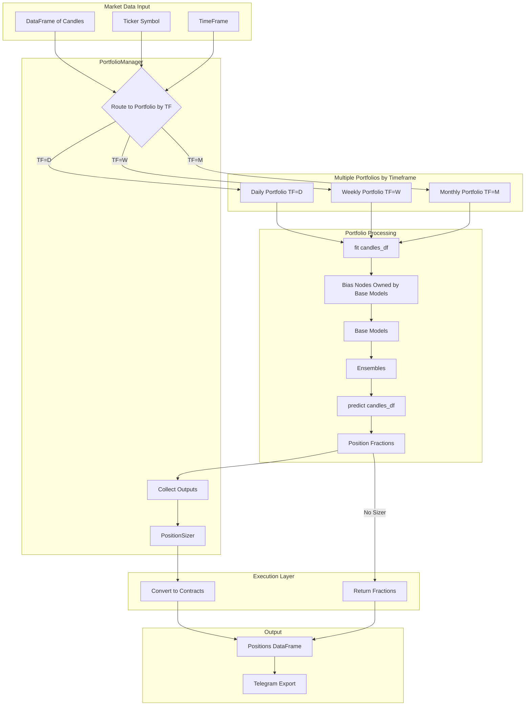
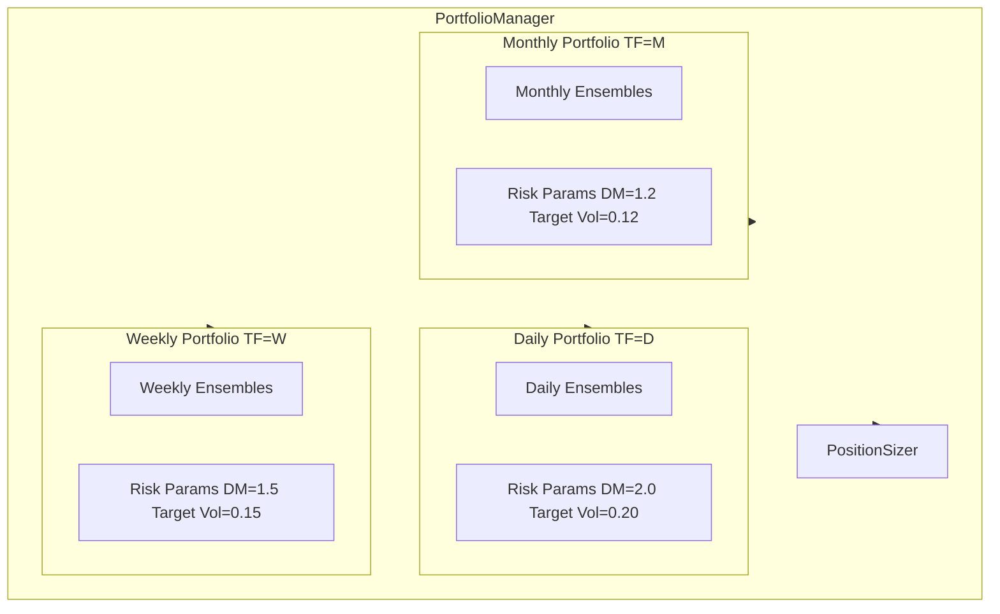
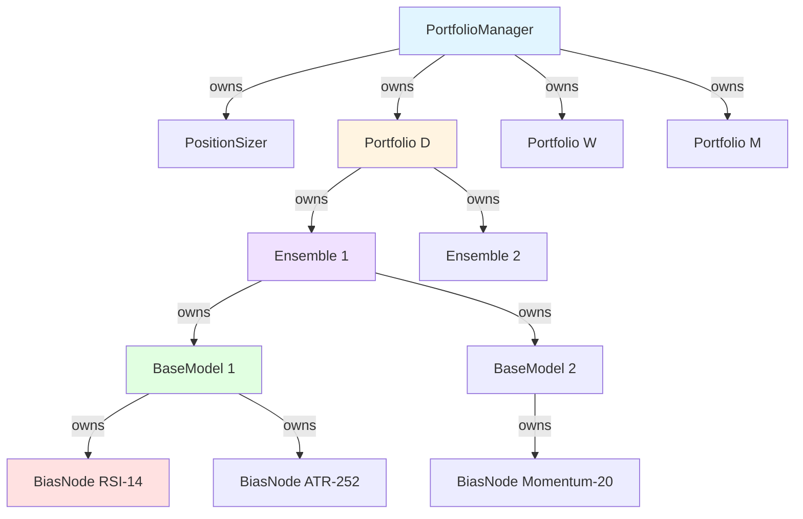

# PortfolioManager Specifications

**Version**: 3.0.0  
**Date**: 2025-01-10  
**Status**: Design Specification  

**Major Changes in v3.0.0**:
- **PortfolioManager replaces MLManager**: Simpler wrapper class for managing multiple portfolios
- **Portfolio.fit() and predict()**: Both methods accept DataFrame of candles for easy experimentation
- **Base Models Own Bias Nodes**: Base models internally manage their own bias nodes and compute features
- **Self-Responsible Components**: Each component (BaseModel, Ensemble, Portfolio) is responsible for its own dependencies
- **Simplified Architecture**: No centralized bias node configuration - everything is self-contained

---

## Table of Contents

1. [Overview](#overview)
2. [Architecture](#architecture)
3. [Key Components](#key-components)
4. [Implementation Phases](#implementation-phases)
5. [API Specifications](#api-specifications)
6. [Configuration](#configuration)
7. [Error Handling](#error-handling)
8. [Testing Strategy](#testing-strategy)
9. [Usage Examples](#usage-examples)

---

## Overview

Create a PortfolioManager class that coordinates multiple Portfolio instances (one per trading timeframe). Each Portfolio can be fitted and used for prediction using DataFrames of candles, making experimentation and testing straightforward. Base models internally own and manage their bias nodes, eliminating the need for centralized bias node configuration.

### Goals

- **Simple Wrapper**: PortfolioManager is a lightweight coordinator that feeds data to portfolios
- **DataFrame-Based API**: Portfolio.fit() and predict() accept DataFrames of candles for easy testing
- **Self-Responsible Components**: Base models own their bias nodes, ensembles own their base models
- **Multi-Timeframe Support**: Manage multiple portfolios (one per trading timeframe)
- **Position Sizing**: PortfolioManager owns PositionSizer for contract conversion
- **Easy Experimentation**: Simple API for testing different portfolio configurations

### Key Design Decisions

**1. PortfolioManager as Simple Wrapper** ⭐ NEW
- **Lightweight coordinator**: Just feeds data to portfolios and collects outputs
- **No bias node management**: That responsibility moves to base models
- **Owns PositionSizer**: Handles contract conversion at the manager level
- **Multi-portfolio routing**: Routes candles to appropriate portfolio by timeframe

**2. Portfolio.fit() and predict() Methods** ⭐ NEW
- **DataFrame-based API**: Both methods accept `pd.DataFrame` of candles
- **Easy experimentation**: Load data once, test different configurations
- **Consistent interface**: Same data format for fitting and prediction
- **Example**: `portfolio.fit(candles_df)` and `positions_df = portfolio.predict(candles_df)`

**3. Base Models Own Bias Nodes** ⭐ NEW
- **Self-contained**: Each base model internally creates and manages its required bias nodes
- **No centralized config**: No need to discover/configure bias nodes at PortfolioManager level
- **Automatic feature computation**: Base models compute features from candles they receive
- **Simplified initialization**: Just pass ensembles to Portfolio, everything else is automatic

**4. Self-Responsible Component Hierarchy**
- **BaseModel**: Owns bias nodes, computes features from candles
- **Ensemble**: Owns base models, aggregates their predictions
- **Portfolio**: Owns ensembles, applies risk management
- **PortfolioManager**: Owns portfolios and PositionSizer, coordinates data flow

**5. Single-Timeframe Portfolios**
- **Each Portfolio manages ONE trading timeframe only**
- **Clear separation**: Daily portfolio trades on daily candles, weekly on weekly, etc.
- **Independent risk parameters**: Each portfolio has its own target volatility, DM, etc.

**6. Composition Over Configuration**
- **PortfolioManager owns PositionSizer**: Via composition, not inheritance
- **Portfolio owns Ensembles**: Via composition
- **Ensemble owns BaseModels**: Via composition
- **BaseModel owns BiasNodes**: Via composition

---

## Architecture

### System Overview



### Data Flow

```
DataFrame of Candles (with ticker, timeframe columns)
  ↓
PortfolioManager.fit(candles_df) or predict(candles_df)
  ↓ Route to appropriate Portfolio based on timeframe column:
    ↓ If tf=D → portfolios[TimeFrame.D]
    ↓ If tf=W → portfolios[TimeFrame.W]
    ↓ If tf=M → portfolios[TimeFrame.M]
    ↓
Portfolio.fit(candles_df) or predict(candles_df)
  ↓ → Ensemble.fit(candles_df) or predict(candles_df)
    ↓ → BaseModel.fit(candles_df) or predict(candles_df)
      ↓ → BaseModel internally manages bias nodes
      ↓ → Bias nodes compute features from candles
      ↓ → BaseModel returns binary signals {0, 1}
    ↓ ← Forecast scores [0, 1] aggregated from base models
  ↓ Apply volatility scaling, DM, instrument weights
  ↓ ← Position fractions (% of capital) DataFrame
  ↓
PortfolioManager collects outputs from all portfolios
  ↓
PositionSizer.calculate_positions(positions_df) [if enabled]
  ↓ Convert fractions to contracts
  ↓ ← Number of contracts, notional values
  ↓
Return Combined Positions DataFrame
  ↓
Telegram Export (optional)
```

### Multi-Timeframe Portfolio Management



### Component Ownership Hierarchy



---

## Key Components

### 1. BaseModel with Internal Bias Nodes

**Purpose**: Base models own and manage their required bias nodes internally

**Location**: `feature_selection/base_models/`

**Key Changes**:
- Base models create their own bias nodes during initialization
- Base models compute features from candles internally
- No external bias node configuration needed

**New BaseModel Interface**:
```python
class BaseModel:
    def __init__(self, feature_config: Dict[str, Any], ticker: Ticker):
        """
        Initialize base model with feature configuration.
        
        Creates bias nodes internally based on feature_config['bias_node_spec'].
        
        Parameters
        ----------
        feature_config : Dict[str, Any]
            Feature configuration from control file, including:
            - bias_node_spec: {
                'module_name': str,
                'timeframes': [TimeFrame],
                'params': dict
            }
        ticker : Ticker
            Ticker symbol for this base model
        """
        self.ticker = ticker
        self.feature_config = feature_config
        
        # Create bias nodes internally
        bias_node_spec = feature_config['bias_node_spec']
        self.bias_nodes = {}
        
        for tf in bias_node_spec['timeframes']:
            bias_node = helpers.create_bias_node(
                bias_node_spec['module_name'],
                ticker,
                tf,
                bias_node_spec['params']
            )
            self.bias_nodes[tf] = bias_node
    
    def fit(self, candles_df: pd.DataFrame) -> None:
        """
        Fit the base model using candles DataFrame.
        
        Updates internal bias nodes with candle data, then fits model.
        
        Parameters
        ----------
        candles_df : pd.DataFrame
            DataFrame with columns: datetime, open, high, low, close, volume, ticker, timeframe
        """
        # Update bias nodes for each timeframe
        for tf, bias_node in self.bias_nodes.items():
            tf_candles = candles_df[candles_df['timeframe'] == tf]
            for _, row in tf_candles.iterrows():
                candle = Candle.from_row(row)
                bias_node.add_candle(candle)
        
        # Fit model using computed features
        features = self._compute_features(candles_df)
        # ... model fitting logic ...
    
    def predict(self, candles_df: pd.DataFrame) -> pd.Series:
        """
        Predict binary signals using candles DataFrame.
        
        Computes features from candles, then generates predictions.
        
        Parameters
        ----------
        candles_df : pd.DataFrame
            DataFrame with columns: datetime, open, high, low, close, volume, ticker, timeframe
            
        Returns
        -------
        pd.Series
            Binary signals {0, 1} indexed by datetime
        """
        features = self._compute_features(candles_df)
        # ... prediction logic ...
        return predictions
    
    def _compute_features(self, candles_df: pd.DataFrame) -> pd.DataFrame:
        """Compute features from candles using internal bias nodes."""
        # Update bias nodes
        for tf, bias_node in self.bias_nodes.items():
            tf_candles = candles_df[candles_df['timeframe'] == tf]
            for _, row in tf_candles.iterrows():
                candle = Candle.from_row(row)
                bias_node.add_candle(candle)
        
        # Extract feature values from bias nodes
        # ... feature extraction logic ...
        return features_df
```

### 2. Ensemble with BaseModel Management

**Purpose**: Ensembles own and manage their base models

**Location**: `ensemble/diversified_ensemble.py`

**Key Changes**:
- Ensembles create base models during initialization
- Base models are loaded from feature control files
- Ensembles coordinate fit() and predict() calls to base models

**New Ensemble Interface**:
```python
class DiversifiedEnsemble:
    def __init__(self, ensemble_dir: str, tickers: List[Ticker]):
        """
        Initialize ensemble with base models.
        
        Loads feature control files and creates base models with their bias nodes.
        
        Parameters
        ----------
        ensemble_dir : str
            Path to ensemble directory in vault
        tickers : List[Ticker]
            List of tickers this ensemble will process
        """
        self.ensemble_dir = ensemble_dir
        self.tickers = tickers
        
        # Load base models from feature control files
        self.base_models = {}
        features_dir = os.path.join(ensemble_dir, 'features')
        
        for filename in os.listdir(features_dir):
            if not filename.endswith('.json'):
                continue
            
            filepath = os.path.join(features_dir, filename)
            with open(filepath, 'r') as f:
                feature_config = json.load(f)
            
            # Create base model for each ticker
            for ticker in tickers:
                base_model = BaseModel(feature_config, ticker)
                key = (ticker, filename)
                self.base_models[key] = base_model
    
    def fit(self, candles_df: pd.DataFrame) -> None:
        """
        Fit all base models using candles DataFrame.
        
        Parameters
        ----------
        candles_df : pd.DataFrame
            DataFrame with columns: datetime, open, high, low, close, volume, ticker, timeframe
        """
        for base_model in self.base_models.values():
            base_model.fit(candles_df)
    
    def predict(self, candles_df: pd.DataFrame) -> pd.DataFrame:
        """
        Aggregate predictions from all base models.
        
        Parameters
        ----------
        candles_df : pd.DataFrame
            DataFrame with columns: datetime, open, high, low, close, volume, ticker, timeframe
            
        Returns
        -------
        pd.DataFrame
            Forecast scores indexed by datetime and ticker
        """
        predictions = []
        for (ticker, _), base_model in self.base_models.items():
            ticker_candles = candles_df[candles_df['ticker'] == ticker.name]
            pred = base_model.predict(ticker_candles)
            predictions.append(pred)
        
        # Aggregate predictions
        return self._aggregate_predictions(predictions)
```

### 3. Portfolio with fit() and predict() Methods

**Purpose**: Portfolio accepts DataFrame of candles for fitting and prediction

**Location**: `ensemble/portfolio.py`

**Key Changes**:
- Add `fit(candles_df)` method that accepts DataFrame of candles
- Add `predict(candles_df)` method that accepts DataFrame of candles
- Portfolio routes candles to appropriate ensembles based on timeframe
- Each portfolio manages ONE trading timeframe

**New Portfolio Interface**:
```python
class Portfolio:
    def __init__(
        self,
        ensembles: List[DiversifiedEnsemble],
        trading_timeframe: TimeFrame,
        target_volatility: float,
        dm: float,
        max_position_pct: float = 2.0
    ):
        """
        Initialize portfolio with ensembles.
        
        Parameters
        ----------
        ensembles : List[DiversifiedEnsemble]
            List of ensembles for this portfolio
        trading_timeframe : TimeFrame
            Timeframe this portfolio trades on (D, W, or M)
        target_volatility : float
            Target volatility for position sizing
        dm : float
            Diversification multiplier
        max_position_pct : float, default=2.0
            Maximum position size as % of capital
        """
        self.ensembles = ensembles
        self.trading_timeframe = trading_timeframe
        self.target_volatility = target_volatility
        self.dm = dm
        self.max_position_pct = max_position_pct
    
    def fit(self, candles_df: pd.DataFrame) -> None:
        """
        Fit all ensembles using candles DataFrame.
        
        Parameters
        ----------
        candles_df : pd.DataFrame
            DataFrame with columns: datetime, open, high, low, close, volume, ticker, timeframe
            Should contain candles for the trading_timeframe of this portfolio
        """
        # Filter candles for this portfolio's trading timeframe
        tf_candles = candles_df[candles_df['timeframe'] == self.trading_timeframe]
        
        # Fit all ensembles
        for ensemble in self.ensembles:
            ensemble.fit(tf_candles)
    
    def predict(self, candles_df: pd.DataFrame) -> pd.DataFrame:
        """
        Generate position fractions using candles DataFrame.
        
        Parameters
        ----------
        candles_df : pd.DataFrame
            DataFrame with columns: datetime, open, high, low, close, volume, ticker, timeframe
            Should contain candles for the trading_timeframe of this portfolio
            
        Returns
        -------
        pd.DataFrame
            Position fractions with columns: ticker, datetime, forecast_score, position_fraction
        """
        # Filter candles for this portfolio's trading timeframe
        tf_candles = candles_df[candles_df['timeframe'] == self.trading_timeframe]
        
        # Get predictions from all ensembles
        ensemble_predictions = []
        for ensemble in self.ensembles:
            pred = ensemble.predict(tf_candles)
            ensemble_predictions.append(pred)
        
        # Aggregate ensemble predictions
        forecast_scores = self._aggregate_ensembles(ensemble_predictions)
        
        # Calculate volatility (from candles or features)
        volatility = self._calculate_volatility(tf_candles)
        
        # Apply risk management
        positions_df = self._apply_risk_management(
            forecast_scores, volatility, tf_candles
        )
        
        return positions_df
```

### 4. PortfolioManager - Simple Wrapper Class

**Purpose**: Lightweight coordinator that feeds data to multiple portfolios

**Location**: `ensemble/portfolio_manager.py` (new file)

**Key Features**:
- Owns multiple Portfolio instances (one per timeframe)
- Owns PositionSizer for contract conversion
- Routes candles to appropriate portfolios
- Collects and combines outputs

**PortfolioManager Interface**:
```python
class PortfolioManager:
    def __init__(
        self,
        portfolios: Dict[TimeFrame, Portfolio],
        position_sizer: Optional[PositionSizer] = None
    ):
        """
        Initialize PortfolioManager with multiple portfolios.
        
        Parameters
        ----------
        portfolios : Dict[TimeFrame, Portfolio]
            Portfolio instances keyed by their trading timeframe.
            Example: {
                TimeFrame.D: daily_portfolio,
                TimeFrame.W: weekly_portfolio
            }
        position_sizer : PositionSizer, optional
            If provided, converts position fractions to contracts
        """
        self.portfolios = portfolios
        self.position_sizer = position_sizer
    
    def fit(self, candles_df: pd.DataFrame) -> None:
        """
        Fit all portfolios using candles DataFrame.
        
        Routes candles to appropriate portfolio based on timeframe column.
        
        Parameters
        ----------
        candles_df : pd.DataFrame
            DataFrame with columns: datetime, open, high, low, close, volume, ticker, timeframe
        """
        # Group candles by timeframe
        for tf, portfolio in self.portfolios.items():
            tf_candles = candles_df[candles_df['timeframe'] == tf]
            if len(tf_candles) > 0:
                portfolio.fit(tf_candles)
    
    def predict(self, candles_df: pd.DataFrame) -> pd.DataFrame:
        """
        Generate positions from all portfolios using candles DataFrame.
        
        Routes candles to appropriate portfolios, collects outputs, and optionally
        converts to contracts.
        
        Parameters
        ----------
        candles_df : pd.DataFrame
            DataFrame with columns: datetime, open, high, low, close, volume, ticker, timeframe
            
        Returns
        -------
        pd.DataFrame
            Combined positions from all portfolios with columns:
            - ticker, datetime, timeframe, forecast_score, position_fraction
            - contracts, notional_value, notional_pct (if position_sizer enabled)
        """
        all_positions = []
        
        # Get predictions from each portfolio
        for tf, portfolio in self.portfolios.items():
            tf_candles = candles_df[candles_df['timeframe'] == tf]
            if len(tf_candles) > 0:
                positions_df = portfolio.predict(tf_candles)
                positions_df['timeframe'] = tf
                all_positions.append(positions_df)
        
        # Combine all positions
        if not all_positions:
            return pd.DataFrame()
        
        combined_df = pd.concat(all_positions, ignore_index=True)
        
        # Optionally convert to contracts
        if self.position_sizer:
            try:
                contracts_df = self.position_sizer.calculate_positions(combined_df)
                return contracts_df
            except Exception as e:
                logger.error(f"PositionSizer failed: {e}. Returning fractions only.")
                return combined_df
        
        return combined_df
```

### 5. PositionSizer Integration

**Purpose**: Convert position fractions to tradeable contracts

**Location**: `execution/position_sizer.py`

**Enhancement**: Add configuration loading (unchanged from v2.0.0)

**New Class Method**:
```python
@classmethod
def from_config(
    cls,
    config_path: str,
    capital: float,
    ticker_variants: Dict[str, str],
    prices: Dict[str, float],
    rounding_method: RoundingMethod = RoundingMethod.ROUND
) -> 'PositionSizer':
    """
    Load contract specs from config file.
    
    Parameters
    ----------
    config_path : str
        Path to contract_specs.json
    capital : float
        Account capital in USD
    ticker_variants : Dict[str, str]
        Maps ticker name to variant (e.g., {'ES': 'micro', 'NQ': 'standard'})
    prices : Dict[str, float]
        Current market prices per ticker
    rounding_method : RoundingMethod
        How to round fractional contracts
        
    Returns
    -------
    PositionSizer
        Configured instance ready for use
    """
```

### 6. Contract Specs Configuration

**Purpose**: Define contract specifications per ticker with multiple variants

**Location**: `deployment/config/contract_specs.json`

**Structure**: (unchanged from v2.0.0)
```json
{
  "ES": {
    "standard": {
      "multiplier": 50,
      "tick_size": 0.25,
      "tick_value": 12.50,
      "currency": "USD",
      "description": "E-mini S&P 500"
    },
    "micro": {
      "multiplier": 5,
      "tick_size": 0.25,
      "tick_value": 1.25,
      "currency": "USD",
      "description": "Micro E-mini S&P 500"
    }
  }
}
```
```python
def __init__(
    self,
    portfolios: Optional[Dict[TimeFrame, Portfolio]] = None,
    bias_node_specs: Optional[List[Dict[str, Any]]] = None,
    position_sizer: Optional[PositionSizer] = None,
    build_matrix: bool = False,
    auto_predict: bool = True
):
    """
    MLManager for streaming market data → features → positions.
    
    Two modes of operation:
    1. **Standalone Mode** (portfolios=None): Feature extraction only
    2. **Production Mode** (portfolios provided): Features + Positions
    
    Bias nodes can be configured in two ways:
    - Auto-discovery: Provide `portfolios` (reads from ensembles)
    - Explicit: Provide `bias_node_specs` (manual configuration)
    
    Parameters
    ----------
    portfolios : Dict[TimeFrame, Portfolio], optional
        Portfolio instances for generating positions, keyed by trading timeframe.
        Each Portfolio manages ONE trading timeframe.
        Example: {
            TimeFrame.D: daily_portfolio,
            TimeFrame.W: weekly_portfolio
        }
        When a candle arrives for a timeframe, MLManager routes it to the
        corresponding Portfolio. If None, runs in standalone mode.
    bias_node_specs : List[Dict[str, Any]], optional
        Explicit bias node specifications. If provided, these take precedence
        over portfolio auto-discovery. Each spec: {
            'module_name': str,
            'timeframes': [TimeFrame],
            'params': dict
        }
    position_sizer : PositionSizer, optional
        If provided, converts position fractions to contracts
    build_matrix : bool, default=False
        Whether to build feature matrices for analysis
    auto_predict : bool, default=True
        If True, automatically trigger predictions when candles arrive.
        If False, user must call predict_positions() manually.
        
    Raises
    ------
    ValueError
        If both portfolios and bias_node_specs are None (no config source)
        If portfolios provided but have no bias node specs
        
    Examples
    --------
    >>> # Standalone mode (research/feature extraction)
    >>> ml_manager = MLManager(
    ...     bias_node_specs=[
    ...         {'module_name': 'rsi', 'timeframes': [TimeFrame.D], 'params': {'lookback': 14}},
    ...         {'module_name': 'atr', 'timeframes': [TimeFrame.D], 'params': {'lookback': 252}}
    ...     ]
    ... )
    >>> 
    >>> # Production mode with single portfolio (daily trading)
    >>> ml_manager = MLManager(
    ...     portfolios={TimeFrame.D: daily_portfolio},
    ...     position_sizer=my_sizer,
    ...     auto_predict=True
    ... )
    >>> 
    >>> # Production mode with multiple portfolios (multi-timeframe trading)
    >>> ml_manager = MLManager(
    ...     portfolios={
    ...         TimeFrame.D: daily_portfolio,   # Trades on daily candles
    ...         TimeFrame.W: weekly_portfolio   # Trades on weekly candles
    ...     },
    ...     position_sizer=my_sizer,
    ...     auto_predict=True
    ... )
    >>> 
    >>> # Hybrid mode (portfolios + explicit bias nodes)
    >>> ml_manager = MLManager(
    ...     portfolios={TimeFrame.D: daily_portfolio},
    ...     bias_node_specs=[  # Additional nodes beyond portfolio
    ...         {'module_name': 'custom_indicator', 'timeframes': [TimeFrame.D], 'params': {...}}
    ...     ]
    ... )
    """
```

**Cleaner Multi-Ticker State Management**:

Use a single dataclass to encapsulate all per-ticker state:

```python
from dataclasses import dataclass, field
from typing import List, Tuple, Dict

@dataclass
class TickerState:
    """
    Encapsulates all state for a single ticker.
    
    Attributes
    ----------
    ticker : Ticker
        Ticker symbol
    bias_nodes : List[Tuple[TimeFrame, BiasNode]]
        List of (timeframe, bias_node) tuples
    bias_values : List[float]
        Current values for all bias nodes (parallel to columns)
    columns : List[str]
        Feature column names
    tf_columns : Dict[TimeFrame, List[str]]
        Column names organized by timeframe
    tf_indices : Dict[TimeFrame, List[int]]
        Global indices for each timeframe's columns
    matrix : Optional[pd.DataFrame]
        Feature matrix (if build_matrix=True)
    matrix_buffer : List[Tuple[datetime, List[float]]]
        Buffer for efficient DataFrame construction
    """
    ticker: Ticker
    bias_nodes: List[Tuple[TimeFrame, Any]] = field(default_factory=list)
    bias_values: List[float] = field(default_factory=list)
    columns: List[str] = field(default_factory=list)
    tf_columns: Dict[TimeFrame, List[str]] = field(default_factory=dict)
    tf_indices: Dict[TimeFrame, List[int]] = field(default_factory=dict)
    matrix: Optional[pd.DataFrame] = None
    matrix_buffer: List[Tuple[Any, List[float]]] = field(default_factory=list)

# In MLManager:
self.ticker_states: Dict[Ticker, TickerState] = {}
```

**How Prediction Triggering Works** (Removed `base_tf` Concept):

When `auto_predict=True`:
- When a candle arrives via `add_candle(candle, ticker, tf)`, MLManager checks if `portfolios[tf]` exists
- If yes: Extract features, calculate volatility, call `portfolios[tf].predict()`
- If no: Just update bias nodes (no prediction)
- Example:
  - Daily candle arrives → trigger `portfolios[TimeFrame.D]` (if exists)
  - Weekly candle arrives → trigger `portfolios[TimeFrame.W]` (if exists)
- Each Portfolio independently decides whether to generate a position

When `auto_predict=False`:
- Candles update bias nodes but don't trigger predictions
- User must manually call `predict_positions(ticker, timeframe)` when ready
- Useful for batch processing or custom prediction timing

### 4. PositionSizer Integration

**Purpose**: Optional conversion from position fractions to tradeable contracts

**Location**: `execution/position_sizer.py`

**Enhancement**: Add configuration loading

**New Class Method**:
```python
@classmethod
def from_config(
    cls,
    config_path: str,
    capital: float,
    ticker_variants: Dict[str, str],
    prices: Dict[str, float],
    rounding_method: RoundingMethod = RoundingMethod.ROUND
) -> 'PositionSizer':
    """
    Load contract specs from config file.
    
    Parameters
    ----------
    config_path : str
        Path to contract_specs.json
    capital : float
        Account capital in USD
    ticker_variants : Dict[str, str]
        Maps ticker name to variant (e.g., {'ES': 'micro', 'NQ': 'standard'})
    prices : Dict[str, float]
        Current market prices per ticker
    rounding_method : RoundingMethod
        How to round fractional contracts
        
    Returns
    -------
    PositionSizer
        Configured instance ready for use
    """
```

### 5. Contract Specs Configuration

**Purpose**: Define contract specifications per ticker with multiple variants

**Location**: `deployment/config/contract_specs.json`

**Structure**:
```json
{
  "ES": {
    "standard": {
      "multiplier": 50,
      "tick_size": 0.25,
      "tick_value": 12.50,
      "currency": "USD",
      "description": "E-mini S&P 500"
    },
    "micro": {
      "multiplier": 5,
      "tick_size": 0.25,
      "tick_value": 1.25,
      "currency": "USD",
      "description": "Micro E-mini S&P 500"
    }
  },
  "NQ": {
    "standard": {
      "multiplier": 20,
      "tick_size": 0.25,
      "tick_value": 5.00,
      "currency": "USD",
      "description": "E-mini NASDAQ-100"
    },
    "micro": {
      "multiplier": 2,
      "tick_size": 0.25,
      "tick_value": 0.50,
      "currency": "USD",
      "description": "Micro E-mini NASDAQ-100"
    }
  }
}
```

---

## Implementation Phases

### Phase 1: BaseModel with Internal Bias Nodes

**Estimated Effort**: 4-5 hours

**File**: `feature_selection/base_models/`

**Tasks**:
1. Refactor BaseModel to own bias nodes internally
2. Add `fit(candles_df)` method
3. Add `predict(candles_df)` method
4. Implement feature computation from candles
5. Update initialization to create bias nodes from feature config

**Implementation**:
```python
class BaseModel:
    def __init__(self, feature_config: Dict[str, Any], ticker: Ticker):
        """Initialize with feature config, create bias nodes internally."""
        self.ticker = ticker
        self.feature_config = feature_config
        
        # Extract bias node spec from feature config
        bias_node_spec = feature_config.get('bias_node_spec', {})
        if not bias_node_spec:
            raise ValueError("Feature config must include bias_node_spec")
        
        # Create bias nodes for each timeframe
        self.bias_nodes = {}
        for tf in bias_node_spec['timeframes']:
            bias_node = helpers.create_bias_node(
                bias_node_spec['module_name'],
                ticker,
                tf,
                bias_node_spec['params']
            )
            self.bias_nodes[tf] = bias_node
    
    def fit(self, candles_df: pd.DataFrame) -> None:
        """Fit model using candles DataFrame."""
        # Update bias nodes
        for tf, bias_node in self.bias_nodes.items():
            tf_candles = candles_df[candles_df['timeframe'] == tf]
            for _, row in tf_candles.iterrows():
                candle = Candle.from_row(row)
                bias_node.add_candle(candle)
        
        # Compute features and fit model
        features = self._compute_features(candles_df)
        # ... model fitting logic ...
    
    def predict(self, candles_df: pd.DataFrame) -> pd.Series:
        """Predict binary signals from candles DataFrame."""
        features = self._compute_features(candles_df)
        # ... prediction logic ...
        return predictions
    
    def _compute_features(self, candles_df: pd.DataFrame) -> pd.DataFrame:
        """Compute features from candles using internal bias nodes."""
        # Update bias nodes with latest candles
        for tf, bias_node in self.bias_nodes.items():
            tf_candles = candles_df[candles_df['timeframe'] == tf]
            for _, row in tf_candles.iterrows():
                candle = Candle.from_row(row)
                bias_node.add_candle(candle)
        
        # Extract feature values
        feature_values = []
        for tf, bias_node in self.bias_nodes.items():
            values = bias_node.get_values()
            feature_values.extend(values)
        
        return pd.DataFrame([feature_values], columns=self._get_feature_names())
```

**Tests**:
```python
def test_basemodel_creates_bias_nodes():
    """Test BaseModel creates bias nodes on initialization"""
    
def test_basemodel_fit_updates_bias_nodes():
    """Test fit() updates bias nodes with candles"""
    
def test_basemodel_predict_computes_features():
    """Test predict() computes features from candles"""
    
def test_basemodel_multiple_timeframes():
    """Test BaseModel handles multiple timeframes correctly"""
```

### Phase 2: Ensemble with BaseModel Management

**Estimated Effort**: 3-4 hours

**File**: `ensemble/diversified_ensemble.py`

**Tasks**:
1. Refactor Ensemble to create base models from feature control files
2. Add `fit(candles_df)` method that calls base models
3. Add `predict(candles_df)` method that aggregates base model predictions
4. Load base models during initialization

**Implementation**:
```python
class DiversifiedEnsemble:
    def __init__(self, ensemble_dir: str, tickers: List[Ticker]):
        """Initialize ensemble, load base models from feature control files."""
        self.ensemble_dir = ensemble_dir
        self.tickers = tickers
        
        # Load base models from feature control files
        self.base_models = {}
        features_dir = os.path.join(ensemble_dir, 'features')
        
        for filename in os.listdir(features_dir):
            if not filename.endswith('.json'):
                continue
            
            filepath = os.path.join(features_dir, filename)
            with open(filepath, 'r') as f:
                feature_config = json.load(f)
            
            # Create base model for each ticker
            for ticker in tickers:
                base_model = BaseModel(feature_config, ticker)
                key = (ticker, filename)
                self.base_models[key] = base_model
    
    def fit(self, candles_df: pd.DataFrame) -> None:
        """Fit all base models using candles DataFrame."""
        for base_model in self.base_models.values():
            base_model.fit(candles_df)
    
    def predict(self, candles_df: pd.DataFrame) -> pd.DataFrame:
        """Aggregate predictions from all base models."""
        predictions = []
        for (ticker, _), base_model in self.base_models.items():
            ticker_candles = candles_df[candles_df['ticker'] == ticker.name]
            pred = base_model.predict(ticker_candles)
            predictions.append(pred)
        
        # Aggregate predictions
        return self._aggregate_predictions(predictions)
```

**Tests**:
```python
def test_ensemble_creates_base_models():
    """Test ensemble creates base models from feature files"""
    
def test_ensemble_fit_calls_base_models():
    """Test fit() calls all base models"""
    
def test_ensemble_predict_aggregates():
    """Test predict() aggregates base model predictions"""
    
def test_ensemble_multiple_tickers():
    """Test ensemble handles multiple tickers correctly"""
```

### Phase 3: Portfolio with fit() and predict() Methods

**Estimated Effort**: 2-3 hours

**File**: `ensemble/portfolio.py`

**Tasks**:
1. Add `fit(candles_df)` method
2. Add `predict(candles_df)` method
3. Filter candles by trading timeframe
4. Route to ensembles and aggregate results

**Implementation**:
```python
class Portfolio:
    def fit(self, candles_df: pd.DataFrame) -> None:
        """Fit all ensembles using candles DataFrame."""
        # Filter candles for this portfolio's trading timeframe
        tf_candles = candles_df[candles_df['timeframe'] == self.trading_timeframe]
        
        # Fit all ensembles
        for ensemble in self.ensembles:
            ensemble.fit(tf_candles)
    
    def predict(self, candles_df: pd.DataFrame) -> pd.DataFrame:
        """Generate position fractions using candles DataFrame."""
        # Filter candles for this portfolio's trading timeframe
        tf_candles = candles_df[candles_df['timeframe'] == self.trading_timeframe]
        
        # Get predictions from all ensembles
        ensemble_predictions = []
        for ensemble in self.ensembles:
            pred = ensemble.predict(tf_candles)
            ensemble_predictions.append(pred)
        
        # Aggregate ensemble predictions
        forecast_scores = self._aggregate_ensembles(ensemble_predictions)
        
        # Calculate volatility (from candles or features)
        volatility = self._calculate_volatility(tf_candles)
        
        # Apply risk management
        positions_df = self._apply_risk_management(
            forecast_scores, volatility, tf_candles
        )
        
        return positions_df
```

**Tests**:
```python
def test_portfolio_fit_filters_timeframe():
    """Test fit() only uses candles for trading timeframe"""
    
def test_portfolio_predict_generates_positions():
    """Test predict() generates position fractions"""
    
def test_portfolio_multiple_ensembles():
    """Test portfolio aggregates from multiple ensembles"""
    
def test_portfolio_risk_management():
    """Test risk management is applied correctly"""
```

### Phase 4: PortfolioManager Implementation

**Estimated Effort**: 2 hours

**Files**: 
- `deployment/config/contract_specs.json` (new)
- `execution/position_sizer.py` (enhance)

**Tasks**:
1. Create contract_specs.json with major futures
2. Add `from_config()` class method to PositionSizer
3. Add validation logic
4. Add tests

**Implementation**:
```python
@classmethod
def from_config(
    cls,
    config_path: str,
    capital: float,
    ticker_variants: Dict[str, str],
    prices: Dict[str, float],
    rounding_method: RoundingMethod = RoundingMethod.ROUND
) -> 'PositionSizer':
    """Load contract specs from config file."""
    import json
    
    # Load config
    with open(config_path, 'r') as f:
        config = json.load(f)
    
    # Build ContractSpec dict
    contract_specs = {}
    
    for ticker_name, variant_name in ticker_variants.items():
        # Validate ticker exists
        if ticker_name not in config:
            raise ValueError(
                f"Ticker '{ticker_name}' not found in config. "
                f"Available tickers: {list(config.keys())}"
            )
        
        ticker_config = config[ticker_name]
        
        # Validate variant exists
        if variant_name not in ticker_config:
            raise ValueError(
                f"Variant '{variant_name}' not found for ticker '{ticker_name}'. "
                f"Available variants: {list(ticker_config.keys())}"
            )
        
        variant_config = ticker_config[variant_name]
        
        # Get price
        if ticker_name not in prices:
            raise ValueError(
                f"Price not provided for ticker '{ticker_name}'"
            )
        
        price = prices[ticker_name]
        
        # Create ContractSpec
        contract_specs[ticker_name] = ContractSpec(
            ticker=ticker_name,
            price=price,
            multiplier=variant_config['multiplier'],
            fx_rate=1.0,  # Assume USD for now
            min_tick=variant_config['tick_size']
        )
    
    return cls(
        capital=capital,
        contract_specs=contract_specs,
        rounding_method=rounding_method
    )
```

**Tests**:
```python
def test_position_sizer_from_config_valid():
    """Test loading valid config"""
    
def test_position_sizer_from_config_invalid_ticker():
    """Test invalid ticker raises error"""
    
def test_position_sizer_from_config_invalid_variant():
    """Test invalid variant raises error"""
    
def test_position_sizer_from_config_missing_price():
    """Test missing price raises error"""
```

### Phase 4: PortfolioManager Implementation

**Estimated Effort**: 2-3 hours

**File**: `ensemble/portfolio_manager.py` (new file)

**Tasks**:
1. Create PortfolioManager class
2. Implement `fit(candles_df)` method
3. Implement `predict(candles_df)` method
4. Add PositionSizer integration
5. Route candles to appropriate portfolios by timeframe

**Implementation**:
```python
class PortfolioManager:
    def __init__(
        self,
        portfolios: Dict[TimeFrame, Portfolio],
        position_sizer: Optional[PositionSizer] = None
    ):
        """
        Initialize PortfolioManager with multiple portfolios.
        
        Parameters
        ----------
        portfolios : Dict[TimeFrame, Portfolio]
            Portfolio instances keyed by their trading timeframe
        position_sizer : PositionSizer, optional
            If provided, converts position fractions to contracts
        """
        self.portfolios = portfolios
        self.position_sizer = position_sizer
    
    def fit(self, candles_df: pd.DataFrame) -> None:
        """Fit all portfolios using candles DataFrame."""
        for tf, portfolio in self.portfolios.items():
            tf_candles = candles_df[candles_df['timeframe'] == tf]
            if len(tf_candles) > 0:
                portfolio.fit(tf_candles)
    
    def predict(self, candles_df: pd.DataFrame) -> pd.DataFrame:
        """Generate positions from all portfolios."""
        all_positions = []
        
        for tf, portfolio in self.portfolios.items():
            tf_candles = candles_df[candles_df['timeframe'] == tf]
            if len(tf_candles) > 0:
                positions_df = portfolio.predict(tf_candles)
                positions_df['timeframe'] = tf
                all_positions.append(positions_df)
        
        if not all_positions:
            return pd.DataFrame()
        
        combined_df = pd.concat(all_positions, ignore_index=True)
        
        # Optionally convert to contracts
        if self.position_sizer:
            try:
                contracts_df = self.position_sizer.calculate_positions(combined_df)
                return contracts_df
            except Exception as e:
                logger.error(f"PositionSizer failed: {e}. Returning fractions only.")
                return combined_df
        
        return combined_df
```

**Tests**:
```python
def test_portfolio_manager_fit_routes_to_portfolios():
    """Test fit() routes candles to appropriate portfolios"""
    
def test_portfolio_manager_predict_combines_outputs():
    """Test predict() combines outputs from all portfolios"""
    
def test_portfolio_manager_with_position_sizer():
    """Test contract conversion when position_sizer provided"""
    
def test_portfolio_manager_multiple_timeframes():
    """Test handling multiple timeframes correctly"""
```

### Phase 5: Contract Specs and PositionSizer (if needed)

**Estimated Effort**: 1-2 hours (if PositionSizer.from_config() not already implemented)

**Files**: 
- `deployment/config/contract_specs.json` (if not exists)
- `execution/position_sizer.py` (enhance if needed)

**Tasks**: Same as Phase 3 in v2.0.0 (unchanged)

### Phase 6: Integration Tests

**Estimated Effort**: 3-4 hours

**File**: `tests/test_portfolio_manager.py` (new)

**Test Suite**:
```python
class TestPortfolioManager:
    """End-to-end integration tests for PortfolioManager."""
    
    def test_single_portfolio_fit_predict(self):
        """Test fit and predict with single portfolio"""
        pass
    
    def test_multiple_portfolios(self):
        """Test multiple portfolios (D, W, M)"""
        pass
    
    def test_with_position_sizer(self):
        """Test contract conversion"""
        pass
    
    def test_dataframe_format(self):
        """Test candles DataFrame format requirements"""
        pass
```

### Phase 7: Documentation Updates

**Estimated Effort**: 1-2 hours

**File**: `docs/to-do/ml_manager_specs.md` (this file)

Update remaining sections to reflect PortfolioManager instead of MLManager.

---

## Total Estimated Effort

| Phase | Description | Hours |
|-------|-------------|-------|
| 1 | BaseModel with Internal Bias Nodes | 4-5 |
| 2 | Ensemble with BaseModel Management | 3-4 |
| 3 | Portfolio with fit() and predict() | 2-3 |
| 4 | PortfolioManager Implementation | 2-3 |
| 5 | Contract Specs and PositionSizer | 1-2 |
| 6 | Integration Tests | 3-4 |
| 7 | Documentation Updates | 1-2 |
| **Total** | | **16-23 hours** |

**Timeline**: ~2-3 days of focused work

---

## Success Criteria

- ✅ Base models own and manage their bias nodes internally
- ✅ Ensembles create base models from feature control files
- ✅ Portfolio has fit() and predict() methods accepting DataFrames
- ✅ PortfolioManager coordinates multiple portfolios
- ✅ PortfolioManager owns PositionSizer for contract conversion
- ✅ No centralized bias node configuration needed
- ✅ Easy experimentation with DataFrame-based API
- ✅ Full unit test coverage (>90%)
- ✅ Integration tests pass
- ✅ Documentation complete with examples

---

**End of Specification Document**
    self.portfolios = portfolios
    self.position_sizer = position_sizer
    self.build_matrix = build_matrix
    self.auto_predict = auto_predict
    
    # Cleaner multi-ticker state using dataclass
    self.ticker_states: Dict[Ticker, TickerState] = {}
    
    # Determine bias node specs (explicit or auto-discovery)
    if bias_node_specs is not None:
        # Explicit configuration (takes precedence)
        self.bias_node_specs = bias_node_specs
        logger.info(
            f"MLManager initialized with {len(bias_node_specs)} "
            f"explicitly provided bias node specs"
        )
    elif portfolios is not None:
        # Auto-discovery from all portfolios
        all_specs = []
        for tf, portfolio in portfolios.items():
            specs = portfolio.get_required_bias_node_specs()
            all_specs.extend(specs)
        
        # Deduplicate
        unique_specs = []
        seen = set()
        for spec in all_specs:
            key = (
                spec['module_name'],
                tuple(spec.get('timeframes', [])),
                tuple(sorted(spec.get('params', {}).items()))
            )
            if key not in seen:
                seen.add(key)
                unique_specs.append(spec)
        
        self.bias_node_specs = unique_specs
        logger.info(
            f"MLManager initialized with {len(self.bias_node_specs)} "
            f"bias node specs auto-discovered from {len(portfolios)} portfolios"
        )
    else:
        raise ValueError(
            "Must provide either 'portfolios' or 'bias_node_specs'. "
            "Cannot initialize MLManager without bias node configuration."
        )
    
    # Log mode
    if portfolios is None:
        logger.info("MLManager running in STANDALONE mode (feature extraction only)")
    else:
        timeframes = ", ".join([str(tf) for tf in portfolios.keys()])
        logger.info(
            f"MLManager running in PRODUCTION mode with portfolios for: {timeframes}"
        )
```

2. **Initialize Bias Nodes Per Ticker** (using TickerState dataclass):
```python
def _initialize_ticker(self, ticker: Ticker) -> None:
    """
    Initialize bias nodes and state for a new ticker.
    
    Uses TickerState dataclass for clean state encapsulation.
    """
    if ticker in self.ticker_states:
        return  # Already initialized
    
    # Create new ticker state
    state = TickerState(ticker=ticker)
    
    # Create bias nodes from specs
    for spec in self.bias_node_specs:
        module_name = spec['module_name']
        timeframes = spec['timeframes']
        params = spec['params']
        
        for tf in timeframes:
            # Initialize tracking for this timeframe
            if tf not in state.tf_columns:
                state.tf_columns[tf] = []
                state.tf_indices[tf] = []
            
            # Create bias node
            try:
                bias_node = helpers.create_bias_node(
                    module_name, ticker, tf, params
                )
            except Exception as e:
                logger.error(
                    f"Failed to create bias node {module_name} for {ticker.name}: {e}. "
                    f"Skipping this node."
                )
                continue
            
            state.bias_nodes.append((tf, bias_node))
            
            # Get column names
            node_columns = bias_node.get_column_names()
            
            for col_name in node_columns:
                state.columns.append(col_name)
                state.tf_columns[tf].append(col_name)
                state.tf_indices[tf].append(len(state.bias_values))
                state.bias_values.append(0.0)  # Initialize
    
    # Initialize matrix if needed
    if self.build_matrix:
        state.matrix = pd.DataFrame(columns=state.columns)
        state.matrix_buffer = []
    
    # Store state
    self.ticker_states[ticker] = state
    
    logger.info(
        f"Initialized {len(state.bias_nodes)} bias nodes for {ticker.name} "
        f"with {len(state.columns)} columns"
    )
```

3. **Updated add_candle()** (with cleaner state access and multi-portfolio routing):
```python
def add_candle(
    self, 
    candle: Candle, 
    ticker: Ticker, 
    tf: TimeFrame
) -> Optional[Dict[str, Any]]:
    """
    Add candle for specific ticker and timeframe.
    
    Updates bias nodes for this ticker/timeframe. If auto_predict=True and
    a Portfolio exists for this timeframe, automatically triggers position prediction.
    
    Parameters
    ----------
    candle : Candle
        Market candle data (OHLCV + datetime)
    ticker : Ticker
        Ticker symbol enum
    tf : TimeFrame
        Timeframe of the candle
        
    Returns
    -------
    Optional[Dict[str, Any]]
        If auto_predict=True and portfolios[tf] exists:
        Returns positions dict:
        {
            'ticker': str,
            'datetime': datetime,
            'timeframe': TimeFrame,
            'forecast_score': float,
            'position_fraction': float,
            'contracts': int (if PositionSizer enabled),
            'notional_value': float (if PositionSizer enabled),
            'notional_pct': float (if PositionSizer enabled)
        }
        
        Otherwise returns None.
        
    Notes
    -----
    - First call for a ticker initializes bias nodes
    - State is isolated per ticker (NQ doesn't affect ES)
    - Errors are logged but don't crash (returns None)
    - In standalone mode (no portfolios), always returns None
    - Each timeframe routes to its corresponding Portfolio
    """
    try:
        # Initialize ticker state if needed
        if ticker not in self.ticker_states:
            try:
                self._initialize_ticker(ticker)
            except Exception as e:
                logger.error(
                    f"Failed to initialize ticker {ticker.name}: {e}"
                )
                return None
        
        state = self.ticker_states[ticker]
        
        # Add to matrix buffer if enabled (for any timeframe we're tracking)
        if self.build_matrix:
            state.matrix_buffer.append(
                (candle.datetime, state.bias_values.copy())
            )
            
            # Flush buffer periodically
            if len(state.matrix_buffer) >= 100:
                self._flush_matrix_buffer(ticker)
        
        # Update bias nodes for this ticker/timeframe
        tf_column_idx = 0
        
        for node_tf, bias_node in state.bias_nodes:
            if tf != node_tf:
                continue
            
            try:
                vals = bias_node.add_candle(candle)
                num_vals = len(vals)
                
                # Update bias_values
                for j in range(num_vals):
                    val = vals[j].value if isinstance(vals[j], Bias) else vals[j]
                    
                    # Get global index for this timeframe's column
                    global_idx = state.tf_indices[node_tf][tf_column_idx]
                    state.bias_values[global_idx] = val
                    tf_column_idx += 1
                    
            except Exception as e:
                logger.error(
                    f"Error updating bias node for {ticker.name}: {e}"
                )
                continue
        
        # Auto-predict if a Portfolio exists for this timeframe
        if self.auto_predict and self.portfolios is not None and tf in self.portfolios:
            return self._predict_positions(ticker, tf, candle.datetime)
        
        return None
        
    except Exception as e:
        logger.error(
            f"Unexpected error in add_candle for {ticker.name}: {e}",
            exc_info=True
        )
        return None
```

4. **Predict Positions** (cleaner state access, multi-portfolio support):
```python
def predict_positions(
    self, 
    ticker: Ticker, 
    timeframe: TimeFrame
) -> Optional[Dict[str, Any]]:
    """
    Manually trigger position prediction for a ticker at a specific timeframe.
    
    Useful when auto_predict=False or for custom prediction timing.
    
    Parameters
    ----------
    ticker : Ticker
        Ticker to generate positions for
    timeframe : TimeFrame
        Trading timeframe to use (must have corresponding Portfolio)
        
    Returns
    -------
    Optional[Dict[str, Any]]
        Positions dict if successful, None otherwise
        
    Raises
    ------
    ValueError
        If ticker not initialized or no portfolio configured for timeframe
    """
    if ticker not in self.ticker_states:
        raise ValueError(
            f"Ticker {ticker.name} not initialized. "
            f"Call add_candle() first to initialize bias nodes."
        )
    
    if self.portfolios is None or timeframe not in self.portfolios:
        raise ValueError(
            f"No portfolio configured for timeframe {timeframe}. "
            f"Cannot generate positions without portfolio."
        )
    
    state = self.ticker_states[ticker]
    
    # Use latest datetime from matrix if available
    if self.build_matrix and state.matrix is not None and len(state.matrix) > 0:
        latest_datetime = state.matrix.index[-1]
    else:
        latest_datetime = datetime.now()
    
    return self._predict_positions(ticker, timeframe, latest_datetime)

def _predict_positions(
    self, 
    ticker: Ticker,
    timeframe: TimeFrame,
    datetime: dt
) -> Optional[Dict[str, Any]]:
    """Internal method to generate positions for a ticker at a specific timeframe."""
    try:
        state = self.ticker_states[ticker]
        
        # Get the portfolio for this timeframe
        portfolio = self.portfolios.get(timeframe)
        if portfolio is None:
            logger.warning(
                f"No portfolio for {timeframe}, skipping prediction"
            )
            return None
        
        # Flush buffer to get latest features
        if self.build_matrix:
            self._flush_matrix_buffer(ticker)
        
        # Get features (last row)
        if not self.build_matrix or state.matrix is None or len(state.matrix) == 0:
            logger.warning(
                f"No feature matrix available for {ticker.name}. "
                f"Skipping position prediction."
            )
            return None
        
        features_df = state.matrix.tail(1)
        
        # Calculate volatility
        volatility_dict = self._calculate_blended_volatility(
            ticker, features_df
        )
        
        # Create ticker series
        ticker_series = pd.Series(
            [ticker.name], 
            index=features_df.index
        )
        
        # Call the portfolio for this timeframe
        positions_df = portfolio.predict(
            X=features_df,
            ticker=ticker_series,
            volatility=volatility_dict,
            normalization_data=None
        )
        
        # Convert to dict
        position_dict = positions_df.to_dict('records')[0]
        position_dict['datetime'] = datetime
        position_dict['timeframe'] = timeframe
        
        # Optionally convert to contracts
        if self.position_sizer:
            try:
                contracts_df = self.position_sizer.calculate_positions(
                    positions_df
                )
                contract_dict = contracts_df.to_dict('records')[0]
                position_dict.update(contract_dict)
            except Exception as e:
                logger.error(
                    f"PositionSizer failed for {ticker.name}: {e}. "
                    f"Returning position fractions only."
                )
        
        return position_dict
        
    except Exception as e:
        logger.error(
            f"Error predicting positions for {ticker.name} at {timeframe}: {e}",
            exc_info=True
        )
        return None
```

5. **Calculate Volatility**:
```python
def _calculate_blended_volatility(
    self, 
    ticker: Ticker, 
    features_df: pd.DataFrame
) -> Dict[str, float]:
    """
    Calculate blended volatility from ATR and EWSD columns.
    
    For now: Use EWSD as proxy (simplification).
    Future: 70% EWMA-32 + 30% 10-year average.
    """
    # Find EWSD column
    ewsd_cols = [
        col for col in features_df.columns 
        if 'ewsd' in col.lower() and '252' in col
    ]
    
    if not ewsd_cols:
        logger.warning(
            f"No EWSD-252 column found for {ticker.name}. "
            f"Using default volatility 0.20"
        )
        return {ticker.name: 0.20}
    
    ewsd_col = ewsd_cols[0]
    ewsd_value = features_df[ewsd_col].iloc[-1]
    
    # EWSD is in percentage, convert to decimal
    volatility = ewsd_value / 100.0
    
    return {ticker.name: volatility}
```

**Tests**:
```python
def test_mlmanager_single_ticker_streaming():
    """Test single ticker streaming mode"""
    
def test_mlmanager_multi_ticker_streaming():
    """Test ES + NQ streaming simultaneously"""
    
def test_mlmanager_bias_node_isolation():
    """Test NQ candle doesn't affect ES state"""
    
def test_mlmanager_portfolio_prediction_trigger():
    """Test prediction triggered on base_tf"""
    
def test_mlmanager_volatility_extraction():
    """Test volatility calculation"""
    
def test_mlmanager_position_output_format():
    """Test output dict structure"""
```

### Phase 5: Portfolio Integration in MLManager

**Estimated Effort**: 3-4 hours

**File**: `feature_extraction/ml_manager.py`

This is covered in Phase 4 (integrated approach).

### Phase 6: Error Handling and Logging

**Estimated Effort**: 2-3 hours

**Files**: All modified files

**Error Handling Strategy**:

1. **Initialization Validation**:
```python
def __init__(self, portfolio: Portfolio, ...):
    # Validate portfolio
    if not isinstance(portfolio, Portfolio):
        raise TypeError("portfolio must be Portfolio instance")
    
    # Validate position_sizer
    if position_sizer and not isinstance(position_sizer, PositionSizer):
        raise TypeError("position_sizer must be PositionSizer instance")
    
    # Try to get bias node specs
    try:
        self.bias_node_specs = portfolio.get_required_bias_node_specs()
    except Exception as e:
        logger.error(f"Failed to get bias node specs: {e}")
        raise
    
    if not self.bias_node_specs:
        logger.warning("No bias node specs found. Portfolio may be empty.")
```

2. **Graceful Degradation in add_candle()**:
```python
def add_candle(self, candle: Candle, ticker: Ticker, tf: TimeFrame):
    try:
        # Initialization
        if ticker not in self.ticker_bias_nodes:
            try:
                self._initialize_ticker_bias_nodes(ticker)
            except Exception as e:
                logger.error(
                    f"Failed to initialize bias nodes for {ticker.name}: {e}"
                )
                return None
        
        # Update bias nodes (wrapped in try/except per node)
        # ... (see above)
        
        # Prediction
        if tf == self.base_tf:
            try:
                return self._predict_positions(ticker, candle.datetime)
            except Exception as e:
                logger.error(
                    f"Failed to predict positions for {ticker.name}: {e}",
                    exc_info=True
                )
                return None
        
        return None
        
    except Exception as e:
        logger.error(
            f"Unexpected error in add_candle for {ticker.name}: {e}",
            exc_info=True
        )
        return None
```

3. **Missing Volatility Handling**:
```python
def _calculate_blended_volatility(self, ticker, features_df):
    try:
        # Find EWSD column
        ewsd_cols = [col for col in features_df.columns if 'ewsd' in col.lower()]
        
        if not ewsd_cols:
            logger.warning(
                f"No EWSD column for {ticker.name}. Using default 0.20"
            )
            return {ticker.name: 0.20}
        
        # ... extract value
        
    except Exception as e:
        logger.error(
            f"Error calculating volatility for {ticker.name}: {e}. "
            f"Using default 0.20"
        )
        return {ticker.name: 0.20}
```

**Tests**:
```python
def test_mlmanager_missing_volatility_columns():
    """Test graceful handling of missing volatility"""
    
def test_mlmanager_portfolio_prediction_failure():
    """Test continues after portfolio error"""
    
def test_mlmanager_position_sizer_failure():
    """Test falls back to fractions on sizer error"""
    
def test_mlmanager_invalid_ticker():
    """Test handles invalid ticker gracefully"""
```

### Phase 7: Integration Tests

**Estimated Effort**: 3-4 hours

**File**: `tests/test_mlmanager_portfolio_integration.py` (new)

**Test Suite**:

```python
import pytest
import pandas as pd
from datetime import datetime
from utils.enums import Ticker, TimeFrame
from feature_extraction.ml_manager import MLManager
from ensemble.portfolio import Portfolio
from execution.position_sizer import PositionSizer

class TestMLManagerPortfolioIntegration:
    """End-to-end integration tests for MLManager + Portfolio."""
    
    def test_single_ticker_streaming(self):
        """Test full pipeline: candles → positions (single ticker)"""
        # Setup portfolio with mock ensembles
        # Create MLManager
        # Stream candles
        # Assert positions generated
        pass
    
    def test_multi_ticker_streaming(self):
        """Test ES + NQ streaming simultaneously"""
        # Setup multi-ticker portfolio
        # Create MLManager
        # Interleave ES and NQ candles
        # Assert separate positions for each
        pass
    
    def test_position_fractions_only(self):
        """Test without PositionSizer"""
        # Create MLManager without position_sizer
        # Stream candles
        # Assert output has position_fraction, no contracts
        pass
    
    def test_with_position_sizer(self):
        """Test with contract conversion"""
        # Create MLManager with position_sizer
        # Stream candles
        # Assert output has contracts, notional_value
        pass
    
    def test_bias_node_auto_discovery(self):
        """Test MLManager discovers correct bias nodes from portfolio"""
        # Create portfolio with known features
        # Create MLManager
        # Assert bias_node_specs match expected
        pass
    
    def test_volatility_calculation(self):
        """Test volatility extraction from features"""
        # Mock features with known EWSD values
        # Test _calculate_blended_volatility
        # Assert correct extraction
        pass
    
    def test_graceful_error_handling(self):
        """Test system continues after errors"""
        # Inject error in portfolio.predict()
        # Stream candles
        # Assert returns None but doesn't crash
        # Assert subsequent candles still work
        pass
    
    def test_multi_timeframe_processing(self):
        """Test W and M timeframe bias nodes update correctly"""
        # Create portfolio with W and M timeframe features
        # Stream D, W, M candles
        # Assert each timeframe updates independently
        pass
```

### Phase 8: Documentation

**Estimated Effort**: 2 hours

**File**: `docs/to-do/ml_manager_specs.md` (this file)

Complete sections:
- ✅ Overview
- ✅ Architecture
- ✅ Key Components
- ✅ Implementation Phases
- [ ] API Specifications (detailed method signatures)
- [ ] Configuration (complete examples)
- [ ] Error Handling (comprehensive guide)
- [ ] Testing Strategy (test pyramid)
- [ ] Usage Examples (real-world scenarios)

---

## API Specifications

### MLManager

#### Constructor

```python
def __init__(
    self,
    base_tf: TimeFrame,
    portfolio: Optional[Portfolio] = None,
    bias_node_specs: Optional[List[Dict[str, Any]]] = None,
    position_sizer: Optional[PositionSizer] = None,
    build_matrix: bool = False,
    auto_predict: bool = True
):
    """
    Initialize MLManager for streaming market data processing.
    
    Supports two modes:
    - Standalone: Feature extraction only (no portfolio)
    - Production: Features + positions (portfolio required)
    
    Bias nodes can be configured via:
    - Auto-discovery: Provide portfolio (reads from ensembles)
    - Explicit: Provide bias_node_specs (manual configuration)
    
    Parameters
    ----------
    base_tf : TimeFrame
        Base timeframe for processing. Predictions trigger when candles
        for this timeframe arrive (if auto_predict=True).
    portfolio : Portfolio, optional
        Portfolio instance for position generation. If None, runs in
        standalone mode (feature extraction only).
    bias_node_specs : List[Dict[str, Any]], optional
        Explicit bias node specifications. Takes precedence over
        portfolio auto-discovery. Each spec: {
            'module_name': str,
            'timeframes': [TimeFrame],
            'params': dict
        }
    position_sizer : PositionSizer, optional
        Converts position fractions to contracts
    build_matrix : bool, default=False
        Whether to build feature matrices for analysis
    auto_predict : bool, default=True
        If True, automatically trigger predictions when base_tf candle
        arrives. If False, call predict_positions() manually.
        
    Raises
    ------
    ValueError
        - If both portfolio and bias_node_specs are None
        - If portfolio provided but has no bias node specs
    TypeError
        - If portfolio or position_sizer are wrong type
        
    Examples
    --------
    >>> # Standalone mode (research)
    >>> ml_manager = MLManager(
    ...     base_tf=TimeFrame.D,
    ...     bias_node_specs=[{'module_name': 'rsi', ...}]
    ... )
    >>> 
    >>> # Production mode (auto-discovery)
    >>> ml_manager = MLManager(
    ...     base_tf=TimeFrame.D,
    ...     portfolio=my_portfolio
    ... )
    """
```

#### add_candle()

```python
def add_candle(
    self, 
    candle: Candle, 
    ticker: Ticker, 
    tf: TimeFrame
) -> Optional[Dict[str, Any]]:
    """
    Add candle for specific ticker and timeframe.
    
    Updates bias nodes for this ticker/timeframe. If base_tf completes,
    triggers portfolio prediction and returns positions.
    
    Parameters
    ----------
    candle : Candle
        Market candle data (OHLCV + datetime)
    ticker : Ticker
        Ticker symbol enum
    tf : TimeFrame
        Timeframe of the candle
        
    Returns
    -------
    Optional[Dict[str, Any]]
        If base_tf complete, returns positions dict:
        {
            'ticker': str,
            'datetime': datetime,
            'forecast_score': float,
            'position_fraction': float,
            'contracts': int (if PositionSizer enabled),
            'notional_value': float (if PositionSizer enabled),
            'notional_pct': float (if PositionSizer enabled)
        }
        
        If not base_tf or error occurs, returns None
        
    Notes
    -----
    - First call for a ticker initializes bias nodes
    - Bias node state is isolated per ticker
    - Errors are logged but don't crash (returns None)
    """
```

#### predict_positions()

```python
def predict_positions(self, ticker: Ticker) -> Optional[Dict[str, Any]]:
    """
    Manually trigger position prediction for a ticker.
    
    Useful when auto_predict=False or for custom prediction timing.
    
    Parameters
    ----------
    ticker : Ticker
        Ticker to generate positions for
        
    Returns
    -------
    Optional[Dict[str, Any]]
        Positions dict if successful:
        {
            'ticker': str,
            'datetime': datetime,
            'forecast_score': float,
            'position_fraction': float,
            'contracts': int (if PositionSizer configured),
            'notional_value': float (if PositionSizer configured),
            'notional_pct': float (if PositionSizer configured)
        }
        
        Returns None if error occurs.
        
    Raises
    ------
    ValueError
        - If ticker not initialized (call add_candle() first)
        - If no portfolio configured (standalone mode)
        
    Examples
    --------
    >>> # Stream candles without auto-prediction
    >>> ml_manager = MLManager(
    ...     base_tf=TimeFrame.D,
    ...     portfolio=my_portfolio,
    ...     auto_predict=False
    ... )
    >>> 
    >>> # Add candles
    >>> for candle in candles:
    ...     ml_manager.add_candle(candle, Ticker.ES, TimeFrame.D)
    >>> 
    >>> # Manually trigger prediction
    >>> result = ml_manager.predict_positions(Ticker.ES)
    """

#### get_feature_matrix()

```python
def get_feature_matrix(self, ticker: Ticker) -> pd.DataFrame:
    """
    Get feature matrix for a ticker.
    
    Parameters
    ----------
    ticker : Ticker
        Ticker symbol
        
    Returns
    -------
    pd.DataFrame
        Feature matrix with datetime index and feature columns
        
    Raises
    ------
    ValueError
        - If build_matrix=False
        - If ticker not initialized
        
    Examples
    --------
    >>> ml_manager = MLManager(
    ...     base_tf=TimeFrame.D,
    ...     bias_node_specs=[...],
    ...     build_matrix=True
    ... )
    >>> 
    >>> # Stream candles
    >>> for candle in candles:
    ...     ml_manager.add_candle(candle, Ticker.ES, TimeFrame.D)
    >>> 
    >>> # Get feature matrix
    >>> features = ml_manager.get_feature_matrix(Ticker.ES)
    """
```

### Portfolio

#### get_required_bias_node_specs()

```python
def get_required_bias_node_specs(self) -> List[Dict[str, Any]]:
    """
    Aggregate all bias node specs from all ensembles.
    
    Always includes ATR-252 and EWSD-252 for volatility calculation.
    
    Returns
    -------
    List[Dict[str, Any]]
        Deduplicated list of bias node specs.
        Each spec: {
            'module_name': str,
            'timeframes': [TimeFrame],
            'params': dict
        }
        
    Notes
    -----
    - Aggregates from all ensembles across all timeframes
    - Deduplicates based on (module_name, timeframes, params)
    - Always appends ATR-252 and EWSD-252 if not present
    """
```

### DiversifiedEnsemble

#### get_required_bias_node_specs()

```python
def get_required_bias_node_specs(self) -> List[Dict[str, Any]]:
    """
    Return list of bias node specs required by all base models.
    
    Reads feature control files from vault ensemble directory,
    extracts bias_node_spec from each feature, and deduplicates.
    
    Returns
    -------
    List[Dict[str, Any]]
        Unique bias node specs.
        Each spec: {
            'module_name': str,
            'timeframes': [TimeFrame],
            'params': dict
        }
        
    Raises
    ------
    ValueError
        If ensemble_dir not set
        
    Notes
    -----
    - Reads from {ensemble_dir}/features/*.json
    - Deduplicates based on (module_name, timeframes, params)
    - Returns empty list if features directory doesn't exist
    """
```

### PositionSizer

#### from_config()

```python
@classmethod
def from_config(
    cls,
    config_path: str,
    capital: float,
    ticker_variants: Dict[str, str],
    prices: Dict[str, float],
    rounding_method: RoundingMethod = RoundingMethod.ROUND
) -> 'PositionSizer':
    """
    Load contract specs from config file.
    
    Parameters
    ----------
    config_path : str
        Path to contract_specs.json
    capital : float
        Account capital in USD
    ticker_variants : Dict[str, str]
        Maps ticker name to variant.
        Example: {'ES': 'micro', 'NQ': 'standard'}
    prices : Dict[str, float]
        Current market prices per ticker.
        Example: {'ES': 4800.0, 'NQ': 16000.0}
    rounding_method : RoundingMethod, default=ROUND
        How to round fractional contracts
        
    Returns
    -------
    PositionSizer
        Configured instance ready for use
        
    Raises
    ------
    FileNotFoundError
        If config_path doesn't exist
    ValueError
        If ticker not in config, variant not found, or price missing
        
    Examples
    --------
    >>> sizer = PositionSizer.from_config(
    ...     config_path='deployment/config/contract_specs.json',
    ...     capital=1_000_000,
    ...     ticker_variants={'ES': 'micro', 'NQ': 'standard'},
    ...     prices={'ES': 4800.0, 'NQ': 16000.0}
    ... )
    """
```

---

## Configuration

### Contract Specs Configuration

**File**: `deployment/config/contract_specs.json`

**Complete Example**:
```json
{
  "ES": {
    "standard": {
      "multiplier": 50,
      "tick_size": 0.25,
      "tick_value": 12.50,
      "currency": "USD",
      "description": "E-mini S&P 500",
      "exchange": "CME"
    },
    "micro": {
      "multiplier": 5,
      "tick_size": 0.25,
      "tick_value": 1.25,
      "currency": "USD",
      "description": "Micro E-mini S&P 500",
      "exchange": "CME"
    }
  },
  "NQ": {
    "standard": {
      "multiplier": 20,
      "tick_size": 0.25,
      "tick_value": 5.00,
      "currency": "USD",
      "description": "E-mini NASDAQ-100",
      "exchange": "CME"
    },
    "micro": {
      "multiplier": 2,
      "tick_size": 0.25,
      "tick_value": 0.50,
      "currency": "USD",
      "description": "Micro E-mini NASDAQ-100",
      "exchange": "CME"
    }
  },
  "YM": {
    "standard": {
      "multiplier": 5,
      "tick_size": 1.0,
      "tick_value": 5.00,
      "currency": "USD",
      "description": "E-mini Dow ($5)",
      "exchange": "CBOT"
    },
    "micro": {
      "multiplier": 0.5,
      "tick_size": 1.0,
      "tick_value": 0.50,
      "currency": "USD",
      "description": "Micro E-mini Dow",
      "exchange": "CBOT"
    }
  },
  "GC": {
    "standard": {
      "multiplier": 100,
      "tick_size": 0.10,
      "tick_value": 10.00,
      "currency": "USD",
      "description": "Gold Futures (100 oz)",
      "exchange": "COMEX"
    },
    "micro": {
      "multiplier": 10,
      "tick_size": 0.10,
      "tick_value": 1.00,
      "currency": "USD",
      "description": "Micro Gold (10 oz)",
      "exchange": "COMEX"
    }
  },
  "CL": {
    "standard": {
      "multiplier": 1000,
      "tick_size": 0.01,
      "tick_value": 10.00,
      "currency": "USD",
      "description": "Crude Oil (1000 barrels)",
      "exchange": "NYMEX"
    }
  }
}
```

---

## Error Handling

### Error Handling Philosophy

1. **Fail Fast at Initialization**: Validate all configuration at `__init__`
2. **Graceful Degradation at Runtime**: Log errors, return None, continue processing
3. **Comprehensive Logging**: Log all errors with context (ticker, datetime, traceback)
4. **Default Fallbacks**: Use sensible defaults when possible (e.g., 0.20 volatility)

### Error Scenarios

#### 1. Missing Volatility Columns

**Scenario**: EWSD-252 column not found in features

**Handling**:
```python
def _calculate_blended_volatility(self, ticker, features_df):
    ewsd_cols = [col for col in features_df.columns if 'ewsd' in col.lower()]
    
    if not ewsd_cols:
        logger.warning(
            f"No EWSD column for {ticker.name}. Using default 0.20"
        )
        return {ticker.name: 0.20}  # Default 20% annual volatility
```

**Impact**: Uses default volatility, continues processing

#### 2. Portfolio Prediction Failure

**Scenario**: `portfolio.predict()` raises exception

**Handling**:
```python
try:
    positions_df = self.portfolio.predict(...)
except Exception as e:
    logger.error(
        f"Portfolio prediction failed for {ticker.name}: {e}",
        exc_info=True
    )
    return None  # Skip this prediction, wait for next candle
```

**Impact**: Returns None for this candle, continues for next candles

#### 3. PositionSizer Failure

**Scenario**: `position_sizer.calculate_positions()` raises exception

**Handling**:
```python
try:
    if self.position_sizer:
        contracts_df = self.position_sizer.calculate_positions(positions_df)
        position_dict.update(contracts_df.to_dict('records')[0])
except Exception as e:
    logger.error(
        f"PositionSizer failed for {ticker.name}: {e}. "
        f"Returning position fractions only."
    )
    # Continue with just position_fraction (no contracts)
```

**Impact**: Returns position fractions without contracts

#### 4. Invalid Ticker

**Scenario**: Ticker not recognized or not in portfolio

**Handling**:
```python
try:
    self._initialize_ticker_bias_nodes(ticker)
except Exception as e:
    logger.error(
        f"Failed to initialize {ticker.name}: {e}. Skipping ticker."
    )
    return None
```

**Impact**: Skips this ticker entirely

#### 5. Bias Node Initialization Failure

**Scenario**: `helpers.create_bias_node()` fails

**Handling**:
```python
try:
    bias_node = helpers.create_bias_node(module_name, ticker, tf, params)
except Exception as e:
    logger.error(
        f"Failed to create bias node {module_name} for {ticker.name}: {e}. "
        f"Skipping this node."
    )
    continue  # Skip this node, continue with others
```

**Impact**: Skips faulty node, continues with others

### Logging Levels

- **ERROR**: Critical failures that prevent position generation
- **WARNING**: Non-critical issues with fallback behavior
- **INFO**: Normal operations (initialization, predictions)
- **DEBUG**: Detailed diagnostic information

---

## Testing Strategy

### Test Pyramid

```
        /\
       /  \        E2E Tests (10%)
      /    \       - Full pipeline tests
     /------\      - Multi-ticker scenarios
    /        \     
   /          \    Integration Tests (30%)
  /            \   - MLManager + Portfolio
 /              \  - Portfolio + Ensemble
/--------------  \ 
|                | Unit Tests (60%)
|                | - Individual methods
|                | - Edge cases
|                | - Error handling
```

### Unit Tests

**Coverage**: 60% of tests

**Scope**: Individual methods, pure functions, edge cases

**Examples**:
- `test_ensemble_get_required_bias_node_specs_single_feature()`
- `test_portfolio_includes_atr_ewsd()`
- `test_mlmanager_calculate_blended_volatility()`
- `test_position_sizer_from_config_invalid_ticker()`

### Integration Tests

**Coverage**: 30% of tests

**Scope**: Component interactions, data flow between layers

**Examples**:
- `test_mlmanager_portfolio_integration_single_ticker()`
- `test_portfolio_ensemble_bias_node_discovery()`
- `test_mlmanager_position_sizer_integration()`

### End-to-End Tests

**Coverage**: 10% of tests

**Scope**: Complete pipeline, real-world scenarios

**Examples**:
- `test_full_pipeline_candles_to_contracts()`
- `test_multi_ticker_simultaneous_streaming()`
- `test_graceful_degradation_under_errors()`

---

## Operating Modes

MLManager supports two distinct modes of operation:

### Mode 1: Standalone (Feature Extraction Only)

**Use Case**: Research, feature engineering, backtesting

**Configuration**: No portfolio required, explicit bias_node_specs

**Behavior**:
- Bias nodes update on every candle
- Features are computed and stored (if build_matrix=True)
- No position generation
- `add_candle()` always returns None

**When to use**:
- Exploring new features
- Building training datasets
- Running offline backtests
- Feature validation

**Example**:
```python
ml_manager = MLManager(
    base_tf=TimeFrame.D,
    bias_node_specs=[
        {'module_name': 'rsi', 'timeframes': [TimeFrame.D], 'params': {'lookback': 14}},
        {'module_name': 'atr', 'timeframes': [TimeFrame.D], 'params': {'lookback': 252}}
    ],
    build_matrix=True  # Store features for later analysis
)

# Stream candles, extract features
for candle in candles:
    ml_manager.add_candle(candle, Ticker.ES, TimeFrame.D)

# Get feature matrix
features = ml_manager.get_feature_matrix(Ticker.ES)
```

### Mode 2: Production (Features + Positions)

**Use Case**: Live trading, paper trading, production backtests

**Configuration**: Portfolios required (one or more by timeframe), optional position_sizer

**Behavior**:
- Bias nodes auto-discovered from portfolio ensembles
- Features computed and passed to appropriate portfolio based on timeframe
- Position fractions generated
- Optionally converted to contracts
- `add_candle()` returns positions when auto_predict=True and portfolios[tf] exists

**When to use**:
- Live trading systems
- Production deployment
- Real-time position generation
- Integration with brokers/exchanges
- Multi-timeframe trading strategies

**Example**:
```python
ml_manager = MLManager(
    portfolios={
        TimeFrame.D: daily_portfolio,   # Auto-discovers bias nodes
        TimeFrame.W: weekly_portfolio   # Separate portfolio for weekly
    },
    position_sizer=my_sizer,
    auto_predict=True  # Automatic prediction when candles arrive
)

# Stream candles, get positions (routes to appropriate portfolio)
for candle in candles:
    result = ml_manager.add_candle(candle, Ticker.ES, TimeFrame.D)
    if result:
        print(f"Position: {result['contracts']} contracts")
```

### Mode 3: Hybrid (Custom Bias Nodes + Portfolio(s))

**Use Case**: Production with additional experimental features

**Configuration**: Both portfolios and explicit bias_node_specs

**Behavior**:
- Uses explicit bias_node_specs (ignores portfolio's specs)
- Still generates positions via portfolios
- Allows testing new features in production

**Example**:
```python
ml_manager = MLManager(
    portfolios={TimeFrame.D: my_portfolio},
    bias_node_specs=[
        # Include portfolio's features manually
        {'module_name': 'rsi', 'timeframes': [TimeFrame.D], 'params': {'lookback': 2}},
        # Plus experimental features
        {'module_name': 'custom_indicator', 'timeframes': [TimeFrame.D], 'params': {...}}
    ],
    position_sizer=my_sizer
)
```

---

## Usage Examples

### Example 1: Standalone Mode (Feature Extraction for Research)

```python
from utils.enums import Ticker, TimeFrame
from feature_extraction.ml_manager import MLManager
from utils.models import Candle
import helpers

# 1. Create MLManager in standalone mode (no portfolios)
ml_manager = MLManager(
    bias_node_specs=[
        {'module_name': 'rsi', 'timeframes': [TimeFrame.D], 'params': {'lookback': 14}},
        {'module_name': 'atr', 'timeframes': [TimeFrame.D], 'params': {'lookback': 252}},
        {'module_name': 'ewsd', 'timeframes': [TimeFrame.D], 'params': {'lookback': 252}},
        {'module_name': 'momentum', 'timeframes': [TimeFrame.D], 'params': {'lookback': 20}}
    ],
    build_matrix=True  # Store features for analysis
)

# 2. Stream candles to extract features
data = helpers.load_numpy_data(Ticker.ES, TimeFrame.D)

for row in data:
    candle = Candle(
        open=row['open'],
        high=row['high'],
        low=row['low'],
        close=row['close'],
        volume=row['volume'],
        datetime=row['datetime']
    )
    
    # No positions returned (standalone mode)
    result = ml_manager.add_candle(candle, Ticker.ES, TimeFrame.D)
    assert result is None

# 3. Get extracted features
features_df = ml_manager.get_feature_matrix(Ticker.ES)
print(f"Extracted {len(features_df)} rows with {len(features_df.columns)} features")

# 4. Use for training, analysis, etc.
# ... your research code here ...
```

### Example 2: Production Mode - Single Portfolio (Daily Trading)

```python
from utils.enums import Ticker, TimeFrame
from ensemble.portfolio import Portfolio
from ensemble.diversified_ensemble import DiversifiedEnsemble
from feature_extraction.ml_manager import MLManager
from utils.models import Candle
import helpers

# 1. Load ensemble from vault
ensemble = DiversifiedEnsemble(
    ensemble_dir='vault/STOCK_INDICES_D_LONG'
)

# 2. Create daily trading portfolio (single timeframe)
daily_portfolio = Portfolio(
    ensembles=[ensemble],  # List of ensembles, not dict
    trading_timeframe=TimeFrame.D,  # Trades on daily candles
    target_volatility=0.20,
    dm=1.5,
    max_position_pct=2.0
)

# 3. Create MLManager with daily portfolio
ml_manager = MLManager(
    portfolios={TimeFrame.D: daily_portfolio},  # Dict of portfolios by timeframe
    auto_predict=True,  # Automatic predictions when daily candles arrive
    build_matrix=False
)

# 4. Stream candles
data = helpers.load_numpy_data(Ticker.ES, TimeFrame.D)

for row in data:
    candle = Candle(
        open=row['open'],
        high=row['high'],
        low=row['low'],
        close=row['close'],
        volume=row['volume'],
        datetime=row['datetime']
    )
    
    # Add candle (auto-predicts positions because TimeFrame.D has a portfolio)
    result = ml_manager.add_candle(candle, Ticker.ES, TimeFrame.D)
    
    if result:
        print(f"Position: {result['ticker']} - "
              f"TF: {result['timeframe']} - "
              f"Fraction: {result['position_fraction']:.2%} - "
              f"Forecast: {result['forecast_score']:.2f}")
```

### Example 3: Production Mode - Multiple Portfolios (Multi-Timeframe Trading)

```python
from utils.enums import Ticker, TimeFrame
from ensemble.portfolio import Portfolio
from ensemble.diversified_ensemble import DiversifiedEnsemble
from feature_extraction.ml_manager import MLManager

# 1. Create separate ensembles for each trading timeframe
daily_ensemble = DiversifiedEnsemble(
    ensemble_dir='vault/STOCK_INDICES_D_LONG'
)

weekly_ensemble = DiversifiedEnsemble(
    ensemble_dir='vault/STOCK_INDICES_W_LONG'
)

# 2. Create separate portfolios for each trading timeframe
daily_portfolio = Portfolio(
    ensembles=[daily_ensemble],
    trading_timeframe=TimeFrame.D,  # Trades daily
    target_volatility=0.20,
    dm=2.0
)

weekly_portfolio = Portfolio(
    ensembles=[weekly_ensemble],
    trading_timeframe=TimeFrame.W,  # Trades weekly
    target_volatility=0.15,  # Lower target for longer timeframe
    dm=1.5
)

# 3. Create MLManager with multiple portfolios
ml_manager = MLManager(
    portfolios={
        TimeFrame.D: daily_portfolio,   # Routes daily candles here
        TimeFrame.W: weekly_portfolio   # Routes weekly candles here
    },
    auto_predict=True
)

# 4. Stream candles (both timeframes)
daily_data = helpers.load_numpy_data(Ticker.ES, TimeFrame.D)
weekly_data = helpers.load_numpy_data(Ticker.ES, TimeFrame.W)

# Process daily candles
for row in daily_data:
    candle = Candle(...)
    result = ml_manager.add_candle(candle, Ticker.ES, TimeFrame.D)
    
    if result:
        print(f"Daily position: {result['position_fraction']:.2%}")

# Process weekly candles
for row in weekly_data:
    candle = Candle(...)
    result = ml_manager.add_candle(candle, Ticker.ES, TimeFrame.W)
    
    if result:
        print(f"Weekly position: {result['position_fraction']:.2%}")
```

### Example 4: Production Mode with Manual Prediction

```python
# Setup with auto_predict=False
ml_manager = MLManager(
    portfolios={TimeFrame.D: daily_portfolio},
    auto_predict=False  # Manual control over prediction timing
)

# Stream candles without triggering predictions
for candle in candles:
    ml_manager.add_candle(candle, Ticker.ES, TimeFrame.D)

# Manually trigger prediction when ready (must specify timeframe)
result = ml_manager.predict_positions(Ticker.ES, TimeFrame.D)
print(f"Position: {result}")
```

### Example 5: Multi-Ticker with PositionSizer

```python
from execution.position_sizer import PositionSizer, RoundingMethod

# 1. Setup portfolio with multiple ensembles (single timeframe)
portfolio = Portfolio(
    ensembles=[
        DiversifiedEnsemble(ensemble_dir='vault/STOCK_INDICES_D_LONG'),
        DiversifiedEnsemble(ensemble_dir='vault/COMMODITIES_D_LONG')
    ],
    trading_timeframe=TimeFrame.D,
    target_volatility=0.20,
    dm=2.0
)

# 2. Create PositionSizer from config
position_sizer = PositionSizer.from_config(
    config_path='deployment/config/contract_specs.json',
    capital=1_000_000,
    ticker_variants={
        'ES': 'micro',
        'NQ': 'micro',
        'GC': 'micro'
    },
    prices={
        'ES': 4800.0,
        'NQ': 16000.0,
        'GC': 2000.0
    },
    rounding_method=RoundingMethod.ROUND
)

# 3. Create MLManager with PositionSizer
ml_manager = MLManager(
    portfolios={TimeFrame.D: portfolio},
    position_sizer=position_sizer,
    auto_predict=True
)

# 4. Stream multi-ticker data
tickers = [Ticker.ES, Ticker.NQ, Ticker.GC]

for ticker in tickers:
    data = helpers.load_numpy_data(ticker, TimeFrame.D)
    
    for row in data:
        candle = Candle.from_numpy_row(row)
        result = ml_manager.add_candle(candle, ticker, TimeFrame.D)
        
        if result:
            print(f"{result['datetime']}: {result['ticker']} - "
                  f"{result['contracts']} contracts @ "
                  f"${result['notional_value']:,.0f}")
```

### Example 5: Multi-Timeframe Processing

```python
from utils.candle_fetcher import CandleFetcher

# 1. Setup portfolio with W and M features
portfolio = Portfolio(
    ensembles={
        TimeFrame.D: [ensemble_d],
        TimeFrame.W: [ensemble_w],
        TimeFrame.M: [ensemble_m]
    },
    target_volatility=0.20
)

# 2. Create MLManager
ml_manager = MLManager(
    base_tf=TimeFrame.D,
    portfolio=portfolio,
    auto_predict=True
)

# 3. Create candle fetcher for W and M data
candle_fetcher = CandleFetcher(
    ticker=Ticker.ES,
    tfs=[TimeFrame.W, TimeFrame.M]
)

# 4. Stream D candles, fetch W/M as needed
data = helpers.load_numpy_data(Ticker.ES, TimeFrame.D)

for row in data:
    candle = Candle.from_numpy_row(row)
    
    # Check if W or M candle needed (before D candle to update state)
    w_candle = candle_fetcher.get_candle(TimeFrame.W, candle.datetime)
    if w_candle:
        ml_manager.add_candle(w_candle, Ticker.ES, TimeFrame.W)
    
    m_candle = candle_fetcher.get_candle(TimeFrame.M, candle.datetime)
    if m_candle:
        ml_manager.add_candle(m_candle, Ticker.ES, TimeFrame.M)
    
    # Add D candle (triggers prediction since base_tf=D)
    result = ml_manager.add_candle(candle, Ticker.ES, TimeFrame.D)
    
    if result:
        print(f"Position: {result}")
```

### Example 6: With Telegram Export

```python
from deployment.telegram_notifier import TelegramNotifier

# 1. Setup components
portfolio = Portfolio(...)
ml_manager = MLManager(
    base_tf=TimeFrame.D,
    portfolio=portfolio,
    position_sizer=my_sizer,
    auto_predict=True
)
telegram = TelegramNotifier(token='...', chat_id='...')

# 2. Stream and export
for row in data:
    candle = Candle.from_numpy_row(row)
    result = ml_manager.add_candle(candle, Ticker.ES, TimeFrame.D)
    
    if result and result.get('contracts', 0) != 0:
        # Send to Telegram
        message = (
            f"🔔 New Position\n"
            f"Ticker: {result['ticker']}\n"
            f"Contracts: {result['contracts']}\n"
            f"Notional: ${result['notional_value']:,.0f}\n"
            f"Forecast: {result['forecast_score']:.2f}"
        )
        telegram.send_message(message)
```

---

## Key Design Principles Applied

1. **Functional Core, Imperative Shell**: 
   - Portfolio/PositionSizer are pure functions
   - MLManager handles I/O and state management

2. **Separation of Concerns**: 
   - MLManager: Data ingestion and bias node management
   - Portfolio: Risk management and position sizing
   - PositionSizer: Contract conversion
   - Ensemble: Signal combination
   - BaseModel: Binary signal generation

3. **Composition Over Inheritance**: 
   - MLManager owns Portfolio (not inherits)
   - Portfolio owns Ensembles (not inherits)

4. **Type Safety**: 
   - Full type hints on all methods
   - Use enums (Ticker, TimeFrame, Direction)
   - Frozen dataclasses for immutable data

5. **Graceful Degradation**: 
   - Log errors, don't crash
   - Return None on failures
   - Use sensible defaults

6. **DRY (Don't Repeat Yourself)**: 
   - Auto-discovery eliminates manual configuration
   - Centralized error handling patterns
   - Reusable components across layers

7. **Single Responsibility Principle**:
   - Each class has one clear purpose
   - Methods do one thing well
   - Clear boundaries between components

---

## Total Estimated Effort

| Phase | Description | Hours |
|-------|-------------|-------|
| 1 | Ensemble Bias Node Discovery API | 2-3 |
| 2 | Portfolio Bias Node Discovery | 1 |
| 3 | Contract Specs Configuration | 2 |
| 4 | MLManager Multi-Ticker State | 4-5 |
| 5 | Portfolio Integration (covered in Phase 4) | - |
| 6 | Error Handling and Logging | 2-3 |
| 7 | Integration Tests | 3-4 |
| 8 | Documentation | 2 |
| **Total** | | **20-24 hours** |

**Timeline**: ~3-4 days of focused work

---

## Success Criteria

- ✅ MLManager can process multi-ticker streaming data
- ✅ Auto-discovers bias nodes from Portfolio ensembles
- ✅ Generates position fractions via Portfolio
- ✅ Optionally converts to contracts via PositionSizer
- ✅ Comprehensive error handling and logging
- ✅ Full unit test coverage (>90%)
- ✅ Integration tests pass
- ✅ End-to-end pipeline works in real-time streaming mode
- ✅ Documentation complete with examples
- ✅ Ready for production deployment

---

**End of Specification Document**
