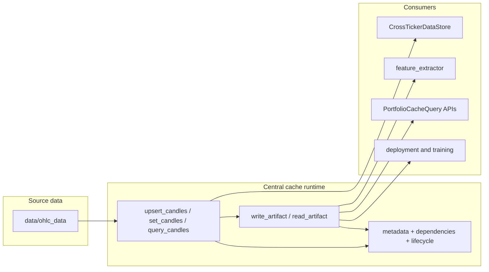

# Central Cache Architecture

> [!note] Status
> Implemented runtime cache design for candles, derived artifacts, cross-ticker lookups, and cache-native portfolio queries.

## Purpose

The central cache is the one runtime-owned storage facade for:

- OHLCV candles keyed by `(ticker, timeframe)`
- derived artifacts keyed by `ArtifactDescriptor`
- coverage, lifecycle, and revision metadata
- cache-backed adapters used by feature extraction, portfolio queries, and cross-ticker node access

It does **not** replace the repository source dataset in `data/ohlc_data`. That folder is a bootstrap and integration-test input only; operational reads and writes happen through the central cache after an explicit bootstrap step.

## Canonical Ownership

All cache-owned logic lives under `utils/cache/runtime/` (implementation). The package's
public surface is re-exported from `utils/cache/__init__.py`, so prefer
`from utils.cache import …` for public symbols and `utils.cache.runtime.<module>` when you
need a module-internal helper directly.

| Area | Canonical location | Responsibility |
|---|---|---|
| Cache facade | `utils/cache/runtime/central_cache.py` | Public read/write/query service (`CentralCacheStore`) |
| Request and metadata models | `utils/cache/runtime/central_cache_models.py` | Descriptors, scopes, lookup modes, coverage records |
| Error contracts | `utils/cache/runtime/central_cache_errors.py` | Typed miss, coverage, lifecycle, and revision errors |
| Cross-ticker adapter | `utils/cache/runtime/cross_ticker_store.py` | Cache-backed candle lookups for bias nodes and helpers (`CrossTickerDataStore`) |
| Feature helpers | `utils/cache/runtime/feature_pipeline_support.py` | Shared cache helpers extracted from feature extraction |
| Per-node bias cache | `utils/cache/runtime/bias_node_cache.py` | `BiasNodeCache` parquet read/write for a single bias-node series |
| Cache orchestration | `utils/cache/runtime/cache_manager.py` and `utils/cache/runtime/bootstrap_source_candles.py` | `CacheManager`, explicit bootstrap, and vault artifact preflight |
| Portfolio materialization | `utils/cache/runtime/portfolio_materialization.py` | Portfolio/base-model prediction parquet writes and cleanup |
| Live refresh orchestration | `utils/cache/runtime/live_cache_refresh.py` | Async LIVE candle-write fanout into bias refresh and portfolio/base-model materialization |
| Public exports | `utils/cache/__init__.py` | Stable import surface |

> [!note] Import-path reality
> `utils/cache/` contains **only** `__init__.py` and the `runtime/` subpackage today — there
> are no top-level `utils/cache/<module>.py` shim files. A compatibility wrapper for the
> cross-ticker store does exist, but at `utils/data/cross_ticker_store.py`, which re-exports
> the canonical `utils.cache.runtime.cross_ticker_store` symbols.

## Code vs on-disk cache

The `utils/cache/` tree is **only** Python: `runtime/` holds the real modules and
`__init__.py` is the public re-export surface. **Do not** write parquet, bias-node module
folders, or other cache data here—those belong under **`.cache/trading_algo/central_cache/`**
(see Storage Boundary below). That keeps source separate from mutable runtime state under
**`.cache/trading_algo/central_cache/`**; that path may be committed when the team wants a
shared cache snapshot (it is not git-ignored by default).

## Storage Boundary

| Storage class | Default path | Policy |
|---|---|---|
| Source candles | `data/ohlc_data` | Bootstrap and integration-test dataset only; do not write runtime cache data here |
| Runtime candles | `.cache/trading_algo/central_cache/candles` | Writable cache state |
| Live artifacts | `.cache/trading_algo/central_cache/artifacts/live` | Durable runtime artifacts used by live and deployment paths |
| Research artifacts | `.cache/trading_algo/central_cache/artifacts/research` | Disposable local artifacts safe to prune |
| Portfolio materializations | `.cache/trading_algo/central_cache/materialized/<scope>` | Parquet outputs for `GlobalPortfolio` and active base-model members |
| Live refresh status | `.cache/trading_algo/central_cache/live_refresh/last_run.json` | Last async live-refresh run summary for ops/debugging |

This separation is intentional:

- `data/ohlc_data` remains the bootstrap boundary
- `.cache/trading_algo/central_cache` is the runtime mutation and query boundary
- research artifact cleanup must never remove source candles or live artifacts

## System Shape

## Core Contracts

### Candles

- Written with `CentralCacheStore.upsert_candles(ticker, timeframe, candles)` for normal runtime updates
- Written with `CentralCacheStore.set_candles(ticker, timeframe, candles)` for full snapshot replacement
- Read with:
  - `query_candle(...)` for one bar
  - `query_candles(...)` for a range
- Coverage is explicit. Out-of-range requests raise `CacheCoverageError`.
- Missing bars or unloaded series raise `ArtifactMissingError`.

### Artifacts

- Identified by `ArtifactDescriptor`
- Written with `write_artifact(descriptor, data, depends_on=...)`
- Read with `read_artifact(descriptor, request=CacheRequest(...))`
- Stored with metadata:
  - coverage window
  - lifecycle state
  - revision
  - source revision
  - candle dependencies

### Scopes

- `ArtifactScope.LIVE` for production-backed artifacts
- `ArtifactScope.RESEARCH` for disposable local experiments

Research artifacts can be:

- promoted with `promote_artifact(...)`
- deleted with `prune_scope(ArtifactScope.RESEARCH)`

## Failure Semantics

The central cache is fail-fast by design. Callers should handle typed exceptions instead of relying on silent fallback.

| Error | Meaning | Typical caller action |
|---|---|---|
| `ArtifactMissingError` | Requested candle/artifact row is absent | Load or materialize the missing data |
| `CacheCoverageError` | Stored coverage does not span the requested range | Extend ingest/materialization coverage |
| `ArtifactLifecycleError` | Artifact exists but is stale/rebuilding/failed | Rebuild or promote a fresh artifact before reading |
| `SourceRevisionConflictError` | Incoming artifact write is based on stale source data | Recompute from the current candle revision |

Compatibility-only APIs may still preserve older behavior, for example `CrossTickerDataStore.get_candle()` returning `None`, but the canonical cache contract uses typed errors.

## Revision And Invalidation Model

The cache tracks causal lineage rather than treating parquet files as anonymous blobs.

1. Candle writes increment the candle revision for `(ticker, timeframe)`.
2. Artifact writes record `depends_on` and `source_revision`.
3. Updating candles marks dependent artifacts `STALE`.
4. Reading a stale artifact raises `ArtifactLifecycleError`.
5. Rebuilding the artifact writes a fresh record with the new source revision.

This keeps cache-native reads aligned with source updates and avoids silent drift between candles and derived artifacts.

### Inference vs fitting (live vs research)

The cache distinguishes **lineage and staleness** (what must be recomputed when candles change) from **what kind of recomputation** is appropriate:

| Kind | Typical operations | When it runs |
|------|-------------------|--------------|
| **Inference** | Extend or refresh **bias** artifacts from candles using fixed node specs; **predict** base models with **fitted** vault state; **predict_from_cache** on the portfolio with **already-fitted** weights | After new OHLC in **live** (or when you need a forecast for the latest bar); also batch refresh for backtests |
| **Fitting** | `fit_from_cache` on portfolios, base model `fit`, vault saves, weight-layer estimation | **Research** and scheduled refits—not part of the routine “new bar arrived” loop |

When **live** trading ingests a new or corrected bar, you need an up-to-date **forecast**, which implies running the **inference** chain for the deployed ensemble: **bias outputs → base-model predict → portfolio predict**. That work is **required** for the next prediction whether or not it is triggered automatically; it is **not** the same as **refitting** the portfolio or base models on every tick.

**Implementation note:** Orchestration (candles → materialize stale bias → predict) may live in the **live / deployment** path rather than inside every `upsert_candles` call, so research jobs that only touch candles are not forced to fan out the full live pipeline. The **contract** remains: stale derived artifacts must be refreshed (or computed on read) before they are treated as current; **fitting** stays an explicit, separate lifecycle.

## Downstream Integration

### Cross-ticker nodes

- `utils/cache/runtime/cross_ticker_store.py` is the canonical adapter (`CrossTickerDataStore`); `utils/data/cross_ticker_store.py` is a compatibility re-export
- same-timeframe lookups should use exact timestamps
- causal cross-timeframe reads should use as-of semantics

### Feature extraction

- `feature_extraction/feature_extractor.py` remains the entrypoint (`extract_features_for_bias_node`)
- cache-specific helper logic lives in `utils/cache/runtime/feature_pipeline_support.py` (the feature extractor binds its `_build_bias_node_descriptor` / `_preload_cross_ticker_data` to those helpers)
- cache reads should not silently downgrade into an uncached recomputation path
- **`feature_research`:** `populate_cache_if_needed` (`feature_research/in_sample/data_loader.py`) always runs before cache-backed extraction; `ResearchConfig` has no opt-out flags for central-cache usage

### Portfolio APIs

- `ensemble/portfolio.py` exposes `PortfolioCacheQuery`
- `TFPortfolio` and `GlobalPortfolio` support `fit_from_cache(...)` and `predict_from_cache(...)`
- `discover_ensemble_dirs_in_vault(...)` and `build_global_portfolio_from_ensemble_dirs(...)` assemble a `GlobalPortfolio` from working-vault ensemble paths
- `materialize_global_portfolio_predictions(...)` writes portfolio and base-model parquet outputs under `.cache/trading_algo/central_cache/materialized/<scope>/` (base-model files are named by a SHA-256 identity hash; see [[Vault/portfolio_snapshots_and_predictions]])
- `prune_inactive_base_model_materializations(...)` scans the current working vault and removes stale base-model parquet files only
- volatility lineage is resolved from cached EWSD artifacts rather than caller-supplied `daily_volatility_df`
- `portfolio_research/run_portfolio_test.py` bootstraps its exact candle dependencies from `data/ohlc_data`, then performs vault schema migration and cache preflight before loading ensembles

### Vault cache preflight

- `CacheManager.bootstrap_source_candles(...)` (in `utils/cache/runtime/cache_manager.py`) is the canonical bootstrap entrypoint; `bootstrap_source_candles(...)` exported from `utils.cache` is a thin module-level wrapper around it
- there is **no** `ingest_source_candles` symbol in the current code
- `CacheManager.ensure_vault_cache_coverage(...)` is the canonical refresh entrypoint; internally it delegates to `CacheManager.ensure_bias_cache_coverage(...)`
- `ensemble.vault_manager.ensure_vault_cache_coverage(...)` is a thin wrapper for ensemble-oriented callers (`ensemble/vault_manager.py` is itself a `__getattr__` shim over `ensemble.vault.manager`)
- the refresh flow reads current vault feature files (`<vault_root>/<TF>/<group>/<ensemble>/features/*.json` when nested, or legacy `<vault_root>/<TF>/<ensemble>/features/*.json`) instead of older control-file assumptions
- refresh assumes the required candle coverage already exists in the central cache; it does not auto-ingest from `data/ohlc_data`
- the portfolio research runner is one explicit caller that performs bootstrap first, then invokes the refresh flow
- all vault-selected artifacts use `ArtifactDescriptor(family="bias", scope=ArtifactScope.LIVE, ...)`
- daily EWSD artifacts are treated as required dependencies for cache-native portfolio queries

### Live and training flows

- bootstrap writes candles into the cache explicitly
- downstream readers query the cache by datetime or range
- backtest, training, and live should reuse the same read contracts wherever practical
- **live:** after `upsert_candles` / `set_candles` with `ArtifactScope.LIVE`, the async live-refresh orchestrator can fan out the inference chain (vault-selected bias artifacts → base-model materialization → portfolio materialization) for the deployed manifest set; **fitting** stays out of band
- **research / batch:** explicit preflight (`ensure_vault_cache_coverage`) and portfolio **`fit_from_cache`** apply to research windows and refits, not to each live tick

### Automatic live refresh

- `deployment/config/live_cache_refresh.json` is the explicit source of truth for the active live set
- only dirty `(ticker, timeframe)` keys tracked by that manifest participate
- the orchestrator is in-process, async, best-effort, and single-worker
- repeated writes are coalesced with a debounce window
- each run computes a bounded replay window from the latest common available candle end across the portfolio's tracked timeframes
- failures do not block candle writes; they are recorded in `live_refresh/last_run.json` and the dirty keys remain queued for a later retry-triggering write
- "base-model cache" in this context means the materialized base-model prediction parquet store, not fitted state

## Maintenance Rules

- New cache-related runtime logic belongs under `utils/cache/runtime/`; expose new public symbols by adding them to `utils/cache/__init__.py`.
- Any compatibility re-exports should stay thin and compatibility-focused.
- Do not write runtime cache files into `data/`.
- Prefer `ArtifactDescriptor` plus typed requests/errors over ad hoc path conventions.
- Keep cache docs updated in `docs/library/Cache/`.
- Keep repository source bootstrap and vault cache preflight separate: source candles live under `data/ohlc_data`, runtime writes live under `.cache/trading_algo/central_cache`.
- Portfolio cleanup only removes inactive base-model materializations; historical portfolio parquet files are retained.

## Related

- [[Cache/user_guide]] — quick-start usage examples
- [[Vault/architecture]] — vault-specific persistence and snapshot architecture
- [[Vault/user_guide]] — vault-specific practical guide
- [[Deployment/live_cache_refresh]] — live manifest contract and operational recovery flow
- [[portfolio]] — cache-native portfolio entrypoints
- [[multi_timeframe]] — forecast alignment across timeframes
- [[live_multi_timeframe]] — live orchestration with cache-native queries
- [[pipeline]] — feature extraction and research workflow context

> _Verified against commit a07b6bf on 2026-06-04 (docs Phase A)._
