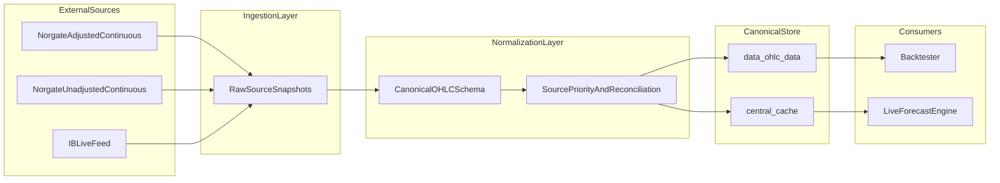

# Canonical Market Data Architecture

## Layered data flow

## Why this exists

Raw providers disagree on schema, roll conventions, timestamps, and data quality. A canonical layer prevents strategy code from depending on source-specific assumptions.

## Canonical policy

- Canonical daily futures history anchor is **Norgate adjusted continuous**.
- IB is live-gap updater and fallback source, never an unbounded overwrite of overlapping history.
- Reconciliation policy is configured in `deployment/config/canonical_source_priority.json` and loaded by `utils/data/source_reconciliation.py`.

## IB append reconciliation (mandatory)

Every IB daily append into central cache applies:

1. **Append-only date filter**: keep sessions strictly after current cache end date.
2. **Ratio junction adjustment**: multiply incoming OHLC by `anchor_close / first_new_ib_close`.
3. **Derived timeframe rebuild**: regenerate monthly from reconciled daily candles.

Implementation:

- `utils/cache/runtime/ib_candle_ratio_align.py`
- `scripts/enigma_live_forecast.py` (`upsert_tws_candles`)

This prevents hidden scale discontinuities at source splice boundaries.

## SaaS parity

SaaS uses the same pattern and policy. See `docs/SaaS/data_source.md` for SaaS-oriented framing of the same architecture.
