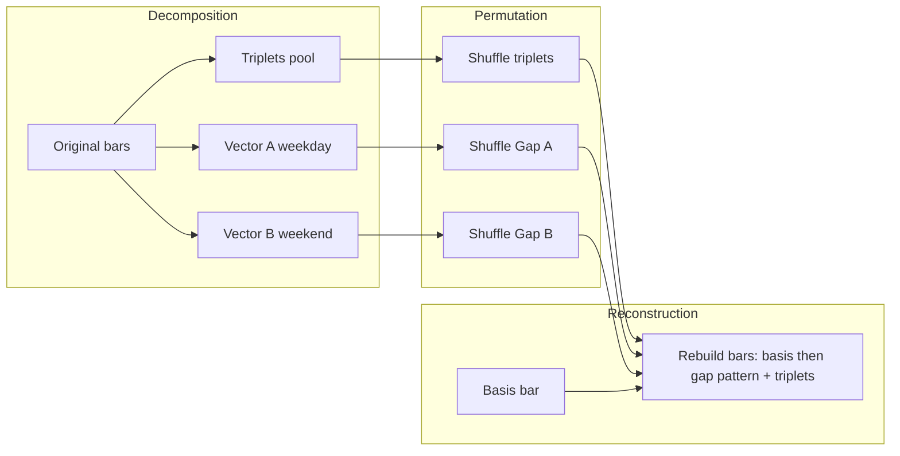
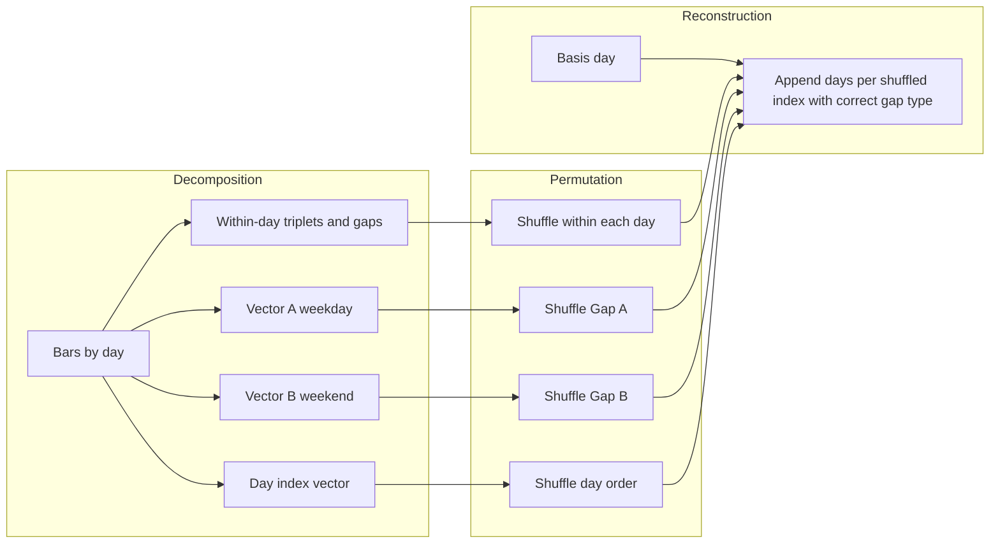

# Candle-Based Permutation Test Specification

**Version**: 1.0.0  
**Date**: 2025-02-10  
**Status**: Specification (Design)  
**Scope**: Candle permutation algorithms for permutation testing. Implementation may live under `utils/permutation_test/` (e.g. new classes or refactors of `BarPermute`). No changes to the feature permutation engine or `FeatureValidator` API.

---

## Table of Contents

1. [Objectives and Guarantees](#1-objectives-and-guarantees)
2. [Version A: Daily (and Higher) Bar Permutation](#2-version-a-daily-and-higher-bar-permutation)
3. [Version B: Intraday Bar Permutation](#3-version-b-intraday-bar-permutation)
4. [Gap Taxonomy for ES M15 (and Similar)](#4-gap-taxonomy-for-es-m15-and-similar)
5. [Datetime and Bar Identity](#5-datetime-and-bar-identity)
6. [API and Integration](#6-api-and-integration)
7. [Limitations and Known Effects](#7-limitations-and-known-effects)
8. [Implementation Scope](#8-implementation-scope)
9. [Alignment with Timothy Masters](#9-alignment-with-timothy-masters)

---

## 1. Objectives and Guarantees

### Goal

Destroy predictable patterns in price history while preserving:

- **Intra-bar structure**: Each bar’s range and net move (triplets) remain statistically representative.
- **Inter-bar gap distributions**: Gaps are re-used but not mixed across incompatible contexts (e.g. weekend vs weekday).
- **For intraday**: Daily net changes and gap structure are preserved so the data does not become artificially homogeneous.

### Invariants (Both Variants)

| Invariant | Description |
|-----------|-------------|
| **Trend preservation** | The **first open** and **last close** of the reconstructed series equal the original. The global market direction over the full series is unchanged. |
| **Relative quantities only** | No absolute-price shuffling. Only relative quantities—intra-bar triplets and inter-bar gaps—are permuted and recombined. |

---

## 2. Version A: Daily (and Higher) Bar Permutation

**Applicability**: Bars at daily (D), weekly (W), monthly (M), or any timeframe where each bar represents a full trading day or longer, with a 24/5 (weekdays-only) schedule.

### 2.1 Decomposition

- **Intra-bar (triplets)**: For each bar, store the triplet relative to the bar’s Open:
  - \( H - O \), \( L - O \), \( C - O \).
- **Inter-bar (gaps)**: For each transition from bar \( i-1 \) to bar \( i \), store:
  - \( \text{gap}_i = \text{Open}_i - \text{Close}_{i-1} \).

### 2.2 Gap Categorization (24/5)

To avoid placing a large weekend-style gap in the middle of a weekday (an “unnatural price artifact”), use two separate gap vectors:

| Vector | Description | Typical size |
|--------|-------------|--------------|
| **Vector A — Weekday transitions** | Gaps for Mon→Tue, Tue→Wed, Wed→Thu, Thu→Fri. | Small (sessions open near prior close). |
| **Vector B — Weekend gaps** | Gap for Fri close → Mon open. | Can be large. |

- Shuffle **Vector A** and **Vector B** independently. Do not mix values between the two pools.

### 2.3 Reconstruction

1. **Basis bar**: The first bar of the original series is fixed (anchor). Its OHLC and triplet are unchanged.
2. **Chronological order**: Rebuild bars in strict time order. For each subsequent bar:
   - Choose the **next** gap from the appropriate pool: **weekday** (Vector A) for the first four bars after a Monday, then **weekend** (Vector B) for the next bar (the “Monday” in the reconstructed sequence). Pattern: four weekday gaps, then one weekend gap, repeat.
   - Set \( \text{Open} = \text{previous Close} + \text{chosen gap} \).
   - Assign a **shuffled** triplet to this bar: set High, Low, Close from \( \text{Open} + \text{triplet} \).
3. **Triplet shuffle**: Triplets are taken from a **single global pool** of all daily-bar triplets, shuffled once. Each reconstructed bar (after the basis) receives one triplet from this shuffled pool in sequence. This preserves the distribution of daily volatility and bar shapes while scrambling which calendar day has which shape.

### 2.4 Diagram (Daily Variant)

---

## 3. Version B: Intraday Bar Permutation

**Applicability**: Sub-daily bars (e.g. M15, H1) with 24/5 continuous trading and known intraday breaks (e.g. CME maintenance). See [Section 4](#4-gap-taxonomy-for-es-m15-and-similar) for gap taxonomy.

**Core idea**: Preserve **daily net change** and **gap structure** while destroying predictability. The algorithm works with **three elements**: (1) **days** as modular blocks (each day internally shuffled and zero-anchored), (2) **day gaps** — the overnight/maintenance gap between consecutive trading days (Mon→Tue, Tue→Wed, etc.), which acts as the **divider between days**, and (3) **weekend gaps** — Fri close → Mon open. Reconstruction alternates: after the genesis (basis) day, select a **day gap**, then append a **shuffled day**; repeat with day gaps until the sequence hits a weekend, then use a **weekend gap** before the next day. This shuffles the order of days while keeping each day's intraday net return unchanged.

### 3.1 Phase 1 — Decomposition (Preparation)

Before any shuffling, prepare the data so reconstruction is mathematically sound:

1. **Identify the basis day**: The first **day** of the series is set aside and **remains unpermuted** (we do not permute the prices/bars in the basis day). It anchors the reconstruction and defines the "genesis" bar.
2. **Group bars by day**: Assign each bar to a “day” (e.g. calendar day in the exchange’s timezone, excluding weekends). For 24/5, a “day” is one weekday of continuous trading.
3. **Relative values**:
   - For every bar: compute the intra-bar triplet \( (H-O, L-O, C-O) \).
   - For every **within-day** transition: inter-bar gap \( \text{Open} - \text{previous Close} \).
   - For every **between-day** transition: overnight gap \( \text{Open of day } n - \text{Close of day } n-1 \).
4. **Gap categorization (two-vector)**:
   - **Vector A — Weekday overnight**: Mon→Tue, Tue→Wed, Wed→Thu, Thu→Fri (small).
   - **Vector B — Weekend gap**: Fri close → Mon open (large).
   - Shuffle Vector A and Vector B **separately**; never place a weekend-sized gap between two weekdays.
5. **Anchor days**: For each non-basis day, subtract that day’s Open from all internal prices so the day “opens at zero” for internal permutation. This allows within-day shuffling without changing the day’s net move.
6. **Index vector**: Create an index vector \( (0, 1, 2, \ldots) \) with one index per day.

### 3.2 Phase 2 — Permutation

1. **Within-day**: For each day **except the basis day**, shuffle the **bars** (or their triplets and within-day gaps) **within that day only**. This preserves that day’s net change and internal volatility distribution while destroying intraday sequence. (The basis day is left unchanged.)
2. **Overnight gaps**: Shuffle Vector A (weekday) and Vector B (weekend) independently.
3. **Day order**: Shuffle the **index vector** so the chronological order of days is randomized (e.g. original order Day X, Y, Z becomes Z, X, Y). This destroys multi-day trends and volatility clumping.

### 3.3 Phase 3 — Reconstruction

1. **Start with the basis day**: Output the basis day’s bars **unchanged**. Its first bar’s Open is the series’ first open (preserved).
2. **Reconstructed chronology**: For each **position** in the new chronology (second day, third day, …):
   - The **day** to append is given by the shuffled index vector (e.g. position 2 might get “original day 7”).
   - The **gap** to apply is the next value from the **appropriate** pool: **weekday** (Vector A) for positions that correspond to Tue–Fri in the reconstructed week, **weekend** (Vector B) for positions that correspond to “Monday” (first day after a weekend in the new order). Pattern: after the basis day, use four weekday gaps then one weekend gap, then repeat.
   - New day’s Open = previous day’s Close + chosen gap.
   - Append that day’s (shuffled) within-day bars, with all prices **adjusted** so the day opens at the computed Open (add the Open to the zero-anchored bar prices).
3. The **last close** of the reconstructed series is the last close of the last appended day; by construction it equals the original series’ last close (trend preservation).

### 3.4 Alternative: Weekly Block (Strategy A)

Instead of permuting **days**, treat the full Monday–Friday week as one **block**:

- **Intra-week**: Use bar-level permutation (triplets + within-week gaps) for the continuous five-day block so internal structure is randomized but the week’s net change is preserved.
- **Inter-week**: The “overnight” gap vector contains **only weekend gaps**. Permute this vector and permute **weeks** (block order). Reconstruction: output weeks in shuffled order, inserting a shuffled weekend gap between each pair of weeks.

This avoids weekday/weekend gap mixing by design; only weekend gaps are ever placed between blocks.

### 3.5 Diagram (Intraday Variant)

---

## 4. Gap Taxonomy for ES M15 (and Similar)

For instruments like ES (E-mini S&P) on M15 with 24/5 and known breaks, gaps fall into distinct types. We use **two dedicated vectors** (maintenance and weekend) and treat all other gaps as **regular gaps for that day**. Permutation should **not** mix dedicated gap types so that a large weekend or maintenance gap is never inserted where it would “almost never happen in real life.”

### 4.1 Observed Gap Distribution (Reference)

From analysis of ES M15 (2009–2023, 315,122 bars, 6,317 gaps):

| Last bar before gap (hour) | # Gaps | Interpretation |
|----------------------------|--------|----------------|
| 17:xx | 1,349 | Daily maintenance — 17:15→18:00 (45 min). CME daily break. |
| 16:xx | 4,841 | Weekend (Fri 16:xx→Mon 00:00) or same-day 16:00→16:30 (30 min). |
| 12:xx | 57 | Early close / holidays (e.g. 12:45→18:00). |
| 13:xx | 31 | Early close / holiday (e.g. 13:15→next Monday). |
| 11:xx | 27 | Thanksgiving-style early close (11:15→18:00). |
| 09:xx | 8 | Long weekend / holiday (e.g. Good Friday 09:00→Monday). |
| 02:xx, 03:xx, 05:xx, 19:xx | 1 each | One-off (e.g. 2020-03-16, 2019-02-26). |

### 4.2 Simplified Model: Two Dedicated Vectors + Regular Gaps

We build **only two dedicated gap vectors**; all other gaps are treated as **regular gaps for that day** (one pool, or left fixed).

| Vector | Description | Permutation rule |
|--------|-------------|------------------|
| **Maintenance** | 17:15→18:00 (CME daily break). The divider between consecutive trading days. | Dedicated vector; shuffle only with other maintenance gaps. Used when reconstructing the transition from one day's last bar to the next day's first bar. |
| **Weekend** | Fri close → Mon open. | Dedicated vector; shuffle only with other weekend gaps. Used only when the reconstructed sequence has a Friday→Monday transition. |
| **Regular gaps** | All other gaps: weekday overnight (Mon→Tue, etc.), same-day small gaps (e.g. 16:00→16:30), early close (11:xx, 12:xx, 13:xx), long weekends/holidays (09:xx→Monday), one-offs (02:xx, 03:xx, 05:xx, 19:xx). | Treat as one category: either a single "regular" gap pool used where a non-maintenance, non-weekend transition is needed, or leave structure fixed. No dedicated vector. |

**Caveat**: Folding early-close and holiday gaps into "regular" means that occasionally a **holiday-sized gap** might land in a normal session. For many tests this is an acceptable simplification. If a test must never place a large holiday-style gap on a normal weekday, keep a **third dedicated vector** (early-close) and shuffle it only with other early-close gaps; the spec then uses three vectors (maintenance, weekend, early-close) instead of two.

### 4.3 Classification

Gap type is determined by:

- **Weekend**: Last bar before the gap is on **Friday** and next bar is **Monday** → Weekend vector.
- **Maintenance**: Last bar before the gap is at **17:xx** (e.g. 17:15→18:00 same calendar day) → Maintenance vector.
- **Regular**: Everything else (weekday overnight, 16:00→16:30, early close, long weekend, one-offs) → Regular gap pool for that day.

Implementation may use a **session template** or config that maps (day-of-week, time) → gap type. When reconstructing, assign the next gap from the **maintenance** vector at each day boundary (except weekend), and from the **weekend** vector at each Friday→Monday boundary; use the **regular** pool (or fixed structure) for any other transitions as needed.

---

## 5. Datetime and Bar Identity

**Critical**: Permutation must **not** shuffle the **datetime** column together with OHLC in a way that pairs arbitrary timestamps with arbitrary prices. That would create spurious correlations for time-based features.

- **Reconstruction**: After rebuilding OHLC from triplets and gaps, assign **new** timestamps so that the **order** of bars matches the **order** of timestamps. For example: first reconstructed bar gets the first timestamp in the output sequence, second bar gets the second, and so on. The timeline is thus consistent with the new bar order.
- **Existing behavior**: The current `BarPermute` in `utils/permutation_test/permute_bars.py` (lines 199–228) preserves the **original sequential** datetime column and restores it after OHLC reconstruction, so that datetime is not tied to shuffled OHLC. The same principle applies here: datetimes should reflect the **reconstructed** sequence (e.g. re-use a sequential timeline of the same length), not the original bar’s timestamp.

---

## 6. API and Integration

### 6.1 Inputs

- **OHLC + datetime** DataFrame (columns: `open`, `high`, `low`, `close`, `datetime`).
- **Optional**: `permute_start_idx` (or equivalent) to leave an initial segment unpermuted (e.g. warmup).
- **For intraday**: Session or trading calendar / gap rules (or config) to classify gaps; optional timeframe/symbol for default rules.

### 6.2 Output

- DataFrame with same columns and **same length**.
- **First open** and **last close** equal to the original (trend preservation).
- **Datetimes**: Sequential and consistent with the new bar order (see [Section 5](#5-datetime-and-bar-identity)).

### 6.3 Where It Plugs In

- Used by **bar permutation tests** (e.g. `bar_permutation_test`, or a walk-forward bar permuter) that re-extract features from permuted candles and compare metrics to the original.
- No change to the feature permutation engine (`permutation_engine.py`) or `FeatureValidator.walkforward_permutation_test` is required; this spec defines the **candle permutation contract** only.

---

## 7. Limitations and Known Effects

| Effect | Description |
|--------|-------------|
| **Volatility clumping** | Shuffling day (or week) order scatters volatility in time. Systems that rely on **volatility clustering** may behave differently on permuted data than on real data. This is a known limitation of the method. |
| **Homogeneity** | A single flat shuffle of all bars (no day structure) would tend to make daily ranges too similar. The **intraday** variant avoids this by preserving daily net change and gap structure. |
| **Basis bar/day** | The first bar (or first day) is fixed. Sensitivity to that choice is minimal but non-zero. |

---

## 8. Implementation Scope

- This document is **design only**. No implementation is required as part of this spec.
- Implementation may introduce, for example:
  - `DailyBarPermute`: Implements [Section 2](#2-version-a-daily-and-higher-bar-permutation) (triplets, Vector A/B, reconstruction pattern).
  - `IntradayBarPermute`: Implements [Section 3](#3-version-b-intraday-bar-permutation) (day grouping, within-day shuffle, day-order shuffle, two gap vectors, reconstruction).
- A single entry point with a **mode** (e.g. `BarPermutationMode.DAILY` vs `BarPermutationMode.INTRADAY`) is an alternative.
- The existing `BarPermute` in `utils/permutation_test/permute_bars.py` is a **flat** bar permutation (single gap pool, no day structure). It may be retained for simple cases or refactored to delegate to the daily/intraday variants where appropriate.

### 8.1 Unit Tests

Implementation should include **robust unit tests** that verify:

- **Decomposition**: Triplets and gaps are computed correctly (e.g. first open and last close preserved before any shuffle; sum of gaps and net move consistent with original).
- **Reconstruction**: Output has same length as input; first open and last close equal the original (trend preservation); OHLC invariants (high ≥ open, close; low ≤ open, close) hold for every bar.
- **Gap vectors**: For daily/intraday, weekday gaps and weekend gaps are never mixed (e.g. weekend gap only appears at Friday→Monday positions in the reconstructed sequence).
- **Reproducibility**: With a fixed random seed, repeated permutation yields the same output.
- **Edge cases**: Empty or single-bar input; basis bar / basis day unchanged; permute_start_idx (or equivalent) leaves the initial segment unpermuted.

### 8.2 Visualizer

A **simple visualizer** should be provided to help verify that permutation is working correctly. It should allow comparing original vs permuted series (e.g. overlaid or side-by-side price plots over a chosen window), so that:

- Trend preservation (same first open, last close) can be checked visually.
- Day order shuffle (intraday) or bar order shuffle (daily) is apparent (e.g. different sequence of moves).
- No obvious artifacts (e.g. impossible OHLC, or a weekend-sized gap in the middle of a weekday).

The visualizer can be a small script or notebook that takes OHLC + datetime, runs one or more permutations (with optional seed), and plots original and permuted series; it does not need to be part of the core library API.

### 8.3 OOP Design and Performance

**Base class and timeframe-based dispatch**

- Provide a **simple base class** that performs permutation given:
  - A DataFrame of candles (OHLC + datetime),
  - The **timeframe** of those candles (e.g. D, W, M for daily-and-higher; M15, H1, etc. for intraday).
- Based on the timeframe, the implementation **dispatches to the correct permutation variant**:
  - **Daily and higher** (D, W, M): Use [Section 2](#2-version-a-daily-and-higher-bar-permutation) (triplets, Vector A/B, reconstruction pattern).
  - **Sub-daily** (M15, H1, etc.): Use [Section 3](#3-version-b-intraday-bar-permutation) (day grouping, within-day shuffle, day-order shuffle, maintenance/weekend gap vectors, reconstruction).
- The public API can be a single entry point, e.g. `permute(candles_df, timeframe, *, seed=None, permute_start_idx=0)`, with the base class (or a small factory) selecting the appropriate strategy internally. No need for the caller to choose daily vs intraday explicitly.

**Performance: optimize for speed**

- Permutation must be **highly performant** so that many replications (e.g. hundreds or thousands) remain feasible in bar permutation tests. Optimize aggressively.
- **Prefer vectorized operations**: Use **NumPy** (or similar) for all bulk operations on OHLC and gap/triplet arrays. Avoid Python-level loops over bars where possible (e.g. compute triplets and gaps in vectorized form; reconstruction in vectorized form or tight loops over pre-allocated arrays).
- **Consider Cython or Numba**: For hot paths (decomposition, shuffle application, reconstruction), consider **Cython** (typed memoryviews, no-GIL where safe) or **Numba** JIT so that inner loops run at native speed. Random shuffling and index permutation can stay in NumPy; the price reconstruction loop is a good candidate for compilation if it still dominates runtime.
- **Allocate once**: Pre-allocate output arrays (open, high, low, close) to the required length; avoid repeated concatenation or DataFrame row-by-row growth. Work on contiguous arrays and build the output DataFrame from them at the end.
- **Minimal copies**: Where possible, avoid copying full OHLC columns until necessary (e.g. extract to numpy once, permute in place or into a pre-allocated buffer, then assign back). For intraday, group bars by day using integer indices or slices rather than copying bar data until reconstruction.
- **Shuffle indices, not data**: Shuffle **indices** (for triplets, gaps, day order) and then gather from the original arrays; avoid shuffling large blocks of float data.

Implementation may start with a pure NumPy version for correctness and tests, then introduce Cython or Numba for the critical loops if profiling shows the need. The spec does not mandate a specific tool (NumPy vs Cython vs Numba) but requires that the design prioritize speed and that hot paths be implemented in a way that can be accelerated (e.g. small, pure functions over arrays that are amenable to Numba or Cython).

---

## 9. Alignment with Timothy Masters

This specification follows the algorithms described in Timothy Masters’ *Core Algorithms* chapter on permutation (see `docs/to-do/candle_permutation_chapter.md` for extracted text). The following alignment confirms that our logic matches the book; our additions are explicit extensions for 24/5 schedules.

### Bar permutation (Section 2 — Daily)

| Book (Permuting Bars, pp. 31–36) | This spec |
|----------------------------------|-----------|
| Preserve intra-bar distribution via triplets: **high − open**, **low − open**, **close − open**. Permute these triplets. | Section 2.1: same triplet definition; triplets shuffled in a single global pool. ✓ |
| Inter-bar: use **close of one bar to open of next bar** (not open-to-open) to avoid “unnatural price artifacts”; permute this array. | Section 2.1: gap = Open_i − Close_{i−1} (same quantity). ✓ |
| First bar open and last bar close equal across permutations (preserve global trend); first bar can be identical (basis bar). | Section 2.3: basis bar fixed; trend preservation in Section 1. ✓ |
| Reconstruct: start with first bar; add to its close the first permuted inter-bar value → open of next bar; then open + permuted triplet → high, low, close; repeat. | Section 2.3: same reconstruction. ✓ |
| *(Book uses a single gap pool.)* | **Extension**: For 24/5 we use **two gap vectors** (weekday vs weekend) and draw from the appropriate pool when reconstructing, so a large weekend gap is never placed between weekdays. This matches the book’s “night sessions” idea (p. 40): two gap types, shuffle separately, use the correct one when rebuilding. |

### Intraday permutation (Section 3)

| Book (Permuting Intraday Data, pp. 37–39) | This spec |
|------------------------------------------|-----------|
| Basis day, then overnight gap, then first permuted day, then overnight gap, etc. | Section 3 core idea and Phase 3: same sequence (basis → gap → day → gap → day …). ✓ |
| “We do not permute the prices/bars in the basis day.” | Section 3.1 & 3.2: basis day remains unpermuted; within-day shuffle is for each day **except the basis day**. ✓ |
| Compute vector of overnight gaps (close of one day to open of next). Permute this gap vector. | Section 3.1 & 3.2: we capture overnight gaps and permute them; for 24/5 we split into **day-gap** and **weekend-gap** vectors and permute each separately. ✓ |
| “Subtract the open of each day from all prices in that day” so each day “opening at zero.” | Section 3.1 step 5: “Zero out the days” (anchor days) — same. ✓ |
| Permute an index vector; rebuild by selecting the day identified by the first permuted index, add (prior close + first permuted gap) to its prices; repeat. | Section 3.3: same — append day from shuffled index, new Open = prior Close + chosen gap, add Open to zero-anchored block. ✓ |
| Within each day, “permute the data for that day using either the single price or the bar algorithm.” | Section 3.2: permute bars within each day (triplets + within-day gaps) so the day’s net move is preserved. ✓ |
| *(Book has one overnight gap vector.)* | **Extension**: We use **two** gap vectors (day gaps vs weekend gaps) and choose the gap type based on position in the reconstructed week (four weekday gaps then one weekend gap). Same idea as “Night Sessions” (p. 40): two gap types, two vectors. ✓ |

### Homogeneity and volatility (pp. 39, 32)

| Book | This spec |
|------|-----------|
| If we pooled all intraday changes we would get “homogeneity in daily ranges”; by permuting each day separately we “preserve the statistical distribution of daily net changes.” | Section 3.4 “Why This Method Is Superior”: same rationale. ✓ |
| “Redistribution of day range extremes” / “changes in intraday volatility will be scattered… instead of being clumped.” | Section 3.5 “Volatility Flaw” and Section 7: same limitation. ✓ |

### Summary

- **Daily (Section 2)**: Matches the book’s bar permutation (triplets, close-to-open gaps, basis bar, reconstruction). We add two gap vectors for 24/5 to avoid placing a weekend-sized gap mid-week.
- **Intraday (Section 3)**: Matches the book’s intraday algorithm (zero-out days, permute within each day except basis, permute overnight gaps, permute day index, rebuild with prior close + gap). We add two gap vectors (day vs weekend) and use the correct gap type when reconstructing, analogous to the book’s “Night Sessions” (two gaps, two index vectors).
- **Basis**: The book explicitly does not permute the basis day; the spec now states that the basis day remains unpermuted throughout.
