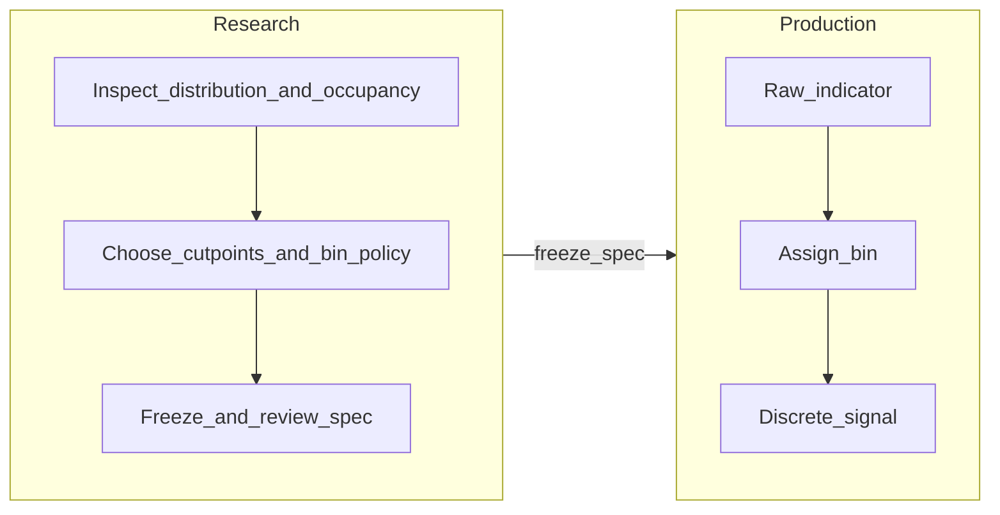

# Domain Discrete Signals

> [!warning] Canonical contract
> This page describes the frozen feature contract for new work: one source bias node, one explicit ticker scope, one frozen signed-signal policy, and no runtime learning of bin geometry. The output contract is `-1 / 0 / +1` and the persisted artifact is a frozen `DomainDiscreteSpec`.

## Motivation

**Occam's razor:** When a feature is meant to be structurally stable, learned geometry adds avoidable complexity. The cutpoints should be chosen in research and then frozen.

This architecture moves that complexity to research time:

- Choose absolute cutpoints with domain meaning.
- Freeze which bins map to long, short, or neutral.
- In production, run a pure transform: value → bin → signed signal.

## Two-Stage Pipeline

| Stage | Role |
|-------|------|
| **Research** | Inspect distribution, occupancy, and drift. Freeze `source_bias_node_spec`, `ticker_scope`, `edges`, `n_bins`, `long_bins`, `short_bins`, `direction`, and `spec_version` into one `DomainDiscreteSpec`. |
| **Production** | Deterministic mapping from indicator values to signed signals. Same code path on train, validation, test, and live. |

## What This Is Not

- **Not learned quantile binning:** Here, edges are chosen, not estimated at predict time.
- **Not a claim that "no statistics ever":** Research still uses targets, gates, and permutation where the methodology requires them. The simplification is no adaptive bin geometry in the trading path.

## Design Assumptions

- Features are scoped to families where occupancy is expected to stay broadly stable.
- If realized occupancy or economic behavior drifts enough to break the story, treat that as a version bump, not a silent refit.

## Ticker Scope

A discrete rule must declare which instruments it applies to: a single ticker or an explicit ticker group. Enforce applicability at registration or build time so the same column name cannot be wired to the wrong universe.

Prefer one parameterized recipe over copy-pasted modules when rules differ only by scope or thresholds.

## Placement In The Stack

Relationship to **bias nodes** ([[bias_nodes/creating_nodes]]):

- The frozen policy may live in a dedicated signal module or a generic wrapper node that combines indicator computation, absolute cutpoints, bin-to-sign mapping, and ticker scope metadata.
- Exact class names and package layout are implementation details; the invariant is one clear contract: inputs (OHLCV + params), outputs (discrete signal), and declared applicability.

Downstream, [[Ensemble/base_model]] and vault artifacts may still expect certain shapes for historical ensembles; new domain-discrete features should align with whatever **rule-based** or discrete contract the ensemble uses after migration.

## Operational Practices

- **Drift monitoring:** Compare bin occupancy to a frozen reference window. Use triggers for human review and versioning, not automatic edge refit.
- **Naming and versioning:** Encode scope and policy generation in feature naming so cache keys and vault rows remain unambiguous when cutpoints change.

## Coexistence With Legacy Paths

The persisted artifact is the frozen `DomainDiscreteSpec`. There is no production-time fit step for bin geometry.

## Related Docs

- [[Feature_selection/pipeline]] — full selection phases and gates
- [[Feature_selection/Features/feature_model]] — historical feature-model background
- [Feature research and validation](../../methodology/feature_research_and_validation.md) — research splits, freeze discipline, Occam workflow
- [[bias_nodes/creating_nodes]] — implementing bias nodes
