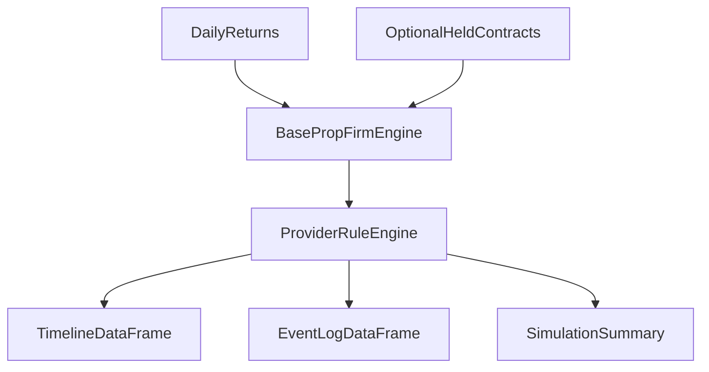

# Prop Firm Simulation

> **Scope:** Config-driven prop-firm lifecycle simulation from evaluation through funded payouts.

---

## Purpose

The new `prop_firms/` package models provider-specific challenge rules on top of a
simple daily return stream:

- input: a `pd.Series` of daily decimal returns
- optional input: a daily holdings DataFrame for contract/exposure checks
- output: a typed result containing a daily timeline, event log, and terminal summary

Unlike the legacy `utils/simulation/prop_firm_simulator/` package, this package is
provider-oriented. The base layer handles common simulation flow, while each provider
owns its own rule transitions.

---

## Architecture



Current provider support (each provider has a `provider.py` with `create_<firm>_simulator` /
`create_<firm>_portfolio_simulator` factories, a `rules.py` rule engine subclassing
`BasePropFirmEngine`, and a `config.json`):

- `prop_firms/lucid/` implements LucidFlex evaluation and funded-account behavior.
- `prop_firms/apex/` implements Apex Trader Funding 50K Tradovate EOD evaluation and PA behavior.
- `prop_firms/fundednext/` implements FundedNext (default preset used by the portfolio-test integration below).
- `prop_firms/mffu/` implements My Funded Futures (MFFU) rules.
- `prop_firms/topstep/` implements Topstep rules.
- `prop_firms/tradeday/` implements TradeDay rules.

Single-account simulation (`rules.py`) is available for **all six** providers. Multi-account
EV simulation (`portfolio_simulator.py`) is currently available for **Lucid**, **Apex**, and
**FundedNext**:

- `prop_firms/lucid/portfolio_simulator.py` — multi-account EV simulator for Lucid 25K accounts.
- `prop_firms/apex/portfolio_simulator.py` — Apex 50K multi-account EV simulator.
- `prop_firms/fundednext/portfolio_simulator.py` — FundedNext multi-account EV simulator.

Core package split:

- `prop_firms/base/models.py`: immutable configs, requests, timeline rows, events, summaries
- `prop_firms/base/enums.py`: shared enums (phases, statuses, event/breach reasons, payout/consistency rules)
- `prop_firms/base/simulator.py`: shared daily simulation shell (`BasePropFirmEngine`)
- `prop_firms/base/portfolio_models.py`: multi-account purchase-policy, payout-policy, timeline, EV summary, and `PortfolioSimulationConfig` contracts
- `prop_firms/base/return_engine.py`: synthetic Sharpe-path generation, external return replay, and volatility rescaling
- `prop_firms/base/statistics.py`: EV-style aggregate statistics across one or more runs
- `prop_firms/base/exposure.py`: optional contract and leverage checks
- `prop_firms/base/cfd_ladder_payout.py`: CFD-style ladder payout helpers
- `prop_firms/base/config_loader.py`: JSON loader for provider account definitions
- `prop_firms/<firm>/rules.py`: provider evaluation, funded, drawdown, payout, and scaling logic (one per provider)
- `prop_firms/<firm>/provider.py`: provider factory functions and account loaders
- `prop_firms/<firm>/config.json`: user-editable provider account definitions and fees
- `prop_firms/lucid/portfolio_simulator.py` / `prop_firms/apex/portfolio_simulator.py` / `prop_firms/fundednext/portfolio_simulator.py`: daily event-driven account-book simulators

---

## Lucid Coverage

The first implementation models the published LucidFlex rules:

- evaluation profit target by account size
- evaluation consistency check with the Lucid cushion multiplier
- EOD trailing max-loss logic with lock behavior
- funded-account scaling tiers updated from simulated profits
- payout eligibility based on profitable days and positive cycle PnL
- payout request caps based on `min(50% of cycle profit, fixed account cap, balance above locked MLL)`
- 90/10 payout split, with the requested gross amount deducted from simulated balance

Notes:

- evaluation profits do **not** carry into the funded account balance; once the account
  passes, the funded simulation starts from nominal account size
- challenge fees and reset fees are kept in config and reported in the summary, but they
  are not deducted from the simulated account balance itself
- reset behavior is optional and controlled by `SimulationRequest.reset_policy`

---

## Apex Coverage

The Apex implementation currently models the published 50K Tradovate EOD rules:

- one-day minimum pass requirement on the evaluation
- 30-calendar-day evaluation expiry from account start date
- evaluation DLL that stops the day without failing the account
- Tradovate evaluation EOD threshold that trails indefinitely with the peak EOD balance
- funded PA tier-based contract limits and DLL levels
- funded EOD threshold that stops trailing at `$50,100`
- payout eligibility based on 5 qualifying `$250+` days, a strict 50% consistency rule, and the protected-balance requirement
- the 6-request payout cap schedule for the 50K PA

Current Apex scope:

- only the `50000` account is configured
- the hyperopt runner remains Lucid-only in this pass

---

## Portfolio EV Simulator

The package now has a second layer above the single-account engine: a portfolio/account-book
simulator that coordinates many Lucid 25K accounts against one shared daily return stream.

This layer is designed for questions like:

- how many challenges should be purchased over time
- how do payout policies affect net cashflow after fees
- what happens when funded-account caps and challenge caps interact
- what volatility target produces the best payout vs. survival trade-off

Provider-specific portfolio support:

- Lucid portfolio research remains available for `25000`
- Apex portfolio research is available for `50000`
- FundedNext portfolio research is available and is the default preset for the
  `research.portfolio` test-pipeline integration (see *Portfolio research integration* below)

Current portfolio assumptions:

- trade only Lucid `25000` accounts
- use one shared daily return series for every active account
- buy a new challenge on the first trading day of each month when:
  - `funded_active < funded_account_cap`
  - `challenge_active < challenge_account_cap`
- close funded accounts after 6 payouts by default
- treat challenge fees, activation fees, and reset fees as personal cashflow rather than account-equity deductions

Main portfolio APIs (re-exported from `prop_firms`):

- `PurchasePolicyConfig`
- `PortfolioPayoutPolicyConfig`
- `ReturnEngineConfig`
- `build_return_series`
- `LucidPortfolioSimulator`, `ApexPortfolioSimulator`, `FundedNextPortfolioSimulator`
- `create_lucid_portfolio_simulator`, `create_apex_portfolio_simulator`, `create_fundednext_portfolio_simulator`
- `compute_portfolio_statistics`
- `ApexPortfolioReportConfig`, `LucidPortfolioReportConfig`, `FundedNextPortfolioReportConfig`
- `run_apex_portfolio_report`, `run_lucid_portfolio_report`, `run_fundednext_portfolio_report`
- `generate_portfolio_report`

---

## Return Engine

The return engine currently supports:

- synthetic daily strategy returns driven by configurable target Sharpe, target annualized volatility, and random seed
- business-day simulation windows defined by `start_date` and `end_date`
- external return-series injection for deterministic tests or custom strategy replay
- optional annualized volatility rescaling when external returns are supplied

The default report runner now uses the synthetic Sharpe path so you can stress payout behavior without tying the portfolio to one historical buy-and-hold sample.

### Per-Phase Volatility

The Lucid portfolio simulator maintains a single synthetic Sharpe-driven return path and then applies **phase-specific volatility multipliers** in `PortfolioSimulationConfig`:

- `challenge_vol_multiplier`: scales the shared daily return stream for all evaluation-phase (challenge) accounts.
- `funded_vol_multiplier`: scales the same base stream for all funded accounts.

Both multipliers default to `1.0` and must be strictly positive. They are **relative** scalars on top of `ReturnEngineConfig.target_annual_volatility` and `target_sharpe`, not independent volatility targets. Typical research settings might use:

- `challenge_vol_multiplier = 1.2` to speed up passes and failures during the challenge.
- `funded_vol_multiplier = 0.8` to slow down funded equity swings and extend funded account lifespan.

---

## Report Runner

The preferred entrypoint now lives inside `prop_firms/` rather than `scripts/`.

Files:

- `prop_firms/report_config.py`: editable configs for the Lucid, Apex, and FundedNext portfolio runs (`load_report_config`, `load_apex_report_config`, `load_fundednext_report_config`, `load_hyperopt_config`)
- `prop_firms/reporting.py`: Markdown/CSV/HTML artifact generation
- `prop_firms/run_apex_portfolio_report.py`: run the Apex simulation and write the report pack
- `prop_firms/run_lucid_portfolio_report.py`: run the Lucid simulation and write the report pack
- `prop_firms/run_fundednext_portfolio_report.py`: run the FundedNext simulation and write the report pack
- `prop_firms/run_lucid_hyperopt.py`: Lucid hyperparameter optimization runner (hyperopt remains Lucid-only)

The runner writes:

- a readable Markdown report
- a self-contained HTML report
- daily timeline CSV
- monthly cashflow summary CSV
- yearly cashflow summary CSV
- account summary CSV
- event log CSV

Usage:

```bash
source /home/raman/repos/Trading-Algo/venv/bin/activate
python prop_firms/run_apex_portfolio_report.py
```

```bash
source /home/raman/repos/Trading-Algo/venv/bin/activate
python prop_firms/run_lucid_portfolio_report.py
```

The HTML artifact is written beside the Markdown report in:

- `prop_firms/results/apex_portfolio/<report_stem>.html`
- `prop_firms/results/lucid_portfolio/<report_stem>.html`

The HTML report includes:

- KPI cards for the main cashflow and account-usage metrics
- EV summary cards
- event-count and account-outcome sections
- yearly and monthly summary tables
- recent event log and account detail tables
- companion CSV links

Edit `load_apex_report_config()` or `load_report_config()` in `prop_firms/report_config.py` to change:

- account caps
- payout policy
- target Sharpe
- volatility target
- random seed
- output directory
- source data path

---

## Payout Policy Research

The portfolio simulator treats payout behavior as a research variable instead of hard-coding one rule.

Available policies:

- `aggressive`: request the maximum eligible payout as soon as the account qualifies
- `buffer`: request only the amount above locked MLL plus a configurable extra cushion
- `fractional`: request a configurable fraction of the eligible payout

This is the main lever for EV experiments because larger withdrawals improve short-term cash extraction
but reduce account cushion.

---

## Holdings Input

If you want to validate max size or leverage, pass `held_contracts` in the request.

Supported columns:

- `trading_day` or a `DatetimeIndex`
- `mini_contracts`
- `micro_contracts`
- `notional_exposure` (optional)

Contract enforcement uses the provider/account cap. For Lucid, mixed positions are checked
against both the explicit mini/micro caps and the mini-equivalent cap. If `notional_exposure`
is supplied and the provider config defines a leverage cap, leverage is checked as:

```text
abs(notional_exposure) / account_balance
```

Lucid currently leaves leverage caps unset, so the simulator records leverage in the
timeline but does not breach on it by default.

---

## Example

```python
import pandas as pd

from prop_firms import SimulationRequest, create_lucid_simulator

simulator = create_lucid_simulator()
returns = pd.Series(
    [0.026, 0.024, 0.01, 0.01, 0.01, 0.01, 0.01],
    index=pd.date_range("2026-01-05", periods=7, freq="B"),
)

result = simulator.simulate(
    SimulationRequest(account_code="25000", returns=returns)
)

timeline = result.timeline
events = result.events
summary = result.summary
```

Portfolio example:

```python
from prop_firms import (
    PortfolioPayoutPolicyConfig,
    PortfolioPayoutPolicyMode,
    PortfolioSimulationConfig,
    ReturnEngineConfig,
    build_return_series,
    compute_portfolio_statistics,
    create_lucid_portfolio_simulator,
)

config = PortfolioSimulationConfig(
    return_engine=ReturnEngineConfig(
        target_annual_volatility=0.10,
        target_sharpe=1.0,
        start_date="2021-01-01",
        end_date="2025-12-31",
        random_seed=42,
    ),
    payout_policy=PortfolioPayoutPolicyConfig(
        mode=PortfolioPayoutPolicyMode.BUFFER,
        buffer_amount=500.0,
    ),
)

returns = build_return_series(config=config.return_engine)
simulator = create_lucid_portfolio_simulator()
result = simulator.simulate(returns=returns, config=config)
stats = compute_portfolio_statistics([result])
```

---

## Portfolio research integration

Prop-firm portfolio simulation is integrated into the portfolio test pipeline (no separate
``run_portfolio_prop_firm.py`` workflow). After train / validation / test phases complete,
``run_portfolio_test_pipeline`` calls ``research.portfolio.prop_firm_reports`` when
``PortfolioResearchConfig.prop_firm_report.enabled`` is true (default in ``load_config()``).

- **Engine:** ``quantfoundry_core.prop_firm`` (``create_simulator_for_firm``, default preset
  ``fundednext``).
- **Bridge:** ``research.portfolio.prop_firm_bridge`` converts each ``PhaseResult`` to daily
  simple returns and aligns them with the return engine.
- **Reports:** ``prop_firms.reporting.generate_portfolio_report`` writes Markdown, HTML, and
  optional CSVs under ``{output_root}/{phase}/prop_firm/fundednext/``.

Run:

```bash
python -m research.portfolio.run_portfolio_test
```

Or the UI full pipeline (portfolio test stage includes prop-firm reports automatically).

Configure purchase caps, vol multipliers, return-engine scaling, and rolling analysis via
``PropFirmReportConfig`` on ``research.portfolio.config.load_config()``:

- ``funded_account_cap`` (default ``10**9`` via ``UNLIMITED_FUNDED_ACCOUNT_CAP``): unlimited
  concurrent funded accounts in QF Core. Set to ``None`` to defer to the FundedNext preset
  limit (typically 6); set an explicit integer (e.g. ``2``) to override.
- ``rolling_enabled`` (default ``True``): run ``simulate_rolling`` with ``rolling_window_months``
  (default ``12``). Skipped with a log line when the phase has fewer than 12 calendar months.
- Each ``simulate()`` result includes ``monthly_breakdown`` (QF Core); reports prefer this over
  re-aggregating the daily timeline.

**Artifacts per phase** (under ``{phase}/prop_firm/fundednext/``):

| File | Source |
|------|--------|
| ``{stem}_{phase}.html`` / ``.md`` | Full-window simulation + optional rolling EV section |
| ``{stem}_{phase}_monthly_breakdown.csv`` | ``result.monthly_breakdown`` |
| ``{stem}_{phase}_rolling_pooled_monthly_stats.csv`` | Pooled month-offset stats across rolling windows |
| ``{stem}_{phase}_rolling_batch_statistics.json`` | Cross-window EV (``batch_statistics.to_record()``) |

**Rolling interpretation:** ``month_offset`` 1–2 are ramp-up (challenge costs dominate);
offsets 6–11 in the HTML/Markdown steady-state table approximate post-ramp monthly EV.

---

## Extending To New Firms

To add another provider:

1. Add a provider config file with account definitions, fees, drawdown rules, payout rules, and scaling tiers.
2. Create a provider rule engine subclassing `BasePropFirmEngine`.
3. Reuse the shared request/result models and exposure helpers.
4. Add focused unit tests for the provider’s breach logic, pass transitions, and payout behavior.

This keeps new firms isolated from each other while preserving one common simulation API.

> _Verified against commit a07b6bf->197221e on 2026-06-04 (docs Phase A; WP-8 restructure repoint)._
