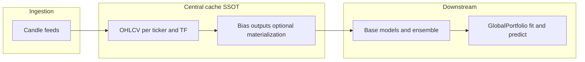

# Central candle and bias cache (planned)

> **Status:** **Planned — not implemented.** Today, `GlobalPortfolio` and feature extraction still pass candle `DataFrame`s through established entrypoints. This document describes the **target** architecture so orchestration, caching, and portfolio APIs stay aligned as the codebase evolves.

> **Scope:** A single **source of truth** for OHLCV and bias-derived artifacts, **datetime-driven** portfolio queries, **fail-fast** semantics on cache miss, and the same high-level workflow for **vectorized backtests** and **live** trading.

---

## Relationship to existing code

- **Current** bias-node and feature caching is centered on [`CacheManager`](../../../utils/cache_manager.py) and covered by tests such as [`tests/unit-tests/utils/test_cache_manager.py`](../../../tests/unit-tests/utils/test_cache_manager.py).
- **Cross-ticker** side data uses [`CrossTickerDataStore`](../../../utils/data/cross_ticker_store.py) (exact bar alignment on the same timeframe).
- The design below **generalizes** those ideas into one orchestrated pipeline and explicit **coverage** rules.

---

## Goals

| Goal | Intent |
|------|--------|
| **Single source of truth** | One canonical store for candles and (per policy) materialized bias outputs so reads do not fork into conflicting copies. |
| **Pristine, up-to-date data** | Writes follow a defined order; gaps and revisions are detectable (versioning / invalidation as needed). |
| **Unified API** | Backtest and live use the same **ingest → query** pattern; portfolio **`fit` / `predict`** are driven by **datetimes** (or ranges / grids), not ad-hoc megabyte candle frames at every call. |
| **Explicit failure** | Cache miss at query time → **structured, recoverable error** (caller fetches more history or fixes ingest—not silent neutral output). |
| **Causal reads** | Only **backward-looking** / **as-of** access so research and live stay aligned on lookahead rules. |

---

## Target data flow

**Orchestration** (not the portfolio class) is responsible for: loading all required `(ticker, timeframe)` series **before** bias nodes that depend on them; incremental updates in **time order**; and populating the cache on miss where policy requires persistence for replication.

---

## Ingestion ordering

1. **Fan-in candles first** — For every `(ticker, tf)` needed by the strategy (including cross-ticker and future cross-timeframe dependencies), ensure **candle** rows exist in the central store over the **coverage window** before computing dependent bias outputs.
2. **Monotonic time** — Append bars in causal order per series; define behavior for **corrections** (restatements) via explicit invalidation or version bumps so the store stays internally consistent.
3. **Bias materialization** — Either recompute bias outputs from candles on read, or cache **materialized** feature columns under the same keying rules; avoid two uncoupled caches that can **drift**.

---

## Portfolio API (target)

- **`predict`** — Invoked with a **datetime vector** (or equivalent) naming the bars or grid points to score. Implementation **reads** forecasts / signals from paths backed by the central cache. If any required **bias or intermediate series** is missing for a requested `(ticker, tf, dt)`, the layer returns a **typed error** (which key, which range)—**not** a silent default.
- **`fit`** — Needs **historical aligned series** (forecasts, signals, returns) over an interval or grid suitable for the weight layer—not necessarily a single timestamp. The same cache (or replay from it) should **materialize** that history; document whether `fit` takes a **date range**, a **grid of datetimes**, or precomputed frames **derived only** from the store.

> [!note] Current implementation
> `GlobalPortfolio.fit` / `predict` today accept `candles_per_tf` and `daily_volatility_df` (see [[portfolio]]). Migrating to datetime-only entrypoints is a **breaking** orchestration change; keep callers explicit until the migration is done.

---

## Causality and lookahead

- **Bias nodes** only consume candles (and side-channel lookups) **available at or before** the simulation bar time; see [[creating_nodes]] for rolling warm-up and future **as-of** multi-timeframe rules.
- **Cross-ticker** — Use [`CrossTickerDataStore`](../../../utils/data/cross_ticker_store.py) with **exact** bar time alignment on the shared TF; missing data → neutral fallback per node contract.
- **Cross-timeframe (future)** — **As-of** (backward) lookup for the last completed bar on the other TF—never exact-index match across mismatched calendars.
- **Global combine** — Higher-TF streams are carried on the rebalance grid via **forward-fill** of **last known** values ([[multi_timeframe]]); that remains the portfolio-level causal bridge between TFs.

---

## Volatility and scaling

Vol-scaled ensemble steps should draw **σ** (or EWSD / blended vol) from the **same lineage** as the rest of the pipeline—e.g. an EWSD bias feature materialized in the same cache—or a single vol table keyed consistently. Avoid **two independent vol streams** without a defined precedence rule.

---

## Observability and metrics

A **central** store is a natural hook for:

- **Freshness** — last bar time per `(ticker, tf)`, ingest latency.
- **Gaps** — missing bars, failed loads, retry counts after recoverable cache misses.
- **Charts and research** — metrics and plots tied to the **same** artifacts the strategy read at query time, improving auditability.

Mind **cardinality** in production (aggregate per environment; avoid logging full payloads unless intended).

---

## Functional core vs mutable caches

Strict **referential purity** (no mutable state) is not required for correctness if you guarantee **deterministic replay**: the same ordered candle stream produces the same stored series and the same query results. A practical compromise is **functional core, imperative shell**: I/O and cache writes live at the boundary; **pure** `step(state, candle) → new_state` (immutable state) is an optional refinement for tests and reasoning.

---

## Related

- [[creating_nodes]] — Bias node contracts, multi-ticker / future multi-TF side channels, planned max-lookback metadata.
- [[multi_timeframe]] — Per-TF streams, daily grid, forward-fill, lookback tables.
- [[live_multi_timeframe]] — Live fetch schedule, rebalance loop, parity with backtest logic.
- [[portfolio]] — Current `GlobalPortfolio` formulas and entrypoint shapes.
- [[pipeline]] — End-to-end feature selection pipeline overview.
