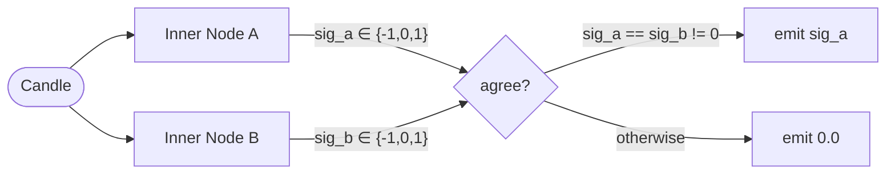

# Composed bias nodes — confirmation gates

> [!summary]
> **Composite nodes** (`DualSignalNode`, **`FilterGateNode`**, **`FilterAndSignalNode`**) let you build **new features from existing bias nodes** without writing a new indicator from scratch. They live under `nodes/composite/` and are usable anywhere a standard `bias_spec` is accepted — in research, feature extraction, vault, and live paths.

## `DualSignalNode` — confirmation / AND gate

| | |
|---|---|
| **Module** | `nodes/composite/dual_signal.py` |
| **When to use** | Emit a direction only when two independent signals agree. |

The node:

- Wraps standard bias nodes via `create_fresh_bias_node` (no singleton reuse — independent state per wrapper).
- Honours the full `BiasNode` contract: `add_candle`, `get_column_names`, `lookback_contributions`, `front_bad`.
- Registers with the taxonomy so it is discovered automatically by `extract_features_for_bias_node` and live paths.



### What it does

`DualSignalNode` feeds the same candle to two independently instantiated bias nodes and applies AND logic on their discrete outputs:

| Node A | Node B | Output |
|--------|--------|--------|
| `+1` | `+1` | `+1` |
| `-1` | `-1` | `-1` |
| `+1` | `-1` | `0` |
| `+1` | `0` | `0` |
| `0` | `0` | `0` |

Agreement is **symmetric** — both long and short directions are handled. The node is useful when you want two independent signals to confirm each other before trading.

### `bias_spec` usage

```python
bias_spec = {
    "module_name": "dual_signal",
    "timeframes": [TimeFrame.D],
    "params": {
        "moduleA": "rsi_signal",
        "paramsA": {"lookback": 14},
        "moduleB": "ewmac",
        "paramsB": {"span_fast": 16, "span_slow": 64},
    },
}
```

Pass this `bias_spec` anywhere you would pass a normal single-node spec — `feature_research`, `extract_features_for_bias_node`, vault control files. No other config changes are needed.

### Params and column naming

`DualSignalNode` inherits params from both children under `a_` / `b_` namespace prefixes. `build_feature_column_name` encodes them all into a single self-describing column:

```
dual_signal_signal_D_aLookback_14_bSpanFast_16_bSpanSlow_64_moduleA_rsi_signal_moduleB_ewmac
```

### Warmup

`front_bad = max(node_a.front_bad, node_b.front_bad)` — the wrapper waits for whichever child has the longer warmup before emitting live signals.

### Registering in the taxonomy

`dual_signal` is already registered:

```python
# nodes/_taxonomy.py
CANONICAL_MODULE_IMPORTS["dual_signal"] = "nodes.composite.dual_signal"
CANONICAL_MODULE_CLASSES["dual_signal"]  = "DualSignalNode"
```

Any new composite node following the same pattern must be added to `_taxonomy.py` to be discoverable.

---

## `FilterGateNode` — boolean gate / pass-through

| | |
|---|---|
| **Module** | `nodes/composite/filter_gate.py` |
| **When to use** | Apply a **regime or condition** as a gate: when the filter is *on*, emit the signal child's first output unchanged; when *off*, emit `0`. |

The filter child's **first output** is interpreted as **open vs closed**: **`0` = closed**; **any non-zero value = open** (so a simple `0` / `1` filter works, as does a directional filter if you only care that it is active).

| Filter (1st output) | Signal (1st output) | Output |
|---------------------|---------------------|--------|
| non-zero | any | same as signal (e.g. `0.42`, `-1`, `+1`) |
| `0` | any | `0` |

### `bias_spec` usage

```python
bias_spec = {
    "module_name": "filter_gate",
    "timeframes": [TimeFrame.D],
    "params": {
        "filter_module": "rsi_regime",
        "filter_params": {"lookback": 14},
        "signal_module": "ewmac",
        "signal_params": {"span_fast": 16, "span_slow": 64},
    },
}
```

Child params are merged into the wrapper's `params` with `f_` / `s_` prefixes (filter vs signal) for column naming, alongside `filter_module` and `signal_module`.

`front_bad = max(filter_child.front_bad, signal_child.front_bad)`.

### Research configuration (`feature_research.config`)

Continuous research/eval **`bias_spec`** dicts and **`InSampleDefaultsCatalog`** / **`EvaluationDefaultsCatalog`** are constructed **only in `load_config()`** in `feature_research/config.py` (single place to read and edit).

**`build_filter_gate_bias_spec`** is optional for tests or scripts that need the composite dict shape without hand-copying keys.

---

## `FilterAndSignalNode` — signed AND (filter ∧ signal)

| | |
|---|---|
| **Module** | `nodes/composite/filter_and_signal.py` |
| **When to use** | Same **discrete agreement** rule as `DualSignalNode`, but names make **filter + forecast** intent obvious in research configs. |

Truth table (first output of each child):

| Filter | Signal | Output |
|--------|--------|--------|
| `+1` | `+1` | `+1` |
| `-1` | `-1` | `-1` |
| other combinations | | `0` |

### `bias_spec` usage

```python
bias_spec = {
    "module_name": "filter_and_signal",
    "timeframes": [TimeFrame.D],
    "params": {
        "filter_module": "rsi_signal",
        "filter_params": {"lookback": 14},
        "signal_module": "ewmac",
        "signal_params": {"span_fast": 16, "span_slow": 64},
    },
}
```

Warmup and column naming follow the same pattern as `FilterGateNode` (`f_` / `s_` prefixes).

---

## Decision guide

| Question | Guidance |
|----------|----------|
| Do you want **two directional forecasts to confirm each other**? | Use `DualSignalNode` or equivalently `FilterAndSignalNode` (same math; pick the name that reads best in your spec). |
| Do you want **raw signal only when a regime filter is on** (pass magnitude through)? | Use `FilterGateNode`. |
| Do both inputs produce `{-1, 0, +1}` on the same scale? | Required for meaningful agreement on `DualSignalNode` / `FilterAndSignalNode`. |
| Is the filter **boolean** (`0` off, non-zero on) while the signal may be continuous? | Use `FilterGateNode`. |

---

## Related

- [[bias_nodes/creating_nodes]] — base BiasNode contract and authoring checklist
- [[bias_nodes/index]] — bias-node doc hub
- [[Feature_selection/pipeline]] — EDA, permutation, walkforward after the feature column exists
- [[Cache/user_guide]] — `use_cache` behaviour and cache scopes
