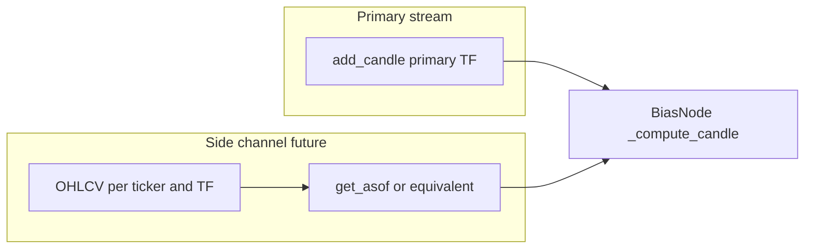

# Creating Bias Nodes

A **bias node** is a stateful, streaming component that processes one candle at a time and produces a feature column used by downstream [[base_model|base models]].

## Required Attributes (set in `__init__`)

| Attribute | Purpose | Example |
|---|---|---|
| `module_name` | Lowercase, no underscores | `'rsi'`, `'ewmac'` |
| `output_features` | List of feature names | `['signal']`, `['atr', 'atrPct']` |
| `params` | All constructor params (except ticker/tf) | `{'lookback': 14}` |
| `front_bad` | Warmup candles before valid output | `14` |

### Max lookback metadata

Bias nodes now expose a machine-readable warmup contract through the base `BiasNode` API:

- `lookback_param_names: ClassVar[frozenset[str]]`
- `hardcoded_lookbacks: ClassVar[tuple[tuple[str, int], ...]]`
- `lookback_contributions() -> tuple[LookbackContribution, ...]`
- `max_lookback() -> int`
- `cold_rebuild_candle_count() -> int`

**Goals**

- Callers can ask a node (or its class) for **all bar-count windows** that affect output: constructor params that are lookbacks **and** any **hardcoded** buffer lengths.
- Values feed **`max_lookback`** aggregation across ensembles and timeframes (see [[multi_timeframe]] — *Lookback & Stateful Bias Nodes*).

**Authoring rules**

1. **Constructor params that are rolling windows** — Keys in `params` whose values are integer lookbacks (e.g. `lookback`, `window`, `slow_period`) must be listed in `lookback_param_names`.

2. **Hardcoded / implicit windows** — Literally sized buffers or fixed secondary series lengths (not passed through `params`) must be listed in `hardcoded_lookbacks`, or returned dynamically from `_extra_lookback_contributions()` when the value depends on runtime configuration.

3. **Relationship to `front_bad`** — `front_bad` is included automatically in `lookback_contributions()`. In the common case `max_lookback == max(all declared lookbacks, hardcoded lookbacks, front_bad)`, but wrappers may legitimately expose a larger effective warmup than `front_bad` if they need additive state from a wrapped node.

4. **Cold rebuild invariant** — Cache rebuilds are stateless. Cache orchestration now instantiates a fresh node, feeds `cold_rebuild_candle_count()` candles ending at the requested boundary, then trims the artifact back to the requested output window.

## Naming Convention

Column names are auto-generated by `ensure_standardized_columns()`:

```
{module_name}_{feature}_{timeframe}_{param}_{value}
```

Example: `rsi_signal_D_lookback_14`

## `__init__` Steps (in order)

1. `super().__init__(ticker, tf)`
2. Store parameters as instance variables
3. Set `module_name`, `output_features`, `params`
4. Set `front_bad`
5. Initialize computation state (buffers, counters)
6. `self.ensure_standardized_columns()` — must be last

## `_compute_candle` Steps (in order)

1. Extract data from `candle` (`candle.close`, `.high`, `.low`, etc.)
2. Update internal state
3. Return neutral default if still in warmup (`n_prices < front_bad`)
4. Compute result
5. `self.output.append(result)`
6. `return [result]` — one value per `output_feature`

## Feature Types

| Type | Output | Binning | Use when |
|---|---|---|---|
| **Rule-based** | `-1`, `0`, `1` | Not required | Clear entry/exit rules (breakout, crossover) |
| **Continuous** | Any float | Required | Signal strength matters (RSI, momentum) |

> [!note] Normalization
> Continuous features with asset-dependent ranges **must** be normalized.
> - Fixed-range (RSI 0-100): output raw value directly
> - Dynamic-range (MA diff, momentum): divide by price or ATR to make cross-asset comparable

## Minimal Template

```python
from typing import List
import numpy as np
from nodes import BiasNode
from utils.core.models import Candle
from utils.core.enums import Ticker, TimeFrame

class MyNode(BiasNode):
    lookback_param_names = frozenset({"lookback"})

    def __init__(self, ticker: Ticker, tf: TimeFrame, lookback: int = 14):
        super().__init__(ticker, tf)
        self.lookback = lookback
        self.module_name = 'mynode'
        self.output_features = ['signal']
        self.params = {'lookback': lookback}
        self.front_bad = lookback
        # state
        self.n_prices = 0
        self.buffer = np.zeros(lookback, dtype=np.float64)
        self.buf_idx = 0
        self.ensure_standardized_columns()

    def _compute_candle(self, candle: Candle) -> List:
        self.buffer[self.buf_idx] = candle.close
        self.buf_idx = (self.buf_idx + 1) % self.lookback
        self.n_prices += 1
        if self.n_prices < self.front_bad:
            self.output.append(50.0)   # neutral for 0-100 oscillator
            return [50.0]
        result = float(np.mean(self.buffer))  # replace with real logic
        self.output.append(result)
        return [result]
```

## Cython

> [!tip] When to use Cython
> Use Cython helpers for numeric hot-paths called every bar (rolling stats, EMA, ATR, RSI).
> Do **not** import from `cython_nodes` directly — always use `utils.compute.fast_nodes` or `utils.compute.fast_stats`, which auto-fallback to pure Python.

Key helpers (`utils/fast_nodes.py`): `compute_atr_fast`, `compute_ema_fast`, `compute_rsi_initial_fast`, `update_rsi_fast`, `compute_high_low_channel_fast`, `compute_momentum_fast`, `compute_roc_fast`

Build: `python utils/compute/cython/setup_cython.py build_ext --inplace`

The node API (`_compute_candle`) is unchanged — only the inner math moves into a helper.

## Multi-asset and multi-timeframe side channels

The primary streaming API is still **`add_candle(candle)`** for one `(ticker, timeframe)` series. Anything that needs **another ticker** or **another timeframe** uses a **side-channel store** so the `Candle` contract stays unchanged.

### Multi-ticker nodes (supported today)

Use [utils/cache/cross_ticker_store.py](../../../utils/cache/cross_ticker_store.py) — `CrossTickerDataStore` — for lookups of **another ticker at the same timeframe and bar time**. The older `utils/data/cross_ticker_store.py` path remains only as a compatibility shim.

#### Params contract (required)

- In bias-node specs, use exactly one key: `params["cross_tickers"]`
- Value must be `list[str]` of ticker enum names, e.g. `["NQ"]` or `["NQ", "GC"]`

#### Node pattern

1. Keep `add_candle(self, candle: Candle)` unchanged for the primary ticker
2. In `_compute_candle`, fetch the secondary ticker candle by **exact** datetime alignment:

```python
from utils.cache.cross_ticker_store import CrossTickerDataStore

self._store = CrossTickerDataStore.get_instance()
other = self._store.get_candle(Ticker.NQ, candle.tf, candle.datetime)
if other is None:
    return [0.0]  # neutral fallback
```

3. Return neutral `0.0` when cross data is missing (avoid NaN propagation)

#### Where cross data is loaded

- **Research/EDA/training/permutation**: preloaded during feature extraction/base-model setup
- **Forecast server (MT5)**: preloaded from historical buffers, then updated every loop
- **TWS one-shot script**: loaded from fetched candles or IB fallback fetch

#### Minimal spec example

```python
bias_spec = {
    "module_name": "spread",
    "timeframes": [TimeFrame.D],
    "params": {"cross_tickers": ["NQ"], "lookback": 20},
}
```

#### Test commands

```bash
python -m pytest tests/nodes/test_cross_ticker.py -q
python -m pytest tests/unit-tests/validators/permutation/test_data_loader_candle_override_unit.py -q
```

### Multi-timeframe nodes (future extension)

> [!warning] Not implemented yet
> This section describes the **intended** pattern so new work stays aligned with [[multi_timeframe]] and [[live_multi_timeframe]].

**Problem** — The inbound stream is still one `(ticker, tf)`. Bars on **weekly** or **monthly** series do not share the same `datetime` index as **daily** (or intraday) bars, so **exact** `get_candle(ticker, tf_other, candle.datetime)` is wrong: there is often no row at that timestamp.

**Intended pattern**

- A **side-channel store** (same *idea* as `CrossTickerDataStore`) holding `dict[Ticker, dict[TimeFrame, DataFrame]]` OHLCV, with a lookup that returns the **last completed bar as-of** the current simulation time — **as-of (backward) search** only, so the feature is **causal** (no lookahead).
- **Planned params contract** — mirror cross-ticker: e.g. `params["cross_timeframes"]` as `list[str]` of `TimeFrame` enum names (`"W"`, `"M"`, …) so grids, specs, and cache keys can declare dependencies. **Exact key name may change** when implemented.

**Orchestrator responsibility** — Before running extraction for the primary TF, load or `set_data` every required `(ticker, tf)` series over a range that covers the as-of window. **Live**: fetch each TF on its own schedule and refresh the store before the forecast run (see [[live_multi_timeframe]]).



## Common Mistakes Checklist

- [ ] Forgot `ensure_standardized_columns()` at end of `__init__`
- [ ] `module_name` contains underscores (should be lowercase no underscores)
- [ ] `params` missing a constructor argument (breaks column naming)
- [ ] Warmup return omits `self.output.append(...)` (causes length mismatch)
- [ ] Continuous feature with dynamic range not normalized across assets
- [ ] Returning a scalar instead of a `List` from `_compute_candle`
- [ ] Raising an exception in `_compute_candle` instead of returning a default
- [ ] Importing directly from `cython_nodes` instead of `fast_nodes`
- [ ] Missing or incomplete lookback / hardcoded window registration — callers cannot size cold rebuilds correctly
- [ ] `front_bad` shorter than the true longest rolling window (silent wrong features)
- [ ] (Multi-timeframe, when implemented) Using exact timestamp match instead of causal as-of lookup — risks lookahead or spurious nulls

## Related

- [[base_model]] — consumes node output, applies binning
- [[pipeline]] — feature extraction pipeline
- [[eda]] — parameter sensitivity analysis for node params
- [[multi_timeframe]] — portfolio orchestration and lookback across timeframes
- [[live_multi_timeframe]] — live fetch schedule and rebalance loop
- [[Cache/architecture]] — central candle/bias cache design and datetime-driven portfolio API
