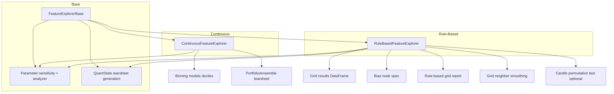

# FeatureExplorer Variants Specification (Continuous vs Rule-Based)

**Version**: 1.2.0  
**Date**: 2025-02-10  
**Status**: Specification (Design)  
**Scope**: Two FeatureExplorer subclasses (Continuous and Rule-Based), their inputs and pipelines; **refactoring** (remove signal cumsum and time series from continuous; move QuantStats tearsheet and parameter sensitivity to base); **continuous explorer**: user-defined bin list (not necessarily a range), quantile-only, separate folders per param combo, permutation on all (param × bin) permutations, summary of passers, optional permutation in report, correlation on passers only, simple vs portfolio backtest; integration with parameter sensitivity ([param_sens.md](../complete/param_sens.md)), rule-based grid report, grid neighbor smoothing, optional candle-based permutation test, and bias_node_helpers updates. Implementation is follow-on; this spec is design only.

---

## Table of Contents

1. [Overview and Goals](#1-overview-and-goals)
2. [Architecture Overview](#2-architecture-overview)
3. [Continuous Variant](#3-continuous-variant)
4. [Rule-Based Variant: Inputs and bias_spec](#4-rule-based-variant-inputs-and-bias_spec)
5. [Rule-Based Variant: Pipeline](#5-rule-based-variant-pipeline)
6. [Rule-Based Variant: What It Does Not Do](#6-rule-based-variant-what-it-does-not-do)
7. [API Surface](#7-api-surface)
8. [bias_node_helpers Updates](#8-bias_node_helpers-updates)
9. [Candle Permutation Test (High-Level)](#9-candle-permutation-test-high-level)
10. [Data Flow for Building grid_results_df](#10-data-flow-for-building-grid_results_df)
11. [Implementation Scope](#11-implementation-scope)
12. [Refactoring: Continuous Explorer, Shared Base](#12-refactoring-continuous-explorer-shared-base)
13. [Parameter Sensitivity (Shared)](#13-parameter-sensitivity-shared)
14. [QuantStats Tearsheet (Shared)](#14-quantstats-tearsheet-shared)
15. [Continuous Explorer: Binning, Permutation, Correlation, Output](#15-continuous-explorer-binning-permutation-correlation-output)

---

## 1. Overview and Goals

### Purpose

Split the current [FeatureExplorer](eda/feature_explorer.py) into two variants:

- **Continuous variant**: Works with a per-bar feature matrix and **quantile binning only** (for now). User supplies a **user-defined list of bin values** to explore; the explorer runs analysis for each (param combo × bin value) permutation. Output is organized in **separate folders per param combo**. Permutation test runs on **all** such permutations; summary report lists only those that **pass** the test. Correlation analysis is run only on param combos + bin values that pass. Permutation test can use **simple backtest** (configurable target columns) or **portfolio backtest** (volatility scaling, more realistic). User can enable/disable permutation testing in the summary report to speed runs. **Parameter sensitivity** includes **bin-aware visuals**: a 2D plot (metric vs n_bins) per param combo for stability across bins, and a 3D plot (bins × selected param × metric) when the node has multiple params. Goal: user gets a clear view of which **params and bin values** are strong together and can check **stability and robustness** of the continuous bias node.
- **Rule-based variant**: Works with **grid results** (one row per parameter permutation) and a **bias node spec**. Pipeline: parameter sensitivity (stability) → rule-based grid report → grid neighbor smoothing → optional candle-based permutation test. No binning, no deciles.

### Related specs

- [docs/to-do/rule_based_grid_report_specs.md](rule_based_grid_report_specs.md) — report content and API for grid results.
- [docs/to-do/grid_neighbor_smoothing_specs.md](grid_neighbor_smoothing_specs.md) — smoothed objective column.
- [docs/complete/param_sens.md](../complete/param_sens.md) — robustness metrics and parameter sensitivity (integrated in §13).
- QuantStats tearsheet: [research/bias_node_helpers.generate_node_tearsheet](research/bias_node_helpers.py) — moved to base (§12, §14).

---

## 2. Architecture Overview

- **Base class** (`FeatureExplorerBase` or keep `FeatureExplorer` as base): Shared helpers (e.g. parameter canonicalization, validation), **parameter sensitivity** (plotting + ParameterAnalyzer integration), and **QuantStats tearsheet generation**. No binning or decile logic in base.
- **ContinuousFeatureExplorer**: `features_df` + `targets_df` (and optional `metadata`), binning model, deciles, uniform bins, **no signal cumsum** (replaced by portfolio-based QuantStats tearsheet), **no time series plotting**; parameter sensitivity and `generate_summary_report`; in-sample (feature-shuffle) permutation test. Strategy performance is assessed via **QuantStats tearsheet** from a portfolio/ensemble run with a single binning model for the bias node.
- **RuleBasedFeatureExplorer**: Inputs: **grid_results_df** and **bias_spec**. Pipeline: parameter sensitivity (shared) → rule-based grid report → grid neighbor smoothing → optional candle-based permutation test. Can use shared tearsheet when strategy returns are available (e.g. from backtest).

---

## 3. Continuous Variant

### Name

`ContinuousFeatureExplorer`, or retain `FeatureExplorer` for backward compatibility and introduce only `RuleBasedFeatureExplorer` as new. The spec leaves the choice to the implementer; if the class is renamed, provide `FeatureExplorer = ContinuousFeatureExplorer` alias.

### Input

- `features_df`: pd.DataFrame (per-bar feature matrix).
- `targets_df`: pd.DataFrame (aligned by index).
- `metadata`: Optional[Dict] (e.g. `feature_metadata` from FeatureExtractor).
- **Bin values to explore** (for summary/permutation flow): User passes a **user-defined list** of bin values (e.g. `n_bins_list: List[int]`), e.g. `[2, 5, 10, 12]` or `[3, 6, 9]` — not necessarily a range or contiguous. The explorer creates permutations for each (param combo × bin value). See §15.

### Binning model (continuous only)

- **For now, continuous feature explorer supports only [QuantileBinningModel](feature_selection/base_models/quantile_binning.py).** Other binning models (e.g. TwoBinBinningModel) are out of scope for the continuous variant in this spec.

### Responsibilities

All current public methods **except** signal cumsum and time series (see §12), with behavior extended per §15:

- Deciles: `plot_deciles`, `plot_all_deciles`, `plot_uniform_bins`, `plot_all_uniform_bins`, `plot_2bin`.
- Distributions only: `plot_distributions` (no `plot_timeseries`).
- Correlations: `plot_feature_target_correlations`, `plot_feature_correlations`, `get_correlations`; when used in the summary flow, **correlation analysis is run only on (param combo + bin value) permutations that pass the permutation test** (§15).
- Parameter sensitivity: delegated to base (`plot_parameter_sensitivity`, `plot_2d_parameter_surface`, `plot_nd_parameter_analysis`, `generate_parameter_sensitivity_report`). **Bin-aware visuals** for continuous: 2D plot (metric vs n_bins) per param combo to check stability across bins; 3D plot (bins × param × metric) with optional param selection when the node has multiple params. See §15.9.
- Summary: `generate_summary_report`, `get_summary` (no signal cumsum or timeseries steps; see §12). **Option to enable/disable permutation testing** to speed up runs. Summary report includes **all param combos (and bin values) that pass the permutation test** (§15).
- Permutation test: `run_permutation_test` runs on **all** (param combo × bin value) permutations. User can choose **simple backtesting** (configurable target columns) or **portfolio backtest** (feature backtested via portfolio for volatility scaling and more realistic results). See §15.
- Ticker-level: `plot_deciles_by_ticker`, `plot_all_deciles_by_ticker`, etc., when multi-ticker.

**Strategy performance** is not shown via in-explorer signal cumsum plots; use **QuantStats tearsheet** from the portfolio (see §14).

**Output layout**: Create **separate folders for each param combo** (similar in spirit to rule-based grid output), so the user can navigate results by parameter combination. See §15.

### Backward compatibility

Existing callers (notebooks, [bias_node_helpers.test_bias_node](research/bias_node_helpers.py) for continuous nodes) can continue to use this class with a single default bin value when `n_bins_list` is not provided (§15.2). New parameters (e.g. `run_permutation_test`, `permutation_backtest_mode`) have defaults that preserve previous behavior where applicable.

---

## 4. Rule-Based Variant: Inputs and bias_spec

### Primary input: grid_results_df

DataFrame with **one row per parameter permutation**. Columns:

- **Parameter columns**: Names and count must align with parameter names in `bias_spec['params']` (e.g. `lookback`, `threshold`). May be literal column names or a mapping from spec param names to column names. Schema may match output of [ParameterAnalyzer.analyze_nd_parameters](eda/parameter_analysis.py) (e.g. `param1_value`, `param2_value`, ...) or user-defined param column names.
- **Metric columns**: At least one performance column (e.g. `sortino`, `profit_factor`, `net_return`, `max_drawdown`, `n_samples`). Aligns with [rule_based_grid_report_specs](rule_based_grid_report_specs.md) and ParameterAnalyzer output.

### Secondary input: bias_spec

Dict with the same shape as used in [single_node_test](research/single_node_test.ipynb) and [extract_features_for_bias_node](feature_extraction/feature_extractor.py):

| Key | Type | Description |
|-----|------|-------------|
| `module_name` | str | Bias node module (e.g. `'rsi'`, `'donchianchannel'`). |
| `timeframes` | List[TimeFrame] | e.g. `[TimeFrame.D]`. |
| `params` | Dict[str, Any] | Parameter names and **value ranges** used to build the grid (e.g. `{'lookback': [7, 14, 21], 'threshold': [30, 50, 70]}`). Used so the explorer knows parameter names and ordered levels for neighbor definition and reporting. |
| (optional) | | Other keys (e.g. `mode`, `PositionMode.LONG_ONLY`) may be passed through for future use (e.g. candle permutation). |

### Optional

- **Pre-computed smoothed objective**: If `grid_results_df` already has a column from [grid_neighbor_smoothing_specs](grid_neighbor_smoothing_specs.md), the report and ranking can use it.
- **features_df / targets_df**: The rule-based variant does not require a per-bar feature matrix. The spec leaves open whether to allow attaching `features_df`/`targets_df` for runs that need parameter sensitivity computed from raw features; by default, rule-based explorer receives **pre-aggregated** grid results only.

---

## 5. Rule-Based Variant: Pipeline

Order of operations:

1. **Parameter sensitivity (stability)**  
   Use [ParameterAnalyzer.compute_robustness_metrics](eda/parameter_analysis.py) (or equivalent) on `grid_results_df` with a chosen primary metric. Output: variance score, consistency score, risk score, overall rating, parameter sensitivity ranking. Answers “how stable is performance across permutations?”

2. **Rule-based grid report**  
   Call the report generator from [rule_based_grid_report_specs](rule_based_grid_report_specs.md): `generate_rule_based_grid_report(grid_results_df, param_columns, metric_config, feature_id=module_name, ...)`. Output: per-metric pass rates, best/worst permutations, verdict, optional text export.

3. **Grid neighbor smoothing**  
   Call [add_smoothed_objective](grid_neighbor_smoothing_specs.md) on `grid_results_df` with `param_columns` derived from `bias_spec['params']` and objective column = primary metric. Use the resulting `avg_objective` to rank permutations by stability; optionally surface “best by smoothed metric” in the report or a separate accessor.

4. **Candle-based permutation test (optional, high-level)**  
   See §9. Goal: test statistical significance under a null that destroys temporal structure. Per iteration: permute candles → for selected param tuple(s), create bias node → re-extract feature data from permuted candles → compute criterion. **Gap**: [extract_features_with_forward_returns](feature_extraction/feature_extractor.py) loads candles internally; there is no public “extract from this candles_df” API. The spec states that extraction from user-provided (e.g. permuted) candles requires a new entry point (e.g. `extract_features_from_candles(module_name, params, candles_df, ...)`) or an overload; implementation may be deferred.

---

## 6. Rule-Based Variant: What It Does Not Do

- **No binning model** in the explorer pipeline (rule-based signals are already discrete; [TwoBinBinningModel](feature_selection/base_models/twobin_binning.py) may be used elsewhere for evaluation but not inside this explorer).
- **No decile plots**, no uniform binning plots, no signal cumsum plots, no distribution/timeseries plots over a feature matrix.
- **No `generate_summary_report`** (that is continuous-only). Rule-based has its own report via the grid report + optional text export.

---

## 7. API Surface

Spec only; no implementation.

### Base

- Shared: e.g. `_canonicalize_param_name`, any shared validation.
- **Parameter sensitivity (shared)**: Entry points that delegate to `ParameterAnalyzer` and `metrics.plotting.parameter_plots` — e.g. `plot_parameter_sensitivity`, `plot_2d_parameter_surface`, `plot_nd_parameter_analysis`, `generate_parameter_sensitivity_report`, `compute_robustness_metrics`. Subclasses that have a parameter grid (continuous from features_df metadata; rule-based from grid_results_df) call these. See §13.
- **QuantStats tearsheet (shared)**: Method to generate node/strategy tearsheet (e.g. `generate_node_tearsheet` or equivalent) using `metrics.plotting.graphing.quantstats_reports.generate_tearsheet`. Used by continuous path (portfolio with single binning model) and by rule-based when strategy returns are available. See §14.
- No `features_df`/`targets_df` in base if the rule-based variant does not use them (base may still accept optional data for tearsheet inputs).

### ContinuousFeatureExplorer

- **Constructor**: `(features_df, targets_df, metadata=None)` — unchanged.
- **Methods**: Keep current public API **except** remove signal cumsum and timeseries: plot_deciles, plot_distributions (no plot_timeseries), plot_nd_parameter_analysis / generate_parameter_sensitivity_report (from base), generate_summary_report (without signal cumsum and timeseries steps), run_permutation_test, etc. Strategy performance is via shared tearsheet from portfolio.
- **New/updated parameters** (see §15): `n_bins_list` (user-defined list of bin values to explore, not necessarily a range); `run_permutation_test: bool = True` on summary report to enable/disable permutation; `permutation_backtest_mode: Literal['simple', 'portfolio']` for simple (configurable target_col) vs portfolio backtest; export/save layout uses **separate folders per param combo**. **Bin-aware parameter sensitivity**: 2D plot (metric vs n_bins) and 3D plot (bins × param × metric, with param selection when >1 param); see §15.9.

### RuleBasedFeatureExplorer

- **Constructor**: `(grid_results_df, bias_spec, param_columns=None, feature_id=None)`.
  - `param_columns`: If None, derive from `bias_spec['params']` keys or from `grid_results_df` (columns that match param names).
  - `feature_id`: Report identifier (default `bias_spec['module_name']`).

- **Methods (conceptual)**:
  - `get_parameter_sensitivity(primary_metric=..., metric_threshold=...)` → robustness metrics + parameter sensitivity ranking (from grid_results_df).
  - `get_rule_based_grid_report(metric_config, primary_metric=..., export_path=None, ...)` → structured report per [rule_based_grid_report_specs](rule_based_grid_report_specs.md).
  - `add_smoothed_objective(objective_column, output_column='avg_objective')` → return new DataFrame with smoothed column (delegate to grid neighbor smoothing); optionally store for “best by stability.”
  - `run_candle_permutation_test(...)` → optional; signature and behavior high-level only (all variations vs best only; dependency on “extract from candles” noted in §9).

---

## 8. bias_node_helpers Updates

### Current behavior

[test_bias_node](research/bias_node_helpers.py) uses `FeatureExplorer` + `generate_summary_report`; works for both continuous and rule-based via `get_binning_model(is_continuous)` (Quantile vs TwoBin). [generate_node_tearsheet](research/bias_node_helpers.py) builds positions from the best feature + binning model, then calls `generate_tearsheet(strategy_returns, baseline_returns, ...)` from `metrics.plotting.graphing.quantstats_reports`.

### Refactor (see §12, §14)

- **Tearsheet generation** moves to the **base class** (or a shared helper used by both variants). `bias_node_helpers.generate_node_tearsheet` will call into the base (e.g. `FeatureExplorerBase.generate_node_tearsheet(...)`) so that the same logic is used by continuous and rule-based when they produce strategy returns.
- Continuous path: strategy performance is no longer shown via FeatureExplorer signal cumsum plots; it is shown via the **QuantStats tearsheet** produced from the portfolio that contains an ensemble with a single binning model for the bias node (same data flow as current `generate_node_tearsheet`: positions → strategy returns → tearsheet).

### Change for rule-based

For **rule-based** nodes, the flow should not rely on `generate_summary_report`. Two options:

- **Option A**: User builds **grid_results_df** (e.g. by running a grid over bias_spec params, extracting features per combination, computing metrics via ParameterAnalyzer or a dedicated runner). Then user constructs `RuleBasedFeatureExplorer(grid_results_df, bias_spec)` and runs parameter sensitivity, grid report, and neighbor smoothing.
- **Option B**: Add a helper, e.g. `run_rule_based_analysis(bias_spec, grid_results_df, *, metric_config, export_path=None)`, that instantiates `RuleBasedFeatureExplorer`, runs the pipeline (sensitivity + grid report + smoothing), and returns the report + smoothed DataFrame.

### Recommendation

- Add **`run_rule_based_analysis(bias_spec, grid_results_df, ...)`** in bias_node_helpers that creates `RuleBasedFeatureExplorer`, runs report + smoothing, and optionally exports.
- Keep **`test_bias_node`** for the continuous/summary-report path.
- For rule-based, `test_bias_node` may either (1) remain as-is and only support continuous + current report, or (2) detect rule-based (e.g. `is_continuous=False`) and branch to the new pipeline when `grid_results_df` is provided (e.g. optional argument `grid_results_df=None`). If `grid_results_df` is None for rule-based, require the user to pass it or document that the user must build it externally.

---

## 9. Candle Permutation Test (High-Level)

### Purpose

Under the null that price history is random (candle permutation), the rule-based node should not show systematic edge.

### Steps (conceptual)

1. Define criterion (e.g. primary metric on OOS or full period).
2. For each permutation replicate: permute candles (e.g. [BarPermute](utils/permutation_test/permute_bars.py)) → for selected param tuple(s), create bias node → extract features from **permuted** candles → compute forward returns from same permuted data → compute criterion.
3. Build null distribution; compare observed criterion to get p-value.

### Options

- (a) Run test on **all** parameter variations (e.g. aggregate or min-p-value).
- (b) Run on **best performer** only (e.g. best by primary metric or by smoothed objective).

### Gap

[extract_features_with_forward_returns](feature_extraction/feature_extractor.py) does not accept a candles DataFrame; it loads via `helpers.load_data_multi_ticker`. The spec states that an API to **extract features (and forward returns) from a provided candles DataFrame** is required for this test. Design (e.g. `extract_features_from_candles(module_name, params, candles_df, target_col=...)`) can be outlined without implementing. Implementation may be deferred. [permute_bars](utils/permutation_test/permute_bars.py) and related infra are the source of permuted bars; how they are passed into the extractor is TBD.

---

## 10. Data Flow for Building grid_results_df

**grid_results_df** for a rule-based node can be produced by:

1. Calling [extract_features_with_forward_returns](feature_extraction/feature_extractor.py) (or [extract_features_for_bias_node](feature_extraction/feature_extractor.py)) with a **param grid** in `bias_spec['params']` (lists per param), yielding `features_df` and `targets_df` with one column per parameter combination.
2. Running [ParameterAnalyzer.analyze_nd_parameters](eda/parameter_analysis.py) with that features_df/targets_df, a metric, and TwoBinBinningModel (for rule-based), yielding a DataFrame with `paramK_value` (or equivalent) and metric columns.

That DataFrame is the natural input to `RuleBasedFeatureExplorer` and to the rule-based grid report. The user may produce it via existing EDA/parameter analysis or a small wrapper that runs extraction + analyze_nd_parameters and returns the DataFrame.

---

## 11. Implementation Scope

### In scope for this spec

- Document the two variants, their inputs, pipeline order, API sketch, bias_node_helpers contract, and candle permutation at a high level.

### Out of scope for this spec

- Implementing the new classes.
- Implementing “extract from candles” or the candle permutation test; those are follow-on work.

### Deliverable

A single markdown spec file so that an implementer can add `ContinuousFeatureExplorer` / `RuleBasedFeatureExplorer`, refactor or alias `FeatureExplorer`, and update bias_node_helpers accordingly, with clear references to grid report, neighbor smoothing, and param_sens.

---

## 12. Refactoring: Continuous Explorer, Shared Base

This section specifies refactors applied to the **continuous** FeatureExplorer and the **shared base** used by both continuous and rule-based variants.

### 12.1 Remove signal cumsum from ContinuousFeatureExplorer

- **Remove** from the continuous variant (and from any base that currently holds them):
  - `plot_signal_cumsum`
  - `plot_signal_cumsum_by_ticker`
  - `plot_all_signal_cumsum_by_ticker`
- **Reason**: Strategy performance (cumulative returns, drawdowns, metrics) is to be assessed via the **QuantStats tearsheet** generated from the **portfolio** that contains an ensemble with a single binning model for the bias node — not via in-explorer signal-gated cumsum plots.
- **Call sites**: Update `generate_summary_report` (and any export/combined-plot logic) to remove all signal cumsum steps, result keys (`signal_cumsum_figures`, `signal_cumsum_summary`, `signal_cumsum_gated_returns`, and by-ticker equivalents), and references in the summary text/export. Notebooks and tests that currently call `plot_signal_cumsum` or rely on signal cumsum in the report should be updated to use the QuantStats tearsheet flow (e.g. `generate_node_tearsheet` or portfolio tester tearsheet).

### 12.2 Move QuantStats tearsheet generation to base class

- **Current**: [generate_node_tearsheet](research/bias_node_helpers.py) lives in `research/bias_node_helpers.py`; it builds positions from (best feature + binning model), computes strategy returns via `calculate_strategy_returns_from_positions`, then calls `generate_tearsheet` from `metrics.plotting.graphing.quantstats_reports`.
- **Target**: Move the **tearsheet generation logic** (positions → strategy returns → baseline → `generate_tearsheet`) into the **base class** (e.g. `FeatureExplorerBase`) so that:
  - **Continuous** path: can invoke it from bias_node_helpers or from portfolio tooling that has (features_df, targets_df, binning model, best feature, tickers, date range).
  - **Rule-based** path: can invoke the same method when it has strategy returns (e.g. from a backtest over grid_results_df or from a single selected param tuple).
- **Contract**: Base class exposes a method with the same semantic inputs/outputs as current `generate_node_tearsheet` (node_name, strategy, target_col, positions or feature/target/model/tickers, reports_dir, etc.) and returns the tearsheet path or None. `bias_node_helpers.generate_node_tearsheet` becomes a thin wrapper that delegates to the base (or a shared helper) so both variants use one implementation. See §14.

### 12.3 Move parameter sensitivity to base class and integrate with RuleBasedFeatureExplorer

- **Current**: Parameter sensitivity (plotting + ParameterAnalyzer) lives in [FeatureExplorer](eda/feature_explorer.py) (e.g. `plot_parameter_sensitivity`, `plot_2d_parameter_surface`, `plot_nd_parameter_analysis`, `generate_parameter_sensitivity_report`, `_extract_parameter_grid`, `_format_parameter_sensitivity_report`) and uses [ParameterAnalyzer](eda/parameter_analysis.py) with `features_df`/`targets_df` and a feature grid derived from metadata.
- **Target**:
  - **Base class** owns (or delegates to shared helpers):
    - Parameter canonicalization and parameter-grid extraction where the grid comes from **feature metadata** (for continuous) or from **grid_results_df columns** (for rule-based).
    - Entry points: `plot_parameter_sensitivity`, `plot_2d_parameter_surface`, `plot_nd_parameter_analysis`, `generate_parameter_sensitivity_report`, and use of `ParameterAnalyzer.analyze_parameter` / `analyze_2d_parameters` / `analyze_nd_parameters` and `compute_robustness_metrics`.
  - **ContinuousFeatureExplorer**: Calls base parameter-sensitivity methods with `features_df`/`targets_df` and metadata; grid is built from `_extract_parameter_grid(module_name, param_names, ...)` as today.
  - **RuleBasedFeatureExplorer**: Uses the **same** robustness and report formatting (from ParameterAnalyzer and base); its “grid” is `grid_results_df` (one row per parameter combination). It does not call `analyze_nd_parameters` on raw features; it uses `compute_robustness_metrics(results_df=grid_results_df, metric_col=..., metric_threshold=...)` and the same report structure. Plotting can be 1D/2D/ND over `grid_results_df` columns (param1_value, param2_value, ... and metric column). See §13 and [param_sens.md](../complete/param_sens.md).

### 12.4 Remove time series plotting

- **Remove** from the continuous variant (and from summary/export):
  - `plot_timeseries` (and any `plot_all_feature_timeseries` usage).
  - All time series figure generation, storage, and export inside `generate_summary_report` and `_export_summary_report` (e.g. `timeseries_figures`, `all_timeseries_combined.png`, and references in the summary text file).
- **Reason**: Time series of feature values over time are redundant with the rest of the pipeline; parameter-over-time visualization is dropped in favor of parameter sensitivity over the parameter space (and, for strategy performance, the QuantStats tearsheet).

---

## 13. Parameter Sensitivity (Shared)

Full specification: [docs/complete/param_sens.md](../complete/param_sens.md).

### Summary

- **1–4 parameters**: 1D line, 2D surface/contour, 3D/4D interactive (dropdown/slider) plots.
- **Data source**: Continuous variant builds a parameter grid from feature metadata and runs `ParameterAnalyzer.analyze_parameter` / `analyze_2d_parameters` / `analyze_nd_parameters` on `features_df`/`targets_df`. Rule-based variant uses **grid_results_df** (one row per permutation) with columns `paramK_value` and metric columns — no per-bar feature matrix needed for sensitivity.
- **Robustness**: `ParameterAnalyzer.compute_robustness_metrics(results_df, metric_col, metric_threshold)` yields variance_score, consistency_score, risk_score, overall_score, rating, statistics, parameter_sensitivity (variance contribution per parameter). Same for both variants; rule-based passes `grid_results_df` directly.
- **Report**: `generate_parameter_sensitivity_report`-style text (parameter space, performance summary, robustness analysis, parameter sensitivity ranking, recommendations). Base class (or shared helper) owns formatting; continuous gets results from analyzer on features; rule-based gets results from `grid_results_df` + `compute_robustness_metrics`.

### Base class responsibilities

- Expose or delegate: `plot_parameter_sensitivity`, `plot_2d_parameter_surface`, `plot_nd_parameter_analysis`, `generate_parameter_sensitivity_report`, and report formatting.
- Use `eda.parameter_analysis.ParameterAnalyzer` and `metrics.plotting.parameter_plots` (plot_parameter_sensitivity, plot_2d_parameter_surface, plot_3d_parameter_interactive, plot_4d_parameter_interactive) as today. Rule-based variant uses the same plotting functions with data from `grid_results_df` (param columns + metric column).

### Reference: param_sens.md

- **§2**: Architecture (extension points, data flow).
- **§3**: Visualization (1D–4D).
- **§4**: Summary report structure and robustness scoring algorithm.
- **§5**: API (FeatureExplorer and ParameterAnalyzer methods).
- **§6**: Implementation (parameter_plots.py, parameter_analysis.py, feature_explorer.py), data structures, parameter grid extraction, integration with FeatureExplorer pipeline.
- **§11**: Implementation checklist (including fix 2D before 3D/4D).

---

## 14. QuantStats Tearsheet (Shared)

### Purpose

Single place to generate a **QuantStats HTML tearsheet** for a bias node (or a strategy driven by one binning model / one rule-based config). Used by:

- **Continuous**: Portfolio/ensemble with a single binning model for the bias node; positions from best feature + model → strategy returns → tearsheet.
- **Rule-based**: When strategy returns are available (e.g. backtest for a selected param tuple or aggregated strategy); same tearsheet API.

### Current implementation (to move to base)

[generate_node_tearsheet](research/bias_node_helpers.py) (lines 217–408):

- **Inputs**: node_name, is_continuous, start_date, end_date, reports_dir; perm_df, features_df, targets_df; optional bias_spec; strategy ('long'/'short'/'long-short'), target_col, tickers.
- **Steps**: Best feature from permutation (or first feature); get binning model via `get_binning_model(is_continuous)`; fit on full ensemble; build positions per ticker; load candles; `calculate_strategy_returns_from_positions` and `calculate_baseline_returns`; call `generate_tearsheet(strategy_returns, baseline_returns, feature_name=..., output_file=tearsheet_path, mode='html')`.
- **Output**: Path to saved HTML tearsheet or None.

### Target (base class)

- **Method**: e.g. `generate_node_tearsheet(self, node_name, strategy, target_col, reports_dir, start_date, end_date, ...)` or a module-level helper used by both base and bias_node_helpers. Signature should support:
  - **Continuous**: features_df, targets_df, (optional) perm_df, binning_model, tickers, date range, reports_dir.
  - **Rule-based**: when applicable, strategy_returns (and optional baseline_returns) plus output path and label.
- **Implementation**: Reuse existing logic from `bias_node_helpers.generate_node_tearsheet`: build positions from feature + model (continuous) or use provided returns (rule-based); call `metrics.plotting.graphing.quantstats_reports.generate_tearsheet`.
- **bias_node_helpers**: Becomes a thin wrapper that constructs the explorer (or base) and calls the base’s tearsheet method, so notebooks and single_node_test continue to work without duplicating logic.

---

## 15. Continuous Explorer: Binning, Permutation, Correlation, Output

This section specifies how the **continuous** feature explorer handles multiple bin values, permutation testing across all (param combo × bin value) permutations, correlation analysis on passers only, optional permutation in the summary report, and backtest mode (simple vs portfolio). Goal: the user can see which **parameter combinations** and **binning values** are strong together.

### 15.1 Output layout: separate folders per param combo

- When generating reports or exports (e.g. `generate_summary_report` with `save_dir` or `export_path`), the continuous feature explorer creates **separate folders for each parameter combination** (e.g. one folder per (lookback, threshold) tuple for a 2-param module).
- Folder naming should uniquely identify the param combo (e.g. `lookback_14_threshold_50` or `param_combo_0`, or a sanitized string from the combo). This mirrors the idea of one row per permutation in the rule-based grid; here, one folder per param combo keeps deciles, distributions, parameter sensitivity plots, and (when enabled) permutation results organized by combo.
- Within a param-combo folder, the user may further organize by bin value (e.g. subfolders `n_bins_12`, `n_bins_10`, …) or store all bin values in the same folder with filenames that include `n_bins`. Implementer's choice; the spec requires at least **one folder per param combo** at the top level.

### 15.2 Bin values to explore (user-defined list)

- The user passes a **user-defined list of bin values** to explore, e.g. `n_bins_list: List[int]`. The list is **not necessarily a range** — it can be any set of values the user wants (e.g. `[2, 5, 10, 12]`, `[3, 6, 9]`, `[4, 8]`). The user defines the list explicitly.
- The continuous feature explorer runs the relevant pipeline (deciles, permutation, summary) for each **(param combo × bin value)** permutation. So total permutations = (number of param combos) × (length of `n_bins_list`).
- If the user does not pass `n_bins_list`, a single default (e.g. 5 or 10) may be used for backward compatibility; the multi-bin permutation flow is opt-in via this parameter.
- (Recommendation: keeping max bin value at or below 12 can help maintain sufficient trade frequency; the implementation may document this but does not restrict the user’s list.)

### 15.3 Quantile binning only

- The continuous feature explorer **only supports QuantileBinningModel** for this pipeline. No TwoBinBinningModel or other binning models in the continuous variant for now. This keeps the (param combo × bin value) space and permutation semantics well-defined.

### 15.4 Permutation test on all permutations; summary of passers

- The **permutation test** is run on **all** (param combo × bin value) permutations (each combination is one "feature" or one feature+bin configuration).
- A **summary report** is produced that includes **all param combos (and bin values) that pass the permutation test** (e.g. p-value ≤ α). So the user sees a consolidated list of strong (param combo, n_bins) pairs rather than only a single best.
- The summary report content (text and/or structured data) should list: param combo, n_bins, metric value, p-value, pass/fail, and any other relevant columns. This gives a clear view of which params and bin values are strong together.

### 15.5 Option to enable/disable permutation testing in summary report

- **generate_summary_report** (or equivalent) must accept an option to **enable or disable** the permutation test (e.g. `run_permutation_test: bool = True`). When disabled, the report is generated without running permutations, which speeds up the run. When enabled, behavior is as in §15.4 (test on all param combo × bin value permutations; summary includes passers).

### 15.6 Correlation analysis only on passers

- **Correlation analysis** (feature–target correlations, and optionally intra-feature correlations) in the context of the continuous summary pipeline should be run **only on the (param combo + bin value) configurations that pass the permutation test**. So:
  - First: run permutation test on all (param combo × bin value) permutations; identify passers.
  - Then: run correlation analysis (e.g. `plot_feature_target_correlations`, `get_correlations`) only for those passers. This keeps the correlation summary focused on statistically significant configurations and avoids clutter.

### 15.7 Permutation test: simple backtest vs portfolio backtest

- The permutation test must support two modes:
  - **Simple backtesting**: Uses the existing in-memory criterion (fit model on feature, predict, compute metric on selected returns). Target column is configurable (e.g. `log_return`, `log_return_atr`, `log_return_ewsd`). No volatility scaling; fast.
  - **Portfolio backtest**: The **feature is backtested via the portfolio** (ensemble/portfolio tester). The feature experiences **volatility scaling** and the same execution path as in production, giving more realistic results. The user can choose this when they want results that reflect portfolio-level behavior.
- API: the user can choose between simple and portfolio backtest (e.g. `permutation_backtest_mode: Literal['simple', 'portfolio'] = 'simple'`). For simple mode, `target_col` (or a list of target columns to try) is used. For portfolio mode, the explorer calls into the portfolio/backtest infrastructure with the selected (param combo, n_bins) configuration; implementation details (how portfolio is invoked, what data it receives) are follow-on.

### 15.8 Overall goal

- The user should be able to get a clear feel for:
  - Which **parameter combinations** are strong.
  - Which **binning values** (from the user-defined list) work well with which param combos.
  - Which (param combo, n_bins) pairs pass the permutation test and are therefore candidates for correlation analysis and for production. Output layout (folders per param combo) and the summary report of passers support this.
  - **Stability and robustness** of the continuous bias node across bins and params, via the bin-aware parameter sensitivity visuals in §15.9.

### 15.9 Parameter sensitivity and bin-stability visualizations (continuous)

The continuous feature explorer adds **parameter sensitivity visuals that include bin values**, so the user can assess stability and robustness of a continuous bias node across both parameter values and number of bins. All of this is supported by the existing parameter sensitivity module (base class / [param_sens.md](../complete/param_sens.md)); the continuous variant feeds it (param combo × bin value) results and adds the following plots.

#### 15.9.1 2D plot: performance vs number of bins

- **Purpose**: Check **stability of performance across varying bin values** for a given param combo (or single-param feature).
- **Axes**: **X-axis**: number of bins (from the user-defined `n_bins_list`). **Y-axis**: objective metric (e.g. Sortino ratio) at each bin value.
- **Scope**: One such plot per **parameter combination** (or per feature when there is a single param). For example, for `rsi_2` with `n_bins_list = [10, 9, 8, 7]`, the plot shows metric on Y and bins [10, 9, 8, 7] on X — one curve/series per param combo if multiple combos, or a single curve for a single combo.
- **Use case**: User sees whether performance is stable as the number of bins changes (flat or smooth curve ⇒ robust to bin choice; large swings ⇒ sensitive to bin count).

#### 15.9.2 3D plot: bins × param × objective metric

- **Purpose**: Joint view of **parameter values**, **bin values**, and **objective metric** to assess robustness across both dimensions.
- **Axes**:
  - **X-axis**: bin values (from `n_bins_list`), **sorted** (e.g. [7, 8, 9, 10]).
  - **Y-axis**: **one selected parameter’s values** (the varying param values for the bias node). If the node has **more than one parameter**, the user **selects which param** is shown on the Y-axis (e.g. dropdown or argument `param_for_y_axis`). Other params are fixed at a chosen combo or aggregated (e.g. fixed at best combo for the current view).
  - **Z-axis**: objective metric.
- **Param values not uniformly spaced**: Parameter values (e.g. lookback 2, 5, 14, 20) may not be evenly spaced. The implementation should **sort the values** (numerically or by natural order) for display; no need to interpolate or assume uniform spacing. Same for bin values: use the user-defined list, sorted, on the X-axis.
- **Interaction**: When the bias node has more than one param, the user can **select which param drives the Y-axis** (e.g. “lookback” vs “threshold”). The 3D surface/heatmap then shows: X = bins, Y = selected param values, Z = metric. Optionally, the other param(s) can be fixed to a specific value or to “best” for each (param, bin) cell; spec leaves that to the implementer.
- **Implementation**: Reuse the existing parameter sensitivity plotting (e.g. 2D surface/contour in [parameter_plots](metrics/plotting/parameter_plots.py)) with a **results grid that includes a bin dimension**. The continuous explorer builds a (param combo × bin value) results DataFrame (or equivalent) and passes it to the same plotting API, with axes mapped as above. Sorting of param and bin values is done before plotting.

#### 15.9.3 Summary

- These visuals are part of **parameter sensitivity** for the continuous variant and are produced using the shared parameter sensitivity module. They help the user judge whether a continuous bias node is **stable and robust** across bin choices and parameter choices.
