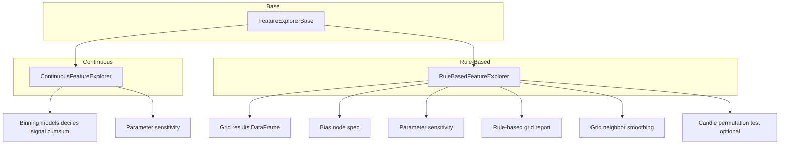

# FeatureExplorer Variants Specification (Continuous vs Rule-Based)

**Version**: 1.0.0  
**Date**: 2025-02-10  
**Status**: Specification (Design)  
**Scope**: Two FeatureExplorer subclasses (Continuous and Rule-Based), their inputs and pipelines, integration with parameter sensitivity, rule-based grid report, grid neighbor smoothing, optional candle-based permutation test, and bias_node_helpers updates. Implementation is follow-on; this spec is design only.

---

## Table of Contents

1. [Overview and Goals](#1-overview-and-goals)
2. [Architecture Overview](#2-architecture-overview)
3. [Continuous Variant](#3-continuous-variant)
4. [Rule-Based Variant: Inputs and bias_spec](#4-rule-based-variant-inputs-and-bias_spec)
5. [Rule-Based Variant: Pipeline](#5-rule-based-variant-pipeline)
6. [Rule-Based Variant: What It Does Not Do](#6-rule-based-variant-what-it-does-not-do)
7. [API Surface](#7-api-surface)
8. [bias_node_helpers Updates](#8-bias_node_helpers-updates)
9. [Candle Permutation Test (High-Level)](#9-candle-permutation-test-high-level)
10. [Data Flow for Building grid_results_df](#10-data-flow-for-building-grid_results_df)
11. [Implementation Scope](#11-implementation-scope)

---

## 1. Overview and Goals

### Purpose

Split the current [FeatureExplorer](eda/feature_explorer.py) into two variants:

- **Continuous variant**: Retains current behavior — works with a per-bar feature matrix and **binning models** (deciles, signal cumsum, parameter sensitivity, generate_summary_report, feature-shuffle permutation test).
- **Rule-based variant**: Works with **grid results** (one row per parameter permutation) and a **bias node spec**. Pipeline: parameter sensitivity (stability) → rule-based grid report → grid neighbor smoothing → optional candle-based permutation test. No binning, no deciles.

### Related specs

- [docs/to-do/rule_based_grid_report_specs.md](rule_based_grid_report_specs.md) — report content and API for grid results.
- [docs/to-do/grid_neighbor_smoothing_specs.md](grid_neighbor_smoothing_specs.md) — smoothed objective column.
- [docs/complete/param_sens.md](../complete/param_sens.md) — robustness metrics and parameter sensitivity.

---

## 2. Architecture Overview

- **Base class** (`FeatureExplorerBase` or keep `FeatureExplorer` as base): Shared helpers only (e.g. parameter canonicalization, any shared validation). No binning or decile logic in base.
- **ContinuousFeatureExplorer**: Current FeatureExplorer behavior: `features_df` + `targets_df` (and optional `metadata`), binning model, deciles, uniform bins, signal cumsum, parameter sensitivity, `generate_summary_report`, in-sample (feature-shuffle) permutation test. Works with `QuantileBinningModel`, `TwoBinBinningModel`, etc.
- **RuleBasedFeatureExplorer**: New variant. Inputs: **grid_results_df** and **bias_spec**. Pipeline: parameter sensitivity → rule-based grid report → grid neighbor smoothing → optional candle-based permutation test.

---

## 3. Continuous Variant

### Name

`ContinuousFeatureExplorer`, or retain `FeatureExplorer` for backward compatibility and introduce only `RuleBasedFeatureExplorer` as new. The spec leaves the choice to the implementer; if the class is renamed, provide `FeatureExplorer = ContinuousFeatureExplorer` alias.

### Input

- `features_df`: pd.DataFrame (per-bar feature matrix).
- `targets_df`: pd.DataFrame (aligned by index).
- `metadata`: Optional[Dict] (e.g. `feature_metadata` from FeatureExtractor).

Unchanged from current [FeatureExplorer](eda/feature_explorer.py).

### Responsibilities

All current public methods, including:

- Deciles: `plot_deciles`, `plot_all_deciles`, `plot_uniform_bins`, `plot_all_uniform_bins`, `plot_2bin`.
- Signal cumsum: `plot_signal_cumsum`, `plot_signal_cumsum_by_ticker`, `plot_all_signal_cumsum_by_ticker`.
- Distributions and timeseries: `plot_distributions`, `plot_timeseries`.
- Correlations: `plot_feature_target_correlations`, `plot_feature_correlations`, `get_correlations`.
- Parameter sensitivity: `plot_parameter_sensitivity`, `plot_2d_parameter_surface`, `plot_nd_parameter_analysis`, `generate_parameter_sensitivity_report`.
- Summary: `generate_summary_report`, `get_summary`.
- Permutation test: `run_permutation_test` (feature-shuffle, in-sample).
- Ticker-level: `plot_deciles_by_ticker`, `plot_all_deciles_by_ticker`, etc., when multi-ticker.

Uses a **binning model** (e.g. `QuantileBinningModel`, `TwoBinBinningModel`).

### Backward compatibility

Existing callers (notebooks, [bias_node_helpers.test_bias_node](research/bias_node_helpers.py) for continuous nodes) continue to use this class without API change.

---

## 4. Rule-Based Variant: Inputs and bias_spec

### Primary input: grid_results_df

DataFrame with **one row per parameter permutation**. Columns:

- **Parameter columns**: Names and count must align with parameter names in `bias_spec['params']` (e.g. `lookback`, `threshold`). May be literal column names or a mapping from spec param names to column names. Schema may match output of [ParameterAnalyzer.analyze_nd_parameters](eda/parameter_analysis.py) (e.g. `param1_value`, `param2_value`, ...) or user-defined param column names.
- **Metric columns**: At least one performance column (e.g. `sortino`, `profit_factor`, `net_return`, `max_drawdown`, `n_samples`). Aligns with [rule_based_grid_report_specs](rule_based_grid_report_specs.md) and ParameterAnalyzer output.

### Secondary input: bias_spec

Dict with the same shape as used in [single_node_test](research/single_node_test.ipynb) and [extract_features_for_bias_node](feature_extraction/feature_extractor.py):

| Key | Type | Description |
|-----|------|-------------|
| `module_name` | str | Bias node module (e.g. `'rsi'`, `'donchianchannel'`). |
| `timeframes` | List[TimeFrame] | e.g. `[TimeFrame.D]`. |
| `params` | Dict[str, Any] | Parameter names and **value ranges** used to build the grid (e.g. `{'lookback': [7, 14, 21], 'threshold': [30, 50, 70]}`). Used so the explorer knows parameter names and ordered levels for neighbor definition and reporting. |
| (optional) | | Other keys (e.g. `mode`, `PositionMode.LONG_ONLY`) may be passed through for future use (e.g. candle permutation). |

### Optional

- **Pre-computed smoothed objective**: If `grid_results_df` already has a column from [grid_neighbor_smoothing_specs](grid_neighbor_smoothing_specs.md), the report and ranking can use it.
- **features_df / targets_df**: The rule-based variant does not require a per-bar feature matrix. The spec leaves open whether to allow attaching `features_df`/`targets_df` for runs that need parameter sensitivity computed from raw features; by default, rule-based explorer receives **pre-aggregated** grid results only.

---

## 5. Rule-Based Variant: Pipeline

Order of operations:

1. **Parameter sensitivity (stability)**  
   Use [ParameterAnalyzer.compute_robustness_metrics](eda/parameter_analysis.py) (or equivalent) on `grid_results_df` with a chosen primary metric. Output: variance score, consistency score, risk score, overall rating, parameter sensitivity ranking. Answers “how stable is performance across permutations?”

2. **Rule-based grid report**  
   Call the report generator from [rule_based_grid_report_specs](rule_based_grid_report_specs.md): `generate_rule_based_grid_report(grid_results_df, param_columns, metric_config, feature_id=module_name, ...)`. Output: per-metric pass rates, best/worst permutations, verdict, optional text export.

3. **Grid neighbor smoothing**  
   Call [add_smoothed_objective](grid_neighbor_smoothing_specs.md) on `grid_results_df` with `param_columns` derived from `bias_spec['params']` and objective column = primary metric. Use the resulting `avg_objective` to rank permutations by stability; optionally surface “best by smoothed metric” in the report or a separate accessor.

4. **Candle-based permutation test (optional, high-level)**  
   See §9. Goal: test statistical significance under a null that destroys temporal structure. Per iteration: permute candles → for selected param tuple(s), create bias node → re-extract feature data from permuted candles → compute criterion. **Gap**: [extract_features_with_forward_returns](feature_extraction/feature_extractor.py) loads candles internally; there is no public “extract from this candles_df” API. The spec states that extraction from user-provided (e.g. permuted) candles requires a new entry point (e.g. `extract_features_from_candles(module_name, params, candles_df, ...)`) or an overload; implementation may be deferred.

---

## 6. Rule-Based Variant: What It Does Not Do

- **No binning model** in the explorer pipeline (rule-based signals are already discrete; [TwoBinBinningModel](feature_selection/base_models/twobin_binning.py) may be used elsewhere for evaluation but not inside this explorer).
- **No decile plots**, no uniform binning plots, no signal cumsum plots, no distribution/timeseries plots over a feature matrix.
- **No `generate_summary_report`** (that is continuous-only). Rule-based has its own report via the grid report + optional text export.

---

## 7. API Surface

Spec only; no implementation.

### Base

- Shared: e.g. `_canonicalize_param_name`, any shared validation.
- No `features_df`/`targets_df` in base if the rule-based variant does not use them.

### ContinuousFeatureExplorer

- **Constructor**: `(features_df, targets_df, metadata=None)` — unchanged.
- **Methods**: Keep current public API (plot_deciles, plot_signal_cumsum, plot_nd_parameter_analysis, generate_parameter_sensitivity_report, generate_summary_report, run_permutation_test, etc.).

### RuleBasedFeatureExplorer

- **Constructor**: `(grid_results_df, bias_spec, param_columns=None, feature_id=None)`.
  - `param_columns`: If None, derive from `bias_spec['params']` keys or from `grid_results_df` (columns that match param names).
  - `feature_id`: Report identifier (default `bias_spec['module_name']`).

- **Methods (conceptual)**:
  - `get_parameter_sensitivity(primary_metric=..., metric_threshold=...)` → robustness metrics + parameter sensitivity ranking (from grid_results_df).
  - `get_rule_based_grid_report(metric_config, primary_metric=..., export_path=None, ...)` → structured report per [rule_based_grid_report_specs](rule_based_grid_report_specs.md).
  - `add_smoothed_objective(objective_column, output_column='avg_objective')` → return new DataFrame with smoothed column (delegate to grid neighbor smoothing); optionally store for “best by stability.”
  - `run_candle_permutation_test(...)` → optional; signature and behavior high-level only (all variations vs best only; dependency on “extract from candles” noted in §9).

---

## 8. bias_node_helpers Updates

### Current behavior

[test_bias_node](research/bias_node_helpers.py) uses `FeatureExplorer` + `generate_summary_report`; works for both continuous and rule-based via `get_binning_model(is_continuous)` (Quantile vs TwoBin).

### Change for rule-based

For **rule-based** nodes, the flow should not rely on `generate_summary_report`. Two options:

- **Option A**: User builds **grid_results_df** (e.g. by running a grid over bias_spec params, extracting features per combination, computing metrics via ParameterAnalyzer or a dedicated runner). Then user constructs `RuleBasedFeatureExplorer(grid_results_df, bias_spec)` and runs parameter sensitivity, grid report, and neighbor smoothing.
- **Option B**: Add a helper, e.g. `run_rule_based_analysis(bias_spec, grid_results_df, *, metric_config, export_path=None)`, that instantiates `RuleBasedFeatureExplorer`, runs the pipeline (sensitivity + grid report + smoothing), and returns the report + smoothed DataFrame.

### Recommendation

- Add **`run_rule_based_analysis(bias_spec, grid_results_df, ...)`** in bias_node_helpers that creates `RuleBasedFeatureExplorer`, runs report + smoothing, and optionally exports.
- Keep **`test_bias_node`** for the continuous/summary-report path.
- For rule-based, `test_bias_node` may either (1) remain as-is and only support continuous + current report, or (2) detect rule-based (e.g. `is_continuous=False`) and branch to the new pipeline when `grid_results_df` is provided (e.g. optional argument `grid_results_df=None`). If `grid_results_df` is None for rule-based, require the user to pass it or document that the user must build it externally.

---

## 9. Candle Permutation Test (High-Level)

### Purpose

Under the null that price history is random (candle permutation), the rule-based node should not show systematic edge.

### Steps (conceptual)

1. Define criterion (e.g. primary metric on OOS or full period).
2. For each permutation replicate: permute candles (e.g. [BarPermute](utils/permutation_test/permute_bars.py)) → for selected param tuple(s), create bias node → extract features from **permuted** candles → compute forward returns from same permuted data → compute criterion.
3. Build null distribution; compare observed criterion to get p-value.

### Options

- (a) Run test on **all** parameter variations (e.g. aggregate or min-p-value).
- (b) Run on **best performer** only (e.g. best by primary metric or by smoothed objective).

### Gap

[extract_features_with_forward_returns](feature_extraction/feature_extractor.py) does not accept a candles DataFrame; it loads via `helpers.load_data_multi_ticker`. The spec states that an API to **extract features (and forward returns) from a provided candles DataFrame** is required for this test. Design (e.g. `extract_features_from_candles(module_name, params, candles_df, target_col=...)`) can be outlined without implementing. Implementation may be deferred. [permute_bars](utils/permutation_test/permute_bars.py) and related infra are the source of permuted bars; how they are passed into the extractor is TBD.

---

## 10. Data Flow for Building grid_results_df

**grid_results_df** for a rule-based node can be produced by:

1. Calling [extract_features_with_forward_returns](feature_extraction/feature_extractor.py) (or [extract_features_for_bias_node](feature_extraction/feature_extractor.py)) with a **param grid** in `bias_spec['params']` (lists per param), yielding `features_df` and `targets_df` with one column per parameter combination.
2. Running [ParameterAnalyzer.analyze_nd_parameters](eda/parameter_analysis.py) with that features_df/targets_df, a metric, and TwoBinBinningModel (for rule-based), yielding a DataFrame with `paramK_value` (or equivalent) and metric columns.

That DataFrame is the natural input to `RuleBasedFeatureExplorer` and to the rule-based grid report. The user may produce it via existing EDA/parameter analysis or a small wrapper that runs extraction + analyze_nd_parameters and returns the DataFrame.

---

## 11. Implementation Scope

### In scope for this spec

- Document the two variants, their inputs, pipeline order, API sketch, bias_node_helpers contract, and candle permutation at a high level.

### Out of scope for this spec

- Implementing the new classes.
- Implementing “extract from candles” or the candle permutation test; those are follow-on work.

### Deliverable

A single markdown spec file so that an implementer can add `ContinuousFeatureExplorer` / `RuleBasedFeatureExplorer`, refactor or alias `FeatureExplorer`, and update bias_node_helpers accordingly, with clear references to grid report, neighbor smoothing, and param_sens.
