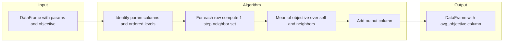

# Grid-Aware Neighbor Averaging Specification

**Version**: 1.0.0  
**Date**: 2025-02-10  
**Status**: Specification (Design)  
**Scope**: Algorithm and API for smoothing rule-based grid search results by adding a stability-adjusted objective column; no UI or EDA integration in this spec.

---

## Table of Contents

1. [Overview and Objectives](#1-overview-and-objectives)
2. [Neighbor Definition (Core Algorithm)](#2-neighbor-definition-core-algorithm)
3. [Input/Output Contract](#3-inputoutput-contract)
4. [Edge Cases and Robustness](#4-edge-cases-and-robustness)
5. [API](#5-api)
6. [Worked Example](#6-worked-example)
7. [Data Flow Diagram](#7-data-flow-diagram)
8. [Implementation Scope and Dependencies](#8-implementation-scope-and-dependencies)
9. [Future Extensions](#9-future-extensions)

---

## 1. Overview and Objectives

### Purpose

After a grid search for rule-based features (e.g. bias node parameters), we want to rank parameter combinations by **stability**: prefer combinations that remain good when one parameter is changed by one step. The grid-aware neighbor averaging algorithm adds a new column that is the mean of the objective metric at that point and at all axis-aligned 1-step neighbors, so that high values indicate both good and stable performance.

### Input

- One DataFrame with:
  - **Param columns**: Discrete parameter levels (column names and order are configurable or explicitly provided).
  - **Objective column**: A single numeric column (e.g. Sortino ratio, Sharpe ratio) whose name is configurable.

### Output

- The same DataFrame plus one new column (e.g. `avg_objective`): for each row, the mean of the objective at that row and all axis-aligned 1-step neighbors.

### Guarantees

- Input rows and columns are unchanged; no in-place mutation.
- Idempotent if run twice (deterministic).
- Works for n-dimensional grids (1 to many parameter dimensions).

---

## 2. Neighbor Definition (Core Algorithm)

### Grid assumption

Each parameter has a **finite, ordered set of levels** (e.g. `lookback in [7, 14, 21]`). Rows in the DataFrame are points on a **full or partial grid**: not every combination of levels need exist (partial grid is supported).

### Axis-aligned 1-step neighbors

For a row with parameter values \( (p_1, p_2, \ldots, p_n) \), a **neighbor** is any other row that:

1. Differs in **exactly one** parameter, and  
2. In that parameter, is exactly **one step** away (previous or next in that parameter’s ordered set).

No diagonal or multi-parameter steps: only single-parameter, single-step moves.

### Ordering of levels

- **Numeric parameters**: Use natural numeric order (ascending).
- **Categorical parameters**: Use the order of **first appearance** in the DataFrame (first occurrence defines the sequence). The spec does not require an explicit ordering API for categories; implementers may add one later.

### Smoothed value formula

For each row:

\[
\text{avg\_objective}(\text{row}) = \text{mean}\bigl(\text{objective}(\text{row}),\ \text{objective}(\text{neighbor}_1), \ldots,\ \text{objective}(\text{neighbor}_k)\bigr)
\]

The **point itself is included** in the average. The neighborhood size is \( 1 + \text{number of existing neighbors} \).

---

## 3. Input/Output Contract

### Input

| Argument | Type | Description |
|----------|------|-------------|
| `df` | `pd.DataFrame` | DataFrame containing parameter columns and one objective column. |
| `param_columns` | `List[str]` | Column names that define the grid dimensions. Order matters for reproducibility (used consistently for “adjacent” and ordering). |
| `objective_column` | `str` | Name of the column containing the numeric metric to smooth. |
| `output_column` | `str` (optional) | Name of the new column to add. Default: `'avg_objective'`. |

### Output

- **New DataFrame** = input DataFrame + one new column (the smoothed objective). No in-place mutation of the input.

### Missing neighbors (partial grid)

If a 1-step neighbor **does not exist** in the DataFrame (e.g. boundary of the grid or a hole in a partial grid), that neighbor is **omitted** from the average. Thus:

- **avg_objective** = mean over (self + all *existing* neighbors only).
- Boundary points (or points next to missing cells) average over fewer values; that is acceptable and documented.

---

## 4. Edge Cases and Robustness

| Case | Behavior |
|------|----------|
| **Single row** | `avg_objective` = that row’s objective (no neighbors). |
| **1D grid** | Each point has at most 2 neighbors (prev/next); average over 1–3 values. |
| **Partial grid** | Only rows present in the DataFrame participate. A “neighbor” exists only if there is a row with that parameter tuple. No imputation. |
| **Duplicate param tuples** | Multiple rows can share the same parameter tuple. For each row, compute neighbors by **parameter tuple**: neighbors are other *cells* (distinct param tuples) that are 1-step away. For “self”, use the **current row’s** objective value. So each row’s `avg_objective` = mean( current row’s objective, objective of neighbor cell 1, …, objective of neighbor cell k ). If a neighbor cell has multiple rows, use a single representative value for that cell (e.g. mean of objective over all rows in that cell) to avoid double-counting. |
| **Non-numeric objective** | Out of scope. The objective column must be numeric; behavior with non-numeric values is undefined. |
| **Empty DataFrame** | Return a copy of the DataFrame with the output column added; column will be empty (or implementer may raise; spec recommends returning empty column for consistency). |
| **Missing objective value (NaN)** | Spec leaves to implementer: either propagate NaN (row’s avg_objective = NaN) or exclude that row from others’ neighborhoods. Recommend: exclude NaN from means and document. |

---

## 5. API

The public API is a **single function** (no class required for the minimal spec).

### Function signature

```python
def add_smoothed_objective(
    df: pd.DataFrame,
    param_columns: List[str],
    objective_column: str,
    output_column: str = "avg_objective",
) -> pd.DataFrame:
    """
    Add a stability-smoothed objective column using grid-aware neighbor averaging.

    For each row, computes the mean of the objective at that row and at all
    axis-aligned 1-step neighbor rows (neighbors differ in exactly one
    parameter by one step). Result is written to a new column; input is unchanged.

    Parameters
    ----------
    df : pd.DataFrame
        DataFrame with param columns and one objective column.
    param_columns : List[str]
        Column names that define the grid (order used for neighbor definition).
    objective_column : str
        Name of the numeric column to smooth.
    output_column : str, default "avg_objective"
        Name of the new column to add.

    Returns
    -------
    pd.DataFrame
        New DataFrame with same rows/columns as df plus output_column.
    """
```

**Return type**: New DataFrame; input `df` is not modified.

---

## 6. Worked Example

2D grid: parameters `lookback` and `threshold` with levels:

- `lookback`: [7, 14, 21]
- `threshold`: [30, 50, 70]

Example row: `(lookback=14, threshold=50)`. Its axis-aligned 1-step neighbors are:

- (7, 50) — one step back in lookback  
- (21, 50) — one step forward in lookback  
- (14, 30) — one step back in threshold  
- (14, 70) — one step forward in threshold  

Suppose the DataFrame has these objectives:

| lookback | threshold | objective |
|----------|-----------|-----------|
| 7  | 30 | 0.8  |
| 7  | 50 | 1.0  |
| 7  | 70 | 0.6  |
| 14 | 30 | 1.1  |
| 14 | 50 | 1.4  |
| 14 | 70 | 1.0  |
| 21 | 30 | 0.9  |
| 21 | 50 | 1.2  |
| 21 | 70 | 0.7  |

For the row (14, 50) with objective 1.4:

- Self: 1.4  
- Neighbors: (7,50)=1.0, (21,50)=1.2, (14,30)=1.1, (14,70)=1.0  

**avg_objective** = (1.4 + 1.0 + 1.2 + 1.1 + 1.0) / 5 = **1.14**.

So the row keeps objective 1.4 and gets avg_objective 1.14. A row with high objective but low avg_objective would be in a “peak” that drops off nearby; a row with similar objective and avg_objective is in a stable region.

---

## 7. Data Flow Diagram



---

## 8. Implementation Scope and Dependencies

### Scope

- Algorithm and API only: one function that takes a DataFrame and returns a DataFrame with the new column.
- No UI, no integration with EDA or FeatureExplorer in this spec.
- Implementation can live in a dedicated module (e.g. `utils/grid_smoothing.py`) or under `eda/`; the spec leaves placement to the implementer.

### Dependencies

- **pandas** only for the grid-based variant. No scipy/sklearn required.

### Related documentation

- [docs/bias_nodes/base_bias_node_specs.md](../bias_nodes/base_bias_node_specs.md) — context on rule-based bias nodes and parameterized features.
- [docs/complete/param_sens.md](../complete/param_sens.md) — existing parameter grid and sensitivity analysis.

---

## 9. Future Extensions

- **KNN fallback for non-grid data**: When the data is not on a regular grid (e.g. random search), a distance-based K-nearest-neighbor smoother could be offered as an alternative; out of scope for this spec.
- **Explicit ordering for categorical params**: Allow the caller to pass per-parameter ordered lists for categorical levels instead of inferring from first appearance.
- **Weighted averaging**: Option to weight neighbors by distance or by number of steps; not in scope for v1.
