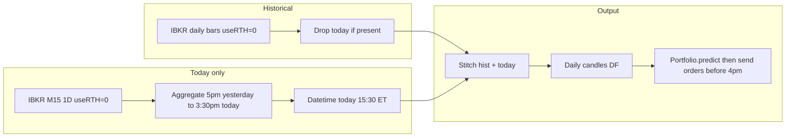

# Spec: Custom 5pm–3:30pm ET Daily Bar (M15 for Today Only)

## 1. Objective

- **Input:** Continuous futures (ES, NQ, YM, RTY) from IBKR (delayed 15 minutes).
- **Output:** A candles DataFrame with one “daily” bar per session for `lookback_days`. **Historical bars:** standard IB daily bars. **Today’s bar:** a single custom bar (5:00 PM ET yesterday → 3:30 PM ET today) built by aggregating M15 data.
- **Purpose:** Run the pipeline at **3:45 PM ET** (when delayed futures data includes the 3:30 PM bar); aggregate 5pm yesterday → 3:30pm today; generate forecast and send fractional ETF orders **before 4 PM ET** market close.

## 2. Data Source (IBKR) — Two Requests per Ticker

### 2.1 Historical: daily bars only

- **Request:** One historical data request per ticker: `bar_size="1 day"`, `duration=f"{lookback_days} D"`, `end_date_time=""`, `useRTH=0` (Globex), TRADES, `format_date=1`. Contract unchanged (CONTFUT, same symbols/exchanges as today).
- **Result:** Up to `lookback_days` daily bars. The **last** bar may be the session that closed yesterday (complete) or an incomplete “today” bar from IB; see §2.3 for how to combine with today’s custom bar.
- **No M15 for history:** No chunking or intraday requests for past days.

### 2.2 Today’s session: M15 bars only

- **Request:** One intraday request per ticker for **today’s session only**: `bar_size="15 mins"`, duration covering 5:00 PM ET (previous day) through current time (e.g. `"1 D"` or explicit end), `useRTH=0`, TRADES, `format_date=1`.
- **Result:** M15 bars from 17:00 ET yesterday up to the latest available bar. With **15-minute delayed** futures data, at **3:45 PM ET** the latest bar is **3:30 PM ET** today. Used only to build **one** aggregated bar for today (§4).

### 2.3 Stitching historical + today

- **Historical daily bars:** Use all bars from the daily request whose session-close date is **strictly before** today (ET). If IB returned an incomplete “today” bar, drop it (do not use it).
- **Today’s bar:** Build the single 5pm–3:30pm bar from the M15 request (§4). Datetime = **today at 15:30 ET** (session close of our custom bar).
- **Final series:** `historical_daily_bars` (no “today” from IB) + `[today_custom_bar]`, sorted by `datetime` ascending. Total length = `lookback_days`.

## 3. Session Definition (5pm–3:30pm ET) — For Today Only

- **Today’s session** (the only one we build from M15):
  - Start: **yesterday, 17:00 ET** (5pm, inclusive).
  - End: **today, 15:30 ET** (3:30pm, inclusive).
- **Bar-to-session:** M15 bars in the request that fall in [yesterday 17:00, today 15:30] (ET) all belong to this single “today” bar.
- **Run time:** Pipeline is intended to run at **3:45 PM ET**, when delayed data includes the 3:30 PM bar; orders are sent before 4 PM ET close.

## 4. Aggregation Rules (M15 → one daily bar for today)

For the M15 bars in **today’s session only** (5pm yesterday → 3:30pm today):

| Field  | Rule                                                |
| ------ | --------------------------------------------------- |
| open   | Open of the **first** bar in the window (by time).  |
| high   | **Max** of all bars’ high.                          |
| low    | **Min** of all bars’ low.                           |
| close  | Close of the **last** bar in the window (by time).  |
| volume | **Sum** of all bars’ volume.                        |

Output **datetime** for this bar: **today at 15:30 ET** (3:30pm, session close). If run before 3:45 PM ET, the session may be incomplete (last bar &lt; 3:30pm); then use last available bar’s close and datetime = that bar’s time (or 15:30 ET as placeholder); document the chosen behavior.

## 5. Output Contract (downstream compatibility)

The stitched series (historical daily + today’s custom bar) must match the current pipeline contract:

- **Columns:** `datetime`, `open`, `high`, `low`, `close`, `volume`, `ticker`, `timeframe`.
- **timeframe:** `TimeFrame.D` (daily).
- **datetime:** One row per session; for today’s bar use session close **today 15:30 ET** (or last M15 time if incomplete). Timezone handling consistent with rest of [tws_live_forecast.py](scripts/tws_live_forecast.py).
- **Ordering:** Sort by `datetime` ascending.

No change to Portfolio, ETF share calculation, or Telegram formatting.

## 6. Configuration

- **Config file:** [configs/live_forecast_config.json](configs/live_forecast_config.json).
- **New options under `data`:**
  - **`daily_bar_session`:** `"rth"` | `"5pm_330pm"`.  
    - `"rth"`: current behavior (1-day bars only, `useRTH=1`).  
    - `"5pm_330pm"`: historical = daily bars (§2.1); today = M15 fetch + aggregate 5pm yesterday → 3:30pm today (§2.2, §4). Designed to run at 3:45pm ET (delayed data) and send orders before 4pm.
  - **`intraday_bar_size`:** (optional) `"15 mins"`. Only used for **today’s** M15 request when `daily_bar_session == "5pm_330pm"`. Default in code: `"15 mins"` if missing.

Existing `lookback_days` and `bar_size` remain. When `daily_bar_session == "5pm_330pm"`, historical is still daily bars; only the **current session** uses M15 and aggregation.

## 7. Edge Cases and Assumptions

- **Timezone:** All session logic and bar times in **ET** (America/New_York). IB timestamps interpreted as ET or converted explicitly.
- **Delayed data:** Futures data is delayed 15 minutes. At 3:45 PM ET we have M15 bars through 3:30 PM ET. Run pipeline at 3:45pm; send orders before 4pm close.
- **Historical daily bar definition:** IB daily with `useRTH=0` is typically 6pm–5pm ET. We use these as-is for the past; only today is 5pm–3:30pm. Small mismatch (past bars close 5pm, today’s custom bar closes 3:30pm) is accepted.
- **Incomplete today:** If the script runs before 3:45 PM ET, today’s bar is built from M15 up to the last available bar. Document whether datetime is 15:30 ET or the last bar’s time.
- **No chunking:** Only two requests per ticker (daily + M15 for ~1 D). No M15 chunking or pacing concerns for history.
- **Instruments:** Same list (ES, NQ, YM, RTY). Per ticker: fetch daily, fetch M15 for today, stitch, then concatenate across tickers as in current `main()`.

## 8. Implementation Scope (no code in this spec)

- **New/updated in [scripts/tws_live_forecast.py](scripts/tws_live_forecast.py):**
  - When `daily_bar_session == "5pm_330pm"` and for **today** only: helper to request M15 bars (e.g. duration `"1 D"`, `bar_size="15 mins"`, `use_rth=0`) for one contract; helper to aggregate those M15 bars in the window [5pm yesterday, 3:30pm today] into one OHLCV bar (rule §4) with datetime today 15:30 ET.
  - Per ticker: (1) fetch daily bars (`lookback_days`, 1 day, useRTH=0); (2) drop any bar that is “today” from IB (incomplete); (3) fetch M15 for today’s session (5pm yesterday → now); (4) aggregate M15 → one bar (5pm–3:30pm); (5) append to historical daily bars; (6) return DataFrame with columns as in §5.
  - Top-level: if `daily_bar_session == "5pm_330pm"`, use the above two-request + stitch flow; else call existing `fetch_historical_candles`. Rest of `main()` unchanged.
- **Config:** Add `daily_bar_session` and optional `intraday_bar_size` to [configs/live_forecast_config.json](configs/live_forecast_config.json) when implementing.
- **No changes** to [scripts/demo_ib_data_fetch.py](scripts/demo_ib_data_fetch.py) required.

## 9. Summary Diagram

---

This spec is sufficient to implement: historical = daily bars; today = custom 5pm–3:30pm bar from M15 aggregation. Run at 3:45pm ET (delayed data); send orders before 4pm. No code is included.