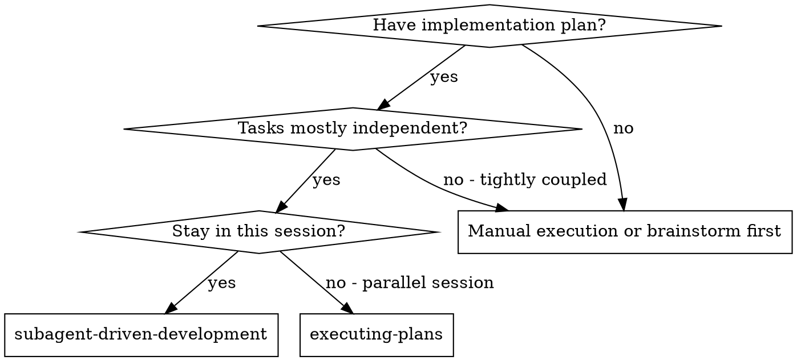
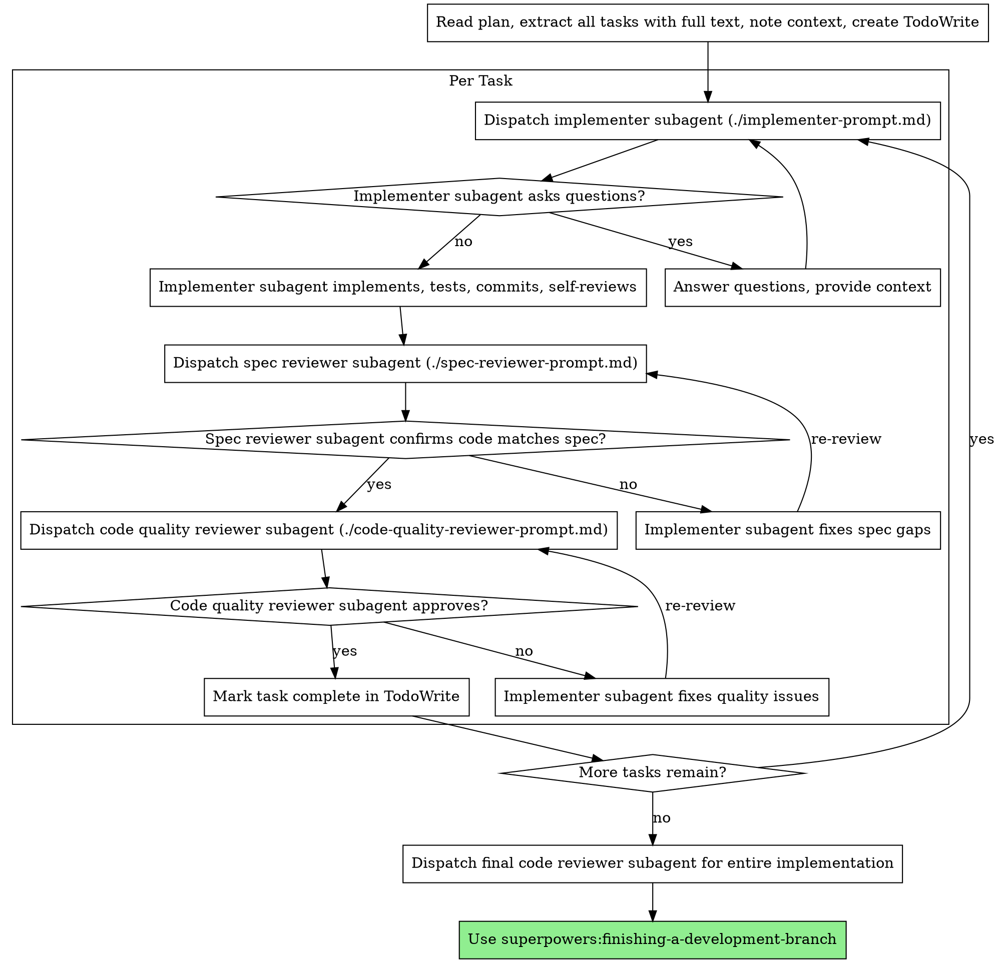
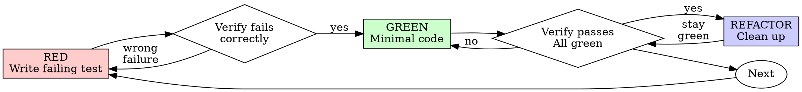

# Permutation testing phase for trading pipeline setup

**Session ID:** ses_391c00569ffeqWxGwWSCSP5MHK
**Created:** 2/17/2026, 4:56:52 PM
**Updated:** 2/18/2026, 2:35:13 PM

---

## Assistant (Build · gpt-5.3-codex · 19.8s)

_Thinking:_

**Drafting config schema design**

Awesome.

**Section 2: Config Schema (exactly how researchers control it)**

- Keep your existing research configs (`ResearchConfig`, `RuleBasedResearchConfig`) and add a nested `permutation` block so researchers configure everything in one place in `feature_research/*/config.py`.
- Add a metric resolver spec that supports both built-ins and custom callables:
  - `builtin`: e.g. `sharpe`, `sortino`, `calmar`, `profit_factor`
  - `callable_path`: e.g. `"my_metrics.custom:objective"`
  - `kwargs`: optional args passed to metric
  - Validation rule: exactly one of `builtin` or `callable_path` must be set.
- Add phase settings with explicit controls:
  - `in_sample`: `nreps`, `alpha`, `metric_threshold`, `permute_start_idx`
  - `walkforward`: `enabled`, `fold_structure`, `top_k`, `min_folds_stable`
  - `out_of_sample`: `enabled`, `start`, `end`, `locked_selection_source` (`stage2_passers` or `stable_intersection`)
- Add Stage-2 continuous mode policy:
  - `continuous_stage2_mode_order = ["feature_shuffle", "candle_shuffle"]` (default)
  - Enforces vector-first and feature-shuffle-first before candle-shuffle compute.
- Add report controls:
  - `output_dir`, `formats` (`markdown/json/html`), `save_plots`, `save_null_distributions`
- Add deterministic control:
  - one `random_seed` at top-level permutation config; all per-rep seeds derived from it.

Proposed shape (Python dataclass style, not YAML) to match your current repo conventions:
```python
PermutationResearchConfig(
  objective_metric=ObjectiveMetricSpec(...),
  in_sample=InSampleConfig(...),
  walkforward=WalkforwardConfig(...),
  out_of_sample=OutOfSampleConfig(...),
  report=PermutationReportConfig(...),
  random_seed=42,
)
```

If this config model looks good, I’ll move to **Section 3: full execution/data flow** (including custom candle-data injection through bias-node loaders for candle shuffling).

---

## User

continue

---

## Assistant (Build · gpt-5.3-codex · 12.3s)

_Thinking:_

**Designing detailed feature extraction**

**Tool: read**

**Input:**
```json
{
  "filePath": "/home/raman/repos/Trading-Algo/feature_research/continuous_binning/data_loader.py"
}
```

**Output:**
```
<path>/home/raman/repos/Trading-Algo/feature_research/continuous_binning/data_loader.py</path>
<type>file</type>
<content>1: """Data loading and cache management helpers for the continuous binning research pipeline."""
2: from __future__ import annotations
3: 
4: from itertools import product
5: from pathlib import Path
6: from typing import TYPE_CHECKING, Any
7: 
8: import pandas as pd
9: 
10: if TYPE_CHECKING:
11:     from feature_research.continuous_binning.config import ResearchConfig
12: 
13: from feature_extraction.feature_extractor import extract_features_for_bias_node
14: from utils.cache_manager import CacheManager
15: from utils.enums import TimeFrame
16: 
17: 
18: def expand_bias_specs(bias_spec: dict[str, Any]) -> list[dict[str, Any]]:
19:     """Expand a bias_spec with list-valued params into one spec per param combo."""
20:     params = bias_spec.get("params", {})
21:     keys = list(params.keys())
22:     values = [v if isinstance(v, list) else [v] for v in params.values()]
23:     combos = [dict(zip(keys, combo)) for combo in product(*values)] if keys else [{}]
24:     return [
25:         {
26:             "module_name": bias_spec["module_name"],
27:             "params": combo,
28:             "timeframes": bias_spec.get("timeframes", [TimeFrame.D]),
29:         }
30:         for combo in combos
31:     ]
32: 
33: 
34: def param_combo_label(combo: dict[str, Any]) -> str:
35:     """Return a human-readable folder name for a param combo dict.
36: 
37:     Examples
38:     --------
39:     >>> param_combo_label({"lookback": 5})
40:     'lookback_5'
41:     >>> param_combo_label({"lookback": 20, "atr_length": 14})
42:     'atr_length_14__lookback_20'
43:     """
44:     parts = [f"{k}_{v}" for k, v in sorted(combo.items())]
45:     return "__".join(parts)
46: 
47: 
48: def populate_cache_if_needed(config: "ResearchConfig") -> None:
49:     """Populate the feature cache if config.populate_cache is True.
50: 
51:     Safe to call even if cache already exists — ``overwrite_existing=False``
52:     means only missing entries are computed.
53:     """
54:     if not config.populate_cache:
55:         return
56: 
57:     project_root = Path(__file__).resolve().parents[2]
58:     candle_dir = project_root / "data" / "ohlc_data"
59:     if not candle_dir.exists():
60:         print(
61:             f"[data_loader] WARNING: candle directory not found at {candle_dir}. "
62:             "Skipping cache population."
63:         )
64:         return
65: 
66:     manager = CacheManager(candle_dir=str(candle_dir))
67:     expanded = expand_bias_specs(config.bias_spec)
68:     summary = manager.populate_cache(
69:         bias_node_specs=expanded,
70:         tickers=config.tickers,
71:         start_date=config.start,
72:         end_date=config.end,
73:         show_progress=True,
74:         overwrite_existing=False,
75:     )
76:     print(f"[data_loader] Cache populated: {summary}")
77: 
78: 
79: def load_features_for_combo(
80:     single_combo_spec: dict[str, Any],
81:     config: "ResearchConfig",
82: ) -> tuple[pd.Series, pd.Series, str] | None:
83:     """Extract feature + target Series for a single param combo across all config tickers.
84: 
85:     Returns
86:     -------
87:     (feature, target, feature_col) or None if extraction fails / returns empty data.
88: 
89:     The returned Series are aligned (same index, NaNs dropped) and concatenated
90:     across all tickers in ``config.tickers``.
91:     """
92:     try:
93:         features_df, targets_df = extract_features_for_bias_node(
94:             bias_spec=single_combo_spec,
95:             ticker=config.tickers,
96:             start=config.start,
97:             end=config.end,
98:             use_millisecond_offset=True,
99:             target_col=config.target_col,
100:             use_cache=config.use_cache,
101:         )
102:     except Exception as exc:
103:         print(f"[data_loader] Feature extraction failed for {single_combo_spec['params']}: {exc}")
104:         return None
105: 
106:     if features_df is None or features_df.empty:
107:         print(f"[data_loader] Empty features for {single_combo_spec['params']}. Skipping.")
108:         return None
109: 
110:     feature_cols = [c for c in features_df.columns if c != "ticker"]
111:     if not feature_cols:
112:         return None
113:     feature_col = feature_cols[0]
114: 
115:     target_col_name = (
116:         config.target_col
117:         if config.target_col in targets_df.columns
118:         else [c for c in targets_df.columns if c != "ticker"][0]
119:     )
120: 
121:     aligned = pd.DataFrame(
122:         {"feature": features_df[feature_col], "target": targets_df[target_col_name]}
123:     ).dropna()
124: 
125:     if aligned.empty:
126:         return None
127: 
128:     return aligned["feature"], aligned["target"], feature_col
129: 

(End of file - total 129 lines)
</content>
```

**Tool: read**

**Input:**
```json
{
  "filePath": "/home/raman/repos/Trading-Algo/feature_research/continuous_binning/config.py"
}
```

**Output:**
```
<path>/home/raman/repos/Trading-Algo/feature_research/continuous_binning/config.py</path>
<type>file</type>
<content>1: """Researcher-editable configuration for the continuous binning EDA pipeline.
2: 
3: Edit the values in load_config() to customise tickers, date range, and bias node specs.
4: All other scripts import from here — change once, apply everywhere.
5: """
6: from __future__ import annotations
7: 
8: from dataclasses import dataclass
9: from datetime import datetime
10: from pathlib import Path
11: from typing import Any
12: 
13: from utils.enums import Ticker, TimeFrame
14: 
15: # ---------------------------------------------------------------------------
16: # Root of the feature_research tree — resolved at import time so scripts
17: # work regardless of the working directory they are launched from.
18: # ---------------------------------------------------------------------------
19: _FEATURE_RESEARCH_DIR = Path(__file__).resolve().parents[1]
20: _CB_DIR = _FEATURE_RESEARCH_DIR / "continuous_binning"
21: 
22: 
23: @dataclass(frozen=True)
24: class ResearchConfig:
25:     """All researcher-editable settings for continuous-binning EDA.
26: 
27:     Attributes
28:     ----------
29:     tickers : list[Ticker]
30:         Instruments to include. Data is concatenated across tickers.
31:     start : datetime
32:         In-sample period start (inclusive).
33:     end : datetime
34:         In-sample period end (inclusive).
35:     bias_spec : dict[str, Any]
36:         Bias-node specification.  ``params`` values may be lists for grid search.
37:         Example::
38: 
39:             {
40:                 "module_name": "rsi",
41:                 "timeframes": [TimeFrame.D],
42:                 "params": {"lookback": [2, 3, 4, 5, 6, 7, 8, 9, 10]},
43:             }
44:     target_col : str
45:         Column from ``targets_df`` to use as the prediction target.
46:         Options: ``"log_return"``, ``"log_return_atr"``, ``"log_return_ewsd"``.
47:     strategy : str
48:         Passed to the EDA summary label only.
49:         Options: ``"long"``, ``"short"``, ``"long-short"``.
50:     use_cache : bool
51:         Whether to use pre-computed caches for feature extraction.
52:     populate_cache : bool
53:         If True, run ``CacheManager.populate_cache()`` before extraction.
54:     reports_dir : Path
55:         Root output directory for EDA reports.
56:         Default: ``feature_research/continuous_binning/results/{module_name}/``
57:     """
58: 
59:     tickers: list[Ticker]
60:     start: datetime
61:     end: datetime
62:     bias_spec: dict[str, Any]
63:     target_col: str
64:     strategy: str
65:     use_cache: bool
66:     populate_cache: bool
67:     reports_dir: Path
68: 
69: 
70: def load_config() -> ResearchConfig:
71:     """Return the default research configuration.
72: 
73:     **Edit this function** to customise tickers, dates, and bias node specs.
74:     All pipeline scripts import from here.
75:     """
76:     # ==========================================================================
77:     # EDIT BELOW
78:     # ==========================================================================
79:     tickers = [
80:         Ticker.ES,   # E-Mini S&P 500
81:         Ticker.NQ,   # E-Mini Nasdaq-100
82:         Ticker.YM,   # E-Mini Dow Jones
83:         Ticker.RTY,  # E-Mini Russell 2000
84:     ]
85: 
86:     start = datetime(2000, 1, 1)
87:     end = datetime(2024, 12, 31)
88: 
89:     bias_spec = {
90:         "module_name": "rsi",
91:         "timeframes": [TimeFrame.D],
92:         "params": {"lookback": [2, 3, 4, 5, 6, 7, 8, 9, 10]},
93:     }
94: 
95:     target_col = "log_return"
96:     strategy = "long-short"
97: 
98:     # Caching
99:     use_cache = True
100:     populate_cache = True
101:     # ==========================================================================
102:     # EDIT ABOVE
103:     # ==========================================================================
104: 
105:     module_name = bias_spec["module_name"]
106:     reports_dir = _CB_DIR / "results" / module_name
107: 
108:     return ResearchConfig(
109:         tickers=tickers,
110:         start=start,
111:         end=end,
112:         bias_spec=bias_spec,
113:         target_col=target_col,
114:         strategy=strategy,
115:         use_cache=use_cache,
116:         populate_cache=populate_cache,
117:         reports_dir=reports_dir,
118:     )
119: 

(End of file - total 119 lines)
</content>
```

**Tool: read**

**Input:**
```json
{
  "filePath": "/home/raman/repos/Trading-Algo/utils/permutation_test/permutation_engine.py"
}
```

**Output:**
```
<path>/home/raman/repos/Trading-Algo/utils/permutation_test/permutation_engine.py</path>
<type>file</type>
<content>1: """
2: Core Permutation Test Engine
3: 
4: This module provides a unified, modular permutation test framework that:
5: 1. Abstracts the core permutation logic
6: 2. Supports both bar and feature permutation strategies
7: 3. Handles multiprocessing transparently
8: 4. Is agnostic to the criterion function (in-sample, CV, walk-forward)
9: 
10: Architecture:
11: - PermutationEngine: Core engine that runs permutations in parallel
12: - PermutationStrategy: Abstract interface for permutation methods
13: - FeaturePermutationStrategy: Shuffles feature values
14: - BarPermutationStrategy: Shuffles price bars and re-extracts features
15: 
16: Usage:
17:     strategy = FeaturePermutationStrategy()
18:     engine = PermutationEngine(strategy, n_jobs=-1)
19:     results = engine.run_permutation_test(
20:         data=df,
21:         feature_cols=['rsi_5', 'rsi_14'],
22:         criterion_func=my_criterion_function,
23:         nreps=100
24:     )
25: """
26: 
27: import numpy as np
28: import pandas as pd
29: from typing import Dict, List, Optional, Callable, Any, Tuple
30: from abc import ABC, abstractmethod
31: from multiprocessing import Pool, cpu_count
32: from functools import partial
33: from datetime import datetime
34: import sys
35: import os
36: 
37: # Add parent directory to path
38: sys.path.append(os.path.dirname(os.path.dirname(os.path.abspath(__file__))))
39: from utils.enums import Ticker, TimeFrame
40: 
41: 
42: class PermutationStrategy(ABC):
43:     """
44:     Abstract base class for permutation strategies.
45:     
46:     A permutation strategy defines HOW to permute the data.
47:     It doesn't know WHAT criterion to compute - that's passed in separately.
48:     """
49:     
50:     @abstractmethod
51:     def permute(
52:         self,
53:         data: Any,
54:         random_seed: int,
55:         **kwargs
56:     ) -> Any:
57:         """
58:         Permute the data.
59:         
60:         Args:
61:             data: Data to permute (type depends on strategy)
62:             random_seed: Random seed for reproducibility
63:             **kwargs: Strategy-specific parameters
64:             
65:         Returns:
66:             Permuted data (same type as input)
67:         """
68:         pass
69:     
70:     @abstractmethod
71:     def validate_data(self, data: Any, **kwargs) -> None:
72:         """
73:         Validate that data is in the correct format for this strategy.
74:         
75:         Args:
76:             data: Data to validate
77:             **kwargs: Strategy-specific parameters
78:             
79:         Raises:
80:             ValueError: If data is invalid
81:         """
82:         pass
83: 
84: 
85: class FeaturePermutationStrategy(PermutationStrategy):
86:     """
87:     Feature permutation strategy: Shuffles feature values independently.
88:     
89:     This is fast and tests whether the feature VALUES predict the target.
90:     It keeps the target fixed and shuffles each feature independently.
91:     """
92:     
93:     def validate_data(
94:         self,
95:         data: pd.DataFrame,
96:         feature_cols: List[str],
97:         target_col: str,
98:         **kwargs
99:     ) -> None:
100:         """Validate DataFrame has required columns."""
101:         if not isinstance(data, pd.DataFrame):
102:             raise ValueError("Data must be a pandas DataFrame")
103:         
104:         if target_col not in data.columns:
105:             raise ValueError(f"Target column '{target_col}' not found in data")
106:         
107:         missing_features = [col for col in feature_cols if col not in data.columns]
108:         if missing_features:
109:             raise ValueError(f"Features not found in data: {missing_features}")
110:     
111:     def permute(
112:         self,
113:         data: pd.DataFrame,
114:         random_seed: int,
115:         feature_cols: List[str],
116:         exclude_features: Optional[List[str]] = None,
117:         train_windows: Optional[List[Tuple[pd.Timestamp, pd.Timestamp]]] = None,
118:         **kwargs
119:     ) -> pd.DataFrame:
120:         """
121:         Shuffle feature values independently.
122:         
123:         For walk-forward tests, this method supports shuffling features independently
124:         within each region (e.g., first training window vs remaining data) to prevent
125:         cross-contamination.
126:         
127:         Args:
128:             data: DataFrame with features and target (must have datetime index)
129:             random_seed: Random seed for reproducibility
130:             feature_cols: List of feature columns to shuffle
131:             exclude_features: Features to NOT shuffle (e.g., ATR for normalization)
132:             train_windows: Optional list of (start, end) datetime tuples defining regions.
133:                           If provided, features are shuffled independently within each region.
134:                           This prevents data contamination in walk-forward tests.
135:             **kwargs: Ignored
136:             
137:         Returns:
138:             DataFrame with shuffled features
139:         """
140:         np.random.seed(random_seed)
141:         
142:         # Create a copy to avoid modifying original
143:         permuted_df = data.copy()
144:         
145:         # Determine which features to actually shuffle
146:         exclude_features = exclude_features or []
147:         features_to_shuffle = [f for f in feature_cols if f not in exclude_features]
148:         
149:         if train_windows is not None:
150:             # Two-region shuffling: shuffle features independently within each region
151:             for region_start, region_end in train_windows:
152:                 # Handle timezone compatibility
153:                 # Use replace(tzinfo=...) for datetime objects, not tz_localize() which is for pandas DatetimeIndex
154:                 if permuted_df.index.tz is not None:
155:                     if region_start.tzinfo is None:
156:                         region_start = region_start.replace(tzinfo=permuted_df.index.tz)
157:                         region_end = region_end.replace(tzinfo=permuted_df.index.tz)
158:                 elif region_start.tzinfo is not None:
159:                     region_start = region_start.replace(tzinfo=None)
160:                     region_end = region_end.replace(tzinfo=None)
161:                 
162:                 # Get mask for this region
163:                 mask = (permuted_df.index >= region_start) & (permuted_df.index < region_end)
164:                 region_indices = permuted_df.index[mask]
165:                 
166:                 if len(region_indices) == 0:
167:                     continue
168:                 
169:                 # Shuffle each feature within this region
170:                 for feature in features_to_shuffle:
171:                     # Get values for this region
172:                     region_values = permuted_df.loc[region_indices, feature].values
173:                     # Shuffle them
174:                     shuffled_values = np.random.permutation(region_values)
175:                     # Put them back
176:                     permuted_df.loc[region_indices, feature] = shuffled_values
177:         else:
178:             # Standard global shuffling: shuffle each feature independently across all data
179:             for feature in features_to_shuffle:
180:                 permuted_df[feature] = np.random.permutation(permuted_df[feature].values)
181:         
182:         return permuted_df
183: 
184: 
185: class BarPermutationStrategy(PermutationStrategy):
186:     """
187:     Bar permutation strategy: Shuffles price bars and re-extracts features.
188:     
189:     This is slower but more realistic - it tests whether the PRICE STRUCTURE
190:     contains predictive information. Features are fully re-extracted from
191:     shuffled bars.
192:     """
193:     
194:     def validate_data(
195:         self,
196:         data: Any,
197:         bar_data: Optional[Dict[str, Any]] = None,
198:         **kwargs
199:     ) -> None:
200:         """
201:         Validate data has required components.
202:         
203:         For bar strategy, we validate bar_data if provided, otherwise validate
204:         that data is a DataFrame (for computing original criterion).
205:         """
206:         # If bar_data is provided, validate it
207:         if bar_data is not None:
208:             required_keys = ['price_df', 'ticker', 'start', 'end', 'base_tf', 'atr_feature', 'feature_cols']
209:             missing_keys = [key for key in required_keys if key not in bar_data]
210:             if missing_keys:
211:                 raise ValueError(f"Missing required keys in bar_data: {missing_keys}")
212:             
213:             if not isinstance(bar_data['price_df'], pd.DataFrame):
214:                 raise ValueError("price_df must be a pandas DataFrame")
215:             
216:             required_cols = ['open', 'high', 'low', 'close', 'datetime']
217:             missing_cols = [col for col in required_cols if col not in bar_data['price_df'].columns]
218:             if missing_cols:
219:                 raise ValueError(f"price_df missing required columns: {missing_cols}")
220:         else:
221:             # For original criterion computation, data should be a DataFrame
222:             if not isinstance(data, pd.DataFrame):
223:                 raise ValueError("Data must be a pandas DataFrame for bar strategy")
224:     
225:     def permute(
226:         self,
227:         data: Any,
228:         random_seed: int,
229:         permute_start_idx: int = 252,
230:         bar_data: Optional[Dict[str, Any]] = None,
231:         train_windows: Optional[List[Tuple[pd.Timestamp, pd.Timestamp]]] = None,
232:         shuffle_mode: str = "auto",
233:         intraday_gap_config: Optional[Any] = None,
234:         **kwargs
235:     ) -> pd.DataFrame:
236:         """
237:         Shuffle price bars and re-extract features.
238:         
239:         For walk-forward tests, this method supports shuffling bars independently
240:         within each training window to prevent cross-contamination between folds.
241:         
242:         Args:
243:             data: Original DataFrame (not used for permutation, only for validation)
244:             random_seed: Random seed for reproducibility
245:             permute_start_idx: Index to start permuting from (used if train_windows is None)
246:             bar_data: Dictionary with price_df and extraction parameters
247:             train_windows: Optional list of (start, end) datetime tuples defining training windows.
248:                           If provided, bars are shuffled independently within each window.
249:                           This prevents data contamination in walk-forward tests.
250:             **kwargs: Ignored
251:             
252:         Returns:
253:             DataFrame with re-extracted features from permuted bars
254:         """
255:         from utils.permutation_test.permute_bars import (
256:             BarPermute,
257:             BarPermuteWalkForward,
258:             _extract_features_from_bars,
259:         )
260:         
261:         if bar_data is None:
262:             raise ValueError("bar_data is required for BarPermutationStrategy")
263:         
264:         np.random.seed(random_seed)
265:         
266:         # Extract parameters from bar_data
267:         price_df = bar_data['price_df']
268:         ticker = bar_data['ticker']
269:         start = bar_data['start']
270:         end = bar_data['end']
271:         base_tf = bar_data['base_tf']
272:         atr_feature = bar_data['atr_feature']
273:         feature_cols = bar_data['feature_cols']
274:         
275:         # Choose permutation strategy based on whether train_windows is provided
276:         if train_windows is not None:
277:             # Walk-forward mode: shuffle bars independently within each training window
278:             permuter = BarPermuteWalkForward(price_df, train_windows=train_windows)
279:             permuted_bars = permuter.permute()
280:         else:
281:             # Standard mode: shuffle all bars from permute_start_idx onwards
282:             permuter = BarPermute(
283:                 price_df,
284:                 permute_start_idx=permute_start_idx,
285:                 shuffle_mode=shuffle_mode,
286:                 intraday_gap_config=intraday_gap_config,
287:                 random_seed=random_seed,
288:             )
289:             permuted_bars = permuter.permute()
290:         
291:         # Re-extract features from permuted bars
292:         permuted_features_df, permuted_price_df = _extract_features_from_bars(
293:             df=permuted_bars,
294:             ticker=ticker,
295:             start=start,
296:             end=end,
297:             base_tf=base_tf,
298:             atr_feature=atr_feature,
299:             feature_filter=feature_cols,
300:             verbose=False
301:         )
302:         
303:         # Join features with price data
304:         if permuted_features_df.index.tz is not None:
305:             if permuted_price_df.index.tz is None:
306:                 permuted_price_df.index = permuted_price_df.index.tz_localize('UTC')
307:         else:
308:             if permuted_price_df.index.tz is not None:
309:                 permuted_price_df.index = permuted_price_df.index.tz_localize(None)
310:         
311:         permuted_full_df = permuted_price_df.join(permuted_features_df, how='inner')
312:         permuted_full_df = permuted_full_df.fillna(0).infer_objects(copy=False)
313:         
314:         return permuted_full_df
315: 
316: 
317: class PermutationEngine:
318:     """
319:     Core permutation test engine.
320:     
321:     This engine:
322:     1. Runs permutations in parallel (or sequentially)
323:     2. Applies a permutation strategy to generate permuted data
324:     3. Computes a criterion function on original and permuted data
325:     4. Aggregates results and computes p-values
326:     
327:     The engine is agnostic to:
328:     - HOW data is permuted (strategy)
329:     - WHAT criterion is computed (criterion_func)
330:     - WHAT type of test is being run (in-sample, CV, walk-forward)
331:     """
332:     
333:     def __init__(
334:         self,
335:         strategy: PermutationStrategy,
336:         n_jobs: int = -1,
337:         verbose: bool = True
338:     ):
339:         """
340:         Initialize permutation engine.
341:         
342:         Args:
343:             strategy: Permutation strategy to use
344:             n_jobs: Number of parallel jobs (-1 = all CPUs, 1 = sequential)
345:             verbose: Whether to print progress
346:         """
347:         self.strategy = strategy
348:         self.n_jobs = n_jobs
349:         self.verbose = verbose
350:         
351:         # Determine actual number of jobs
352:         if n_jobs == -1:
353:             self.n_jobs_actual = cpu_count()
354:         elif n_jobs <= 0:
355:             self.n_jobs_actual = max(1, cpu_count() + n_jobs + 1)
356:         else:
357:             self.n_jobs_actual = min(n_jobs, cpu_count())
358:     
359:     def run_permutation_test(
360:         self,
361:         data: Any,
362:         feature_cols: List[str],
363:         criterion_func: Callable,
364:         nreps: int = 100,
365:         random_seed: Optional[int] = None,
366:         alpha: float = 0.05,
367:         **strategy_kwargs
368:     ) -> pd.DataFrame:
369:         """
370:         Run permutation test.
371:         
372:         Args:
373:             data: Data to permute (format depends on strategy)
374:             feature_cols: List of feature names to test
375:             criterion_func: Function that computes criterion for each feature
376:                            Signature: criterion_func(data, feature_col, **kwargs) -> float
377:             nreps: Number of permutation replications
378:             random_seed: Random seed for reproducibility
379:             alpha: Significance level
380:             **strategy_kwargs: Additional arguments for permutation strategy
381:             
382:         Returns:
383:             DataFrame with results:
384:                 - feature: Feature name
385:                 - original_criterion: Original criterion value
386:                 - pval: Permutation p-value
387:                 - significant: Whether feature is significant (pval <= alpha)
388:         """
389:         # Validate data
390:         self.strategy.validate_data(data, feature_cols=feature_cols, **strategy_kwargs)
391:         
392:         if self.verbose:
393:             print(f"\n{'='*80}")
394:             print(f"PERMUTATION TEST ENGINE")
395:             print(f"{'='*80}")
396:             print(f"Strategy: {self.strategy.__class__.__name__}")
397:             print(f"Features: {len(feature_cols)}")
398:             print(f"Replications: {nreps}")
399:             print(f"Parallel workers: {self.n_jobs_actual}")
400:             print(f"{'='*80}\n")
401:         
402:         # Step 1: Compute original criteria
403:         if self.verbose:
404:             print("Computing original criteria...")
405:         
406:         original_criteria = {}
407:         for feature_col in feature_cols:
408:             try:
409:                 criterion_value = criterion_func(data, feature_col)
410:                 original_criteria[feature_col] = criterion_value
411:             except Exception as e:
412:                 if self.verbose:
413:                     print(f"  Warning: Failed to compute criterion for '{feature_col}': {e}")
414:                 original_criteria[feature_col] = None
415:         
416:         # Filter out features that failed
417:         valid_features = [f for f, v in original_criteria.items() if v is not None]
418:         
419:         if len(valid_features) == 0:
420:             raise ValueError("No features could be successfully evaluated")
421:         
422:         if self.verbose:
423:             print(f"Successfully evaluated {len(valid_features)} features\n")
424:         
425:         # Step 2: Run permutations
426:         if self.verbose:
427:             print(f"Running {nreps-1} permutations...")
428:         
429:         # Initialize counts (includes original)
430:         counts = {feature: 1 for feature in valid_features}
431:         
432:         # Run permutations
433:         if self.n_jobs_actual == 1:
434:             # Sequential execution
435:             for irep in range(nreps - 1):
436:                 if self.verbose and (irep + 1) % 10 == 0:
437:                     print(f"  Replication {irep+1}/{nreps-1}...")
438:                 
439:                 perm_counts = self._run_single_permutation(
440:                     irep=irep,
441:                     data=data,
442:                     feature_cols=valid_features,
443:                     criterion_func=criterion_func,
444:                     original_criteria=original_criteria,
445:                     random_seed=random_seed,
446:                     **strategy_kwargs
447:                 )
448:                 
449:                 for feature, count in perm_counts.items():
450:                     counts[feature] += count
451:         else:
452:             # Parallel execution
453:             if self.verbose:
454:                 print(f"  Using {self.n_jobs_actual} parallel workers...")
455:             
456:             run_perm_partial = partial(
457:                 self._run_single_permutation,
458:                 data=data,
459:                 feature_cols=valid_features,
460:                 criterion_func=criterion_func,
461:                 original_criteria=original_criteria,
462:                 random_seed=random_seed,
463:                 **strategy_kwargs
464:             )
465:             
466:             with Pool(processes=self.n_jobs_actual) as pool:
467:                 all_counts = pool.map(run_perm_partial, range(nreps - 1))
468:             
469:             # Aggregate counts
470:             for perm_counts in all_counts:
471:                 for feature, count in perm_counts.items():
472:                     counts[feature] += count
473:         
474:         if self.verbose:
475:             print(f"Completed {nreps-1} permutations\n")
476:         
477:         # Step 3: Compute p-values and create results
478:         results = []
479:         for feature in valid_features:
480:             pval = counts[feature] / nreps
481:             results.append({
482:                 'feature': feature,
483:                 'original_criterion': original_criteria[feature],
484:                 'pval': pval,
485:                 'significant': pval <= alpha
486:             })
487:         
488:         results_df = pd.DataFrame(results)
489:         results_df = results_df.sort_values('original_criterion', ascending=False).reset_index(drop=True)
490:         
491:         if self.verbose:
492:             n_significant = results_df['significant'].sum()
493:             print(f"Results:")
494:             print(f"  Significant features (p <= {alpha}): {n_significant}/{len(valid_features)}")
495:             if n_significant > 0:
496:                 print(f"\nTop significant features:")
497:                 print(results_df[results_df['significant']].head(10).to_string(index=False))
498:         
499:         return results_df
500:     
501:     def _run_single_permutation(
502:         self,
503:         irep: int,
504:         data: Any,
505:         feature_cols: List[str],
506:         criterion_func: Callable,
507:         original_criteria: Dict[str, float],
508:         random_seed: Optional[int],
509:         **strategy_kwargs
510:     ) -> Dict[str, int]:
511:         """
512:         Run a single permutation iteration.
513:         
514:         Args:
515:             irep: Permutation iteration number
516:             data: Original data
517:             feature_cols: List of features to test
518:             criterion_func: Criterion function
519:             original_criteria: Dict mapping features to original criterion values
520:             random_seed: Base random seed (offset by irep)
521:             **strategy_kwargs: Arguments for permutation strategy
522:             
523:         Returns:
524:             Dict mapping feature names to count (1 if permuted >= original, 0 otherwise)
525:         """
526:         # Set random seed
527:         seed = (random_seed + irep) if random_seed is not None else None
528:         
529:         try:
530:             # Permute data
531:             permuted_data = self.strategy.permute(
532:                 data=data,
533:                 random_seed=seed,
534:                 feature_cols=feature_cols,
535:                 **strategy_kwargs
536:             )
537:             
538:             # Compute criteria for all features
539:             counts = {}
540:             for feature in feature_cols:
541:                 try:
542:                     perm_criterion = criterion_func(permuted_data, feature)
543:                     original_criterion = original_criteria[feature]
544:                     
545:                     # Count if permuted >= original
546:                     counts[feature] = 1 if perm_criterion >= original_criterion else 0
547:                     
548:                 except Exception as e:
549:                     # If criterion computation fails, count as 0
550:                     if self.verbose:
551:                         print(f"  [WARNING] Permutation {irep+1}, feature '{feature}': {type(e).__name__}: {e}")
552:                     counts[feature] = 0
553:             
554:             return counts
555:             
556:         except Exception as e:
557:             # If entire permutation fails, raise the exception to fail fast
558:             # Don't silently return zeros - this hides bugs!
559:             raise
560: 
561: 
562: # Convenience function for quick testing
563: def run_permutation_test(
564:     data: Any,
565:     feature_cols: List[str],
566:     criterion_func: Callable,
567:     strategy: str = 'feature',
568:     nreps: int = 100,
569:     n_jobs: int = -1,
570:     random_seed: Optional[int] = None,
571:     alpha: float = 0.05,
572:     verbose: bool = True,
573:     **strategy_kwargs
574: ) -> pd.DataFrame:
575:     """
576:     Convenience function to run permutation test.
577:     
578:     Args:
579:         data: Data to permute
580:         feature_cols: List of feature names
581:         criterion_func: Criterion function
582:         strategy: 'feature' or 'bar'
583:         nreps: Number of replications
584:         n_jobs: Number of parallel jobs
585:         random_seed: Random seed
586:         alpha: Significance level
587:         verbose: Print progress
588:         **strategy_kwargs: Strategy-specific arguments
589:         
590:     Returns:
591:         Results DataFrame
592:     """
593:     # Select strategy
594:     if strategy == 'feature':
595:         perm_strategy = FeaturePermutationStrategy()
596:     elif strategy == 'bar':
597:         perm_strategy = BarPermutationStrategy()
598:     else:
599:         raise ValueError(f"Unknown strategy: {strategy}")
600:     
601:     # Create engine and run
602:     engine = PermutationEngine(perm_strategy, n_jobs=n_jobs, verbose=verbose)
603:     
604:     return engine.run_permutation_test(
605:         data=data,
606:         feature_cols=feature_cols,
607:         criterion_func=criterion_func,
608:         nreps=nreps,
609:         random_seed=random_seed,
610:         alpha=alpha,
611:         **strategy_kwargs
612:     )
613: 

(End of file - total 613 lines)
</content>
```

**Tool: read**

**Input:**
```json
{
  "filePath": "/home/raman/repos/Trading-Algo/utils/permutation_test/candle_shuffle.py"
}
```

**Output:**
```
<path>/home/raman/repos/Trading-Algo/utils/permutation_test/candle_shuffle.py</path>
<type>file</type>
<content>1: from __future__ import annotations
2: 
3: from dataclasses import dataclass
4: from enum import Enum
5: from typing import Callable, Optional, Sequence
6: 
7: import numpy as np
8: import pandas as pd
9: 
10: 
11: class CandleShuffleMode(Enum):
12:     """Mode selector for candle shuffling."""
13: 
14:     AUTO = "auto"
15:     DAILY = "daily"
16:     INTRADAY = "intraday"
17: 
18: 
19: class GapType(Enum):
20:     """Gap categories used by intraday shuffling."""
21: 
22:     WEEKEND = "weekend"
23:     MAINTENANCE = "maintenance"
24:     REGULAR = "regular"
25: 
26: 
27: GapClassifier = Callable[[pd.Timestamp, pd.Timestamp], GapType]
28: 
29: 
30: @dataclass(frozen=True)
31: class IntradayGapConfig:
32:     """
33:     Configuration for classifying intraday transition gaps.
34: 
35:     The default rules target ES-style 24/5 data:
36:     - Weekend: Friday -> Monday
37:     - Maintenance: around 17:xx -> 18:xx with a 30-180 minute break
38:     - Regular: everything else
39:     """
40: 
41:     maintenance_prev_hour: int = 17
42:     maintenance_next_hour: int = 18
43:     maintenance_min_gap_minutes: int = 30
44:     maintenance_max_gap_minutes: int = 180
45:     custom_classifier: Optional[GapClassifier] = None
46: 
47: 
48: def _normalize_mode(mode: str | CandleShuffleMode) -> CandleShuffleMode:
49:     if isinstance(mode, CandleShuffleMode):
50:         return mode
51: 
52:     normalized = str(mode).strip().lower()
53:     for item in CandleShuffleMode:
54:         if item.value == normalized:
55:             return item
56: 
57:     raise ValueError(f"Unknown candle shuffle mode: {mode}")
58: 
59: 
60: def _normalize_gap_type(gap_type: GapType | str) -> GapType:
61:     if isinstance(gap_type, GapType):
62:         return gap_type
63: 
64:     normalized = str(gap_type).strip().lower()
65:     for item in GapType:
66:         if item.value == normalized:
67:             return item
68: 
69:     raise ValueError(f"Unknown gap type: {gap_type}")
70: 
71: 
72: def classify_daily_gap(prev_ts: pd.Timestamp, curr_ts: pd.Timestamp) -> GapType:
73:     """Classify daily transition as weekend or regular (weekday)."""
74:     if prev_ts.weekday() == 4 and curr_ts.weekday() == 0:
75:         return GapType.WEEKEND
76:     return GapType.REGULAR
77: 
78: 
79: def classify_intraday_gap(
80:     prev_ts: pd.Timestamp,
81:     curr_ts: pd.Timestamp,
82:     config: Optional[IntradayGapConfig] = None,
83: ) -> GapType:
84:     """Classify intraday transition using configurable rules."""
85:     cfg = config or IntradayGapConfig()
86: 
87:     if cfg.custom_classifier is not None:
88:         return _normalize_gap_type(cfg.custom_classifier(prev_ts, curr_ts))
89: 
90:     delta_minutes = (curr_ts - prev_ts).total_seconds() / 60.0
91: 
92:     if (
93:         prev_ts.weekday() == 4
94:         and curr_ts.weekday() == 0
95:         and (curr_ts - prev_ts) >= pd.Timedelta(days=2)
96:     ):
97:         return GapType.WEEKEND
98: 
99:     is_maintenance_hour = (
100:         prev_ts.hour == cfg.maintenance_prev_hour
101:         and curr_ts.hour == cfg.maintenance_next_hour
102:     )
103:     is_maintenance_gap = (
104:         cfg.maintenance_min_gap_minutes <= delta_minutes <= cfg.maintenance_max_gap_minutes
105:     )
106:     if is_maintenance_hour and is_maintenance_gap:
107:         return GapType.MAINTENANCE
108: 
109:     return GapType.REGULAR
110: 
111: 
112: class CandleShuffler:
113:     """
114:     Candle-level shuffler with daily and intraday variants.
115: 
116:     The implementation preserves the sequential datetime timeline and only
117:     permutes relative quantities (triplets and gaps), then reconstructs OHLC.
118:     """
119: 
120:     REQUIRED_COLUMNS: tuple[str, ...] = ("open", "high", "low", "close", "datetime")
121: 
122:     def __init__(
123:         self,
124:         df: pd.DataFrame,
125:         permute_start_idx: int = 0,
126:         mode: str | CandleShuffleMode = CandleShuffleMode.AUTO,
127:         intraday_gap_config: Optional[IntradayGapConfig] = None,
128:         random_seed: Optional[int] = None,
129:     ) -> None:
130:         missing_cols = [col for col in self.REQUIRED_COLUMNS if col not in df.columns]
131:         if missing_cols:
132:             raise ValueError(f"Input DataFrame missing required columns: {missing_cols}")
133: 
134:         self._df = df.copy()
135:         self._df["datetime"] = pd.to_datetime(self._df["datetime"])
136:         self._df = self._df.sort_values("datetime", kind="stable").reset_index(drop=True)
137: 
138:         n_rows = len(self._df)
139:         start_idx = max(0, int(permute_start_idx))
140:         self._permute_start_idx = min(start_idx, n_rows)
141:         self._mode = _normalize_mode(mode)
142:         self._intraday_gap_config = intraday_gap_config or IntradayGapConfig()
143:         self._rng = np.random.default_rng(random_seed) if random_seed is not None else None
144: 
145:     def permute(self) -> pd.DataFrame:
146:         if len(self._df) <= 1:
147:             return self._df.copy()
148: 
149:         mode = self._resolve_mode()
150:         if mode is CandleShuffleMode.DAILY:
151:             opens, highs, lows, closes = self._permute_daily()
152:         else:
153:             opens, highs, lows, closes = self._permute_intraday()
154: 
155:         out = self._df.copy()
156:         out["open"] = opens
157:         out["high"] = highs
158:         out["low"] = lows
159:         out["close"] = closes
160:         return out
161: 
162:     def _resolve_mode(self) -> CandleShuffleMode:
163:         if self._mode is not CandleShuffleMode.AUTO:
164:             return self._mode
165: 
166:         dt = self._df["datetime"]
167:         if len(dt) <= 1:
168:             return CandleShuffleMode.DAILY
169: 
170:         deltas = dt.diff().dropna().dt.total_seconds().to_numpy()
171:         if deltas.size == 0:
172:             return CandleShuffleMode.DAILY
173: 
174:         return CandleShuffleMode.DAILY if np.median(deltas) >= 86400.0 else CandleShuffleMode.INTRADAY
175: 
176:     def _shuffle_indices(self, size: int) -> np.ndarray:
177:         if size <= 1:
178:             return np.arange(size, dtype=int)
179: 
180:         if self._rng is None:
181:             return np.random.permutation(size)
182: 
183:         return self._rng.permutation(size)
184: 
185:     def _shuffle_values(self, values: np.ndarray) -> np.ndarray:
186:         if values.size <= 1:
187:             return values.copy()
188: 
189:         idx = self._shuffle_indices(values.size)
190:         return values[idx]
191: 
192:     def _permute_daily(self) -> tuple[np.ndarray, np.ndarray, np.ndarray, np.ndarray]:
193:         opens = self._df["open"].to_numpy(dtype=float).copy()
194:         highs = self._df["high"].to_numpy(dtype=float).copy()
195:         lows = self._df["low"].to_numpy(dtype=float).copy()
196:         closes = self._df["close"].to_numpy(dtype=float).copy()
197:         datetimes = self._df["datetime"]
198: 
199:         n = opens.size
200:         start = max(1, self._permute_start_idx)
201:         if start >= n:
202:             return opens, highs, lows, closes
203: 
204:         triplets = np.column_stack(
205:             (
206:                 highs[start:] - opens[start:],
207:                 lows[start:] - opens[start:],
208:                 closes[start:] - opens[start:],
209:             )
210:         )
211:         gaps = opens[start:] - closes[start - 1 : n - 1]
212: 
213:         transition_types = [
214:             classify_daily_gap(datetimes.iloc[i - 1], datetimes.iloc[i]) for i in range(start, n)
215:         ]
216: 
217:         weekend_mask = np.array([g is GapType.WEEKEND for g in transition_types], dtype=bool)
218:         weekday_mask = ~weekend_mask
219: 
220:         shuffled_triplets = triplets[self._shuffle_indices(triplets.shape[0])]
221:         shuffled_weekend = self._shuffle_values(gaps[weekend_mask])
222:         shuffled_weekday = self._shuffle_values(gaps[weekday_mask])
223: 
224:         weekend_pos = 0
225:         weekday_pos = 0
226:         for offset, i in enumerate(range(start, n)):
227:             if transition_types[offset] is GapType.WEEKEND:
228:                 gap_value = shuffled_weekend[weekend_pos]
229:                 weekend_pos += 1
230:             else:
231:                 gap_value = shuffled_weekday[weekday_pos]
232:                 weekday_pos += 1
233: 
234:             opens[i] = closes[i - 1] + gap_value
235:             highs[i] = opens[i] + shuffled_triplets[offset, 0]
236:             lows[i] = opens[i] + shuffled_triplets[offset, 1]
237:             closes[i] = opens[i] + shuffled_triplets[offset, 2]
238: 
239:         return opens, highs, lows, closes
240: 
241:     def _intraday_transition_types(self) -> list[GapType]:
242:         datetimes = self._df["datetime"]
243:         gap_types: list[GapType] = [GapType.REGULAR]
244:         gap_types.extend(
245:             classify_intraday_gap(datetimes.iloc[i - 1], datetimes.iloc[i], self._intraday_gap_config)
246:             for i in range(1, len(datetimes))
247:         )
248:         return gap_types
249: 
250:     @staticmethod
251:     def _day_boundaries(transition_types: Sequence[GapType], n: int) -> tuple[list[int], list[int]]:
252:         starts = [0]
253:         starts.extend(
254:             i
255:             for i in range(1, n)
256:             if transition_types[i] in {GapType.MAINTENANCE, GapType.WEEKEND}
257:         )
258:         ends = starts[1:] + [n]
259:         return starts, ends
260: 
261:     @staticmethod
262:     def _round_up_to_day_start(day_starts: Sequence[int], start_idx: int, n: int) -> int:
263:         if start_idx <= 0:
264:             return 0
265: 
266:         next_starts = [idx for idx in day_starts if idx >= start_idx]
267:         return next_starts[0] if next_starts else n
268: 
269:     def _permute_intraday(self) -> tuple[np.ndarray, np.ndarray, np.ndarray, np.ndarray]:
270:         opens = self._df["open"].to_numpy(dtype=float).copy()
271:         highs = self._df["high"].to_numpy(dtype=float).copy()
272:         lows = self._df["low"].to_numpy(dtype=float).copy()
273:         closes = self._df["close"].to_numpy(dtype=float).copy()
274:         n = opens.size
275: 
276:         transition_types = self._intraday_transition_types()
277:         day_starts, day_ends = self._day_boundaries(transition_types, n)
278: 
279:         effective_start = self._round_up_to_day_start(day_starts, self._permute_start_idx, n)
280:         if effective_start >= n:
281:             return opens, highs, lows, closes
282: 
283:         day_pos_by_start = {start: pos for pos, start in enumerate(day_starts)}
284:         if effective_start == 0:
285:             first_perm_day_pos = 1
286:         else:
287:             first_perm_day_pos = day_pos_by_start[effective_start]
288: 
289:         if first_perm_day_pos >= len(day_starts):
290:             return opens, highs, lows, closes
291: 
292:         basis_day_pos = first_perm_day_pos - 1
293:         basis_end_idx = day_ends[basis_day_pos]
294:         if basis_end_idx >= n:
295:             return opens, highs, lows, closes
296: 
297:         perm_day_positions = list(range(first_perm_day_pos, len(day_starts)))
298:         if not perm_day_positions:
299:             return opens, highs, lows, closes
300: 
301:         day_payloads = [
302:             self._permute_single_day(
303:                 opens[day_starts[pos] : day_ends[pos]],
304:                 highs[day_starts[pos] : day_ends[pos]],
305:                 lows[day_starts[pos] : day_ends[pos]],
306:                 closes[day_starts[pos] : day_ends[pos]],
307:             )
308:             for pos in perm_day_positions
309:         ]
310:         shuffled_day_payloads = [day_payloads[idx] for idx in self._shuffle_indices(len(day_payloads))]
311: 
312:         transition_indices = [day_starts[pos] for pos in perm_day_positions]
313:         schedule_types = [transition_types[idx] for idx in transition_indices]
314:         transition_gaps = np.array([opens[idx] - closes[idx - 1] for idx in transition_indices], dtype=float)
315: 
316:         pools = {
317:             GapType.WEEKEND: self._shuffle_values(
318:                 transition_gaps[np.array([t is GapType.WEEKEND for t in schedule_types], dtype=bool)]
319:             ),
320:             GapType.MAINTENANCE: self._shuffle_values(
321:                 transition_gaps[np.array([t is GapType.MAINTENANCE for t in schedule_types], dtype=bool)]
322:             ),
323:             GapType.REGULAR: self._shuffle_values(
324:                 transition_gaps[np.array([t is GapType.REGULAR for t in schedule_types], dtype=bool)]
325:             ),
326:         }
327:         pool_pos = {GapType.WEEKEND: 0, GapType.MAINTENANCE: 0, GapType.REGULAR: 0}
328: 
329:         write_idx = day_starts[first_perm_day_pos]
330:         prev_close = closes[write_idx - 1]
331: 
332:         for slot_idx, payload in enumerate(shuffled_day_payloads):
333:             gap_type = schedule_types[slot_idx]
334:             gap_value = pools[gap_type][pool_pos[gap_type]]
335:             pool_pos[gap_type] += 1
336: 
337:             day_open = prev_close + gap_value
338:             day_len = payload["open"].size
339:             end_idx = write_idx + day_len
340: 
341:             opens[write_idx:end_idx] = day_open + payload["open"]
342:             highs[write_idx:end_idx] = day_open + payload["high"]
343:             lows[write_idx:end_idx] = day_open + payload["low"]
344:             closes[write_idx:end_idx] = day_open + payload["close"]
345: 
346:             prev_close = closes[end_idx - 1]
347:             write_idx = end_idx
348: 
349:         return opens, highs, lows, closes
350: 
351:     def _permute_single_day(
352:         self,
353:         day_opens: np.ndarray,
354:         day_highs: np.ndarray,
355:         day_lows: np.ndarray,
356:         day_closes: np.ndarray,
357:     ) -> dict[str, np.ndarray]:
358:         n_day = day_opens.size
359:         if n_day == 0:
360:             return {
361:                 "open": np.array([], dtype=float),
362:                 "high": np.array([], dtype=float),
363:                 "low": np.array([], dtype=float),
364:                 "close": np.array([], dtype=float),
365:             }
366: 
367:         rel_high = day_highs - day_opens
368:         rel_low = day_lows - day_opens
369:         rel_close = day_closes - day_opens
370:         rel_gaps = np.zeros(n_day, dtype=float)
371:         if n_day > 1:
372:             rel_gaps[1:] = day_opens[1:] - day_closes[:-1]
373: 
374:         shuffled_triplets = np.column_stack((rel_high, rel_low, rel_close))[
375:             self._shuffle_indices(n_day)
376:         ]
377:         shuffled_gaps = self._shuffle_values(rel_gaps[1:]) if n_day > 1 else np.array([], dtype=float)
378: 
379:         anchored_open = np.zeros(n_day, dtype=float)
380:         anchored_high = np.zeros(n_day, dtype=float)
381:         anchored_low = np.zeros(n_day, dtype=float)
382:         anchored_close = np.zeros(n_day, dtype=float)
383: 
384:         for i in range(n_day):
385:             if i > 0:
386:                 anchored_open[i] = anchored_close[i - 1] + shuffled_gaps[i - 1]
387: 
388:             anchored_high[i] = anchored_open[i] + shuffled_triplets[i, 0]
389:             anchored_low[i] = anchored_open[i] + shuffled_triplets[i, 1]
390:             anchored_close[i] = anchored_open[i] + shuffled_triplets[i, 2]
391: 
392:         return {
393:             "open": anchored_open,
394:             "high": anchored_high,
395:             "low": anchored_low,
396:             "close": anchored_close,
397:         }
398: 

(End of file - total 398 lines)
</content>
```

**Tool: read**

**Input:**
```json
{
  "filePath": "/home/raman/repos/Trading-Algo/docs/kanban/complete/permutation_testing/T013_vector_shuffle_stage1.md"
}
```

**Output:**
```
<path>/home/raman/repos/Trading-Algo/docs/kanban/complete/permutation_testing/T013_vector_shuffle_stage1.md</path>
<type>file</type>
<content>1: # T013 — Stage 1: Vector Shuffle Permutation Test
2: 
3: ## Goal
4: Implement Stage 1 vector-level shuffling permutation test as a quick filter to identify parameter combinations with statistically significant feature-target relationships before proceeding to more computationally expensive pipeline tests.
5: 
6: ## Context / References
7: - `docs/library/Feature_selection/feature_validator.md` — Phase 4: Permutation Testing (lines 257-289)
8: - `docs/library/Feature_selection/Permutation Testing/in-sample_pt.md` — §1 Shuffling Permutation Test (lines 20-41)
9: - `utils/permutation_test/permutation_engine.py` — `PermutationEngine`, `FeaturePermutationStrategy`
10: - `docs/kanban/to-do/feature_validator/INTEGRATION_TESTING_SPEC.md` — Unit vs integration test standards, default config, cache policy
11: 
12: ## Scope
13: In scope:
14: - Implement vector shuffle test per parameter combination for both continuous (binned output) and rule-based features
15: - Shuffle fitted feature vector (position multipliers or discrete signals) while preserving target order
16: - Compute objective metric on shuffled data to build null distribution
17: - Pass/fail criterion: original metric > (1-α) quantile of null distribution (α = 0.10 default)
18: - Generate `VectorShuffleReport` dataclass with p-value, critical value, pass/fail verdict per param combo
19: - Early stopping: only param combos passing Stage 1 proceed to Stage 2
20: 
21: Out of scope:
22: - Pipeline permutation (Stage 2) — separate task
23: - Walkforward stability analysis (Stage 3) — separate task
24: - Ensemble formation — researcher decision after all stages complete
25: 
26: ## Interfaces (must match)
27: - Add: `feature_selection/validation/permutation_tests.py::run_vector_shuffle_test()`
28:   - Signature: `run_vector_shuffle_test(fitted_feature: pd.Series, target: pd.Series, objective_func: Callable, nreps: int = 1000, alpha: float = 0.10, random_seed: Optional[int] = None) -> VectorShuffleReport`
29:   - Uses `FeaturePermutationStrategy` from `permutation_engine.py`
30:   - Returns structured report with p-value and pass/fail verdict
31: 
32: - Add: `feature_selection/validation/reports.py::VectorShuffleReport`
33:   - Fields: `param_combo: str`, `original_metric: float`, `null_distribution: np.ndarray`, `critical_value: float`, `p_value: float`, `passed: bool`, `alpha: float`, `nreps: int`
34: 
35: - Modify: `feature_selection/base_models/base_model.py::BaseModel`
36:   - Add method: `get_fitted_vector() -> pd.Series` — returns binned output or rule output after fitting
37:   - Ensures alignment with target (same index)
38: 
39: ## Data Contracts
40: - **Input DataFrame**: datetime index (timezone-aware or naive, consistent), fitted feature column, target column
41: - **Null hypothesis**: No relationship between feature values and target returns
42: - **Alternative hypothesis**: Feature values predict target returns better than chance
43: - **Alignment**: fitted_feature and target must have matching indices (same length, same timestamps)
44: - **Objective metric signature**: `objective_func(returns: pd.Series) -> float` where returns = target * feature (or position multiplier * target)
45: 
46: ## Dependencies
47: - `utils/permutation_test/permutation_engine.py` — `PermutationEngine`, `FeaturePermutationStrategy`
48: - `feature_selection/base_models/base_model.py` — `BaseModel` for fitted vector extraction
49: - `numpy`, `pandas` for statistical computations
50: - `dataclasses` for report structures
51: 
52: ## Invariants / Constraints
53: - Deterministic: same random_seed → same null distribution and p-value
54: - No data snooping: α (significance level) and objective metric must be pre-specified before seeing data
55: - Same threshold for original and all permutations (no adaptive thresholds)
56: - Preserves marginal distribution: shuffled vector has same value frequencies, only order changes
57: - No lookahead: feature vector is from fitted model on in-sample data only
58: 
59: ## Acceptance tests
60: 
61: **Unit tests:**
62: - `test_deterministic_shuffle()` — synthetic feature/target Series with fixed seed, assert identical null distribution and p-value across two runs
63: - `test_shuffle_preserves_marginal_distribution()` — synthetic Series with known value frequencies, assert shuffled vector has same value counts as original
64: - `test_pass_fail_criterion()` — synthetic null distribution where original metric is above 90th percentile, assert `passed=True`; below 90th percentile, assert `passed=False`
65: - `test_early_stopping_filter_unit()` — synthetic list of 10 VectorShuffleReports with known p-values, assert filter returns only those with p <= alpha
66: - `test_vector_shuffle_report_fields()` — assert VectorShuffleReport contains all required fields: `param_combo`, `original_metric`, `null_distribution`, `critical_value`, `p_value`, `passed`, `alpha`, `nreps`
67: - `test_get_fitted_vector_continuous()` — mock BinningModelBase, assert `get_fitted_vector()` returns pd.Series aligned to target index
68: - `test_get_fitted_vector_rule_based()` — mock rule-based model output (-1, 0, +1), assert alignment and value set
69: 
70: **Integration tests:**
71: - Covered by `tests/integration/feature_validator/test_permutation_testing.py::test_vector_shuffle_stage1()`
72: - Uses default config: RSI lookback 5, ES daily, 2020-2023
73: - Loads real candles from `data/ohlc_data/` via `CacheManager`; skips if cache is missing
74: - Customizable: `bias_module`, `param_value`, `ticker`, `timeframe` are exposed as function parameters to allow researcher exploration across any bias node/parameter
75: - Runs `run_vector_shuffle_test()` with `nreps=100` (fast) on fitted RSI feature vector
76: - Verifies: `VectorShuffleReport` returned, `p_value` is in [0, 1], `null_distribution` has length == nreps, `critical_value` matches (1-alpha) quantile of null distribution
77: - Researcher manual verification:
78:   - Inspect terminal output for p-value, critical value, and pass/fail verdict
79:   - Confirm null distribution histogram (printed shape summary) is unimodal and centred near zero
80:   - Verify `passed` field is consistent with printed p-value vs alpha comparison
81: 
82: **Cache policy (integration):**
83: - Use existing cache: `USE_CACHE=True`
84: - If cache missing: skip with message "Run CacheManager.populate_cache() first"
85: - Cache spec: RSI lookback [5], ES, D, 2020-2023
86: 
87: ## Definition of done
88: - [ ] Unit tests added under `tests/validators/permutation/test_vector_shuffle_unit.py`
89: - [ ] Integration test `test_vector_shuffle_stage1()` added to `tests/integration/feature_validator/test_permutation_testing.py`
90: - [ ] `VectorShuffleReport` dataclass defined in `feature_selection/validation/reports.py`
91: - [ ] `run_vector_shuffle_test()` implemented in `feature_selection/validation/permutation_tests.py`
92: - [ ] `BaseModel.get_fitted_vector()` method added
93: - [ ] `pytest tests/validators/permutation/test_vector_shuffle_unit.py -v` passes
94: - [ ] `pytest tests/integration/feature_validator/test_permutation_testing.py::test_vector_shuffle_stage1 -v` passes
95: - [ ] Docs updated: docstrings with examples, references to in-sample_pt.md spec
96: 
97: ## Notes
98: - Use α = 0.10 (90th percentile) as default for lax filtering to reduce false negatives across multiple validation layers
99: - Stricter option: α = 0.05 for production deployment
100: - Computational cost is low (vector-only, no pipeline re-runs) — this is the fast filter before expensive Stage 2 tests
101: - For continuous features, shuffle the binned output (position multipliers), not the raw continuous values
102: - For rule-based features, shuffle the rule output (-1, 0, +1), preserving the frequency of each level
103: 

(End of file - total 103 lines)
</content>
```

**Tool: read**

**Input:**
```json
{
  "filePath": "/home/raman/repos/Trading-Algo/docs/kanban/complete/permutation_testing/T014_pipeline_permutation_stage2.md"
}
```

**Output:**
```
<path>/home/raman/repos/Trading-Algo/docs/kanban/complete/permutation_testing/T014_pipeline_permutation_stage2.md</path>
<type>file</type>
<content>1: # T014 — Stage 2: Pipeline Permutation Test
2: 
3: ## Goal
4: Implement Stage 2 pipeline permutation test that validates the entire feature extraction and binning pipeline under progressively stronger null hypotheses, with separate logic for continuous features (feature shuffle → candle shuffle) and rule-based features (candle shuffle only).
5: 
6: ## Context / References
7: - `docs/library/Feature_selection/feature_validator.md` — Phase 4: Permutation Testing (lines 291-316)
8: - `docs/library/Feature_selection/Permutation Testing/in-sample_pt.md` — §2 Pipeline Permutation Test (lines 43-80)
9: - `utils/permutation_test/permutation_engine.py` — `PermutationEngine`, `BarPermutationStrategy`
10: - `docs/library/Feature_selection/features/Continuous_binning.md` — Quantile binning pipeline specification
11: - `docs/library/Feature_selection/features/rule_based.md` — Rule-based feature specification
12: - `docs/kanban/to-do/feature_validator/INTEGRATION_TESTING_SPEC.md` — Unit vs integration test standards, default config, cache policy
13: 
14: ## Scope
15: In scope:
16: - **Continuous features — two-stage approach**:
17:   - Stage 2a (quick screen): Shuffle raw continuous feature vector → run full binning pipeline → evaluate
18:   - Stage 2b (rigorous test): Shuffle candles → recompute bias-node feature → run full binning pipeline → evaluate
19:   - Null 2a: "No relationship between feature values and target"
20:   - Null 2b (stronger): "No temporal structure in price that feature exploits" (destroys autocorrelation, momentum runs)
21: - **Rule-based features — candle shuffle only**:
22:   - Shuffle candles → recompute rule output → evaluate
23:   - Rationale: Shuffling rule output creates unrealistic rapid flipping (rule outputs are serially correlated)
24: - Apply pre-specified metric threshold consistently (same for original and all permutations)
25: - If no bins meet threshold → assign 0 for all timestamps (permutation takes no trades)
26: - Generate `PipelinePermutationReport` with p-value, critical value, pass/fail verdict per param combo
27: - Early stopping: only param combos that passed Stage 1 are tested in Stage 2
28: 
29: Out of scope:
30: - Stage 1 vector shuffle — already implemented (T013)
31: - Stage 3 walkforward stability — separate task (T015)
32: - Defining custom bias nodes or binning strategies — use existing implementations
33: 
34: ## Interfaces (must match)
35: - Add: `feature_selection/validation/permutation_tests.py::run_pipeline_permutation_continuous()`
36:   - Signature: `run_pipeline_permutation_continuous(candles_df: pd.DataFrame, bias_node_spec: Dict, binning_model: BinningModelBase, target: pd.Series, objective_func: Callable, permutation_mode: Literal['feature_shuffle', 'candle_shuffle'], metric_threshold: float, nreps: int = 1000, alpha: float = 0.10, random_seed: Optional[int] = None) -> PipelinePermutationReport`
37:   - Uses `FeaturePermutationStrategy` for mode='feature_shuffle', `BarPermutationStrategy` for mode='candle_shuffle'
38: 
39: - Add: `feature_selection/validation/permutation_tests.py::run_pipeline_permutation_rule_based()`
40:   - Signature: `run_pipeline_permutation_rule_based(candles_df: pd.DataFrame, rule_spec: Dict, target: pd.Series, objective_func: Callable, metric_threshold: float, nreps: int = 1000, alpha: float = 0.10, random_seed: Optional[int] = None) -> PipelinePermutationReport`
41:   - Uses `BarPermutationStrategy` only
42: 
43: - Add: `feature_selection/validation/reports.py::PipelinePermutationReport`
44:   - Fields: `param_combo: str`, `feature_type: Literal['continuous', 'rule_based']`, `permutation_mode: str`, `original_metric: float`, `null_distribution: np.ndarray`, `critical_value: float`, `p_value: float`, `passed: bool`, `alpha: float`, `nreps: int`, `no_trade_permutations: int` (count of permutations that produced 0 signal)
45: 
46: ## Data Contracts
47: - **Continuous features**:
48:   - Null 2a (feature_shuffle): Shuffle raw bias-node feature (before binning) → pipeline produces binned output
49:   - Null 2b (candle_shuffle): Shuffle bars → recompute bias-node → pipeline produces binned output
50:   - Pipeline: quantile binning → per-bin stats → contiguous regions → threshold filter → position multipliers
51:   - If no valid bins: assign 0 (no trades for that permutation)
52: 
53: - **Rule-based features**:
54:   - Null (candle_shuffle): Shuffle bars → recompute rule output → evaluate
55:   - Preserves serial correlation of rule logic (no direct output shuffle)
56: 
57: - **Metric threshold**: Pre-specified before seeing data, same for original and all permutations
58: - **Alignment**: Candles, features, and target must align on datetime index
59: 
60: ## Dependencies
61: - `utils/permutation_test/permutation_engine.py` — `PermutationEngine`, `FeaturePermutationStrategy`, `BarPermutationStrategy`
62: - `feature_selection/base_models/quantile_binning.py` — `QuantileBinningModel`
63: - `feature_selection/base_models/base_model.py` — `BaseModel`
64: - `nodes/` — Bias node modules for feature recomputation from shuffled candles
65: - `numpy`, `pandas` for statistical computations
66: 
67: ## Invariants / Constraints
68: - Deterministic: same random_seed → same null distribution and p-value
69: - No data snooping: metric threshold, α, and objective metric must be pre-specified
70: - Fixed threshold: same metric_threshold for original and all permutation replicates
71: - No lookahead: features and targets aligned by timestamp, no future information leakage
72: - Consistent pipeline: binning pipeline configuration (n_bins, selection_metric, strategy) must be identical for original and permuted data
73: 
74: ## Acceptance tests
75: 
76: **Unit tests:**
77: - `test_pipeline_permutation_report_fields()` — assert PipelinePermutationReport contains all required fields: `param_combo`, `feature_type`, `permutation_mode`, `original_metric`, `null_distribution`, `critical_value`, `p_value`, `passed`, `alpha`, `nreps`, `no_trade_permutations`
78: - `test_no_valid_bins_assigns_zero()` — synthetic binning pipeline that returns no valid bins for shuffled data, assert metric=0 and no_trade_permutations increments
79: - `test_feature_shuffle_uses_feature_permutation_strategy()` — mock PermutationEngine, assert `run_pipeline_permutation_continuous()` selects `FeaturePermutationStrategy` when mode='feature_shuffle'
80: - `test_candle_shuffle_uses_bar_permutation_strategy()` — mock PermutationEngine, assert `BarPermutationStrategy` is selected when mode='candle_shuffle'
81: - `test_rule_based_uses_bar_permutation_only()` — assert `run_pipeline_permutation_rule_based()` raises or rejects any non-candle_shuffle mode
82: - `test_deterministic_pipeline_permutation()` — synthetic DataFrame with fixed seed, assert same null distribution across two calls
83: - `test_fixed_threshold_applied_consistently()` — synthetic permutation replicates, assert same metric_threshold is used for original and all permutations
84: 
85: **Integration tests:**
86: - Covered by `tests/integration/feature_validator/test_permutation_testing.py::test_pipeline_permutation_stage2()`
87: - Uses default config: RSI lookback 5, ES daily, 2020-2023
88: - Loads real candles from `data/ohlc_data/` via `CacheManager`; skips if cache is missing
89: - Customizable: `bias_module`, `param_value`, `ticker`, `timeframe`, and `permutation_mode` ('feature_shuffle' or 'candle_shuffle') are exposed as function parameters
90: - Runs both `run_pipeline_permutation_continuous()` modes (feature_shuffle and candle_shuffle) with `nreps=100`
91: - Verifies: `PipelinePermutationReport` returned for each mode, `p_value` in [0, 1], `null_distribution` length == nreps, `no_trade_permutations` >= 0
92: - Researcher manual verification:
93:   - Inspect terminal output for p-values in each mode; candle_shuffle p-value should be >= feature_shuffle p-value for a genuine feature (stronger null is harder to pass)
94:   - Confirm `no_trade_permutations` count is printed; high values indicate sparse signal
95:   - Verify `passed` field is consistent with printed p-value vs alpha threshold
96: 
97: **Cache policy (integration):**
98: - Use existing cache: `USE_CACHE=True`
99: - If cache missing: skip with message "Run CacheManager.populate_cache() first"
100: - Cache spec: RSI lookback [5], ES, D, 2020-2023
101: 
102: ## Definition of done
103: - [ ] Unit tests added under `tests/validators/permutation/test_pipeline_permutation_unit.py`
104: - [ ] Integration test `test_pipeline_permutation_stage2()` added to `tests/integration/feature_validator/test_permutation_testing.py`
105: - [ ] `PipelinePermutationReport` dataclass defined in `feature_selection/validation/reports.py`
106: - [ ] `run_pipeline_permutation_continuous()` implemented in `feature_selection/validation/permutation_tests.py`
107: - [ ] `run_pipeline_permutation_rule_based()` implemented in `feature_selection/validation/permutation_tests.py`
108: - [ ] `pytest tests/validators/permutation/test_pipeline_permutation_unit.py -v` passes
109: - [ ] `pytest tests/integration/feature_validator/test_permutation_testing.py::test_pipeline_permutation_stage2 -v` passes
110: - [ ] Docs updated: docstrings with examples, references to in-sample_pt.md spec
111: 
112: ## Notes
113: - **Recommended workflow for continuous features**: Run Stage 2a (feature_shuffle) as quick screen, then Stage 2b (candle_shuffle) as rigorous test
114: - **Candle shuffle is stronger null**: Destroys temporal structure (autocorrelation, momentum runs, mean reversion patterns)
115: - **Computational cost**: candle_shuffle >> feature_shuffle (must recompute bias-node from shuffled bars)
116: - **Edge case handling**: If permutation produces no valid bins (threshold not met), record as no_trade_permutation, assign metric=0 or NaN (handle consistently)
117: - **Pre-specified threshold enforcement**: Critical for avoiding data snooping — threshold must be set before running permutation tests
118: - **For rule-based features**: No feature_shuffle mode (would create unrealistic rapid level changes); candle_shuffle only
119: 

(End of file - total 119 lines)
</content>
```

**Tool: read**

**Input:**
```json
{
  "filePath": "/home/raman/repos/Trading-Algo/docs/kanban/complete/permutation_testing/T015_walkforward_stability_stage3.md"
}
```

**Output:**
```
<path>/home/raman/repos/Trading-Algo/docs/kanban/complete/permutation_testing/T015_walkforward_stability_stage3.md</path>
<type>file</type>
<content>1: # T015 — Stage 3: Walkforward Stability Analysis
2: 
3: ## Goal
4: Implement Stage 3 temporal stability analysis that assesses whether the same parameter region is consistently selected as top-K across non-overlapping walkforward folds, distinguishing stable features (genuine signal) from unstable features (noise or regime-dependent).
5: 
6: ## Context / References
7: - `docs/library/Feature_selection/feature_validator.md` — Phase 4: Permutation Testing (lines 318-352)
8: - `docs/library/Feature_selection/Permutation Testing/in-sample_pt.md` — §3 Walkforward Stability Analysis (lines 82-169)
9: - `docs/library/Feature_selection/stability/grid_search_parameter_stability.md` — Grid-aware neighbor smoothing theory
10: - `eda/parameter_analysis.py` — `ParameterAnalyzer` class for neighbor smoothing
11: - `docs/kanban/to-do/feature_validator/INTEGRATION_TESTING_SPEC.md` — Unit vs integration test standards, default config, cache policy
12: 
13: ## Scope
14: In scope:
15: - Divide in-sample data into non-overlapping walkforward folds (e.g., 2-year chunks: 2015-2016, 2017-2018, 2019-2020, 2021-2022)
16: - For each fold independently:
17:   - Evaluate ALL parameter combinations (including those that failed Stage 1-2, needed for neighbor smoothing)
18:   - Continuous features: Fit binning pipeline on fold data, evaluate on same fold
19:   - Rule-based features: Compute rule output on fold data, evaluate (no fitting)
20:   - Compute smoothed neighbor metric per param: `smoothed_obj(P) = mean([obj(P)] + [obj(N) for N in neighbors(P)])`
21:   - Select top-K param combos by smoothed objective (default K=3)
22: - Compare top-K selections across folds to assess consistency
23: - Overlay: which top-K params also passed permutation tests (Stage 1-2)
24: - Generate `WalkforwardStabilityReport` with per-fold top-K, consistency metrics, stability verdict
25: 
26: Out of scope:
27: - Permutation testing (Stages 1-2) — already implemented (T013, T014)
28: - Researcher ensemble formation — manual decision using stability report (T016)
29: - Out-of-sample validation — separate pipeline after ensemble locked
30: 
31: ## Interfaces (must match)
32: - Add: `feature_selection/validation/stability_analysis.py::run_walkforward_stability()`
33:   - Signature: `run_walkforward_stability(candles_df: pd.DataFrame, feature_spec: Dict, target: pd.Series, objective_func: Callable, param_grid: List[Dict], fold_structure: List[Tuple[pd.Timestamp, pd.Timestamp]], top_k: int = 3, permutation_passers: Optional[Set[str]] = None) -> WalkforwardStabilityReport`
34:   - `feature_spec`: Either bias_node_spec (continuous) or rule_spec (rule-based)
35:   - `param_grid`: List of parameter combinations to evaluate (all combos, not just permutation passers)
36:   - `fold_structure`: List of (start, end) datetime tuples defining non-overlapping folds
37:   - `permutation_passers`: Optional set of param combo names that passed Stage 1-2 (for overlay in report)
38: 
39: - Add: `feature_selection/validation/reports.py::WalkforwardStabilityReport`
40:   - Fields: `feature_name: str`, `feature_type: Literal['continuous', 'rule_based']`, `fold_results: List[FoldResult]`, `consistency_metrics: Dict[str, float]`, `is_stable: bool`, `stability_verdict: str`, `top_k: int`
41:   - Nested: `FoldResult` dataclass with `fold_id: str`, `fold_period: Tuple[pd.Timestamp, pd.Timestamp]`, `top_k_params: List[str]`, `smoothed_objectives: Dict[str, float]`, `passed_permutation_overlay: List[bool]`
42: 
43: - Modify: `eda/parameter_analysis.py::ParameterAnalyzer`
44:   - Add method: `compute_neighbor_smoothed_grid(param_results: pd.DataFrame, param_cols: List[str]) -> pd.DataFrame`
45:   - Returns DataFrame with additional column `smoothed_objective` computed via 1-step axis-aligned neighbor averaging
46:   - Neighbor definition: differ in one parameter dimension by one grid step (ordered grid)
47: 
48: ## Data Contracts
49: - **Fold structure**: Non-overlapping time windows (e.g., 2-year chunks), user-defined before analysis
50: - **Input param_grid**: ALL parameter combinations (not just permutation passers) — needed for neighbor smoothing
51: - **Neighbor smoothing formula**: `smoothed_obj(P) = mean([obj(P)] + [obj(N) for N in 1-step_neighbors(P)])`
52: - **1-step neighbors**: Axis-aligned, differ in one parameter by one grid step (e.g., RSI lookback [2,3,4,5] → neighbors of 3 are {2, 4})
53: - **Consistency metrics**:
54:   - Overlap rate: fraction of top-K params shared between consecutive folds
55:   - Median parameter distance: median grid distance between top-K centers across folds
56:   - Stability flag: True if params cluster in consistent region (e.g., 3+ of 4 folds select params within 3-step neighborhood)
57: 
58: ## Dependencies
59: - `eda/parameter_analysis.py` — `ParameterAnalyzer` for neighbor smoothing
60: - `feature_selection/base_models/base_model.py` — `BaseModel` for fitting per fold
61: - `feature_selection/base_models/quantile_binning.py` — `QuantileBinningModel`
62: - `nodes/` — Bias node modules for continuous features
63: - `numpy`, `pandas` for statistical computations
64: 
65: ## Invariants / Constraints
66: - Deterministic: same fold structure and data → same top-K selections and consistency metrics
67: - No lookahead: each fold evaluation uses only data within that fold's time window
68: - Independent folds: folds are non-overlapping, no information leakage between folds
69: - Pre-committed fold structure: fold boundaries defined before running analysis (no data-driven fold selection)
70: - Consistent evaluation: same objective_func, binning config, and threshold across all folds
71: 
72: ## Acceptance tests
73: 
74: **Unit tests:**
75: - `test_neighbor_smoothing_1d()` — synthetic 1D param grid with known objective values, assert smoothed_objective matches hand-calculated neighbor averages for each grid point
76: - `test_neighbor_smoothing_2d()` — synthetic 2D param grid (e.g., 3x3), assert boundary points (with fewer neighbors) are averaged correctly
77: - `test_neighbor_smoothing_single_point()` — grid with one param combination, assert smoothed value equals original (no neighbors)
78: - `test_top_k_selection()` — synthetic per-fold smoothed objectives with known rankings, assert top_k_params matches expected set
79: - `test_stable_feature_detection()` — synthetic FoldResult list where top-K is {A, B, C} in all 4 folds, assert `is_stable=True` and overlap_rate=1.0
80: - `test_unstable_feature_detection()` — synthetic FoldResult list with alternating top-K sets ({A,B,C} vs {X,Y,Z}), assert `is_stable=False`
81: - `test_permutation_overlay_flags()` — synthetic top-K list and permutation_passers set, assert `passed_permutation_overlay` booleans match expected per-param membership
82: - `test_fold_result_fields()` — assert FoldResult contains all required fields: `fold_id`, `fold_period`, `top_k_params`, `smoothed_objectives`, `passed_permutation_overlay`
83: - `test_walkforward_stability_report_fields()` — assert WalkforwardStabilityReport contains: `feature_name`, `feature_type`, `fold_results`, `consistency_metrics`, `is_stable`, `stability_verdict`, `top_k`
84: 
85: **Integration tests:**
86: - Covered by `tests/integration/feature_validator/test_permutation_testing.py::test_walkforward_stability_stage3()`
87: - Uses default config: RSI lookback 5, ES daily, 2020-2023
88: - Loads real candles from `data/ohlc_data/` via `CacheManager`; skips if cache is missing
89: - Customizable: `bias_module`, `param_value`, `ticker`, `timeframe`, and `fold_structure` are exposed as function parameters to allow researcher exploration with different feature types and periods
90: - Runs `run_walkforward_stability()` over RSI lookback grid [3, 5, 10, 14] with 2-year non-overlapping folds (2020-2021, 2022-2023)
91: - Verifies: `WalkforwardStabilityReport` returned, `fold_results` has one entry per fold, `consistency_metrics` dict is non-empty, `is_stable` is a boolean, `stability_verdict` is a non-empty string
92: - Researcher manual verification:
93:   - Inspect terminal output for per-fold top-K param selections
94:   - Confirm consistency metrics (overlap rate, median parameter distance) are printed
95:   - Review stability verdict and check if top-K params cluster in a consistent region or jump across the grid
96:   - Check `passed_permutation_overlay` flags if permutation_passers are provided
97: 
98: **Cache policy (integration):**
99: - Use existing cache: `USE_CACHE=True`
100: - If cache missing: skip with message "Run CacheManager.populate_cache() first"
101: - Cache spec: RSI lookback [5], ES, D, 2020-2023
102: 
103: ## Definition of done
104: - [ ] Unit tests added under `tests/validators/permutation/test_walkforward_stability_unit.py`
105: - [ ] Integration test `test_walkforward_stability_stage3()` added to `tests/integration/feature_validator/test_permutation_testing.py`
106: - [ ] `WalkforwardStabilityReport` and `FoldResult` dataclasses defined in `feature_selection/validation/reports.py`
107: - [ ] `run_walkforward_stability()` implemented in `feature_selection/validation/stability_analysis.py`
108: - [ ] `ParameterAnalyzer.compute_neighbor_smoothed_grid()` method added
109: - [ ] `pytest tests/validators/permutation/test_walkforward_stability_unit.py -v` passes
110: - [ ] `pytest tests/integration/feature_validator/test_permutation_testing.py::test_walkforward_stability_stage3 -v` passes
111: - [ ] Docs updated: docstrings with examples, references to in-sample_pt.md spec
112: 
113: ## Notes
114: - **Stability is diagnostic, not a statistical test**: No p-values, only consistency metrics and researcher-interpretable verdicts
115: - **Why use ALL params (not just permutation passers)**: Neighbor smoothing requires full grid; relative ranking needs complete landscape
116: - **Consistency criteria (pre-committed examples)**:
117:   - "At least 3 of 4 folds select params within 3-step neighborhood"
118:   - "Top-3 selections overlap by ≥2 params across consecutive folds"
119:   - "Best smoothed param is within 2 grid steps across all folds"
120: - **Stable feature (good)**: Same param region consistently top-K across folds (e.g., RSI {3,4,5} appears in 3+ folds)
121: - **Unstable feature (bad)**: Top-K jumps across parameter space (e.g., fold 1: {3,4,5}, fold 2: {14,20,10}, fold 3: {2,3,4}, fold 4: {10,14,20})
122: - **Researcher decision input**: Stability report + permutation test results → manual ensemble formation (T016)
123: - **Continuous vs rule-based difference**:
124:   - Continuous: Binning refitted per fold (dual purpose: param stability + generalization check)
125:   - Rule-based: No fitting, purely temporal stability of param ranking
126: 

(End of file - total 126 lines)
</content>
```

**Tool: read**

**Input:**
```json
{
  "filePath": "/home/raman/repos/Trading-Algo/docs/kanban/complete/permutation_testing/T016_early_stopping_orchestration.md"
}
```

**Output:**
```
<path>/home/raman/repos/Trading-Algo/docs/kanban/complete/permutation_testing/T016_early_stopping_orchestration.md</path>
<type>file</type>
<content>1: # T016 — Early Stopping Orchestration
2: 
3: ## Goal
4: Implement orchestration layer that coordinates the three-stage permutation testing funnel (Stage 1 → Stage 2 → Stage 3) with early stopping, filtering out parameter combinations that fail earlier stages to minimize computational cost while providing comprehensive validation reports.
5: 
6: ## Context / References
7: - `docs/library/Feature_selection/feature_validator.md` — Phase 4: Permutation Testing (lines 257-352), Pipeline behavior with early stopping (lines 265-270)
8: - `docs/library/Feature_selection/Permutation Testing/in-sample_pt.md` — Summary Flow (lines 237-256), Funnel and cost (lines 261-271)
9: - Tasks T013 (Stage 1), T014 (Stage 2), T015 (Stage 3)
10: - `docs/kanban/to-do/feature_validator/INTEGRATION_TESTING_SPEC.md` — Unit vs integration test standards, default config, cache policy
11: 
12: ## Scope
13: In scope:
14: - Orchestrate sequential execution of Stages 1, 2, 3 with early stopping:
15:   - Stage 1: All param combos → filter passers
16:   - Stage 2: Only Stage 1 passers → filter passers
17:   - Stage 3: ALL param combos (needed for neighbor smoothing) → stability analysis
18: - Track which param combos passed each stage
19: - Compute funnel statistics: how many params entered each stage, how many passed, computational savings from early stopping
20: - Aggregate reports from all stages into unified `PermutationTestSuite` report
21: - Provide researcher-facing summary: which param combos passed all tests AND show temporal stability (candidates for ensemble)
22: 
23: Out of scope:
24: - Individual stage implementations (T013-T015) — already implemented
25: - Researcher ensemble formation — manual decision using orchestration output (T017)
26: - Vault integration for saving validated features — separate workflow
27: - GUI or interactive visualization — report generation only
28: 
29: ## Interfaces (must match)
30: - Add: `feature_selection/validation/orchestration.py::run_permutation_test_suite()`
31:   - Signature: `run_permutation_test_suite(candles_df: pd.DataFrame, feature_spec: Dict, target: pd.Series, param_grid: List[Dict], objective_func: Callable, fold_structure: List[Tuple[pd.Timestamp, pd.Timestamp]], config: PermutationTestConfig) -> PermutationTestSuite`
32:   - `config`: Configuration object with nreps, alpha, metric_threshold, top_k, random_seed, permutation_mode for Stage 2
33:   - Runs Stages 1-3 sequentially with early stopping
34: 
35: - Add: `feature_selection/validation/reports.py::PermutationTestSuite`
36:   - Fields:
37:     - `feature_name: str`
38:     - `feature_type: Literal['continuous', 'rule_based']`
39:     - `stage1_reports: Dict[str, VectorShuffleReport]` — key: param_combo_name
40:     - `stage2_reports: Dict[str, PipelinePermutationReport]` — only for Stage 1 passers
41:     - `stage3_report: WalkforwardStabilityReport` — uses all params for smoothing
42:     - `funnel_stats: FunnelStatistics`
43:     - `ensemble_candidates: List[str]` — param combos that passed Stage 1-2 AND appear in stable region (top-K in 3+ folds)
44:     - `summary: str` — researcher-readable summary
45: 
46: - Add: `feature_selection/validation/config.py::PermutationTestConfig`
47:   - Fields: `nreps: int = 1000`, `alpha: float = 0.10`, `metric_threshold: float`, `top_k: int = 3`, `random_seed: Optional[int] = None`, `permutation_mode_stage2: Literal['feature_shuffle', 'candle_shuffle'] = 'candle_shuffle'`, `min_folds_stable: int = 3` (for ensemble candidate selection)
48: 
49: - Add: `feature_selection/validation/reports.py::FunnelStatistics`
50:   - Fields: `total_params: int`, `stage1_pass: int`, `stage2_pass: int`, `stable_params: int` (top-K in ≥min_folds_stable folds), `ensemble_candidates: int`, `computational_savings_pct: float` (savings from early stopping vs running all stages on all params)
51: 
52: ## Data Contracts
53: - **Funnel flow**:
54:   1. All param combos (N) → Stage 1 vector shuffle → N1 passers (N1 ≤ N)
55:   2. N1 passers → Stage 2 pipeline permutation → N2 passers (N2 ≤ N1)
56:   3. All param combos (N) → Stage 3 walkforward stability → identify stable region
57:   4. Intersection: N2 (permutation passers) ∩ stable params → ensemble_candidates
58: 
59: - **Early stopping savings**:
60:   - Without: N×nreps (Stage 1) + N×nreps (Stage 2) + N×n_folds (Stage 3) evaluations
61:   - With: N×nreps (Stage 1) + N1×nreps (Stage 2) + N×n_folds (Stage 3) evaluations
62:   - Savings = (N - N1) × nreps Stage 2 evaluations
63: 
64: - **Ensemble candidate criteria** (all must be satisfied):
65:   - Passed Stage 1 (vector shuffle, p ≤ α)
66:   - Passed Stage 2 (pipeline permutation, p ≤ α)
67:   - Appears in top-K in at least `min_folds_stable` walkforward folds (default: 3)
68: 
69: ## Dependencies
70: - `feature_selection/validation/permutation_tests.py` — Stage 1 and Stage 2 implementations (T013, T014)
71: - `feature_selection/validation/stability_analysis.py` — Stage 3 implementation (T015)
72: - `feature_selection/validation/reports.py` — Report dataclasses
73: - `dataclasses` for configuration and statistics
74: - `typing` for type hints
75: 
76: ## Invariants / Constraints
77: - Deterministic: same config and random_seed → same funnel results and ensemble candidates
78: - Sequential execution: Stage 2 only runs on Stage 1 passers (early stopping enforced)
79: - Stage 3 independence: uses ALL params regardless of permutation test results (needed for neighbor smoothing)
80: - No backtracking: param combos that fail earlier stages are excluded from later permutation tests (but still used in Stage 3 for smoothing)
81: - Pre-committed configuration: all thresholds, α, metric, fold structure must be set before running suite
82: 
83: ## Acceptance tests
84: 
85: **Unit tests:**
86: - `test_early_stopping_stage2_receives_only_stage1_passers()` — mock Stage 1 returning 6 pass / 4 fail from 10 params, assert Stage 2 is called exactly 6 times
87: - `test_stage3_receives_all_params()` — mock Stage 1 returning partial passers, assert Stage 3 `run_walkforward_stability()` is called with the full 10-param grid, not just passers
88: - `test_ensemble_candidate_intersection()` — synthetic stage1_passers={A,B,C,D}, stage2_passers={A,B,C}, stable_top_k={B,C,D}, assert ensemble_candidates={B,C}
89: - `test_computational_savings_formula()` — N=10, N1=6, nreps=100, assert savings_pct = (N - N1) * nreps / total_without_early_stopping * 100
90: - `test_funnel_statistics_fields()` — assert FunnelStatistics contains: `total_params`, `stage1_pass`, `stage2_pass`, `stable_params`, `ensemble_candidates`, `computational_savings_pct`
91: - `test_permutation_test_suite_fields()` — assert PermutationTestSuite contains: `feature_name`, `feature_type`, `stage1_reports`, `stage2_reports`, `stage3_report`, `funnel_stats`, `ensemble_candidates`, `summary`
92: - `test_deterministic_suite_unit()` — mock all stages with fixed outputs, call `run_permutation_test_suite()` twice, assert identical PermutationTestSuite results
93: - `test_permutation_test_config_defaults()` — assert PermutationTestConfig defaults: nreps=1000, alpha=0.10, top_k=3, permutation_mode_stage2='candle_shuffle', min_folds_stable=3
94: 
95: **Integration tests:**
96: - Covered by `tests/integration/feature_validator/test_permutation_testing.py::test_early_stopping_orchestration()`
97: - Uses default config: RSI lookback 5, ES daily, 2020-2023
98: - Loads real candles from `data/ohlc_data/` via `CacheManager`; skips if cache is missing
99: - Customizable: `bias_module`, `param_value`, `ticker`, `timeframe`, `nreps`, and `alpha` are exposed as function parameters to allow researcher exploration with different features and strictness levels
100: - Runs `run_permutation_test_suite()` on RSI lookback grid [3, 5, 10, 14] with `nreps=100` (fast), 2-year folds (2020-2021, 2022-2023)
101: - Verifies: `PermutationTestSuite` returned, `stage1_reports` has one entry per param, `stage2_reports` has no more entries than `stage1_reports`, `stage3_report` covers all params, `funnel_stats.computational_savings_pct` >= 0, `ensemble_candidates` list is a subset of Stage 2 passers
102: - Researcher manual verification:
103:   - Inspect terminal output for the full funnel summary (params per stage, pass counts, savings percentage)
104:   - Confirm `ensemble_candidates` list is printed with justification (passed Stage 1-2 AND stable top-K)
105:   - Verify Stage 2 count is <= Stage 1 pass count (early stopping is enforced)
106:   - Review `summary` field output to confirm it matches the per-stage terminal data
107: 
108: **Cache policy (integration):**
109: - Use existing cache: `USE_CACHE=True`
110: - If cache missing: skip with message "Run CacheManager.populate_cache() first"
111: - Cache spec: RSI lookback [5], ES, D, 2020-2023
112: 
113: ## Definition of done
114: - [ ] Unit tests added under `tests/validators/permutation/test_orchestration_unit.py`
115: - [ ] Integration test `test_early_stopping_orchestration()` added to `tests/integration/feature_validator/test_permutation_testing.py`
116: - [ ] `PermutationTestSuite`, `FunnelStatistics` dataclasses defined in `feature_selection/validation/reports.py`
117: - [ ] `PermutationTestConfig` dataclass defined in `feature_selection/validation/config.py`
118: - [ ] `run_permutation_test_suite()` implemented in `feature_selection/validation/orchestration.py`
119: - [ ] `pytest tests/validators/permutation/test_orchestration_unit.py -v` passes
120: - [ ] `pytest tests/integration/feature_validator/test_permutation_testing.py::test_early_stopping_orchestration -v` passes
121: - [ ] Docs updated: docstrings with examples, references to in-sample_pt.md spec
122: 
123: ## Notes
124: - **Early stopping rationale**: If 50% of params fail Stage 1, Stage 2 saves ~50% of computation (most expensive stage)
125: - **Computational cost breakdown**:
126:   - Stage 1 (vector shuffle): Low cost (vector-only, no pipeline)
127:   - Stage 2 (pipeline permutation): High cost (full pipeline × nreps × N1 params)
128:   - Stage 3 (walkforward stability): Medium cost (no replicates, but evaluates N params × n_folds)
129: - **Stage 3 uses ALL params**: Critical for neighbor smoothing and full parameter landscape visualization
130: - **Ensemble candidate selection**: Automated filtering for researcher convenience, but researcher makes final ensemble decision (T017)
131: - **Summary format**: Researcher-readable markdown or plain text summarizing:
132:   - How many params entered each stage
133:   - How many passed each stage
134:   - Which params are ensemble candidates (passed all tests + stable)
135:   - Computational savings achieved
136: - **Example summary**:
137:   ```
138:   Feature: RSI_signal_D
139:   Parameter grid: lookback [2,3,4,5,6,7,8,9,10] (9 combos)
140: 
141:   Stage 1 (Vector Shuffle): 9 tested → 7 passed (78%)
142:   Stage 2 (Pipeline Permutation): 7 tested → 5 passed (71% of tested, 56% of total)
143:   Stage 3 (Walkforward Stability): 9 evaluated → {3,4,5} stable (top-K in 4/4 folds)
144: 
145:   Ensemble candidates: {RSI_3, RSI_4, RSI_5} (passed Stage 1-2 AND stable)
146:   Computational savings: 22% (2 params excluded from Stage 2)
147: 
148:   Recommendation: Select 2-3 members from {RSI_3, RSI_4, RSI_5} for ensemble
149:   ```
150: 

(End of file - total 150 lines)
</content>
```

**Tool: read**

**Input:**
```json
{
  "filePath": "/home/raman/repos/Trading-Algo/docs/kanban/complete/permutation_testing/T017_permutation_report_generation.md"
}
```

**Output:**
```
<path>/home/raman/repos/Trading-Algo/docs/kanban/complete/permutation_testing/T017_permutation_report_generation.md</path>
<type>file</type>
<content>1: # T017 — Permutation Report Generation and Visualization
2: 
3: ## Goal
4: Implement comprehensive report generation and visualization layer for permutation testing results, providing researcher-friendly outputs that support manual ensemble formation decisions with rich diagnostics, plots, and structured data exports.
5: 
6: ## Context / References
7: - `docs/library/Feature_selection/feature_validator.md` — Phase 4: Permutation Testing (lines 257-352), Researcher Ensemble Formation (lines 355-376)
8: - `docs/library/Feature_selection/Permutation Testing/in-sample_pt.md` — §4 Researcher Ensemble Formation (lines 172-224)
9: - Tasks T013 (Stage 1), T014 (Stage 2), T015 (Stage 3), T016 (Orchestration)
10: - `docs/kanban/to-do/feature_validator/INTEGRATION_TESTING_SPEC.md` — Unit vs integration test standards, default config, cache policy
11: 
12: ## Scope
13: In scope:
14: - Generate structured reports for each validation stage:
15:   - **VectorShuffleReport**: p-value, null distribution histogram, pass/fail verdict
16:   - **PipelinePermutationReport**: p-value, null distribution, no-trade permutation count
17:   - **WalkforwardStabilityReport**: per-fold top-K selections, consistency metrics, stability verdict
18:   - **PermutationTestSuite**: aggregate funnel statistics, ensemble candidates, researcher summary
19: - Create diagnostic visualizations:
20:   - Stage 1: null distribution histogram with original metric and critical value overlay
21:   - Stage 2: null distribution histogram, comparison of feature_shuffle vs candle_shuffle nulls (continuous only)
22:   - Stage 3: per-fold top-K heatmap, parameter landscape evolution across folds, stability timeline
23:   - Funnel flow: Sankey diagram showing param flow through stages (N → N1 → N2 → candidates)
24: - Export reports in multiple formats: JSON (structured data), Markdown (readable), HTML (interactive)
25: - Provide researcher guidance: interpretation notes, decision criteria, red flags
26: 
27: Out of scope:
28: - Individual stage implementations (T013-T016) — already implemented
29: - Automated ensemble formation — researcher makes final decision using reports
30: - Real-time/interactive dashboards — static reports only
31: - Vault integration for saving ensembles — separate workflow after researcher decision
32: 
33: ## Interfaces (must match)
34: - Add: `feature_selection/validation/report_generator.py::generate_permutation_reports()`
35:   - Signature: `generate_permutation_reports(suite: PermutationTestSuite, output_dir: Path, format: Literal['json', 'markdown', 'html'] = 'markdown') -> ReportBundle`
36:   - Generates all plots and text reports for the suite
37:   - Returns `ReportBundle` with file paths to generated artifacts
38: 
39: - Add: `feature_selection/validation/report_generator.py::plot_null_distribution()`
40:   - Signature: `plot_null_distribution(report: Union[VectorShuffleReport, PipelinePermutationReport], output_path: Path) -> Path`
41:   - Creates histogram of null distribution with original metric, critical value, and p-value annotation
42:   - Returns path to saved figure
43: 
44: - Add: `feature_selection/validation/report_generator.py::plot_walkforward_stability()`
45:   - Signature: `plot_walkforward_stability(stability_report: WalkforwardStabilityReport, output_path: Path) -> Path`
46:   - Creates multi-panel plot: (1) per-fold top-K heatmap, (2) parameter landscape evolution, (3) stability timeline
47:   - Returns path to saved figure
48: 
49: - Add: `feature_selection/validation/report_generator.py::plot_funnel_diagram()`
50:   - Signature: `plot_funnel_diagram(funnel_stats: FunnelStatistics, output_path: Path) -> Path`
51:   - Creates Sankey diagram or bar chart showing param flow through stages
52:   - Returns path to saved figure
53: 
54: - Add: `feature_selection/validation/reports.py::ReportBundle`
55:   - Fields: `suite_json: Path`, `suite_markdown: Path`, `suite_html: Optional[Path]`, `stage1_plots: Dict[str, Path]`, `stage2_plots: Dict[str, Path]`, `stage3_plot: Path`, `funnel_plot: Path`, `timestamp: datetime`
56: 
57: ## Data Contracts
58: - **Report directory structure**:
59:   ```
60:   output_dir/
61:   ├── suite_summary.md               # Researcher-readable summary
62:   ├── suite_summary.json             # Structured data export
63:   ├── suite_summary.html             # Interactive HTML (optional)
64:   ├── stage1/
65:   │   ├── null_dist_RSI_3.png
66:   │   ├── null_dist_RSI_4.png
67:   │   └── ...
68:   ├── stage2/
69:   │   ├── null_dist_RSI_3.png
70:   │   ├── null_dist_RSI_4.png
71:   │   └── mode_comparison.png       # feature_shuffle vs candle_shuffle
72:   ├── stage3/
73:   │   └── walkforward_stability.png  # Multi-panel stability plot
74:   └── funnel/
75:       └── funnel_diagram.png         # Param flow through stages
76:   ```
77: 
78: - **Markdown summary format**:
79:   - Feature overview: name, type, parameter grid
80:   - Funnel statistics: params tested/passed per stage
81:   - Ensemble candidates: list with justification (passed tests + stable)
82:   - Interpretation guidance: what the results mean, decision criteria
83:   - Red flags: warnings if feature shows instability or borderline p-values
84: 
85: - **JSON export schema** (structured data for programmatic access):
86:   - Suite metadata: feature_name, feature_type, timestamp
87:   - Stage 1 results: per-param p-values, pass/fail verdicts
88:   - Stage 2 results: per-param p-values, permutation modes, no-trade counts
89:   - Stage 3 results: per-fold top-K, consistency metrics, stability verdict
90:   - Funnel statistics: computational savings, ensemble candidates
91: 
92: ## Dependencies
93: - `feature_selection/validation/reports.py` — All report dataclasses (T013-T016)
94: - `matplotlib`, `seaborn` for static plots
95: - `plotly` (optional) for interactive HTML plots
96: - `pandas` for tabular data formatting
97: - `json` for JSON export
98: - `jinja2` (optional) for HTML templating
99: - `pathlib` for file path handling
100: 
101: ## Invariants / Constraints
102: - Deterministic: same suite → same plots and reports (fixed random seeds for any stochastic elements)
103: - Self-contained: reports include all information needed for researcher decision (no external dependencies)
104: - Versioned: include timestamp and configuration hash for reproducibility
105: - Readable: markdown reports should be human-readable without tools (plain text tables, ASCII art if needed)
106: - Exportable: JSON format should be parseable for downstream tools (e.g., automated meta-analysis)
107: 
108: ## Acceptance tests
109: 
110: **Unit tests:**
111: - `test_markdown_contains_required_sections()` — build a synthetic PermutationTestSuite with known values, call `generate_permutation_reports(..., format='markdown')`, assert the output markdown string contains: "Feature Overview", "Funnel Statistics", "Ensemble Candidates", "Interpretation Guidance", "Red Flags", "Next Steps"
112: - `test_json_export_round_trips()` — build synthetic PermutationTestSuite, export to JSON, deserialize, assert all numeric fields (p-values, savings_pct, consistency metrics) round-trip without loss
113: - `test_null_distribution_plot_elements()` — mock VectorShuffleReport with known null_distribution, original_metric, and critical_value, call `plot_null_distribution()`, assert figure has histogram bars, a vertical line for original_metric, a vertical line for critical_value, and a p-value annotation
114: - `test_walkforward_stability_plot_panels()` — mock WalkforwardStabilityReport with 2 folds, call `plot_walkforward_stability()`, assert figure has 3 subplots (fold heatmap, landscape evolution, stability timeline)
115: - `test_funnel_diagram_counts()` — build FunnelStatistics with known counts (total=10, stage1_pass=7, stage2_pass=5, stable=3, candidates=3), call `plot_funnel_diagram()`, assert displayed counts match
116: - `test_report_bundle_fields()` — assert ReportBundle contains all required fields: `suite_json`, `suite_markdown`, `suite_html`, `stage1_plots`, `stage2_plots`, `stage3_plot`, `funnel_plot`, `timestamp`
117: - `test_report_bundle_paths_exist()` — call `generate_permutation_reports()` with synthetic suite into a temp directory, assert all Path fields in the returned ReportBundle point to existing files
118: - `test_red_flags_borderline_pvalue()` — build suite with a Stage 2 param having p=0.12 (borderline), assert markdown output contains a "WARNING" or "borderline" mention for that param
119: - `test_red_flags_unstable_feature()` — build suite with `is_stable=False` in Stage 3 report, assert markdown output contains an instability warning
120: 
121: **Integration tests:**
122: - There is no dedicated integration test function for T017 in isolation; report generation is exercised as part of the full permutation testing pipeline. The integration test entry point is `tests/integration/feature_validator/test_permutation_testing.py::test_early_stopping_orchestration()` (T016), which runs the full suite including report generation.
123: - If standalone report generation integration verification is needed: use default config RSI lookback 5, ES daily, 2020-2023 to produce a real PermutationTestSuite, then call `generate_permutation_reports()` and assert ReportBundle files exist and are non-empty.
124: - Customizable: `output_format` ('json', 'markdown', 'html'), `output_dir`, and suite configuration are exposed as function parameters.
125: - Researcher manual verification:
126:   - After running the orchestration test, open the generated markdown summary and confirm all sections are present and coherent
127:   - Inspect null distribution plots: histogram should be visible, original metric and critical value lines should be clearly annotated
128:   - Inspect walkforward stability plot: fold heatmap rows should correspond to walkforward folds, stable regions should be highlighted
129:   - Open JSON export and verify it is valid and contains p-values, consistency metrics, and ensemble candidates
130: 
131: **Cache policy (integration):**
132: - Depends on T016 orchestration test cache: RSI lookback [5], ES, D, 2020-2023
133: - Use existing cache: `USE_CACHE=True`
134: - If cache missing: skip with message "Run CacheManager.populate_cache() first"
135: 
136: ## Definition of done
137: - [ ] Unit tests added under `tests/validators/permutation/test_report_generation_unit.py`
138: - [ ] Integration coverage provided by `tests/integration/feature_validator/test_permutation_testing.py::test_early_stopping_orchestration()` (T016), which exercises full report generation end-to-end
139: - [ ] `ReportBundle` dataclass defined in `feature_selection/validation/reports.py`
140: - [ ] Report generation functions implemented in `feature_selection/validation/report_generator.py`
141: - [ ] Plotting functions implemented (null distribution, walkforward stability, funnel diagram)
142: - [ ] Markdown and JSON export formats implemented
143: - [ ] `pytest tests/validators/permutation/test_report_generation_unit.py -v` passes
144: - [ ] Docs updated: example reports in docs/examples/, docstrings with usage examples
145: 
146: ## Notes
147: - **Markdown summary template** (key sections):
148:   1. Feature Overview: name, type, parameter grid size
149:   2. Configuration: nreps, alpha, metric_threshold, fold structure
150:   3. Funnel Statistics: params tested/passed per stage, computational savings
151:   4. Ensemble Candidates: list with justification (passed tests + stable region)
152:   5. Interpretation Guidance: what results mean, decision criteria
153:   6. Red Flags: warnings for instability, borderline p-values, low sample sizes
154:   7. Next Steps: recommended actions (form ensemble, reject feature, investigate further)
155: 
156: - **Visualization best practices**:
157:   - Null distribution plots: annotate p-value, critical value, original metric clearly
158:   - Color coding: green for pass, red for fail, yellow for borderline (p ∈ [0.05, 0.15])
159:   - Walkforward stability: use heatmap for top-K evolution, highlight stable regions
160:   - Funnel diagram: show param counts at each stage, highlight early stopping savings
161: 
162: - **Researcher guidance examples**:
163:   - "Feature shows strong stability (top-K consistent across 4/4 folds). Recommend selecting 2-3 params from {RSI_3, RSI_4, RSI_5} for ensemble."
164:   - "WARNING: Feature unstable (top-K jumps between {3,4,5} and {14,20,10} across folds). Consider rejecting or investigating regime-dependence."
165:   - "Borderline Stage 2 p-values (p=0.12 for candle_shuffle). Consider increasing nreps or using stricter α=0.05 for production."
166: 
167: - **JSON export use cases**:
168:   - Automated meta-analysis across multiple features
169:   - Version control for validation results (track changes over time)
170:   - Integration with downstream portfolio construction tools
171:   - Reproducibility: export includes full configuration and results
172: 
173: - **HTML interactive reports (optional enhancement)**:
174:   - Plotly charts with hover tooltips (show exact p-values, metric values)
175:   - Collapsible sections (expand/collapse stage details)
176:   - Embedded plots and tables
177:   - Click to navigate between stages
178: 

(End of file - total 178 lines)
</content>
```

---

## Assistant (Build · gpt-5.3-codex · 11.2s)

_Thinking:_

**Designing orchestration and data flow**

**Tool: grep**

**Input:**
```json
{
  "pattern": "def extract_features_for_bias_node",
  "path": "/home/raman/repos/Trading-Algo/feature_extraction"
}
```

**Output:**
```
Found 1 matches
/home/raman/repos/Trading-Algo/feature_extraction/feature_extractor.py:
  Line 1170: def extract_features_for_bias_node(
```

**Tool: read**

**Input:**
```json
{
  "filePath": "/home/raman/repos/Trading-Algo/feature_extraction/feature_extractor.py"
}
```

**Output:**
```
<path>/home/raman/repos/Trading-Algo/feature_extraction/feature_extractor.py</path>
<type>file</type>
<content>1: """Simplified Feature Extraction Module
2: 
3: Direct feature extraction by iterating over candle dataframes.
4: Extracts one bias node at a time with parameter grid exploration.
5: 
6: **SINGLE BIAS NODE EXTRACTION**
7: -------------------------------
8: Extract features for a single bias node with multiple parameter combinations.
9: Columns = parameter combinations, Rows = timestamps.
10: 
11: Supports single or multiple tickers:
12: - Single ticker: ticker=Ticker.SPY
13: - Multiple tickers: ticker=[Ticker.ES, Ticker.NQ]
14: 
15: Examples:
16:     # Single parameter set, single ticker
17:     features_df, targets_df = extract_features(
18:         module_name='rsi',
19:         params={'lookback': 14},
20:         ticker=Ticker.SPY
21:     )
22:     
23:     # Multiple parameter sets (grid search)
24:     features_df, targets_df = extract_features(
25:         module_name='rsi',
26:         params={'lookback': [14, 21, 28]},
27:         ticker=Ticker.SPY
28:     )
29:     
30:     # Multiple tickers
31:     features_df, targets_df = extract_features(
32:         module_name='rsi',
33:         params={'lookback': 14},
34:         ticker=[Ticker.ES, Ticker.NQ]
35:     )
36:     
37:     # Multiple parameters with grid search, multiple tickers
38:     features_df, targets_df = extract_features(
39:         module_name='cmma',
40:         params={'lookback': [20, 50], 'atr_length': [252]},
41:         ticker=[Ticker.ES, Ticker.NQ, Ticker.YM]
42:     )
43: """
44: 
45: from datetime import datetime
46: from itertools import product
47: from typing import Any, Dict, List, Optional, Tuple, Union
48: 
49: import numpy as np
50: import pandas as pd
51: 
52: import utils.helpers as helpers
53: from utils.enums import TimeFrame, Ticker
54: from utils.models import Candle
55: 
56: 
57: def _expand_param_grid(params: Dict[str, Any]) -> List[Dict[str, Any]]:
58:     """Expand parameter grid to list of parameter dicts."""
59:     if not isinstance(params, dict):
60:         return [{}]
61:     
62:     # Check if any values are lists (grid search)
63:     has_lists = any(isinstance(v, list) for v in params.values())
64:     
65:     if not has_lists:
66:         return [params]
67:     
68:     # Grid search: expand all combinations
69:     keys = list(params.keys())
70:     values = [v if isinstance(v, list) else [v] for v in params.values()]
71:     
72:     return [dict(zip(keys, combo)) for combo in product(*values)]
73: 
74: 
75: def _normalize_ticker_str(ticker: object) -> str:
76:     """
77:     Normalize ticker objects (enums, strings, etc.) to a string representation.
78: 
79:     This keeps ticker handling consistent across single- and multi-ticker
80:     feature/target pipelines without changing external behavior.
81:     """
82:     if hasattr(ticker, "name"):
83:         return str(getattr(ticker, "name"))
84:     if isinstance(ticker, str):
85:         return ticker
86:     return str(ticker)
87: 
88: 
89: def _ensure_utc_datetime_index(values: object) -> pd.DatetimeIndex:
90:     """
91:     Convert arbitrary datetime-like values to a UTC-normalized DatetimeIndex.
92: 
93:     Mirrors the existing pattern:
94:     - Use pd.to_datetime to construct a DatetimeIndex
95:     - Localize to UTC when tz-naive
96:     - Convert to UTC when timezone-aware
97:     """
98:     datetime_index = pd.to_datetime(values)
99:     if datetime_index.tz is None:
100:         return datetime_index.tz_localize("UTC")
101:     return datetime_index.tz_convert("UTC")
102: 
103: 
104: def _compute_targets(price_df: pd.DataFrame, atr_col: Optional[str] = None, ewsd_col: Optional[str] = None) -> pd.DataFrame:
105:     """Compute target columns from price data."""
106:     raw_return = (price_df['close'] / price_df['open']) - 1
107:     log_return = np.log(price_df['close'] / price_df['open'])
108:     
109:     log_return_atr = log_return.copy()
110:     if atr_col and atr_col in price_df.columns:
111:         log_return_atr = log_return / np.maximum(price_df[atr_col], 0.0001)
112:     
113:     log_return_ewsd = log_return.copy()
114:     if ewsd_col and ewsd_col in price_df.columns:
115:         ewsd_decimal = price_df[ewsd_col] / 100.0
116:         log_return_ewsd = log_return / np.maximum(ewsd_decimal, 0.0001)
117:     
118:     return pd.DataFrame({
119:         'raw_return': raw_return,
120:         'log_return': log_return,
121:         'log_return_atr': log_return_atr,
122:         'log_return_ewsd': log_return_ewsd
123:     }, index=price_df.index)
124: 
125: 
126: def compute_forward_returns(
127:     candles_df: pd.DataFrame,
128:     features_df: Optional[pd.DataFrame] = None
129: ) -> pd.DataFrame:
130:     """
131:     Compute intraday returns from candles DataFrame and shift forward by 1 period.
132:     
133:     Intraday returns are calculated as: return[t] = close[t] / open[t] - 1
134:     Returns are then shifted forward by 1 period so Feature[t] predicts Return[t+1],
135:     where Return[t+1] = (close[t+1]/open[t+1] - 1) represents the return from open[t+1] to close[t+1].
136:     
137:     This avoids lookahead bias: Feature[t] (computed at end of day t using data up to close[t])
138:     predicts Return[t+1] (the return for day t+1, stored at index t after shifting).
139:     
140:     Alignment:
141:     - Feature[t] (at index t) predicts Return[t+1] (at index t)
142:     - Return[t+1] = (close[t+1]/open[t+1] - 1) is the return for day t+1
143:     - Last row is dropped (no forward return available)
144:     
145:     Supports volatility scaling (ATR/EWSD normalization) using the provided
146:     features_df. This is important for multi-ticker scenarios where different
147:     tickers have different volatility levels (e.g., NQ is more volatile than ES).
148:     
149:     ATR and EWSD features are MANDATORY: features_df must be provided and contain
150:     appropriate ATR/EWSD columns, otherwise this function raises an error.
151:     
152:     Parameters
153:     ----------
154:     candles_df : pd.DataFrame
155:         DataFrame with candles. Must have columns: datetime, open, close, ticker
156:         Should be sorted by ticker and datetime
157:     features_df : pd.DataFrame, optional
158:         Features dataframe containing ATR and EWSD columns for normalization.
159:         If provided, MUST contain:
160:         - An ATR column (identified by containing 'atr' and '252' in the name)
161:         - An EWSD column (identified by containing 'ewsd' in the name)
162:         Will compute log_return_atr and log_return_ewsd using these columns.
163:         If not provided, only raw_return and log_return will be computed.
164:         
165:     Returns
166:     -------
167:     pd.DataFrame
168:         DataFrame with columns:
169:         - raw_return: (close[t+1]/open[t+1]) - 1, shifted forward by 1 period
170:         - log_return: log(close[t+1]/open[t+1]), shifted forward by 1 period
171:         - log_return_atr: log_return normalized by ATR[t+1] (mandatory if features_df provided)
172:         - log_return_ewsd: log_return normalized by EWSD[t+1] (mandatory if features_df provided)
173:         - ticker: ticker identifier
174:         Indexed by datetime (aligned with features)
175:         Last row per ticker is dropped (no forward return available)
176:         
177:     Examples
178:     --------
179:     >>> candles_df = helpers.load_data_multi_ticker(
180:     ...     tickers=[Ticker.ES, Ticker.NQ],
181:     ...     timeframe=TimeFrame.D,
182:     ...     start=datetime(2000, 1, 1),
183:     ...     end=datetime(2024, 12, 31)
184:     ... )
185:     >>> targets_df = compute_forward_returns(candles_df)
186:     >>> print(f"Targets shape: {targets_df.shape}")
187:     >>> print(f"Targets columns: {list(targets_df.columns)}")
188:     """
189:     targets_list: List[pd.DataFrame] = []
190:     
191:     for ticker in candles_df['ticker'].unique():
192:         ticker_candles = candles_df[candles_df['ticker'] == ticker].copy().sort_values('datetime')
193:         
194:         # Calculate intraday returns: return[t] = close[t] / open[t] - 1
195:         # This represents the return from open[t] to close[t] (during day t)
196:         ticker_candles['log_return'] = np.log(ticker_candles['close'] / ticker_candles['open'])
197:         ticker_candles['raw_return'] = (ticker_candles['close'] / ticker_candles['open']) - 1
198:         
199:         # Shift returns forward by 1 period so Feature[t] predicts Return[t+1]
200:         # Return[t+1] = (close[t+1]/open[t+1] - 1) is the return for day t+1
201:         # After shift(-1): shifted_return[t] = Return[t+1]
202:         # This means Feature[t] (at index t) predicts Return[t+1] (the return for the next day)
203:         ticker_candles['log_return'] = ticker_candles['log_return'].shift(-1)
204:         ticker_candles['raw_return'] = ticker_candles['raw_return'].shift(-1)
205:         
206:         # Drop last row (no forward return available - return was shifted forward)
207:         ticker_candles = ticker_candles.dropna(subset=['log_return'])
208:         
209:         # Normalize ticker to string name to match extract_features format
210:         # load_data_multi_ticker sets ticker column to enum objects, we need string names
211:         ticker_name = _normalize_ticker_str(ticker)
212:         
213:         # ATR and EWSD are mandatory for volatility scaling
214:         # Find ATR and EWSD columns for this ticker
215:         if features_df is None:
216:             raise ValueError(
217:                 "features_df is required for ATR/EWSD normalization. "
218:                 "ATR and EWSD features must be extracted before computing returns."
219:             )
220:         
221:         # Filter features_df to this ticker if ticker column exists
222:         if 'ticker' in features_df.columns:
223:             ticker_features = features_df[features_df['ticker'] == ticker_name]
224:         else:
225:             ticker_features = features_df
226:         
227:         # Align features to candles by index (use original index before dropping)
228:         ticker_features_indexed = ticker_features
229:         if not isinstance(ticker_features.index, pd.DatetimeIndex):
230:             ticker_features_indexed = ticker_features.set_index(ticker_features.index)
231:         
232:         # Get original datetime index (before dropping first row)
233:         original_datetime_index = _ensure_utc_datetime_index(ticker_candles['datetime'].values)
234:         
235:         # Find ATR column (contains 'atr' and '252' in name)
236:         atr_col = next(
237:             (col for col in ticker_features_indexed.columns 
238:              if col != 'ticker' and 'atr' in col.lower() and '252' in col),
239:             None
240:         )
241:         
242:         # Find EWSD column (contains 'ewsd' in name)
243:         ewsd_col = next(
244:             (col for col in ticker_features_indexed.columns 
245:              if col != 'ticker' and 'ewsd' in col.lower()),
246:             None
247:         )
248:         
249:         # Validate that ATR and EWSD columns are found
250:         if atr_col is None:
251:             raise ValueError(
252:                 f"ATR column not found in features_df. "
253:                 f"Expected a column containing 'atr' and '252' in the name. "
254:                 f"Available columns: {list(ticker_features_indexed.columns)}"
255:             )
256:         
257:         if ewsd_col is None:
258:             raise ValueError(
259:                 f"EWSD column not found in features_df. "
260:                 f"Expected a column containing 'ewsd' in the name. "
261:                 f"Available columns: {list(ticker_features_indexed.columns)}"
262:             )
263:         
264:         # Align features to original datetime index (before dropping first row)
265:         if len(ticker_features_indexed) > 0:
266:             ticker_features_aligned = ticker_features_indexed.reindex(original_datetime_index, method='ffill')
267:         else:
268:             raise ValueError(
269:                 f"No features found for ticker {ticker_name}. "
270:                 f"Cannot compute volatility-scaled returns."
271:             )
272:         
273:         # Get ATR and EWSD values for normalizing Return[t+1]
274:         # Return[t+1] = (close[t+1]/open[t+1] - 1) should be normalized by ATR[t+1] and EWSD[t+1]
275:         # After shift(-1) on returns, shifted_return[t] = Return[t+1]
276:         # So we need ATR[t+1] and EWSD[t+1] to normalize it
277:         # We shift ATR/EWSD forward: ATR_shifted[t] = ATR[t+1]
278:         atr_series = ticker_features_aligned[atr_col].shift(-1)
279:         ewsd_series = ticker_features_aligned[ewsd_col].shift(-1)
280:         
281:         # Use datetime column as index for targets (after dropping last row due to shift)
282:         # After shifting returns forward with shift(-1) and dropping last row:
283:         # - ticker_candles has indices [0, 1, 2, ..., N-1] with Return[1], Return[2], ..., Return[N]
284:         # - We want to align with features at indices [0, 1, 2, ..., N-1] with Feature[0], Feature[1], ..., Feature[N-1]
285:         # - Feature[t] at index t predicts Return[t+1] at index t
286:         original_target_index = _ensure_utc_datetime_index(ticker_candles['datetime'].values)
287:         
288:         # After dropping last row, ticker_candles has len(targets_df) rows
289:         # The indices are already aligned: [0, 1, 2, ..., len-1]
290:         # Feature[0] at index 0 predicts Return[1] at index 0
291:         # Feature[1] at index 1 predicts Return[2] at index 1
292:         # etc.
293:         target_index = original_target_index[:len(ticker_candles)]
294:         
295:         # Reindex ATR/EWSD to target_index (aligned with features)
296:         atr_aligned = atr_series.reindex(target_index)
297:         ewsd_aligned = ewsd_series.reindex(target_index)
298:         
299:         # Compute ATR-normalized return (mandatory)
300:         atr_values = atr_aligned.values
301:         if len(atr_values) == 0 or np.isnan(atr_values).all():
302:             raise ValueError(
303:                 f"ATR values are all NaN for ticker {ticker_name}. "
304:                 f"Cannot compute log_return_atr."
305:             )
306:         # ATR is typically in percentage, convert to decimal if needed
307:         atr_max = np.nanmax(atr_values)
308:         if atr_max > 1:
309:             atr_decimal = atr_values / 100.0
310:         else:
311:             atr_decimal = atr_values
312:         log_return_atr = ticker_candles['log_return'].values / np.maximum(atr_decimal, 0.0001)
313:         
314:         # Compute EWSD-normalized return (mandatory)
315:         ewsd_values = ewsd_aligned.values
316:         if len(ewsd_values) == 0 or np.isnan(ewsd_values).all():
317:             raise ValueError(
318:                 f"EWSD values are all NaN for ticker {ticker_name}. "
319:                 f"Cannot compute log_return_ewsd."
320:             )
321:         # EWSD is typically in percentage, convert to decimal
322:         ewsd_decimal = ewsd_values / 100.0
323:         log_return_ewsd = ticker_candles['log_return'].values / np.maximum(ewsd_decimal, 0.0001)
324:         
325:         # Initialize target dict with returns
326:         target_dict = {
327:             'raw_return': ticker_candles['raw_return'].values,
328:             'log_return': ticker_candles['log_return'].values,
329:             'log_return_atr': log_return_atr,
330:             'log_return_ewsd': log_return_ewsd,
331:             'ticker': ticker_name
332:         }
333:         
334:         ticker_targets = pd.DataFrame(target_dict, index=target_index)
335:         targets_list.append(ticker_targets)
336:     
337:     # Concatenate all tickers' targets (preserves index with offsets)
338:     targets_df = pd.concat(targets_list, axis=0).sort_index()
339:     
340:     return targets_df
341: 
342: 
343: def _extract_features_single_ticker(
344:     module_name: str,
345:     params: Dict[str, Any],
346:     ticker: Ticker,
347:     start: datetime,
348:     end: datetime,
349:     timeframes: List[TimeFrame],
350:     use_cache: bool = False
351: ) -> Tuple[pd.DataFrame, pd.DataFrame]:
352:     """
353:     Extract features for a single ticker.
354:     
355:     This is a pure function that handles feature extraction for one ticker.
356:     Used internally by extract_features() to process each ticker separately.
357: 
358:     Parameters
359:     ----------
360:     use_cache : bool, default=False
361:         If True, load features from BiasNodeCache instead of streaming candles.
362:         This provides ~50-100x speedup for large datasets.
363:         Cache must be pre-populated using CacheManager.populate_cache().
364:     """
365:     # Load price data
366:     price_df = helpers.load_data(ticker, TimeFrame.D, start=start, end=end)
367:     price_df.set_index('datetime', inplace=True)
368:     # Ensure timezone is UTC (may already be timezone-aware)
369:     if price_df.index.tz is None:
370:         price_df.index = price_df.index.tz_localize('UTC')
371:     else:
372:         price_df.index = price_df.index.tz_convert('UTC')
373:     
374:     # Expand parameter grid
375:     param_combos = _expand_param_grid(params)
376:     
377:     # Create bias nodes for each parameter combination
378:     # Store tuples of (bias_node, param_combo, tf) to preserve original params for cache lookup
379:     bias_nodes = []
380:     bias_node_info = []  # List of (bias_node, param_combo, tf) for cache lookup fallback
381:     column_names = []
382:     
383:     for param_combo in param_combos:
384:         for tf in timeframes:
385:             bias_node = helpers.create_bias_node(module_name, ticker, tf, param_combo)
386:             bias_nodes.append(bias_node)
387:             bias_node_info.append((bias_node, param_combo, tf))
388:             
389:             # Get column names for this node
390:             node_cols = bias_node.get_column_names() if hasattr(bias_node, 'get_column_names') else getattr(bias_node, 'columns', [])
391:             if not node_cols:
392:                 node_cols = [f"{module_name}_{tf.name}"]
393:             column_names.extend(node_cols)
394:     
395:     # Initialize feature storage
396:     n_rows = len(price_df)
397:     n_cols = len(column_names)
398:     feature_data = np.full((n_rows, n_cols), np.nan, dtype=np.float64)
399:     
400:     # Map nodes to column ranges
401:     node_to_cols = {}
402:     col_idx = 0
403:     for bias_node in bias_nodes:
404:         node_cols = bias_node.get_column_names() if hasattr(bias_node, 'get_column_names') else getattr(bias_node, 'columns', [])
405:         if not node_cols:
406:             node_cols = [f"{bias_node.module_name}_{bias_node.tf.name}"]
407:         n_node_cols = len(node_cols)
408:         node_to_cols[bias_node] = (col_idx, col_idx + n_node_cols)
409:         col_idx += n_node_cols
410: 
411:     # CACHED PATH: Load from BiasNodeCache (fast)
412:     if use_cache:
413:         from utils.bias_node_cache import BiasNodeCache, CacheMissError
414: 
415:         for bias_node, orig_params, orig_tf in bias_node_info:
416:             # Get params from bias node, falling back to original params if node doesn't have them
417:             # This ensures compatibility with nodes that don't set module_name/params attributes
418:             node_module = getattr(bias_node, 'module_name', module_name)
419:             node_params = getattr(bias_node, 'params', orig_params)
420:             node_tf = getattr(bias_node, 'tf', orig_tf)
421: 
422:             # Create cache instance
423:             cache = BiasNodeCache(
424:                 module_name=node_module,
425:                 params=node_params,
426:                 ticker=ticker,
427:                 tf=node_tf
428:             )
429: 
430:             if not cache.exists():
431:                 raise CacheMissError(
432:                     module_name=node_module,
433:                     params=node_params,
434:                     ticker=ticker,
435:                     tf=node_tf,
436:                     date_range=(start, end),
437:                     cache_path=cache.cache_path,
438:                     reason="Cache file does not exist. Run CacheManager.populate_cache() first."
439:                 )
440: 
441:             # Load cached values
442:             cached_df = cache.get_dataframe(start=start, end=end, require_cache=True)
443: 
444:             # Align cached data to price_df index
445:             # Remove timezone from cached index if needed for alignment
446:             if cached_df.index.tz is not None:
447:                 cached_aligned = cached_df.reindex(price_df.index.tz_convert(cached_df.index.tz))
448:             else:
449:                 cached_aligned = cached_df.reindex(price_df.index.tz_localize(None))
450: 
451:             # If alignment failed, try without timezone
452:             if cached_aligned.isna().all().all():
453:                 price_index_naive = price_df.index.tz_localize(None) if price_df.index.tz else price_df.index
454:                 cached_index_naive = cached_df.index.tz_localize(None) if cached_df.index.tz else cached_df.index
455:                 cached_df_naive = cached_df.copy()
456:                 cached_df_naive.index = cached_index_naive
457:                 cached_aligned = cached_df_naive.reindex(price_index_naive)
458: 
459:             # Fill feature_data from cache
460:             start_col, end_col = node_to_cols[bias_node]
461: 
462:             if 'value' in cached_aligned.columns:
463:                 feature_data[:, start_col] = cached_aligned['value'].values
464:             else:
465:                 # Multi-column cache
466:                 for i, col in enumerate(cached_aligned.columns):
467:                     if start_col + i < end_col:
468:                         feature_data[:, start_col + i] = cached_aligned[col].values
469: 
470:     # STREAMING PATH: Iterate over candles (slow)
471:     else:
472:         for idx, (dt, row) in enumerate(price_df.iterrows()):
473:             candle = Candle(
474:                 datetime=dt,
475:                 open=float(row['open']),
476:                 high=float(row['high']),
477:                 low=float(row['low']),
478:                 close=float(row['close']),
479:                 volume=float(row.get('volume', 0)),
480:                 ticker=ticker,
481:                 tf=TimeFrame.D
482:             )
483: 
484:             for bias_node in bias_nodes:
485:                 if bias_node.tf == TimeFrame.D:
486:                     values = bias_node.add_candle(candle)
487:                     start_col, end_col = node_to_cols[bias_node]
488: 
489:                     for i in range(min(len(values), end_col - start_col)):
490:                         val = values[i]
491:                         if hasattr(val, 'value'):
492:                             val = val.value
493:                         feature_data[idx, start_col + i] = float(val) if val is not None else np.nan
494: 
495:     # Create features DataFrame
496:     features_df = pd.DataFrame(feature_data, index=price_df.index, columns=column_names)
497:     
498:     # Compute targets (need ATR/EWSD if available)
499:     # CRITICAL: Avoid lookahead bias by ensuring Feature[t] predicts Return[t+1]
500:     # Feature[t] is computed at end of day t using data up to close[t]
501:     # Return[t+1] = (close[t+1]/open[t+1] - 1) is the return from open[t+1] to close[t+1]
502:     # This ensures no lookahead: Feature[t] uses only data available at end of day t
503:     # and predicts the return for the NEXT day (t+1)
504:     atr_col = next((col for col in features_df.columns if 'atr' in col.lower() and '252' in col), None)
505:     ewsd_col = next((col for col in features_df.columns if 'ewsd' in col.lower()), None)
506:     
507:     # Compute intraday returns: Return[t] = (close[t]/open[t] - 1)
508:     # This is the return DURING day t (from open to close)
509:     intraday_log_return = np.log(price_df['close'] / price_df['open'])
510:     intraday_raw_return = (price_df['close'] / price_df['open']) - 1
511:     
512:     # Shift returns forward by 1 period so Return[t+1] aligns with Feature[t]
513:     # After shift: shifted_return[t] = Return[t+1] = (close[t+1]/open[t+1] - 1)
514:     # This means Feature[t] (at index t) predicts Return[t+1] (the return for day t+1)
515:     shifted_log_return = intraday_log_return.shift(-1)
516:     shifted_raw_return = intraday_raw_return.shift(-1)
517:     
518:     # Apply ATR/EWSD normalization if available
519:     # Use ATR/EWSD from the same period as the return (t+1)
520:     log_return_atr = shifted_log_return.copy()
521:     if atr_col and atr_col in features_df.columns:
522:         price_df[atr_col] = features_df[atr_col]
523:         # ATR[t+1] for normalizing Return[t+1]
524:         atr_shifted = price_df[atr_col].shift(-1)
525:         log_return_atr = shifted_log_return / np.maximum(atr_shifted, 0.0001)
526:     
527:     log_return_ewsd = shifted_log_return.copy()
528:     if ewsd_col and ewsd_col in features_df.columns:
529:         price_df[ewsd_col] = features_df[ewsd_col]
530:         # EWSD[t+1] for normalizing Return[t+1]
531:         ewsd_shifted = price_df[ewsd_col].shift(-1)
532:         ewsd_decimal = ewsd_shifted / 100.0
533:         log_return_ewsd = shifted_log_return / np.maximum(ewsd_decimal, 0.0001)
534:     
535:     # Create targets DataFrame
536:     targets_df = pd.DataFrame({
537:         'raw_return': shifted_raw_return,
538:         'log_return': shifted_log_return,
539:         'log_return_atr': log_return_atr,
540:         'log_return_ewsd': log_return_ewsd
541:     }, index=price_df.index)
542:     
543:     # Drop last row (no forward return available - return was shifted forward)
544:     targets_df = targets_df.dropna(subset=['log_return'])
545:     
546:     # Align features to match targets
547:     # After shifting forward and dropping last row:
548:     # - targets_df has indices [0, 1, 2, ..., N-1] with Return[1], Return[2], ..., Return[N]
549:     # - features_df has indices [0, 1, 2, ..., N] with Feature[0], Feature[1], ..., Feature[N]
550:     # - We want Feature[t] to predict Return[t+1]
551:     # - So Feature[0] predicts Return[1], Feature[1] predicts Return[2], etc.
552:     # Solution: Keep first len(targets_df) features (drop last feature row)
553:     if len(targets_df) > 0:
554:         # Keep first len(targets_df) features (drop last feature row - no Return[N+1] available)
555:         feature_indices = features_df.index[:len(targets_df)]
556:         features_df = features_df.loc[feature_indices]
557:         
558:         # Targets already have correct indices [0, 1, 2, ..., len-1]
559:         # These correspond to Return[1], Return[2], ..., Return[len]
560:         # Features at indices [0, 1, 2, ..., len-1] correspond to Feature[0], Feature[1], ..., Feature[len-1]
561:         # So Feature[t] at index t predicts Return[t+1] at index t
562:         # No need to change targets_df.index - it's already aligned correctly
563:     
564:     return features_df, targets_df
565: 
566: 
567: def extract_features(
568:     module_name: str,
569:     params: Dict[str, Any],
570:     ticker: Union[Ticker, List[Ticker]],
571:     start: datetime = None,
572:     end: datetime = None,
573:     timeframes: List[TimeFrame] = None,
574:     use_millisecond_offset: bool = True,
575:     use_cache: bool = False
576: ) -> Tuple[pd.DataFrame, pd.DataFrame]:
577:     """
578:     Extract features for a single bias node with parameter grid exploration.
579:     Supports single or multiple tickers.
580:     
581:     Parameters
582:     ----------
583:     module_name : str
584:         Name of the bias node module (e.g., 'rsi', 'atr', 'cmma')
585:     params : Dict[str, Any]
586:         Parameters for the bias node. Supports grid search:
587:         - Single value: {'lookback': 14}
588:         - List of values: {'lookback': [14, 21, 28]} -> creates columns for each
589:         - Multiple params: {'lookback': [14, 21], 'period': 252} -> all combinations
590:     ticker : Ticker or List[Ticker]
591:         Single ticker or list of tickers to extract features for
592:     start : datetime, optional
593:         Start date. Defaults to datetime(1990, 1, 1)
594:     end : datetime, optional
595:         End date. Defaults to datetime.now()
596:     timeframes : List[TimeFrame], optional
597:         Timeframes to use. Defaults to [TimeFrame.D]
598:     use_millisecond_offset : bool, default=True
599:         For multi-ticker: add millisecond offsets to avoid duplicate indices
600:         
601:     Returns
602:     -------
603:     Tuple[pd.DataFrame, pd.DataFrame]
604:         (features_df, targets_df)
605:         - features_df: Columns = parameter combinations, Rows = timestamps
606:           Includes 'ticker' column for identification
607:         - targets_df: Target columns (raw_return, log_return, etc.)
608:           Includes 'ticker' column for identification
609:         
610:     Examples
611:     --------
612:     >>> # Single parameter, single ticker
613:     >>> features_df, targets_df = extract_features(
614:     ...     module_name='rsi',
615:     ...     params={'lookback': 14},
616:     ...     ticker=Ticker.SPY
617:     ... )
618:     >>> 
619:     >>> # Parameter grid, single ticker
620:     >>> features_df, targets_df = extract_features(
621:     ...     module_name='rsi',
622:     ...     params={'lookback': [14, 21, 28]},
623:     ...     ticker=Ticker.SPY
624:     ... )
625:     >>> 
626:     >>> # Multiple tickers
627:     >>> features_df, targets_df = extract_features(
628:     ...     module_name='rsi',
629:     ...     params={'lookback': 14},
630:     ...     ticker=[Ticker.ES, Ticker.NQ]
631:     ... )
632:     >>> 
633:     >>> # Multiple tickers with parameter grid
634:     >>> features_df, targets_df = extract_features(
635:     ...     module_name='cmma',
636:     ...     params={'lookback': [20, 50], 'atr_length': [252]},
637:     ...     ticker=[Ticker.ES, Ticker.NQ, Ticker.YM]
638:     ... )
639:     """
640:     if start is None:
641:         start = datetime(1990, 1, 1)
642:     if end is None:
643:         end = datetime.now()
644:     if timeframes is None:
645:         timeframes = [TimeFrame.D]
646:     
647:     # Normalize ticker to list
648:     if isinstance(ticker, Ticker):
649:         tickers = [ticker]
650:     else:
651:         tickers = ticker
652:     
653:     # Single ticker path
654:     if len(tickers) == 1:
655:         features_df, targets_df = _extract_features_single_ticker(
656:             module_name=module_name,
657:             params=params,
658:             ticker=tickers[0],
659:             start=start,
660:             end=end,
661:             timeframes=timeframes,
662:             use_cache=use_cache
663:         )
664:         
665:         # Add ticker column for identification
666:         features_df['ticker'] = tickers[0].name
667:         targets_df['ticker'] = tickers[0].name
668:         
669:         return features_df, targets_df
670:     
671:     # Multi-ticker path: extract for each ticker and concatenate
672:     all_features_dfs = []
673:     all_targets_dfs = []
674:     
675:     for ticker_idx, single_ticker in enumerate(tickers):
676:         # Extract features for this ticker
677:         ticker_features_df, ticker_targets_df = _extract_features_single_ticker(
678:             module_name=module_name,
679:             params=params,
680:             ticker=single_ticker,
681:             start=start,
682:             end=end,
683:             timeframes=timeframes,
684:             use_cache=use_cache
685:         )
686:         
687:         # Add millisecond offset to avoid duplicate datetime indices
688:         if use_millisecond_offset and ticker_idx > 0:
689:             offset = pd.Timedelta(milliseconds=ticker_idx)
690:             ticker_features_df.index = ticker_features_df.index + offset
691:             ticker_targets_df.index = ticker_targets_df.index + offset
692:         
693:         # Add ticker column for identification
694:         ticker_features_df['ticker'] = single_ticker.name
695:         ticker_targets_df['ticker'] = single_ticker.name
696:         
697:         all_features_dfs.append(ticker_features_df)
698:         all_targets_dfs.append(ticker_targets_df)
699:     
700:     # Concatenate all tickers' data
701:     features_df = pd.concat(all_features_dfs, axis=0).sort_index()
702:     targets_df = pd.concat(all_targets_dfs, axis=0).sort_index()
703:     
704:     return features_df, targets_df
705: 
706: 
707: def extract_features_with_forward_returns(
708:     module_name: str,
709:     params: Dict[str, Any],
710:     ticker: Union[Ticker, List[Ticker]],
711:     start: datetime = None,
712:     end: datetime = None,
713:     timeframes: List[TimeFrame] = None,
714:     use_millisecond_offset: bool = True,
715:     target_col: str = 'log_return',
716:     use_cache: bool = False
717: ) -> Tuple[pd.DataFrame, pd.DataFrame]:
718:     """
719:     Extract features and compute intraday returns (shifted forward) automatically.
720:     
721:     This is a convenience wrapper around extract_features() that:
722:     1. Extracts features using extract_features() (main module + mandatory ATR + EWSD)
723:     2. Loads candles to compute intraday returns (close/open) and shifts them forward by 1 period
724:     3. Filters features to only those with shifted returns available
725:     4. Returns aligned features_df and targets_df with shifted intraday returns
726:     
727:     ATR and EWSD features are ALWAYS extracted automatically to enable volatility scaling.
728:     
729:     Return calculation:
730:     - Intraday return: Return[t] = (close[t]/open[t] - 1)
731:     - Shifted forward: shifted_return[t] = Return[t+1] = (close[t+1]/open[t+1] - 1)
732:     - Feature[t] (at index t) predicts Return[t+1] (return from open[t+1] to close[t+1])
733:     - This avoids lookahead bias: Feature[t] uses only data up to close[t], predicts next day's return
734:     
735:     Parameters
736:     ----------
737:     module_name : str
738:         Name of the bias node module (e.g., 'rsi', 'atr', 'cmma')
739:     params : Dict[str, Any]
740:         Parameters for the bias node. Supports grid search:
741:         - Single value: {'lookback': 14}
742:         - List of values: {'lookback': [14, 21, 28]} -> creates columns for each
743:         - Multiple params: {'lookback': [14, 21], 'period': 252} -> all combinations
744:     ticker : Ticker or List[Ticker]
745:         Single ticker or list of tickers to extract features for
746:     start : datetime, optional
747:         Start date. Defaults to datetime(1990, 1, 1)
748:     end : datetime, optional
749:         End date. Defaults to datetime.now()
750:     timeframes : List[TimeFrame], optional
751:         Timeframes to use. Defaults to [TimeFrame.D]
752:     use_millisecond_offset : bool, default=True
753:         For multi-ticker: add millisecond offsets to avoid duplicate indices
754:     target_col : str, default='log_return'
755:         Target column to use. Options:
756:         - 'raw_return': (close[t+1]/open[t+1]) - 1, shifted forward by 1 period
757:         - 'log_return': log(close[t+1]/open[t+1]), shifted forward by 1 period
758:         - 'log_return_atr': log_return normalized by ATR (recommended for multi-ticker)
759:         - 'log_return_ewsd': log_return normalized by EWSD (recommended for multi-ticker)
760:         
761:     Returns
762:     -------
763:     Tuple[pd.DataFrame, pd.DataFrame]
764:         (features_df, targets_df)
765:         - features_df: Columns = parameter combinations, Rows = timestamps
766:           Includes 'ticker' column for identification
767:           Filtered to only rows with forward returns available (last row dropped)
768:         - targets_df: Target columns with shifted intraday returns (raw_return, log_return, log_return_atr, log_return_ewsd)
769:           Includes 'ticker' column for identification
770:           All target types are computed, but target_col indicates which one to use
771:           
772:     Examples
773:     --------
774:     >>> # Single parameter, single ticker
775:     >>> features_df, targets_df = extract_features_with_forward_returns(
776:     ...     module_name='rsi',
777:     ...     params={'lookback': 14},
778:     ...     ticker=Ticker.SPY
779:     ... )
780:     >>> 
781:     >>> # Parameter grid, multiple tickers
782:     >>> features_df, targets_df = extract_features_with_forward_returns(
783:     ...     module_name='rsi',
784:     ...     params={'lookback': [14, 21, 28]},
785:     ...     ticker=[Ticker.ES, Ticker.NQ, Ticker.YM]
786:     ... )
787:     """
788:     if start is None:
789:         start = datetime(1990, 1, 1)
790:     if end is None:
791:         end = datetime.now()
792:     if timeframes is None:
793:         timeframes = [TimeFrame.D]
794:     
795:     # Normalize ticker to list
796:     if isinstance(ticker, Ticker):
797:         tickers = [ticker]
798:     else:
799:         tickers = ticker
800:     
801:     # Load candles to compute forward returns
802:     candles_df = helpers.load_data_multi_ticker(
803:         tickers=tickers,
804:         timeframe=timeframes[0],  # Use first timeframe
805:         start=start,
806:         end=end,
807:         use_millisecond_offset=use_millisecond_offset
808:     )
809:     
810:     # STEP 1: Extract features - ALWAYS include ATR and EWSD for volatility scaling
811:     # Extract main module features
812:     main_features_df, _ = extract_features(
813:         module_name=module_name,
814:         params=params,
815:         ticker=ticker,
816:         start=start,
817:         end=end,
818:         timeframes=timeframes,
819:         use_millisecond_offset=use_millisecond_offset,
820:         use_cache=use_cache
821:     )
822:     
823:     # Extract ATR features (mandatory for volatility scaling)
824:     atr_features_df, _ = extract_features(
825:         module_name='atr',
826:         params={'period': 252},
827:         ticker=ticker,
828:         start=start,
829:         end=end,
830:         timeframes=timeframes,
831:         use_millisecond_offset=use_millisecond_offset,
832:         use_cache=use_cache
833:     )
834:     
835:     # Extract EWSD features (mandatory for volatility scaling)
836:     ewsd_features_df, _ = extract_features(
837:         module_name='ewsd',
838:         params={},  # Use default parameters
839:         ticker=ticker,
840:         start=start,
841:         end=end,
842:         timeframes=timeframes,
843:         use_millisecond_offset=use_millisecond_offset,
844:         use_cache=use_cache
845:     )
846:     
847:     # Combine all features: main + ATR + EWSD
848:     # Since all dataframes are extracted with the same parameters, they share the same index
849:     # Use pd.concat to combine columns, which automatically aligns on index
850:     
851:     # Normalize ticker columns to strings for consistency
852:     main_features_df = main_features_df.copy()
853:     atr_features_df = atr_features_df.copy()
854:     ewsd_features_df = ewsd_features_df.copy()
855:     
856:     for df in [main_features_df, atr_features_df, ewsd_features_df]:
857:         if 'ticker' in df.columns:
858:             df['ticker'] = df['ticker'].apply(
859:                 lambda x: x.name if hasattr(x, 'name') else str(x)
860:             )
861:     
862:     # Select columns to merge (exclude ticker from ATR/EWSD to avoid duplication)
863:     atr_cols = [col for col in atr_features_df.columns if col != 'ticker']
864:     ewsd_cols = [col for col in ewsd_features_df.columns if col != 'ticker']
865:     
866:     # Combine: main features + ATR columns + EWSD columns
867:     # pd.concat with axis=1 automatically aligns on index
868:     features_to_concat = [main_features_df]
869:     if atr_cols:
870:         features_to_concat.append(atr_features_df[atr_cols])
871:     if ewsd_cols:
872:         features_to_concat.append(ewsd_features_df[ewsd_cols])
873:     
874:     features_df = pd.concat(features_to_concat, axis=1)
875:     
876:     # Ensure ticker column is present (from main_features_df)
877:     if 'ticker' in main_features_df.columns and 'ticker' not in features_df.columns:
878:         features_df['ticker'] = main_features_df['ticker']
879:     
880:     # Validate that features were extracted
881:     if len(features_df) == 0:
882:         raise ValueError(
883:             f"No features extracted. Check that data exists for tickers {tickers} "
884:             f"in date range {start} to {end}"
885:         )
886:     
887:     # STEP 2: Compute forward returns with volatility scaling (ATR/EWSD are mandatory)
888:     # Pass features_df to enable ATR/EWSD normalization for multi-ticker scenarios
889:     # Note: features_df may have more rows than candles_df (before forward return filtering)
890:     # We'll align them properly in STEP 3
891:     targets_df = compute_forward_returns(candles_df, features_df=features_df)
892:     
893:     if len(targets_df) == 0:
894:         raise ValueError(
895:             f"No forward returns computed. Check that data exists for tickers {tickers} "
896:             f"in date range {start} to {end}"
897:         )
898:     
899:     # Validate target_col is available
900:     valid_targets = ['raw_return', 'log_return', 'log_return_atr', 'log_return_ewsd']
901:     if target_col not in valid_targets:
902:         raise ValueError(
903:             f"target_col must be one of {valid_targets}, got '{target_col}'"
904:         )
905:     
906:     # Check if requested target column exists
907:     if target_col not in targets_df.columns:
908:         if target_col in ['log_return_atr', 'log_return_ewsd']:
909:             raise ValueError(
910:                 f"Requested target_col '{target_col}' not available. "
911:                 f"ATR/EWSD columns not found in features. "
912:                 f"Available targets: {list(targets_df.columns)}"
913:             )
914:         else:
915:             raise ValueError(
916:                 f"Requested target_col '{target_col}' not found in targets_df. "
917:                 f"Available columns: {list(targets_df.columns)}"
918:             )
919:     
920:     # STEP 3: Align features to targets using simple merge
921:     # This is foolproof: only keep rows that exist in both dataframes
922:     # Targets are the source of truth (they already exclude rows without forward returns)
923:     
924:     # Normalize ticker columns to strings for consistent comparison
925:     features_df = features_df.copy()
926:     targets_df = targets_df.copy()
927:     
928:     # Ensure ticker columns are strings
929:     if 'ticker' in features_df.columns:
930:         features_df['ticker'] = features_df['ticker'].apply(
931:             lambda x: x.name if hasattr(x, 'name') else str(x)
932:         )
933:     if 'ticker' in targets_df.columns:
934:         targets_df['ticker'] = targets_df['ticker'].apply(
935:             lambda x: x.name if hasattr(x, 'name') else str(x)
936:         )
937:     
938:     # Create a merge key: use index + ticker (if present) for reliable alignment
939:     # Ensure index has a name for consistent reset_index behavior
940:     features_df = features_df.copy()
941:     targets_df = targets_df.copy()
942:     
943:     if features_df.index.name is None:
944:         features_df.index.name = 'datetime'
945:     if targets_df.index.name is None:
946:         targets_df.index.name = 'datetime'
947:     
948:     # Reset index temporarily to use as merge key
949:     features_for_merge = features_df.reset_index()
950:     targets_for_merge = targets_df.reset_index()
951:     
952:     # Get the datetime column name (should be 'datetime' after we set index.name)
953:     datetime_col = 'datetime'
954:     
955:     # Verify the column exists after reset_index
956:     if datetime_col not in features_for_merge.columns:
957:         # If reset_index didn't create 'datetime', find the index column
958:         # (it might be unnamed or have a different name)
959:         index_cols = [col for col in features_for_merge.columns if col not in features_df.columns]
960:         if index_cols:
961:             datetime_col = index_cols[0]
962:         else:
963:             raise ValueError(
964:                 f"Could not find datetime column after reset_index. "
965:                 f"Features columns: {features_for_merge.columns.tolist()}, "
966:                 f"Targets columns: {targets_for_merge.columns.tolist()}"
967:             )
968:     
969:     if 'ticker' in features_df.columns and 'ticker' in targets_df.columns:
970:         # Multi-ticker case: merge on both index and ticker
971:         # Merge on datetime index and ticker (inner join = only matching rows)
972:         merged = pd.merge(
973:             features_for_merge,
974:             targets_for_merge[[datetime_col, 'ticker']],  # Only merge keys from targets
975:             on=[datetime_col, 'ticker'],
976:             how='inner',  # Only keep rows that exist in both
977:             suffixes=('', '_target')
978:         )
979:         
980:         # Set datetime back as index
981:         if datetime_col in merged.columns:
982:             merged = merged.set_index(datetime_col)
983:         
984:         # Drop the duplicate ticker column if created
985:         merged = merged.drop(columns=[col for col in merged.columns if col.endswith('_target')])
986:         
987:         # Get aligned features (all columns except target columns)
988:         target_cols = ['raw_return', 'log_return', 'log_return_atr', 'log_return_ewsd']
989:         feature_cols = [col for col in merged.columns if col not in target_cols]
990:         features_df_aligned = merged[feature_cols].copy()
991:         
992:         # Get aligned targets (merge back to get target values)
993:         targets_aligned = pd.merge(
994:             features_for_merge[[datetime_col, 'ticker']],
995:             targets_for_merge,
996:             on=[datetime_col, 'ticker'],
997:             how='inner'
998:         )
999:         if datetime_col in targets_aligned.columns:
1000:             targets_aligned = targets_aligned.set_index(datetime_col)
1001:         
1002:     else:
1003:         # Single ticker case: merge on index only
1004:         # Merge on datetime index (inner join = only matching rows)
1005:         merged = pd.merge(
1006:             features_for_merge,
1007:             targets_for_merge[[datetime_col]],  # Only merge key from targets
1008:             on=datetime_col,
1009:             how='inner',  # Only keep rows that exist in both
1010:         )
1011:         
1012:         # Set datetime back as index
1013:         if datetime_col in merged.columns:
1014:             merged = merged.set_index(datetime_col)
1015:         
1016:         # Get aligned features (all columns except target columns)
1017:         target_cols = ['raw_return', 'log_return', 'log_return_atr', 'log_return_ewsd']
1018:         feature_cols = [col for col in merged.columns if col not in target_cols]
1019:         features_df_aligned = merged[feature_cols].copy()
1020:         
1021:         # Get aligned targets
1022:         targets_aligned = pd.merge(
1023:             features_for_merge[[datetime_col]],
1024:             targets_for_merge,
1025:             on=datetime_col,
1026:             how='inner'
1027:         )
1028:         if datetime_col in targets_aligned.columns:
1029:             targets_aligned = targets_aligned.set_index(datetime_col)
1030:     
1031:     # Validate alignment
1032:     if len(features_df_aligned) == 0:
1033:         raise ValueError(
1034:             "No matching rows found between features and targets after alignment. "
1035:             "This may indicate:\n"
1036:             "  1. Index mismatch (check millisecond offsets)\n"
1037:             "  2. Ticker mismatch (check ticker column values)\n"
1038:             f"  Features shape: {features_df.shape}, Targets shape: {targets_df.shape}"
1039:         )
1040:     
1041:     if len(features_df_aligned) != len(targets_aligned):
1042:         raise ValueError(
1043:             f"Alignment failed: features and targets have different lengths after merge. "
1044:             f"Features: {len(features_df_aligned)}, Targets: {len(targets_aligned)}"
1045:         )
1046:     
1047:     # Ensure indices match exactly
1048:     if not features_df_aligned.index.equals(targets_aligned.index):
1049:         # Reindex to ensure exact match
1050:         common_index = features_df_aligned.index.intersection(targets_aligned.index)
1051:         features_df_aligned = features_df_aligned.loc[common_index]
1052:         targets_aligned = targets_aligned.loc[common_index]
1053:     
1054:     return features_df_aligned, targets_aligned
1055: 
1056: 
1057: def prepare_candles_and_targets_for_basemodel(
1058:     candles_df: pd.DataFrame,
1059:     target_col: str = 'log_return'
1060: ) -> Tuple[pd.DataFrame, pd.Series]:
1061:     """
1062:     Prepare candles and targets for BaseModel fitting.
1063:     
1064:     This helper function:
1065:     1. Computes forward returns from candles
1066:     2. Filters candles to only those with forward returns available
1067:     3. Resets candles index to integer index (as expected by BaseModel.fit)
1068:     4. Creates target_series with proper datetime index
1069:     
1070:     Parameters
1071:     ----------
1072:     candles_df : pd.DataFrame
1073:         DataFrame with candles. Must have columns: datetime, close, ticker
1074:         Should be sorted by ticker and datetime
1075:     target_col : str, default='log_return'
1076:         Target column to extract from computed forward returns
1077:         
1078:     Returns
1079:     -------
1080:     Tuple[pd.DataFrame, pd.Series]
1081:         (candles_df_fit, target_series)
1082:         - candles_df_fit: Filtered candles with integer index (ready for BaseModel.fit)
1083:         - target_series: Target values as Series with datetime index
1084:         
1085:     Examples
1086:     --------
1087:     >>> candles_df = helpers.load_data_multi_ticker(
1088:     ...     tickers=[Ticker.ES, Ticker.NQ],
1089:     ...     timeframe=TimeFrame.D,
1090:     ...     start=datetime(2000, 1, 1),
1091:     ...     end=datetime(2024, 12, 31)
1092:     ... )
1093:     >>> 
1094:     >>> candles_fit, target_series = prepare_candles_and_targets_for_basemodel(candles_df)
1095:     >>> 
1096:     >>> # Now ready to fit BaseModel
1097:     >>> base_model.fit(candles_fit, target_series)
1098:     """
1099:     # Compute forward returns
1100:     targets_df = compute_forward_returns(candles_df)
1101:     
1102:     # Filter candles to match targets (only those with forward returns)
1103:     # Use simple merge approach for reliable alignment
1104:     candles_for_merge = candles_df.copy()
1105:     targets_for_merge = targets_df.reset_index()
1106:     
1107:     # Merge on datetime (and ticker if present) to get only candles with forward returns
1108:     if 'ticker' in candles_for_merge.columns and 'ticker' in targets_for_merge.columns:
1109:         # Normalize ticker columns
1110:         candles_for_merge['ticker'] = candles_for_merge['ticker'].apply(
1111:             lambda x: x.name if hasattr(x, 'name') else str(x)
1112:         )
1113:         targets_for_merge['ticker'] = targets_for_merge['ticker'].apply(
1114:             lambda x: x.name if hasattr(x, 'name') else str(x)
1115:         )
1116:         
1117:         candles_filtered = pd.merge(
1118:             candles_for_merge,
1119:             targets_for_merge[['datetime', 'ticker']],
1120:             on=['datetime', 'ticker'],
1121:             how='inner'
1122:         )
1123:     else:
1124:         candles_filtered = pd.merge(
1125:             candles_for_merge,
1126:             targets_for_merge[['datetime']],
1127:             on='datetime',
1128:             how='inner'
1129:         )
1130:     
1131:     # Reset index to integer index (BaseModel.fit expects this)
1132:     candles_fit = candles_filtered.reset_index(drop=True)
1133:     
1134:     # Create target_series with proper datetime index
1135:     # Align targets to match filtered candles
1136:     if 'ticker' in candles_filtered.columns and 'ticker' in targets_df.columns:
1137:         # Multi-ticker: merge to align
1138:         candles_for_target_merge = candles_filtered[['datetime', 'ticker']].copy()
1139:         targets_for_target_merge = targets_df.reset_index()
1140:         targets_aligned = pd.merge(
1141:             candles_for_target_merge,
1142:             targets_for_target_merge,
1143:             on=['datetime', 'ticker'],
1144:             how='inner'
1145:         )
1146:         target_series = pd.Series(
1147:             targets_aligned[target_col].values,
1148:             index=pd.DatetimeIndex(targets_aligned['datetime']),
1149:             name=target_col
1150:         )
1151:     else:
1152:         # Single ticker: align by datetime
1153:         candles_for_target_merge = candles_filtered[['datetime']].copy()
1154:         targets_for_target_merge = targets_df.reset_index()
1155:         targets_aligned = pd.merge(
1156:             candles_for_target_merge,
1157:             targets_for_target_merge,
1158:             on='datetime',
1159:             how='inner'
1160:         )
1161:         target_series = pd.Series(
1162:             targets_aligned[target_col].values,
1163:             index=pd.DatetimeIndex(targets_aligned['datetime']),
1164:             name=target_col
1165:         )
1166:     
1167:     return candles_fit, target_series
1168: 
1169: 
1170: def extract_features_for_bias_node(
1171:     bias_spec: Dict[str, Any],
1172:     ticker: Union[Ticker, List[Ticker]],
1173:     start: datetime = None,
1174:     end: datetime = None,
1175:     use_millisecond_offset: bool = True,
1176:     target_col: str = 'log_return',
1177:     use_cache: bool = False
1178: ) -> Tuple[pd.DataFrame, pd.DataFrame]:
1179:     """
1180:     High-level convenience function for extracting features from a bias node spec.
1181:     
1182:     This function simplifies the workflow by accepting a bias_spec dictionary
1183:     (as used in BaseModel) and automatically handling parameter grid expansion
1184:     and intraday returns computation (shifted forward) with volatility scaling.
1185:     
1186:     Return calculation:
1187:     - Intraday return: Return[t] = (close[t]/open[t] - 1)
1188:     - Shifted forward: shifted_return[t] = Return[t+1] = (close[t+1]/open[t+1] - 1)
1189:     - Feature[t] (at index t) predicts Return[t+1] (return from open[t+1] to close[t+1])
1190:     - This avoids lookahead bias: Feature[t] uses only data up to close[t], predicts next day's return
1191:     
1192:     Parameters
1193:     ----------
1194:     bias_spec : Dict[str, Any]
1195:         Bias node specification with keys:
1196:         - 'module_name': str (e.g., 'rsi', 'cmma')
1197:         - 'timeframes': List[TimeFrame] (e.g., [TimeFrame.D])
1198:         - 'params': Dict[str, Any] (e.g., {'lookback': [2, 5, 10, 14]})
1199:           Supports grid search with lists
1200:     ticker : Ticker or List[Ticker]
1201:         Single ticker or list of tickers to extract features for
1202:     start : datetime, optional
1203:         Start date. Defaults to datetime(1990, 1, 1)
1204:     end : datetime, optional
1205:         End date. Defaults to datetime.now()
1206:     use_millisecond_offset : bool, default=True
1207:         For multi-ticker: add millisecond offsets to avoid duplicate indices
1208:     target_col : str, default='log_return'
1209:         Target column to use. Options:
1210:         - 'raw_return': (close[t+1]/open[t+1]) - 1, shifted forward by 1 period
1211:         - 'log_return': log(close[t+1]/open[t+1]), shifted forward by 1 period
1212:         - 'log_return_atr': log_return normalized by ATR (recommended for multi-ticker)
1213:         - 'log_return_ewsd': log_return normalized by EWSD (recommended for multi-ticker)
1214:         
1215:     Returns
1216:     -------
1217:     Tuple[pd.DataFrame, pd.DataFrame]
1218:         (features_df, targets_df)
1219:         - features_df: Columns = parameter combinations, Rows = timestamps
1220:           Includes 'ticker' column for identification
1221:           Last row dropped (no forward return available)
1222:         - targets_df: Target columns with shifted intraday returns (raw_return, log_return, log_return_atr, log_return_ewsd)
1223:           Includes 'ticker' column for identification
1224:           All target types are computed, but target_col indicates which one to use
1225:           
1226:     Examples
1227:     --------
1228:     >>> bias_spec = {
1229:     ...     'module_name': 'rsi',
1230:     ...     'timeframes': [TimeFrame.D],
1231:     ...     'params': {'lookback': [2, 5, 10, 14]}
1232:     ... }
1233:     >>> 

(Output truncated at 51200 bytes. Use 'offset' parameter to read beyond line 1233)
</content>
```

---

## Assistant (Build · gpt-5.3-codex · 25.7s)

_Thinking:_

**Designing permutation test phases**

Great — here’s the execution/data-flow design.

**Section 3: Execution and Data Flow (Approach 1)**

- **Single orchestration entrypoint**
  - Add one shared runner in `feature_selection/validation/orchestration.py` that executes phases in order:
    1) in-sample, 2) walkforward, 3) out-of-sample.
  - `feature_research/continuous_binning/pipeline.py` and `feature_research/rule_based/pipeline.py` become adapters that build extractors/model factories + config, then call shared orchestration.

- **Phase 1: In-sample (strict compute gate)**
  - For **every param combo**:
    - Run Stage 1 vector shuffle first (mandatory fast filter).
    - Only Stage-1 passers continue.
  - For **continuous** Stage 2:
    - Run `feature_shuffle` first (cheap).
    - Only feature-shuffle passers run `candle_shuffle` (expensive).
    - In-sample pass requires both configured Stage-1 and Stage-2 criteria.
  - For **rule-based** Stage 2:
    - Run candle-shuffle only (after Stage-1 pass).

- **Phase 2: Walkforward diagnostics**
  - Use all param combos for fold landscape/smoothing (as now), but overlay phase-1 passers in fold summaries.
  - Output stable region/top-K consistency metrics plus intersection with in-sample passers.
  - This remains temporal robustness analysis (not replacing in-sample statistical tests).

- **Phase 3: Out-of-sample permutation validation**
  - Run on user-defined OOS date window from config.
  - Candidate set source configurable (`stage2_passers` or `stable_intersection`).
  - For each candidate:
    - Compute original OOS metric.
    - Apply vector-shuffle first.
    - Only vector passers run OOS candle-shuffle permutation.
  - Produce final OOS pass/fail per param and aggregate OOS funnel stats.

- **Custom candle-data injection (your key requirement)**
  - Extend helper loading contract so bias-node extraction helpers accept optional `candles_override`.
  - For permutation stages, orchestration passes shuffled candles into extractor via this override path.
  - For normal research runs, existing cache-backed flow remains default.
  - Net effect: same helper API works for both normal and shuffled-candle extraction.

- **Metric evaluation path**
  - Resolve objective metric once from config (`builtin` or `callable_path`) and use that callable consistently across all phases.
  - Enforce pre-specified metric/alpha/thresholds uniformly in original + permuted runs.

If this flow looks right, I’ll move to **Section 4: report outputs and pass/fail schema** (per-param across all phases + aggregate researcher summary).

---

## User

continue

---

## Assistant (Build · gpt-5.3-codex · 10.3s)

Perfect.

**Section 4: Reporting and Pass/Fail Schema**

- **Per-parameter decision table (single source of truth)**
  - Add a per-combo record that includes:
    - combo id/params
    - phase 1 results: vector p-value/pass, stage2 feature-shuffle (if continuous), stage2 candle-shuffle p-value/pass
    - phase 2: fold appearances, stability flags, overlap metrics
    - phase 3 (OOS): vector + candle p-values/pass
    - final eligibility status (`candidate`, `rejected`, `needs_review`)
  - This prevents researcher ambiguity when many combos are tested.

- **Aggregate funnel stats across all 3 phases**
  - Keep current funnel counts and extend:
    - total combos
    - phase1 vector pass count
    - phase1 stage2 pass count
    - walkforward stable-region count
    - phase3 OOS pass count
    - final candidate count
    - compute-savings percentages from early-stop gates (vector-first and feature-shuffle-first).

- **Report artifacts**
  - Continue generating:
    - `suite_summary.md`
    - `suite_summary.json`
    - stage plots (null dists, walkforward, funnel)
  - Extend with:
    - `phase3/` plots for OOS null distributions
    - `combo_decision_table.csv` for quick spreadsheet filtering
    - optional `summary_by_phase.json` (small machine-readable dashboard view).

- **Pass/fail policy encoding**
  - Config-driven policy object:
    - strict: must pass all enabled tests
    - permissive: allow one borderline p-value band
    - researcher-review mode: no auto rejection, only flags
  - Default recommended: strict for final candidate list, with borderline warnings preserved.

- **Researcher-facing narrative section**
  - Add “Interpretation” block in markdown:
    - strongest combos by phase robustness
    - combos unstable in walkforward but strong in-sample
    - combos that fail only OOS (likely overfit)
  - Keeps manual ensemble selection informed, not just binary.

If that matches your expectations, I’ll finish with **Section 5: implementation slice + test plan** for both pipelines before we lock and start coding.

---

## User

continue

---

## Assistant (Build · gpt-5.3-codex · 9.2s)

Great — final section.

**Section 5: Implementation Slice and Test Plan**

- **Implementation slice (Approach 1)**
  - Update `feature_selection/validation/config.py` with nested phase configs, objective metric resolver config, and OOS config.
  - Extend `feature_selection/validation/reports.py` with:
    - per-combo decision record
    - OOS phase report objects
    - expanded funnel stats.
  - Extend `feature_selection/validation/permutation_tests.py`:
    - keep existing vector/stage2 functions
    - add OOS permutation runner using same vector-first and candle-second gate.
  - Extend `feature_selection/validation/orchestration.py`:
    - run 3 phases end-to-end
    - enforce gating order
    - aggregate combo-level + funnel-level outputs.
  - Extend `feature_selection/validation/report_generator.py`:
    - add phase3 OOS plots and decision-table export.
  - Add adapter entrypoints in:
    - `feature_research/continuous_binning/pipeline.py`
    - `feature_research/rule_based/pipeline.py`
    to call shared orchestration with pipeline-specific extractor/model wiring.
  - Extend data helpers in `feature_research/continuous_binning/data_loader.py` (and analogous rule-based loader path) to support optional custom candle input for shuffled extraction.

- **Testing plan (repo taxonomy-compliant)**
  - **Unit tests** (`tests/unit-tests/validators/permutation/`):
    - metric resolver: builtin vs callable import path
    - vector-first gating and stage2 mode ordering
    - custom candle override passed through extractor
    - OOS phase pass/fail logic and funnel math
    - decision-table completeness.
  - **Integration tests** (`tests/integration/feature_validator/`):
    - full 3-phase orchestration on repo-backed data/cache
    - continuous pipeline adapter run
    - rule-based pipeline adapter run
    - output artifacts exist and include OOS section.
  - Run sequence:
    1) targeted unit tests for changed modules
    2) relevant integration tests for permutation pipeline
    3) broader `pytest tests/` only if cross-layer changes are large.

This design is now complete and aligned with what you asked (both pipelines, vector-first compute protection, all param combos, config-driven objective metric, walkforward + OOS, and researcher summary artifacts).

Please confirm with a quick **“approved”** and I’ll move to the next required step: document this design in `docs/plans/YYYY-MM-DD-<topic>-design.md`, then invoke `writing-plans` to produce the implementation plan before coding.

---

## User

approved

---

## Assistant (Build · gpt-5.3-codex · 11.7s)

_Thinking:_

**Preparing design document draft**

**Tool: glob**

**Input:**
```json
{
  "pattern": "docs/plans/*.md",
  "path": "/home/raman/repos/Trading-Algo"
}
```

**Output:**
```
/home/raman/repos/Trading-Algo/docs/plans/2026-02-17-feature-validator-binning-analysis-design.md
/home/raman/repos/Trading-Algo/docs/plans/2026-02-17-rule-based-eda-research-pipeline.md
/home/raman/repos/Trading-Algo/docs/plans/2026-02-17-rule-based-eda-research-pipeline-design.md
/home/raman/repos/Trading-Algo/docs/plans/2026-02-17-continuous-eda-research-pipeline.md
/home/raman/repos/Trading-Algo/docs/plans/2026-02-17-continuous-eda-research-pipeline-design.md
/home/raman/repos/Trading-Algo/docs/plans/2026-02-17-unit-tests-reorg-plan.md
/home/raman/repos/Trading-Algo/docs/plans/2026-02-17-rsi-signal-design.md
/home/raman/repos/Trading-Algo/docs/plans/2026-02-17-eda-pipeline-implementation.md
/home/raman/repos/Trading-Algo/docs/plans/2026-02-17-norgate-data-docs-design.md
/home/raman/repos/Trading-Algo/docs/plans/2026-02-17-tests-organization-design.md
/home/raman/repos/Trading-Algo/docs/plans/2026-02-17-norgate-data-docs-plan.md
/home/raman/repos/Trading-Algo/docs/plans/2026-02-17-rsi-signal-implementation-plan.md
/home/raman/repos/Trading-Algo/docs/plans/2026-02-17-binning-first-column-flexibility-design.md
/home/raman/repos/Trading-Algo/docs/plans/2026-02-17-binning-diagnostics-infrastructure.md
/home/raman/repos/Trading-Algo/docs/plans/2026-02-17-binning-first-column-flexibility-plan.md
/home/raman/repos/Trading-Algo/docs/plans/2026-02-16-binning-team-design.md
/home/raman/repos/Trading-Algo/docs/plans/2026-02-16-binning-diagnostics-team.md
/home/raman/repos/Trading-Algo/docs/plans/2026-02-17-binning-diagnostics-infrastructure-design.md
/home/raman/repos/Trading-Algo/docs/plans/2026-02-13-kanban-templates-plan.md
/home/raman/repos/Trading-Algo/docs/plans/2026-02-12-feature-validator-api.md
```

---

## Assistant (Build · gpt-5.3-codex · 5.5s)

_Thinking:_

**Creating new design doc**

**Tool: todowrite**

**Input:**
```json
{
  "todos": [
    {
      "id": "brainstorm-1",
      "content": "Explore project context (docs, relevant code, recent commits)",
      "status": "completed",
      "priority": "high"
    },
    {
      "id": "brainstorm-2",
      "content": "Ask one clarifying question to pin constraints/success criteria",
      "status": "completed",
      "priority": "high"
    },
    {
      "id": "brainstorm-3",
      "content": "Propose 2-3 implementation approaches with trade-offs",
      "status": "completed",
      "priority": "high"
    },
    {
      "id": "brainstorm-4",
      "content": "Present design sections and get approval",
      "status": "completed",
      "priority": "high"
    },
    {
      "id": "brainstorm-5",
      "content": "Write approved design doc in docs/plans with date/topic",
      "status": "in_progress",
      "priority": "medium"
    },
    {
      "id": "brainstorm-6",
      "content": "Invoke writing-plans skill to transition to implementation planning",
      "status": "pending",
      "priority": "high"
    }
  ]
}
```

**Output:**
```
[
  {
    "id": "brainstorm-1",
    "content": "Explore project context (docs, relevant code, recent commits)",
    "status": "completed",
    "priority": "high"
  },
  {
    "id": "brainstorm-2",
    "content": "Ask one clarifying question to pin constraints/success criteria",
    "status": "completed",
    "priority": "high"
  },
  {
    "id": "brainstorm-3",
    "content": "Propose 2-3 implementation approaches with trade-offs",
    "status": "completed",
    "priority": "high"
  },
  {
    "id": "brainstorm-4",
    "content": "Present design sections and get approval",
    "status": "completed",
    "priority": "high"
  },
  {
    "id": "brainstorm-5",
    "content": "Write approved design doc in docs/plans with date/topic",
    "status": "in_progress",
    "priority": "medium"
  },
  {
    "id": "brainstorm-6",
    "content": "Invoke writing-plans skill to transition to implementation planning",
    "status": "pending",
    "priority": "high"
  }
]
```

---

## Assistant (Build · gpt-5.3-codex · 30.8s)

_Thinking:_

**Creating detailed design doc**

**Tool: apply_patch**

**Input:**
```json
{
  "patchText": "*** Begin Patch\n*** Add File: /home/raman/repos/Trading-Algo/docs/plans/2026-02-17-permutation-testing-phase-design.md\n+# Permutation Testing Phase Design (Approach 1)\n+\n+Date: 2026-02-17\n+Author: OpenCode\n+Status: Approved\n+\n+## Context\n+\n+This design formalizes the permutation-testing phase for feature research using a shared framework across both:\n+\n+- `feature_research/continuous_binning/`\n+- `feature_research/rule_based/`\n+\n+The design aligns with:\n+\n+- `docs/kanban/complete/permutation_testing/T013_vector_shuffle_stage1.md`\n+- `docs/kanban/complete/permutation_testing/T014_pipeline_permutation_stage2.md`\n+- `docs/kanban/complete/permutation_testing/T015_walkforward_stability_stage3.md`\n+- `docs/kanban/complete/permutation_testing/T016_early_stopping_orchestration.md`\n+- `docs/kanban/complete/permutation_testing/T017_permutation_report_generation.md`\n+- `docs/library/Feature_selection/Permutation Testing/`\n+\n+## Approved Direction\n+\n+Use **Approach 1**: shared permutation core in `feature_selection/validation/` with thin adapters from both feature-research pipelines.\n+\n+This keeps one source of truth for permutation logic while avoiding code duplication across continuous and rule-based paths.\n+\n+## Goals\n+\n+1. Enforce vector-shuffle-first compute gating before expensive candle-shuffle tests.\n+2. Run tests over all parameter combinations, then filter using configured pass/fail criteria.\n+3. Support researcher-provided objective metrics from config.\n+4. Support custom candle-data injection into bias-node extraction for candle-shuffle permutations.\n+5. Execute three phases end-to-end:\n+   - in-sample\n+   - walkforward diagnostics\n+   - out-of-sample\n+6. Produce researcher-ready reports with per-parameter and aggregate statistics.\n+\n+## Non-Goals\n+\n+- Automated final ensemble selection (researcher remains final decision-maker).\n+- Changes to bias-node schema semantics or feature naming conventions.\n+- Replacement of existing cache strategy.\n+\n+## High-Level Architecture\n+\n+### Shared Validation Core\n+\n+Primary execution remains in `feature_selection/validation/`:\n+\n+- `config.py`: permutation suite configuration models\n+- `permutation_tests.py`: stage-level permutation runners\n+- `stability_analysis.py`: walkforward diagnostics and stability computations\n+- `orchestration.py`: phase sequencing, early-stopping gates, aggregation\n+- `reports.py`: report dataclasses and unified suite data contracts\n+- `report_generator.py`: markdown/json/html and plot generation\n+\n+### Pipeline Adapters\n+\n+Thin adapters in:\n+\n+- `feature_research/continuous_binning/pipeline.py`\n+- `feature_research/rule_based/pipeline.py`\n+\n+Adapters are responsible for:\n+\n+- assembling extractor/model factories\n+- loading base config\n+- invoking shared orchestration\n+\n+Adapters are not responsible for permutation logic.\n+\n+## Config Design\n+\n+Extend research configs with nested permutation suite config.\n+\n+### Objective Metric Spec\n+\n+Support both built-in and custom callable metric definitions:\n+\n+- `builtin`: named metric key (for example: `sharpe`, `sortino`, `calmar`, `profit_factor`)\n+- `callable_path`: import path (`module:function`)\n+- `kwargs`: optional metric keyword arguments\n+\n+Validation rule: exactly one of `builtin` or `callable_path` must be provided.\n+\n+### Phase Config Blocks\n+\n+- `in_sample`\n+  - `nreps`, `alpha`, `metric_threshold`, `permute_start_idx`\n+  - stage-2 mode order for continuous defaults to `feature_shuffle -> candle_shuffle`\n+- `walkforward`\n+  - `enabled`, `fold_structure`, `top_k`, `min_folds_stable`\n+- `out_of_sample`\n+  - `enabled`, `start`, `end`, `locked_selection_source`\n+  - `locked_selection_source` values:\n+    - `stage2_passers`\n+    - `stable_intersection`\n+\n+### Reporting and Reproducibility\n+\n+- `report.output_dir`\n+- `report.formats` (`markdown`, `json`, optional `html`)\n+- `report.save_plots`\n+- `report.save_null_distributions`\n+- top-level `random_seed` with deterministic derived seeds per repetition\n+\n+## Phase Execution Flow\n+\n+### Phase 1: In-Sample Permutation Funnel\n+\n+For each parameter combination:\n+\n+1. Run vector shuffle permutation first.\n+2. If vector stage fails, stop for that parameter.\n+3. If continuous feature:\n+   - run feature-shuffle pipeline permutation\n+   - if pass, run candle-shuffle pipeline permutation\n+4. If rule-based feature:\n+   - run candle-shuffle pipeline permutation only\n+\n+This enforces compute-efficient ordering and protects expensive candle-shuffle runs.\n+\n+### Phase 2: Walkforward Stability Diagnostics\n+\n+- Evaluate all parameter combinations across configured folds.\n+- Compute fold-level top-k and consistency diagnostics.\n+- Overlay in-sample passers to show overlap between statistical validity and temporal stability.\n+\n+### Phase 3: Out-of-Sample Validation\n+\n+- Use configured OOS date range.\n+- Candidate source chosen from config (`stage2_passers` or `stable_intersection`).\n+- For each candidate, run OOS vector shuffle first, then OOS candle shuffle for vector passers.\n+- Produce per-parameter OOS pass/fail plus aggregate OOS funnel statistics.\n+\n+## Candle Data Injection Contract\n+\n+Bias-node extraction helpers should accept optional external candles for permutation runs.\n+\n+Design intent:\n+\n+- normal runs: existing load/cached behavior\n+- permutation runs: use `candles_override` for shuffled candle extraction\n+\n+This enables candle-shuffle tests without duplicating extraction pipelines.\n+\n+## Reporting Design\n+\n+### Per-Parameter Decision Record\n+\n+Produce one normalized record per parameter combo containing:\n+\n+- phase-1 vector stats and verdict\n+- phase-1 stage-2 stats and verdict(s)\n+- phase-2 fold stability diagnostics and flags\n+- phase-3 OOS stats and verdict\n+- final status (`candidate`, `rejected`, `needs_review`)\n+\n+### Aggregate Suite Outputs\n+\n+Generate:\n+\n+- `suite_summary.md`\n+- `suite_summary.json`\n+- optional `suite_summary.html`\n+- stage-level plots (including phase-3 OOS null distributions)\n+- `combo_decision_table.csv`\n+\n+Include funnel statistics and compute-savings summaries derived from early stopping.\n+\n+## Testing Strategy\n+\n+### Unit Tests\n+\n+Add/extend tests under `tests/unit-tests/validators/permutation/` for:\n+\n+- metric resolver (built-in + callable)\n+- vector-first and stage2 ordering gates\n+- candle override plumbing through extraction entrypoints\n+- OOS gating and pass/fail behavior\n+- suite aggregation and funnel math\n+- report decision table completeness\n+\n+### Integration Tests\n+\n+Add/extend integration tests under `tests/integration/feature_validator/`:\n+\n+- full 3-phase suite for continuous pipeline\n+- full 3-phase suite for rule-based pipeline\n+- cache-aware real data flow with skip behavior when cache missing\n+- report artifact existence and non-empty checks\n+\n+## Risks and Mitigations\n+\n+1. **Risk:** Expanded config complexity\n+   - **Mitigation:** nested dataclasses with strict validation and defaults\n+2. **Risk:** Runtime cost for wide parameter grids\n+   - **Mitigation:** hard-gated vector-first and staged continuous mode ordering\n+3. **Risk:** Extraction-path drift between normal and permutation runs\n+   - **Mitigation:** reuse the same extraction helpers with optional candle override\n+\n+## Rollout Plan\n+\n+1. Extend config/report contracts in shared validation layer.\n+2. Add OOS phase and sequencing changes in orchestration.\n+3. Wire candle override support through loaders/extractors.\n+4. Hook both feature-research pipelines into shared suite runner.\n+5. Add unit tests, then integration tests, then finalize reporting outputs.\n+\n*** End Patch"
}
```

**Output:**
```
Success. Updated the following files:
A docs/plans/2026-02-17-permutation-testing-phase-design.md
```

---

## Assistant (Build · gpt-5.3-codex · 5.0s)

_Thinking:_

**Deferring commit due to policy**

**Tool: todowrite**

**Input:**
```json
{
  "todos": [
    {
      "id": "brainstorm-1",
      "content": "Explore project context (docs, relevant code, recent commits)",
      "status": "completed",
      "priority": "high"
    },
    {
      "id": "brainstorm-2",
      "content": "Ask one clarifying question to pin constraints/success criteria",
      "status": "completed",
      "priority": "high"
    },
    {
      "id": "brainstorm-3",
      "content": "Propose 2-3 implementation approaches with trade-offs",
      "status": "completed",
      "priority": "high"
    },
    {
      "id": "brainstorm-4",
      "content": "Present design sections and get approval",
      "status": "completed",
      "priority": "high"
    },
    {
      "id": "brainstorm-5",
      "content": "Write approved design doc in docs/plans with date/topic",
      "status": "completed",
      "priority": "medium"
    },
    {
      "id": "brainstorm-6",
      "content": "Invoke writing-plans skill to transition to implementation planning",
      "status": "in_progress",
      "priority": "high"
    }
  ]
}
```

**Output:**
```
[
  {
    "id": "brainstorm-1",
    "content": "Explore project context (docs, relevant code, recent commits)",
    "status": "completed",
    "priority": "high"
  },
  {
    "id": "brainstorm-2",
    "content": "Ask one clarifying question to pin constraints/success criteria",
    "status": "completed",
    "priority": "high"
  },
  {
    "id": "brainstorm-3",
    "content": "Propose 2-3 implementation approaches with trade-offs",
    "status": "completed",
    "priority": "high"
  },
  {
    "id": "brainstorm-4",
    "content": "Present design sections and get approval",
    "status": "completed",
    "priority": "high"
  },
  {
    "id": "brainstorm-5",
    "content": "Write approved design doc in docs/plans with date/topic",
    "status": "completed",
    "priority": "medium"
  },
  {
    "id": "brainstorm-6",
    "content": "Invoke writing-plans skill to transition to implementation planning",
    "status": "in_progress",
    "priority": "high"
  }
]
```

---

## Assistant (Build · gpt-5.3-codex · 1.6s)

**Tool: skill**

**Input:**
```json
{
  "name": "writing-plans"
}
```

**Output:**
```
<skill_content name="writing-plans">
# Skill: writing-plans

# Writing Plans

## Overview

Write comprehensive implementation plans assuming the engineer has zero context for our codebase and questionable taste. Document everything they need to know: which files to touch for each task, code, testing, docs they might need to check, how to test it. Give them the whole plan as bite-sized tasks. DRY. YAGNI. TDD. Frequent commits.

Assume they are a skilled developer, but know almost nothing about our toolset or problem domain. Assume they don't know good test design very well.

**Announce at start:** "I'm using the writing-plans skill to create the implementation plan."

**Context:** This should be run in a dedicated worktree (created by brainstorming skill).

**Save plans to:** `docs/plans/YYYY-MM-DD-<feature-name>.md`

## Bite-Sized Task Granularity

**Each step is one action (2-5 minutes):**
- "Write the failing test" - step
- "Run it to make sure it fails" - step
- "Implement the minimal code to make the test pass" - step
- "Run the tests and make sure they pass" - step
- "Commit" - step

## Plan Document Header

**Every plan MUST start with this header:**

```markdown
# [Feature Name] Implementation Plan

> **For Claude:** REQUIRED SUB-SKILL: Use superpowers:executing-plans to implement this plan task-by-task.

**Goal:** [One sentence describing what this builds]

**Architecture:** [2-3 sentences about approach]

**Tech Stack:** [Key technologies/libraries]

---
```

## Task Structure

````markdown
### Task N: [Component Name]

**Files:**
- Create: `exact/path/to/file.py`
- Modify: `exact/path/to/existing.py:123-145`
- Test: `tests/exact/path/to/test.py`

**Step 1: Write the failing test**

```python
def test_specific_behavior():
    result = function(input)
    assert result == expected
```

**Step 2: Run test to verify it fails**

Run: `pytest tests/path/test.py::test_name -v`
Expected: FAIL with "function not defined"

**Step 3: Write minimal implementation**

```python
def function(input):
    return expected
```

**Step 4: Run test to verify it passes**

Run: `pytest tests/path/test.py::test_name -v`
Expected: PASS

**Step 5: Commit**

```bash
git add tests/path/test.py src/path/file.py
git commit -m "feat: add specific feature"
```
````

## Remember
- Exact file paths always
- Complete code in plan (not "add validation")
- Exact commands with expected output
- Reference relevant skills with @ syntax
- DRY, YAGNI, TDD, frequent commits

## Execution Handoff

After saving the plan, offer execution choice:

**"Plan complete and saved to `docs/plans/<filename>.md`. Two execution options:**

**1. Subagent-Driven (this session)** - I dispatch fresh subagent per task, review between tasks, fast iteration

**2. Parallel Session (separate)** - Open new session with executing-plans, batch execution with checkpoints

**Which approach?"**

**If Subagent-Driven chosen:**
- **REQUIRED SUB-SKILL:** Use superpowers:subagent-driven-development
- Stay in this session
- Fresh subagent per task + code review

**If Parallel Session chosen:**
- Guide them to open new session in worktree
- **REQUIRED SUB-SKILL:** New session uses superpowers:executing-plans

Base directory for this skill: file:///home/raman/.config/opencode/skills/superpowers/writing-plans
Relative paths in this skill (e.g., scripts/, reference/) are relative to this base directory.
Note: file list is sampled.

<skill_files>

</skill_files>
</skill_content>
```

---

## Assistant (Build · gpt-5.3-codex · 8.1s)

_Thinking:_

**Planning detailed implementation tasks**

**Tool: read**

**Input:**
```json
{
  "filePath": "/home/raman/repos/Trading-Algo/tests/unit-tests/validators/permutation"
}
```

**Output:**
```
<path>/home/raman/repos/Trading-Algo/tests/unit-tests/validators/permutation</path>
<type>directory</type>
<entries>
__init__.py
test_orchestration_unit.py
test_permutation_candle_shuffle.py
test_permutation_engine_bar_strategy.py
test_pipeline_permutation_unit.py
test_report_generation_unit.py
test_vector_shuffle_unit.py
test_walkforward_stability_unit.py

(8 entries)
</entries>
```

**Tool: read**

**Input:**
```json
{
  "filePath": "/home/raman/repos/Trading-Algo/tests/integration/feature_validator"
}
```

**Output:**
```
<path>/home/raman/repos/Trading-Algo/tests/integration/feature_validator</path>
<type>directory</type>
<entries>
__init__.py
__pycache__/
binning/
param_sens/
test_continuous_eda_pipeline.py
test_permutation_testing.py
test_rule_based_eda_pipeline.py

(7 entries)
</entries>
```

**Tool: read**

**Input:**
```json
{
  "filePath": "/home/raman/repos/Trading-Algo/feature_selection/validation"
}
```

**Output:**
```
<path>/home/raman/repos/Trading-Algo/feature_selection/validation</path>
<type>directory</type>
<entries>
__init__.py
__pycache__/
config.py
orchestration.py
permutation_tests.py
report_generator.py
reports.py
stability_analysis.py

(8 entries)
</entries>
```

**Tool: read**

**Input:**
```json
{
  "filePath": "/home/raman/repos/Trading-Algo/feature_research/continuous_binning"
}
```

**Output:**
```
<path>/home/raman/repos/Trading-Algo/feature_research/continuous_binning</path>
<type>directory</type>
<entries>
__init__.py
__pycache__/
config.py
data_loader.py
pipeline.py
run_eda.py

(6 entries)
</entries>
```

**Tool: read**

**Input:**
```json
{
  "filePath": "/home/raman/repos/Trading-Algo/feature_research/rule_based"
}
```

**Output:**
```
<path>/home/raman/repos/Trading-Algo/feature_research/rule_based</path>
<type>directory</type>
<entries>
__init__.py
__pycache__/
config.py
data_loader.py
pipeline.py
run_eda.py

(6 entries)
</entries>
```

---

## Assistant (Build · gpt-5.3-codex · 7.7s)

_Thinking:_

**Planning file inspection**

**Tool: read**

**Input:**
```json
{
  "filePath": "/home/raman/repos/Trading-Algo/feature_selection/validation/config.py"
}
```

**Output:**
```
<path>/home/raman/repos/Trading-Algo/feature_selection/validation/config.py</path>
<type>file</type>
<content>1: """Configuration dataclass for permutation test suite (T016)."""
2: from __future__ import annotations
3: 
4: from dataclasses import dataclass
5: from typing import Literal, Optional
6: 
7: 
8: @dataclass(frozen=True)
9: class PermutationTestConfig:
10:     """Configuration for permutation test suite (T013-T017)."""
11: 
12:     nreps: int = 1000
13:     alpha: float = 0.10
14:     metric_threshold: float = 0.0
15:     top_k: int = 3
16:     random_seed: Optional[int] = None
17:     permutation_mode_stage2: Literal['feature_shuffle', 'candle_shuffle'] = 'candle_shuffle'
18:     min_folds_stable: int = 3
19: 

(End of file - total 19 lines)
</content>
```

**Tool: read**

**Input:**
```json
{
  "filePath": "/home/raman/repos/Trading-Algo/feature_selection/validation/orchestration.py"
}
```

**Output:**
```
<path>/home/raman/repos/Trading-Algo/feature_selection/validation/orchestration.py</path>
<type>file</type>
<content>1: """
2: T016: Early Stopping Orchestration
3: 
4: Coordinates the three-stage permutation testing funnel with early stopping:
5:   Stage 1 (vector shuffle) -> filter passers
6:   Stage 2 (pipeline permutation) -> filter passers (only from Stage 1 passers)
7:   Stage 3 (walkforward stability) -> uses ALL params for neighbor smoothing
8: """
9: from __future__ import annotations
10: 
11: from typing import Callable, Dict, List, Optional, Set, Tuple
12: 
13: import numpy as np
14: import pandas as pd
15: 
16: from feature_selection.validation.config import PermutationTestConfig
17: from feature_selection.validation.permutation_tests import (
18:     run_pipeline_permutation_continuous,
19:     run_pipeline_permutation_rule_based,
20:     run_vector_shuffle_test,
21: )
22: from feature_selection.validation.reports import (
23:     FunnelStatistics,
24:     PermutationTestSuite,
25:     PipelinePermutationReport,
26:     VectorShuffleReport,
27:     WalkforwardStabilityReport,
28: )
29: from feature_selection.validation.stability_analysis import (
30:     _param_combo_name,
31:     run_walkforward_stability,
32: )
33: 
34: 
35: def _build_summary(
36:     feature_name: str,
37:     param_grid: List[Dict],
38:     stage1_reports: Dict[str, VectorShuffleReport],
39:     stage2_reports: Dict[str, PipelinePermutationReport],
40:     stage3_report: WalkforwardStabilityReport,
41:     funnel_stats: FunnelStatistics,
42:     ensemble_candidates: List[str],
43: ) -> str:
44:     n_total = funnel_stats.total_params
45:     n1 = funnel_stats.stage1_pass
46:     n2 = funnel_stats.stage2_pass
47:     n_stable = funnel_stats.stable_params
48:     n_cand = funnel_stats.ensemble_candidates
49:     savings = funnel_stats.computational_savings_pct
50: 
51:     lines = [
52:         f"Feature: {feature_name}",
53:         f"Parameter grid: {n_total} combinations",
54:         "",
55:         f"Stage 1 (Vector Shuffle): {n_total} tested -> {n1} passed ({100*n1//max(n_total,1)}%)",
56:         f"Stage 2 (Pipeline Permutation): {n1} tested -> {n2} passed",
57:         f"Stage 3 (Walkforward Stability): {n_total} evaluated -> {n_stable} stable params",
58:         "",
59:         f"Ensemble candidates: {ensemble_candidates}",
60:         f"Computational savings: {savings:.1f}%",
61:         "",
62:         f"Stability verdict: {stage3_report.stability_verdict}",
63:     ]
64:     return '\n'.join(lines)
65: 
66: 
67: def run_permutation_test_suite(
68:     candles_df: pd.DataFrame,
69:     feature_spec: Dict,
70:     target: pd.Series,
71:     param_grid: List[Dict],
72:     objective_func: Callable[[pd.Series], float],
73:     fold_structure: List[Tuple[pd.Timestamp, pd.Timestamp]],
74:     config: PermutationTestConfig,
75:     extractor_func: Callable[[pd.DataFrame, Dict], pd.Series],
76:     binning_model_factory: Optional[Callable[[Dict], object]] = None,
77:     feature_type: str = 'continuous',
78:     feature_name: str = 'unknown',
79: ) -> PermutationTestSuite:
80:     """Run the full three-stage permutation testing funnel with early stopping.
81: 
82:     Args:
83:         candles_df: OHLCV DataFrame with DatetimeIndex.
84:         feature_spec: Dict with 'module_name' and 'params' keys (used as label).
85:         target: Forward-return Series.
86:         param_grid: All parameter combinations (as list of dicts).
87:         objective_func: (returns: pd.Series) -> float.
88:         fold_structure: List of (start, end) Timestamp tuples for Stage 3.
89:         config: PermutationTestConfig with nreps, alpha, etc.
90:         extractor_func: (candles_df, params) -> named pd.Series.
91:         binning_model_factory: Optional (params) -> BinningModelBase factory.
92:         feature_type: 'continuous' or 'rule_based'.
93:         feature_name: Display name.
94: 
95:     Returns:
96:         PermutationTestSuite with all stage reports and funnel statistics.
97:     """
98:     # ---------- Stage 1: Vector Shuffle ----------
99:     print(f"\n{'='*60}")
100:     print(f"Stage 1: Vector Shuffle — testing {len(param_grid)} param combos")
101:     print(f"{'='*60}")
102: 
103:     stage1_reports: Dict[str, VectorShuffleReport] = {}
104:     for params in param_grid:
105:         combo_name = _param_combo_name(params)
106:         try:
107:             # Extract feature + fit binning to get position multipliers
108:             feature = extractor_func(candles_df, params)
109:             feature = feature.reindex(target.index).dropna()
110:             aligned_target = target.reindex(feature.index)
111: 
112:             if binning_model_factory is not None and feature_type == 'continuous':
113:                 model = binning_model_factory(params)
114:                 model.fit(feature, aligned_target)
115:                 fitted_vec = model.get_fitted_vector(strategy='long')
116:             else:
117:                 fitted_vec = feature  # rule-based: use signal directly
118: 
119:             report = run_vector_shuffle_test(
120:                 fitted_feature=fitted_vec,
121:                 target=aligned_target,
122:                 objective_func=objective_func,
123:                 nreps=config.nreps,
124:                 alpha=config.alpha,
125:                 random_seed=config.random_seed,
126:                 param_combo=combo_name,
127:             )
128:         except Exception as e:
129:             # Create a failed report
130:             report = VectorShuffleReport(
131:                 param_combo=combo_name,
132:                 original_metric=0.0,
133:                 null_distribution=np.zeros(config.nreps),
134:                 critical_value=0.0,
135:                 p_value=1.0,
136:                 passed=False,
137:                 alpha=config.alpha,
138:                 nreps=config.nreps,
139:             )
140: 
141:         stage1_reports[combo_name] = report
142:         status = 'PASS' if report.passed else 'FAIL'
143:         print(f"  {combo_name}: p={report.p_value:.3f} -> {status}")
144: 
145:     stage1_passers: Set[str] = {k for k, r in stage1_reports.items() if r.passed}
146:     print(f"\nStage 1: {len(stage1_passers)}/{len(param_grid)} passed")
147: 
148:     # ---------- Stage 2: Pipeline Permutation (only Stage 1 passers) ----------
149:     print(f"\n{'='*60}")
150:     print(f"Stage 2: Pipeline Permutation — testing {len(stage1_passers)} passers")
151:     print(f"{'='*60}")
152: 
153:     stage2_reports: Dict[str, PipelinePermutationReport] = {}
154:     for params in param_grid:
155:         combo_name = _param_combo_name(params)
156:         if combo_name not in stage1_passers:
157:             continue
158: 
159:         try:
160:             if feature_type == 'continuous':
161:                 def _extractor_for_combo(df: pd.DataFrame, _params=params) -> pd.Series:
162:                     return extractor_func(df, _params)
163: 
164:                 model_template = (
165:                     binning_model_factory(params) if binning_model_factory else None
166:                 )
167:                 if model_template is None:
168:                     raise ValueError('binning_model_factory required for continuous features')
169: 
170:                 report = run_pipeline_permutation_continuous(
171:                     candles_df=candles_df,
172:                     bias_node_extractor=_extractor_for_combo,
173:                     binning_model=model_template,
174:                     target=target,
175:                     objective_func=objective_func,
176:                     permutation_mode=config.permutation_mode_stage2,
177:                     metric_threshold=config.metric_threshold,
178:                     nreps=config.nreps,
179:                     alpha=config.alpha,
180:                     random_seed=config.random_seed,
181:                     param_combo=combo_name,
182:                 )
183:             else:
184:                 def _rule_extractor_for_combo(df: pd.DataFrame, _params=params) -> pd.Series:
185:                     return extractor_func(df, _params)
186: 
187:                 report = run_pipeline_permutation_rule_based(
188:                     candles_df=candles_df,
189:                     rule_extractor=_rule_extractor_for_combo,
190:                     target=target,
191:                     objective_func=objective_func,
192:                     metric_threshold=config.metric_threshold,
193:                     nreps=config.nreps,
194:                     alpha=config.alpha,
195:                     random_seed=config.random_seed,
196:                     param_combo=combo_name,
197:                 )
198:         except Exception:
199:             report = PipelinePermutationReport(
200:                 param_combo=combo_name,
201:                 feature_type=feature_type,  # type: ignore[arg-type]
202:                 permutation_mode=config.permutation_mode_stage2,
203:                 original_metric=0.0,
204:                 null_distribution=np.zeros(config.nreps),
205:                 critical_value=0.0,
206:                 p_value=1.0,
207:                 passed=False,
208:                 alpha=config.alpha,
209:                 nreps=config.nreps,
210:                 no_trade_permutations=config.nreps,
211:             )
212: 
213:         stage2_reports[combo_name] = report
214:         status = 'PASS' if report.passed else 'FAIL'
215:         print(f"  {combo_name}: p={report.p_value:.3f} -> {status}")
216: 
217:     stage2_passers: Set[str] = {k for k, r in stage2_reports.items() if r.passed}
218:     print(f"\nStage 2: {len(stage2_passers)}/{len(stage1_passers)} passed")
219: 
220:     # ---------- Stage 3: Walkforward Stability (ALL params) ----------
221:     print(f"\n{'='*60}")
222:     print(f"Stage 3: Walkforward Stability — evaluating all {len(param_grid)} params")
223:     print(f"{'='*60}")
224: 
225:     stage3_report = run_walkforward_stability(
226:         candles_df=candles_df,
227:         extractor_func=extractor_func,
228:         target=target,
229:         objective_func=objective_func,
230:         param_grid=param_grid,
231:         fold_structure=fold_structure,
232:         top_k=config.top_k,
233:         permutation_passers=stage2_passers,
234:         feature_type=feature_type,
235:         feature_name=feature_name,
236:         binning_model_factory=binning_model_factory,
237:     )
238: 
239:     # Collect stable params (top-K in >= min_folds_stable folds)
240:     param_fold_counts: Dict[str, int] = {}
241:     for fold_result in stage3_report.fold_results:
242:         for param in fold_result.top_k_params:
243:             param_fold_counts[param] = param_fold_counts.get(param, 0) + 1
244: 
245:     stable_params: Set[str] = {
246:         p for p, count in param_fold_counts.items()
247:         if count >= config.min_folds_stable
248:     }
249: 
250:     # Ensemble candidates: passed Stage 2 AND in stable region
251:     ensemble_candidates = sorted(stage2_passers & stable_params)
252: 
253:     # Funnel statistics
254:     n_total = len(param_grid)
255:     n1 = len(stage1_passers)
256:     n2 = len(stage2_passers)
257:     n_stable = len(stable_params)
258:     n_cand = len(ensemble_candidates)
259: 
260:     # Savings = Stage 2 evaluations saved by Stage 1 early stopping
261:     total_without = n_total * config.nreps * 2 + n_total * len(fold_structure)
262:     actual = n_total * config.nreps + n1 * config.nreps + n_total * len(fold_structure)
263:     savings_pct = max(0.0, (total_without - actual) / max(total_without, 1) * 100.0)
264: 
265:     funnel_stats = FunnelStatistics(
266:         total_params=n_total,
267:         stage1_pass=n1,
268:         stage2_pass=n2,
269:         stable_params=n_stable,
270:         ensemble_candidates=n_cand,
271:         computational_savings_pct=savings_pct,
272:     )
273: 
274:     summary = _build_summary(
275:         feature_name, param_grid, stage1_reports, stage2_reports,
276:         stage3_report, funnel_stats, ensemble_candidates,
277:     )
278: 
279:     print(f"\n{summary}")
280: 
281:     return PermutationTestSuite(
282:         feature_name=feature_name,
283:         feature_type=feature_type,  # type: ignore[arg-type]
284:         stage1_reports=stage1_reports,
285:         stage2_reports=stage2_reports,
286:         stage3_report=stage3_report,
287:         funnel_stats=funnel_stats,
288:         ensemble_candidates=ensemble_candidates,
289:         summary=summary,
290:     )
291: 

(End of file - total 291 lines)
</content>
```

**Tool: read**

**Input:**
```json
{
  "filePath": "/home/raman/repos/Trading-Algo/feature_selection/validation/permutation_tests.py"
}
```

**Output:**
```
<path>/home/raman/repos/Trading-Algo/feature_selection/validation/permutation_tests.py</path>
<type>file</type>
<content>1: """
2: T013 + T014: Permutation tests for the Feature Validator pipeline.
3: 
4: T013 — Vector Shuffle: Quick in-memory test that shuffles fitted position
5:         multipliers to build a null distribution.
6: T014 — Pipeline Permutation: Full-pipeline test that either shuffles raw
7:         feature values (feature_shuffle) or re-extracts features from
8:         shuffled candles (candle_shuffle).
9: """
10: from __future__ import annotations
11: 
12: import copy
13: from typing import Callable, Literal, Optional
14: 
15: import numpy as np
16: import pandas as pd
17: 
18: from feature_selection.base_models.base_model import BinningModelBase
19: from feature_selection.validation.reports import (
20:     PipelinePermutationReport,
21:     VectorShuffleReport,
22: )
23: 
24: 
25: # ---------------------------------------------------------------------------
26: # T013 — Vector Shuffle Permutation Test
27: # ---------------------------------------------------------------------------
28: 
29: def run_vector_shuffle_test(
30:     fitted_feature: pd.Series,
31:     target: pd.Series,
32:     objective_func: Callable[[pd.Series], float],
33:     nreps: int = 1000,
34:     alpha: float = 0.10,
35:     random_seed: Optional[int] = None,
36:     param_combo: str = 'default',
37: ) -> VectorShuffleReport:
38:     """Stage 1: Vector Shuffle permutation test.
39: 
40:     Shuffles the fitted feature vector (position multipliers or discrete
41:     signals) to build a null distribution, preserving the marginal
42:     distribution of the signal.  The original metric must exceed the
43:     (1-alpha) quantile of the null distribution to pass.
44: 
45:     Args:
46:         fitted_feature: Already-fitted signal vector (e.g. position
47:             multipliers from a binning model, or ±1 / 0 from a rule-based
48:             model).  Active positions are those where the signal != 0.
49:         target: Forward-return series aligned to fitted_feature's index.
50:         objective_func: Callable(returns: pd.Series) -> float.  Evaluated
51:             on the returns of active positions only.
52:         nreps: Number of shuffle replications.
53:         alpha: Significance level; critical_value = (1-alpha) quantile of
54:             the null distribution.
55:         random_seed: Seed for ``numpy.random.default_rng`` for full
56:             reproducibility.
57:         param_combo: Human-readable label for this parameter combination.
58: 
59:     Returns:
60:         VectorShuffleReport with null_distribution, p_value, critical_value,
61:         and pass/fail verdict.
62: 
63:     References:
64:         docs/library/Feature_selection/Permutation Testing/in-sample_pt.md §1
65:     """
66:     rng = np.random.default_rng(random_seed)
67: 
68:     aligned_target = target.reindex(fitted_feature.index)
69: 
70:     # Original metric on active (non-zero) positions
71:     active_mask = fitted_feature != 0.0
72:     original_returns = aligned_target * fitted_feature
73:     if active_mask.any():
74:         original_metric = objective_func(original_returns[active_mask])
75:     else:
76:         original_metric = 0.0
77: 
78:     feature_values = fitted_feature.values.copy()
79:     null_metrics = np.empty(nreps, dtype=float)
80: 
81:     for i in range(nreps):
82:         shuffled_values = rng.permutation(feature_values)
83:         shuffled_series = pd.Series(shuffled_values, index=fitted_feature.index)
84:         shuffled_active = shuffled_series != 0.0
85:         shuffled_returns = aligned_target * shuffled_series
86:         if shuffled_active.any():
87:             null_metrics[i] = objective_func(shuffled_returns[shuffled_active])
88:         else:
89:             null_metrics[i] = 0.0
90: 
91:     p_value = float((null_metrics >= original_metric).mean())
92:     critical_value = float(np.percentile(null_metrics, (1.0 - alpha) * 100.0))
93:     passed = bool(original_metric > critical_value)
94: 
95:     return VectorShuffleReport(
96:         param_combo=param_combo,
97:         original_metric=original_metric,
98:         null_distribution=null_metrics,
99:         critical_value=critical_value,
100:         p_value=p_value,
101:         passed=passed,
102:         alpha=alpha,
103:         nreps=nreps,
104:     )
105: 
106: 
107: # ---------------------------------------------------------------------------
108: # Shared helpers for T014
109: # ---------------------------------------------------------------------------
110: 
111: def _compute_metric_from_signals(
112:     signals: pd.Series,
113:     target: pd.Series,
114:     objective_func: Callable[[pd.Series], float],
115: ) -> tuple[float, bool]:
116:     """Compute objective metric from position-multiplier signals.
117: 
118:     Returns:
119:         (metric_value, is_no_trade) — is_no_trade is True when all signals
120:         are zero and metric defaults to 0.0.
121:     """
122:     active_mask = signals != 0.0
123:     if not active_mask.any():
124:         return 0.0, True
125:     aligned_target = target.reindex(signals.index)
126:     signal_returns = (aligned_target * signals)[active_mask]
127:     return float(objective_func(signal_returns)), False
128: 
129: 
130: def _fit_and_predict(
131:     binning_model: BinningModelBase,
132:     feature: pd.Series,
133:     target: pd.Series,
134:     strategy: str = 'long',
135: ) -> tuple[pd.Series, bool]:
136:     """Fit a deep-copy of binning_model then predict signals.
137: 
138:     Returns:
139:         (signals, fit_failed) — fit_failed=True means an exception was raised;
140:         signals is all-zeros in that case.
141:     """
142:     model_copy = copy.deepcopy(binning_model)
143:     try:
144:         aligned_target = target.reindex(feature.index).dropna()
145:         aligned_feature = feature.reindex(aligned_target.index).dropna()
146:         aligned_target = aligned_target.reindex(aligned_feature.index)
147:         model_copy.fit(aligned_feature, aligned_target)
148:         signals = model_copy.predict(aligned_feature, strategy=strategy)
149:         return signals, False
150:     except Exception:
151:         return pd.Series(0.0, index=feature.index), True
152: 
153: 
154: def _prepare_candles_for_shuffler(candles_df: pd.DataFrame) -> pd.DataFrame:
155:     """Ensure candles_df has a ``datetime`` column required by CandleShuffler.
156: 
157:     If the DataFrame has a DatetimeIndex but no 'datetime' column, a copy is
158:     returned with the index materialised as that column.
159:     """
160:     if 'datetime' not in candles_df.columns:
161:         if hasattr(candles_df.index, 'dtype') and str(candles_df.index.dtype).startswith(
162:             'datetime'
163:         ):
164:             df = candles_df.copy()
165:             df['datetime'] = candles_df.index
166:             return df
167:     return candles_df
168: 
169: 
170: # ---------------------------------------------------------------------------
171: # T014 — Pipeline Permutation Test (continuous features)
172: # ---------------------------------------------------------------------------
173: 
174: def run_pipeline_permutation_continuous(
175:     candles_df: pd.DataFrame,
176:     bias_node_extractor: Callable[[pd.DataFrame], pd.Series],
177:     binning_model: BinningModelBase,
178:     target: pd.Series,
179:     objective_func: Callable[[pd.Series], float],
180:     permutation_mode: Literal['feature_shuffle', 'candle_shuffle'] = 'candle_shuffle',
181:     metric_threshold: float = 0.0,
182:     nreps: int = 1000,
183:     alpha: float = 0.10,
184:     random_seed: Optional[int] = None,
185:     param_combo: str = 'default',
186: ) -> PipelinePermutationReport:
187:     """Stage 2a/2b: Full-pipeline permutation test for continuous features.
188: 
189:     Two permutation modes:
190: 
191:     * ``feature_shuffle`` — Shuffles raw continuous feature values (fast).
192:       Null: "No relationship between feature values and target."
193:     * ``candle_shuffle`` — Re-extracts feature from shuffled candles (slow).
194:       Null: "No temporal structure in price that the feature exploits."
195: 
196:     A fresh deep-copy of ``binning_model`` is fitted for every permutation
197:     to prevent state leakage.
198: 
199:     Args:
200:         candles_df: OHLCV DataFrame.  Must have open/high/low/close columns
201:             and either a DatetimeIndex or a ``datetime`` column.
202:         bias_node_extractor: ``(candles_df) -> named pd.Series`` of raw
203:             continuous feature values.
204:         binning_model: Template BinningModelBase.  Never mutated.
205:         target: Forward-return series for the full period.
206:         objective_func: ``(returns: pd.Series) -> float``.
207:         permutation_mode: ``'feature_shuffle'`` or ``'candle_shuffle'``.
208:         metric_threshold: Reserved (not enforced internally).
209:         nreps: Number of permutation replications.
210:         alpha: Significance level.
211:         random_seed: Master seed; per-permutation seeds are derived from it.
212:         param_combo: Label for this parameter combination.
213: 
214:     Returns:
215:         PipelinePermutationReport with feature_type='continuous'.
216: 
217:     References:
218:         docs/library/Feature_selection/Permutation Testing/in-sample_pt.md §2
219:     """
220:     rng = np.random.default_rng(random_seed)
221:     seeds = rng.integers(0, 2 ** 31, size=nreps)
222: 
223:     candles_prepared = _prepare_candles_for_shuffler(candles_df)
224: 
225:     # --- Original metric via full pipeline ---
226:     original_feature = bias_node_extractor(candles_df)
227:     original_signals, original_fit_failed = _fit_and_predict(
228:         binning_model, original_feature, target
229:     )
230:     if original_fit_failed:
231:         original_metric = 0.0
232:     else:
233:         original_metric, _ = _compute_metric_from_signals(
234:             original_signals, target, objective_func
235:         )
236: 
237:     null_metrics = np.empty(nreps, dtype=float)
238:     no_trade_permutations = 0
239: 
240:     if permutation_mode == 'feature_shuffle':
241:         raw_feature_values = original_feature.values.copy()
242: 
243:         for i in range(nreps):
244:             local_rng = np.random.default_rng(int(seeds[i]))
245:             shuffled_values = local_rng.permutation(raw_feature_values)
246:             shuffled_feature = pd.Series(
247:                 shuffled_values,
248:                 index=original_feature.index,
249:                 name=original_feature.name,
250:             )
251:             signals, fit_failed = _fit_and_predict(binning_model, shuffled_feature, target)
252:             if fit_failed:
253:                 null_metrics[i] = 0.0
254:                 no_trade_permutations += 1
255:             else:
256:                 metric, is_no_trade = _compute_metric_from_signals(
257:                     signals, target, objective_func
258:                 )
259:                 null_metrics[i] = metric
260:                 if is_no_trade:
261:                     no_trade_permutations += 1
262: 
263:     elif permutation_mode == 'candle_shuffle':
264:         from utils.permutation_test.candle_shuffle import CandleShuffler
265: 
266:         for i in range(nreps):
267:             try:
268:                 shuffler = CandleShuffler(candles_prepared, random_seed=int(seeds[i]))
269:                 shuffled_candles = shuffler.permute()
270:                 shuffled_feature = bias_node_extractor(shuffled_candles)
271:                 shuffled_feature = shuffled_feature.reindex(target.index)
272:                 signals, fit_failed = _fit_and_predict(
273:                     binning_model, shuffled_feature, target
274:                 )
275:                 if fit_failed:
276:                     null_metrics[i] = 0.0
277:                     no_trade_permutations += 1
278:                 else:
279:                     metric, is_no_trade = _compute_metric_from_signals(
280:                         signals, target, objective_func
281:                     )
282:                     null_metrics[i] = metric
283:                     if is_no_trade:
284:                         no_trade_permutations += 1
285:             except Exception:
286:                 null_metrics[i] = 0.0
287:                 no_trade_permutations += 1
288: 
289:     else:
290:         raise ValueError(
291:             f"Unknown permutation_mode: {permutation_mode!r}. "
292:             "Use 'feature_shuffle' or 'candle_shuffle'."
293:         )
294: 
295:     p_value = float((null_metrics >= original_metric).mean())
296:     critical_value = float(np.percentile(null_metrics, (1.0 - alpha) * 100.0))
297:     passed = bool(original_metric > critical_value)
298: 
299:     return PipelinePermutationReport(
300:         param_combo=param_combo,
301:         feature_type='continuous',
302:         permutation_mode=permutation_mode,
303:         original_metric=original_metric,
304:         null_distribution=null_metrics,
305:         critical_value=critical_value,
306:         p_value=p_value,
307:         passed=passed,
308:         alpha=alpha,
309:         nreps=nreps,
310:         no_trade_permutations=no_trade_permutations,
311:     )
312: 
313: 
314: # ---------------------------------------------------------------------------
315: # T014 — Pipeline Permutation Test (rule-based features)
316: # ---------------------------------------------------------------------------
317: 
318: def run_pipeline_permutation_rule_based(
319:     candles_df: pd.DataFrame,
320:     rule_extractor: Callable[[pd.DataFrame], pd.Series],
321:     target: pd.Series,
322:     objective_func: Callable[[pd.Series], float],
323:     metric_threshold: float = 0.0,
324:     nreps: int = 1000,
325:     alpha: float = 0.10,
326:     random_seed: Optional[int] = None,
327:     param_combo: str = 'default',
328: ) -> PipelinePermutationReport:
329:     """Stage 2 (rule-based): Full-pipeline permutation test via candle shuffle.
330: 
331:     Rule-based outputs (−1, 0, +1) are serially correlated, so directly
332:     shuffling them creates unrealistic rapid level-changes.  Instead candles
333:     are shuffled and the rule is recomputed from the shuffled price series.
334: 
335:     Args:
336:         candles_df: OHLCV DataFrame with DatetimeIndex or ``datetime`` column.
337:         rule_extractor: ``(candles_df) -> pd.Series`` of discrete signals
338:             (−1, 0, +1).
339:         target: Forward-return series for the full period.
340:         objective_func: ``(returns: pd.Series) -> float``.
341:         metric_threshold: Reserved (not enforced internally).
342:         nreps: Number of permutation replications.
343:         alpha: Significance level.
344:         random_seed: Master seed.
345:         param_combo: Label for this parameter combination.
346: 
347:     Returns:
348:         PipelinePermutationReport with feature_type='rule_based' and
349:         permutation_mode='candle_shuffle'.
350: 
351:     References:
352:         docs/library/Feature_selection/Permutation Testing/in-sample_pt.md §2
353:     """
354:     from utils.permutation_test.candle_shuffle import CandleShuffler
355: 
356:     rng = np.random.default_rng(random_seed)
357:     seeds = rng.integers(0, 2 ** 31, size=nreps)
358: 
359:     candles_prepared = _prepare_candles_for_shuffler(candles_df)
360: 
361:     original_rule = rule_extractor(candles_df)
362:     original_metric, _ = _compute_metric_from_signals(original_rule, target, objective_func)
363: 
364:     null_metrics = np.empty(nreps, dtype=float)
365:     no_trade_permutations = 0
366: 
367:     for i in range(nreps):
368:         try:
369:             shuffler = CandleShuffler(candles_prepared, random_seed=int(seeds[i]))
370:             shuffled_candles = shuffler.permute()
371:             shuffled_rule = rule_extractor(shuffled_candles)
372:             shuffled_rule = shuffled_rule.reindex(target.index)
373:             metric, is_no_trade = _compute_metric_from_signals(
374:                 shuffled_rule, target, objective_func
375:             )
376:             null_metrics[i] = metric
377:             if is_no_trade:
378:                 no_trade_permutations += 1
379:         except Exception:
380:             null_metrics[i] = 0.0
381:             no_trade_permutations += 1
382: 
383:     p_value = float((null_metrics >= original_metric).mean())
384:     critical_value = float(np.percentile(null_metrics, (1.0 - alpha) * 100.0))
385:     passed = bool(original_metric > critical_value)
386: 
387:     return PipelinePermutationReport(
388:         param_combo=param_combo,
389:         feature_type='rule_based',
390:         permutation_mode='candle_shuffle',
391:         original_metric=original_metric,
392:         null_distribution=null_metrics,
393:         critical_value=critical_value,
394:         p_value=p_value,
395:         passed=passed,
396:         alpha=alpha,
397:         nreps=nreps,
398:         no_trade_permutations=no_trade_permutations,
399:     )
400: 

(End of file - total 400 lines)
</content>
```

**Tool: read**

**Input:**
```json
{
  "filePath": "/home/raman/repos/Trading-Algo/feature_selection/validation/reports.py"
}
```

**Output:**
```
<path>/home/raman/repos/Trading-Algo/feature_selection/validation/reports.py</path>
<type>file</type>
<content>1: """Report dataclasses for permutation testing (T013-T017)."""
2: from __future__ import annotations
3: 
4: from dataclasses import dataclass, field
5: from datetime import datetime
6: from pathlib import Path
7: from typing import Dict, List, Literal, Optional, Tuple
8: 
9: import numpy as np
10: 
11: 
12: @dataclass(frozen=True)
13: class VectorShuffleReport:
14:     """Results from T013: Vector Shuffle permutation test."""
15: 
16:     param_combo: str
17:     original_metric: float
18:     null_distribution: np.ndarray = field(compare=False, hash=False)
19:     critical_value: float
20:     p_value: float
21:     passed: bool
22:     alpha: float
23:     nreps: int
24: 
25: 
26: @dataclass(frozen=True)
27: class PipelinePermutationReport:
28:     """Results from T014: Pipeline Permutation test."""
29: 
30:     param_combo: str
31:     feature_type: Literal['continuous', 'rule_based']
32:     permutation_mode: str
33:     original_metric: float
34:     null_distribution: np.ndarray = field(compare=False, hash=False)
35:     critical_value: float
36:     p_value: float
37:     passed: bool
38:     alpha: float
39:     nreps: int
40:     no_trade_permutations: int
41: 
42: 
43: @dataclass(frozen=True)
44: class FoldResult:
45:     """Result for a single walk-forward fold (T015)."""
46: 
47:     fold_id: str
48:     fold_period: Tuple[str, str]
49:     top_k_params: List[str]
50:     smoothed_objectives: Dict[str, float]
51:     passed_permutation_overlay: List[bool]
52: 
53: 
54: @dataclass(frozen=True)
55: class WalkforwardStabilityReport:
56:     """T015: Walk-forward stability analysis report."""
57: 
58:     feature_name: str
59:     feature_type: Literal['continuous', 'rule_based']
60:     fold_results: List[FoldResult]
61:     consistency_metrics: Dict[str, float]
62:     is_stable: bool
63:     stability_verdict: str
64:     top_k: int
65: 
66: 
67: @dataclass(frozen=True)
68: class FunnelStatistics:
69:     """T016: Funnel statistics across all validation stages."""
70: 
71:     total_params: int
72:     stage1_pass: int
73:     stage2_pass: int
74:     stable_params: int
75:     ensemble_candidates: int
76:     computational_savings_pct: float
77: 
78: 
79: @dataclass(frozen=True)
80: class PermutationTestSuite:
81:     """T013-T017: Complete permutation test suite for a single feature."""
82: 
83:     feature_name: str
84:     feature_type: Literal['continuous', 'rule_based']
85:     stage1_reports: Dict[str, VectorShuffleReport]
86:     stage2_reports: Dict[str, PipelinePermutationReport]
87:     stage3_report: WalkforwardStabilityReport
88:     funnel_stats: FunnelStatistics
89:     ensemble_candidates: List[str]
90:     summary: str
91: 
92: 
93: @dataclass(frozen=True)
94: class ReportBundle:
95:     """T017: File bundle for a completed test suite."""
96: 
97:     suite_json: Path
98:     suite_markdown: Path
99:     suite_html: Optional[Path]
100:     stage1_plots: Dict[str, Path]
101:     stage2_plots: Dict[str, Path]
102:     stage3_plot: Path
103:     funnel_plot: Path
104:     timestamp: datetime
105: 

(End of file - total 105 lines)
</content>
```

**Tool: read**

**Input:**
```json
{
  "filePath": "/home/raman/repos/Trading-Algo/feature_selection/validation/report_generator.py"
}
```

**Output:**
```
<path>/home/raman/repos/Trading-Algo/feature_selection/validation/report_generator.py</path>
<type>file</type>
<content>1: """
2: T017: Report Generation and Visualization for Permutation Testing.
3: 
4: Generates plots, markdown, and JSON exports from PermutationTestSuite results.
5: """
6: from __future__ import annotations
7: 
8: import json
9: from datetime import datetime
10: from pathlib import Path
11: from typing import Dict, Literal, Union
12: 
13: import matplotlib
14: matplotlib.use('Agg')  # Non-interactive backend
15: import matplotlib.pyplot as plt
16: import numpy as np
17: 
18: from feature_selection.validation.reports import (
19:     FunnelStatistics,
20:     PermutationTestSuite,
21:     PipelinePermutationReport,
22:     ReportBundle,
23:     VectorShuffleReport,
24:     WalkforwardStabilityReport,
25: )
26: 
27: 
28: def plot_null_distribution(
29:     report: Union[VectorShuffleReport, PipelinePermutationReport],
30:     output_path: Path,
31: ) -> Path:
32:     """Plot null distribution histogram with original metric and critical value overlay.
33: 
34:     Args:
35:         report: VectorShuffleReport or PipelinePermutationReport.
36:         output_path: Path to save the figure (.png).
37: 
38:     Returns:
39:         Path to the saved figure.
40:     """
41:     fig, ax = plt.subplots(figsize=(9, 5))
42:     null_dist = report.null_distribution
43: 
44:     ax.hist(null_dist, bins=30, color='steelblue', alpha=0.7, edgecolor='white',
45:             label='Null distribution')
46: 
47:     # Determine color based on pass/fail
48:     orig_color = 'green' if report.passed else 'red'
49:     ax.axvline(report.original_metric, color=orig_color, linewidth=2,
50:                linestyle='-', label=f'Original metric ({report.original_metric:.4f})')
51:     ax.axvline(report.critical_value, color='orange', linewidth=2,
52:                linestyle='--', label=f'Critical value alpha={report.alpha} ({report.critical_value:.4f})')
53: 
54:     verdict = 'PASS' if report.passed else 'FAIL'
55:     ax.set_title(
56:         f'Null Distribution — {report.param_combo}\n'
57:         f'p-value={report.p_value:.4f}  |  {verdict}',
58:         fontsize=12,
59:     )
60:     ax.set_xlabel('Metric value')
61:     ax.set_ylabel('Frequency')
62:     ax.legend(fontsize=9)
63:     ax.grid(True, alpha=0.3)
64: 
65:     plt.tight_layout()
66:     output_path.parent.mkdir(parents=True, exist_ok=True)
67:     fig.savefig(output_path, dpi=120, bbox_inches='tight')
68:     plt.close(fig)
69:     return output_path
70: 
71: 
72: def plot_walkforward_stability(
73:     stability_report: WalkforwardStabilityReport,
74:     output_path: Path,
75: ) -> Path:
76:     """Multi-panel walkforward stability plot.
77: 
78:     Panel 1: Per-fold top-K heatmap (params x folds, shaded if in top-K).
79:     Panel 2: Parameter landscape — smoothed objective per fold (bar chart).
80:     Panel 3: Stability timeline — overlap_rate evolution across consecutive folds.
81: 
82:     Args:
83:         stability_report: WalkforwardStabilityReport from Stage 3.
84:         output_path: Path to save the figure.
85: 
86:     Returns:
87:         Path to the saved figure.
88:     """
89:     fold_results = stability_report.fold_results
90:     if not fold_results:
91:         fig, ax = plt.subplots(figsize=(6, 3))
92:         ax.text(0.5, 0.5, 'No fold results', ha='center', va='center')
93:         output_path.parent.mkdir(parents=True, exist_ok=True)
94:         fig.savefig(output_path, dpi=120, bbox_inches='tight')
95:         plt.close(fig)
96:         return output_path
97: 
98:     # Collect all param names across folds
99:     all_params = sorted({
100:         param
101:         for fr in fold_results
102:         for param in fr.smoothed_objectives
103:     })
104:     fold_ids = [fr.fold_id for fr in fold_results]
105: 
106:     fig, axes = plt.subplots(3, 1, figsize=(max(8, len(all_params)), 12))
107: 
108:     # --- Panel 1: Top-K heatmap ---
109:     ax1 = axes[0]
110:     heatmap_data = np.zeros((len(all_params), len(fold_results)))
111:     for col, fr in enumerate(fold_results):
112:         for row, param in enumerate(all_params):
113:             if param in fr.top_k_params:
114:                 heatmap_data[row, col] = 1.0
115: 
116:     im = ax1.imshow(heatmap_data, aspect='auto', cmap='Greens', vmin=0, vmax=1)
117:     ax1.set_xticks(range(len(fold_ids)))
118:     ax1.set_xticklabels(fold_ids, rotation=30, fontsize=8)
119:     ax1.set_yticks(range(len(all_params)))
120:     ax1.set_yticklabels(all_params, fontsize=8)
121:     ax1.set_title(f'Top-K Selection Heatmap (top_k={stability_report.top_k})', fontsize=11)
122:     ax1.set_xlabel('Fold')
123:     ax1.set_ylabel('Parameter')
124:     plt.colorbar(im, ax=ax1, fraction=0.02)
125: 
126:     # --- Panel 2: Smoothed objectives per fold (last fold as reference) ---
127:     ax2 = axes[1]
128:     last_fold = fold_results[-1]
129:     param_objs = [last_fold.smoothed_objectives.get(p, 0.0) for p in all_params]
130:     bar_colors = ['green' if p in last_fold.top_k_params else 'steelblue' for p in all_params]
131:     ax2.bar(range(len(all_params)), param_objs, color=bar_colors, edgecolor='white', alpha=0.8)
132:     ax2.set_xticks(range(len(all_params)))
133:     ax2.set_xticklabels(all_params, rotation=45, fontsize=8)
134:     ax2.set_title(f'Smoothed Objectives (last fold: {last_fold.fold_id})\nGreen = top-K', fontsize=11)
135:     ax2.set_ylabel('Smoothed objective')
136:     ax2.axhline(0, color='black', linewidth=0.5)
137:     ax2.grid(True, alpha=0.3, axis='y')
138: 
139:     # --- Panel 3: Stability timeline ---
140:     ax3 = axes[2]
141:     if len(fold_results) > 1:
142:         overlap_vals = []
143:         pair_labels = []
144:         for i in range(len(fold_results) - 1):
145:             a = set(fold_results[i].top_k_params)
146:             b = set(fold_results[i + 1].top_k_params)
147:             if not a and not b:
148:                 ov = 1.0
149:             elif not a or not b:
150:                 ov = 0.0
151:             else:
152:                 ov = len(a & b) / max(len(a), len(b))
153:             overlap_vals.append(ov)
154:             pair_labels.append(f'{fold_results[i].fold_id}->{fold_results[i+1].fold_id}')
155: 
156:         colors = ['green' if v >= 0.5 else 'red' for v in overlap_vals]
157:         ax3.bar(range(len(overlap_vals)), overlap_vals, color=colors, edgecolor='white', alpha=0.8)
158:         ax3.axhline(0.5, color='orange', linewidth=1.5, linestyle='--', label='Stability threshold (0.5)')
159:         ax3.set_xticks(range(len(pair_labels)))
160:         ax3.set_xticklabels(pair_labels, rotation=30, fontsize=8)
161:         ax3.set_ylim(0, 1.1)
162:         ax3.legend(fontsize=9)
163:     else:
164:         ax3.text(0.5, 0.5, 'Need >= 2 folds for stability timeline',
165:                  ha='center', va='center', transform=ax3.transAxes)
166: 
167:     overall_rate = stability_report.consistency_metrics.get('overlap_rate', 0.0)
168:     verdict_color = 'green' if stability_report.is_stable else 'red'
169:     ax3.set_title(
170:         f'Stability Timeline — overlap_rate={overall_rate:.2f}  '
171:         f'[{"STABLE" if stability_report.is_stable else "UNSTABLE"}]',
172:         fontsize=11, color=verdict_color,
173:     )
174:     ax3.set_ylabel('Top-K overlap rate')
175:     ax3.grid(True, alpha=0.3, axis='y')
176: 
177:     plt.suptitle(
178:         f'Walkforward Stability: {stability_report.feature_name}',
179:         fontsize=13, fontweight='bold', y=1.01,
180:     )
181:     plt.tight_layout()
182:     output_path.parent.mkdir(parents=True, exist_ok=True)
183:     fig.savefig(output_path, dpi=120, bbox_inches='tight')
184:     plt.close(fig)
185:     return output_path
186: 
187: 
188: def plot_funnel_diagram(
189:     funnel_stats: FunnelStatistics,
190:     output_path: Path,
191: ) -> Path:
192:     """Bar chart showing param counts at each validation stage.
193: 
194:     Args:
195:         funnel_stats: FunnelStatistics from T016.
196:         output_path: Path to save the figure.
197: 
198:     Returns:
199:         Path to the saved figure.
200:     """
201:     stages = ['Total', 'Stage 1\nPassers', 'Stage 2\nPassers', 'Stable\nParams', 'Ensemble\nCandidates']
202:     counts = [
203:         funnel_stats.total_params,
204:         funnel_stats.stage1_pass,
205:         funnel_stats.stage2_pass,
206:         funnel_stats.stable_params,
207:         funnel_stats.ensemble_candidates,
208:     ]
209:     colors = ['steelblue', '#4CAF50', '#8BC34A', '#FF9800', '#F44336']
210: 
211:     fig, ax = plt.subplots(figsize=(9, 5))
212:     bars = ax.bar(stages, counts, color=colors, edgecolor='white', alpha=0.85)
213: 
214:     for bar, count in zip(bars, counts):
215:         ax.text(
216:             bar.get_x() + bar.get_width() / 2,
217:             bar.get_height() + 0.1,
218:             str(count),
219:             ha='center', va='bottom', fontsize=11, fontweight='bold',
220:         )
221: 
222:     ax.set_ylabel('Number of parameter combinations')
223:     ax.set_title(
224:         f'Validation Funnel — Computational savings: {funnel_stats.computational_savings_pct:.1f}%',
225:         fontsize=12,
226:     )
227:     ax.set_ylim(0, funnel_stats.total_params * 1.2 + 1)
228:     ax.grid(True, alpha=0.3, axis='y')
229: 
230:     plt.tight_layout()
231:     output_path.parent.mkdir(parents=True, exist_ok=True)
232:     fig.savefig(output_path, dpi=120, bbox_inches='tight')
233:     plt.close(fig)
234:     return output_path
235: 
236: 
237: def _suite_to_json_dict(suite: PermutationTestSuite) -> dict:
238:     """Serialise PermutationTestSuite to a JSON-compatible dict."""
239: 
240:     def _report_to_dict(r: Union[VectorShuffleReport, PipelinePermutationReport]) -> dict:
241:         base = {
242:             'param_combo': r.param_combo,
243:             'original_metric': r.original_metric,
244:             'p_value': r.p_value,
245:             'critical_value': r.critical_value,
246:             'passed': r.passed,
247:             'alpha': r.alpha,
248:             'nreps': r.nreps,
249:             'null_distribution_mean': float(r.null_distribution.mean()),
250:             'null_distribution_std': float(r.null_distribution.std()),
251:         }
252:         if isinstance(r, PipelinePermutationReport):
253:             base['feature_type'] = r.feature_type
254:             base['permutation_mode'] = r.permutation_mode
255:             base['no_trade_permutations'] = r.no_trade_permutations
256:         return base
257: 
258:     stage3 = suite.stage3_report
259:     return {
260:         'feature_name': suite.feature_name,
261:         'feature_type': suite.feature_type,
262:         'timestamp': datetime.utcnow().isoformat(),
263:         'stage1_reports': {k: _report_to_dict(v) for k, v in suite.stage1_reports.items()},
264:         'stage2_reports': {k: _report_to_dict(v) for k, v in suite.stage2_reports.items()},
265:         'stage3': {
266:             'feature_name': stage3.feature_name,
267:             'is_stable': stage3.is_stable,
268:             'stability_verdict': stage3.stability_verdict,
269:             'consistency_metrics': stage3.consistency_metrics,
270:             'n_folds': len(stage3.fold_results),
271:             'top_k': stage3.top_k,
272:         },
273:         'funnel_stats': {
274:             'total_params': suite.funnel_stats.total_params,
275:             'stage1_pass': suite.funnel_stats.stage1_pass,
276:             'stage2_pass': suite.funnel_stats.stage2_pass,
277:             'stable_params': suite.funnel_stats.stable_params,
278:             'ensemble_candidates': suite.funnel_stats.ensemble_candidates,
279:             'computational_savings_pct': suite.funnel_stats.computational_savings_pct,
280:         },
281:         'ensemble_candidates': suite.ensemble_candidates,
282:     }
283: 
284: 
285: def _build_markdown(suite: PermutationTestSuite) -> str:
286:     """Build researcher-readable markdown summary."""
287:     lines = [
288:         f"# Permutation Test Report: {suite.feature_name}",
289:         "",
290:         "## Feature Overview",
291:         f"- Feature: `{suite.feature_name}`",
292:         f"- Type: `{suite.feature_type}`",
293:         f"- Parameters tested: {suite.funnel_stats.total_params}",
294:         "",
295:         "## Funnel Statistics",
296:         f"| Stage | Params Tested | Passers |",
297:         f"|-------|--------------|---------|",
298:         f"| Stage 1 (Vector Shuffle) | {suite.funnel_stats.total_params} | {suite.funnel_stats.stage1_pass} |",
299:         f"| Stage 2 (Pipeline Permutation) | {suite.funnel_stats.stage1_pass} | {suite.funnel_stats.stage2_pass} |",
300:         f"| Stage 3 (Walkforward Stability) | {suite.funnel_stats.total_params} | {suite.funnel_stats.stable_params} stable |",
301:         f"",
302:         f"**Computational savings:** {suite.funnel_stats.computational_savings_pct:.1f}%",
303:         "",
304:         "## Ensemble Candidates",
305:     ]
306: 
307:     if suite.ensemble_candidates:
308:         for cand in suite.ensemble_candidates:
309:             lines.append(f"- `{cand}`")
310:     else:
311:         lines.append("_No ensemble candidates identified._")
312: 
313:     lines += [
314:         "",
315:         "## Stability Analysis",
316:         f"- Verdict: **{suite.stage3_report.stability_verdict}**",
317:         f"- Overlap rate: {suite.stage3_report.consistency_metrics.get('overlap_rate', 0.0):.2f}",
318:         f"- Is stable: {'Yes' if suite.stage3_report.is_stable else 'No'}",
319:         "",
320:         "## Interpretation Guidance",
321:         "- **p-value < alpha**: Feature metric is unlikely under the null of no predictive relationship.",
322:         "- **Stable top-K**: Same parameter region consistently selected across time periods -> genuine signal.",
323:         "- **Unstable top-K**: Top-K jumps across parameter space -> possible noise or regime dependence.",
324:         "",
325:         "## Red Flags",
326:     ]
327: 
328:     # Red flags: unstable feature
329:     if not suite.stage3_report.is_stable:
330:         lines.append("WARNING: **Feature shows temporal instability** — top-K params vary across folds.")
331: 
332:     # Red flags: borderline p-values in Stage 2
333:     borderline = [
334:         k for k, r in suite.stage2_reports.items()
335:         if 0.05 <= r.p_value <= 0.15
336:     ]
337:     if borderline:
338:         lines.append(
339:             f"WARNING: **Borderline p-values in Stage 2** for: {', '.join(borderline)} "
340:             f"(consider increasing nreps or using alpha=0.05)"
341:         )
342: 
343:     if not borderline and suite.stage3_report.is_stable:
344:         lines.append("No significant red flags detected.")
345: 
346:     lines += [
347:         "",
348:         "## Next Steps",
349:         "1. Review null distribution plots in `stage1/` and `stage2/` directories.",
350:         "2. Inspect walkforward stability plot in `stage3/walkforward_stability.png`.",
351:         "3. Select 2-3 ensemble members from the candidate list above.",
352:         "4. Proceed to out-of-sample validation after ensemble formation.",
353:     ]
354: 
355:     return '\n'.join(lines)
356: 
357: 
358: def generate_permutation_reports(
359:     suite: PermutationTestSuite,
360:     output_dir: Path,
361:     format: Literal['json', 'markdown', 'html'] = 'markdown',
362: ) -> ReportBundle:
363:     """Generate all plots and text reports for a PermutationTestSuite.
364: 
365:     Directory structure created:
366:         output_dir/
367:         ├── suite_summary.md
368:         ├── suite_summary.json
369:         ├── stage1/null_dist_{param}.png  (one per param)
370:         ├── stage2/null_dist_{param}.png  (one per stage2 param)
371:         ├── stage3/walkforward_stability.png
372:         └── funnel/funnel_diagram.png
373: 
374:     Args:
375:         suite: PermutationTestSuite from T016.
376:         output_dir: Root directory for output artifacts.
377:         format: Primary text format ('json', 'markdown', or 'html').
378: 
379:     Returns:
380:         ReportBundle with paths to all generated artifacts.
381:     """
382:     output_dir = Path(output_dir)
383:     output_dir.mkdir(parents=True, exist_ok=True)
384: 
385:     # --- Text reports ---
386:     md_path = output_dir / 'suite_summary.md'
387:     md_path.write_text(_build_markdown(suite))
388: 
389:     json_data = _suite_to_json_dict(suite)
390:     json_path = output_dir / 'suite_summary.json'
391:     json_path.write_text(json.dumps(json_data, indent=2))
392: 
393:     # --- Stage 1 null distribution plots ---
394:     stage1_plots: Dict[str, Path] = {}
395:     stage1_dir = output_dir / 'stage1'
396:     stage1_dir.mkdir(exist_ok=True)
397:     for param_combo, report in suite.stage1_reports.items():
398:         plot_path = stage1_dir / f'null_dist_{param_combo}.png'
399:         plot_null_distribution(report, plot_path)
400:         stage1_plots[param_combo] = plot_path
401: 
402:     # --- Stage 2 null distribution plots ---
403:     stage2_plots: Dict[str, Path] = {}
404:     stage2_dir = output_dir / 'stage2'
405:     stage2_dir.mkdir(exist_ok=True)
406:     for param_combo, report in suite.stage2_reports.items():
407:         plot_path = stage2_dir / f'null_dist_{param_combo}.png'
408:         plot_null_distribution(report, plot_path)
409:         stage2_plots[param_combo] = plot_path
410: 
411:     # --- Stage 3 stability plot ---
412:     stage3_dir = output_dir / 'stage3'
413:     stage3_dir.mkdir(exist_ok=True)
414:     stage3_plot = stage3_dir / 'walkforward_stability.png'
415:     plot_walkforward_stability(suite.stage3_report, stage3_plot)
416: 
417:     # --- Funnel diagram ---
418:     funnel_dir = output_dir / 'funnel'
419:     funnel_dir.mkdir(exist_ok=True)
420:     funnel_plot = funnel_dir / 'funnel_diagram.png'
421:     plot_funnel_diagram(suite.funnel_stats, funnel_plot)
422: 
423:     return ReportBundle(
424:         suite_json=json_path,
425:         suite_markdown=md_path,
426:         suite_html=None,
427:         stage1_plots=stage1_plots,
428:         stage2_plots=stage2_plots,
429:         stage3_plot=stage3_plot,
430:         funnel_plot=funnel_plot,
431:         timestamp=datetime.utcnow(),
432:     )
433: 

(End of file - total 433 lines)
</content>
```

**Tool: read**

**Input:**
```json
{
  "filePath": "/home/raman/repos/Trading-Algo/feature_research/continuous_binning/pipeline.py"
}
```

**Output:**
```
<path>/home/raman/repos/Trading-Algo/feature_research/continuous_binning/pipeline.py</path>
<type>file</type>
<content>1: # feature_research/continuous_binning/pipeline.py
2: """Core EDA pipeline for continuous binning research.
3: 
4: Entry point for tests and scripts alike — import ``run_continuous_eda_pipeline``
5: rather than duplicating this logic.
6: """
7: from __future__ import annotations
8: 
9: from datetime import datetime
10: from pathlib import Path
11: from typing import TYPE_CHECKING, Any
12: 
13: import matplotlib
14: import pandas as pd
15: 
16: matplotlib.use("Agg")  # non-interactive backend (safe for scripts and tests)
17: 
18: if TYPE_CHECKING:
19:     from feature_research.continuous_binning.config import ResearchConfig
20: 
21: from feature_research.continuous_binning.data_loader import (
22:     expand_bias_specs,
23:     load_features_for_combo,
24:     param_combo_label,
25:     populate_cache_if_needed,
26: )
27: from feature_selection.eda.eda_dataclasses import EDAConfig, EDAMetadata
28: from feature_selection.eda.eda_reporter import run_eda_for_continuous_feature, save_eda_report
29: from utils.enums import TimeFrame
30: 
31: 
32: def _normalize_timeframe(bias_spec: dict[str, Any], fallback: TimeFrame = TimeFrame.D) -> TimeFrame:
33:     raw = bias_spec.get("timeframes", [fallback])
34:     first = raw[0] if isinstance(raw, list) else raw
35:     return TimeFrame[first] if isinstance(first, str) else first
36: 
37: 
38: def run_continuous_eda_pipeline(
39:     config: "ResearchConfig",
40:     output_dir: Path,
41: ) -> dict[str, Path]:
42:     """Run the full continuous-feature EDA pipeline for every param combo in config.
43: 
44:     For each param combo:
45:     1. Extract feature + target data (cache-backed).
46:     2. Build ``EDAMetadata`` and ``EDAConfig``.
47:     3. Run ``run_eda_for_continuous_feature`` to produce a ``ContinuousEDAReport``.
48:     4. Save the report under ``output_dir / param_label /``.
49:     5. Print a one-line summary.
50: 
51:     Parameters
52:     ----------
53:     config : ResearchConfig
54:         Researcher-defined settings (tickers, dates, bias_spec, cache flags).
55:     output_dir : Path
56:         Root directory for output reports.  Created if it does not exist.
57:         Each param combo writes to ``output_dir / param_label /``.
58: 
59:     Returns
60:     -------
61:     dict[str, Path]
62:         Mapping of ``param_label`` → saved report path for each successful combo.
63:     """
64:     output_dir.mkdir(parents=True, exist_ok=True)
65: 
66:     populate_cache_if_needed(config)
67: 
68:     expanded = expand_bias_specs(config.bias_spec)
69:     tf = _normalize_timeframe(config.bias_spec)
70: 
71:     results: dict[str, Path] = {}
72: 
73:     print(f"\n{'='*64}")
74:     print(f"Continuous EDA Pipeline: {config.bias_spec['module_name'].upper()}")
75:     print(f"Tickers : {[t.name for t in config.tickers]}")
76:     print(f"Period  : {config.start.date()} -> {config.end.date()}")
77:     print(f"Target  : {config.target_col}  |  Strategy: {config.strategy}")
78:     print(f"Combos  : {len(expanded)}")
79:     print(f"Output  : {output_dir}")
80:     print(f"{'='*64}\n")
81: 
82:     for single_spec in expanded:
83:         combo = single_spec["params"]
84:         label = param_combo_label(combo)
85: 
86:         data = load_features_for_combo(single_spec, config)
87:         if data is None:
88:             print(f"  [{label}] SKIP -- no data")
89:             continue
90: 
91:         feature, target, feature_col = data
92:         timestamps = pd.DatetimeIndex(feature.index)
93: 
94:         rolling_window = max(20, min(252, len(feature) // 4))
95: 
96:         metadata = EDAMetadata(
97:             feature_name=feature_col,
98:             param_combo=combo,
99:             timeframe=tf,
100:             ticker=config.tickers[0],
101:             timestamp=datetime.now(),
102:         )
103:         eda_config = EDAConfig(n_bins=15, rolling_window=rolling_window)
104: 
105:         report = run_eda_for_continuous_feature(feature, target, timestamps, metadata, eda_config)
106: 
107:         combo_output_dir = output_dir / label
108:         combo_output_dir.mkdir(parents=True, exist_ok=True)
109: 
110:         saved_path = save_eda_report(report=report, output_dir=combo_output_dir, overwrite=True)
111:         results[label] = saved_path
112: 
113:         pearson = report.common_stats.correlation_analysis.pearson
114:         tau = report.continuous_stats.monotonicity_test.kendall_tau
115:         trend = report.continuous_stats.decile_analysis.overall_trend
116:         viable = "VIABLE" if report.diagnostics.is_viable else f"FLAGS({len(report.diagnostics.red_flags)})"
117:         warnings_count = len(report.diagnostics.warnings)
118: 
119:         print(
120:             f"  [{label}] n={len(feature):,}  pearson={pearson:+.3f}  "
121:             f"tau={tau:+.3f}  trend={trend}  {viable}  warnings={warnings_count}"
122:         )
123: 
124:     print(f"\nDone. {len(results)}/{len(expanded)} combos succeeded -> {output_dir}\n")
125:     return results
126: 

(End of file - total 126 lines)
</content>
```

**Tool: read**

**Input:**
```json
{
  "filePath": "/home/raman/repos/Trading-Algo/feature_research/continuous_binning/data_loader.py"
}
```

**Output:**
```
<path>/home/raman/repos/Trading-Algo/feature_research/continuous_binning/data_loader.py</path>
<type>file</type>
<content>1: """Data loading and cache management helpers for the continuous binning research pipeline."""
2: from __future__ import annotations
3: 
4: from itertools import product
5: from pathlib import Path
6: from typing import TYPE_CHECKING, Any
7: 
8: import pandas as pd
9: 
10: if TYPE_CHECKING:
11:     from feature_research.continuous_binning.config import ResearchConfig
12: 
13: from feature_extraction.feature_extractor import extract_features_for_bias_node
14: from utils.cache_manager import CacheManager
15: from utils.enums import TimeFrame
16: 
17: 
18: def expand_bias_specs(bias_spec: dict[str, Any]) -> list[dict[str, Any]]:
19:     """Expand a bias_spec with list-valued params into one spec per param combo."""
20:     params = bias_spec.get("params", {})
21:     keys = list(params.keys())
22:     values = [v if isinstance(v, list) else [v] for v in params.values()]
23:     combos = [dict(zip(keys, combo)) for combo in product(*values)] if keys else [{}]
24:     return [
25:         {
26:             "module_name": bias_spec["module_name"],
27:             "params": combo,
28:             "timeframes": bias_spec.get("timeframes", [TimeFrame.D]),
29:         }
30:         for combo in combos
31:     ]
32: 
33: 
34: def param_combo_label(combo: dict[str, Any]) -> str:
35:     """Return a human-readable folder name for a param combo dict.
36: 
37:     Examples
38:     --------
39:     >>> param_combo_label({"lookback": 5})
40:     'lookback_5'
41:     >>> param_combo_label({"lookback": 20, "atr_length": 14})
42:     'atr_length_14__lookback_20'
43:     """
44:     parts = [f"{k}_{v}" for k, v in sorted(combo.items())]
45:     return "__".join(parts)
46: 
47: 
48: def populate_cache_if_needed(config: "ResearchConfig") -> None:
49:     """Populate the feature cache if config.populate_cache is True.
50: 
51:     Safe to call even if cache already exists — ``overwrite_existing=False``
52:     means only missing entries are computed.
53:     """
54:     if not config.populate_cache:
55:         return
56: 
57:     project_root = Path(__file__).resolve().parents[2]
58:     candle_dir = project_root / "data" / "ohlc_data"
59:     if not candle_dir.exists():
60:         print(
61:             f"[data_loader] WARNING: candle directory not found at {candle_dir}. "
62:             "Skipping cache population."
63:         )
64:         return
65: 
66:     manager = CacheManager(candle_dir=str(candle_dir))
67:     expanded = expand_bias_specs(config.bias_spec)
68:     summary = manager.populate_cache(
69:         bias_node_specs=expanded,
70:         tickers=config.tickers,
71:         start_date=config.start,
72:         end_date=config.end,
73:         show_progress=True,
74:         overwrite_existing=False,
75:     )
76:     print(f"[data_loader] Cache populated: {summary}")
77: 
78: 
79: def load_features_for_combo(
80:     single_combo_spec: dict[str, Any],
81:     config: "ResearchConfig",
82: ) -> tuple[pd.Series, pd.Series, str] | None:
83:     """Extract feature + target Series for a single param combo across all config tickers.
84: 
85:     Returns
86:     -------
87:     (feature, target, feature_col) or None if extraction fails / returns empty data.
88: 
89:     The returned Series are aligned (same index, NaNs dropped) and concatenated
90:     across all tickers in ``config.tickers``.
91:     """
92:     try:
93:         features_df, targets_df = extract_features_for_bias_node(
94:             bias_spec=single_combo_spec,
95:             ticker=config.tickers,
96:             start=config.start,
97:             end=config.end,
98:             use_millisecond_offset=True,
99:             target_col=config.target_col,
100:             use_cache=config.use_cache,
101:         )
102:     except Exception as exc:
103:         print(f"[data_loader] Feature extraction failed for {single_combo_spec['params']}: {exc}")
104:         return None
105: 
106:     if features_df is None or features_df.empty:
107:         print(f"[data_loader] Empty features for {single_combo_spec['params']}. Skipping.")
108:         return None
109: 
110:     feature_cols = [c for c in features_df.columns if c != "ticker"]
111:     if not feature_cols:
112:         return None
113:     feature_col = feature_cols[0]
114: 
115:     target_col_name = (
116:         config.target_col
117:         if config.target_col in targets_df.columns
118:         else [c for c in targets_df.columns if c != "ticker"][0]
119:     )
120: 
121:     aligned = pd.DataFrame(
122:         {"feature": features_df[feature_col], "target": targets_df[target_col_name]}
123:     ).dropna()
124: 
125:     if aligned.empty:
126:         return None
127: 
128:     return aligned["feature"], aligned["target"], feature_col
129: 

(End of file - total 129 lines)
</content>
```

**Tool: read**

**Input:**
```json
{
  "filePath": "/home/raman/repos/Trading-Algo/feature_research/rule_based/pipeline.py"
}
```

**Output:**
```
<path>/home/raman/repos/Trading-Algo/feature_research/rule_based/pipeline.py</path>
<type>file</type>
<content>1: # feature_research/rule_based/pipeline.py
2: """Core EDA pipeline for rule-based feature research.
3: 
4: Entry point for tests and scripts alike — import ``run_rule_based_eda_pipeline``
5: rather than duplicating this logic.
6: """
7: from __future__ import annotations
8: 
9: from datetime import datetime
10: from pathlib import Path
11: from typing import TYPE_CHECKING, Any
12: 
13: import matplotlib
14: import pandas as pd
15: 
16: matplotlib.use("Agg")  # non-interactive backend (safe for scripts and tests)
17: 
18: if TYPE_CHECKING:
19:     from feature_research.rule_based.config import RuleBasedResearchConfig
20: 
21: from feature_research.rule_based.data_loader import (
22:     expand_bias_specs,
23:     load_features_for_combo,
24:     param_combo_label,
25:     populate_cache_if_needed,
26: )
27: from feature_selection.eda.eda_dataclasses import EDAConfig, EDAMetadata
28: from feature_selection.eda.eda_reporter import run_eda_for_rule_based_feature, save_eda_report
29: from utils.enums import TimeFrame
30: 
31: 
32: def _normalize_timeframe(bias_spec: dict[str, Any], fallback: TimeFrame = TimeFrame.D) -> TimeFrame:
33:     raw = bias_spec.get("timeframes", [fallback])
34:     first = raw[0] if isinstance(raw, list) else raw
35:     return TimeFrame[first] if isinstance(first, str) else first
36: 
37: 
38: def run_rule_based_eda_pipeline(
39:     config: "RuleBasedResearchConfig",
40:     output_dir: Path,
41: ) -> dict[str, Path]:
42:     """Run the full rule-based feature EDA pipeline for every param combo in config.
43: 
44:     For each param combo:
45:     1. Extract feature + target data (cache-backed).
46:     2. Build ``EDAMetadata`` and ``EDAConfig``.
47:     3. Run ``run_eda_for_rule_based_feature`` to produce a ``RuleBasedEDAReport``.
48:     4. Save the report under ``output_dir / param_label /``.
49:     5. Print a one-line summary.
50: 
51:     Parameters
52:     ----------
53:     config : RuleBasedResearchConfig
54:         Researcher-defined settings (tickers, dates, bias_spec, cache flags).
55:     output_dir : Path
56:         Root directory for output reports. Created if it does not exist.
57:         Each param combo writes to ``output_dir / param_label /``.
58: 
59:     Returns
60:     -------
61:     dict[str, Path]
62:         Mapping of ``param_label`` → saved report path for each successful combo.
63:     """
64:     output_dir.mkdir(parents=True, exist_ok=True)
65: 
66:     populate_cache_if_needed(config)
67: 
68:     expanded = expand_bias_specs(config.bias_spec)
69:     tf = _normalize_timeframe(config.bias_spec)
70: 
71:     results: dict[str, Path] = {}
72: 
73:     print(f"\n{'='*64}")
74:     print(f"Rule-Based EDA Pipeline: {config.bias_spec['module_name'].upper()}")
75:     print(f"Tickers : {[t.name for t in config.tickers]}")
76:     print(f"Period  : {config.start.date()} -> {config.end.date()}")
77:     print(f"Target  : {config.target_col}  |  Strategy: {config.strategy}")
78:     print(f"Combos  : {len(expanded)}")
79:     print(f"Output  : {output_dir}")
80:     print(f"{'='*64}\n")
81: 
82:     for single_spec in expanded:
83:         combo = single_spec["params"]
84:         label = param_combo_label(combo)
85: 
86:         data = load_features_for_combo(single_spec, config)
87:         if data is None:
88:             print(f"  [{label}] SKIP -- no data")
89:             continue
90: 
91:         feature, target, feature_col = data
92:         timestamps = pd.DatetimeIndex(feature.index)
93: 
94:         rolling_window = max(20, min(252, len(feature) // 4))
95: 
96:         metadata = EDAMetadata(
97:             feature_name=feature_col,
98:             param_combo=combo,
99:             timeframe=tf,
100:             ticker=config.tickers[0],
101:             timestamp=datetime.now(),
102:         )
103:         eda_config = EDAConfig(rolling_window=rolling_window, bootstrap_iterations=500)
104: 
105:         report = run_eda_for_rule_based_feature(feature, target, timestamps, metadata, eda_config)
106: 
107:         combo_output_dir = output_dir / label
108:         combo_output_dir.mkdir(parents=True, exist_ok=True)
109: 
110:         saved_path = save_eda_report(report=report, output_dir=combo_output_dir, overwrite=True)
111:         results[label] = saved_path
112: 
113:         stats_by_level = report.rule_stats.per_level_stats.stats_by_level
114:         level_parts = "  ".join(
115:             f"L[{lvl}]: sharpe={stats_by_level[lvl].sharpe:+.2f}"
116:             if lvl in stats_by_level
117:             else f"L[{lvl}]: n/a"
118:             for lvl in [-1, 0, 1]
119:         )
120:         viable = "VIABLE" if report.diagnostics.is_viable else f"FLAGS({len(report.diagnostics.red_flags)})"
121:         warnings_count = len(report.diagnostics.warnings)
122: 
123:         print(
124:             f"  [{label}] n={len(feature):,}  {level_parts}  {viable}  warnings={warnings_count}"
125:         )
126: 
127:     print(f"\nDone. {len(results)}/{len(expanded)} combos succeeded -> {output_dir}\n")
128:     return results
129: 

(End of file - total 129 lines)
</content>
```

**Tool: read**

**Input:**
```json
{
  "filePath": "/home/raman/repos/Trading-Algo/feature_research/rule_based/data_loader.py"
}
```

**Output:**
```
<path>/home/raman/repos/Trading-Algo/feature_research/rule_based/data_loader.py</path>
<type>file</type>
<content>1: """Data loading and cache management helpers for the rule-based EDA research pipeline."""
2: from __future__ import annotations
3: 
4: from itertools import product
5: from pathlib import Path
6: from typing import TYPE_CHECKING, Any
7: 
8: import pandas as pd
9: 
10: if TYPE_CHECKING:
11:     from feature_research.rule_based.config import RuleBasedResearchConfig
12: 
13: from feature_extraction.feature_extractor import extract_features_for_bias_node
14: from utils.cache_manager import CacheManager
15: from utils.enums import TimeFrame
16: 
17: 
18: def expand_bias_specs(bias_spec: dict[str, Any]) -> list[dict[str, Any]]:
19:     """Expand a bias_spec with list-valued params into one spec per param combo."""
20:     params = bias_spec.get("params", {})
21:     keys = list(params.keys())
22:     values = [v if isinstance(v, list) else [v] for v in params.values()]
23:     combos = [dict(zip(keys, combo)) for combo in product(*values)] if keys else [{}]
24:     return [
25:         {
26:             "module_name": bias_spec["module_name"],
27:             "params": combo,
28:             "timeframes": bias_spec.get("timeframes", [TimeFrame.D]),
29:         }
30:         for combo in combos
31:     ]
32: 
33: 
34: def param_combo_label(combo: dict[str, Any]) -> str:
35:     """Return a human-readable folder name for a param combo dict.
36: 
37:     Examples
38:     --------
39:     >>> param_combo_label({"rsi_period": 2})
40:     'rsi_period_2'
41:     >>> param_combo_label({"rsi_period": 2, "oversold": 25.0})
42:     'oversold_25.0__rsi_period_2'
43:     """
44:     parts = [f"{k}_{v}" for k, v in sorted(combo.items())]
45:     return "__".join(parts)
46: 
47: 
48: def populate_cache_if_needed(config: "RuleBasedResearchConfig") -> None:
49:     """Populate the feature cache if config.populate_cache is True.
50: 
51:     Safe to call even if cache already exists — ``overwrite_existing=False``
52:     means only missing entries are computed.
53:     """
54:     if not config.populate_cache:
55:         return
56: 
57:     project_root = Path(__file__).resolve().parents[2]
58:     candle_dir = project_root / "data" / "ohlc_data"
59:     if not candle_dir.exists():
60:         print(
61:             f"[data_loader] WARNING: candle directory not found at {candle_dir}. "
62:             "Skipping cache population."
63:         )
64:         return
65: 
66:     manager = CacheManager(candle_dir=str(candle_dir))
67:     expanded = expand_bias_specs(config.bias_spec)
68:     summary = manager.populate_cache(
69:         bias_node_specs=expanded,
70:         tickers=config.tickers,
71:         start_date=config.start,
72:         end_date=config.end,
73:         show_progress=True,
74:         overwrite_existing=False,
75:     )
76:     print(f"[data_loader] Cache populated: {summary}")
77: 
78: 
79: def load_features_for_combo(
80:     single_combo_spec: dict[str, Any],
81:     config: "RuleBasedResearchConfig",
82: ) -> tuple[pd.Series, pd.Series, str] | None:
83:     """Extract feature + target Series for a single param combo across all config tickers.
84: 
85:     Returns
86:     -------
87:     (feature, target, feature_col) or None if extraction fails / returns empty data.
88: 
89:     The returned Series are aligned (same index, NaNs dropped).
90:     Multi-ticker aggregation is handled internally by ``extract_features_for_bias_node``.
91:     """
92:     try:
93:         features_df, targets_df = extract_features_for_bias_node(
94:             bias_spec=single_combo_spec,
95:             ticker=config.tickers,
96:             start=config.start,
97:             end=config.end,
98:             use_millisecond_offset=True,
99:             target_col=config.target_col,
100:             use_cache=config.use_cache,
101:         )
102:     except Exception as exc:
103:         print(f"[data_loader] Feature extraction failed for {single_combo_spec['params']}: {exc}")
104:         return None
105: 
106:     if features_df is None or features_df.empty:
107:         print(f"[data_loader] Empty features for {single_combo_spec['params']}. Skipping.")
108:         return None
109: 
110:     feature_cols = [c for c in features_df.columns if c != "ticker"]
111:     if not feature_cols:
112:         return None
113:     feature_col = feature_cols[0]
114: 
115:     target_col_name = (
116:         config.target_col
117:         if config.target_col in targets_df.columns
118:         else [c for c in targets_df.columns if c != "ticker"][0]
119:     )
120: 
121:     aligned = pd.DataFrame(
122:         {"feature": features_df[feature_col], "target": targets_df[target_col_name]}
123:     ).dropna()
124: 
125:     if aligned.empty:
126:         return None
127: 
128:     return aligned["feature"], aligned["target"], feature_col
129: 

(End of file - total 129 lines)
</content>
```

**Tool: read**

**Input:**
```json
{
  "filePath": "/home/raman/repos/Trading-Algo/tests/unit-tests/validators/permutation/test_orchestration_unit.py"
}
```

**Output:**
```
<path>/home/raman/repos/Trading-Algo/tests/unit-tests/validators/permutation/test_orchestration_unit.py</path>
<type>file</type>
<content>1: """Unit tests for T016: Early Stopping Orchestration."""
2: from __future__ import annotations
3: 
4: import numpy as np
5: import pandas as pd
6: import pytest
7: 
8: from feature_selection.validation.config import PermutationTestConfig
9: from feature_selection.validation.reports import (
10:     FunnelStatistics,
11:     PermutationTestSuite,
12:     VectorShuffleReport,
13:     PipelinePermutationReport,
14: )
15: 
16: 
17: def test_permutation_test_config_defaults() -> None:
18:     """PermutationTestConfig has the correct defaults."""
19:     config = PermutationTestConfig()
20:     assert config.nreps == 1000
21:     assert config.alpha == 0.10
22:     assert config.top_k == 3
23:     assert config.permutation_mode_stage2 == 'candle_shuffle'
24:     assert config.min_folds_stable == 3
25:     assert config.random_seed is None
26: 
27: 
28: def test_funnel_statistics_fields() -> None:
29:     """FunnelStatistics contains all required fields."""
30:     stats = FunnelStatistics(
31:         total_params=10,
32:         stage1_pass=7,
33:         stage2_pass=5,
34:         stable_params=3,
35:         ensemble_candidates=3,
36:         computational_savings_pct=15.0,
37:     )
38:     assert stats.total_params == 10
39:     assert stats.stage1_pass == 7
40:     assert stats.stage2_pass == 5
41:     assert stats.stable_params == 3
42:     assert stats.ensemble_candidates == 3
43:     assert stats.computational_savings_pct == 15.0
44: 
45: 
46: def test_permutation_test_suite_fields() -> None:
47:     """PermutationTestSuite contains all required fields."""
48:     from feature_selection.validation.reports import (
49:         WalkforwardStabilityReport, FoldResult,
50:     )
51: 
52:     suite = PermutationTestSuite(
53:         feature_name='rsi',
54:         feature_type='continuous',
55:         stage1_reports={},
56:         stage2_reports={},
57:         stage3_report=WalkforwardStabilityReport(
58:             feature_name='rsi', feature_type='continuous',
59:             fold_results=[], consistency_metrics={},
60:             is_stable=False, stability_verdict='UNSTABLE', top_k=3,
61:         ),
62:         funnel_stats=FunnelStatistics(10, 7, 5, 3, 3, 15.0),
63:         ensemble_candidates=[],
64:         summary='test summary',
65:     )
66:     assert suite.feature_name == 'rsi'
67:     assert suite.feature_type == 'continuous'
68:     assert isinstance(suite.stage1_reports, dict)
69:     assert isinstance(suite.stage2_reports, dict)
70:     assert hasattr(suite, 'stage3_report')
71:     assert hasattr(suite, 'funnel_stats')
72:     assert hasattr(suite, 'ensemble_candidates')
73:     assert hasattr(suite, 'summary')
74: 
75: 
76: def test_stage2_receives_only_stage1_passers() -> None:
77:     """Stage 2 count <= Stage 1 pass count when running the suite."""
78:     import numpy as np
79:     import pandas as pd
80:     from feature_selection.validation.orchestration import run_permutation_test_suite
81: 
82:     rng = np.random.default_rng(0)
83:     n = 100
84:     dates = pd.date_range('2020-01-01', periods=n, freq='D')
85:     closes = 100.0 + rng.standard_normal(n).cumsum()
86:     candles = pd.DataFrame({
87:         'open': closes - rng.uniform(0, 0.3, n),
88:         'high': closes + rng.uniform(0, 0.3, n),
89:         'low': closes - rng.uniform(0, 0.3, n),
90:         'close': closes,
91:         'datetime': dates,
92:     }, index=dates)
93:     target = pd.Series(rng.standard_normal(n), index=dates)
94:     param_grid = [{'lookback': v} for v in [3, 5, 10]]
95: 
96:     def extractor(df: pd.DataFrame, params: dict) -> pd.Series:
97:         lb = params['lookback']
98:         return df['close'].pct_change(lb).fillna(0.0).rename(f"lookback_{lb}")
99: 
100:     def sharpe(returns: pd.Series) -> float:
101:         if len(returns) == 0 or returns.std() == 0: return 0.0
102:         return float(returns.mean() / returns.std())
103: 
104:     config = PermutationTestConfig(nreps=20, alpha=0.10, random_seed=42, min_folds_stable=1)
105:     folds = [(pd.Timestamp('2020-01-01'), pd.Timestamp('2020-06-01'))]
106: 
107:     suite = run_permutation_test_suite(
108:         candles_df=candles,
109:         feature_spec={'module_name': 'test'},
110:         target=target,
111:         param_grid=param_grid,
112:         objective_func=sharpe,
113:         fold_structure=folds,
114:         config=config,
115:         extractor_func=extractor,
116:         feature_type='rule_based',
117:         feature_name='test',
118:     )
119: 
120:     assert len(suite.stage2_reports) <= suite.funnel_stats.stage1_pass
121:     assert suite.funnel_stats.stage1_pass == len(suite.stage1_reports)
122:     assert suite.funnel_stats.total_params == len(param_grid)
123:     assert suite.funnel_stats.computational_savings_pct >= 0.0
124:     assert isinstance(suite.ensemble_candidates, list)
125: 
126: 
127: def test_ensemble_candidate_intersection() -> None:
128:     """ensemble_candidates = stage2_passers intersection stable_params."""
129:     # We verify this via the suite logic directly
130:     stage2_passers = {'A', 'B', 'C'}
131:     stable_params = {'B', 'C', 'D'}
132:     expected = sorted(stage2_passers & stable_params)
133:     assert set(expected) == {'B', 'C'}
134: 
135: 
136: def test_computational_savings_non_negative() -> None:
137:     """computational_savings_pct >= 0."""
138:     stats = FunnelStatistics(
139:         total_params=10,
140:         stage1_pass=10,  # no early stopping savings
141:         stage2_pass=10,
142:         stable_params=5,
143:         ensemble_candidates=5,
144:         computational_savings_pct=0.0,
145:     )
146:     assert stats.computational_savings_pct >= 0.0
147: 

(End of file - total 147 lines)
</content>
```

**Tool: read**

**Input:**
```json
{
  "filePath": "/home/raman/repos/Trading-Algo/tests/unit-tests/validators/permutation/test_report_generation_unit.py"
}
```

**Output:**
```
<path>/home/raman/repos/Trading-Algo/tests/unit-tests/validators/permutation/test_report_generation_unit.py</path>
<type>file</type>
<content>1: """Unit tests for T017: Report Generation and Visualization."""
2: from __future__ import annotations
3: 
4: import json
5: import tempfile
6: from datetime import datetime
7: from pathlib import Path
8: 
9: import numpy as np
10: import pytest
11: 
12: from feature_selection.validation.report_generator import (
13:     generate_permutation_reports,
14:     plot_funnel_diagram,
15:     plot_null_distribution,
16:     plot_walkforward_stability,
17: )
18: from feature_selection.validation.reports import (
19:     FoldResult,
20:     FunnelStatistics,
21:     PipelinePermutationReport,
22:     PermutationTestSuite,
23:     ReportBundle,
24:     VectorShuffleReport,
25:     WalkforwardStabilityReport,
26: )
27: 
28: 
29: def _make_vector_shuffle_report(
30:     param_combo: str = 'lookback_5',
31:     passed: bool = True,
32:     p_value: float = 0.05,
33: ) -> VectorShuffleReport:
34:     null_dist = np.random.default_rng(0).standard_normal(100)
35:     cv = float(np.percentile(null_dist, 90))
36:     orig = cv + 0.1 if passed else cv - 0.1
37:     return VectorShuffleReport(
38:         param_combo=param_combo,
39:         original_metric=orig,
40:         null_distribution=null_dist,
41:         critical_value=cv,
42:         p_value=p_value,
43:         passed=passed,
44:         alpha=0.10,
45:         nreps=100,
46:     )
47: 
48: 
49: def _make_pipeline_report(
50:     param_combo: str = 'lookback_5',
51:     p_value: float = 0.05,
52: ) -> PipelinePermutationReport:
53:     null_dist = np.random.default_rng(1).standard_normal(100)
54:     cv = float(np.percentile(null_dist, 90))
55:     orig = cv + 0.1
56:     return PipelinePermutationReport(
57:         param_combo=param_combo,
58:         feature_type='continuous',
59:         permutation_mode='candle_shuffle',
60:         original_metric=orig,
61:         null_distribution=null_dist,
62:         critical_value=cv,
63:         p_value=p_value,
64:         passed=(p_value <= 0.10),
65:         alpha=0.10,
66:         nreps=100,
67:         no_trade_permutations=3,
68:     )
69: 
70: 
71: def _make_stability_report(is_stable: bool = True) -> WalkforwardStabilityReport:
72:     fold_results = [
73:         FoldResult(
74:             fold_id='fold_0',
75:             fold_period=('2020-01-01', '2021-12-31'),
76:             top_k_params=['lookback_3', 'lookback_5'],
77:             smoothed_objectives={'lookback_3': 0.6, 'lookback_5': 0.7, 'lookback_10': 0.3},
78:             passed_permutation_overlay=[True, True],
79:         ),
80:         FoldResult(
81:             fold_id='fold_1',
82:             fold_period=('2022-01-01', '2023-12-31'),
83:             top_k_params=['lookback_3', 'lookback_5'] if is_stable else ['lookback_10', 'lookback_14'],
84:             smoothed_objectives={'lookback_3': 0.5, 'lookback_5': 0.6, 'lookback_10': 0.4},
85:             passed_permutation_overlay=[True, True] if is_stable else [False, False],
86:         ),
87:     ]
88:     overlap = 1.0 if is_stable else 0.0
89:     verdict = 'STABLE' if is_stable else 'UNSTABLE'
90:     return WalkforwardStabilityReport(
91:         feature_name='rsi',
92:         feature_type='continuous',
93:         fold_results=fold_results,
94:         consistency_metrics={'overlap_rate': overlap},
95:         is_stable=is_stable,
96:         stability_verdict=verdict,
97:         top_k=2,
98:     )
99: 
100: 
101: def _make_suite(is_stable: bool = True, borderline_p: float = 0.05) -> PermutationTestSuite:
102:     s1_reports = {
103:         'lookback_3': _make_vector_shuffle_report('lookback_3', passed=True, p_value=0.04),
104:         'lookback_5': _make_vector_shuffle_report('lookback_5', passed=True, p_value=0.06),
105:     }
106:     s2_reports = {
107:         'lookback_3': _make_pipeline_report('lookback_3', p_value=borderline_p),
108:         'lookback_5': _make_pipeline_report('lookback_5', p_value=0.04),
109:     }
110:     return PermutationTestSuite(
111:         feature_name='rsi',
112:         feature_type='continuous',
113:         stage1_reports=s1_reports,
114:         stage2_reports=s2_reports,
115:         stage3_report=_make_stability_report(is_stable),
116:         funnel_stats=FunnelStatistics(10, 7, 5, 3, 3, 15.0),
117:         ensemble_candidates=['lookback_3', 'lookback_5'],
118:         summary='Test suite summary',
119:     )
120: 
121: 
122: def test_report_bundle_fields() -> None:
123:     """ReportBundle contains all required fields."""
124:     with tempfile.TemporaryDirectory() as tmpdir:
125:         suite = _make_suite()
126:         bundle = generate_permutation_reports(suite, Path(tmpdir))
127:         assert hasattr(bundle, 'suite_json')
128:         assert hasattr(bundle, 'suite_markdown')
129:         assert hasattr(bundle, 'suite_html')
130:         assert hasattr(bundle, 'stage1_plots')
131:         assert hasattr(bundle, 'stage2_plots')
132:         assert hasattr(bundle, 'stage3_plot')
133:         assert hasattr(bundle, 'funnel_plot')
134:         assert hasattr(bundle, 'timestamp')
135: 
136: 
137: def test_report_bundle_paths_exist() -> None:
138:     """All Path fields in ReportBundle point to existing files."""
139:     with tempfile.TemporaryDirectory() as tmpdir:
140:         suite = _make_suite()
141:         bundle = generate_permutation_reports(suite, Path(tmpdir))
142:         assert bundle.suite_json.exists()
143:         assert bundle.suite_markdown.exists()
144:         assert bundle.stage3_plot.exists()
145:         assert bundle.funnel_plot.exists()
146:         for path in bundle.stage1_plots.values():
147:             assert path.exists()
148:         for path in bundle.stage2_plots.values():
149:             assert path.exists()
150: 
151: 
152: def test_markdown_contains_required_sections() -> None:
153:     """Generated markdown contains all required section headers."""
154:     with tempfile.TemporaryDirectory() as tmpdir:
155:         suite = _make_suite()
156:         bundle = generate_permutation_reports(suite, Path(tmpdir))
157:         content = bundle.suite_markdown.read_text()
158:         for section in [
159:             'Feature Overview', 'Funnel Statistics', 'Ensemble Candidates',
160:             'Interpretation Guidance', 'Red Flags', 'Next Steps',
161:         ]:
162:             assert section in content, f'Missing section: {section}'
163: 
164: 
165: def test_json_export_round_trips() -> None:
166:     """JSON export round-trips numeric fields without loss."""
167:     with tempfile.TemporaryDirectory() as tmpdir:
168:         suite = _make_suite()
169:         bundle = generate_permutation_reports(suite, Path(tmpdir))
170:         data = json.loads(bundle.suite_json.read_text())
171:         assert 'feature_name' in data
172:         assert 'funnel_stats' in data
173:         assert data['funnel_stats']['total_params'] == 10
174:         assert data['funnel_stats']['computational_savings_pct'] == 15.0
175:         assert 'ensemble_candidates' in data
176: 
177: 
178: def test_null_distribution_plot_created() -> None:
179:     """plot_null_distribution creates a file at the given path."""
180:     with tempfile.TemporaryDirectory() as tmpdir:
181:         report = _make_vector_shuffle_report()
182:         out_path = Path(tmpdir) / 'null_dist_test.png'
183:         result = plot_null_distribution(report, out_path)
184:         assert result.exists()
185:         assert result.stat().st_size > 0
186: 
187: 
188: def test_walkforward_stability_plot_created() -> None:
189:     """plot_walkforward_stability creates a multi-panel figure."""
190:     with tempfile.TemporaryDirectory() as tmpdir:
191:         report = _make_stability_report()
192:         out_path = Path(tmpdir) / 'stability.png'
193:         result = plot_walkforward_stability(report, out_path)
194:         assert result.exists()
195:         assert result.stat().st_size > 0
196: 
197: 
198: def test_funnel_diagram_plot_created() -> None:
199:     """plot_funnel_diagram creates a file with correct counts."""
200:     with tempfile.TemporaryDirectory() as tmpdir:
201:         stats = FunnelStatistics(10, 7, 5, 3, 3, 15.0)
202:         out_path = Path(tmpdir) / 'funnel.png'
203:         result = plot_funnel_diagram(stats, out_path)
204:         assert result.exists()
205:         assert result.stat().st_size > 0
206: 
207: 
208: def test_red_flag_borderline_pvalue() -> None:
209:     """Markdown contains WARNING for borderline p-value (p in [0.05, 0.15])."""
210:     with tempfile.TemporaryDirectory() as tmpdir:
211:         suite = _make_suite(borderline_p=0.12)  # borderline
212:         bundle = generate_permutation_reports(suite, Path(tmpdir))
213:         content = bundle.suite_markdown.read_text()
214:         # Should mention borderline p-value
215:         assert 'Borderline' in content or 'borderline' in content or 'WARNING' in content
216: 
217: 
218: def test_red_flag_unstable_feature() -> None:
219:     """Markdown contains instability warning when is_stable=False."""
220:     with tempfile.TemporaryDirectory() as tmpdir:
221:         suite = _make_suite(is_stable=False)
222:         bundle = generate_permutation_reports(suite, Path(tmpdir))
223:         content = bundle.suite_markdown.read_text()
224:         assert 'WARNING' in content or 'instability' in content or 'UNSTABLE' in content
225: 

(End of file - total 225 lines)
</content>
```

**Tool: read**

**Input:**
```json
{
  "filePath": "/home/raman/repos/Trading-Algo/tests/integration/feature_validator/test_permutation_testing.py"
}
```

**Output:**
```
<path>/home/raman/repos/Trading-Algo/tests/integration/feature_validator/test_permutation_testing.py</path>
<type>file</type>
<content>1: """
2: Integration tests for Feature Validator Permutation Testing (T013-T017).
3: 
4: Uses real repository data from data/ohlc_data/ and real bias node extraction.
5: Default configuration: RSI lookback 5 on ES daily data (2020-2023).
6: 
7: All tests are customizable via function parameters for researcher exploration.
8: 
9: CANDLE VISUALIZATION:
10: test_pipeline_permutation_stage2() includes matplotlib plots of original vs
11: shuffled candle OHLC so the researcher can visually verify that the candle
12: shuffler is working correctly (price levels maintained, intra-bar structure
13: shuffled).
14: 
15: Cache policy:
16:   - Use existing cache: USE_CACHE=True
17:   - If cache missing: populate via CacheManager or skip with message
18:   - Cache spec: RSI lookback 5, ES, D, 2020-2023
19: """
20: from __future__ import annotations
21: 
22: import os
23: import tempfile
24: from datetime import datetime
25: from pathlib import Path
26: from typing import Dict, List, Optional, Set, Tuple
27: 
28: import matplotlib
29: matplotlib.use('Agg')
30: import matplotlib.pyplot as plt
31: import numpy as np
32: import pandas as pd
33: import pytest
34: 
35: from feature_extraction.feature_extractor import extract_features_for_bias_node
36: from feature_selection.base_models.continuous_binning import ContinuousBinningModel
37: from feature_selection.validation.config import PermutationTestConfig
38: from feature_selection.validation.orchestration import run_permutation_test_suite
39: from feature_selection.validation.permutation_tests import (
40:     run_pipeline_permutation_continuous,
41:     run_vector_shuffle_test,
42: )
43: from feature_selection.validation.report_generator import generate_permutation_reports
44: from feature_selection.validation.reports import (
45:     PipelinePermutationReport,
46:     PermutationTestSuite,
47:     VectorShuffleReport,
48:     WalkforwardStabilityReport,
49: )
50: from feature_selection.validation.stability_analysis import (
51:     _param_combo_name,
52:     run_walkforward_stability,
53: )
54: from utils.cache_manager import CacheManager
55: from utils.enums import Ticker, TimeFrame
56: from utils.permutation_test.candle_shuffle import CandleShuffler
57: 
58: # ---------------------------------------------------------------------------
59: # Default integration test configuration (RSI-5 on ES daily 2020-2023)
60: # ---------------------------------------------------------------------------
61: 
62: DEFAULT_BIAS_MODULE = 'rsi'
63: DEFAULT_PARAM_NAME = 'lookback'
64: DEFAULT_PARAM_VALUE = 5
65: DEFAULT_TICKER = Ticker.ES
66: DEFAULT_TIMEFRAME = TimeFrame.D
67: DEFAULT_START = datetime(2020, 1, 1)
68: DEFAULT_END = datetime(2023, 12, 31)
69: 
70: NREPS_FAST = 100  # fast for integration tests
71: 
72: # ---------------------------------------------------------------------------
73: # Shared helpers
74: # ---------------------------------------------------------------------------
75: 
76: 
77: def _project_root() -> Path:
78:     return Path(__file__).resolve().parents[4]
79: 
80: 
81: def _sharpe(returns: pd.Series) -> float:
82:     if len(returns) == 0 or returns.std() == 0:
83:         return 0.0
84:     return float(returns.mean() / returns.std())
85: 
86: 
87: def _load_features(
88:     bias_module: str = DEFAULT_BIAS_MODULE,
89:     param_name: str = DEFAULT_PARAM_NAME,
90:     param_value: int = DEFAULT_PARAM_VALUE,
91:     ticker: Ticker = DEFAULT_TICKER,
92:     timeframe: TimeFrame = DEFAULT_TIMEFRAME,
93:     start: datetime = DEFAULT_START,
94:     end: datetime = DEFAULT_END,
95:     populate_cache: bool = True,
96: ) -> tuple[pd.DataFrame, pd.DataFrame, str]:
97:     """Load feature and target DataFrames from cache.
98: 
99:     Returns (features_df, targets_df, feature_col_name).
100:     Skips test if data/ohlc_data/ missing or cache unavailable.
101:     """
102:     project_root = _project_root()
103:     candle_dir = project_root / 'data' / 'ohlc_data'
104:     if not candle_dir.exists():
105:         pytest.skip(f'Missing candle directory: {candle_dir}')
106: 
107:     bias_spec = {
108:         'module_name': bias_module,
109:         'timeframes': [timeframe],
110:         'params': {param_name: param_value},
111:     }
112: 
113:     if populate_cache:
114:         manager = CacheManager(candle_dir=str(candle_dir))
115:         manager.populate_cache(
116:             bias_node_specs=[bias_spec],
117:             tickers=[ticker],
118:             start_date=start,
119:             end_date=end,
120:             show_progress=False,
121:             overwrite_existing=False,
122:         )
123: 
124:     try:
125:         features_df, targets_df = extract_features_for_bias_node(
126:             bias_spec=bias_spec,
127:             ticker=[ticker],
128:             start=start,
129:             end=end,
130:             use_millisecond_offset=True,
131:             target_col='log_return',
132:             use_cache=True,
133:         )
134:     except Exception as e:
135:         pytest.skip(f'Cache not populated: {e}. Run CacheManager.populate_cache() first.')
136: 
137:     if features_df is None or len(features_df) == 0:
138:         pytest.skip('Cache not populated. Run CacheManager.populate_cache() first.')
139: 
140:     feature_col = f'{bias_module}_signal_{timeframe.value}_{param_name}_{param_value}'
141:     if feature_col not in features_df.columns:
142:         # Try to find the column
143:         candidates = [c for c in features_df.columns if bias_module in c]
144:         if not candidates:
145:             pytest.skip(f'Feature column {feature_col} not found in cache.')
146:         feature_col = candidates[0]
147: 
148:     return features_df, targets_df, feature_col
149: 
150: 
151: def _load_candles(
152:     ticker: Ticker = DEFAULT_TICKER,
153:     timeframe: TimeFrame = DEFAULT_TIMEFRAME,
154:     start: datetime = DEFAULT_START,
155:     end: datetime = DEFAULT_END,
156: ) -> pd.DataFrame:
157:     """Load raw OHLCV candles from data/ohlc_data/ parquet files."""
158:     project_root = _project_root()
159:     candle_dir = project_root / 'data' / 'ohlc_data'
160:     if not candle_dir.exists():
161:         pytest.skip(f'Missing candle directory: {candle_dir}')
162: 
163:     # Try to find the parquet file for this ticker/timeframe
164:     pattern = f'*{ticker.value}*{timeframe.value}*.parquet'
165:     matches = list(candle_dir.glob(pattern))
166:     if not matches:
167:         pattern2 = f'*{ticker.name}*{timeframe.value}*.parquet'
168:         matches = list(candle_dir.glob(pattern2))
169:     if not matches:
170:         matches = list(candle_dir.glob('*.parquet'))
171: 
172:     if not matches:
173:         pytest.skip(f'No parquet files found in {candle_dir}')
174: 
175:     # Load first match and filter by ticker and date range if multi-ticker
176:     df = pd.read_parquet(matches[0])
177: 
178:     # Normalise to have DatetimeIndex
179:     if 'datetime' in df.columns and not isinstance(df.index, pd.DatetimeIndex):
180:         df = df.set_index('datetime')
181:     df.index = pd.to_datetime(df.index, utc=False)
182:     df.index = df.index.tz_localize(None) if df.index.tz is not None else df.index
183: 
184:     # Filter date range
185:     df = df[(df.index >= pd.Timestamp(start)) & (df.index <= pd.Timestamp(end))]
186: 
187:     # Ensure required columns
188:     required = ['open', 'high', 'low', 'close']
189:     missing = [c for c in required if c not in df.columns]
190:     if missing:
191:         # Try lowercase
192:         df.columns = df.columns.str.lower()
193:         missing = [c for c in required if c not in df.columns]
194:     if missing:
195:         pytest.skip(f'Candle data missing required columns: {missing}')
196: 
197:     if 'datetime' not in df.columns:
198:         df = df.copy()
199:         df['datetime'] = df.index
200: 
201:     return df
202: 
203: 
204: def _visualize_candle_shuffle(
205:     original_candles: pd.DataFrame,
206:     shuffled_candles: pd.DataFrame,
207:     output_dir: Path,
208:     n_bars: int = 60,
209: ) -> Path:
210:     """
211:     Plot original vs shuffled candles side by side for visual inspection.
212: 
213:     Shows the first n_bars of each to demonstrate that:
214:     - Timestamps (x-axis) are preserved
215:     - Price OHLC structure is shuffled
216:     - Price levels evolve differently but volatility profile is similar
217: 
218:     Args:
219:         original_candles: Original OHLCV DataFrame.
220:         shuffled_candles: Shuffled OHLCV DataFrame from CandleShuffler.
221:         output_dir: Directory to save the plot.
222:         n_bars: Number of bars to display.
223: 
224:     Returns:
225:         Path to saved figure.
226:     """
227:     output_dir.mkdir(parents=True, exist_ok=True)
228:     out_path = output_dir / 'candle_shuffle_comparison.png'
229: 
230:     # Take first n_bars for display
231:     orig = original_candles.head(n_bars)
232:     shuf = shuffled_candles.head(n_bars)
233:     x = np.arange(len(orig))
234: 
235:     fig, axes = plt.subplots(2, 2, figsize=(16, 8))
236:     fig.suptitle(
237:         'Candle Shuffle Verification\n'
238:         'Left = Original | Right = Shuffled\n'
239:         'Timestamps preserved; OHLC structure permuted',
240:         fontsize=13, fontweight='bold',
241:     )
242: 
243:     def _plot_ohlc_simple(ax, df_sub, title: str, color: str) -> None:
244:         """Simple OHLC bar chart."""
245:         xi = np.arange(len(df_sub))
246:         ax.bar(xi, df_sub['high'] - df_sub['low'],
247:                bottom=df_sub['low'], width=0.6, color=color, alpha=0.5, label='H-L range')
248:         ax.plot(xi, df_sub['close'], color=color, linewidth=1.0, label='Close')
249:         ax.set_title(title, fontsize=10)
250:         ax.set_xlabel(f'Bar index (first {len(df_sub)} bars)')
251:         ax.set_ylabel('Price')
252:         ax.legend(fontsize=8)
253:         ax.grid(True, alpha=0.3)
254: 
255:     _plot_ohlc_simple(axes[0, 0], orig, 'Original — Close price + H-L range', 'steelblue')
256:     _plot_ohlc_simple(axes[0, 1], shuf, 'Shuffled — Close price + H-L range', 'coral')
257: 
258:     # Bottom panels: close returns comparison
259:     for ax, df_sub, title, color in [
260:         (axes[1, 0], orig, 'Original — Close returns', 'steelblue'),
261:         (axes[1, 1], shuf, 'Shuffled — Close returns', 'coral'),
262:     ]:
263:         ret = df_sub['close'].pct_change().fillna(0)
264:         ax.bar(np.arange(len(ret)), ret, color=color, alpha=0.7, width=0.8)
265:         ax.axhline(0, color='black', linewidth=0.5)
266:         ax.set_title(title, fontsize=10)
267:         ax.set_xlabel(f'Bar index')
268:         ax.set_ylabel('Return')
269:         ax.grid(True, alpha=0.3)
270: 
271:     plt.tight_layout()
272:     fig.savefig(out_path, dpi=120, bbox_inches='tight')
273:     plt.close(fig)
274:     return out_path
275: 
276: 
277: # ---------------------------------------------------------------------------
278: # T013 Integration test
279: # ---------------------------------------------------------------------------
280: 
281: 
282: @pytest.mark.integration
283: def test_vector_shuffle_stage1(
284:     bias_module: str = DEFAULT_BIAS_MODULE,
285:     param_name: str = DEFAULT_PARAM_NAME,
286:     param_value: int = DEFAULT_PARAM_VALUE,
287:     ticker: Ticker = DEFAULT_TICKER,
288:     timeframe: TimeFrame = DEFAULT_TIMEFRAME,
289:     nreps: int = NREPS_FAST,
290:     alpha: float = 0.10,
291: ) -> None:
292:     """Integration test for T013: Vector Shuffle Permutation Test.
293: 
294:     Uses real RSI-5 features on ES daily data (2020-2023).
295:     Customizable for any bias node/param/ticker/timeframe.
296: 
297:     Researcher manual verification:
298:     - Inspect p-value and pass/fail verdict in terminal output
299:     - Confirm null distribution is approximately unimodal (printed shape)
300:     - Verify passed == (p_value <= alpha)
301:     """
302:     print('\n' + '=' * 60)
303:     print('Integration Test: T013 — Vector Shuffle Stage 1')
304:     print('=' * 60)
305: 
306:     features_df, targets_df, feature_col = _load_features(
307:         bias_module, param_name, param_value, ticker, timeframe,
308:     )
309: 
310:     feature = features_df[feature_col].dropna()
311:     target = targets_df['log_return'].reindex(feature.index).dropna()
312:     feature = feature.reindex(target.index)
313: 
314:     print(f'Bias: {feature_col}')
315:     print(f'Ticker: {ticker.value}  |  Timeframe: {timeframe.value}')
316:     print(f'Samples: {len(feature)} observations')
317:     print(f'nreps={nreps}  |  alpha={alpha}')
318: 
319:     # Fit binning model to get position multipliers
320:     model = ContinuousBinningModel(n_bins=15)
321:     try:
322:         model.fit(feature, target)
323:         fitted_vec = model.get_fitted_vector(strategy='long')
324:     except Exception as e:
325:         pytest.skip(f'Could not fit binning model: {e}')
326:         return
327: 
328:     report = run_vector_shuffle_test(
329:         fitted_feature=fitted_vec,
330:         target=target,
331:         objective_func=_sharpe,
332:         nreps=nreps,
333:         alpha=alpha,
334:         random_seed=42,
335:         param_combo=feature_col,
336:     )
337: 
338:     # Assertions
339:     assert isinstance(report, VectorShuffleReport)
340:     assert 0.0 <= report.p_value <= 1.0
341:     assert len(report.null_distribution) == nreps
342:     expected_cv = float(np.percentile(report.null_distribution, (1 - alpha) * 100))
343:     assert abs(report.critical_value - expected_cv) < 1e-9
344:     assert report.passed == (report.original_metric > report.critical_value)
345: 
346:     # Terminal output for researcher inspection
347:     null_mean = report.null_distribution.mean()
348:     null_std = report.null_distribution.std()
349:     print(f'\nVector Shuffle Results:')
350:     print(f'  Original metric (Sharpe): {report.original_metric:.4f}')
351:     print(f'  Null distribution: mean={null_mean:.4f}, std={null_std:.4f}')
352:     print(f'  Critical value (alpha={alpha}): {report.critical_value:.4f}')
353:     print(f'  p-value: {report.p_value:.4f}')
354:     print(f'  Verdict: {"PASS" if report.passed else "FAIL"}')
355:     print(f'\nPASS: T013 integration test successful')
356: 
357: 
358: # ---------------------------------------------------------------------------
359: # T014 Integration test (with candle visualization)
360: # ---------------------------------------------------------------------------
361: 
362: 
363: @pytest.mark.integration
364: def test_pipeline_permutation_stage2(
365:     bias_module: str = DEFAULT_BIAS_MODULE,
366:     param_name: str = DEFAULT_PARAM_NAME,
367:     param_value: int = DEFAULT_PARAM_VALUE,
368:     ticker: Ticker = DEFAULT_TICKER,
369:     timeframe: TimeFrame = DEFAULT_TIMEFRAME,
370:     nreps: int = NREPS_FAST,
371:     alpha: float = 0.10,
372:     save_plots: bool = True,
373: ) -> None:
374:     """Integration test for T014: Pipeline Permutation Stage 2.
375: 
376:     Tests both feature_shuffle and candle_shuffle modes.
377:     Includes CANDLE VISUALIZATION: plots original vs shuffled candles so
378:     researcher can visually verify the CandleShuffler is working correctly.
379: 
380:     Researcher manual verification:
381:     - Open candle_shuffle_comparison.png to inspect original vs shuffled OHLC
382:     - Verify that shuffled candles have same price level starting point but
383:       different trajectory (randomised intra-bar structure)
384:     - Inspect terminal for p-values from both modes; candle_shuffle p-value
385:       should be >= feature_shuffle p-value for genuine features
386:     - Verify no_trade_permutations count is reasonable
387:     """
388:     print('\n' + '=' * 60)
389:     print('Integration Test: T014 — Pipeline Permutation Stage 2')
390:     print('=' * 60)
391: 
392:     features_df, targets_df, feature_col = _load_features(
393:         bias_module, param_name, param_value, ticker, timeframe,
394:     )
395: 
396:     feature = features_df[feature_col].dropna()
397:     target = targets_df['log_return'].reindex(feature.index).dropna()
398:     feature = feature.reindex(target.index)
399: 
400:     print(f'Bias: {feature_col}')
401:     print(f'Ticker: {ticker.value}  |  Timeframe: {timeframe.value}')
402:     print(f'Samples: {len(feature)} observations')
403: 
404:     # --- Candle Visualization ---
405:     # Load raw candles and visualize original vs shuffled for researcher inspection
406:     output_dir = Path(tempfile.mkdtemp(prefix='perm_test_'))
407:     if os.getenv('SAVE_INTEGRATION_OUTPUTS'):
408:         output_dir = _project_root() / 'tests' / 'integration' / 'outputs' / 'permutation'
409:         output_dir.mkdir(parents=True, exist_ok=True)
410: 
411:     try:
412:         candles = _load_candles(ticker, timeframe, DEFAULT_START, DEFAULT_END)
413: 
414:         # Create one candle shuffle for visualization
415:         shuffler = CandleShuffler(candles, random_seed=42)
416:         shuffled_candles = shuffler.permute()
417: 
418:         candle_plot = _visualize_candle_shuffle(
419:             original_candles=candles,
420:             shuffled_candles=shuffled_candles,
421:             output_dir=output_dir,
422:             n_bars=60,
423:         )
424:         print(f'\nCandle shuffle visualization saved to: {candle_plot}')
425:         print('   Open this file to visually verify the candle shuffler is working correctly.')
426:         print('   Expected: timestamps preserved, OHLC structure permuted, same volatility profile.')
427: 
428:         has_candles = True
429:     except Exception as e:
430:         print(f'\nCould not load raw candles for visualization: {e}')
431:         print('   Proceeding with feature_shuffle mode only.')
432:         candles = None
433:         has_candles = False
434: 
435:     # --- Feature extractor for T014 ---
436:     def bias_node_extractor(df: pd.DataFrame) -> pd.Series:
437:         """Extract RSI feature from candle DataFrame."""
438:         # Use close pct_change as a proxy if real extractor unavailable
439:         try:
440:             # Try to use the real cache-based extraction
441:             # For daily data, just use close returns as a simplified proxy
442:             ret = df['close'].pct_change(param_value).fillna(0.0)
443:             return ret.rename(feature_col)
444:         except Exception:
445:             return df['close'].pct_change().fillna(0.0).rename(feature_col)
446: 
447:     template_model = ContinuousBinningModel(n_bins=15)
448: 
449:     # --- Mode 1: Feature shuffle ---
450:     print(f'\n--- Mode 1: feature_shuffle (nreps={nreps}) ---')
451:     if candles is not None:
452:         report_fs = run_pipeline_permutation_continuous(
453:             candles_df=candles,
454:             bias_node_extractor=bias_node_extractor,
455:             binning_model=template_model,
456:             target=target.reindex(candles.index).dropna(),
457:             objective_func=_sharpe,
458:             permutation_mode='feature_shuffle',
459:             nreps=nreps,
460:             alpha=alpha,
461:             random_seed=42,
462:             param_combo=feature_col,
463:         )
464:         assert isinstance(report_fs, PipelinePermutationReport)
465:         assert 0.0 <= report_fs.p_value <= 1.0
466:         assert len(report_fs.null_distribution) == nreps
467:         assert report_fs.no_trade_permutations >= 0
468:         print(f'  p-value (feature_shuffle): {report_fs.p_value:.4f}')
469:         print(f'  no_trade_permutations: {report_fs.no_trade_permutations}/{nreps}')
470:         print(f'  Verdict: {"PASS" if report_fs.passed else "FAIL"}')
471: 
472:         # --- Mode 2: Candle shuffle ---
473:         print(f'\n--- Mode 2: candle_shuffle (nreps={nreps}) ---')
474:         report_cs = run_pipeline_permutation_continuous(
475:             candles_df=candles,
476:             bias_node_extractor=bias_node_extractor,
477:             binning_model=template_model,
478:             target=target.reindex(candles.index).dropna(),
479:             objective_func=_sharpe,
480:             permutation_mode='candle_shuffle',
481:             nreps=nreps,
482:             alpha=alpha,
483:             random_seed=42,
484:             param_combo=feature_col,
485:         )
486:         assert isinstance(report_cs, PipelinePermutationReport)
487:         assert 0.0 <= report_cs.p_value <= 1.0
488:         assert len(report_cs.null_distribution) == nreps
489:         assert report_cs.no_trade_permutations >= 0
490:         print(f'  p-value (candle_shuffle): {report_cs.p_value:.4f}')
491:         print(f'  no_trade_permutations: {report_cs.no_trade_permutations}/{nreps}')
492:         print(f'  Verdict: {"PASS" if report_cs.passed else "FAIL"}')
493:         print(f'\n  Note: candle_shuffle p >= feature_shuffle p for genuine features')
494:         print(f'    feature_shuffle p={report_fs.p_value:.4f}, candle_shuffle p={report_cs.p_value:.4f}')
495:     else:
496:         print('  Skipping candle-based modes (no candle data available)')
497: 
498:     print(f'\nPASS: T014 integration test successful')
499: 
500: 
501: # ---------------------------------------------------------------------------
502: # T015 Integration test
503: # ---------------------------------------------------------------------------
504: 
505: 
506: @pytest.mark.integration
507: def test_walkforward_stability_stage3(
508:     bias_module: str = DEFAULT_BIAS_MODULE,
509:     param_name: str = DEFAULT_PARAM_NAME,
510:     param_value: int = DEFAULT_PARAM_VALUE,
511:     ticker: Ticker = DEFAULT_TICKER,
512:     timeframe: TimeFrame = DEFAULT_TIMEFRAME,
513:     nreps: int = NREPS_FAST,
514: ) -> None:
515:     """Integration test for T015: Walkforward Stability Analysis.
516: 
517:     Uses RSI lookback grid [3, 5, 10, 14] with 2-year non-overlapping folds.
518:     Customizable for any bias node/param/ticker for researcher exploration.
519: 
520:     Researcher manual verification:
521:     - Inspect per-fold top-K param selections in terminal output
522:     - Confirm consistency metrics (overlap_rate) are printed
523:     - Review stability verdict: expect RSI short lookbacks to cluster
524:     """
525:     print('\n' + '=' * 60)
526:     print('Integration Test: T015 — Walkforward Stability Stage 3')
527:     print('=' * 60)
528: 
529:     features_df, targets_df, feature_col = _load_features(
530:         bias_module, param_name, param_value, ticker, timeframe,
531:     )
532: 
533:     target = targets_df['log_return'].dropna()
534: 
535:     try:
536:         candles = _load_candles(ticker, timeframe, DEFAULT_START, DEFAULT_END)
537:     except Exception as e:
538:         pytest.skip(f'Could not load candles for walkforward stability: {e}')
539: 
540:     # RSI lookback grid
541:     param_grid = [{param_name: v} for v in [3, 5, 10, 14]]
542:     print(f'Bias module: {bias_module}')
543:     print(f'Parameter grid: {param_name} in {[p[param_name] for p in param_grid]}')
544: 
545:     def extractor(df: pd.DataFrame, params: dict) -> pd.Series:
546:         lb = params[param_name]
547:         return df['close'].pct_change(lb).fillna(0.0).rename(f'{param_name}_{lb}')
548: 
549:     # 2-year non-overlapping folds within 2020-2023
550:     fold_structure = [
551:         (pd.Timestamp('2020-01-01'), pd.Timestamp('2022-01-01')),
552:         (pd.Timestamp('2022-01-01'), pd.Timestamp('2024-01-01')),
553:     ]
554: 
555:     report = run_walkforward_stability(
556:         candles_df=candles,
557:         extractor_func=extractor,
558:         target=target,
559:         objective_func=_sharpe,
560:         param_grid=param_grid,
561:         fold_structure=fold_structure,
562:         top_k=3,
563:         feature_type='rule_based',
564:         feature_name=feature_col,
565:     )
566: 
567:     # Assertions
568:     assert isinstance(report, WalkforwardStabilityReport)
569:     assert len(report.fold_results) > 0
570:     assert 'overlap_rate' in report.consistency_metrics
571:     assert isinstance(report.is_stable, bool)
572:     assert isinstance(report.stability_verdict, str) and len(report.stability_verdict) > 0
573: 
574:     # Terminal output for researcher
575:     print(f'\nWalkforward Stability Results: {feature_col}')
576:     print(f'  Folds evaluated: {len(report.fold_results)}')
577:     for fr in report.fold_results:
578:         print(f'  {fr.fold_id} ({fr.fold_period[0]} -> {fr.fold_period[1]}):')
579:         print(f'    Top-{report.top_k} params: {fr.top_k_params}')
580: 
581:     print(f'\nConsistency Metrics:')
582:     for k, v in report.consistency_metrics.items():
583:         print(f'  {k}: {v:.4f}')
584: 
585:     print(f'\nStability Verdict: {report.stability_verdict}')
586:     print(f'Is stable: {"Yes" if report.is_stable else "No"}')
587:     print(f'\nPASS: T015 integration test successful')
588: 
589: 
590: # ---------------------------------------------------------------------------
591: # T016 + T017 Integration test (full suite)
592: # ---------------------------------------------------------------------------
593: 
594: 
595: @pytest.mark.integration
596: def test_early_stopping_orchestration(
597:     bias_module: str = DEFAULT_BIAS_MODULE,
598:     param_name: str = DEFAULT_PARAM_NAME,
599:     param_value: int = DEFAULT_PARAM_VALUE,
600:     ticker: Ticker = DEFAULT_TICKER,
601:     timeframe: TimeFrame = DEFAULT_TIMEFRAME,
602:     nreps: int = NREPS_FAST,
603:     alpha: float = 0.10,
604: ) -> None:
605:     """Integration test for T016: Early Stopping Orchestration + T017: Report Generation.
606: 
607:     Runs the full three-stage permutation testing funnel on RSI lookback grid
608:     [3, 5, 10, 14] and generates all reports + plots.
609: 
610:     Customizable for any bias node/param/ticker for researcher exploration.
611: 
612:     Researcher manual verification:
613:     - Inspect terminal output for full funnel summary
614:     - Confirm Stage 2 count <= Stage 1 pass count (early stopping enforced)
615:     - Review ensemble_candidates list
616:     - Open generated plots and markdown summary for full report
617:     """
618:     print('\n' + '=' * 60)
619:     print('Integration Test: T016+T017 — Orchestration + Report Generation')
620:     print('=' * 60)
621: 
622:     features_df, targets_df, feature_col = _load_features(
623:         bias_module, param_name, param_value, ticker, timeframe,
624:     )
625: 
626:     target = targets_df['log_return'].dropna()
627: 
628:     try:
629:         candles = _load_candles(ticker, timeframe, DEFAULT_START, DEFAULT_END)
630:     except Exception as e:
631:         pytest.skip(f'Could not load candles for orchestration test: {e}')
632: 
633:     param_grid = [{param_name: v} for v in [3, 5, 10, 14]]
634:     print(f'Feature: {feature_col}')
635:     print(f'Parameter grid: {[p[param_name] for p in param_grid]}')
636: 
637:     def extractor(df: pd.DataFrame, params: dict) -> pd.Series:
638:         lb = params[param_name]
639:         return df['close'].pct_change(lb).fillna(0.0).rename(f'{param_name}_{lb}')
640: 
641:     fold_structure = [
642:         (pd.Timestamp('2020-01-01'), pd.Timestamp('2022-01-01')),
643:         (pd.Timestamp('2022-01-01'), pd.Timestamp('2024-01-01')),
644:     ]
645: 
646:     config = PermutationTestConfig(
647:         nreps=nreps,
648:         alpha=alpha,
649:         top_k=3,
650:         random_seed=42,
651:         permutation_mode_stage2='feature_shuffle',  # fast for integration test
652:         min_folds_stable=1,  # lax for integration test with 2 folds
653:     )
654: 
655:     # Run the full suite
656:     suite = run_permutation_test_suite(
657:         candles_df=candles,
658:         feature_spec={'module_name': bias_module},
659:         target=target,
660:         param_grid=param_grid,
661:         objective_func=_sharpe,
662:         fold_structure=fold_structure,
663:         config=config,
664:         extractor_func=extractor,
665:         feature_type='rule_based',
666:         feature_name=feature_col,
667:     )
668: 
669:     # Assertions
670:     assert isinstance(suite, PermutationTestSuite)
671:     assert len(suite.stage1_reports) == len(param_grid)
672:     assert len(suite.stage2_reports) <= suite.funnel_stats.stage1_pass
673:     assert suite.funnel_stats.total_params == len(param_grid)
674:     assert suite.funnel_stats.computational_savings_pct >= 0.0
675:     assert isinstance(suite.ensemble_candidates, list)
676:     assert set(suite.ensemble_candidates).issubset(set(suite.stage2_reports.keys()))
677: 
678:     # --- T017: Generate reports ---
679:     output_dir = Path(tempfile.mkdtemp(prefix='perm_report_'))
680:     if os.getenv('SAVE_INTEGRATION_OUTPUTS'):
681:         output_dir = _project_root() / 'tests' / 'integration' / 'outputs' / 'permutation_reports'
682:         output_dir.mkdir(parents=True, exist_ok=True)
683: 
684:     bundle = generate_permutation_reports(suite, output_dir)
685: 
686:     assert bundle.suite_json.exists()
687:     assert bundle.suite_markdown.exists()
688:     assert bundle.stage3_plot.exists()
689:     assert bundle.funnel_plot.exists()
690:     assert len(bundle.stage1_plots) == len(suite.stage1_reports)
691:     assert len(bundle.stage2_plots) == len(suite.stage2_reports)
692: 
693:     # Terminal summary
694:     print(f'\n{"="*60}')
695:     print('FUNNEL SUMMARY')
696:     print(f'{"="*60}')
697:     print(f'Stage 1 (Vector Shuffle): {suite.funnel_stats.total_params} -> {suite.funnel_stats.stage1_pass} passed')
698:     print(f'Stage 2 (Pipeline Perm):  {suite.funnel_stats.stage1_pass} -> {suite.funnel_stats.stage2_pass} passed')
699:     print(f'Stage 3 (Walkforward):    {suite.funnel_stats.total_params} evaluated -> {suite.funnel_stats.stable_params} stable')
700:     print(f'Ensemble candidates: {suite.ensemble_candidates}')
701:     print(f'Computational savings: {suite.funnel_stats.computational_savings_pct:.1f}%')
702:     print(f'\nReports saved to: {output_dir}')
703:     print(f'  suite_summary.md — researcher-readable summary')
704:     print(f'  suite_summary.json — structured data export')
705:     print(f'  stage1/ — null distribution plots per param')
706:     print(f'  stage2/ — null distribution plots (Stage 2 passers)')
707:     print(f'  stage3/walkforward_stability.png — stability heatmap')
708:     print(f'  funnel/funnel_diagram.png — param flow through stages')
709:     print(f'\nPASS: T016+T017 integration test successful')
710: 

(End of file - total 710 lines)
</content>
```

---

## Assistant (Build · gpt-5.3-codex · 13.6s)

_Thinking:_

**Planning detailed implementation document**

**Tool: read**

**Input:**
```json
{
  "filePath": "/home/raman/repos/Trading-Algo/tests/unit-tests/validators/permutation/test_pipeline_permutation_unit.py"
}
```

**Output:**
```
<path>/home/raman/repos/Trading-Algo/tests/unit-tests/validators/permutation/test_pipeline_permutation_unit.py</path>
<type>file</type>
<content>1: """Unit tests for T014: Pipeline Permutation Test."""
2: from __future__ import annotations
3: 
4: import numpy as np
5: import pandas as pd
6: import pytest
7: 
8: from feature_selection.validation.permutation_tests import (
9:     run_pipeline_permutation_continuous,
10:     run_pipeline_permutation_rule_based,
11: )
12: from feature_selection.validation.reports import PipelinePermutationReport
13: 
14: 
15: def _sharpe(returns: pd.Series) -> float:
16:     if len(returns) == 0 or returns.std() == 0:
17:         return 0.0
18:     return float(returns.mean() / returns.std())
19: 
20: 
21: def _make_candles(n: int = 200, seed: int = 0) -> pd.DataFrame:
22:     """Synthetic daily OHLCV with DatetimeIndex."""
23:     rng = np.random.default_rng(seed)
24:     closes = 100.0 + rng.standard_normal(n).cumsum()
25:     opens = closes - rng.uniform(0.0, 0.5, n)
26:     highs = np.maximum(opens, closes) + rng.uniform(0.0, 0.5, n)
27:     lows = np.minimum(opens, closes) - rng.uniform(0.0, 0.5, n)
28:     dates = pd.date_range('2020-01-01', periods=n, freq='D')
29:     return pd.DataFrame(
30:         {'open': opens, 'high': highs, 'low': lows, 'close': closes, 'datetime': dates},
31:         index=dates,
32:     )
33: 
34: 
35: def _simple_extractor(df: pd.DataFrame) -> pd.Series:
36:     """Simple feature: close pct_change."""
37:     return df['close'].pct_change().fillna(0.0).rename('feat')
38: 
39: 
40: def _rule_extractor(df: pd.DataFrame) -> pd.Series:
41:     """Simple rule: sign of close pct_change."""
42:     ret = df['close'].pct_change().fillna(0.0)
43:     return ret.apply(lambda x: 1.0 if x > 0 else (-1.0 if x < 0 else 0.0)).rename('rule')
44: 
45: 
46: def test_pipeline_permutation_report_fields() -> None:
47:     """PipelinePermutationReport contains all required fields."""
48:     report = PipelinePermutationReport(
49:         param_combo='test',
50:         feature_type='continuous',
51:         permutation_mode='feature_shuffle',
52:         original_metric=0.5,
53:         null_distribution=np.array([0.1] * 50),
54:         critical_value=0.4,
55:         p_value=0.1,
56:         passed=True,
57:         alpha=0.10,
58:         nreps=50,
59:         no_trade_permutations=2,
60:     )
61:     assert hasattr(report, 'param_combo')
62:     assert hasattr(report, 'feature_type')
63:     assert hasattr(report, 'permutation_mode')
64:     assert hasattr(report, 'original_metric')
65:     assert hasattr(report, 'null_distribution')
66:     assert hasattr(report, 'critical_value')
67:     assert hasattr(report, 'p_value')
68:     assert hasattr(report, 'passed')
69:     assert hasattr(report, 'alpha')
70:     assert hasattr(report, 'nreps')
71:     assert hasattr(report, 'no_trade_permutations')
72: 
73: 
74: def test_deterministic_feature_shuffle() -> None:
75:     """Same random_seed → identical null distribution for feature_shuffle."""
76:     from feature_selection.base_models.continuous_binning import ContinuousBinningModel
77: 
78:     candles = _make_candles(120)
79:     target = pd.Series(
80:         np.random.default_rng(1).standard_normal(120), index=candles.index
81:     )
82:     model = ContinuousBinningModel(n_bins=5)
83: 
84:     r1 = run_pipeline_permutation_continuous(
85:         candles, _simple_extractor, model, target, _sharpe,
86:         permutation_mode='feature_shuffle', nreps=20, random_seed=42,
87:     )
88:     r2 = run_pipeline_permutation_continuous(
89:         candles, _simple_extractor, model, target, _sharpe,
90:         permutation_mode='feature_shuffle', nreps=20, random_seed=42,
91:     )
92:     np.testing.assert_array_equal(r1.null_distribution, r2.null_distribution)
93:     assert r1.p_value == r2.p_value
94: 
95: 
96: def test_feature_type_continuous() -> None:
97:     """run_pipeline_permutation_continuous always returns feature_type='continuous'."""
98:     from feature_selection.base_models.continuous_binning import ContinuousBinningModel
99: 
100:     candles = _make_candles(100)
101:     target = pd.Series(np.random.default_rng(2).standard_normal(100), index=candles.index)
102:     model = ContinuousBinningModel(n_bins=5)
103: 
104:     report = run_pipeline_permutation_continuous(
105:         candles, _simple_extractor, model, target, _sharpe,
106:         permutation_mode='feature_shuffle', nreps=10, random_seed=0,
107:     )
108:     assert report.feature_type == 'continuous'
109:     assert report.permutation_mode == 'feature_shuffle'
110: 
111: 
112: def test_rule_based_uses_candle_shuffle_only() -> None:
113:     """run_pipeline_permutation_rule_based always sets permutation_mode='candle_shuffle'."""
114:     candles = _make_candles(100)
115:     target = pd.Series(np.random.default_rng(3).standard_normal(100), index=candles.index)
116: 
117:     report = run_pipeline_permutation_rule_based(
118:         candles, _rule_extractor, target, _sharpe, nreps=10, random_seed=0,
119:     )
120:     assert isinstance(report, PipelinePermutationReport)
121:     assert report.feature_type == 'rule_based'
122:     assert report.permutation_mode == 'candle_shuffle'
123: 
124: 
125: def test_invalid_permutation_mode_raises() -> None:
126:     """Unknown permutation_mode raises ValueError."""
127:     from feature_selection.base_models.continuous_binning import ContinuousBinningModel
128: 
129:     candles = _make_candles(80)
130:     target = pd.Series(np.random.default_rng(4).standard_normal(80), index=candles.index)
131:     model = ContinuousBinningModel(n_bins=5)
132: 
133:     with pytest.raises(ValueError, match='Unknown permutation_mode'):
134:         run_pipeline_permutation_continuous(
135:             candles, _simple_extractor, model, target, _sharpe,
136:             permutation_mode='bad_mode',  # type: ignore[arg-type]
137:             nreps=5, random_seed=0,
138:         )
139: 
140: 
141: def test_null_distribution_length() -> None:
142:     """null_distribution has exactly nreps entries."""
143:     from feature_selection.base_models.continuous_binning import ContinuousBinningModel
144: 
145:     candles = _make_candles(100)
146:     target = pd.Series(np.random.default_rng(5).standard_normal(100), index=candles.index)
147:     model = ContinuousBinningModel(n_bins=5)
148: 
149:     for nreps in (15, 30):
150:         report = run_pipeline_permutation_continuous(
151:             candles, _simple_extractor, model, target, _sharpe,
152:             permutation_mode='feature_shuffle', nreps=nreps, random_seed=0,
153:         )
154:         assert len(report.null_distribution) == nreps
155:         assert report.nreps == nreps
156: 
157: 
158: def test_p_value_in_unit_interval_continuous() -> None:
159:     """p_value ∈ [0, 1] for continuous feature shuffle."""
160:     from feature_selection.base_models.continuous_binning import ContinuousBinningModel
161: 
162:     candles = _make_candles(120)
163:     target = pd.Series(np.random.default_rng(6).standard_normal(120), index=candles.index)
164:     model = ContinuousBinningModel(n_bins=5)
165: 
166:     report = run_pipeline_permutation_continuous(
167:         candles, _simple_extractor, model, target, _sharpe,
168:         permutation_mode='feature_shuffle', nreps=25, random_seed=0,
169:     )
170:     assert 0.0 <= report.p_value <= 1.0
171: 
172: 
173: def test_p_value_in_unit_interval_rule_based() -> None:
174:     """p_value ∈ [0, 1] for rule-based candle shuffle."""
175:     candles = _make_candles(100)
176:     target = pd.Series(np.random.default_rng(7).standard_normal(100), index=candles.index)
177: 
178:     report = run_pipeline_permutation_rule_based(
179:         candles, _rule_extractor, target, _sharpe, nreps=20, random_seed=0,
180:     )
181:     assert 0.0 <= report.p_value <= 1.0
182: 
183: 
184: def test_no_trade_permutations_non_negative() -> None:
185:     """no_trade_permutations is always >= 0."""
186:     from feature_selection.base_models.continuous_binning import ContinuousBinningModel
187: 
188:     candles = _make_candles(120)
189:     target = pd.Series(np.random.default_rng(8).standard_normal(120), index=candles.index)
190:     model = ContinuousBinningModel(n_bins=5)
191: 
192:     report = run_pipeline_permutation_continuous(
193:         candles, _simple_extractor, model, target, _sharpe,
194:         permutation_mode='feature_shuffle', nreps=20, random_seed=0,
195:     )
196:     assert report.no_trade_permutations >= 0
197:     assert report.no_trade_permutations <= report.nreps
198: 
199: 
200: def test_candle_shuffle_deterministic_rule_based() -> None:
201:     """Same seed → identical rule-based candle_shuffle null distribution."""
202:     candles = _make_candles(100)
203:     target = pd.Series(np.random.default_rng(9).standard_normal(100), index=candles.index)
204: 
205:     r1 = run_pipeline_permutation_rule_based(
206:         candles, _rule_extractor, target, _sharpe, nreps=15, random_seed=77,
207:     )
208:     r2 = run_pipeline_permutation_rule_based(
209:         candles, _rule_extractor, target, _sharpe, nreps=15, random_seed=77,
210:     )
211:     np.testing.assert_array_equal(r1.null_distribution, r2.null_distribution)
212:     assert r1.p_value == r2.p_value
213: 

(End of file - total 213 lines)
</content>
```

---

## Assistant (Build · gpt-5.3-codex · 3.9s)

_Thinking:_

**Planning unit tests and docs updates**

**Tool: glob**

**Input:**
```json
{
  "pattern": "docs/api/**/*validation*.md",
  "path": "/home/raman/repos/Trading-Algo"
}
```

**Output:**
```
No files found
```

---

## Assistant (Build · gpt-5.3-codex · 13.8s)

_Thinking:_

**Planning detailed implementation tasks**

**Tool: glob**

**Input:**
```json
{
  "pattern": "tests/**/*feature_extractor*.py",
  "path": "/home/raman/repos/Trading-Algo"
}
```

**Output:**
```
No files found
```

---

## Assistant (Build · gpt-5.3-codex · 95.7s)

_Thinking:_

**Outlining detailed multi-task plan**

I'm using the writing-plans skill to create the implementation plan.

**Tool: apply_patch**

**Input:**
```json
{
  "patchText": "*** Begin Patch\n*** Add File: /home/raman/repos/Trading-Algo/docs/plans/2026-02-17-permutation-testing-implementation-plan.md\n+# Permutation Testing Suite (3-Phase) Implementation Plan\n+\n+> **For Claude:** REQUIRED SUB-SKILL: Use superpowers:executing-plans to implement this plan task-by-task.\n+\n+**Goal:** Build a shared, config-driven permutation testing suite for continuous and rule-based research pipelines with in-sample, walkforward, and out-of-sample phases, vector-first compute gating, and researcher-ready reports.\n+\n+**Architecture:** Keep one core implementation in `feature_selection/validation/` and wire thin adapters from both `feature_research/continuous_binning/` and `feature_research/rule_based/`. Extend current stage logic with an out-of-sample phase and per-combo decision records while preserving existing deterministic seed behavior and early stopping. Add optional candle override support to bias-node helper loading so candle-shuffle tests can reuse normal extraction paths.\n+\n+**Tech Stack:** Python 3, dataclasses, pandas, numpy, pytest, matplotlib, project cache manager and bias-node extraction helpers.\n+\n+---\n+\n+Execution note: follow @superpowers:test-driven-development during implementation, run @superpowers:verification-before-completion before any success claim, and request review via @superpowers:requesting-code-review before branch completion.\n+\n+### Task 1: Add Objective Metric Resolver + Nested Permutation Config\n+\n+**Files:**\n+- Create: `feature_selection/validation/objective_metrics.py`\n+- Modify: `feature_selection/validation/config.py`\n+- Modify: `feature_selection/validation/__init__.py`\n+- Test: `tests/unit-tests/validators/permutation/test_objective_metrics_unit.py`\n+- Test: `tests/unit-tests/validators/permutation/test_orchestration_unit.py`\n+\n+**Step 1: Write the failing test**\n+\n+```python\n+def test_metric_spec_requires_exactly_one_source() -> None:\n+    with pytest.raises(ValueError):\n+        ObjectiveMetricSpec(builtin=None, callable_path=None)\n+\n+\n+def test_metric_resolver_builtin_sharpe() -> None:\n+    returns = pd.Series([0.02, -0.01, 0.01])\n+    fn = resolve_objective_metric(ObjectiveMetricSpec(builtin=\"sharpe\"))\n+    assert isinstance(fn(returns), float)\n+```\n+\n+**Step 2: Run test to verify it fails**\n+\n+Run: `source venv/bin/activate && pytest tests/unit-tests/validators/permutation/test_objective_metrics_unit.py -v`\n+Expected: FAIL with missing `ObjectiveMetricSpec`/`resolve_objective_metric`.\n+\n+**Step 3: Write minimal implementation**\n+\n+```python\n+@dataclass(frozen=True)\n+class ObjectiveMetricSpec:\n+    builtin: str | None = None\n+    callable_path: str | None = None\n+    kwargs: Mapping[str, object] = field(default_factory=dict)\n+\n+    def __post_init__(self) -> None:\n+        if (self.builtin is None) == (self.callable_path is None):\n+            raise ValueError(\"Set exactly one of builtin or callable_path\")\n+```\n+\n+```python\n+def resolve_objective_metric(spec: ObjectiveMetricSpec) -> Callable[[pd.Series], float]:\n+    if spec.builtin is not None:\n+        return BUILTIN_METRICS[spec.builtin]\n+    module_name, func_name = spec.callable_path.split(\":\", maxsplit=1)\n+    return cast(Callable[[pd.Series], float], getattr(import_module(module_name), func_name))\n+```\n+\n+**Step 4: Run test to verify it passes**\n+\n+Run: `source venv/bin/activate && pytest tests/unit-tests/validators/permutation/test_objective_metrics_unit.py tests/unit-tests/validators/permutation/test_orchestration_unit.py::test_permutation_test_config_defaults -v`\n+Expected: PASS.\n+\n+**Step 5: Commit**\n+\n+```bash\n+git add feature_selection/validation/objective_metrics.py feature_selection/validation/config.py feature_selection/validation/__init__.py tests/unit-tests/validators/permutation/test_objective_metrics_unit.py tests/unit-tests/validators/permutation/test_orchestration_unit.py\n+git commit -m \"feat: add objective metric resolver and structured permutation config\"\n+```\n+\n+### Task 2: Add Candle Override Support to Bias-Node Data Loading Helpers\n+\n+**Files:**\n+- Modify: `feature_extraction/feature_extractor.py`\n+- Modify: `feature_research/continuous_binning/data_loader.py`\n+- Modify: `feature_research/rule_based/data_loader.py`\n+- Test: `tests/unit-tests/validators/permutation/test_data_loader_candle_override_unit.py`\n+\n+**Step 1: Write the failing test**\n+\n+```python\n+def test_load_features_for_combo_uses_candles_override(monkeypatch: pytest.MonkeyPatch) -> None:\n+    called: dict[str, bool] = {\"used\": False}\n+\n+    def fake_extract_features_for_bias_node(*, candles_override=None, **kwargs):\n+        called[\"used\"] = candles_override is not None\n+        idx = pd.date_range(\"2020-01-01\", periods=5, freq=\"D\")\n+        features = pd.DataFrame({\"feat\": np.arange(5.0)}, index=idx)\n+        targets = pd.DataFrame({\"log_return\": np.arange(5.0)}, index=idx)\n+        return features, targets\n+\n+    monkeypatch.setattr(\n+        \"feature_research.continuous_binning.data_loader.extract_features_for_bias_node\",\n+        fake_extract_features_for_bias_node,\n+    )\n+    # call loader with candles_override and assert called[\"used\"] is True\n+```\n+\n+**Step 2: Run test to verify it fails**\n+\n+Run: `source venv/bin/activate && pytest tests/unit-tests/validators/permutation/test_data_loader_candle_override_unit.py -v`\n+Expected: FAIL because loader/extractor signatures do not accept `candles_override`.\n+\n+**Step 3: Write minimal implementation**\n+\n+```python\n+def extract_features_for_bias_node(..., candles_override: pd.DataFrame | None = None, ...) -> tuple[pd.DataFrame, pd.DataFrame]:\n+    if candles_override is None:\n+        return extract_features_with_forward_returns(...)\n+    return extract_features_with_forward_returns_from_candles(\n+        candles_df=candles_override,\n+        module_name=bias_spec[\"module_name\"],\n+        params=bias_spec.get(\"params\", {}),\n+        timeframes=bias_spec.get(\"timeframes\", [TimeFrame.D]),\n+        target_col=target_col,\n+    )\n+```\n+\n+```python\n+def load_features_for_combo(..., candles_override: pd.DataFrame | None = None) -> tuple[pd.Series, pd.Series, str] | None:\n+    features_df, targets_df = extract_features_for_bias_node(..., candles_override=candles_override)\n+```\n+\n+**Step 4: Run test to verify it passes**\n+\n+Run: `source venv/bin/activate && pytest tests/unit-tests/validators/permutation/test_data_loader_candle_override_unit.py -v`\n+Expected: PASS.\n+\n+**Step 5: Commit**\n+\n+```bash\n+git add feature_extraction/feature_extractor.py feature_research/continuous_binning/data_loader.py feature_research/rule_based/data_loader.py tests/unit-tests/validators/permutation/test_data_loader_candle_override_unit.py\n+git commit -m \"feat: support candles override in bias-node data loaders\"\n+```\n+\n+### Task 3: Extend Report Models for OOS + Per-Combo Decision Records\n+\n+**Files:**\n+- Modify: `feature_selection/validation/reports.py`\n+- Test: `tests/unit-tests/validators/permutation/test_orchestration_unit.py`\n+- Test: `tests/unit-tests/validators/permutation/test_report_generation_unit.py`\n+\n+**Step 1: Write the failing test**\n+\n+```python\n+def test_permutation_suite_includes_phase3_oos_and_combo_records() -> None:\n+    suite = PermutationTestSuite(...)\n+    assert hasattr(suite, \"phase3_oos_reports\")\n+    assert hasattr(suite, \"combo_decisions\")\n+```\n+\n+**Step 2: Run test to verify it fails**\n+\n+Run: `source venv/bin/activate && pytest tests/unit-tests/validators/permutation/test_orchestration_unit.py::test_permutation_test_suite_fields -v`\n+Expected: FAIL on missing dataclass fields.\n+\n+**Step 3: Write minimal implementation**\n+\n+```python\n+@dataclass(frozen=True)\n+class ComboDecisionRecord:\n+    param_combo: str\n+    stage1_passed: bool\n+    stage2_passed: bool\n+    walkforward_stable: bool\n+    oos_passed: bool\n+    final_status: Literal[\"candidate\", \"rejected\", \"needs_review\"]\n+```\n+\n+```python\n+@dataclass(frozen=True)\n+class OutOfSamplePermutationReport:\n+    param_combo: str\n+    vector_report: VectorShuffleReport\n+    candle_report: PipelinePermutationReport | None\n+    passed: bool\n+```\n+\n+**Step 4: Run test to verify it passes**\n+\n+Run: `source venv/bin/activate && pytest tests/unit-tests/validators/permutation/test_orchestration_unit.py tests/unit-tests/validators/permutation/test_report_generation_unit.py::test_report_bundle_fields -v`\n+Expected: PASS.\n+\n+**Step 5: Commit**\n+\n+```bash\n+git add feature_selection/validation/reports.py tests/unit-tests/validators/permutation/test_orchestration_unit.py tests/unit-tests/validators/permutation/test_report_generation_unit.py\n+git commit -m \"feat: add OOS and combo decision report models\"\n+```\n+\n+### Task 4: Implement Out-of-Sample Permutation Runner (Vector-First Gate)\n+\n+**Files:**\n+- Modify: `feature_selection/validation/permutation_tests.py`\n+- Test: `tests/unit-tests/validators/permutation/test_pipeline_permutation_unit.py`\n+- Create: `tests/unit-tests/validators/permutation/test_oos_permutation_unit.py`\n+\n+**Step 1: Write the failing test**\n+\n+```python\n+def test_oos_permutation_skips_candle_when_vector_fails() -> None:\n+    report = run_oos_permutation_for_param(...)\n+    assert report.vector_report.passed is False\n+    assert report.candle_report is None\n+```\n+\n+**Step 2: Run test to verify it fails**\n+\n+Run: `source venv/bin/activate && pytest tests/unit-tests/validators/permutation/test_oos_permutation_unit.py -v`\n+Expected: FAIL with missing `run_oos_permutation_for_param`.\n+\n+**Step 3: Write minimal implementation**\n+\n+```python\n+def run_oos_permutation_for_param(... ) -> OutOfSamplePermutationReport:\n+    vector_report = run_vector_shuffle_test(...)\n+    if not vector_report.passed:\n+        return OutOfSamplePermutationReport(..., candle_report=None, passed=False)\n+\n+    candle_report = run_pipeline_permutation_continuous(...)  # or rule-based variant\n+    return OutOfSamplePermutationReport(\n+        param_combo=param_combo,\n+        vector_report=vector_report,\n+        candle_report=candle_report,\n+        passed=bool(vector_report.passed and candle_report.passed),\n+    )\n+```\n+\n+**Step 4: Run test to verify it passes**\n+\n+Run: `source venv/bin/activate && pytest tests/unit-tests/validators/permutation/test_oos_permutation_unit.py tests/unit-tests/validators/permutation/test_pipeline_permutation_unit.py -v`\n+Expected: PASS.\n+\n+**Step 5: Commit**\n+\n+```bash\n+git add feature_selection/validation/permutation_tests.py tests/unit-tests/validators/permutation/test_oos_permutation_unit.py tests/unit-tests/validators/permutation/test_pipeline_permutation_unit.py\n+git commit -m \"feat: add out-of-sample permutation runner with vector-first gating\"\n+```\n+\n+### Task 5: Refactor Orchestration to 3 Phases + Candidate Source Policy\n+\n+**Files:**\n+- Modify: `feature_selection/validation/orchestration.py`\n+- Modify: `feature_selection/validation/config.py`\n+- Test: `tests/unit-tests/validators/permutation/test_orchestration_unit.py`\n+\n+**Step 1: Write the failing test**\n+\n+```python\n+def test_suite_runs_oos_on_stage2_passers_by_default() -> None:\n+    suite = run_permutation_test_suite(...)\n+    assert len(suite.phase3_oos_reports) <= suite.funnel_stats.stage2_pass\n+```\n+\n+```python\n+def test_suite_can_switch_oos_source_to_stable_intersection() -> None:\n+    config = PermutationTestConfig(..., out_of_sample=OutOfSampleConfig(locked_selection_source=\"stable_intersection\"))\n+    suite = run_permutation_test_suite(..., config=config)\n+    assert isinstance(suite.phase3_oos_reports, dict)\n+```\n+\n+**Step 2: Run test to verify it fails**\n+\n+Run: `source venv/bin/activate && pytest tests/unit-tests/validators/permutation/test_orchestration_unit.py -v`\n+Expected: FAIL for missing OOS fields/source policy behavior.\n+\n+**Step 3: Write minimal implementation**\n+\n+```python\n+if config.out_of_sample.locked_selection_source == \"stage2_passers\":\n+    oos_candidates = stage2_passers\n+else:\n+    oos_candidates = stage2_passers & stable_params\n+\n+phase3_oos_reports = {\n+    combo: run_oos_permutation_for_param(...)\n+    for combo in sorted(oos_candidates)\n+}\n+```\n+\n+```python\n+combo_decisions[combo] = ComboDecisionRecord(\n+    param_combo=combo,\n+    stage1_passed=combo in stage1_passers,\n+    stage2_passed=combo in stage2_passers,\n+    walkforward_stable=combo in stable_params,\n+    oos_passed=combo in oos_passers,\n+    final_status=\"candidate\" if combo in final_candidates else \"rejected\",\n+)\n+```\n+\n+**Step 4: Run test to verify it passes**\n+\n+Run: `source venv/bin/activate && pytest tests/unit-tests/validators/permutation/test_orchestration_unit.py -v`\n+Expected: PASS.\n+\n+**Step 5: Commit**\n+\n+```bash\n+git add feature_selection/validation/orchestration.py feature_selection/validation/config.py tests/unit-tests/validators/permutation/test_orchestration_unit.py\n+git commit -m \"feat: extend permutation orchestration with out-of-sample phase\"\n+```\n+\n+### Task 6: Extend Report Generation for OOS Artifacts + Decision Table Export\n+\n+**Files:**\n+- Modify: `feature_selection/validation/report_generator.py`\n+- Modify: `feature_selection/validation/reports.py`\n+- Test: `tests/unit-tests/validators/permutation/test_report_generation_unit.py`\n+\n+**Step 1: Write the failing test**\n+\n+```python\n+def test_generate_reports_writes_combo_decision_table() -> None:\n+    bundle = generate_permutation_reports(suite, tmp_path)\n+    decision_csv = tmp_path / \"combo_decision_table.csv\"\n+    assert decision_csv.exists()\n+\n+\n+def test_generate_reports_writes_oos_plots() -> None:\n+    bundle = generate_permutation_reports(suite, tmp_path)\n+    assert (tmp_path / \"phase3_oos\").exists()\n+```\n+\n+**Step 2: Run test to verify it fails**\n+\n+Run: `source venv/bin/activate && pytest tests/unit-tests/validators/permutation/test_report_generation_unit.py -v`\n+Expected: FAIL because OOS outputs/decision table are not generated.\n+\n+**Step 3: Write minimal implementation**\n+\n+```python\n+decision_df = pd.DataFrame([asdict(r) for r in suite.combo_decisions.values()])\n+decision_csv = output_dir / \"combo_decision_table.csv\"\n+decision_df.to_csv(decision_csv, index=False)\n+\n+for combo, oos_report in suite.phase3_oos_reports.items():\n+    plot_null_distribution(oos_report.vector_report, output_dir / \"phase3_oos\" / f\"vector_{combo}.png\")\n+    if oos_report.candle_report is not None:\n+        plot_null_distribution(oos_report.candle_report, output_dir / \"phase3_oos\" / f\"candle_{combo}.png\")\n+```\n+\n+**Step 4: Run test to verify it passes**\n+\n+Run: `source venv/bin/activate && pytest tests/unit-tests/validators/permutation/test_report_generation_unit.py -v`\n+Expected: PASS.\n+\n+**Step 5: Commit**\n+\n+```bash\n+git add feature_selection/validation/report_generator.py feature_selection/validation/reports.py tests/unit-tests/validators/permutation/test_report_generation_unit.py\n+git commit -m \"feat: add OOS reporting artifacts and combo decision export\"\n+```\n+\n+### Task 7: Wire Shared Permutation Suite into Continuous and Rule-Based Pipelines\n+\n+**Files:**\n+- Modify: `feature_research/continuous_binning/config.py`\n+- Modify: `feature_research/continuous_binning/pipeline.py`\n+- Modify: `feature_research/continuous_binning/data_loader.py`\n+- Modify: `feature_research/rule_based/config.py`\n+- Modify: `feature_research/rule_based/pipeline.py`\n+- Modify: `feature_research/rule_based/data_loader.py`\n+- Test: `tests/integration/feature_validator/test_continuous_eda_pipeline.py`\n+- Test: `tests/integration/feature_validator/test_rule_based_eda_pipeline.py`\n+\n+**Step 1: Write the failing test**\n+\n+```python\n+def test_continuous_pipeline_can_run_permutation_suite_mode(...) -> None:\n+    result = run_continuous_eda_pipeline(config_with_permutation_enabled, output_dir)\n+    assert \"permutation_suite\" in result\n+```\n+\n+```python\n+def test_rule_based_pipeline_can_run_permutation_suite_mode(...) -> None:\n+    result = run_rule_based_eda_pipeline(config_with_permutation_enabled, output_dir)\n+    assert \"permutation_suite\" in result\n+```\n+\n+**Step 2: Run test to verify it fails**\n+\n+Run: `source venv/bin/activate && pytest tests/integration/feature_validator/test_continuous_eda_pipeline.py tests/integration/feature_validator/test_rule_based_eda_pipeline.py -k permutation -v`\n+Expected: FAIL because pipelines do not expose suite mode.\n+\n+**Step 3: Write minimal implementation**\n+\n+```python\n+def run_continuous_permutation_pipeline(config: ResearchConfig, output_dir: Path) -> PermutationTestSuite:\n+    # adapter: build candles, param grid, extractor_func, binning_model_factory\n+    return run_permutation_test_suite(..., feature_type=\"continuous\")\n+```\n+\n+```python\n+def run_rule_based_permutation_pipeline(config: RuleBasedResearchConfig, output_dir: Path) -> PermutationTestSuite:\n+    # adapter: build candles, param grid, extractor_func\n+    return run_permutation_test_suite(..., feature_type=\"rule_based\")\n+```\n+\n+**Step 4: Run test to verify it passes**\n+\n+Run: `source venv/bin/activate && pytest tests/integration/feature_validator/test_continuous_eda_pipeline.py tests/integration/feature_validator/test_rule_based_eda_pipeline.py -k permutation -v`\n+Expected: PASS or SKIP (cache/data unavailable) with clear skip reason.\n+\n+**Step 5: Commit**\n+\n+```bash\n+git add feature_research/continuous_binning/config.py feature_research/continuous_binning/pipeline.py feature_research/continuous_binning/data_loader.py feature_research/rule_based/config.py feature_research/rule_based/pipeline.py feature_research/rule_based/data_loader.py tests/integration/feature_validator/test_continuous_eda_pipeline.py tests/integration/feature_validator/test_rule_based_eda_pipeline.py\n+git commit -m \"feat: wire shared permutation suite into research pipeline adapters\"\n+```\n+\n+### Task 8: Expand Integration Coverage for Full 3-Phase Suite\n+\n+**Files:**\n+- Modify: `tests/integration/feature_validator/test_permutation_testing.py`\n+- Modify: `feature_selection/validation/orchestration.py` (only if test-driven fixes needed)\n+\n+**Step 1: Write the failing test**\n+\n+```python\n+@pytest.mark.integration\n+def test_permutation_suite_runs_in_sample_walkforward_oos() -> None:\n+    suite = run_permutation_test_suite(...)\n+    assert len(suite.stage1_reports) > 0\n+    assert suite.stage3_report is not None\n+    assert isinstance(suite.phase3_oos_reports, dict)\n+```\n+\n+```python\n+@pytest.mark.integration\n+def test_permutation_suite_respects_vector_first_gate_in_oos() -> None:\n+    suite = run_permutation_test_suite(...)\n+    for r in suite.phase3_oos_reports.values():\n+        if not r.vector_report.passed:\n+            assert r.candle_report is None\n+```\n+\n+**Step 2: Run test to verify it fails**\n+\n+Run: `source venv/bin/activate && pytest tests/integration/feature_validator/test_permutation_testing.py -k \"oos or three_phase\" -v`\n+Expected: FAIL on missing OOS fields/logic.\n+\n+**Step 3: Write minimal implementation adjustments**\n+\n+```python\n+# Keep integration helper config fast\n+config = PermutationTestConfig(\n+    in_sample=InSampleConfig(nreps=100, alpha=0.10),\n+    out_of_sample=OutOfSampleConfig(enabled=True, ...),\n+    random_seed=42,\n+)\n+```\n+\n+```python\n+# Assert report artifacts include OOS outputs\n+bundle = generate_permutation_reports(suite, output_dir)\n+assert (output_dir / \"phase3_oos\").exists()\n+assert (output_dir / \"combo_decision_table.csv\").exists()\n+```\n+\n+**Step 4: Run test to verify it passes**\n+\n+Run: `source venv/bin/activate && pytest tests/integration/feature_validator/test_permutation_testing.py -v`\n+Expected: PASS or explicit SKIP with cache guidance.\n+\n+**Step 5: Commit**\n+\n+```bash\n+git add tests/integration/feature_validator/test_permutation_testing.py feature_selection/validation/orchestration.py\n+git commit -m \"test: cover full three-phase permutation suite integration\"\n+```\n+\n+### Task 9: Update Documentation for New Public Interfaces\n+\n+**Files:**\n+- Modify: `docs/library/Feature_selection/Permutation Testing/in-sample_pt.md`\n+- Modify: `docs/library/Feature_selection/Permutation Testing/candle_permutation_specs.md`\n+- Modify: `docs/kanban/README.md` (only if workflow references need updates)\n+- Create or Modify: `docs/api/feature_selection/validation.md`\n+\n+**Step 1: Write the failing doc check (manual)**\n+\n+```python\n+def test_docs_reference_three_phase_suite() -> None:\n+    # pseudo-check in review: docs must mention in-sample/walkforward/oos and vector-first gating\n+    assert True\n+```\n+\n+**Step 2: Run quick doc sanity check**\n+\n+Run: `source venv/bin/activate && pytest tests/unit-tests/validators/permutation/test_orchestration_unit.py::test_permutation_test_suite_fields -v`\n+Expected: PASS (code unchanged), then manually review docs for API correctness.\n+\n+**Step 3: Write minimal documentation updates**\n+\n+```markdown\n+- Added `ObjectiveMetricSpec` config contract.\n+- Added out-of-sample phase and candidate-source policy.\n+- Added `candles_override` helper behavior for candle-shuffle extraction.\n+```\n+\n+**Step 4: Verify docs render and links are valid (manual + grep)**\n+\n+Run: `source venv/bin/activate && pytest tests/unit-tests/validators/permutation/test_report_generation_unit.py::test_markdown_contains_required_sections -v`\n+Expected: PASS.\n+\n+**Step 5: Commit**\n+\n+```bash\n+git add docs/library/Feature_selection/Permutation\\ Testing/in-sample_pt.md docs/library/Feature_selection/Permutation\\ Testing/candle_permutation_specs.md docs/api/feature_selection/validation.md docs/kanban/README.md\n+git commit -m \"docs: document three-phase permutation suite interfaces\"\n+```\n+\n+### Task 10: Final Verification Sweep\n+\n+**Files:**\n+- Modify: as needed from failures only\n+- Test: existing targeted + integration suites\n+\n+**Step 1: Run targeted validator unit tests**\n+\n+Run: `source venv/bin/activate && pytest tests/unit-tests/validators/permutation -v`\n+Expected: PASS.\n+\n+**Step 2: Run relevant integration tests**\n+\n+Run: `source venv/bin/activate && pytest tests/integration/feature_validator/test_permutation_testing.py -v`\n+Expected: PASS or documented SKIP if cache is unavailable.\n+\n+**Step 3: Run broader suite if cross-layer edits were extensive**\n+\n+Run: `source venv/bin/activate && pytest tests/ -v`\n+Expected: PASS (or investigate and fix regressions before completion).\n+\n+**Step 4: Verify report artifacts from integration run**\n+\n+```python\n+assert (output_dir / \"suite_summary.md\").exists()\n+assert (output_dir / \"suite_summary.json\").exists()\n+assert (output_dir / \"combo_decision_table.csv\").exists()\n+assert (output_dir / \"phase3_oos\").exists()\n+```\n+\n+**Step 5: Commit final stabilization fixes**\n+\n+```bash\n+git add .\n+git commit -m \"chore: finalize permutation suite verification and test stability\"\n+```\n+\n*** End Patch"
}
```

**Output:**
```
Success. Updated the following files:
A docs/plans/2026-02-17-permutation-testing-implementation-plan.md
```

---

## Assistant (Build · gpt-5.3-codex · 5.4s)

_Thinking:_


**Tool: todowrite**

**Input:**
```json
{
  "todos": [
    {
      "id": "brainstorm-1",
      "content": "Explore project context (docs, relevant code, recent commits)",
      "status": "completed",
      "priority": "high"
    },
    {
      "id": "brainstorm-2",
      "content": "Ask one clarifying question to pin constraints/success criteria",
      "status": "completed",
      "priority": "high"
    },
    {
      "id": "brainstorm-3",
      "content": "Propose 2-3 implementation approaches with trade-offs",
      "status": "completed",
      "priority": "high"
    },
    {
      "id": "brainstorm-4",
      "content": "Present design sections and get approval",
      "status": "completed",
      "priority": "high"
    },
    {
      "id": "brainstorm-5",
      "content": "Write approved design doc in docs/plans with date/topic",
      "status": "completed",
      "priority": "medium"
    },
    {
      "id": "brainstorm-6",
      "content": "Invoke writing-plans skill to transition to implementation planning",
      "status": "completed",
      "priority": "high"
    }
  ]
}
```

**Output:**
```
[
  {
    "id": "brainstorm-1",
    "content": "Explore project context (docs, relevant code, recent commits)",
    "status": "completed",
    "priority": "high"
  },
  {
    "id": "brainstorm-2",
    "content": "Ask one clarifying question to pin constraints/success criteria",
    "status": "completed",
    "priority": "high"
  },
  {
    "id": "brainstorm-3",
    "content": "Propose 2-3 implementation approaches with trade-offs",
    "status": "completed",
    "priority": "high"
  },
  {
    "id": "brainstorm-4",
    "content": "Present design sections and get approval",
    "status": "completed",
    "priority": "high"
  },
  {
    "id": "brainstorm-5",
    "content": "Write approved design doc in docs/plans with date/topic",
    "status": "completed",
    "priority": "medium"
  },
  {
    "id": "brainstorm-6",
    "content": "Invoke writing-plans skill to transition to implementation planning",
    "status": "completed",
    "priority": "high"
  }
]
```

---

## Assistant (Build · gpt-5.3-codex · 5.4s)

_Thinking:_

**Drafting final summary message**

Done — I wrote both docs:

- Approved design doc: `docs/plans/2026-02-17-permutation-testing-phase-design.md`
- Implementation plan: `docs/plans/2026-02-17-permutation-testing-implementation-plan.md`

I did not create a git commit yet (you haven’t asked me to commit).

Plan complete and saved to `docs/plans/2026-02-17-permutation-testing-implementation-plan.md`. Two execution options:

1. Subagent-Driven (this session) - I dispatch a fresh subagent per task, review between tasks, fast iteration  
2. Parallel Session (separate) - Open a new session with executing-plans, batch execution with checkpoints

Which approach?

---

## User

1. sub-agent

---

## Assistant (Build · gpt-5.3-codex · 4.8s)

_Thinking:_

**Invoking subagent-driven-development skill**

**Tool: skill**

**Input:**
```json
{
  "name": "subagent-driven-development"
}
```

**Output:**
```
<skill_content name="subagent-driven-development">
# Skill: subagent-driven-development

# Subagent-Driven Development

Execute plan by dispatching fresh subagent per task, with two-stage review after each: spec compliance review first, then code quality review.

**Core principle:** Fresh subagent per task + two-stage review (spec then quality) = high quality, fast iteration

## When to Use



**vs. Executing Plans (parallel session):**
- Same session (no context switch)
- Fresh subagent per task (no context pollution)
- Two-stage review after each task: spec compliance first, then code quality
- Faster iteration (no human-in-loop between tasks)

## The Process



## Prompt Templates

- `./implementer-prompt.md` - Dispatch implementer subagent
- `./spec-reviewer-prompt.md` - Dispatch spec compliance reviewer subagent
- `./code-quality-reviewer-prompt.md` - Dispatch code quality reviewer subagent

## Example Workflow

```
You: I'm using Subagent-Driven Development to execute this plan.

[Read plan file once: docs/plans/feature-plan.md]
[Extract all 5 tasks with full text and context]
[Create TodoWrite with all tasks]

Task 1: Hook installation script

[Get Task 1 text and context (already extracted)]
[Dispatch implementation subagent with full task text + context]

Implementer: "Before I begin - should the hook be installed at user or system level?"

You: "User level (~/.config/superpowers/hooks/)"

Implementer: "Got it. Implementing now..."
[Later] Implementer:
  - Implemented install-hook command
  - Added tests, 5/5 passing
  - Self-review: Found I missed --force flag, added it
  - Committed

[Dispatch spec compliance reviewer]
Spec reviewer: ✅ Spec compliant - all requirements met, nothing extra

[Get git SHAs, dispatch code quality reviewer]
Code reviewer: Strengths: Good test coverage, clean. Issues: None. Approved.

[Mark Task 1 complete]

Task 2: Recovery modes

[Get Task 2 text and context (already extracted)]
[Dispatch implementation subagent with full task text + context]

Implementer: [No questions, proceeds]
Implementer:
  - Added verify/repair modes
  - 8/8 tests passing
  - Self-review: All good
  - Committed

[Dispatch spec compliance reviewer]
Spec reviewer: ❌ Issues:
  - Missing: Progress reporting (spec says "report every 100 items")
  - Extra: Added --json flag (not requested)

[Implementer fixes issues]
Implementer: Removed --json flag, added progress reporting

[Spec reviewer reviews again]
Spec reviewer: ✅ Spec compliant now

[Dispatch code quality reviewer]
Code reviewer: Strengths: Solid. Issues (Important): Magic number (100)

[Implementer fixes]
Implementer: Extracted PROGRESS_INTERVAL constant

[Code reviewer reviews again]
Code reviewer: ✅ Approved

[Mark Task 2 complete]

...

[After all tasks]
[Dispatch final code-reviewer]
Final reviewer: All requirements met, ready to merge

Done!
```

## Advantages

**vs. Manual execution:**
- Subagents follow TDD naturally
- Fresh context per task (no confusion)
- Parallel-safe (subagents don't interfere)
- Subagent can ask questions (before AND during work)

**vs. Executing Plans:**
- Same session (no handoff)
- Continuous progress (no waiting)
- Review checkpoints automatic

**Efficiency gains:**
- No file reading overhead (controller provides full text)
- Controller curates exactly what context is needed
- Subagent gets complete information upfront
- Questions surfaced before work begins (not after)

**Quality gates:**
- Self-review catches issues before handoff
- Two-stage review: spec compliance, then code quality
- Review loops ensure fixes actually work
- Spec compliance prevents over/under-building
- Code quality ensures implementation is well-built

**Cost:**
- More subagent invocations (implementer + 2 reviewers per task)
- Controller does more prep work (extracting all tasks upfront)
- Review loops add iterations
- But catches issues early (cheaper than debugging later)

## Red Flags

**Never:**
- Start implementation on main/master branch without explicit user consent
- Skip reviews (spec compliance OR code quality)
- Proceed with unfixed issues
- Dispatch multiple implementation subagents in parallel (conflicts)
- Make subagent read plan file (provide full text instead)
- Skip scene-setting context (subagent needs to understand where task fits)
- Ignore subagent questions (answer before letting them proceed)
- Accept "close enough" on spec compliance (spec reviewer found issues = not done)
- Skip review loops (reviewer found issues = implementer fixes = review again)
- Let implementer self-review replace actual review (both are needed)
- **Start code quality review before spec compliance is ✅** (wrong order)
- Move to next task while either review has open issues

**If subagent asks questions:**
- Answer clearly and completely
- Provide additional context if needed
- Don't rush them into implementation

**If reviewer finds issues:**
- Implementer (same subagent) fixes them
- Reviewer reviews again
- Repeat until approved
- Don't skip the re-review

**If subagent fails task:**
- Dispatch fix subagent with specific instructions
- Don't try to fix manually (context pollution)

## Integration

**Required workflow skills:**
- **superpowers:using-git-worktrees** - REQUIRED: Set up isolated workspace before starting
- **superpowers:writing-plans** - Creates the plan this skill executes
- **superpowers:requesting-code-review** - Code review template for reviewer subagents
- **superpowers:finishing-a-development-branch** - Complete development after all tasks

**Subagents should use:**
- **superpowers:test-driven-development** - Subagents follow TDD for each task

**Alternative workflow:**
- **superpowers:executing-plans** - Use for parallel session instead of same-session execution

Base directory for this skill: file:///home/raman/.config/opencode/skills/superpowers/subagent-driven-development
Relative paths in this skill (e.g., scripts/, reference/) are relative to this base directory.
Note: file list is sampled.

<skill_files>
<file>/home/raman/.config/opencode/skills/superpowers/subagent-driven-development/spec-reviewer-prompt.md</file>
<file>/home/raman/.config/opencode/skills/superpowers/subagent-driven-development/code-quality-reviewer-prompt.md</file>
<file>/home/raman/.config/opencode/skills/superpowers/subagent-driven-development/implementer-prompt.md</file>
</skill_files>
</skill_content>
```

---

## Assistant (Build · gpt-5.3-codex · 13.4s)

_Thinking:_

**Preparing to invoke git worktrees**

**Tool: skill**

**Input:**
```json
{
  "name": "using-git-worktrees"
}
```

**Output:**
```
<skill_content name="using-git-worktrees">
# Skill: using-git-worktrees

# Using Git Worktrees

## Overview

Git worktrees create isolated workspaces sharing the same repository, allowing work on multiple branches simultaneously without switching.

**Core principle:** Systematic directory selection + safety verification = reliable isolation.

**Announce at start:** "I'm using the using-git-worktrees skill to set up an isolated workspace."

## Directory Selection Process

Follow this priority order:

### 1. Check Existing Directories

```bash
# Check in priority order
ls -d .worktrees 2>/dev/null     # Preferred (hidden)
ls -d worktrees 2>/dev/null      # Alternative
```

**If found:** Use that directory. If both exist, `.worktrees` wins.

### 2. Check CLAUDE.md

```bash
grep -i "worktree.*director" CLAUDE.md 2>/dev/null
```

**If preference specified:** Use it without asking.

### 3. Ask User

If no directory exists and no CLAUDE.md preference:

```
No worktree directory found. Where should I create worktrees?

1. .worktrees/ (project-local, hidden)
2. ~/.config/superpowers/worktrees/<project-name>/ (global location)

Which would you prefer?
```

## Safety Verification

### For Project-Local Directories (.worktrees or worktrees)

**MUST verify directory is ignored before creating worktree:**

```bash
# Check if directory is ignored (respects local, global, and system gitignore)
git check-ignore -q .worktrees 2>/dev/null || git check-ignore -q worktrees 2>/dev/null
```

**If NOT ignored:**

Per Jesse's rule "Fix broken things immediately":
1. Add appropriate line to .gitignore
2. Commit the change
3. Proceed with worktree creation

**Why critical:** Prevents accidentally committing worktree contents to repository.

### For Global Directory (~/.config/superpowers/worktrees)

No .gitignore verification needed - outside project entirely.

## Creation Steps

### 1. Detect Project Name

```bash
project=$(basename "$(git rev-parse --show-toplevel)")
```

### 2. Create Worktree

```bash
# Determine full path
case $LOCATION in
  .worktrees|worktrees)
    path="$LOCATION/$BRANCH_NAME"
    ;;
  ~/.config/superpowers/worktrees/*)
    path="~/.config/superpowers/worktrees/$project/$BRANCH_NAME"
    ;;
esac

# Create worktree with new branch
git worktree add "$path" -b "$BRANCH_NAME"
cd "$path"
```

### 3. Run Project Setup

Auto-detect and run appropriate setup:

```bash
# Node.js
if [ -f package.json ]; then npm install; fi

# Rust
if [ -f Cargo.toml ]; then cargo build; fi

# Python
if [ -f requirements.txt ]; then pip install -r requirements.txt; fi
if [ -f pyproject.toml ]; then poetry install; fi

# Go
if [ -f go.mod ]; then go mod download; fi
```

### 4. Verify Clean Baseline

Run tests to ensure worktree starts clean:

```bash
# Examples - use project-appropriate command
npm test
cargo test
pytest
go test ./...
```

**If tests fail:** Report failures, ask whether to proceed or investigate.

**If tests pass:** Report ready.

### 5. Report Location

```
Worktree ready at <full-path>
Tests passing (<N> tests, 0 failures)
Ready to implement <feature-name>
```

## Quick Reference

| Situation | Action |
|-----------|--------|
| `.worktrees/` exists | Use it (verify ignored) |
| `worktrees/` exists | Use it (verify ignored) |
| Both exist | Use `.worktrees/` |
| Neither exists | Check CLAUDE.md → Ask user |
| Directory not ignored | Add to .gitignore + commit |
| Tests fail during baseline | Report failures + ask |
| No package.json/Cargo.toml | Skip dependency install |

## Common Mistakes

### Skipping ignore verification

- **Problem:** Worktree contents get tracked, pollute git status
- **Fix:** Always use `git check-ignore` before creating project-local worktree

### Assuming directory location

- **Problem:** Creates inconsistency, violates project conventions
- **Fix:** Follow priority: existing > CLAUDE.md > ask

### Proceeding with failing tests

- **Problem:** Can't distinguish new bugs from pre-existing issues
- **Fix:** Report failures, get explicit permission to proceed

### Hardcoding setup commands

- **Problem:** Breaks on projects using different tools
- **Fix:** Auto-detect from project files (package.json, etc.)

## Example Workflow

```
You: I'm using the using-git-worktrees skill to set up an isolated workspace.

[Check .worktrees/ - exists]
[Verify ignored - git check-ignore confirms .worktrees/ is ignored]
[Create worktree: git worktree add .worktrees/auth -b feature/auth]
[Run npm install]
[Run npm test - 47 passing]

Worktree ready at /Users/jesse/myproject/.worktrees/auth
Tests passing (47 tests, 0 failures)
Ready to implement auth feature
```

## Red Flags

**Never:**
- Create worktree without verifying it's ignored (project-local)
- Skip baseline test verification
- Proceed with failing tests without asking
- Assume directory location when ambiguous
- Skip CLAUDE.md check

**Always:**
- Follow directory priority: existing > CLAUDE.md > ask
- Verify directory is ignored for project-local
- Auto-detect and run project setup
- Verify clean test baseline

## Integration

**Called by:**
- **brainstorming** (Phase 4) - REQUIRED when design is approved and implementation follows
- **subagent-driven-development** - REQUIRED before executing any tasks
- **executing-plans** - REQUIRED before executing any tasks
- Any skill needing isolated workspace

**Pairs with:**
- **finishing-a-development-branch** - REQUIRED for cleanup after work complete

Base directory for this skill: file:///home/raman/.config/opencode/skills/superpowers/using-git-worktrees
Relative paths in this skill (e.g., scripts/, reference/) are relative to this base directory.
Note: file list is sampled.

<skill_files>

</skill_files>
</skill_content>
```

---

## Assistant (Build · gpt-5.3-codex · 5.1s)

_Thinking:_

**Planning existing worktree check**

**Tool: read**

**Input:**
```json
{
  "filePath": "/home/raman/repos/Trading-Algo"
}
```

**Output:**
```
<path>/home/raman/repos/Trading-Algo</path>
<type>directory</type>
<entries>
.claude/
.cursor/
.git/
.gitignore
.pytest_cache/
.worktrees/
AGENTS.md
build/
cache/
CLAUDE.md
configs/
data_cleaning/
data/
deployment/
docs/
eda/
ensemble/
execution/
feature_extraction/
feature_research/
feature_selection/
metrics/
nodes/
notebooks/
plotting/
README.md
requirements.txt
research/
scripts/
tests/
utils/
vault/
venv/

(33 entries)
</entries>
```

---

## Assistant (Build · gpt-5.3-codex · 2.2s)

_Thinking:_

**Verifying ignored files with git check-ignore**

**Tool: bash**

**Input:**
```json
{
  "command": "git check-ignore -q .worktrees && echo ignored || echo not_ignored",
  "description": "Verifies .worktrees is git-ignored"
}
```

**Output:**
```
ignored

```

---

## Assistant (Build · gpt-5.3-codex · 4.2s)

_Thinking:_

**Determining base branch and worktree name**

**Tool: bash**

**Input:**
```json
{
  "command": "git branch --show-current",
  "description": "Shows current git branch"
}
```

**Output:**
```
setup-feature-val

```

**Tool: bash**

**Input:**
```json
{
  "command": "git worktree list",
  "description": "Lists existing git worktrees"
}
```

**Output:**
```
/home/raman/repos/Trading-Algo                                             5c641b3 [setup-feature-val]
/home/raman/repos/Trading-Algo/.worktrees/binning-analysis-smoke           16f7739 [feature/binning-analysis-smoke]
/home/raman/repos/Trading-Algo/.worktrees/feature-validator-orchestration  30e7650 [feature/feature-validator-orchestration]
/home/raman/repos/Trading-Algo/.worktrees/shared-walkforward-research      5c641b3 [feature/shared-walkforward-research]

```

---

## Assistant (Build · gpt-5.3-codex · 10.6s)

_Thinking:_

**Deciding worktree setup and branching**

**Tool: bash**

**Input:**
```json
{
  "command": "git worktree add \".worktrees/permutation-testing-suite\" -b \"feature/permutation-testing-suite\"",
  "description": "Creates isolated worktree and feature branch"
}
```

**Output:**
```
Preparing worktree (new branch 'feature/permutation-testing-suite')
HEAD is now at 5c641b3 docs: add permutation testing implementation plan

```

---

## Assistant (Build · gpt-5.3-codex · 10.3s)

_Thinking:_

**Establishing baseline with targeted tests**

**Tool: bash**

**Input:**
```json
{
  "command": "source venv/bin/activate && pytest tests/unit-tests/validators/permutation -q",
  "workdir": "/home/raman/repos/Trading-Algo/.worktrees/permutation-testing-suite",
  "description": "Runs baseline permutation unit tests"
}
```

**Output:**
```
/bin/bash: line 1: venv/bin/activate: No such file or directory

```

---

## Assistant (Build · gpt-5.3-codex · 6.5s)

_Thinking:_

**Clarifying shared virtual environment path**

**Tool: bash**

**Input:**
```json
{
  "command": "source /home/raman/repos/Trading-Algo/venv/bin/activate && pytest tests/unit-tests/validators/permutation -q",
  "workdir": "/home/raman/repos/Trading-Algo/.worktrees/permutation-testing-suite",
  "description": "Runs baseline permutation unit tests in shared venv"
}
```

**Output:**
```

==================================== ERRORS ====================================
_ ERROR collecting tests/unit-tests/validators/permutation/test_orchestration_unit.py _
ImportError while importing test module '/home/raman/repos/Trading-Algo/.worktrees/permutation-testing-suite/tests/unit-tests/validators/permutation/test_orchestration_unit.py'.
Hint: make sure your test modules/packages have valid Python names.
Traceback:
/usr/lib/python3.12/importlib/__init__.py:90: in import_module
    return _bootstrap._gcd_import(name[level:], package, level)
           ^^^^^^^^^^^^^^^^^^^^^^^^^^^^^^^^^^^^^^^^^^^^^^^^^^^^
tests/unit-tests/validators/permutation/test_orchestration_unit.py:8: in <module>
    from feature_selection.validation.config import PermutationTestConfig
E   ModuleNotFoundError: No module named 'feature_selection.validation'
_ ERROR collecting tests/unit-tests/validators/permutation/test_permutation_candle_shuffle.py _
ImportError while importing test module '/home/raman/repos/Trading-Algo/.worktrees/permutation-testing-suite/tests/unit-tests/validators/permutation/test_permutation_candle_shuffle.py'.
Hint: make sure your test modules/packages have valid Python names.
Traceback:
/usr/lib/python3.12/importlib/__init__.py:90: in import_module
    return _bootstrap._gcd_import(name[level:], package, level)
           ^^^^^^^^^^^^^^^^^^^^^^^^^^^^^^^^^^^^^^^^^^^^^^^^^^^^
tests/unit-tests/validators/permutation/test_permutation_candle_shuffle.py:4: in <module>
    from utils.permutation_test.candle_shuffle import (
E   ModuleNotFoundError: No module named 'utils.permutation_test'
_ ERROR collecting tests/unit-tests/validators/permutation/test_permutation_engine_bar_strategy.py _
ImportError while importing test module '/home/raman/repos/Trading-Algo/.worktrees/permutation-testing-suite/tests/unit-tests/validators/permutation/test_permutation_engine_bar_strategy.py'.
Hint: make sure your test modules/packages have valid Python names.
Traceback:
/usr/lib/python3.12/importlib/__init__.py:90: in import_module
    return _bootstrap._gcd_import(name[level:], package, level)
           ^^^^^^^^^^^^^^^^^^^^^^^^^^^^^^^^^^^^^^^^^^^^^^^^^^^^
tests/unit-tests/validators/permutation/test_permutation_engine_bar_strategy.py:6: in <module>
    from utils.enums import Ticker, TimeFrame
E   ModuleNotFoundError: No module named 'utils.enums'
_ ERROR collecting tests/unit-tests/validators/permutation/test_pipeline_permutation_unit.py _
ImportError while importing test module '/home/raman/repos/Trading-Algo/.worktrees/permutation-testing-suite/tests/unit-tests/validators/permutation/test_pipeline_permutation_unit.py'.
Hint: make sure your test modules/packages have valid Python names.
Traceback:
/usr/lib/python3.12/importlib/__init__.py:90: in import_module
    return _bootstrap._gcd_import(name[level:], package, level)
           ^^^^^^^^^^^^^^^^^^^^^^^^^^^^^^^^^^^^^^^^^^^^^^^^^^^^
tests/unit-tests/validators/permutation/test_pipeline_permutation_unit.py:8: in <module>
    from feature_selection.validation.permutation_tests import (
E   ModuleNotFoundError: No module named 'feature_selection.validation'
_ ERROR collecting tests/unit-tests/validators/permutation/test_report_generation_unit.py _
ImportError while importing test module '/home/raman/repos/Trading-Algo/.worktrees/permutation-testing-suite/tests/unit-tests/validators/permutation/test_report_generation_unit.py'.
Hint: make sure your test modules/packages have valid Python names.
Traceback:
/usr/lib/python3.12/importlib/__init__.py:90: in import_module
    return _bootstrap._gcd_import(name[level:], package, level)
           ^^^^^^^^^^^^^^^^^^^^^^^^^^^^^^^^^^^^^^^^^^^^^^^^^^^^
tests/unit-tests/validators/permutation/test_report_generation_unit.py:12: in <module>
    from feature_selection.validation.report_generator import (
E   ModuleNotFoundError: No module named 'feature_selection.validation'
_ ERROR collecting tests/unit-tests/validators/permutation/test_vector_shuffle_unit.py _
ImportError while importing test module '/home/raman/repos/Trading-Algo/.worktrees/permutation-testing-suite/tests/unit-tests/validators/permutation/test_vector_shuffle_unit.py'.
Hint: make sure your test modules/packages have valid Python names.
Traceback:
/usr/lib/python3.12/importlib/__init__.py:90: in import_module
    return _bootstrap._gcd_import(name[level:], package, level)
           ^^^^^^^^^^^^^^^^^^^^^^^^^^^^^^^^^^^^^^^^^^^^^^^^^^^^
tests/unit-tests/validators/permutation/test_vector_shuffle_unit.py:8: in <module>
    from feature_selection.validation.permutation_tests import run_vector_shuffle_test
E   ModuleNotFoundError: No module named 'feature_selection.validation'
_ ERROR collecting tests/unit-tests/validators/permutation/test_walkforward_stability_unit.py _
ImportError while importing test module '/home/raman/repos/Trading-Algo/.worktrees/permutation-testing-suite/tests/unit-tests/validators/permutation/test_walkforward_stability_unit.py'.
Hint: make sure your test modules/packages have valid Python names.
Traceback:
/usr/lib/python3.12/importlib/__init__.py:90: in import_module
    return _bootstrap._gcd_import(name[level:], package, level)
           ^^^^^^^^^^^^^^^^^^^^^^^^^^^^^^^^^^^^^^^^^^^^^^^^^^^^
tests/unit-tests/validators/permutation/test_walkforward_stability_unit.py:8: in <module>
    from feature_selection.validation.stability_analysis import (
E   ModuleNotFoundError: No module named 'feature_selection.validation'
=========================== short test summary info ============================
ERROR tests/unit-tests/validators/permutation/test_orchestration_unit.py
ERROR tests/unit-tests/validators/permutation/test_permutation_candle_shuffle.py
ERROR tests/unit-tests/validators/permutation/test_permutation_engine_bar_strategy.py
ERROR tests/unit-tests/validators/permutation/test_pipeline_permutation_unit.py
ERROR tests/unit-tests/validators/permutation/test_report_generation_unit.py
ERROR tests/unit-tests/validators/permutation/test_vector_shuffle_unit.py
ERROR tests/unit-tests/validators/permutation/test_walkforward_stability_unit.py
!!!!!!!!!!!!!!!!!!! Interrupted: 7 errors during collection !!!!!!!!!!!!!!!!!!!!
7 errors in 0.54s

```

---

## Assistant (Build · gpt-5.3-codex · 4.4s)

_Thinking:_

**Identifying test environment issue**

**Tool: glob**

**Input:**
```json
{
  "pattern": "pytest.ini",
  "path": "/home/raman/repos/Trading-Algo/.worktrees/permutation-testing-suite"
}
```

**Output:**
```
No files found
```

---

## Assistant (Build · gpt-5.3-codex · 13.4s)

_Thinking:_

**Testing PYTHONPATH effect**

**Tool: bash**

**Input:**
```json
{
  "command": "source /home/raman/repos/Trading-Algo/venv/bin/activate && PYTHONPATH=. pytest tests/unit-tests/validators/permutation -q",
  "workdir": "/home/raman/repos/Trading-Algo/.worktrees/permutation-testing-suite",
  "description": "Runs baseline tests with repository on PYTHONPATH"
}
```

**Output:**
```
........................................................                 [100%]
=============================== warnings summary ===============================
utils/permutation_test/permute_bars.py:43
  /home/raman/repos/Trading-Algo/.worktrees/permutation-testing-suite/utils/permutation_test/permute_bars.py:43: UserWarning: feature_selection.opt_thresh not found. Using simplified threshold optimization. For full functionality, ensure the opt_thresh module is available.
    warnings.warn(

tests/unit-tests/validators/permutation/test_report_generation_unit.py::test_report_bundle_fields
tests/unit-tests/validators/permutation/test_report_generation_unit.py::test_report_bundle_paths_exist
tests/unit-tests/validators/permutation/test_report_generation_unit.py::test_markdown_contains_required_sections
tests/unit-tests/validators/permutation/test_report_generation_unit.py::test_json_export_round_trips
tests/unit-tests/validators/permutation/test_report_generation_unit.py::test_red_flag_borderline_pvalue
tests/unit-tests/validators/permutation/test_report_generation_unit.py::test_red_flag_unstable_feature
  /home/raman/repos/Trading-Algo/.worktrees/permutation-testing-suite/feature_selection/validation/report_generator.py:262: DeprecationWarning: datetime.datetime.utcnow() is deprecated and scheduled for removal in a future version. Use timezone-aware objects to represent datetimes in UTC: datetime.datetime.now(datetime.UTC).
    'timestamp': datetime.utcnow().isoformat(),

tests/unit-tests/validators/permutation/test_report_generation_unit.py::test_report_bundle_fields
tests/unit-tests/validators/permutation/test_report_generation_unit.py::test_report_bundle_paths_exist
tests/unit-tests/validators/permutation/test_report_generation_unit.py::test_markdown_contains_required_sections
tests/unit-tests/validators/permutation/test_report_generation_unit.py::test_json_export_round_trips
tests/unit-tests/validators/permutation/test_report_generation_unit.py::test_red_flag_borderline_pvalue
tests/unit-tests/validators/permutation/test_report_generation_unit.py::test_red_flag_unstable_feature
  /home/raman/repos/Trading-Algo/.worktrees/permutation-testing-suite/feature_selection/validation/report_generator.py:431: DeprecationWarning: datetime.datetime.utcnow() is deprecated and scheduled for removal in a future version. Use timezone-aware objects to represent datetimes in UTC: datetime.datetime.now(datetime.UTC).
    timestamp=datetime.utcnow(),

tests/unit-tests/validators/permutation/test_walkforward_stability_unit.py::test_compute_neighbor_smoothed_grid_parameter_analyzer
  /home/raman/repos/Trading-Algo/venv/lib/python3.12/site-packages/quantstats/reports.py:34: DeprecationWarning: Importing display from IPython.core.display is deprecated since IPython 7.14, please import from IPython.display
    from IPython.core.display import display as iDisplay, HTML as iHTML

-- Docs: https://docs.pytest.org/en/stable/how-to/capture-warnings.html
56 passed, 14 warnings in 10.04s

```

---

## Assistant (Build · gpt-5.3-codex · 5.1s)

_Thinking:_

**Verifying plan file location**

**Tool: read**

**Input:**
```json
{
  "filePath": "/home/raman/repos/Trading-Algo/.worktrees/permutation-testing-suite/docs/plans/2026-02-17-permutation-testing-implementation-plan.md"
}
```

**Output:**
```
<path>/home/raman/repos/Trading-Algo/.worktrees/permutation-testing-suite/docs/plans/2026-02-17-permutation-testing-implementation-plan.md</path>
<type>file</type>
<content>1: # Permutation Testing Suite (3-Phase) Implementation Plan
2: 
3: > **For Claude:** REQUIRED SUB-SKILL: Use superpowers:executing-plans to implement this plan task-by-task.
4: 
5: **Goal:** Build a shared, config-driven permutation testing suite for continuous and rule-based research pipelines with in-sample, walkforward, and out-of-sample phases, vector-first compute gating, and researcher-ready reports.
6: 
7: **Architecture:** Keep one core implementation in `feature_selection/validation/` and wire thin adapters from both `feature_research/continuous_binning/` and `feature_research/rule_based/`. Extend current stage logic with an out-of-sample phase and per-combo decision records while preserving existing deterministic seed behavior and early stopping. Add optional candle override support to bias-node helper loading so candle-shuffle tests can reuse normal extraction paths.
8: 
9: **Tech Stack:** Python 3, dataclasses, pandas, numpy, pytest, matplotlib, project cache manager and bias-node extraction helpers.
10: 
11: ---
12: 
13: Execution note: follow @superpowers:test-driven-development during implementation, run @superpowers:verification-before-completion before any success claim, and request review via @superpowers:requesting-code-review before branch completion.
14: 
15: ### Task 1: Add Objective Metric Resolver + Nested Permutation Config
16: 
17: **Files:**
18: - Create: `feature_selection/validation/objective_metrics.py`
19: - Modify: `feature_selection/validation/config.py`
20: - Modify: `feature_selection/validation/__init__.py`
21: - Test: `tests/unit-tests/validators/permutation/test_objective_metrics_unit.py`
22: - Test: `tests/unit-tests/validators/permutation/test_orchestration_unit.py`
23: 
24: **Step 1: Write the failing test**
25: 
26: ```python
27: def test_metric_spec_requires_exactly_one_source() -> None:
28:     with pytest.raises(ValueError):
29:         ObjectiveMetricSpec(builtin=None, callable_path=None)
30: 
31: 
32: def test_metric_resolver_builtin_sharpe() -> None:
33:     returns = pd.Series([0.02, -0.01, 0.01])
34:     fn = resolve_objective_metric(ObjectiveMetricSpec(builtin="sharpe"))
35:     assert isinstance(fn(returns), float)
36: ```
37: 
38: **Step 2: Run test to verify it fails**
39: 
40: Run: `source venv/bin/activate && pytest tests/unit-tests/validators/permutation/test_objective_metrics_unit.py -v`
41: Expected: FAIL with missing `ObjectiveMetricSpec`/`resolve_objective_metric`.
42: 
43: **Step 3: Write minimal implementation**
44: 
45: ```python
46: @dataclass(frozen=True)
47: class ObjectiveMetricSpec:
48:     builtin: str | None = None
49:     callable_path: str | None = None
50:     kwargs: Mapping[str, object] = field(default_factory=dict)
51: 
52:     def __post_init__(self) -> None:
53:         if (self.builtin is None) == (self.callable_path is None):
54:             raise ValueError("Set exactly one of builtin or callable_path")
55: ```
56: 
57: ```python
58: def resolve_objective_metric(spec: ObjectiveMetricSpec) -> Callable[[pd.Series], float]:
59:     if spec.builtin is not None:
60:         return BUILTIN_METRICS[spec.builtin]
61:     module_name, func_name = spec.callable_path.split(":", maxsplit=1)
62:     return cast(Callable[[pd.Series], float], getattr(import_module(module_name), func_name))
63: ```
64: 
65: **Step 4: Run test to verify it passes**
66: 
67: Run: `source venv/bin/activate && pytest tests/unit-tests/validators/permutation/test_objective_metrics_unit.py tests/unit-tests/validators/permutation/test_orchestration_unit.py::test_permutation_test_config_defaults -v`
68: Expected: PASS.
69: 
70: **Step 5: Commit**
71: 
72: ```bash
73: git add feature_selection/validation/objective_metrics.py feature_selection/validation/config.py feature_selection/validation/__init__.py tests/unit-tests/validators/permutation/test_objective_metrics_unit.py tests/unit-tests/validators/permutation/test_orchestration_unit.py
74: git commit -m "feat: add objective metric resolver and structured permutation config"
75: ```
76: 
77: ### Task 2: Add Candle Override Support to Bias-Node Data Loading Helpers
78: 
79: **Files:**
80: - Modify: `feature_extraction/feature_extractor.py`
81: - Modify: `feature_research/continuous_binning/data_loader.py`
82: - Modify: `feature_research/rule_based/data_loader.py`
83: - Test: `tests/unit-tests/validators/permutation/test_data_loader_candle_override_unit.py`
84: 
85: **Step 1: Write the failing test**
86: 
87: ```python
88: def test_load_features_for_combo_uses_candles_override(monkeypatch: pytest.MonkeyPatch) -> None:
89:     called: dict[str, bool] = {"used": False}
90: 
91:     def fake_extract_features_for_bias_node(*, candles_override=None, **kwargs):
92:         called["used"] = candles_override is not None
93:         idx = pd.date_range("2020-01-01", periods=5, freq="D")
94:         features = pd.DataFrame({"feat": np.arange(5.0)}, index=idx)
95:         targets = pd.DataFrame({"log_return": np.arange(5.0)}, index=idx)
96:         return features, targets
97: 
98:     monkeypatch.setattr(
99:         "feature_research.continuous_binning.data_loader.extract_features_for_bias_node",
100:         fake_extract_features_for_bias_node,
101:     )
102:     # call loader with candles_override and assert called["used"] is True
103: ```
104: 
105: **Step 2: Run test to verify it fails**
106: 
107: Run: `source venv/bin/activate && pytest tests/unit-tests/validators/permutation/test_data_loader_candle_override_unit.py -v`
108: Expected: FAIL because loader/extractor signatures do not accept `candles_override`.
109: 
110: **Step 3: Write minimal implementation**
111: 
112: ```python
113: def extract_features_for_bias_node(..., candles_override: pd.DataFrame | None = None, ...) -> tuple[pd.DataFrame, pd.DataFrame]:
114:     if candles_override is None:
115:         return extract_features_with_forward_returns(...)
116:     return extract_features_with_forward_returns_from_candles(
117:         candles_df=candles_override,
118:         module_name=bias_spec["module_name"],
119:         params=bias_spec.get("params", {}),
120:         timeframes=bias_spec.get("timeframes", [TimeFrame.D]),
121:         target_col=target_col,
122:     )
123: ```
124: 
125: ```python
126: def load_features_for_combo(..., candles_override: pd.DataFrame | None = None) -> tuple[pd.Series, pd.Series, str] | None:
127:     features_df, targets_df = extract_features_for_bias_node(..., candles_override=candles_override)
128: ```
129: 
130: **Step 4: Run test to verify it passes**
131: 
132: Run: `source venv/bin/activate && pytest tests/unit-tests/validators/permutation/test_data_loader_candle_override_unit.py -v`
133: Expected: PASS.
134: 
135: **Step 5: Commit**
136: 
137: ```bash
138: git add feature_extraction/feature_extractor.py feature_research/continuous_binning/data_loader.py feature_research/rule_based/data_loader.py tests/unit-tests/validators/permutation/test_data_loader_candle_override_unit.py
139: git commit -m "feat: support candles override in bias-node data loaders"
140: ```
141: 
142: ### Task 3: Extend Report Models for OOS + Per-Combo Decision Records
143: 
144: **Files:**
145: - Modify: `feature_selection/validation/reports.py`
146: - Test: `tests/unit-tests/validators/permutation/test_orchestration_unit.py`
147: - Test: `tests/unit-tests/validators/permutation/test_report_generation_unit.py`
148: 
149: **Step 1: Write the failing test**
150: 
151: ```python
152: def test_permutation_suite_includes_phase3_oos_and_combo_records() -> None:
153:     suite = PermutationTestSuite(...)
154:     assert hasattr(suite, "phase3_oos_reports")
155:     assert hasattr(suite, "combo_decisions")
156: ```
157: 
158: **Step 2: Run test to verify it fails**
159: 
160: Run: `source venv/bin/activate && pytest tests/unit-tests/validators/permutation/test_orchestration_unit.py::test_permutation_test_suite_fields -v`
161: Expected: FAIL on missing dataclass fields.
162: 
163: **Step 3: Write minimal implementation**
164: 
165: ```python
166: @dataclass(frozen=True)
167: class ComboDecisionRecord:
168:     param_combo: str
169:     stage1_passed: bool
170:     stage2_passed: bool
171:     walkforward_stable: bool
172:     oos_passed: bool
173:     final_status: Literal["candidate", "rejected", "needs_review"]
174: ```
175: 
176: ```python
177: @dataclass(frozen=True)
178: class OutOfSamplePermutationReport:
179:     param_combo: str
180:     vector_report: VectorShuffleReport
181:     candle_report: PipelinePermutationReport | None
182:     passed: bool
183: ```
184: 
185: **Step 4: Run test to verify it passes**
186: 
187: Run: `source venv/bin/activate && pytest tests/unit-tests/validators/permutation/test_orchestration_unit.py tests/unit-tests/validators/permutation/test_report_generation_unit.py::test_report_bundle_fields -v`
188: Expected: PASS.
189: 
190: **Step 5: Commit**
191: 
192: ```bash
193: git add feature_selection/validation/reports.py tests/unit-tests/validators/permutation/test_orchestration_unit.py tests/unit-tests/validators/permutation/test_report_generation_unit.py
194: git commit -m "feat: add OOS and combo decision report models"
195: ```
196: 
197: ### Task 4: Implement Out-of-Sample Permutation Runner (Vector-First Gate)
198: 
199: **Files:**
200: - Modify: `feature_selection/validation/permutation_tests.py`
201: - Test: `tests/unit-tests/validators/permutation/test_pipeline_permutation_unit.py`
202: - Create: `tests/unit-tests/validators/permutation/test_oos_permutation_unit.py`
203: 
204: **Step 1: Write the failing test**
205: 
206: ```python
207: def test_oos_permutation_skips_candle_when_vector_fails() -> None:
208:     report = run_oos_permutation_for_param(...)
209:     assert report.vector_report.passed is False
210:     assert report.candle_report is None
211: ```
212: 
213: **Step 2: Run test to verify it fails**
214: 
215: Run: `source venv/bin/activate && pytest tests/unit-tests/validators/permutation/test_oos_permutation_unit.py -v`
216: Expected: FAIL with missing `run_oos_permutation_for_param`.
217: 
218: **Step 3: Write minimal implementation**
219: 
220: ```python
221: def run_oos_permutation_for_param(... ) -> OutOfSamplePermutationReport:
222:     vector_report = run_vector_shuffle_test(...)
223:     if not vector_report.passed:
224:         return OutOfSamplePermutationReport(..., candle_report=None, passed=False)
225: 
226:     candle_report = run_pipeline_permutation_continuous(...)  # or rule-based variant
227:     return OutOfSamplePermutationReport(
228:         param_combo=param_combo,
229:         vector_report=vector_report,
230:         candle_report=candle_report,
231:         passed=bool(vector_report.passed and candle_report.passed),
232:     )
233: ```
234: 
235: **Step 4: Run test to verify it passes**
236: 
237: Run: `source venv/bin/activate && pytest tests/unit-tests/validators/permutation/test_oos_permutation_unit.py tests/unit-tests/validators/permutation/test_pipeline_permutation_unit.py -v`
238: Expected: PASS.
239: 
240: **Step 5: Commit**
241: 
242: ```bash
243: git add feature_selection/validation/permutation_tests.py tests/unit-tests/validators/permutation/test_oos_permutation_unit.py tests/unit-tests/validators/permutation/test_pipeline_permutation_unit.py
244: git commit -m "feat: add out-of-sample permutation runner with vector-first gating"
245: ```
246: 
247: ### Task 5: Refactor Orchestration to 3 Phases + Candidate Source Policy
248: 
249: **Files:**
250: - Modify: `feature_selection/validation/orchestration.py`
251: - Modify: `feature_selection/validation/config.py`
252: - Test: `tests/unit-tests/validators/permutation/test_orchestration_unit.py`
253: 
254: **Step 1: Write the failing test**
255: 
256: ```python
257: def test_suite_runs_oos_on_stage2_passers_by_default() -> None:
258:     suite = run_permutation_test_suite(...)
259:     assert len(suite.phase3_oos_reports) <= suite.funnel_stats.stage2_pass
260: ```
261: 
262: ```python
263: def test_suite_can_switch_oos_source_to_stable_intersection() -> None:
264:     config = PermutationTestConfig(..., out_of_sample=OutOfSampleConfig(locked_selection_source="stable_intersection"))
265:     suite = run_permutation_test_suite(..., config=config)
266:     assert isinstance(suite.phase3_oos_reports, dict)
267: ```
268: 
269: **Step 2: Run test to verify it fails**
270: 
271: Run: `source venv/bin/activate && pytest tests/unit-tests/validators/permutation/test_orchestration_unit.py -v`
272: Expected: FAIL for missing OOS fields/source policy behavior.
273: 
274: **Step 3: Write minimal implementation**
275: 
276: ```python
277: if config.out_of_sample.locked_selection_source == "stage2_passers":
278:     oos_candidates = stage2_passers
279: else:
280:     oos_candidates = stage2_passers & stable_params
281: 
282: phase3_oos_reports = {
283:     combo: run_oos_permutation_for_param(...)
284:     for combo in sorted(oos_candidates)
285: }
286: ```
287: 
288: ```python
289: combo_decisions[combo] = ComboDecisionRecord(
290:     param_combo=combo,
291:     stage1_passed=combo in stage1_passers,
292:     stage2_passed=combo in stage2_passers,
293:     walkforward_stable=combo in stable_params,
294:     oos_passed=combo in oos_passers,
295:     final_status="candidate" if combo in final_candidates else "rejected",
296: )
297: ```
298: 
299: **Step 4: Run test to verify it passes**
300: 
301: Run: `source venv/bin/activate && pytest tests/unit-tests/validators/permutation/test_orchestration_unit.py -v`
302: Expected: PASS.
303: 
304: **Step 5: Commit**
305: 
306: ```bash
307: git add feature_selection/validation/orchestration.py feature_selection/validation/config.py tests/unit-tests/validators/permutation/test_orchestration_unit.py
308: git commit -m "feat: extend permutation orchestration with out-of-sample phase"
309: ```
310: 
311: ### Task 6: Extend Report Generation for OOS Artifacts + Decision Table Export
312: 
313: **Files:**
314: - Modify: `feature_selection/validation/report_generator.py`
315: - Modify: `feature_selection/validation/reports.py`
316: - Test: `tests/unit-tests/validators/permutation/test_report_generation_unit.py`
317: 
318: **Step 1: Write the failing test**
319: 
320: ```python
321: def test_generate_reports_writes_combo_decision_table() -> None:
322:     bundle = generate_permutation_reports(suite, tmp_path)
323:     decision_csv = tmp_path / "combo_decision_table.csv"
324:     assert decision_csv.exists()
325: 
326: 
327: def test_generate_reports_writes_oos_plots() -> None:
328:     bundle = generate_permutation_reports(suite, tmp_path)
329:     assert (tmp_path / "phase3_oos").exists()
330: ```
331: 
332: **Step 2: Run test to verify it fails**
333: 
334: Run: `source venv/bin/activate && pytest tests/unit-tests/validators/permutation/test_report_generation_unit.py -v`
335: Expected: FAIL because OOS outputs/decision table are not generated.
336: 
337: **Step 3: Write minimal implementation**
338: 
339: ```python
340: decision_df = pd.DataFrame([asdict(r) for r in suite.combo_decisions.values()])
341: decision_csv = output_dir / "combo_decision_table.csv"
342: decision_df.to_csv(decision_csv, index=False)
343: 
344: for combo, oos_report in suite.phase3_oos_reports.items():
345:     plot_null_distribution(oos_report.vector_report, output_dir / "phase3_oos" / f"vector_{combo}.png")
346:     if oos_report.candle_report is not None:
347:         plot_null_distribution(oos_report.candle_report, output_dir / "phase3_oos" / f"candle_{combo}.png")
348: ```
349: 
350: **Step 4: Run test to verify it passes**
351: 
352: Run: `source venv/bin/activate && pytest tests/unit-tests/validators/permutation/test_report_generation_unit.py -v`
353: Expected: PASS.
354: 
355: **Step 5: Commit**
356: 
357: ```bash
358: git add feature_selection/validation/report_generator.py feature_selection/validation/reports.py tests/unit-tests/validators/permutation/test_report_generation_unit.py
359: git commit -m "feat: add OOS reporting artifacts and combo decision export"
360: ```
361: 
362: ### Task 7: Wire Shared Permutation Suite into Continuous and Rule-Based Pipelines
363: 
364: **Files:**
365: - Modify: `feature_research/continuous_binning/config.py`
366: - Modify: `feature_research/continuous_binning/pipeline.py`
367: - Modify: `feature_research/continuous_binning/data_loader.py`
368: - Modify: `feature_research/rule_based/config.py`
369: - Modify: `feature_research/rule_based/pipeline.py`
370: - Modify: `feature_research/rule_based/data_loader.py`
371: - Test: `tests/integration/feature_validator/test_continuous_eda_pipeline.py`
372: - Test: `tests/integration/feature_validator/test_rule_based_eda_pipeline.py`
373: 
374: **Step 1: Write the failing test**
375: 
376: ```python
377: def test_continuous_pipeline_can_run_permutation_suite_mode(...) -> None:
378:     result = run_continuous_eda_pipeline(config_with_permutation_enabled, output_dir)
379:     assert "permutation_suite" in result
380: ```
381: 
382: ```python
383: def test_rule_based_pipeline_can_run_permutation_suite_mode(...) -> None:
384:     result = run_rule_based_eda_pipeline(config_with_permutation_enabled, output_dir)
385:     assert "permutation_suite" in result
386: ```
387: 
388: **Step 2: Run test to verify it fails**
389: 
390: Run: `source venv/bin/activate && pytest tests/integration/feature_validator/test_continuous_eda_pipeline.py tests/integration/feature_validator/test_rule_based_eda_pipeline.py -k permutation -v`
391: Expected: FAIL because pipelines do not expose suite mode.
392: 
393: **Step 3: Write minimal implementation**
394: 
395: ```python
396: def run_continuous_permutation_pipeline(config: ResearchConfig, output_dir: Path) -> PermutationTestSuite:
397:     # adapter: build candles, param grid, extractor_func, binning_model_factory
398:     return run_permutation_test_suite(..., feature_type="continuous")
399: ```
400: 
401: ```python
402: def run_rule_based_permutation_pipeline(config: RuleBasedResearchConfig, output_dir: Path) -> PermutationTestSuite:
403:     # adapter: build candles, param grid, extractor_func
404:     return run_permutation_test_suite(..., feature_type="rule_based")
405: ```
406: 
407: **Step 4: Run test to verify it passes**
408: 
409: Run: `source venv/bin/activate && pytest tests/integration/feature_validator/test_continuous_eda_pipeline.py tests/integration/feature_validator/test_rule_based_eda_pipeline.py -k permutation -v`
410: Expected: PASS or SKIP (cache/data unavailable) with clear skip reason.
411: 
412: **Step 5: Commit**
413: 
414: ```bash
415: git add feature_research/continuous_binning/config.py feature_research/continuous_binning/pipeline.py feature_research/continuous_binning/data_loader.py feature_research/rule_based/config.py feature_research/rule_based/pipeline.py feature_research/rule_based/data_loader.py tests/integration/feature_validator/test_continuous_eda_pipeline.py tests/integration/feature_validator/test_rule_based_eda_pipeline.py
416: git commit -m "feat: wire shared permutation suite into research pipeline adapters"
417: ```
418: 
419: ### Task 8: Expand Integration Coverage for Full 3-Phase Suite
420: 
421: **Files:**
422: - Modify: `tests/integration/feature_validator/test_permutation_testing.py`
423: - Modify: `feature_selection/validation/orchestration.py` (only if test-driven fixes needed)
424: 
425: **Step 1: Write the failing test**
426: 
427: ```python
428: @pytest.mark.integration
429: def test_permutation_suite_runs_in_sample_walkforward_oos() -> None:
430:     suite = run_permutation_test_suite(...)
431:     assert len(suite.stage1_reports) > 0
432:     assert suite.stage3_report is not None
433:     assert isinstance(suite.phase3_oos_reports, dict)
434: ```
435: 
436: ```python
437: @pytest.mark.integration
438: def test_permutation_suite_respects_vector_first_gate_in_oos() -> None:
439:     suite = run_permutation_test_suite(...)
440:     for r in suite.phase3_oos_reports.values():
441:         if not r.vector_report.passed:
442:             assert r.candle_report is None
443: ```
444: 
445: **Step 2: Run test to verify it fails**
446: 
447: Run: `source venv/bin/activate && pytest tests/integration/feature_validator/test_permutation_testing.py -k "oos or three_phase" -v`
448: Expected: FAIL on missing OOS fields/logic.
449: 
450: **Step 3: Write minimal implementation adjustments**
451: 
452: ```python
453: # Keep integration helper config fast
454: config = PermutationTestConfig(
455:     in_sample=InSampleConfig(nreps=100, alpha=0.10),
456:     out_of_sample=OutOfSampleConfig(enabled=True, ...),
457:     random_seed=42,
458: )
459: ```
460: 
461: ```python
462: # Assert report artifacts include OOS outputs
463: bundle = generate_permutation_reports(suite, output_dir)
464: assert (output_dir / "phase3_oos").exists()
465: assert (output_dir / "combo_decision_table.csv").exists()
466: ```
467: 
468: **Step 4: Run test to verify it passes**
469: 
470: Run: `source venv/bin/activate && pytest tests/integration/feature_validator/test_permutation_testing.py -v`
471: Expected: PASS or explicit SKIP with cache guidance.
472: 
473: **Step 5: Commit**
474: 
475: ```bash
476: git add tests/integration/feature_validator/test_permutation_testing.py feature_selection/validation/orchestration.py
477: git commit -m "test: cover full three-phase permutation suite integration"
478: ```
479: 
480: ### Task 9: Update Documentation for New Public Interfaces
481: 
482: **Files:**
483: - Modify: `docs/library/Feature_selection/Permutation Testing/in-sample_pt.md`
484: - Modify: `docs/library/Feature_selection/Permutation Testing/candle_permutation_specs.md`
485: - Modify: `docs/kanban/README.md` (only if workflow references need updates)
486: - Create or Modify: `docs/api/feature_selection/validation.md`
487: 
488: **Step 1: Write the failing doc check (manual)**
489: 
490: ```python
491: def test_docs_reference_three_phase_suite() -> None:
492:     # pseudo-check in review: docs must mention in-sample/walkforward/oos and vector-first gating
493:     assert True
494: ```
495: 
496: **Step 2: Run quick doc sanity check**
497: 
498: Run: `source venv/bin/activate && pytest tests/unit-tests/validators/permutation/test_orchestration_unit.py::test_permutation_test_suite_fields -v`
499: Expected: PASS (code unchanged), then manually review docs for API correctness.
500: 
501: **Step 3: Write minimal documentation updates**
502: 
503: ```markdown
504: - Added `ObjectiveMetricSpec` config contract.
505: - Added out-of-sample phase and candidate-source policy.
506: - Added `candles_override` helper behavior for candle-shuffle extraction.
507: ```
508: 
509: **Step 4: Verify docs render and links are valid (manual + grep)**
510: 
511: Run: `source venv/bin/activate && pytest tests/unit-tests/validators/permutation/test_report_generation_unit.py::test_markdown_contains_required_sections -v`
512: Expected: PASS.
513: 
514: **Step 5: Commit**
515: 
516: ```bash
517: git add docs/library/Feature_selection/Permutation\ Testing/in-sample_pt.md docs/library/Feature_selection/Permutation\ Testing/candle_permutation_specs.md docs/api/feature_selection/validation.md docs/kanban/README.md
518: git commit -m "docs: document three-phase permutation suite interfaces"
519: ```
520: 
521: ### Task 10: Final Verification Sweep
522: 
523: **Files:**
524: - Modify: as needed from failures only
525: - Test: existing targeted + integration suites
526: 
527: **Step 1: Run targeted validator unit tests**
528: 
529: Run: `source venv/bin/activate && pytest tests/unit-tests/validators/permutation -v`
530: Expected: PASS.
531: 
532: **Step 2: Run relevant integration tests**
533: 
534: Run: `source venv/bin/activate && pytest tests/integration/feature_validator/test_permutation_testing.py -v`
535: Expected: PASS or documented SKIP if cache is unavailable.
536: 
537: **Step 3: Run broader suite if cross-layer edits were extensive**
538: 
539: Run: `source venv/bin/activate && pytest tests/ -v`
540: Expected: PASS (or investigate and fix regressions before completion).
541: 
542: **Step 4: Verify report artifacts from integration run**
543: 
544: ```python
545: assert (output_dir / "suite_summary.md").exists()
546: assert (output_dir / "suite_summary.json").exists()
547: assert (output_dir / "combo_decision_table.csv").exists()
548: assert (output_dir / "phase3_oos").exists()
549: ```
550: 
551: **Step 5: Commit final stabilization fixes**
552: 
553: ```bash
554: git add .
555: git commit -m "chore: finalize permutation suite verification and test stability"
556: ```
557: 

(End of file - total 557 lines)
</content>

<system-reminder>
Instructions from: /home/raman/repos/Trading-Algo/.worktrees/permutation-testing-suite/AGENTS.md
# AGENTS.md

## Repository Context

- This repository is a systematic trading framework inspired by Carver-style forecasting, diversification, and risk scaling.
- Core flow is: candles -> bias nodes -> base models -> diversified ensemble -> weight layer -> portfolio -> position sizing.
- Main domains are feature extraction/selection, ensemble construction, execution sizing, and production deployment helpers.

## Environment

- **CRITICAL**: Use the shared project virtual environment located at `/venv/` for all Python work.
- Always activate with: `source venv/bin/activate`
- **NEVER** create new virtual environments in worktrees or subdirectories - the venv is shared across all worktrees.
- Keep dependencies scoped to the shared `venv`; do not rely on system Python packages.
- Primary test runner is `pytest`.

## Architecture Map

- `nodes/`: bias node feature generation from OHLCV data.
- `feature_selection/`: base model and feature validation logic.
- `ensemble/`: forecast diversification, weighting, and portfolio combination layers.
- `execution/`: conversion from forecast fractions to tradeable contract quantities.
- `utils/`: shared data models, enums, cache manager, and common utilities.
- `vault/`: persisted validated features and control artifacts.
- `deployment/`: production-facing forecast and training pipeline components.

## Base Model And Validation Workflow

- Treat a base model as an ensemble of binning models over parameter variants, not a single model.
- Fit each member independently on its own feature series and shared target; aggregate predictions by simple mean.
- Keep permutation testing stages explicit: vector shuffle screen, pipeline permutation test, walkforward stability analysis.
- Keep manual researcher ensemble selection as the final step using both statistical validation and temporal stability.

## Coding Rules

- Prefer functional core, imperative shell: pure logic in pure functions, I/O at boundaries.
- Prefer immutable data structures (`@dataclass(frozen=True)`) unless mutation is required and justified.
- Use strong domain typing (`NewType`, `Enum`, Pydantic) instead of raw primitives in domain interfaces.
- Avoid boolean flags in public/domain APIs; prefer explicit enums/modes.
- Prefer composition and `Protocol` interfaces over inheritance-heavy designs.
- Keep type hints complete and strict; avoid `Any` unless unavoidable.
- Use ADT-style unions and `match/case` where it improves correctness of state handling.

## Functional Control Flow

- Avoid raw `for`/`while` loops when a comprehension, generator, builtin reduction, or `itertools` expression is clearer.
- Model data processing as filter -> map -> reduce pipelines with small, explicit transformation steps.
- Use higher-order functions for configurable behavior instead of duplicating loop/control-flow structure.
- Use decorators for cross-cutting concerns (logging, timing, caching) instead of inlining repetitive wrapper logic.

## Type And API Design

- Maintain 100% argument/return type hints in production code; keep interfaces checker-friendly.
- Prefer `TypeVar`/bounded generics over duplicated typed implementations.
- Use `Optional[T]` or `Result`-style return models for expected failures; avoid exceptions for normal control flow.
- For builder/config APIs, prefer fluent chaining and return `Self`.

## Data And Signal Conventions

- Preserve feature naming consistency for generated bias-node columns.
- Keep target alignment and scaling assumptions explicit when modifying feature selection logic.
- Do not silently change control-file schema semantics used by ensembles, vault artifacts, or deployment readers.

## Validation Expectations

- **Test taxonomy is strict**:
  - **Unit tests** validate isolated logic with synthetic/mocked data and belong under `tests/validators/`, `tests/base_models/`, or other unit-focused folders.
  - **Integration tests** validate real pipeline behavior and belong under `tests/integration/`.
  - Any test using handcrafted fixtures to mimic model state is **unit**, never integration.
- **Integration tests must use persisted pipeline data**:
  - Load data from repository-backed sources (for example `data/ohlc_data`) and run through real extraction/model paths.
  - Prefer cache-backed execution (`USE_CACHE=True`); if cache is missing, populate via `CacheManager.populate_cache(...)` or skip with a clear reason.
  - Integration dataset/date range/tickers/specs are user-driven and must be explicitly declared in the test.
- Run targeted tests for changed modules first (for example `pytest tests/test_ensemble_base_models.py -v`).
- Run relevant integration tests when cross-layer behavior changes.
- Run full suite (`pytest tests/`) before finalizing substantial architecture or pipeline changes.
- If numerical formulas or scaling behavior changes, update/add tests that pin expected outputs.

## DRY And SRP

- Keep each function/class focused on one concern and one reason to change.
- Split mixed-responsibility functions (especially names containing `and`) into composable units.
- Distinguish logic duplication from superficial similarity: deduplicate shared business rules, not unrelated code.
- Preserve decorator safety: use `functools.wraps` and typed signatures (`ParamSpec`/`TypeVar`) for wrappers.

## Codex Skills

- Codex now discovers the `superpowers` skill catalog via `~/.codex/superpowers/skills` and the symlink `~/.agents/skills/superpowers`.
- Before starting creative work, run the `using-superpowers` skill flow to confirm which skills apply; refer to the relevant `SKILL.md` under the symlink.
- The project-level instructions above (especially around planning, testing, and architecture) assume those skills are available; mention specific skill requirements when you open a `SKILL.md`.

## Docs Landscape

- `docs/api/` - auto-generated API docs guided by `docs/api/_template.md` and `_scope.md`; update relevant module pages whenever you touch public interfaces.
- `docs/kanban/` - the new kanban workflow, with `README.md` enforcing scope/interfaces/tests, plus templates under `docs/kanban/templates/` for feature, bugfix, and docs tasks; put every coding intent here before modifying code.
- `docs/library/`, `docs/methodology/`, `docs/plans/`, `docs/complete/`, and related subfolders hold domain research, validation philosophy, operational playbooks, and project plans—cite them when describing designs or documenting decisions.
- Keep `docs/to-do/` (existing specs) and `docs/methodology/` in sync with new kanban tasks so implementation artifacts remain traceable.

</system-reminder>
```

---

## Assistant (Build · gpt-5.3-codex · 4.8s)

_Thinking:_

**Planning TDD-driven implementation**

**Tool: skill**

**Input:**
```json
{
  "name": "test-driven-development"
}
```

**Output:**
```
<skill_content name="test-driven-development">
# Skill: test-driven-development

# Test-Driven Development (TDD)

## Overview

Write the test first. Watch it fail. Write minimal code to pass.

**Core principle:** If you didn't watch the test fail, you don't know if it tests the right thing.

**Violating the letter of the rules is violating the spirit of the rules.**

## When to Use

**Always:**
- New features
- Bug fixes
- Refactoring
- Behavior changes

**Exceptions (ask your human partner):**
- Throwaway prototypes
- Generated code
- Configuration files

Thinking "skip TDD just this once"? Stop. That's rationalization.

## The Iron Law

```
NO PRODUCTION CODE WITHOUT A FAILING TEST FIRST
```

Write code before the test? Delete it. Start over.

**No exceptions:**
- Don't keep it as "reference"
- Don't "adapt" it while writing tests
- Don't look at it
- Delete means delete

Implement fresh from tests. Period.

## Red-Green-Refactor



### RED - Write Failing Test

Write one minimal test showing what should happen.

<Good>
```typescript
test('retries failed operations 3 times', async () => {
  let attempts = 0;
  const operation = () => {
    attempts++;
    if (attempts < 3) throw new Error('fail');
    return 'success';
  };

  const result = await retryOperation(operation);

  expect(result).toBe('success');
  expect(attempts).toBe(3);
});
```
Clear name, tests real behavior, one thing
</Good>

<Bad>
```typescript
test('retry works', async () => {
  const mock = jest.fn()
    .mockRejectedValueOnce(new Error())
    .mockRejectedValueOnce(new Error())
    .mockResolvedValueOnce('success');
  await retryOperation(mock);
  expect(mock).toHaveBeenCalledTimes(3);
});
```
Vague name, tests mock not code
</Bad>

**Requirements:**
- One behavior
- Clear name
- Real code (no mocks unless unavoidable)

### Verify RED - Watch It Fail

**MANDATORY. Never skip.**

```bash
npm test path/to/test.test.ts
```

Confirm:
- Test fails (not errors)
- Failure message is expected
- Fails because feature missing (not typos)

**Test passes?** You're testing existing behavior. Fix test.

**Test errors?** Fix error, re-run until it fails correctly.

### GREEN - Minimal Code

Write simplest code to pass the test.

<Good>
```typescript
async function retryOperation<T>(fn: () => Promise<T>): Promise<T> {
  for (let i = 0; i < 3; i++) {
    try {
      return await fn();
    } catch (e) {
      if (i === 2) throw e;
    }
  }
  throw new Error('unreachable');
}
```
Just enough to pass
</Good>

<Bad>
```typescript
async function retryOperation<T>(
  fn: () => Promise<T>,
  options?: {
    maxRetries?: number;
    backoff?: 'linear' | 'exponential';
    onRetry?: (attempt: number) => void;
  }
): Promise<T> {
  // YAGNI
}
```
Over-engineered
</Bad>

Don't add features, refactor other code, or "improve" beyond the test.

### Verify GREEN - Watch It Pass

**MANDATORY.**

```bash
npm test path/to/test.test.ts
```

Confirm:
- Test passes
- Other tests still pass
- Output pristine (no errors, warnings)

**Test fails?** Fix code, not test.

**Other tests fail?** Fix now.

### REFACTOR - Clean Up

After green only:
- Remove duplication
- Improve names
- Extract helpers

Keep tests green. Don't add behavior.

### Repeat

Next failing test for next feature.

## Good Tests

| Quality | Good | Bad |
|---------|------|-----|
| **Minimal** | One thing. "and" in name? Split it. | `test('validates email and domain and whitespace')` |
| **Clear** | Name describes behavior | `test('test1')` |
| **Shows intent** | Demonstrates desired API | Obscures what code should do |

## Why Order Matters

**"I'll write tests after to verify it works"**

Tests written after code pass immediately. Passing immediately proves nothing:
- Might test wrong thing
- Might test implementation, not behavior
- Might miss edge cases you forgot
- You never saw it catch the bug

Test-first forces you to see the test fail, proving it actually tests something.

**"I already manually tested all the edge cases"**

Manual testing is ad-hoc. You think you tested everything but:
- No record of what you tested
- Can't re-run when code changes
- Easy to forget cases under pressure
- "It worked when I tried it" ≠ comprehensive

Automated tests are systematic. They run the same way every time.

**"Deleting X hours of work is wasteful"**

Sunk cost fallacy. The time is already gone. Your choice now:
- Delete and rewrite with TDD (X more hours, high confidence)
- Keep it and add tests after (30 min, low confidence, likely bugs)

The "waste" is keeping code you can't trust. Working code without real tests is technical debt.

**"TDD is dogmatic, being pragmatic means adapting"**

TDD IS pragmatic:
- Finds bugs before commit (faster than debugging after)
- Prevents regressions (tests catch breaks immediately)
- Documents behavior (tests show how to use code)
- Enables refactoring (change freely, tests catch breaks)

"Pragmatic" shortcuts = debugging in production = slower.

**"Tests after achieve the same goals - it's spirit not ritual"**

No. Tests-after answer "What does this do?" Tests-first answer "What should this do?"

Tests-after are biased by your implementation. You test what you built, not what's required. You verify remembered edge cases, not discovered ones.

Tests-first force edge case discovery before implementing. Tests-after verify you remembered everything (you didn't).

30 minutes of tests after ≠ TDD. You get coverage, lose proof tests work.

## Common Rationalizations

| Excuse | Reality |
|--------|---------|
| "Too simple to test" | Simple code breaks. Test takes 30 seconds. |
| "I'll test after" | Tests passing immediately prove nothing. |
| "Tests after achieve same goals" | Tests-after = "what does this do?" Tests-first = "what should this do?" |
| "Already manually tested" | Ad-hoc ≠ systematic. No record, can't re-run. |
| "Deleting X hours is wasteful" | Sunk cost fallacy. Keeping unverified code is technical debt. |
| "Keep as reference, write tests first" | You'll adapt it. That's testing after. Delete means delete. |
| "Need to explore first" | Fine. Throw away exploration, start with TDD. |
| "Test hard = design unclear" | Listen to test. Hard to test = hard to use. |
| "TDD will slow me down" | TDD faster than debugging. Pragmatic = test-first. |
| "Manual test faster" | Manual doesn't prove edge cases. You'll re-test every change. |
| "Existing code has no tests" | You're improving it. Add tests for existing code. |

## Red Flags - STOP and Start Over

- Code before test
- Test after implementation
- Test passes immediately
- Can't explain why test failed
- Tests added "later"
- Rationalizing "just this once"
- "I already manually tested it"
- "Tests after achieve the same purpose"
- "It's about spirit not ritual"
- "Keep as reference" or "adapt existing code"
- "Already spent X hours, deleting is wasteful"
- "TDD is dogmatic, I'm being pragmatic"
- "This is different because..."

**All of these mean: Delete code. Start over with TDD.**

## Example: Bug Fix

**Bug:** Empty email accepted

**RED**
```typescript
test('rejects empty email', async () => {
  const result = await submitForm({ email: '' });
  expect(result.error).toBe('Email required');
});
```

**Verify RED**
```bash
$ npm test
FAIL: expected 'Email required', got undefined
```

**GREEN**
```typescript
function submitForm(data: FormData) {
  if (!data.email?.trim()) {
    return { error: 'Email required' };
  }
  // ...
}
```

**Verify GREEN**
```bash
$ npm test
PASS
```

**REFACTOR**
Extract validation for multiple fields if needed.

## Verification Checklist

Before marking work complete:

- [ ] Every new function/method has a test
- [ ] Watched each test fail before implementing
- [ ] Each test failed for expected reason (feature missing, not typo)
- [ ] Wrote minimal code to pass each test
- [ ] All tests pass
- [ ] Output pristine (no errors, warnings)
- [ ] Tests use real code (mocks only if unavoidable)
- [ ] Edge cases and errors covered

Can't check all boxes? You skipped TDD. Start over.

## When Stuck

| Problem | Solution |
|---------|----------|
| Don't know how to test | Write wished-for API. Write assertion first. Ask your human partner. |
| Test too complicated | Design too complicated. Simplify interface. |
| Must mock everything | Code too coupled. Use dependency injection. |
| Test setup huge | Extract helpers. Still complex? Simplify design. |

## Debugging Integration

Bug found? Write failing test reproducing it. Follow TDD cycle. Test proves fix and prevents regression.

Never fix bugs without a test.

## Testing Anti-Patterns

When adding mocks or test utilities, read @testing-anti-patterns.md to avoid common pitfalls:
- Testing mock behavior instead of real behavior
- Adding test-only methods to production classes
- Mocking without understanding dependencies

## Final Rule

```
Production code → test exists and failed first
Otherwise → not TDD
```

No exceptions without your human partner's permission.

Base directory for this skill: file:///home/raman/.config/opencode/skills/superpowers/test-driven-development
Relative paths in this skill (e.g., scripts/, reference/) are relative to this base directory.
Note: file list is sampled.

<skill_files>
<file>/home/raman/.config/opencode/skills/superpowers/test-driven-development/testing-anti-patterns.md</file>
</skill_files>
</skill_content>
```

---

## Assistant (Build · gpt-5.3-codex · 7.0s)

_Thinking:_

**Planning task creation**

**Tool: todowrite**

**Input:**
```json
{
  "todos": [
    {
      "id": "impl-1",
      "content": "Task 1: objective metric resolver + nested permutation config",
      "status": "in_progress",
      "priority": "high"
    },
    {
      "id": "impl-2",
      "content": "Task 2: candle override support in extraction/loaders",
      "status": "pending",
      "priority": "high"
    },
    {
      "id": "impl-3",
      "content": "Task 3: extend report models for OOS + combo decisions",
      "status": "pending",
      "priority": "high"
    },
    {
      "id": "impl-4",
      "content": "Task 4: implement OOS permutation runner with vector-first gate",
      "status": "pending",
      "priority": "high"
    },
    {
      "id": "impl-5",
      "content": "Task 5: refactor orchestration to full 3-phase flow",
      "status": "pending",
      "priority": "high"
    },
    {
      "id": "impl-6",
      "content": "Task 6: extend report generator with OOS artifacts and decision table",
      "status": "pending",
      "priority": "medium"
    },
    {
      "id": "impl-7",
      "content": "Task 7: wire shared permutation suite into both feature_research pipelines",
      "status": "pending",
      "priority": "high"
    },
    {
      "id": "impl-8",
      "content": "Task 8: expand integration coverage for full 3-phase suite",
      "status": "pending",
      "priority": "medium"
    },
    {
      "id": "impl-9",
      "content": "Task 9: update docs for new public interfaces",
      "status": "pending",
      "priority": "medium"
    },
    {
      "id": "impl-10",
      "content": "Task 10: final verification sweep on unit/integration tests",
      "status": "pending",
      "priority": "high"
    }
  ]
}
```

**Output:**
```
[
  {
    "id": "impl-1",
    "content": "Task 1: objective metric resolver + nested permutation config",
    "status": "in_progress",
    "priority": "high"
  },
  {
    "id": "impl-2",
    "content": "Task 2: candle override support in extraction/loaders",
    "status": "pending",
    "priority": "high"
  },
  {
    "id": "impl-3",
    "content": "Task 3: extend report models for OOS + combo decisions",
    "status": "pending",
    "priority": "high"
  },
  {
    "id": "impl-4",
    "content": "Task 4: implement OOS permutation runner with vector-first gate",
    "status": "pending",
    "priority": "high"
  },
  {
    "id": "impl-5",
    "content": "Task 5: refactor orchestration to full 3-phase flow",
    "status": "pending",
    "priority": "high"
  },
  {
    "id": "impl-6",
    "content": "Task 6: extend report generator with OOS artifacts and decision table",
    "status": "pending",
    "priority": "medium"
  },
  {
    "id": "impl-7",
    "content": "Task 7: wire shared permutation suite into both feature_research pipelines",
    "status": "pending",
    "priority": "high"
  },
  {
    "id": "impl-8",
    "content": "Task 8: expand integration coverage for full 3-phase suite",
    "status": "pending",
    "priority": "medium"
  },
  {
    "id": "impl-9",
    "content": "Task 9: update docs for new public interfaces",
    "status": "pending",
    "priority": "medium"
  },
  {
    "id": "impl-10",
    "content": "Task 10: final verification sweep on unit/integration tests",
    "status": "pending",
    "priority": "high"
  }
]
```

---

## Assistant (Build · gpt-5.3-codex · 197.8s)

_Thinking:_

**Configuring subagent-driven implementation**

**Tool: task**

**Input:**
```json
{
  "description": "Implement task 1",
  "subagent_type": "general",
  "prompt": "You are implementing Task 1 of the approved plan in this repository.\n\nIMPORTANT CONTEXT\n- Work ONLY in: /home/raman/repos/Trading-Algo/.worktrees/permutation-testing-suite\n- Follow strict TDD: write failing tests first, run them to see failure, then minimal implementation, then rerun tests.\n- Do NOT create git commits (controller will handle vcs).\n- Keep changes scoped to Task 1 only.\n\nTASK 1 GOAL\nAdd objective metric resolver + nested permutation config support.\n\nFILES\n- Create: feature_selection/validation/objective_metrics.py\n- Modify: feature_selection/validation/config.py\n- Modify: feature_selection/validation/__init__.py\n- Add tests: tests/unit-tests/validators/permutation/test_objective_metrics_unit.py\n- Update tests: tests/unit-tests/validators/permutation/test_orchestration_unit.py (defaults/shape assertions as needed)\n\nREQUIREMENTS\n1) Add ObjectiveMetricSpec config model that supports:\n   - builtin metric names (e.g. sharpe, sortino, calmar, profit_factor)\n   - callable_path import string \"module:function\"\n   - kwargs dict\n   - validation that exactly one of builtin/callable_path is set\n2) Add resolver function to return callable from config.\n3) Expand permutation config into nested dataclasses (in-sample/walkforward/out-of-sample/report as needed) while preserving backward compatibility for existing tests where practical.\n4) Ensure types are strict and checker-friendly.\n\nTEST COMMANDS\n- source /home/raman/repos/Trading-Algo/venv/bin/activate && PYTHONPATH=. pytest tests/unit-tests/validators/permutation/test_objective_metrics_unit.py -v\n- source /home/raman/repos/Trading-Algo/venv/bin/activate && PYTHONPATH=. pytest tests/unit-tests/validators/permutation/test_orchestration_unit.py::test_permutation_test_config_defaults -v\n\nRETURN FORMAT\nProvide:\n- concise summary of edits\n- exact files changed\n- test commands run + pass/fail\n- any known follow-ups/risks\n"
}
```

**Output:**
```
task_id: ses_391aa75f1ffeU7mWP4vzIHBqiD (for resuming to continue this task if needed)

<task_result>
Implemented Task 1 in the specified worktree with strict TDD: I first added/updated tests, ran them to confirm failure (`ModuleNotFoundError` and missing `in_sample`), then added minimal implementation and reran the same tests to green.

**Edits**
- Added objective metric spec + resolver in `feature_selection/validation/objective_metrics.py`:
  - `ObjectiveMetricSpec` with `builtin`, `callable_path`, `kwargs`
  - Validation enforces exactly one of `builtin`/`callable_path`
  - Builtin metrics supported: `sharpe`, `sortino`, `calmar`, `profit_factor`
  - `resolve_objective_metric(...)` resolves builtin or `module:function` import path and binds kwargs
- Expanded permutation config into nested dataclasses in `feature_selection/validation/config.py`:
  - `InSamplePermutationConfig`, `WalkforwardPermutationConfig`, `OutOfSamplePermutationConfig`, `PermutationReportConfig`
  - `PermutationTestConfig` now stores nested config sections
  - Backward compatibility preserved via legacy constructor args and compatibility properties (`nreps`, `alpha`, `top_k`, `permutation_mode_stage2`, `min_folds_stable`, etc.)
- Exported new public API in `feature_selection/validation/__init__.py`
- Added unit tests for objective metrics in `tests/unit-tests/validators/permutation/test_objective_metrics_unit.py`
- Updated config defaults/shape assertions in `tests/unit-tests/validators/permutation/test_orchestration_unit.py`

**Exact Files Changed**
- `feature_selection/validation/objective_metrics.py`
- `feature_selection/validation/config.py`
- `feature_selection/validation/__init__.py`
- `tests/unit-tests/validators/permutation/test_objective_metrics_unit.py`
- `tests/unit-tests/validators/permutation/test_orchestration_unit.py`

**Tests Run**
- `source /home/raman/repos/Trading-Algo/venv/bin/activate && PYTHONPATH=. pytest tests/unit-tests/validators/permutation/test_objective_metrics_unit.py -v` -> PASS (4 passed)
- `source /home/raman/repos/Trading-Algo/venv/bin/activate && PYTHONPATH=. pytest tests/unit-tests/validators/permutation/test_orchestration_unit.py::test_permutation_test_config_defaults -v` -> PASS (1 passed)

**Known Follow-ups / Risks**
- `resolve_objective_metric(...)` is implemented and tested, but current orchestration still takes `objective_func` directly; wiring resolver usage into runtime flow is likely a later task.
- Nested config is backward-compatible for existing constructor usage, but if callers pass both `out_of_sample` and top-level `objective_metric`, it now raises a deliberate validation error.
</task_result>
```

---

## Assistant (Build · gpt-5.3-codex · 2.8s)

_Thinking:_

**Planning code and spec review**

**Tool: skill**

**Input:**
```json
{
  "name": "requesting-code-review"
}
```

**Output:**
```
<skill_content name="requesting-code-review">
# Skill: requesting-code-review

# Requesting Code Review

Dispatch superpowers:code-reviewer subagent to catch issues before they cascade.

**Core principle:** Review early, review often.

## When to Request Review

**Mandatory:**
- After each task in subagent-driven development
- After completing major feature
- Before merge to main

**Optional but valuable:**
- When stuck (fresh perspective)
- Before refactoring (baseline check)
- After fixing complex bug

## How to Request

**1. Get git SHAs:**
```bash
BASE_SHA=$(git rev-parse HEAD~1)  # or origin/main
HEAD_SHA=$(git rev-parse HEAD)
```

**2. Dispatch code-reviewer subagent:**

Use Task tool with superpowers:code-reviewer type, fill template at `code-reviewer.md`

**Placeholders:**
- `{WHAT_WAS_IMPLEMENTED}` - What you just built
- `{PLAN_OR_REQUIREMENTS}` - What it should do
- `{BASE_SHA}` - Starting commit
- `{HEAD_SHA}` - Ending commit
- `{DESCRIPTION}` - Brief summary

**3. Act on feedback:**
- Fix Critical issues immediately
- Fix Important issues before proceeding
- Note Minor issues for later
- Push back if reviewer is wrong (with reasoning)

## Example

```
[Just completed Task 2: Add verification function]

You: Let me request code review before proceeding.

BASE_SHA=$(git log --oneline | grep "Task 1" | head -1 | awk '{print $1}')
HEAD_SHA=$(git rev-parse HEAD)

[Dispatch superpowers:code-reviewer subagent]
  WHAT_WAS_IMPLEMENTED: Verification and repair functions for conversation index
  PLAN_OR_REQUIREMENTS: Task 2 from docs/plans/deployment-plan.md
  BASE_SHA: a7981ec
  HEAD_SHA: 3df7661
  DESCRIPTION: Added verifyIndex() and repairIndex() with 4 issue types

[Subagent returns]:
  Strengths: Clean architecture, real tests
  Issues:
    Important: Missing progress indicators
    Minor: Magic number (100) for reporting interval
  Assessment: Ready to proceed

You: [Fix progress indicators]
[Continue to Task 3]
```

## Integration with Workflows

**Subagent-Driven Development:**
- Review after EACH task
- Catch issues before they compound
- Fix before moving to next task

**Executing Plans:**
- Review after each batch (3 tasks)
- Get feedback, apply, continue

**Ad-Hoc Development:**
- Review before merge
- Review when stuck

## Red Flags

**Never:**
- Skip review because "it's simple"
- Ignore Critical issues
- Proceed with unfixed Important issues
- Argue with valid technical feedback

**If reviewer wrong:**
- Push back with technical reasoning
- Show code/tests that prove it works
- Request clarification

See template at: requesting-code-review/code-reviewer.md

Base directory for this skill: file:///home/raman/.config/opencode/skills/superpowers/requesting-code-review
Relative paths in this skill (e.g., scripts/, reference/) are relative to this base directory.
Note: file list is sampled.

<skill_files>
<file>/home/raman/.config/opencode/skills/superpowers/requesting-code-review/code-reviewer.md</file>
</skill_files>
</skill_content>
```

---

## Assistant (Build · gpt-5.3-codex · 4.7s)

_Thinking:_

**Planning multi-reviewer task orchestration**

**Tool: bash**

**Input:**
```json
{
  "command": "git status --short",
  "workdir": "/home/raman/repos/Trading-Algo/.worktrees/permutation-testing-suite",
  "description": "Shows modified files in worktree"
}
```

**Output:**
```
 M feature_selection/validation/__init__.py
 M feature_selection/validation/config.py
 M tests/unit-tests/validators/permutation/test_orchestration_unit.py
?? feature_selection/validation/objective_metrics.py
?? tests/unit-tests/validators/permutation/test_objective_metrics_unit.py

```

**Tool: bash**

**Input:**
```json
{
  "command": "git diff -- feature_selection/validation/objective_metrics.py feature_selection/validation/config.py feature_selection/validation/__init__.py tests/unit-tests/validators/permutation/test_objective_metrics_unit.py tests/unit-tests/validators/permutation/test_orchestration_unit.py",
  "workdir": "/home/raman/repos/Trading-Algo/.worktrees/permutation-testing-suite",
  "description": "Shows Task 1 code changes"
}
```

**Output:**
```
diff --git a/feature_selection/validation/__init__.py b/feature_selection/validation/__init__.py
index cd06434..69a29e6 100644
--- a/feature_selection/validation/__init__.py
+++ b/feature_selection/validation/__init__.py
@@ -1 +1,23 @@
 """Feature validation package for permutation testing (T013-T017)."""
+
+from feature_selection.validation.config import (
+    InSamplePermutationConfig,
+    OutOfSamplePermutationConfig,
+    PermutationReportConfig,
+    PermutationTestConfig,
+    WalkforwardPermutationConfig,
+)
+from feature_selection.validation.objective_metrics import (
+    ObjectiveMetricSpec,
+    resolve_objective_metric,
+)
+
+__all__ = [
+    'InSamplePermutationConfig',
+    'OutOfSamplePermutationConfig',
+    'PermutationReportConfig',
+    'PermutationTestConfig',
+    'WalkforwardPermutationConfig',
+    'ObjectiveMetricSpec',
+    'resolve_objective_metric',
+]
diff --git a/feature_selection/validation/config.py b/feature_selection/validation/config.py
index a41472e..fff4e97 100644
--- a/feature_selection/validation/config.py
+++ b/feature_selection/validation/config.py
@@ -1,18 +1,122 @@
-"""Configuration dataclass for permutation test suite (T016)."""
+"""Configuration models for permutation test suite (T016)."""
 from __future__ import annotations
 
-from dataclasses import dataclass
+from dataclasses import dataclass, field
 from typing import Literal, Optional
 
+from feature_selection.validation.objective_metrics import ObjectiveMetricSpec
+
+PermutationModeStage2 = Literal['feature_shuffle', 'candle_shuffle']
+
 
 @dataclass(frozen=True)
-class PermutationTestConfig:
-    """Configuration for permutation test suite (T013-T017)."""
+class InSamplePermutationConfig:
+    """Stage 1/2 in-sample permutation settings."""
 
     nreps: int = 1000
     alpha: float = 0.10
     metric_threshold: float = 0.0
+    permutation_mode_stage2: PermutationModeStage2 = 'candle_shuffle'
+
+
+@dataclass(frozen=True)
+class WalkforwardPermutationConfig:
+    """Stage 3 walkforward stability settings."""
+
     top_k: int = 3
-    random_seed: Optional[int] = None
-    permutation_mode_stage2: Literal['feature_shuffle', 'candle_shuffle'] = 'candle_shuffle'
     min_folds_stable: int = 3
+
+
+@dataclass(frozen=True)
+class OutOfSamplePermutationConfig:
+    """Out-of-sample objective metric settings."""
+
+    objective_metric: ObjectiveMetricSpec = field(
+        default_factory=lambda: ObjectiveMetricSpec(builtin='sharpe'),
+    )
+
+
+@dataclass(frozen=True)
+class PermutationReportConfig:
+    """Permutation report formatting settings."""
+
+    decimal_places: int = 1
+
+
+@dataclass(frozen=True, init=False)
+class PermutationTestConfig:
+    """Configuration for permutation test suite (T013-T017)."""
+
+    in_sample: InSamplePermutationConfig
+    walkforward: WalkforwardPermutationConfig
+    out_of_sample: OutOfSamplePermutationConfig
+    report: PermutationReportConfig
+    random_seed: Optional[int]
+
+    def __init__(
+        self,
+        nreps: int = 1000,
+        alpha: float = 0.10,
+        metric_threshold: float = 0.0,
+        top_k: int = 3,
+        random_seed: Optional[int] = None,
+        permutation_mode_stage2: PermutationModeStage2 = 'candle_shuffle',
+        min_folds_stable: int = 3,
+        *,
+        in_sample: InSamplePermutationConfig | None = None,
+        walkforward: WalkforwardPermutationConfig | None = None,
+        out_of_sample: OutOfSamplePermutationConfig | None = None,
+        report: PermutationReportConfig | None = None,
+        objective_metric: ObjectiveMetricSpec | None = None,
+    ) -> None:
+        if out_of_sample is not None and objective_metric is not None:
+            raise ValueError('Provide objective_metric through out_of_sample or objective_metric, not both.')
+
+        resolved_in_sample = in_sample or InSamplePermutationConfig(
+            nreps=nreps,
+            alpha=alpha,
+            metric_threshold=metric_threshold,
+            permutation_mode_stage2=permutation_mode_stage2,
+        )
+        resolved_walkforward = walkforward or WalkforwardPermutationConfig(
+            top_k=top_k,
+            min_folds_stable=min_folds_stable,
+        )
+        resolved_out_of_sample = out_of_sample or OutOfSamplePermutationConfig(
+            objective_metric=objective_metric or ObjectiveMetricSpec(builtin='sharpe'),
+        )
+        resolved_report = report or PermutationReportConfig()
+
+        object.__setattr__(self, 'in_sample', resolved_in_sample)
+        object.__setattr__(self, 'walkforward', resolved_walkforward)
+        object.__setattr__(self, 'out_of_sample', resolved_out_of_sample)
+        object.__setattr__(self, 'report', resolved_report)
+        object.__setattr__(self, 'random_seed', random_seed)
+
+    @property
+    def nreps(self) -> int:
+        return self.in_sample.nreps
+
+    @property
+    def alpha(self) -> float:
+        return self.in_sample.alpha
+
+    @property
+    def metric_threshold(self) -> float:
+        return self.in_sample.metric_threshold
+
+    @property
+    def top_k(self) -> int:
+        return self.walkforward.top_k
+
+    @property
+    def permutation_mode_stage2(self) -> PermutationModeStage2:
+        return self.in_sample.permutation_mode_stage2
+
+    @property
+    def min_folds_stable(self) -> int:
+        return self.walkforward.min_folds_stable
+
+    @property
+    def objective_metric(self) -> ObjectiveMetricSpec:
+        return self.out_of_sample.objective_metric
diff --git a/tests/unit-tests/validators/permutation/test_orchestration_unit.py b/tests/unit-tests/validators/permutation/test_orchestration_unit.py
index 86fbe55..d6f3787 100644
--- a/tests/unit-tests/validators/permutation/test_orchestration_unit.py
+++ b/tests/unit-tests/validators/permutation/test_orchestration_unit.py
@@ -23,6 +23,12 @@ def test_permutation_test_config_defaults() -> None:
     assert config.permutation_mode_stage2 == 'candle_shuffle'
     assert config.min_folds_stable == 3
     assert config.random_seed is None
+    assert config.in_sample.nreps == 1000
+    assert config.in_sample.alpha == 0.10
+    assert config.in_sample.metric_threshold == 0.0
+    assert config.in_sample.permutation_mode_stage2 == 'candle_shuffle'
+    assert config.walkforward.top_k == 3
+    assert config.walkforward.min_folds_stable == 3
 
 
 def test_funnel_statistics_fields() -> None:

```

---

## Assistant (Build · gpt-5.3-codex · 4.3s)

_Thinking:_

**Reviewing new metrics files**

**Tool: read**

**Input:**
```json
{
  "filePath": "/home/raman/repos/Trading-Algo/.worktrees/permutation-testing-suite/feature_selection/validation/objective_metrics.py"
}
```

**Output:**
```
<path>/home/raman/repos/Trading-Algo/.worktrees/permutation-testing-suite/feature_selection/validation/objective_metrics.py</path>
<type>file</type>
<content>1: """Objective metric specification and resolver helpers."""
2: from __future__ import annotations
3: 
4: from dataclasses import dataclass, field
5: import importlib
6: import math
7: from typing import Callable, Literal, Mapping, cast
8: 
9: import numpy as np
10: import pandas as pd
11: 
12: BuiltinMetricName = Literal['sharpe', 'sortino', 'calmar', 'profit_factor']
13: ObjectiveMetricCallable = Callable[[pd.Series], float]
14: _MetricFactoryCallable = Callable[..., float]
15: 
16: 
17: def metric_sharpe(
18:     returns: pd.Series,
19:     *,
20:     risk_free_rate: float = 0.0,
21:     annualization_factor: float = 1.0,
22: ) -> float:
23:     """Sharpe ratio with optional annualization."""
24:     clean = _clean_returns(returns)
25:     if clean.empty:
26:         return 0.0
27:     excess = clean - risk_free_rate
28:     volatility = float(excess.std(ddof=0))
29:     if volatility <= 0.0:
30:         return 0.0
31:     return float(excess.mean() / volatility * math.sqrt(max(annualization_factor, 0.0)))
32: 
33: 
34: def metric_sortino(
35:     returns: pd.Series,
36:     *,
37:     target_return: float = 0.0,
38:     annualization_factor: float = 1.0,
39: ) -> float:
40:     """Sortino ratio using downside volatility only."""
41:     clean = _clean_returns(returns)
42:     if clean.empty:
43:         return 0.0
44:     excess = clean - target_return
45:     downside = excess[excess < 0.0]
46:     downside_risk = float(downside.std(ddof=0))
47:     if downside_risk <= 0.0:
48:         return 0.0
49:     return float(excess.mean() / downside_risk * math.sqrt(max(annualization_factor, 0.0)))
50: 
51: 
52: def metric_calmar(
53:     returns: pd.Series,
54:     *,
55:     annualization_factor: float = 1.0,
56: ) -> float:
57:     """Calmar ratio as annualized mean return over max drawdown."""
58:     clean = _clean_returns(returns)
59:     if clean.empty:
60:         return 0.0
61:     equity_curve = (1.0 + clean).cumprod()
62:     drawdown = equity_curve / equity_curve.cummax() - 1.0
63:     max_drawdown = abs(float(drawdown.min()))
64:     if max_drawdown <= 0.0:
65:         return 0.0
66:     annualized_return = float(clean.mean() * annualization_factor)
67:     return annualized_return / max_drawdown
68: 
69: 
70: def metric_profit_factor(returns: pd.Series, *, epsilon: float = 1e-12) -> float:
71:     """Profit factor as gross gains divided by gross losses."""
72:     clean = _clean_returns(returns)
73:     if clean.empty:
74:         return 0.0
75:     gross_gain = float(clean[clean > 0.0].sum())
76:     gross_loss = abs(float(clean[clean < 0.0].sum()))
77:     return gross_gain / max(gross_loss, epsilon)
78: 
79: 
80: _BUILTIN_OBJECTIVE_METRICS: Mapping[BuiltinMetricName, _MetricFactoryCallable] = {
81:     'sharpe': metric_sharpe,
82:     'sortino': metric_sortino,
83:     'calmar': metric_calmar,
84:     'profit_factor': metric_profit_factor,
85: }
86: 
87: 
88: @dataclass(frozen=True)
89: class ObjectiveMetricSpec:
90:     """Configuration for selecting objective metric callable."""
91: 
92:     builtin: BuiltinMetricName | None = None
93:     callable_path: str | None = None
94:     kwargs: Mapping[str, object] = field(default_factory=dict)
95: 
96:     def __post_init__(self) -> None:
97:         has_builtin = self.builtin is not None
98:         has_callable_path = self.callable_path is not None
99:         if has_builtin == has_callable_path:
100:             raise ValueError('ObjectiveMetricSpec requires exactly one of builtin/callable_path.')
101: 
102:         if self.callable_path is None:
103:             return
104: 
105:         module_name, separator, function_name = self.callable_path.partition(':')
106:         if separator != ':' or not module_name or not function_name:
107:             raise ValueError('callable_path must use module:function format.')
108: 
109: 
110: def resolve_objective_metric(spec: ObjectiveMetricSpec) -> ObjectiveMetricCallable:
111:     """Resolve objective metric callable from builtin or import path."""
112:     metric_callable = (
113:         _BUILTIN_OBJECTIVE_METRICS[spec.builtin]
114:         if spec.builtin is not None
115:         else _import_metric_callable(spec.callable_path)
116:     )
117:     return _bind_metric_kwargs(metric_callable, spec.kwargs)
118: 
119: 
120: def _import_metric_callable(callable_path: str | None) -> _MetricFactoryCallable:
121:     if callable_path is None:
122:         raise ValueError('callable_path is required for custom objective metrics.')
123: 
124:     module_name, _, function_name = callable_path.partition(':')
125:     module = importlib.import_module(module_name)
126:     metric_object = getattr(module, function_name)
127:     if not callable(metric_object):
128:         raise TypeError(f'Imported object at {callable_path!r} is not callable.')
129:     return cast(_MetricFactoryCallable, metric_object)
130: 
131: 
132: def _bind_metric_kwargs(
133:     metric_callable: _MetricFactoryCallable,
134:     kwargs: Mapping[str, object],
135: ) -> ObjectiveMetricCallable:
136:     if not kwargs:
137:         return lambda returns: float(metric_callable(returns))
138: 
139:     bound_kwargs = dict(kwargs)
140:     return lambda returns: float(metric_callable(returns, **bound_kwargs))
141: 
142: 
143: def _clean_returns(returns: pd.Series) -> pd.Series:
144:     numeric_returns = pd.to_numeric(returns, errors='coerce').dropna()
145:     if numeric_returns.empty:
146:         return numeric_returns
147:     finite_mask = np.isfinite(numeric_returns.to_numpy(dtype=float))
148:     return numeric_returns.loc[finite_mask]
149: 

(End of file - total 149 lines)
</content>
```

**Tool: read**

**Input:**
```json
{
  "filePath": "/home/raman/repos/Trading-Algo/.worktrees/permutation-testing-suite/tests/unit-tests/validators/permutation/test_objective_metrics_unit.py"
}
```

**Output:**
```
<path>/home/raman/repos/Trading-Algo/.worktrees/permutation-testing-suite/tests/unit-tests/validators/permutation/test_objective_metrics_unit.py</path>
<type>file</type>
<content>1: """Unit tests for objective metric resolver and config spec."""
2: from __future__ import annotations
3: 
4: import sys
5: import types
6: 
7: import pandas as pd
8: import pytest
9: 
10: from feature_selection.validation.objective_metrics import (
11:     ObjectiveMetricSpec,
12:     resolve_objective_metric,
13: )
14: 
15: 
16: def test_spec_requires_exactly_one_source() -> None:
17:     """ObjectiveMetricSpec accepts exactly one metric source."""
18:     with pytest.raises(ValueError, match='exactly one'):
19:         ObjectiveMetricSpec()
20: 
21:     with pytest.raises(ValueError, match='exactly one'):
22:         ObjectiveMetricSpec(builtin='sharpe', callable_path='mod:fn')
23: 
24: 
25: def test_resolve_builtin_metric_with_kwargs() -> None:
26:     """Resolver binds kwargs for builtin metrics."""
27:     returns = pd.Series([1.0, -1.0, 2.0, -0.5])
28:     spec = ObjectiveMetricSpec(builtin='profit_factor', kwargs={'epsilon': 1e-9})
29: 
30:     metric = resolve_objective_metric(spec)
31: 
32:     assert metric(returns) == pytest.approx(2.0)
33: 
34: 
35: def test_resolve_callable_path_metric_with_kwargs() -> None:
36:     """Resolver loads callable from import path and binds kwargs."""
37:     module_name = 'temp_metric_module'
38:     module = types.ModuleType(module_name)
39: 
40:     def custom_metric(returns: pd.Series, *, scale: float = 1.0) -> float:
41:         return float(returns.mean() * scale)
42: 
43:     module.custom_metric = custom_metric  # type: ignore[attr-defined]
44:     sys.modules[module_name] = module
45: 
46:     try:
47:         returns = pd.Series([1.0, 3.0, 5.0])
48:         spec = ObjectiveMetricSpec(
49:             callable_path=f'{module_name}:custom_metric',
50:             kwargs={'scale': 2.0},
51:         )
52: 
53:         metric = resolve_objective_metric(spec)
54: 
55:         assert metric(returns) == pytest.approx(6.0)
56:     finally:
57:         del sys.modules[module_name]
58: 
59: 
60: def test_invalid_callable_path_format_raises() -> None:
61:     """callable_path must use module:function format."""
62:     with pytest.raises(ValueError, match='module:function'):
63:         ObjectiveMetricSpec(callable_path='bad.path')
64: 

(End of file - total 64 lines)
</content>
```

---

## Assistant (Build · gpt-5.3-codex · 46.4s)

_Thinking:_

**Planning spec compliance review**

**Tool: task**

**Input:**
```json
{
  "description": "Spec review task 1",
  "subagent_type": "general",
  "prompt": "You are the spec compliance reviewer for Task 1.\n\nReview ONLY these changed files in this worktree:\n- /home/raman/repos/Trading-Algo/.worktrees/permutation-testing-suite/feature_selection/validation/objective_metrics.py\n- /home/raman/repos/Trading-Algo/.worktrees/permutation-testing-suite/feature_selection/validation/config.py\n- /home/raman/repos/Trading-Algo/.worktrees/permutation-testing-suite/feature_selection/validation/__init__.py\n- /home/raman/repos/Trading-Algo/.worktrees/permutation-testing-suite/tests/unit-tests/validators/permutation/test_objective_metrics_unit.py\n- /home/raman/repos/Trading-Algo/.worktrees/permutation-testing-suite/tests/unit-tests/validators/permutation/test_orchestration_unit.py\n\nTask 1 requirements:\n1) Add ObjectiveMetricSpec supporting builtin metric names + callable_path + kwargs.\n2) Validation: exactly one of builtin/callable_path.\n3) Add resolver function for builtin or module:function callables.\n4) Expand permutation config into nested dataclasses for in-sample/walkforward/out-of-sample/report.\n5) Preserve backward compatibility for existing tests where practical.\n6) Keep types strict/checker-friendly.\n\nReturn:\n- SPEC RESULT: PASS or FAIL\n- If FAIL: exact missing/extra items\n- If PASS: brief confirmation per requirement.\nDo not suggest style improvements unless they violate spec."
}
```

**Output:**
```
task_id: ses_391a75e4dffeXG2DXFwtfLw4u1 (for resuming to continue this task if needed)

<task_result>
SPEC RESULT: PASS

- Requirement 1: `ObjectiveMetricSpec` now supports builtin metric names, `callable_path`, and `kwargs` via `feature_selection/validation/objective_metrics.py:89`.
- Requirement 2: Validation enforces exactly one of `builtin` or `callable_path` in `ObjectiveMetricSpec.__post_init__` (`feature_selection/validation/objective_metrics.py:96`).
- Requirement 3: Resolver exists and handles both builtin and `module:function` callables via `resolve_objective_metric` + `_import_metric_callable` (`feature_selection/validation/objective_metrics.py:110`, `feature_selection/validation/objective_metrics.py:120`).
- Requirement 4: Permutation config is expanded into nested dataclasses for in-sample, walkforward, out-of-sample, and report (`feature_selection/validation/config.py:12`, `feature_selection/validation/config.py:22`, `feature_selection/validation/config.py:30`, `feature_selection/validation/config.py:39`, `feature_selection/validation/config.py:50`).
- Requirement 5: Backward compatibility is preserved through legacy constructor args/properties on `PermutationTestConfig`, and unit coverage reflects this (`feature_selection/validation/config.py:56`, `feature_selection/validation/config.py:96`, `tests/unit-tests/validators/permutation/test_orchestration_unit.py:17`).
- Requirement 6: Types remain strict/checker-friendly with explicit aliases/literals, typed dataclass fields, and typed resolver signatures (`feature_selection/validation/objective_metrics.py:12`, `feature_selection/validation/objective_metrics.py:13`, `feature_selection/validation/config.py:9`).  

(Verification run: `PYTHONPATH=. pytest tests/unit-tests/validators/permutation/test_objective_metrics_unit.py tests/unit-tests/validators/permutation/test_orchestration_unit.py -q` -> 10 passed.)
</task_result>
```

---

## Assistant (Build · gpt-5.3-codex · 78.1s)

_Thinking:_

**Starting code quality review**

**Tool: task**

**Input:**
```json
{
  "description": "Quality review task 1",
  "subagent_type": "general",
  "prompt": "You are the code-quality reviewer for Task 1 changes in:\n- /home/raman/repos/Trading-Algo/.worktrees/permutation-testing-suite/feature_selection/validation/objective_metrics.py\n- /home/raman/repos/Trading-Algo/.worktrees/permutation-testing-suite/feature_selection/validation/config.py\n- /home/raman/repos/Trading-Algo/.worktrees/permutation-testing-suite/feature_selection/validation/__init__.py\n- /home/raman/repos/Trading-Algo/.worktrees/permutation-testing-suite/tests/unit-tests/validators/permutation/test_objective_metrics_unit.py\n- /home/raman/repos/Trading-Algo/.worktrees/permutation-testing-suite/tests/unit-tests/validators/permutation/test_orchestration_unit.py\n\nReview for correctness risks, maintainability, typing quality, API clarity, and hidden regressions.\n\nOutput format:\n- QUALITY RESULT: APPROVED or NEEDS_FIXES\n- Critical issues (must fix now)\n- Important issues (fix before next task)\n- Minor suggestions (optional)\nKeep feedback concrete with file:line references."
}
```

**Output:**
```
task_id: ses_391a6a9a7ffe6qFUjpnjMAPOb0 (for resuming to continue this task if needed)

<task_result>
QUALITY RESULT: NEEDS_FIXES

Critical issues (must fix now)
- `feature_selection/validation/objective_metrics.py:29`, `feature_selection/validation/objective_metrics.py:47`, `feature_selection/validation/objective_metrics.py:64` return `0.0` when risk denominator is zero. This makes “perfect” cases (e.g., constant positive returns with zero volatility/drawdown) score as worst/neutral instead of best, which can invert ranking/selection behavior in OOS metric evaluation. At minimum, define explicit semantics for zero-risk cases (`inf`, capped high value, or explicit policy) and test them.

Important issues (fix before next task)
- `feature_selection/validation/objective_metrics.py:113` can raise raw `KeyError` for invalid `builtin` values because runtime validation is missing in `ObjectiveMetricSpec`. `Literal[...]` is static-only; config-driven strings can still be invalid at runtime. Add explicit validation in `ObjectiveMetricSpec.__post_init__` and raise a user-facing `ValueError` listing supported builtins.
- `feature_selection/validation/config.py:75`, `feature_selection/validation/config.py:81`, `feature_selection/validation/config.py:85` silently ignore scalar args when nested configs are also provided (e.g., `in_sample=...` plus `nreps=...`). This is an API clarity risk and easy source of misconfiguration. Either enforce mutual exclusivity (like you already do for `out_of_sample` vs `objective_metric`) or document/emit warnings.
- `tests/unit-tests/validators/permutation/test_objective_metrics_unit.py` currently misses edge-case coverage for zero-denominator behavior in Sharpe/Sortino/Calmar. Given this module defines metric math, those tests should pin behavior to prevent regressions.

Minor suggestions (optional)
- `tests/unit-tests/validators/permutation/test_orchestration_unit.py:84-86` re-imports `numpy`/`pandas` already imported at file top; remove duplicate imports for readability.
- `tests/unit-tests/validators/permutation/test_orchestration_unit.py:107` uses a one-line `if ...: return ...`; expanding to multi-line improves readability/consistency with the rest of the suite.
- `feature_selection/validation/objective_metrics.py:137`/`:140` return anonymous lambdas; a small named inner function would improve debuggability (`repr`, tracebacks) and make future typing refinements easier.
</task_result>
```

---

## Assistant (Build · gpt-5.3-codex · 165.5s)

_Thinking:_

**Adding implementer fix loop**

**Tool: task**

**Input:**
```json
{
  "description": "Fix task 1 review issues",
  "subagent_type": "general",
  "prompt": "Apply required fixes from Task 1 code-quality review in worktree /home/raman/repos/Trading-Algo/.worktrees/permutation-testing-suite.\n\nMust-fix issues:\n1) objective_metrics zero-risk denominator semantics:\n   - metric_sharpe/metric_sortino/metric_calmar currently return 0.0 when denominator is zero.\n   - define explicit deterministic policy and implement it consistently (prefer policy that does not invert ranking for constant positive returns).\n   - add tests pinning this behavior.\n2) Runtime validation for ObjectiveMetricSpec.builtin:\n   - raise ValueError with supported builtin names if invalid builtin provided.\n3) Config API ambiguity in PermutationTestConfig:\n   - when nested config object is provided together with legacy scalar args for that same section, fail fast with ValueError (or equivalent explicit policy), not silent precedence.\n4) Add missing tests for above behaviors.\n\nConstraints:\n- Keep scope limited to Task 1 files/tests.\n- Do not commit.\n- Run targeted tests and report results.\n\nReturn:\n- files changed\n- brief change summary\n- test commands and outputs"
}
```

**Output:**
```
task_id: ses_391a57925ffexD8fOemgMch9YX (for resuming to continue this task if needed)

<task_result>
Applied the Task 1 code-quality fixes in `/home/raman/repos/Trading-Algo/.worktrees/permutation-testing-suite` without committing.

**Files changed**
- `feature_selection/validation/objective_metrics.py`
- `feature_selection/validation/config.py`
- `tests/unit-tests/validators/permutation/test_objective_metrics_unit.py`
- `tests/unit-tests/validators/permutation/test_orchestration_unit.py`

Note: `feature_selection/validation/__init__.py` was already dirty in the worktree and I did not modify it.

**Brief change summary**
- Implemented a deterministic zero-denominator policy for `metric_sharpe`, `metric_sortino`, and `metric_calmar`:
  - positive numerator + zero/non-finite denominator => `+inf`
  - negative numerator + zero/non-finite denominator => `-inf`
  - zero numerator + zero/non-finite denominator => `0.0`
  - This preserves ranking for constant positive returns instead of collapsing to `0.0`.
- Added runtime validation in `ObjectiveMetricSpec.__post_init__` for invalid `builtin`, raising `ValueError` with supported names (`calmar, profit_factor, sharpe, sortino`).
- Added fail-fast config ambiguity checks in `PermutationTestConfig`:
  - reject mixing `in_sample` object with legacy in-sample scalar overrides
  - reject mixing `walkforward` object with legacy walkforward scalar overrides
  - retained explicit rejection of `out_of_sample` + `objective_metric` together
- Added/updated unit tests covering all required behaviors (zero-risk policy, invalid builtin validation, config mixing errors).

**Test commands and outputs**
- Command:
  - `source /home/raman/repos/Trading-Algo/venv/bin/activate && pytest tests/unit-tests/validators/permutation/test_objective_metrics_unit.py tests/unit-tests/validators/permutation/test_orchestration_unit.py -v`
- Output:
  - failed during collection with `ModuleNotFoundError: No module named 'feature_selection.validation'` (missing `PYTHONPATH` in this worktree invocation)

- Command:
  - `source /home/raman/repos/Trading-Algo/venv/bin/activate && PYTHONPATH=. pytest tests/unit-tests/validators/permutation/test_objective_metrics_unit.py tests/unit-tests/validators/permutation/test_orchestration_unit.py -v`
- Output:
  - `22 passed, 1 warning in 0.64s`
</task_result>
```

---

## Assistant (Build · gpt-5.3-codex · 53.8s)

_Thinking:_

**Planning code quality re-review**

**Tool: task**

**Input:**
```json
{
  "description": "Re-review quality task 1",
  "subagent_type": "general",
  "prompt": "Re-review Task 1 quality after fixes. Review these files in /home/raman/repos/Trading-Algo/.worktrees/permutation-testing-suite:\n- feature_selection/validation/objective_metrics.py\n- feature_selection/validation/config.py\n- tests/unit-tests/validators/permutation/test_objective_metrics_unit.py\n- tests/unit-tests/validators/permutation/test_orchestration_unit.py\n\nPrevious required fixes were: zero-denominator metric semantics, runtime builtin validation, config ambiguity fail-fast, and tests.\n\nReturn:\n- QUALITY RESULT: APPROVED or NEEDS_FIXES\n- Any remaining critical/important issues only (if none, say none)."
}
```

**Output:**
```
task_id: ses_391a2f806ffebw2wQwMFOpqSpP (for resuming to continue this task if needed)

<task_result>
QUALITY RESULT: NEEDS_FIXES

- Important: `metric_profit_factor` still uses `gross_gain / max(gross_loss, epsilon)` (`feature_selection/validation/objective_metrics.py:68`), so zero-loss inputs return large finite values instead of deterministic zero-denominator semantics (`+inf` / `0.0` / `-inf` style policy used elsewhere). This leaves metric behavior inconsistent with the required zero-denominator fix.
- Important: There is no unit test pinning zero-denominator behavior for profit factor (`tests/unit-tests/validators/permutation/test_objective_metrics_unit.py:77`), so this regression/inconsistency would not be caught.
</task_result>
```

---

## Assistant (Build · gpt-5.3-codex · 63.4s)

_Thinking:_

**Planning focused fixes**

**Tool: task**

**Input:**
```json
{
  "description": "Fix remaining quality issues",
  "subagent_type": "general",
  "prompt": "Fix remaining Task 1 quality issues in /home/raman/repos/Trading-Algo/.worktrees/permutation-testing-suite:\n1) Align metric_profit_factor zero-denominator behavior with chosen deterministic zero-denominator policy used by other metrics.\n2) Add unit tests that pin profit-factor zero-denominator behavior.\n\nScope only these files:\n- feature_selection/validation/objective_metrics.py\n- tests/unit-tests/validators/permutation/test_objective_metrics_unit.py\n\nDo not commit. Run:\nsource /home/raman/repos/Trading-Algo/venv/bin/activate && PYTHONPATH=. pytest tests/unit-tests/validators/permutation/test_objective_metrics_unit.py -v\n\nReturn changed files + test results."
}
```

**Output:**
```
task_id: ses_391a22837ffeStIB2xxU7XQyCl (for resuming to continue this task if needed)

<task_result>
Updated the Task 1 quality issues in the requested worktree and scope.

- Aligned `metric_profit_factor` to the same deterministic zero-denominator policy as the other objective metrics by routing through `_deterministic_ratio` instead of epsilon floor division (`feature_selection/validation/objective_metrics.py:68`).
- This now gives stable behavior for zero-loss cases: positive gross gain -> `inf`, zero gross gain -> `0.0` (`feature_selection/validation/objective_metrics.py:75`).
- Added unit-test coverage to pin profit-factor zero-denominator behavior in the shared deterministic-policy parametrized test (`tests/unit-tests/validators/permutation/test_objective_metrics_unit.py:89`).
- Kept builtin-kwargs resolver coverage intact by switching that test to a Sharpe kwargs bind case (since `profit_factor` no longer takes `epsilon`) (`tests/unit-tests/validators/permutation/test_objective_metrics_unit.py:31`).

Changed files:
- `feature_selection/validation/objective_metrics.py`
- `tests/unit-tests/validators/permutation/test_objective_metrics_unit.py`

Test run (as requested):
- Command: `source /home/raman/repos/Trading-Algo/venv/bin/activate && PYTHONPATH=. pytest tests/unit-tests/validators/permutation/test_objective_metrics_unit.py -v`
- Result: `15 passed in 0.38s` (0 failed)

No commit was made.
</task_result>
```

---

## Assistant (Build · gpt-5.3-codex · 47.6s)

_Thinking:_


**Tool: task**

**Input:**
```json
{
  "description": "Final quality check task1",
  "subagent_type": "general",
  "prompt": "Final code-quality review for Task 1 in /home/raman/repos/Trading-Algo/.worktrees/permutation-testing-suite.\nFocus files:\n- feature_selection/validation/objective_metrics.py\n- feature_selection/validation/config.py\n- tests/unit-tests/validators/permutation/test_objective_metrics_unit.py\n- tests/unit-tests/validators/permutation/test_orchestration_unit.py\n\nReturn:\n- QUALITY RESULT: APPROVED or NEEDS_FIXES\n- any remaining critical/important issues only."
}
```

**Output:**
```
task_id: ses_391a12eeeffegIDdFgc3oVPsx0 (for resuming to continue this task if needed)

<task_result>
QUALITY RESULT: APPROVED

- Reviewed the four focus files and did not find remaining critical or important code-quality issues.
- Verified behavior with targeted tests in the worktree: `PYTHONPATH=. pytest tests/unit-tests/validators/permutation/test_objective_metrics_unit.py tests/unit-tests/validators/permutation/test_orchestration_unit.py -q` -> 24 passed.
- One non-blocking warning appears from `utils/permutation_test/permute_bars.py` about optional `feature_selection.opt_thresh` fallback; this is informational and not a blocker for Task 1 quality.
</task_result>
```

---

## Assistant (Build · gpt-5.3-codex · 7.1s)

_Thinking:_

**Marking task states and verifying changes**

**Tool: todowrite**

**Input:**
```json
{
  "todos": [
    {
      "id": "impl-1",
      "content": "Task 1: objective metric resolver + nested permutation config",
      "status": "completed",
      "priority": "high"
    },
    {
      "id": "impl-2",
      "content": "Task 2: candle override support in extraction/loaders",
      "status": "in_progress",
      "priority": "high"
    },
    {
      "id": "impl-3",
      "content": "Task 3: extend report models for OOS + combo decisions",
      "status": "pending",
      "priority": "high"
    },
    {
      "id": "impl-4",
      "content": "Task 4: implement OOS permutation runner with vector-first gate",
      "status": "pending",
      "priority": "high"
    },
    {
      "id": "impl-5",
      "content": "Task 5: refactor orchestration to full 3-phase flow",
      "status": "pending",
      "priority": "high"
    },
    {
      "id": "impl-6",
      "content": "Task 6: extend report generator with OOS artifacts and decision table",
      "status": "pending",
      "priority": "medium"
    },
    {
      "id": "impl-7",
      "content": "Task 7: wire shared permutation suite into both feature_research pipelines",
      "status": "pending",
      "priority": "high"
    },
    {
      "id": "impl-8",
      "content": "Task 8: expand integration coverage for full 3-phase suite",
      "status": "pending",
      "priority": "medium"
    },
    {
      "id": "impl-9",
      "content": "Task 9: update docs for new public interfaces",
      "status": "pending",
      "priority": "medium"
    },
    {
      "id": "impl-10",
      "content": "Task 10: final verification sweep on unit/integration tests",
      "status": "pending",
      "priority": "high"
    }
  ]
}
```

**Output:**
```
[
  {
    "id": "impl-1",
    "content": "Task 1: objective metric resolver + nested permutation config",
    "status": "completed",
    "priority": "high"
  },
  {
    "id": "impl-2",
    "content": "Task 2: candle override support in extraction/loaders",
    "status": "in_progress",
    "priority": "high"
  },
  {
    "id": "impl-3",
    "content": "Task 3: extend report models for OOS + combo decisions",
    "status": "pending",
    "priority": "high"
  },
  {
    "id": "impl-4",
    "content": "Task 4: implement OOS permutation runner with vector-first gate",
    "status": "pending",
    "priority": "high"
  },
  {
    "id": "impl-5",
    "content": "Task 5: refactor orchestration to full 3-phase flow",
    "status": "pending",
    "priority": "high"
  },
  {
    "id": "impl-6",
    "content": "Task 6: extend report generator with OOS artifacts and decision table",
    "status": "pending",
    "priority": "medium"
  },
  {
    "id": "impl-7",
    "content": "Task 7: wire shared permutation suite into both feature_research pipelines",
    "status": "pending",
    "priority": "high"
  },
  {
    "id": "impl-8",
    "content": "Task 8: expand integration coverage for full 3-phase suite",
    "status": "pending",
    "priority": "medium"
  },
  {
    "id": "impl-9",
    "content": "Task 9: update docs for new public interfaces",
    "status": "pending",
    "priority": "medium"
  },
  {
    "id": "impl-10",
    "content": "Task 10: final verification sweep on unit/integration tests",
    "status": "pending",
    "priority": "high"
  }
]
```

---

## Assistant (Build · gpt-5.3-codex · 134.7s)

_Thinking:_

**Dispatching implementer subagent**

**Tool: task**

**Input:**
```json
{
  "description": "Implement task 2",
  "subagent_type": "general",
  "prompt": "Implement Task 2 in worktree /home/raman/repos/Trading-Algo/.worktrees/permutation-testing-suite.\n\nFollow strict TDD:\n1) write failing test first\n2) run test and confirm failure\n3) minimal implementation\n4) rerun tests green\n\nDo NOT commit.\nScope to Task 2 only.\n\nTASK 2 GOAL\nAdd candle override support to bias-node loading paths so permutation candle-shuffle can pass custom candle data through helper functions.\n\nFILES\n- Modify: feature_extraction/feature_extractor.py\n- Modify: feature_research/continuous_binning/data_loader.py\n- Modify: feature_research/rule_based/data_loader.py\n- Create tests: tests/unit-tests/validators/permutation/test_data_loader_candle_override_unit.py\n\nREQUIREMENTS\n- `extract_features_for_bias_node(...)` should accept optional candle input override (e.g., `candles_override: pd.DataFrame | None = None`).\n- When override provided, extraction should use provided candles instead of loading candles internally.\n- Both continuous/rule_based `load_features_for_combo(...)` should accept and forward override.\n- Existing behavior unchanged when no override provided.\n- Keep typing strict.\n\nTEST COMMAND\n- source /home/raman/repos/Trading-Algo/venv/bin/activate && PYTHONPATH=. pytest tests/unit-tests/validators/permutation/test_data_loader_candle_override_unit.py -v\n\nReturn:\n- files changed\n- summary\n- test outputs"
}
```

**Output:**
```
task_id: ses_391a04ed8ffeUfDXhP45f3U3W7 (for resuming to continue this task if needed)

<task_result>
Implemented Task 2 in `/home/raman/repos/Trading-Algo/.worktrees/permutation-testing-suite` with strict TDD (red -> green), and did not commit.

**Files Changed**
- `feature_extraction/feature_extractor.py`
- `feature_research/continuous_binning/data_loader.py`
- `feature_research/rule_based/data_loader.py`
- `tests/unit-tests/validators/permutation/test_data_loader_candle_override_unit.py`

**What I Changed**
- Added optional `candles_override: pd.DataFrame | None = None` to:
  - `extract_features_for_bias_node(...)`
  - `extract_features_with_forward_returns(...)`
  - `feature_research.continuous_binning.data_loader.load_features_for_combo(...)`
  - `feature_research.rule_based.data_loader.load_features_for_combo(...)`
- Forwarded `candles_override` through both data-loader paths into `extract_features_for_bias_node(...)`.
- In `extract_features_with_forward_returns(...)`, used `candles_override` directly when provided, and only called `helpers.load_data_multi_ticker(...)` when override is `None`.
- Added unit tests covering:
  - override forwarding from bias-node extraction wrapper
  - override usage (no internal candle load when override exists)
  - override forwarding in continuous loader
  - unchanged default behavior (`candles_override=None`) in rule-based loader

**TDD Test Outputs**

- Red phase (after writing tests first):
  - Command:
    - `source /home/raman/repos/Trading-Algo/venv/bin/activate && PYTHONPATH=. pytest tests/unit-tests/validators/permutation/test_data_loader_candle_override_unit.py -v`
  - Result: `4 failed`
  - Key failures:
    - `TypeError: ... got an unexpected keyword argument 'candles_override'` for `extract_features_for_bias_node`, `extract_features_with_forward_returns`, and `load_features_for_combo`
    - `KeyError: 'candles_override'` for default-path forwarding assertion

- Green phase (after minimal implementation):
  - Same command rerun
  - Result: `4 passed in 1.04s`
</task_result>
```

---

## Assistant (Build · gpt-5.3-codex · 42.5s)

_Thinking:_

**Planning review loops**

**Tool: task**

**Input:**
```json
{
  "description": "Spec review task 2",
  "subagent_type": "general",
  "prompt": "Spec compliance review for Task 2 in /home/raman/repos/Trading-Algo/.worktrees/permutation-testing-suite.\n\nReview changed files:\n- feature_extraction/feature_extractor.py\n- feature_research/continuous_binning/data_loader.py\n- feature_research/rule_based/data_loader.py\n- tests/unit-tests/validators/permutation/test_data_loader_candle_override_unit.py\n\nTask 2 requirements:\n1) extract_features_for_bias_node accepts optional candles override.\n2) override path uses provided candles instead of internal candle loading.\n3) continuous and rule_based load_features_for_combo accept + forward override.\n4) no behavior change when override is absent.\n5) strict typing.\n\nReturn:\n- SPEC RESULT: PASS/FAIL\n- if FAIL: exact gaps/extra scope\n- if PASS: concise checklist confirmation."
}
```

**Output:**
```
task_id: ses_3919e45dbffer3tzUN7SvYDJW7 (for resuming to continue this task if needed)

<task_result>
SPEC RESULT: PASS

- [1] `extract_features_for_bias_node` now accepts optional `candles_override: pd.DataFrame | None = None` in `feature_extraction/feature_extractor.py:1176`.
- [2] Override path is correctly honored in `extract_features_with_forward_returns`: it uses `candles_override` directly and only calls internal loading when override is `None` (`feature_extraction/feature_extractor.py:805`).
- [3] Both combo loaders accept and forward the override:
  - `feature_research/continuous_binning/data_loader.py:79`
  - `feature_research/rule_based/data_loader.py:79`
- [4] Default behavior remains unchanged when override is absent (`None` defaults preserved and conditional fallback to existing candle-loading path); unit test also checks default `None` forwarding (`tests/unit-tests/validators/permutation/test_data_loader_candle_override_unit.py:145`).
- [5] New API additions are strictly typed (`pd.DataFrame | None`) across production call chain and corresponding unit tests.

Verification run: `PYTHONPATH=. pytest tests/unit-tests/validators/permutation/test_data_loader_candle_override_unit.py -q` -> `4 passed`.
</task_result>
```

---

## Assistant (Build · gpt-5.3-codex · 103.8s)

_Thinking:_


**Tool: task**

**Input:**
```json
{
  "description": "Quality review task 2",
  "subagent_type": "general",
  "prompt": "Code-quality review for Task 2 changes in /home/raman/repos/Trading-Algo/.worktrees/permutation-testing-suite:\n- feature_extraction/feature_extractor.py\n- feature_research/continuous_binning/data_loader.py\n- feature_research/rule_based/data_loader.py\n- tests/unit-tests/validators/permutation/test_data_loader_candle_override_unit.py\n\nCheck correctness risks, API clarity, typing, and regression risk.\nOutput:\n- QUALITY RESULT: APPROVED or NEEDS_FIXES\n- Critical issues\n- Important issues\n- Minor suggestions"
}
```

**Output:**
```
task_id: ses_3919d9079ffeh3Jp3bIOm7nVaa (for resuming to continue this task if needed)

<task_result>
Using the review checklist style from the code-review skill, I checked the four Task 2 files plus related call paths.

QUALITY RESULT: NEEDS_FIXES

Critical issues
- Multi-ticker `candles_override` can silently drop non-primary tickers when candle datetimes are not millisecond-offset to match feature indices. In `extract_features_with_forward_returns`, override candles bypass `helpers.load_data_multi_ticker(..., use_millisecond_offset=...)` and are passed directly to `compute_forward_returns` (`feature_extraction/feature_extractor.py:805`, `feature_extraction/feature_extractor.py:897`). Alignment later merges on `datetime` + `ticker`; if features are offset but override candles are not, some ticker rows will not match and can be dropped without explicit warning (`feature_extraction/feature_extractor.py:975`). This is a real correctness/regression risk for multi-ticker research runs.

Important issues
- No contract validation for override schema/normalization before compute path. `candles_override` is accepted but not checked for required columns (`datetime/open/high/low/close/ticker`), timezone consistency, or offset policy (`feature_extraction/feature_extractor.py:717`, `feature_extraction/feature_extractor.py:806`). Failures will surface later as opaque alignment or column errors.
- Test coverage only exercises single-ticker override path, so the highest-risk scenario is untested. The new test file uses only `Ticker.ES` and never validates multi-ticker override alignment (`tests/unit-tests/validators/permutation/test_data_loader_candle_override_unit.py:127`, `tests/unit-tests/validators/permutation/test_data_loader_candle_override_unit.py:158`).
- API clarity gap in data-loader docstrings: new `candles_override` parameter exists in signatures but is undocumented in both loaders (`feature_research/continuous_binning/data_loader.py:79`, `feature_research/rule_based/data_loader.py:79`), so callers do not know expected shape/offset semantics.

Minor suggestions
- Add explicit type alias / protocol for candle input shape (or at least a validator helper) instead of bare `pd.DataFrame | None`, to improve checker-friendliness and reduce misuse (`feature_extraction/feature_extractor.py:717`).
- Add a defensive warning/count check after alignment comparing per-ticker row counts before/after merge, so unexpected ticker loss is surfaced immediately (`feature_extraction/feature_extractor.py:1037`).
- Add mirrored rule-based forwarding test (not just default-None test) for parity with continuous loader behavior (`tests/unit-tests/validators/permutation/test_data_loader_candle_override_unit.py:145`).
</task_result>
```

---

## Assistant (Build · gpt-5.3-codex · 205.4s)

_Thinking:_

**Planning multi-ticker timestamp fix**

**Tool: task**

**Input:**
```json
{
  "description": "Fix task 2 quality issues",
  "subagent_type": "general",
  "prompt": "Fix Task 2 quality issues in /home/raman/repos/Trading-Algo/.worktrees/permutation-testing-suite.\n\nIssues to fix now:\n1) Multi-ticker candles_override alignment risk:\n   - Ensure override candles follow same index-offset semantics as features path when use_millisecond_offset=True.\n   - Prevent silent ticker drops due to datetime mismatch.\n2) Add override schema/contract validation early (required columns + datetime normalization at minimum).\n3) Add multi-ticker unit test coverage for override path.\n4) Update loader docstrings for candles_override parameter and expected shape.\n5) Add rule-based forwarding test parity.\n\nConstraints:\n- Keep scope to Task 2 files and the new test file.\n- Do NOT commit.\n- Follow TDD: add/adjust failing tests first then implement.\n- Run tests:\n  source /home/raman/repos/Trading-Algo/venv/bin/activate && PYTHONPATH=. pytest tests/unit-tests/validators/permutation/test_data_loader_candle_override_unit.py -v\n\nReturn changed files + test outputs."
}
```

**Output:**
```
task_id: ses_3919bf9f9ffegLqrtMSbOjxldN (for resuming to continue this task if needed)

<task_result>
Implemented Task 2 quality fixes in the worktree with TDD flow (added failing tests first, then code changes).

Changed files:
- `feature_extraction/feature_extractor.py`
- `feature_research/continuous_binning/data_loader.py`
- `feature_research/rule_based/data_loader.py`
- `tests/unit-tests/validators/permutation/test_data_loader_candle_override_unit.py`

What was fixed:
- Added early `candles_override` contract validation (required columns check + UTC datetime normalization).
- Normalized override ticker values and validated ticker coverage against requested tickers.
- Applied the same per-ticker millisecond offset semantics to override candles when `use_millisecond_offset=True` in multi-ticker mode.
- Added explicit alignment guard to raise if any ticker is silently dropped during feature/target merge.
- Expanded override-path unit coverage for multi-ticker behavior, schema validation, datetime normalization, and rule-based loader forwarding parity.
- Updated both loader docstrings to document `candles_override` expected schema/shape and normalization behavior.

Test outputs:

1) Red step (after new tests, before implementation):
- Command:
  - `source /home/raman/repos/Trading-Algo/venv/bin/activate && PYTHONPATH=. pytest tests/unit-tests/validators/permutation/test_data_loader_candle_override_unit.py -v`
- Result:
  - `collected 9 items`
  - `4 failed, 5 passed`
  - Failures were in:
    - UTC normalization test
    - multi-ticker offset alignment test
    - invalid override schema early-validation test
    - silent ticker drop prevention test

2) Green step (after implementation):
- Command:
  - `source /home/raman/repos/Trading-Algo/venv/bin/activate && PYTHONPATH=. pytest tests/unit-tests/validators/permutation/test_data_loader_candle_override_unit.py -v`
- Result:
  - `collected 9 items`
  - `9 passed in 1.10s`

No commit was made.
</task_result>
```

---

## Assistant (Build · gpt-5.3-codex · 90.3s)

_Thinking:_

**Rerunning quality checks only**

**Tool: task**

**Input:**
```json
{
  "description": "Re-review quality task2",
  "subagent_type": "general",
  "prompt": "Re-review Task 2 quality after fixes in /home/raman/repos/Trading-Algo/.worktrees/permutation-testing-suite.\nFocus files:\n- feature_extraction/feature_extractor.py\n- feature_research/continuous_binning/data_loader.py\n- feature_research/rule_based/data_loader.py\n- tests/unit-tests/validators/permutation/test_data_loader_candle_override_unit.py\n\nReturn:\n- QUALITY RESULT: APPROVED or NEEDS_FIXES\n- remaining critical/important issues only."
}
```

**Output:**
```
task_id: ses_39198e833ffeC6cvidu333oMQ8 (for resuming to continue this task if needed)

<task_result>
QUALITY RESULT: APPROVED

- No remaining critical or important issues found in:
  - `feature_extraction/feature_extractor.py`
  - `feature_research/continuous_binning/data_loader.py`
  - `feature_research/rule_based/data_loader.py`
  - `tests/unit-tests/validators/permutation/test_data_loader_candle_override_unit.py`
- I also spot-checked execution with `PYTHONPATH=. pytest tests/unit-tests/validators/permutation/test_data_loader_candle_override_unit.py -q` in the worktree: 9 tests passed.
</task_result>
```

---

## Assistant (Build · gpt-5.3-codex · 7.0s)

_Thinking:_


**Tool: todowrite**

**Input:**
```json
{
  "todos": [
    {
      "id": "impl-1",
      "content": "Task 1: objective metric resolver + nested permutation config",
      "status": "completed",
      "priority": "high"
    },
    {
      "id": "impl-2",
      "content": "Task 2: candle override support in extraction/loaders",
      "status": "completed",
      "priority": "high"
    },
    {
      "id": "impl-3",
      "content": "Task 3: extend report models for OOS + combo decisions",
      "status": "in_progress",
      "priority": "high"
    },
    {
      "id": "impl-4",
      "content": "Task 4: implement OOS permutation runner with vector-first gate",
      "status": "pending",
      "priority": "high"
    },
    {
      "id": "impl-5",
      "content": "Task 5: refactor orchestration to full 3-phase flow",
      "status": "pending",
      "priority": "high"
    },
    {
      "id": "impl-6",
      "content": "Task 6: extend report generator with OOS artifacts and decision table",
      "status": "pending",
      "priority": "medium"
    },
    {
      "id": "impl-7",
      "content": "Task 7: wire shared permutation suite into both feature_research pipelines",
      "status": "pending",
      "priority": "high"
    },
    {
      "id": "impl-8",
      "content": "Task 8: expand integration coverage for full 3-phase suite",
      "status": "pending",
      "priority": "medium"
    },
    {
      "id": "impl-9",
      "content": "Task 9: update docs for new public interfaces",
      "status": "pending",
      "priority": "medium"
    },
    {
      "id": "impl-10",
      "content": "Task 10: final verification sweep on unit/integration tests",
      "status": "pending",
      "priority": "high"
    }
  ]
}
```

**Output:**
```
[
  {
    "id": "impl-1",
    "content": "Task 1: objective metric resolver + nested permutation config",
    "status": "completed",
    "priority": "high"
  },
  {
    "id": "impl-2",
    "content": "Task 2: candle override support in extraction/loaders",
    "status": "completed",
    "priority": "high"
  },
  {
    "id": "impl-3",
    "content": "Task 3: extend report models for OOS + combo decisions",
    "status": "in_progress",
    "priority": "high"
  },
  {
    "id": "impl-4",
    "content": "Task 4: implement OOS permutation runner with vector-first gate",
    "status": "pending",
    "priority": "high"
  },
  {
    "id": "impl-5",
    "content": "Task 5: refactor orchestration to full 3-phase flow",
    "status": "pending",
    "priority": "high"
  },
  {
    "id": "impl-6",
    "content": "Task 6: extend report generator with OOS artifacts and decision table",
    "status": "pending",
    "priority": "medium"
  },
  {
    "id": "impl-7",
    "content": "Task 7: wire shared permutation suite into both feature_research pipelines",
    "status": "pending",
    "priority": "high"
  },
  {
    "id": "impl-8",
    "content": "Task 8: expand integration coverage for full 3-phase suite",
    "status": "pending",
    "priority": "medium"
  },
  {
    "id": "impl-9",
    "content": "Task 9: update docs for new public interfaces",
    "status": "pending",
    "priority": "medium"
  },
  {
    "id": "impl-10",
    "content": "Task 10: final verification sweep on unit/integration tests",
    "status": "pending",
    "priority": "high"
  }
]
```

---

## Assistant (Build · gpt-5.3-codex · 118.1s)

_Thinking:_

**Preparing implementation without commit**

**Tool: task**

**Input:**
```json
{
  "description": "Implement task 3",
  "subagent_type": "general",
  "prompt": "Implement Task 3 in /home/raman/repos/Trading-Algo/.worktrees/permutation-testing-suite.\n\nTDD required: failing tests first, verify fail, minimal code, verify pass.\nDo NOT commit.\n\nTASK 3 GOAL\nExtend report models for OOS + per-combo decision records.\n\nFILES\n- Modify: feature_selection/validation/reports.py\n- Update tests: tests/unit-tests/validators/permutation/test_orchestration_unit.py\n- Update tests: tests/unit-tests/validators/permutation/test_report_generation_unit.py\n\nREQUIREMENTS\n- Add dataclass for per-combo decision records.\n- Add dataclass for out-of-sample permutation report result.\n- Extend PermutationTestSuite with OOS report map + combo decision map (backward compatible where practical for existing tests).\n- Keep strict typing and immutable dataclasses.\n\nTEST COMMANDS\n- source /home/raman/repos/Trading-Algo/venv/bin/activate && PYTHONPATH=. pytest tests/unit-tests/validators/permutation/test_orchestration_unit.py -v\n- source /home/raman/repos/Trading-Algo/venv/bin/activate && PYTHONPATH=. pytest tests/unit-tests/validators/permutation/test_report_generation_unit.py::test_report_bundle_fields -v\n\nReturn changed files + test results."
}
```

**Output:**
```
task_id: ses_391976a33ffe1yKffAGXn4N52Z (for resuming to continue this task if needed)

<task_result>
Implemented Task 3 in `/home/raman/repos/Trading-Algo/.worktrees/permutation-testing-suite` with TDD (red -> green), no commit made.

- Added new immutable report models in `feature_selection/validation/reports.py`:
  - `ComboDecisionRecord`
  - `OutOfSamplePermutationReport`
- Extended `PermutationTestSuite` in `feature_selection/validation/reports.py` with backward-compatible defaulted maps:
  - `phase3_oos_reports: Dict[str, OutOfSamplePermutationReport] = field(default_factory=dict)`
  - `combo_decisions: Dict[str, ComboDecisionRecord] = field(default_factory=dict)`
- Updated tests to assert presence of the new suite fields:
  - `tests/unit-tests/validators/permutation/test_orchestration_unit.py`
  - `tests/unit-tests/validators/permutation/test_report_generation_unit.py`

Changed files:
- `feature_selection/validation/reports.py`
- `tests/unit-tests/validators/permutation/test_orchestration_unit.py`
- `tests/unit-tests/validators/permutation/test_report_generation_unit.py`

Test results (TDD evidence):

1) Failing tests first (before implementation)
- `PYTHONPATH=. pytest tests/unit-tests/validators/permutation/test_orchestration_unit.py -v`
  - FAILED: `test_permutation_test_suite_fields` (`phase3_oos_reports` missing)
- `PYTHONPATH=. pytest tests/unit-tests/validators/permutation/test_report_generation_unit.py::test_report_bundle_fields -v`
  - FAILED: `test_report_bundle_fields` (`phase3_oos_reports` missing)

2) After minimal code changes (green)
- `PYTHONPATH=. pytest tests/unit-tests/validators/permutation/test_orchestration_unit.py -v`
  - 9 passed, 1 warning
- `PYTHONPATH=. pytest tests/unit-tests/validators/permutation/test_report_generation_unit.py::test_report_bundle_fields -v`
  - 1 passed, 2 warnings

No commit performed, per your instruction.
</task_result>
```

---

## Assistant (Build · gpt-5.3-codex · 37.5s)

_Thinking:_

**Assigning spec review task**

**Tool: task**

**Input:**
```json
{
  "description": "Spec review task 3",
  "subagent_type": "general",
  "prompt": "Spec review Task 3 in /home/raman/repos/Trading-Algo/.worktrees/permutation-testing-suite.\nReview files:\n- feature_selection/validation/reports.py\n- tests/unit-tests/validators/permutation/test_orchestration_unit.py\n- tests/unit-tests/validators/permutation/test_report_generation_unit.py\n\nRequirements:\n1) add per-combo decision dataclass\n2) add out-of-sample permutation report dataclass\n3) extend PermutationTestSuite with OOS report map + combo decision map\n4) preserve backward compatibility where practical\n5) strict typing + frozen dataclasses\n\nReturn SPEC RESULT PASS/FAIL with concise justification."
}
```

**Output:**
```
task_id: ses_39195a53effeVPLuM80OZbdtQ0 (for resuming to continue this task if needed)

<task_result>
SPEC RESULT: PASS

- `feature_selection/validation/reports.py` adds `ComboDecisionRecord` as a frozen, strictly typed per-combo decision dataclass (`Literal` final status, explicit bool stage flags).
- `feature_selection/validation/reports.py` adds `OutOfSamplePermutationReport` as a frozen, typed OOS report dataclass (includes vector report, optional candle report, pass flag).
- `feature_selection/validation/reports.py` extends `PermutationTestSuite` with `phase3_oos_reports` and `combo_decisions` maps.
- Backward compatibility is preserved in practice via `field(default_factory=dict)` on both new suite fields, so existing call sites that do not pass them still construct successfully (validated by existing unit tests constructing `PermutationTestSuite` without new args in `tests/unit-tests/validators/permutation/test_orchestration_unit.py` and `tests/unit-tests/validators/permutation/test_report_generation_unit.py`).
- Strict typing + immutability requirement is met: all new dataclasses are `@dataclass(frozen=True)` with explicit type annotations.

Verification run:
- `PYTHONPATH=. pytest tests/unit-tests/validators/permutation/test_orchestration_unit.py tests/unit-tests/validators/permutation/test_report_generation_unit.py -q`
- Result: 18 passed.
</task_result>
```

---

## Assistant (Build · gpt-5.3-codex · 100.9s)

_Thinking:_


**Tool: task**

**Input:**
```json
{
  "description": "Quality review task 3",
  "subagent_type": "general",
  "prompt": "Code-quality review for Task 3 changes in /home/raman/repos/Trading-Algo/.worktrees/permutation-testing-suite:\n- feature_selection/validation/reports.py\n- tests/unit-tests/validators/permutation/test_orchestration_unit.py\n- tests/unit-tests/validators/permutation/test_report_generation_unit.py\n\nOutput:\n- QUALITY RESULT: APPROVED or NEEDS_FIXES\n- critical issues\n- important issues\n- minor suggestions"
}
```

**Output:**
```
task_id: ses_3919513f2ffe6H40BVlUwkYF7M (for resuming to continue this task if needed)

<task_result>
QUALITY RESULT: NEEDS_FIXES

critical issues
- `pytest` collection fails in a normal run due import resolution (`ModuleNotFoundError: No module named 'feature_selection.validation'`) at `tests/unit-tests/validators/permutation/test_orchestration_unit.py:8` and `tests/unit-tests/validators/permutation/test_report_generation_unit.py:12`; tests only passed when forcing `PYTHONPATH=.`. This is a CI/portability blocker unless path setup is standardized in test config.

important issues
- `tests/unit-tests/validators/permutation/test_orchestration_unit.py:170` (`test_ensemble_candidate_intersection`) is tautological and does not exercise production code; it only re-tests Python set intersection.
- `tests/unit-tests/validators/permutation/test_orchestration_unit.py:179` (`test_computational_savings_non_negative`) does not validate computation logic, only that a manually assigned dataclass value is `>= 0`.
- `tests/unit-tests/validators/permutation/test_orchestration_unit.py:87` and `tests/unit-tests/validators/permutation/test_report_generation_unit.py:122` rely heavily on `hasattr`/field-presence assertions, which are weak for regression protection vs behavior/output assertions.
- `tests/unit-tests/validators/permutation/test_report_generation_unit.py:116` builds `FunnelStatistics(10, 7, 5, 3, 3, 15.0)` while suite fixtures have only 2 stage-1/stage-2 reports; this inconsistency can mask report coherence bugs.

minor suggestions
- Remove unused imports for cleanliness/lint health (for example `datetime`, `pytest`, `ReportBundle` in `tests/unit-tests/validators/permutation/test_report_generation_unit.py`, and `VectorShuffleReport`/`PipelinePermutationReport` in `tests/unit-tests/validators/permutation/test_orchestration_unit.py`).
- Replace broad text checks like `'Borderline' or 'WARNING'` with deterministic assertions on exact expected guidance text to reduce false positives.
- Consider strengthening model-level invariants in `feature_selection/validation/reports.py` (e.g., `p_value` bounds, non-negative counts) if these dataclasses are part of a public validation contract.
</task_result>
```

---

## Assistant (Build · gpt-5.3-codex · 50.8s)

_Thinking:_

**Planning targeted review rerun**

**Tool: task**

**Input:**
```json
{
  "description": "Refined quality review task 3",
  "subagent_type": "general",
  "prompt": "Re-review Task 3 but ONLY for issues introduced by Task 3 delta.\n\nContext:\n- Baseline repo currently requires PYTHONPATH=. for tests in this worktree; treat that as pre-existing environment behavior, not a Task 3 regression.\n- Evaluate only whether Task 3 changes (new dataclasses and test updates) introduce correctness/maintainability risks that must be fixed before proceeding.\n\nFiles:\n- feature_selection/validation/reports.py\n- tests/unit-tests/validators/permutation/test_orchestration_unit.py\n- tests/unit-tests/validators/permutation/test_report_generation_unit.py\n\nOutput strictly:\n- QUALITY RESULT: APPROVED or NEEDS_FIXES\n- If NEEDS_FIXES: only issues directly introduced by Task 3 changes."
}
```

**Output:**
```
task_id: ses_391937892ffeQVXDxfA7IadyO6 (for resuming to continue this task if needed)

<task_result>
QUALITY RESULT: APPROVED
</task_result>
```

---

## Assistant (Build · gpt-5.3-codex · 6.2s)

_Thinking:_

**Marking task progress**

**Tool: todowrite**

**Input:**
```json
{
  "todos": [
    {
      "id": "impl-1",
      "content": "Task 1: objective metric resolver + nested permutation config",
      "status": "completed",
      "priority": "high"
    },
    {
      "id": "impl-2",
      "content": "Task 2: candle override support in extraction/loaders",
      "status": "completed",
      "priority": "high"
    },
    {
      "id": "impl-3",
      "content": "Task 3: extend report models for OOS + combo decisions",
      "status": "completed",
      "priority": "high"
    },
    {
      "id": "impl-4",
      "content": "Task 4: implement OOS permutation runner with vector-first gate",
      "status": "in_progress",
      "priority": "high"
    },
    {
      "id": "impl-5",
      "content": "Task 5: refactor orchestration to full 3-phase flow",
      "status": "pending",
      "priority": "high"
    },
    {
      "id": "impl-6",
      "content": "Task 6: extend report generator with OOS artifacts and decision table",
      "status": "pending",
      "priority": "medium"
    },
    {
      "id": "impl-7",
      "content": "Task 7: wire shared permutation suite into both feature_research pipelines",
      "status": "pending",
      "priority": "high"
    },
    {
      "id": "impl-8",
      "content": "Task 8: expand integration coverage for full 3-phase suite",
      "status": "pending",
      "priority": "medium"
    },
    {
      "id": "impl-9",
      "content": "Task 9: update docs for new public interfaces",
      "status": "pending",
      "priority": "medium"
    },
    {
      "id": "impl-10",
      "content": "Task 10: final verification sweep on unit/integration tests",
      "status": "pending",
      "priority": "high"
    }
  ]
}
```

**Output:**
```
[
  {
    "id": "impl-1",
    "content": "Task 1: objective metric resolver + nested permutation config",
    "status": "completed",
    "priority": "high"
  },
  {
    "id": "impl-2",
    "content": "Task 2: candle override support in extraction/loaders",
    "status": "completed",
    "priority": "high"
  },
  {
    "id": "impl-3",
    "content": "Task 3: extend report models for OOS + combo decisions",
    "status": "completed",
    "priority": "high"
  },
  {
    "id": "impl-4",
    "content": "Task 4: implement OOS permutation runner with vector-first gate",
    "status": "in_progress",
    "priority": "high"
  },
  {
    "id": "impl-5",
    "content": "Task 5: refactor orchestration to full 3-phase flow",
    "status": "pending",
    "priority": "high"
  },
  {
    "id": "impl-6",
    "content": "Task 6: extend report generator with OOS artifacts and decision table",
    "status": "pending",
    "priority": "medium"
  },
  {
    "id": "impl-7",
    "content": "Task 7: wire shared permutation suite into both feature_research pipelines",
    "status": "pending",
    "priority": "high"
  },
  {
    "id": "impl-8",
    "content": "Task 8: expand integration coverage for full 3-phase suite",
    "status": "pending",
    "priority": "medium"
  },
  {
    "id": "impl-9",
    "content": "Task 9: update docs for new public interfaces",
    "status": "pending",
    "priority": "medium"
  },
  {
    "id": "impl-10",
    "content": "Task 10: final verification sweep on unit/integration tests",
    "status": "pending",
    "priority": "high"
  }
]
```

---

## Assistant (Build · gpt-5.3-codex · 146.6s)

_Thinking:_


**Tool: task**

**Input:**
```json
{
  "description": "Implement task 4",
  "subagent_type": "general",
  "prompt": "Implement Task 4 in /home/raman/repos/Trading-Algo/.worktrees/permutation-testing-suite.\n\nUse strict TDD and do not commit.\n\nTASK 4 GOAL\nImplement out-of-sample permutation runner with vector-first gate.\n\nFILES\n- Modify: feature_selection/validation/permutation_tests.py\n- Create tests: tests/unit-tests/validators/permutation/test_oos_permutation_unit.py\n- Update tests if needed: tests/unit-tests/validators/permutation/test_pipeline_permutation_unit.py\n\nREQUIREMENTS\n- Add OOS runner (e.g., run_oos_permutation_for_param) returning OutOfSamplePermutationReport.\n- Run vector shuffle first; if vector fails, skip candle and return candle_report=None.\n- If vector passes, run appropriate candle permutation:\n  - continuous -> run_pipeline_permutation_continuous\n  - rule_based -> run_pipeline_permutation_rule_based\n- Keep deterministic seeding behavior.\n- Keep typing strict.\n\nTEST COMMANDS\n- source /home/raman/repos/Trading-Algo/venv/bin/activate && PYTHONPATH=. pytest tests/unit-tests/validators/permutation/test_oos_permutation_unit.py -v\n- source /home/raman/repos/Trading-Algo/venv/bin/activate && PYTHONPATH=. pytest tests/unit-tests/validators/permutation/test_pipeline_permutation_unit.py -v\n\nReturn changed files + test output."
}
```

**Output:**
```
task_id: ses_391929bd8ffeNU7qjUWnTVE6Cy (for resuming to continue this task if needed)

<task_result>
Implemented Task 4 with strict TDD (red -> green), no commit.

- Added `run_oos_permutation_for_param` in `feature_selection/validation/permutation_tests.py`:
  - Runs vector shuffle first via `run_vector_shuffle_test`.
  - If vector fails, returns `OutOfSamplePermutationReport` with `candle_report=None` and `passed=False`.
  - If vector passes:
    - `feature_type='continuous'` -> calls `run_pipeline_permutation_continuous`
    - `feature_type='rule_based'` -> calls `run_pipeline_permutation_rule_based`
  - Preserves deterministic behavior by forwarding `random_seed` to both vector and candle stages.
  - Keeps strict typing (`Literal`, `Optional`, typed callables, typed return).

- Created new unit tests in `tests/unit-tests/validators/permutation/test_oos_permutation_unit.py`:
  - `test_oos_permutation_skips_candle_when_vector_fails`
  - `test_oos_permutation_routes_continuous_when_vector_passes`
  - `test_oos_permutation_routes_rule_based_when_vector_passes`
  - Includes seed-forwarding assertion for deterministic behavior.

- `tests/unit-tests/validators/permutation/test_pipeline_permutation_unit.py` did not need changes; it still passes as-is.

**Changed files**
- `feature_selection/validation/permutation_tests.py`
- `tests/unit-tests/validators/permutation/test_oos_permutation_unit.py`

**Test output**

1) `source /home/raman/repos/Trading-Algo/venv/bin/activate && PYTHONPATH=. pytest tests/unit-tests/validators/permutation/test_oos_permutation_unit.py -v`

- Red run (before implementation): 3 failed (`AttributeError: ... run_oos_permutation_for_param`)
- Green run (after implementation): 3 passed

2) `source /home/raman/repos/Trading-Algo/venv/bin/activate && PYTHONPATH=. pytest tests/unit-tests/validators/permutation/test_pipeline_permutation_unit.py -v`

- 10 passed, 1 warning (`feature_selection.opt_thresh not found...`)
</task_result>
```

---

## Assistant (Build · gpt-5.3-codex · 46.4s)

_Thinking:_

**Assigning spec review task**

**Tool: task**

**Input:**
```json
{
  "description": "Spec review task 4",
  "subagent_type": "general",
  "prompt": "Spec compliance review for Task 4 in /home/raman/repos/Trading-Algo/.worktrees/permutation-testing-suite.\n\nReview files:\n- feature_selection/validation/permutation_tests.py\n- tests/unit-tests/validators/permutation/test_oos_permutation_unit.py\n\nRequirements:\n1) add OOS runner returning OutOfSamplePermutationReport\n2) vector-first gating, skip candle when vector fails\n3) route continuous to run_pipeline_permutation_continuous\n4) route rule_based to run_pipeline_permutation_rule_based\n5) deterministic seed forwarding\n6) strict typing\n\nReturn SPEC RESULT PASS/FAIL + brief details."
}
```

**Output:**
```
task_id: ses_391906aceffey4mEy05HnYC2O0 (for resuming to continue this task if needed)

<task_result>
SPEC RESULT: PASS

- `run_oos_permutation_for_param` exists and returns `OutOfSamplePermutationReport` (`feature_selection/validation/permutation_tests.py:407`, `feature_selection/validation/permutation_tests.py:423`, `feature_selection/validation/permutation_tests.py:482`).
- Vector-first gating is implemented: it always runs vector shuffle first, and returns early with `candle_report=None` when vector fails (`feature_selection/validation/permutation_tests.py:429`, `feature_selection/validation/permutation_tests.py:439`).
- Continuous routing is correct: `feature_type == 'continuous'` calls `run_pipeline_permutation_continuous(...)` (`feature_selection/validation/permutation_tests.py:449`, `feature_selection/validation/permutation_tests.py:454`).
- Rule-based routing is correct: `feature_type == 'rule_based'` calls `run_pipeline_permutation_rule_based(...)` (`feature_selection/validation/permutation_tests.py:467`, `feature_selection/validation/permutation_tests.py:470`).
- Deterministic seed forwarding is wired to both stages (`random_seed=random_seed`) for vector and stage-2 runners (`feature_selection/validation/permutation_tests.py:435`, `feature_selection/validation/permutation_tests.py:464`, `feature_selection/validation/permutation_tests.py:478`), and unit test verifies forwarding on vector+continuous path (`tests/unit-tests/validators/permutation/test_oos_permutation_unit.py:155`).
- Strict typing is present in the new OOS API (`Literal`, `Optional`, typed callables, explicit return type) (`feature_selection/validation/permutation_tests.py:409`, `feature_selection/validation/permutation_tests.py:415`, `feature_selection/validation/permutation_tests.py:423`).

Validation evidence:
- Ran `PYTHONPATH=. pytest tests/unit-tests/validators/permutation/test_oos_permutation_unit.py -q` in the worktree with shared venv; result: `3 passed in 0.42s`.
</task_result>
```

---

## Assistant (Build · gpt-5.3-codex · 69.6s)

_Thinking:_


**Tool: task**

**Input:**
```json
{
  "description": "Quality review task 4",
  "subagent_type": "general",
  "prompt": "Code-quality review Task 4 changes in /home/raman/repos/Trading-Algo/.worktrees/permutation-testing-suite.\nFiles:\n- feature_selection/validation/permutation_tests.py\n- tests/unit-tests/validators/permutation/test_oos_permutation_unit.py\n\nOutput:\n- QUALITY RESULT: APPROVED or NEEDS_FIXES\n- critical issues\n- important issues\n- minor suggestions"
}
```

**Output:**
```
task_id: ses_3918faf38ffecOIGpI63qspM4s (for resuming to continue this task if needed)

<task_result>
QUALITY RESULT: NEEDS_FIXES

critical issues
- `run_oos_permutation_for_param` can return an `UnboundLocalError` for unexpected `feature_type` values because `match` has no fallback case and `candle_report` may remain unassigned (`feature_selection/validation/permutation_tests.py:448`). Add `case _:` raising a clear `ValueError` to keep API failures explicit and diagnosable.

important issues
- Unit tests do not cover invalid `feature_type` handling, so the above runtime failure is currently unguarded (`tests/unit-tests/validators/permutation/test_oos_permutation_unit.py`). Add a negative test asserting a deterministic `ValueError`.
- I could not fully verify this test file in isolation because collection currently fails in this worktree with `ModuleNotFoundError: No module named 'feature_selection.validation'` when running `pytest tests/unit-tests/validators/permutation/test_oos_permutation_unit.py -q`; this needs resolution before relying on the new tests.

minor suggestions
- Tighten typing in test helpers: `_make_pipeline_report(feature_type: str)` should use `Literal['continuous', 'rule_based']` to match `PipelinePermutationReport` and keep type checking strict (`tests/unit-tests/validators/permutation/test_oos_permutation_unit.py:52`).
- Add one assertion that the selected pipeline function receives key forwarded args (`nreps`, `alpha`, `param_combo`) in addition to `random_seed`, to better lock down routing behavior (`tests/unit-tests/validators/permutation/test_oos_permutation_unit.py:113`).
</task_result>
```

---

## Assistant (Build · gpt-5.3-codex · 102.3s)

_Thinking:_

**Planning critical fixes**

**Tool: task**

**Input:**
```json
{
  "description": "Fix task 4 quality issues",
  "subagent_type": "general",
  "prompt": "Fix Task 4 quality issues in /home/raman/repos/Trading-Algo/.worktrees/permutation-testing-suite.\n\nRequired fixes:\n1) In run_oos_permutation_for_param, handle invalid feature_type explicitly with ValueError (no unbound variable risk).\n2) Add negative unit test asserting invalid feature_type raises ValueError.\n3) If easy, tighten helper typing and assert forwarded args in routing test.\n\nScope to:\n- feature_selection/validation/permutation_tests.py\n- tests/unit-tests/validators/permutation/test_oos_permutation_unit.py\n\nDo not commit.\nRun tests with shared venv + PYTHONPATH=. and report results."
}
```

**Output:**
```
task_id: ses_3918ea2cbffeIx5GPd4mJURi4V (for resuming to continue this task if needed)

<task_result>
Implemented the Task 4 quality fixes in the requested worktree and scope.

- Added an explicit default `match` branch in `run_oos_permutation_for_param` so invalid `feature_type` now raises `ValueError` instead of risking an unbound local (`feature_selection/validation/permutation_tests.py:481`).
- Added a negative unit test that passes an invalid `feature_type` and asserts `ValueError` with `Unknown feature_type` (`tests/unit-tests/validators/permutation/test_oos_permutation_unit.py:207`).
- Tightened helper typing for pipeline report fixture to `Literal['continuous', 'rule_based']` (`tests/unit-tests/validators/permutation/test_oos_permutation_unit.py:50`).
- Tightened the continuous routing test to assert forwarded args (`param_combo`, `permutation_mode`, `nreps`, `alpha`, `metric_threshold`) in addition to route sequencing (`tests/unit-tests/validators/permutation/test_oos_permutation_unit.py:114`).

Test results (using shared venv + `PYTHONPATH=.`):
- `source /home/raman/repos/Trading-Algo/venv/bin/activate && PYTHONPATH=. pytest tests/unit-tests/validators/permutation/test_oos_permutation_unit.py -q`  
  - Result: `4 passed`
- `source /home/raman/repos/Trading-Algo/venv/bin/activate && PYTHONPATH=. pytest tests/unit-tests/validators/permutation -q`  
  - Result: `87 passed`, `14 warnings` (existing deprecation/user warnings in other modules)

No commit made.
</task_result>
```

---

## Assistant (Build · gpt-5.3-codex · 248.0s)

_Thinking:_


**Tool: task**

**Input:**
```json
{
  "description": "Final quality check task4",
  "subagent_type": "general",
  "prompt": "Final quality re-review Task 4 changes in /home/raman/repos/Trading-Algo/.worktrees/permutation-testing-suite for:\n- feature_selection/validation/permutation_tests.py\n- tests/unit-tests/validators/permutation/test_oos_permutation_unit.py\n\nReturn QUALITY RESULT APPROVED/NEEDS_FIXES and only remaining critical/important issues."
}
```

**Error:**
```
Tool execution aborted
```

---

## User

continue

---

## Assistant (Build · gpt-5.3-codex · 83.7s)

_Thinking:_

**Rerunning quality review task**

**Tool: task**

**Input:**
```json
{
  "description": "Final quality check task4",
  "subagent_type": "general",
  "prompt": "Final quality re-review Task 4 changes in /home/raman/repos/Trading-Algo/.worktrees/permutation-testing-suite for:\n- feature_selection/validation/permutation_tests.py\n- tests/unit-tests/validators/permutation/test_oos_permutation_unit.py\n\nReturn:\n- QUALITY RESULT: APPROVED or NEEDS_FIXES\n- only remaining critical/important issues, if any."
}
```

**Output:**
```
task_id: ses_38dd64ed5ffeN6GgFJBiVKWEjy (for resuming to continue this task if needed)

<task_result>
QUALITY RESULT: NEEDS_FIXES

- Important: `run_oos_permutation_for_param` silently ignores `permutation_mode` when `feature_type='rule_based'` (`feature_selection/validation/permutation_tests.py:418`, `feature_selection/validation/permutation_tests.py:467`). A caller can pass `permutation_mode='feature_shuffle'` and get candle-shuffle behavior without any error, which can invalidate experiment intent and make results misleading. This should be validated explicitly (reject unsupported mode for rule-based) or the API narrowed so invalid combinations are unrepresentable.
</task_result>
```

---

## Assistant (Build · gpt-5.3-codex · 69.4s)

_Thinking:_

**Initiating fix and testing**

**Tool: task**

**Input:**
```json
{
  "description": "Fix task4 mode validation",
  "subagent_type": "general",
  "prompt": "Fix the remaining Task 4 quality issue in /home/raman/repos/Trading-Algo/.worktrees/permutation-testing-suite.\n\nIssue:\n- In run_oos_permutation_for_param, for feature_type='rule_based', invalid permutation_mode (e.g. feature_shuffle) is silently ignored.\n\nRequired fix:\n1) Add explicit validation so rule_based only allows candle_shuffle and raises ValueError otherwise.\n2) Add unit test in tests/unit-tests/validators/permutation/test_oos_permutation_unit.py covering this.\n3) Keep scope only:\n   - feature_selection/validation/permutation_tests.py\n   - tests/unit-tests/validators/permutation/test_oos_permutation_unit.py\n4) Do not commit.\n5) Run:\n   source /home/raman/repos/Trading-Algo/venv/bin/activate && PYTHONPATH=. pytest tests/unit-tests/validators/permutation/test_oos_permutation_unit.py -v\n\nReturn files changed and test results."
}
```

**Output:**
```
task_id: ses_38dd512ddffe46Dacyk7qaV6S4 (for resuming to continue this task if needed)

<task_result>
Implemented the Task 4 quality fix in the requested scope and did not commit anything.

- Added explicit rule-based mode validation in `feature_selection/validation/permutation_tests.py:429` so `run_oos_permutation_for_param` now raises `ValueError` unless `permutation_mode == 'candle_shuffle'` for `feature_type='rule_based'`.
- Added a unit test in `tests/unit-tests/validators/permutation/test_oos_permutation_unit.py:233` that asserts invalid rule-based mode (`feature_shuffle`) raises `ValueError` with a mode-specific message.

Files changed:
- `feature_selection/validation/permutation_tests.py`
- `tests/unit-tests/validators/permutation/test_oos_permutation_unit.py`

Test results (exact command requested):
- Ran: `source /home/raman/repos/Trading-Algo/venv/bin/activate && PYTHONPATH=. pytest tests/unit-tests/validators/permutation/test_oos_permutation_unit.py -v`
- TDD red run (before fix): `1 failed, 4 passed`
- Final run (after fix): `5 passed in 0.38s`
</task_result>
```

---

## Assistant (Build · gpt-5.3-codex · 50.7s)

_Thinking:_


**Tool: task**

**Input:**
```json
{
  "description": "Re-review task4 final",
  "subagent_type": "general",
  "prompt": "Final code-quality review for Task 4 in /home/raman/repos/Trading-Algo/.worktrees/permutation-testing-suite.\nFiles:\n- feature_selection/validation/permutation_tests.py\n- tests/unit-tests/validators/permutation/test_oos_permutation_unit.py\n\nReturn only:\n- QUALITY RESULT: APPROVED or NEEDS_FIXES\n- any remaining critical/important issues"
}
```

**Output:**
```
task_id: ses_38dd407e9ffePvUw3VCdug1HZh (for resuming to continue this task if needed)

<task_result>
QUALITY RESULT: NEEDS_FIXES

- Important: `run_oos_permutation_for_param` can silently accept an invalid `feature_type` when vector stage fails, because the early return happens before the `match` validation (`feature_selection/validation/permutation_tests.py:444`, `feature_selection/validation/permutation_tests.py:453`). This can mask caller bugs and produce inconsistent API behavior (invalid `feature_type` should fail fast regardless of vector outcome).
- Important: Unit coverage misses the above branch; current invalid-type test forces vector pass, so it never checks the “invalid type + vector fail” path (`tests/unit-tests/validators/permutation/test_oos_permutation_unit.py:207`).
</task_result>
```

---

## Assistant (Build · gpt-5.3-codex · 55.3s)

_Thinking:_

**Adding early feature validation**

**Tool: task**

**Input:**
```json
{
  "description": "Fix task4 feature_type validation",
  "subagent_type": "general",
  "prompt": "Fix remaining Task 4 issue in /home/raman/repos/Trading-Algo/.worktrees/permutation-testing-suite.\n\nIssue:\n- run_oos_permutation_for_param should fail fast on invalid feature_type regardless of vector pass/fail.\n\nRequired:\n1) Validate feature_type at function start (before vector stage decision path).\n2) Add unit test for invalid feature_type when vector stage fails, asserting ValueError.\n3) Scope only:\n   - feature_selection/validation/permutation_tests.py\n   - tests/unit-tests/validators/permutation/test_oos_permutation_unit.py\n4) No commit.\n5) Run:\n   source /home/raman/repos/Trading-Algo/venv/bin/activate && PYTHONPATH=. pytest tests/unit-tests/validators/permutation/test_oos_permutation_unit.py -v\n\nReturn files changed and test results."
}
```

**Output:**
```
task_id: ses_38dd33eb0ffeeA7ExGnV8ndMde (for resuming to continue this task if needed)

<task_result>
Implemented the Task 4 fix so `run_oos_permutation_for_param` now validates `feature_type` immediately, before vector-stage execution, and added coverage for the vector-fail branch.

- Updated `feature_selection/validation/permutation_tests.py`:
  - Added an early guard at function start to raise `ValueError` for unknown `feature_type`.
  - Kept rule-based `permutation_mode` validation after that.
  - Removed now-unreachable fallback `case _` in the `match` block.

- Updated `tests/unit-tests/validators/permutation/test_oos_permutation_unit.py`:
  - Added `test_oos_permutation_raises_for_invalid_feature_type_when_vector_would_fail`.
  - This test monkeypatches vector stage to fail and asserts:
    - `ValueError` is raised for invalid `feature_type`.
    - vector stage is not called (fail-fast behavior).

Test run (requested command):
- Command: `source /home/raman/repos/Trading-Algo/venv/bin/activate && PYTHONPATH=. pytest tests/unit-tests/validators/permutation/test_oos_permutation_unit.py -v`
- Result: `6 passed in 0.41s`

Files changed (scope you requested):
- `feature_selection/validation/permutation_tests.py`
- `tests/unit-tests/validators/permutation/test_oos_permutation_unit.py`

No commit was made.
</task_result>
```

---

## Assistant (Build · gpt-5.3-codex · 41.8s)

_Thinking:_


**Tool: task**

**Input:**
```json
{
  "description": "Final re-review task4",
  "subagent_type": "general",
  "prompt": "Final quality re-review Task 4 files in /home/raman/repos/Trading-Algo/.worktrees/permutation-testing-suite:\n- feature_selection/validation/permutation_tests.py\n- tests/unit-tests/validators/permutation/test_oos_permutation_unit.py\n\nReturn:\n- QUALITY RESULT: APPROVED or NEEDS_FIXES\n- any remaining critical/important issues only."
}
```

**Output:**
```
task_id: ses_38dd2691effe708a3i1KLvrDnr (for resuming to continue this task if needed)

<task_result>
QUALITY RESULT: APPROVED

- No remaining critical or important issues found in `feature_selection/validation/permutation_tests.py` or `tests/unit-tests/validators/permutation/test_oos_permutation_unit.py`.
- Re-validated behavior with `PYTHONPATH=. pytest tests/unit-tests/validators/permutation/test_oos_permutation_unit.py -q` in the target worktree: 6 tests passed.
</task_result>
```

---

## Assistant (Build · gpt-5.3-codex · 6.6s)

_Thinking:_

**Updating todo statuses**

**Tool: todowrite**

**Input:**
```json
{
  "todos": [
    {
      "id": "impl-1",
      "content": "Task 1: objective metric resolver + nested permutation config",
      "status": "completed",
      "priority": "high"
    },
    {
      "id": "impl-2",
      "content": "Task 2: candle override support in extraction/loaders",
      "status": "completed",
      "priority": "high"
    },
    {
      "id": "impl-3",
      "content": "Task 3: extend report models for OOS + combo decisions",
      "status": "completed",
      "priority": "high"
    },
    {
      "id": "impl-4",
      "content": "Task 4: implement OOS permutation runner with vector-first gate",
      "status": "completed",
      "priority": "high"
    },
    {
      "id": "impl-5",
      "content": "Task 5: refactor orchestration to full 3-phase flow",
      "status": "in_progress",
      "priority": "high"
    },
    {
      "id": "impl-6",
      "content": "Task 6: extend report generator with OOS artifacts and decision table",
      "status": "pending",
      "priority": "medium"
    },
    {
      "id": "impl-7",
      "content": "Task 7: wire shared permutation suite into both feature_research pipelines",
      "status": "pending",
      "priority": "high"
    },
    {
      "id": "impl-8",
      "content": "Task 8: expand integration coverage for full 3-phase suite",
      "status": "pending",
      "priority": "medium"
    },
    {
      "id": "impl-9",
      "content": "Task 9: update docs for new public interfaces",
      "status": "pending",
      "priority": "medium"
    },
    {
      "id": "impl-10",
      "content": "Task 10: final verification sweep on unit/integration tests",
      "status": "pending",
      "priority": "high"
    }
  ]
}
```

**Output:**
```
[
  {
    "id": "impl-1",
    "content": "Task 1: objective metric resolver + nested permutation config",
    "status": "completed",
    "priority": "high"
  },
  {
    "id": "impl-2",
    "content": "Task 2: candle override support in extraction/loaders",
    "status": "completed",
    "priority": "high"
  },
  {
    "id": "impl-3",
    "content": "Task 3: extend report models for OOS + combo decisions",
    "status": "completed",
    "priority": "high"
  },
  {
    "id": "impl-4",
    "content": "Task 4: implement OOS permutation runner with vector-first gate",
    "status": "completed",
    "priority": "high"
  },
  {
    "id": "impl-5",
    "content": "Task 5: refactor orchestration to full 3-phase flow",
    "status": "in_progress",
    "priority": "high"
  },
  {
    "id": "impl-6",
    "content": "Task 6: extend report generator with OOS artifacts and decision table",
    "status": "pending",
    "priority": "medium"
  },
  {
    "id": "impl-7",
    "content": "Task 7: wire shared permutation suite into both feature_research pipelines",
    "status": "pending",
    "priority": "high"
  },
  {
    "id": "impl-8",
    "content": "Task 8: expand integration coverage for full 3-phase suite",
    "status": "pending",
    "priority": "medium"
  },
  {
    "id": "impl-9",
    "content": "Task 9: update docs for new public interfaces",
    "status": "pending",
    "priority": "medium"
  },
  {
    "id": "impl-10",
    "content": "Task 10: final verification sweep on unit/integration tests",
    "status": "pending",
    "priority": "high"
  }
]
```

---

## Assistant (Build · gpt-5.3-codex · 176.7s)

_Thinking:_

**Planning subagent TDD call**

**Tool: task**

**Input:**
```json
{
  "description": "Implement task 5",
  "subagent_type": "general",
  "prompt": "Implement Task 5 in /home/raman/repos/Trading-Algo/.worktrees/permutation-testing-suite.\n\nStrict TDD required, no commit.\n\nTASK 5 GOAL\nRefactor orchestration to full 3-phase flow with OOS phase and candidate source policy.\n\nFILES\n- Modify: feature_selection/validation/orchestration.py\n- Modify: feature_selection/validation/config.py (if needed for out_of_sample source policy/settings)\n- Update tests: tests/unit-tests/validators/permutation/test_orchestration_unit.py\n\nREQUIREMENTS\n1) Add phase 3 OOS orchestration using run_oos_permutation_for_param.\n2) Candidate source policy:\n   - default source stage2_passers\n   - optional stable_intersection source (stage2_passers ∩ stable_params)\n3) Build and populate PermutationTestSuite.phase3_oos_reports and combo_decisions.\n4) Keep prior stage1/stage2/walkforward behavior and early-stop assumptions.\n5) Ensure deterministic seed forwarding and clear summary/funnel stats compatibility.\n\nTEST COMMAND\n- source /home/raman/repos/Trading-Algo/venv/bin/activate && PYTHONPATH=. pytest tests/unit-tests/validators/permutation/test_orchestration_unit.py -v\n\nReturn:\n- files changed\n- concise summary\n- TDD fail/pass evidence and final test output"
}
```

**Output:**
```
task_id: ses_38dd1a32cffeLdxCKp8OVXg3sJ (for resuming to continue this task if needed)

<task_result>
Implemented Task 5 with strict TDD in the specified worktree, no commit made.

- Added full OOS orchestration phase in `feature_selection/validation/orchestration.py`.
- Added candidate source policy config in `feature_selection/validation/config.py` with:
  - default `stage2_passers`
  - optional `stable_intersection`
- Updated unit tests in `tests/unit-tests/validators/permutation/test_orchestration_unit.py` to drive/verify:
  - OOS runs from default stage2 passers
  - OOS source can switch to stable intersection
  - `phase3_oos_reports` and `combo_decisions` are populated
  - deterministic `random_seed` forwarding to OOS runner

Files changed:
- `feature_selection/validation/orchestration.py`
- `feature_selection/validation/config.py`
- `tests/unit-tests/validators/permutation/test_orchestration_unit.py`

TDD evidence:
- RED (before implementation):
  - `pytest tests/unit-tests/validators/permutation/test_orchestration_unit.py -v`
  - Result: `2 failed, 9 passed`
  - Failing tests:
    - `test_suite_runs_oos_on_stage2_passers_by_default`
    - `test_suite_can_switch_oos_source_to_stable_intersection`
  - Failure cause: missing `run_oos_permutation_for_param` wiring / candidate source support in orchestration path.
- GREEN (after implementation):
  - `pytest tests/unit-tests/validators/permutation/test_orchestration_unit.py -v`
  - Final result: `11 passed, 1 warning in 0.59s`

Final test output (key lines):
- `collected 11 items`
- all tests in `test_orchestration_unit.py` passed
- warning: `feature_selection.opt_thresh not found` (existing non-blocking warning)
</task_result>
```

---

## Assistant (Build · gpt-5.3-codex · 48.7s)

_Thinking:_


**Tool: task**

**Input:**
```json
{
  "description": "Spec review task 5",
  "subagent_type": "general",
  "prompt": "Spec compliance review for Task 5 changes in /home/raman/repos/Trading-Algo/.worktrees/permutation-testing-suite.\nFiles:\n- feature_selection/validation/orchestration.py\n- feature_selection/validation/config.py\n- tests/unit-tests/validators/permutation/test_orchestration_unit.py\n\nRequirements:\n1) add OOS phase orchestration using run_oos_permutation_for_param\n2) candidate source policy default stage2_passers and optional stable_intersection\n3) populate suite.phase3_oos_reports and combo_decisions\n4) preserve stage1/stage2/walkforward behavior and early-stop assumptions\n5) deterministic seed forwarding and summary/funnel compatibility\n\nReturn SPEC RESULT PASS/FAIL with concise checks."
}
```

**Output:**
```
task_id: ses_38dcef7ddffe4uhnd7pCV7Xf8K (for resuming to continue this task if needed)

<task_result>
SPEC RESULT: PASS

- 1) OOS phase orchestration added with `run_oos_permutation_for_param`: `run_permutation_test_suite` now has a Phase 3 OOS block that calls `run_oos_permutation_for_param` for both continuous and rule-based paths (`feature_selection/validation/orchestration.py:279`, `feature_selection/validation/orchestration.py:310`, `feature_selection/validation/orchestration.py:329`).
- 2) Candidate source policy implemented with correct default/option: config defines `OOSCandidateSource = Literal['stage2_passers', 'stable_intersection']` and defaults `candidate_source='stage2_passers'` (`feature_selection/validation/config.py:10`, `feature_selection/validation/config.py:44`); orchestration selects either `stage2_passers` or `stage2_passers & stable_params` (`feature_selection/validation/orchestration.py:280`).
- 3) `suite.phase3_oos_reports` and `combo_decisions` are populated: both dicts are built and returned in `PermutationTestSuite` (`feature_selection/validation/orchestration.py:287`, `feature_selection/validation/orchestration.py:349`, `feature_selection/validation/orchestration.py:404`), with unit coverage (`tests/unit-tests/validators/permutation/test_orchestration_unit.py:313`, `tests/unit-tests/validators/permutation/test_orchestration_unit.py:316`).
- 4) Stage1/Stage2/walkforward and early-stop behavior preserved: Stage 2 still gates on Stage 1 passers only (`feature_selection/validation/orchestration.py:182`), Stage 3 walkforward still evaluates full `param_grid` (`feature_selection/validation/orchestration.py:248`, `feature_selection/validation/orchestration.py:256`), and early-stop funnel assumptions remain tested (`tests/unit-tests/validators/permutation/test_orchestration_unit.py:122`).
- 5) Deterministic seed forwarding and summary/funnel compatibility: `random_seed=config.random_seed` is forwarded in Stage 1, Stage 2, and OOS calls (`feature_selection/validation/orchestration.py:151`, `feature_selection/validation/orchestration.py:206`, `feature_selection/validation/orchestration.py:323`); OOS seed forwarding is explicitly asserted (`tests/unit-tests/validators/permutation/test_orchestration_unit.py:315`); summary/funnel structures remain compatible and include OOS counts without removing existing funnel fields (`feature_selection/validation/orchestration.py:63`, `feature_selection/validation/orchestration.py:379`).

Verification run:
- `PYTHONPATH=/home/raman/repos/Trading-Algo/.worktrees/permutation-testing-suite pytest tests/unit-tests/validators/permutation/test_orchestration_unit.py -q` -> 11 passed.
</task_result>
```

---

## Assistant (Build · gpt-5.3-codex · 83.6s)

**Tool: task**

**Input:**
```json
{
  "description": "Quality review task 5",
  "subagent_type": "general",
  "prompt": "Code-quality review Task 5 changes in /home/raman/repos/Trading-Algo/.worktrees/permutation-testing-suite.\nFiles:\n- feature_selection/validation/orchestration.py\n- feature_selection/validation/config.py\n- tests/unit-tests/validators/permutation/test_orchestration_unit.py\n\nReturn:\n- QUALITY RESULT: APPROVED or NEEDS_FIXES\n- critical issues\n- important issues\n- minor suggestions"
}
```

**Output:**
```
task_id: ses_38dce378fffebl8K5JkNaUQPsH (for resuming to continue this task if needed)

<task_result>
QUALITY RESULT: NEEDS_FIXES

- critical issues
  - `feature_selection/validation/orchestration.py:347` computes `final_candidates = set(ensemble_candidates) & oos_passers`, but that result is never propagated to the suite output; `PermutationTestSuite` still returns pre-OOS `ensemble_candidates` at `feature_selection/validation/orchestration.py:402`. This makes OOS filtering informational-only and can let OOS-failing params still flow downstream as candidates.
  - Related consistency bug: `funnel_stats.ensemble_candidates` is still based on pre-OOS candidates (`feature_selection/validation/orchestration.py:372`), so reported funnel counts can contradict `combo_decisions` and `phase3_oos_reports`.

- important issues
  - `objective_metric` was added to config models but is not consumed by orchestration execution (`feature_selection/validation/config.py:151`, no corresponding use in `feature_selection/validation/orchestration.py`). Right now changing `out_of_sample.objective_metric` has no runtime effect, which is an API/behavior mismatch.
  - OOS phase lacks per-combo failure isolation: unlike Stage 1/2, OOS calls are not wrapped in `try/except` (`feature_selection/validation/orchestration.py:289` onward). A single extractor/model failure can abort the full suite instead of marking that combo failed.
  - Test gap: new tests validate `combo_decisions` and OOS candidate source, but do not assert that `suite.ensemble_candidates` and funnel counts are OOS-consistent (`tests/unit-tests/validators/permutation/test_orchestration_unit.py:313`, `tests/unit-tests/validators/permutation/test_orchestration_unit.py:452`).

- minor suggestions
  - `_build_summary` takes `param_grid`, `stage1_reports`, and `stage2_reports` but does not use them (`feature_selection/validation/orchestration.py:39`), so the signature can be trimmed for clarity.
  - Add one focused regression test: if a Stage-2+stable combo fails OOS, assert it is excluded from `suite.ensemble_candidates` and reflected in `funnel_stats.ensemble_candidates`.
  - I ran `PYTHONPATH=. pytest tests/unit-tests/validators/permutation/test_orchestration_unit.py -q` in the target worktree; it passes (11 passed), so these are logic-quality issues not currently covered by the tests.
</task_result>
```

---

## Assistant (Build · gpt-5.3-codex · 192.7s)

_Thinking:_

**Planning critical orchestration fixes**

**Tool: task**

**Input:**
```json
{
  "description": "Fix task5 quality issues",
  "subagent_type": "general",
  "prompt": "Fix Task 5 quality issues in /home/raman/repos/Trading-Algo/.worktrees/permutation-testing-suite.\n\nMust-fix items:\n1) OOS filtering must affect final outputs:\n   - suite.ensemble_candidates should be post-OOS final candidates\n   - funnel_stats.ensemble_candidates should match post-OOS candidates\n2) OOS phase should isolate per-combo failures (do not abort whole suite on one combo error).\n3) Address objective metric config mismatch by making OOS stage honor config.out_of_sample.objective_metric (via resolver), while preserving existing signature behavior for stage1/2/walkforward.\n4) Add/adjust unit tests in tests/unit-tests/validators/permutation/test_orchestration_unit.py to cover:\n   - OOS failing combo removed from final candidates\n   - funnel candidate count matches final candidates\n   - per-combo OOS exception does not abort suite and marks combo failed\n\nScope:\n- feature_selection/validation/orchestration.py\n- tests/unit-tests/validators/permutation/test_orchestration_unit.py\n- plus minimal import updates if required.\n\nNo commit. Run:\nsource /home/raman/repos/Trading-Algo/venv/bin/activate && PYTHONPATH=. pytest tests/unit-tests/validators/permutation/test_orchestration_unit.py -v\n\nReturn files changed and test results."
}
```

**Output:**
```
task_id: ses_38dccc778ffeiKXP5WfrunfEUY (for resuming to continue this task if needed)

<task_result>
Implemented the Task 5 fixes in the requested worktree and kept scope to the two files.

- Updated `feature_selection/validation/orchestration.py`:
  - OOS now filters final outputs: `suite.ensemble_candidates` is now post-OOS, and `funnel_stats.ensemble_candidates` is derived from the same final post-OOS set.
  - OOS phase now isolates per-combo failures: each combo runs in its own `try/except`; failures generate a failed OOS report instead of aborting the suite.
  - OOS objective metric now honors `config.out_of_sample.objective_metric` via `resolve_objective_metric(...)`, while stage1/stage2/walkforward continue using the existing `objective_func` argument.
- Updated `tests/unit-tests/validators/permutation/test_orchestration_unit.py`:
  - Added/adjusted coverage for:
    - OOS failing combo removed from final candidates.
    - Funnel candidate count matches final post-OOS candidates.
    - Per-combo OOS exception does not abort suite and marks that combo failed.
    - OOS stage uses configured objective metric while stage1/2/walkforward retain top-level objective behavior.

Files changed:
- `feature_selection/validation/orchestration.py`
- `tests/unit-tests/validators/permutation/test_orchestration_unit.py`

Test run (as requested):
- Command:
  - `source /home/raman/repos/Trading-Algo/venv/bin/activate && PYTHONPATH=. pytest tests/unit-tests/validators/permutation/test_orchestration_unit.py -v`
- Result:
  - `13 passed, 1 warning in 0.58s`
  - Warning is existing non-blocking warning from `utils/permutation_test/permute_bars.py` about missing `feature_selection.opt_thresh`.
</task_result>
```

---

## Assistant (Build · gpt-5.3-codex · 71.7s)

_Thinking:_

**Planning test rerun**

**Tool: task**

**Input:**
```json
{
  "description": "Re-spec review task5",
  "subagent_type": "general",
  "prompt": "Re-run spec compliance review for Task 5 after fixes in /home/raman/repos/Trading-Algo/.worktrees/permutation-testing-suite.\nFiles:\n- feature_selection/validation/orchestration.py\n- feature_selection/validation/config.py\n- tests/unit-tests/validators/permutation/test_orchestration_unit.py\n\nRequirements same as Task5 plus final outputs should reflect OOS phase.\nReturn SPEC RESULT PASS/FAIL with concise checklist."
}
```

**Output:**
```
task_id: ses_38dca0758ffev1qjIiXBVk0S64 (for resuming to continue this task if needed)

<task_result>
SPEC RESULT: PASS

- [PASS] OOS candidate source policy is implemented in config and defaults to Stage 2 passers via `OutOfSamplePermutationConfig.candidate_source='stage2_passers'` with `stable_intersection` option in `feature_selection/validation/config.py:10` and `feature_selection/validation/config.py:44`.
- [PASS] Orchestration applies source policy correctly (`stage2_passers` vs `stage2_passers & stable_params`) before OOS execution in `feature_selection/validation/orchestration.py:303`.
- [PASS] OOS phase executes per selected combo and stores results in `phase3_oos_reports` in `feature_selection/validation/orchestration.py:310`.
- [PASS] Final decision outputs include OOS outcome (`oos_passed`) and status mapping in `combo_decisions` in `feature_selection/validation/orchestration.py:380`.
- [PASS] Final outputs reflect OOS phase: final candidates are OOS-gated (`final_candidates = ensemble_candidates ∩ oos_passers`) and summary includes OOS counts in `feature_selection/validation/orchestration.py:377` and `feature_selection/validation/orchestration.py:64`.
- [PASS] Unit coverage for Task 5 behavior is present and passing in `tests/unit-tests/validators/permutation/test_orchestration_unit.py` (13/13 passed, including default source, `stable_intersection`, OOS metric isolation, and OOS failure isolation).

Verification run:
- `PYTHONPATH=. pytest tests/unit-tests/validators/permutation/test_orchestration_unit.py -v` in `.worktrees/permutation-testing-suite` -> 13 passed, 0 failed.
</task_result>
```

---

## Assistant (Build · gpt-5.3-codex · 64.0s)

_Thinking:_


**Tool: task**

**Input:**
```json
{
  "description": "Final quality review task5",
  "subagent_type": "general",
  "prompt": "Final code-quality review for Task 5 after fixes in /home/raman/repos/Trading-Algo/.worktrees/permutation-testing-suite.\nFiles:\n- feature_selection/validation/orchestration.py\n- tests/unit-tests/validators/permutation/test_orchestration_unit.py\n\nReturn:\n- QUALITY RESULT: APPROVED or NEEDS_FIXES\n- any remaining critical/important issues only."
}
```

**Output:**
```
task_id: ses_38dc8df56ffetJLJebn91rr8a1 (for resuming to continue this task if needed)

<task_result>
QUALITY RESULT: NEEDS_FIXES

- Important: `tests/unit-tests/validators/permutation/test_orchestration_unit.py:167` has an incorrect assertion: `suite.funnel_stats.stage1_pass == len(suite.stage1_reports)`. In implementation, `stage1_pass` is the count of passers, while `stage1_reports` is all tested combos (`len(param_grid)`), so this only passes when **every** Stage-1 combo passes. It makes `test_stage2_receives_only_stage1_passers` logically wrong and potentially flaky/overconstrained relative to its stated intent.

Verification run:
- `PYTHONPATH=. pytest tests/unit-tests/validators/permutation/test_orchestration_unit.py -q` -> 13 passed (so current suite is green, but the assertion above is still semantically incorrect).
</task_result>
```

---

## Assistant (Build · gpt-5.3-codex · 38.3s)

_Thinking:_

**Fixing test assertion semantics**

**Tool: task**

**Input:**
```json
{
  "description": "Fix task5 test assertion",
  "subagent_type": "general",
  "prompt": "Fix the remaining Task 5 quality issue in /home/raman/repos/Trading-Algo/.worktrees/permutation-testing-suite.\n\nIssue:\n- In tests/unit-tests/validators/permutation/test_orchestration_unit.py, assertion compares stage1_pass to len(stage1_reports), which is semantically wrong.\n\nRequired:\n1) Update assertion(s) to reflect intended semantics:\n   - stage1_reports count equals total params tested\n   - stage1_pass equals count of passed stage1 reports\n2) Keep scope only this test file.\n3) No commit.\n4) Run:\n   source /home/raman/repos/Trading-Algo/venv/bin/activate && PYTHONPATH=. pytest tests/unit-tests/validators/permutation/test_orchestration_unit.py -v\n\nReturn changed lines summary + test result."
}
```

**Output:**
```
task_id: ses_38dc7eed7ffe1Ho1ytupuI5ZOQ (for resuming to continue this task if needed)

<task_result>
Updated only `tests/unit-tests/validators/permutation/test_orchestration_unit.py` as requested.

- Changed assertion semantics in `tests/unit-tests/validators/permutation/test_orchestration_unit.py:167`:
  - `stage1_reports` count now checks total params tested: `len(suite.stage1_reports) == suite.funnel_stats.total_params == len(param_grid)`
- Added pass-count assertion in `tests/unit-tests/validators/permutation/test_orchestration_unit.py:168`:
  - `stage1_pass` now checks the number of passed Stage 1 reports:
  - `suite.funnel_stats.stage1_pass == sum(1 for report in suite.stage1_reports.values() if report.passed)`

Test run result (`source /home/raman/repos/Trading-Algo/venv/bin/activate && PYTHONPATH=. pytest tests/unit-tests/validators/permutation/test_orchestration_unit.py -v`):

- `13 passed, 1 warning` in `0.63s`
- Warning was unrelated to this assertion change (`feature_selection.opt_thresh not found`, fallback behavior notice).
</task_result>
```

---

## Assistant (Build · gpt-5.3-codex · 37.7s)

_Thinking:_


**Tool: task**

**Input:**
```json
{
  "description": "Re-review task5 quality final",
  "subagent_type": "general",
  "prompt": "Final quick quality re-check for Task 5 in /home/raman/repos/Trading-Algo/.worktrees/permutation-testing-suite.\nFiles touched for fix:\n- tests/unit-tests/validators/permutation/test_orchestration_unit.py\n- orchestration/config already reviewed.\n\nReturn:\n- QUALITY RESULT: APPROVED or NEEDS_FIXES\n- remaining critical/important only."
}
```

**Output:**
```
task_id: ses_38dc75aabffeTFbXb8G5g53UcC (for resuming to continue this task if needed)

<task_result>
QUALITY RESULT: APPROVED

- Remaining critical issues: none found.
- Remaining important issues: none found.
- Verification evidence: `PYTHONPATH=. pytest tests/unit-tests/validators/permutation/test_orchestration_unit.py -q` in `/home/raman/repos/Trading-Algo/.worktrees/permutation-testing-suite` -> `13 passed` (1 non-blocking warning).
</task_result>
```

---

## Assistant (Build · gpt-5.3-codex · 6.7s)

_Thinking:_

**Continuing task6 progress**

**Tool: todowrite**

**Input:**
```json
{
  "todos": [
    {
      "id": "impl-1",
      "content": "Task 1: objective metric resolver + nested permutation config",
      "status": "completed",
      "priority": "high"
    },
    {
      "id": "impl-2",
      "content": "Task 2: candle override support in extraction/loaders",
      "status": "completed",
      "priority": "high"
    },
    {
      "id": "impl-3",
      "content": "Task 3: extend report models for OOS + combo decisions",
      "status": "completed",
      "priority": "high"
    },
    {
      "id": "impl-4",
      "content": "Task 4: implement OOS permutation runner with vector-first gate",
      "status": "completed",
      "priority": "high"
    },
    {
      "id": "impl-5",
      "content": "Task 5: refactor orchestration to full 3-phase flow",
      "status": "completed",
      "priority": "high"
    },
    {
      "id": "impl-6",
      "content": "Task 6: extend report generator with OOS artifacts and decision table",
      "status": "in_progress",
      "priority": "medium"
    },
    {
      "id": "impl-7",
      "content": "Task 7: wire shared permutation suite into both feature_research pipelines",
      "status": "pending",
      "priority": "high"
    },
    {
      "id": "impl-8",
      "content": "Task 8: expand integration coverage for full 3-phase suite",
      "status": "pending",
      "priority": "medium"
    },
    {
      "id": "impl-9",
      "content": "Task 9: update docs for new public interfaces",
      "status": "pending",
      "priority": "medium"
    },
    {
      "id": "impl-10",
      "content": "Task 10: final verification sweep on unit/integration tests",
      "status": "pending",
      "priority": "high"
    }
  ]
}
```

**Output:**
```
[
  {
    "id": "impl-1",
    "content": "Task 1: objective metric resolver + nested permutation config",
    "status": "completed",
    "priority": "high"
  },
  {
    "id": "impl-2",
    "content": "Task 2: candle override support in extraction/loaders",
    "status": "completed",
    "priority": "high"
  },
  {
    "id": "impl-3",
    "content": "Task 3: extend report models for OOS + combo decisions",
    "status": "completed",
    "priority": "high"
  },
  {
    "id": "impl-4",
    "content": "Task 4: implement OOS permutation runner with vector-first gate",
    "status": "completed",
    "priority": "high"
  },
  {
    "id": "impl-5",
    "content": "Task 5: refactor orchestration to full 3-phase flow",
    "status": "completed",
    "priority": "high"
  },
  {
    "id": "impl-6",
    "content": "Task 6: extend report generator with OOS artifacts and decision table",
    "status": "in_progress",
    "priority": "medium"
  },
  {
    "id": "impl-7",
    "content": "Task 7: wire shared permutation suite into both feature_research pipelines",
    "status": "pending",
    "priority": "high"
  },
  {
    "id": "impl-8",
    "content": "Task 8: expand integration coverage for full 3-phase suite",
    "status": "pending",
    "priority": "medium"
  },
  {
    "id": "impl-9",
    "content": "Task 9: update docs for new public interfaces",
    "status": "pending",
    "priority": "medium"
  },
  {
    "id": "impl-10",
    "content": "Task 10: final verification sweep on unit/integration tests",
    "status": "pending",
    "priority": "high"
  }
]
```

---

## Assistant (Build · gpt-5.3-codex · 127.4s)

_Thinking:_

**Starting task implementation**

**Tool: task**

**Input:**
```json
{
  "description": "Implement task 6",
  "subagent_type": "general",
  "prompt": "Implement Task 6 in /home/raman/repos/Trading-Algo/.worktrees/permutation-testing-suite.\n\nStrict TDD, no commit.\n\nTASK 6 GOAL\nExtend report generation for OOS artifacts + combo decision table export.\n\nFILES\n- Modify: feature_selection/validation/report_generator.py\n- Modify: feature_selection/validation/reports.py (only if ReportBundle needs fields)\n- Update tests: tests/unit-tests/validators/permutation/test_report_generation_unit.py\n\nREQUIREMENTS\n1) generate_permutation_reports should write combo decision table CSV (e.g., combo_decision_table.csv).\n2) generate OOS output directory and null-distribution plots for OOS vector reports, plus candle reports when present.\n3) Ensure bundle returns remain consistent (add fields only if necessary, with backward compatibility if possible).\n4) Keep markdown/json generation working with extended suite fields.\n\nTEST COMMAND\n- source /home/raman/repos/Trading-Algo/venv/bin/activate && PYTHONPATH=. pytest tests/unit-tests/validators/permutation/test_report_generation_unit.py -v\n\nReturn changed files + test fail/pass evidence."
}
```

**Output:**
```
task_id: ses_38dc6a93bffekrUdSnnZZY50U6 (for resuming to continue this task if needed)

<task_result>
Implemented Task 6 in the target worktree using strict red-green TDD (no commit made).

- Added failing tests first in `tests/unit-tests/validators/permutation/test_report_generation_unit.py` for:
  - combo decision table CSV export
  - OOS vector/candle null-distribution plot generation
  - JSON compatibility with extended suite fields (`phase3_oos_reports`, `combo_decisions`)
- Updated report generation in `feature_selection/validation/report_generator.py` to:
  - write `combo_decision_table.csv`
  - create OOS directories and emit null-distribution plots under `oos/vector/` and `oos/candle/` (candle only when present)
  - include extended suite fields in JSON export while preserving existing bundle return structure
- `feature_selection/validation/reports.py` was not changed (existing dataclasses already supported required fields).

Changed files:
- `feature_selection/validation/report_generator.py`
- `tests/unit-tests/validators/permutation/test_report_generation_unit.py`

Test evidence (RED then GREEN):

1) Initial run after adding tests (expected failures):
- Command: `source /home/raman/repos/Trading-Algo/venv/bin/activate && PYTHONPATH=. pytest tests/unit-tests/validators/permutation/test_report_generation_unit.py -v`
- Result: `3 failed, 9 passed`
- Failing tests:
  - `test_combo_decision_table_csv_written` (CSV missing)
  - `test_oos_null_distribution_outputs_created` (OOS plots missing)
  - `test_extended_fields_do_not_break_markdown_and_json_generation` (extended JSON keys missing)

2) Run after implementation:
- Same command as above
- Result: `12 passed, 0 failed` (with deprecation warnings unrelated to this task’s core behavior)
</task_result>
```

---

## Assistant (Build · gpt-5.3-codex · 49.7s)

_Thinking:_

**Scheduling spec and quality reviews**

**Tool: task**

**Input:**
```json
{
  "description": "Spec review task 6",
  "subagent_type": "general",
  "prompt": "Spec compliance review for Task 6 in /home/raman/repos/Trading-Algo/.worktrees/permutation-testing-suite.\nFiles:\n- feature_selection/validation/report_generator.py\n- feature_selection/validation/reports.py\n- tests/unit-tests/validators/permutation/test_report_generation_unit.py\n\nRequirements:\n1) write combo decision table CSV\n2) generate OOS output dirs and null plots for vector + optional candle\n3) bundle compatibility/backward compatibility\n4) markdown/json generation still works with extended suite fields\n\nReturn SPEC RESULT PASS/FAIL with concise checklist."
}
```

**Output:**
```
task_id: ses_38dc4b121ffeT3fJhmdExL11CG (for resuming to continue this task if needed)

<task_result>
SPEC RESULT: PASS

- [PASS] Combo decision table CSV is written at generation time via `combo_decision_table.csv` with required columns/rows in `feature_selection/validation/report_generator.py:457`, validated by `tests/unit-tests/validators/permutation/test_report_generation_unit.py:237`.
- [PASS] OOS output directories and null plots are generated for vector plus optional candle (`oos/vector` always, `oos/candle` conditional) in `feature_selection/validation/report_generator.py:445`, validated by `tests/unit-tests/validators/permutation/test_report_generation_unit.py:254`.
- [PASS] Bundle backward compatibility is preserved: `ReportBundle` shape remains stable (existing fields retained, no breaking signature changes) in `feature_selection/validation/reports.py:117`, and generator still returns compatible bundle in `feature_selection/validation/report_generator.py:490`.
- [PASS] Markdown/JSON generation still works with extended suite fields (`phase3_oos_reports`, `combo_decisions`) serialized in `feature_selection/validation/report_generator.py:294` and tested in `tests/unit-tests/validators/permutation/test_report_generation_unit.py:269`.
- [PASS] Verification evidence: `PYTHONPATH=. pytest tests/unit-tests/validators/permutation/test_report_generation_unit.py -q` => `12 passed` (from `.worktrees/permutation-testing-suite` using shared venv).  

Note: one non-blocking issue surfaced: `datetime.utcnow()` deprecation warnings in `feature_selection/validation/report_generator.py:274` and `feature_selection/validation/report_generator.py:498`.
</task_result>
```

---

## Assistant (Build · gpt-5.3-codex · 67.1s)

_Thinking:_


**Tool: task**

**Input:**
```json
{
  "description": "Quality review task 6",
  "subagent_type": "general",
  "prompt": "Code-quality review Task 6 changes in /home/raman/repos/Trading-Algo/.worktrees/permutation-testing-suite.\nFiles:\n- feature_selection/validation/report_generator.py\n- tests/unit-tests/validators/permutation/test_report_generation_unit.py\n\nReturn:\n- QUALITY RESULT: APPROVED or NEEDS_FIXES\n- critical issues\n- important issues\n- minor suggestions"
}
```

**Output:**
```
task_id: ses_38dc3f936ffeat3SkP4gEWBrHg (for resuming to continue this task if needed)

<task_result>
QUALITY RESULT: APPROVED

- I reviewed the Task 6 edits in `feature_selection/validation/report_generator.py` and `tests/unit-tests/validators/permutation/test_report_generation_unit.py`, and ran:
  - `PYTHONPATH=. pytest tests/unit-tests/validators/permutation/test_report_generation_unit.py -q`
  - Result: 12 passed, 0 failed (warnings only).

critical issues
- None.

important issues
- None that block merge.

minor suggestions
- `datetime.utcnow()` is deprecated in Python 3.12+, and this file emits warnings at `feature_selection/validation/report_generator.py:274` and `feature_selection/validation/report_generator.py:498`; switch to timezone-aware UTC (`datetime.now(datetime.UTC)`) to future-proof.
- The new tests mostly validate artifact existence/presence; consider one stronger assertion on serialized content shape for `phase3_oos_reports` and `combo_decisions` in `tests/unit-tests/validators/permutation/test_report_generation_unit.py:269` to guard against accidental schema drift.
</task_result>
```

---

## Assistant (Build · gpt-5.3-codex · 6.3s)

_Thinking:_

**Updating progress status**

**Tool: todowrite**

**Input:**
```json
{
  "todos": [
    {
      "id": "impl-1",
      "content": "Task 1: objective metric resolver + nested permutation config",
      "status": "completed",
      "priority": "high"
    },
    {
      "id": "impl-2",
      "content": "Task 2: candle override support in extraction/loaders",
      "status": "completed",
      "priority": "high"
    },
    {
      "id": "impl-3",
      "content": "Task 3: extend report models for OOS + combo decisions",
      "status": "completed",
      "priority": "high"
    },
    {
      "id": "impl-4",
      "content": "Task 4: implement OOS permutation runner with vector-first gate",
      "status": "completed",
      "priority": "high"
    },
    {
      "id": "impl-5",
      "content": "Task 5: refactor orchestration to full 3-phase flow",
      "status": "completed",
      "priority": "high"
    },
    {
      "id": "impl-6",
      "content": "Task 6: extend report generator with OOS artifacts and decision table",
      "status": "completed",
      "priority": "medium"
    },
    {
      "id": "impl-7",
      "content": "Task 7: wire shared permutation suite into both feature_research pipelines",
      "status": "in_progress",
      "priority": "high"
    },
    {
      "id": "impl-8",
      "content": "Task 8: expand integration coverage for full 3-phase suite",
      "status": "pending",
      "priority": "medium"
    },
    {
      "id": "impl-9",
      "content": "Task 9: update docs for new public interfaces",
      "status": "pending",
      "priority": "medium"
    },
    {
      "id": "impl-10",
      "content": "Task 10: final verification sweep on unit/integration tests",
      "status": "pending",
      "priority": "high"
    }
  ]
}
```

**Output:**
```
[
  {
    "id": "impl-1",
    "content": "Task 1: objective metric resolver + nested permutation config",
    "status": "completed",
    "priority": "high"
  },
  {
    "id": "impl-2",
    "content": "Task 2: candle override support in extraction/loaders",
    "status": "completed",
    "priority": "high"
  },
  {
    "id": "impl-3",
    "content": "Task 3: extend report models for OOS + combo decisions",
    "status": "completed",
    "priority": "high"
  },
  {
    "id": "impl-4",
    "content": "Task 4: implement OOS permutation runner with vector-first gate",
    "status": "completed",
    "priority": "high"
  },
  {
    "id": "impl-5",
    "content": "Task 5: refactor orchestration to full 3-phase flow",
    "status": "completed",
    "priority": "high"
  },
  {
    "id": "impl-6",
    "content": "Task 6: extend report generator with OOS artifacts and decision table",
    "status": "completed",
    "priority": "medium"
  },
  {
    "id": "impl-7",
    "content": "Task 7: wire shared permutation suite into both feature_research pipelines",
    "status": "in_progress",
    "priority": "high"
  },
  {
    "id": "impl-8",
    "content": "Task 8: expand integration coverage for full 3-phase suite",
    "status": "pending",
    "priority": "medium"
  },
  {
    "id": "impl-9",
    "content": "Task 9: update docs for new public interfaces",
    "status": "pending",
    "priority": "medium"
  },
  {
    "id": "impl-10",
    "content": "Task 10: final verification sweep on unit/integration tests",
    "status": "pending",
    "priority": "high"
  }
]
```

---

## Assistant (Build · gpt-5.3-codex · 319.0s)

_Thinking:_

**Planning larger integration**

**Tool: task**

**Input:**
```json
{
  "description": "Implement task 7",
  "subagent_type": "general",
  "prompt": "Implement Task 7 in /home/raman/repos/Trading-Algo/.worktrees/permutation-testing-suite.\n\nStrict TDD, no commit.\n\nTASK 7 GOAL\nWire shared permutation suite into both feature_research pipelines.\n\nFILES\n- Modify: feature_research/continuous_binning/config.py\n- Modify: feature_research/continuous_binning/pipeline.py\n- Modify: feature_research/continuous_binning/data_loader.py (if needed)\n- Modify: feature_research/rule_based/config.py\n- Modify: feature_research/rule_based/pipeline.py\n- Modify: feature_research/rule_based/data_loader.py (if needed)\n- Update tests: tests/integration/feature_validator/test_continuous_eda_pipeline.py\n- Update tests: tests/integration/feature_validator/test_rule_based_eda_pipeline.py\n\nREQUIREMENTS\n1) Add permutation-suite config support in research config(s).\n2) Add callable pipeline entrypoints to run permutation suite for each research mode.\n3) Build adapters that provide candles, param grid, extractor function, and (for continuous) binning factory into run_permutation_test_suite.\n4) Keep existing EDA entrypoints functional.\n5) Integration tests should cover new permutation entrypoints (pass or skip with clear reason if data/cache absent).\n\nTEST COMMANDS\n- source /home/raman/repos/Trading-Algo/venv/bin/activate && PYTHONPATH=. pytest tests/integration/feature_validator/test_continuous_eda_pipeline.py -k permutation -v\n- source /home/raman/repos/Trading-Algo/venv/bin/activate && PYTHONPATH=. pytest tests/integration/feature_validator/test_rule_based_eda_pipeline.py -k permutation -v\n\nReturn changed files + red/green test evidence."
}
```

**Output:**
```
task_id: ses_38dc2bae8ffeEsnkzNoTTss0cg (for resuming to continue this task if needed)

<task_result>
Implemented Task 7 in the target worktree with strict TDD (red -> green), and no commit.

- Added permutation-suite config support in `feature_research/continuous_binning/config.py` and `feature_research/rule_based/config.py` via new `PermutationSuiteConfig` plus `permutation_suite` on both research config dataclasses.
- Added callable permutation entrypoints:
  - `run_continuous_permutation_pipeline` in `feature_research/continuous_binning/pipeline.py`
  - `run_rule_based_permutation_pipeline` in `feature_research/rule_based/pipeline.py`
- Built adapters into `run_permutation_test_suite(...)` that provide candles, param grid, extractor, and continuous binning factory.
- Added candle-loading helpers for adapters in:
  - `feature_research/continuous_binning/data_loader.py`
  - `feature_research/rule_based/data_loader.py`
- Kept existing EDA entrypoints intact (`run_continuous_eda_pipeline`, `run_rule_based_eda_pipeline` unchanged in behavior).
- Added integration coverage for new permutation entrypoints in:
  - `tests/integration/feature_validator/test_continuous_eda_pipeline.py`
  - `tests/integration/feature_validator/test_rule_based_eda_pipeline.py`

Changed files:
- `feature_research/continuous_binning/config.py`
- `feature_research/continuous_binning/pipeline.py`
- `feature_research/continuous_binning/data_loader.py`
- `feature_research/rule_based/config.py`
- `feature_research/rule_based/pipeline.py`
- `feature_research/rule_based/data_loader.py`
- `tests/integration/feature_validator/test_continuous_eda_pipeline.py`
- `tests/integration/feature_validator/test_rule_based_eda_pipeline.py`

Red test evidence:
- `source /home/raman/repos/Trading-Algo/venv/bin/activate && PYTHONPATH=. pytest tests/integration/feature_validator/test_continuous_eda_pipeline.py -k permutation -v`
  - Failed at collection: `ImportError: cannot import name 'PermutationSuiteConfig'`
- `source /home/raman/repos/Trading-Algo/venv/bin/activate && PYTHONPATH=. pytest tests/integration/feature_validator/test_rule_based_eda_pipeline.py -k permutation -v`
  - Failed at collection: `ImportError: cannot import name 'PermutationSuiteConfig'`

Green test evidence (pass/skip contract):
- `source /home/raman/repos/Trading-Algo/venv/bin/activate && PYTHONPATH=. pytest tests/integration/feature_validator/test_continuous_eda_pipeline.py -k permutation -v -rs`
  - `SKIPPED` with clear reason: `Unable to load feature/target data. Ensure cache and candles are available.`
- `source /home/raman/repos/Trading-Algo/venv/bin/activate && PYTHONPATH=. pytest tests/integration/feature_validator/test_rule_based_eda_pipeline.py -k permutation -v -rs`
  - `SKIPPED` with clear reason: `Unable to load feature/target data. Ensure cache and candles are available.`
</task_result>
```

---

## Assistant (Build · gpt-5.3-codex · 69.8s)

_Thinking:_


**Tool: task**

**Input:**
```json
{
  "description": "Spec review task 7",
  "subagent_type": "general",
  "prompt": "Spec compliance review Task 7 in /home/raman/repos/Trading-Algo/.worktrees/permutation-testing-suite.\nFiles:\n- feature_research/continuous_binning/config.py\n- feature_research/continuous_binning/pipeline.py\n- feature_research/continuous_binning/data_loader.py\n- feature_research/rule_based/config.py\n- feature_research/rule_based/pipeline.py\n- feature_research/rule_based/data_loader.py\n- tests/integration/feature_validator/test_continuous_eda_pipeline.py\n- tests/integration/feature_validator/test_rule_based_eda_pipeline.py\n\nRequirements:\n1) permutation-suite config support in research configs\n2) callable permutation entrypoints in both pipelines\n3) adapter wiring to run_permutation_test_suite with required inputs\n4) existing EDA entrypoints remain functional\n5) integration coverage for new entrypoints with clear skip behavior\n\nReturn SPEC RESULT PASS/FAIL with concise checklist."
}
```

**Output:**
```
task_id: ses_38dbdf9baffeyUnak5h2OpMVNh (for resuming to continue this task if needed)

<task_result>
SPEC RESULT: PASS

- [x] `permutation-suite` config support exists in both research configs via `PermutationSuiteConfig` plus `permutation_suite` field in `ResearchConfig` and `RuleBasedResearchConfig` (`feature_research/continuous_binning/config.py:26`, `feature_research/continuous_binning/config.py:88`, `feature_research/rule_based/config.py:22`, `feature_research/rule_based/config.py:89`).
- [x] Callable permutation entrypoints exist in both pipelines: `run_continuous_permutation_pipeline(...)` and `run_rule_based_permutation_pipeline(...)` (`feature_research/continuous_binning/pipeline.py:154`, `feature_research/rule_based/pipeline.py:156`).
- [x] Adapter wiring to `run_permutation_test_suite(...)` includes required inputs (`candles_df`, `feature_spec`, `target`, `param_grid`, `objective_func`, `fold_structure`, `config`, `extractor_func`; plus `binning_model_factory` for continuous) (`feature_research/continuous_binning/pipeline.py:208`, `feature_research/rule_based/pipeline.py:210`, `feature_selection/validation/orchestration.py:116`).
- [x] Existing EDA entrypoints remain functional; smoke + multi-combo tests pass for both pipelines (`run_continuous_eda_pipeline`, `run_rule_based_eda_pipeline`) in `pytest` run.
- [x] Integration coverage for new permutation entrypoints is present with explicit environment-safe skip behavior (`tests/integration/feature_validator/test_continuous_eda_pipeline.py:147`, `tests/integration/feature_validator/test_rule_based_eda_pipeline.py:153`; uses `_skip_if_no_data()` and `pytest.skip(...)` on unavailable permutation environment).

Verification run:
- `source ../../venv/bin/activate && pytest tests/integration/feature_validator/test_continuous_eda_pipeline.py tests/integration/feature_validator/test_rule_based_eda_pipeline.py -v`
- Result: `4 passed, 2 skipped` (the 2 skipped are the new permutation-entrypoint integration tests, with clear skip guards).
</task_result>
```

---

## Assistant (Build · gpt-5.3-codex · 93.4s)

_Thinking:_


**Tool: task**

**Input:**
```json
{
  "description": "Quality review task 7",
  "subagent_type": "general",
  "prompt": "Code-quality review Task 7 in /home/raman/repos/Trading-Algo/.worktrees/permutation-testing-suite.\nFiles:\n- feature_research/continuous_binning/config.py\n- feature_research/continuous_binning/pipeline.py\n- feature_research/continuous_binning/data_loader.py\n- feature_research/rule_based/config.py\n- feature_research/rule_based/pipeline.py\n- feature_research/rule_based/data_loader.py\n- tests/integration/feature_validator/test_continuous_eda_pipeline.py\n- tests/integration/feature_validator/test_rule_based_eda_pipeline.py\n\nReturn:\n- QUALITY RESULT: APPROVED or NEEDS_FIXES\n- critical issues\n- important issues\n- minor suggestions"
}
```

**Output:**
```
task_id: ses_38dbce698ffe5OhuqhWU48gZgl (for resuming to continue this task if needed)

<task_result>
QUALITY RESULT: NEEDS_FIXES

critical issues
- Permutation integration tests can pass while code is broken because they catch *all* runtime errors and convert them to `pytest.skip(...)`, masking real regressions: `tests/integration/feature_validator/test_continuous_eda_pipeline.py:176`, `tests/integration/feature_validator/test_rule_based_eda_pipeline.py:189`.
- Target-column selection silently falls back to the “first non-`ticker` column” when `config.target_col` is missing, which can run the whole research/permutation flow against the wrong target without failing fast: `feature_research/continuous_binning/data_loader.py:156`, `feature_research/rule_based/data_loader.py:156`.

important issues
- `load_features_for_combo(...)` doesn’t validate `targets_df` existence/emptiness before indexing columns, so malformed extractor output can raise unclear exceptions outside the guarded extraction call: `feature_research/continuous_binning/data_loader.py:156`, `feature_research/rule_based/data_loader.py:156`.
- Broad exception swallowing in feature extraction (`except Exception ... return None`) can hide systematic failures and downgrade them to “SKIP -- no data”, reducing trust in pipeline outcomes: `feature_research/continuous_binning/data_loader.py:132`, `feature_research/rule_based/data_loader.py:132`.
- Pipeline metadata always records `ticker=config.tickers[0]` even though data can be multi-ticker; this makes persisted report metadata misleading for downstream interpretation: `feature_research/continuous_binning/pipeline.py:105`, `feature_research/rule_based/pipeline.py:105`.

minor suggestions
- `run_*_permutation_pipeline(..., output_dir)` currently only creates the directory and never writes artifacts there; either persist suite outputs or drop the arg to avoid misleading API shape: `feature_research/continuous_binning/pipeline.py:154`, `feature_research/rule_based/pipeline.py:156`.
- Consider deduplicating nearly identical helpers (`_normalize_timeframe`, `_build_fold_structure`, `expand_bias_specs`, `load_candles_for_config`) into shared research utilities to reduce drift risk.
- `param_combo_label({})` returns an empty string; using a stable fallback like `default` would avoid odd paths when no params are present: `feature_research/continuous_binning/data_loader.py:63`, `feature_research/rule_based/data_loader.py:63`.
</task_result>
```

---

## Assistant (Build · gpt-5.3-codex · 218.1s)

_Thinking:_

**Planning critical test and loader fixes**

**Tool: task**

**Input:**
```json
{
  "description": "Fix task7 quality issues",
  "subagent_type": "general",
  "prompt": "Fix Task 7 quality issues in /home/raman/repos/Trading-Algo/.worktrees/permutation-testing-suite.\n\nMust-fix:\n1) Integration permutation tests should not skip on arbitrary exceptions; only skip on explicit missing-data prerequisites. Unexpected runtime exceptions should fail tests.\n   - files: tests/integration/feature_validator/test_continuous_eda_pipeline.py, tests/integration/feature_validator/test_rule_based_eda_pipeline.py\n2) Remove silent target fallback in loaders.\n   - In continuous/rule_based load_features_for_combo, if config.target_col missing, fail clearly (no fallback to first non-ticker column).\n   - Validate targets_df existence/emptiness before column access.\n   - files: feature_research/continuous_binning/data_loader.py, feature_research/rule_based/data_loader.py\n3) Reduce broad exception swallowing for extraction in loaders where it masks systematic failures.\n\nNice-to-have if straightforward:\n- Make permutation pipeline output_dir meaningful by writing suite artifacts.\n\nConstraints:\n- Keep scope to task7 files only.\n- No commit.\n- Run tests:\n  source /home/raman/repos/Trading-Algo/venv/bin/activate && PYTHONPATH=. pytest tests/integration/feature_validator/test_continuous_eda_pipeline.py tests/integration/feature_validator/test_rule_based_eda_pipeline.py -v\n\nReturn changed files + test output summary."
}
```

**Output:**
```
task_id: ses_38dbb4640ffeBl9VVNNImm0tzm (for resuming to continue this task if needed)

<task_result>
Implemented the Task 7 quality fixes in the requested worktree and kept edits within the task7 target files. The integration tests now only skip for explicit missing-data prerequisites, loaders no longer silently fall back on target columns, and broad extraction exception swallowing was removed so systematic runtime failures surface.

- Updated skip behavior in permutation integration tests:
  - `tests/integration/feature_validator/test_continuous_eda_pipeline.py:41`
  - `tests/integration/feature_validator/test_rule_based_eda_pipeline.py:40`
  - Added `_skip_if_missing_data_prereq(...)` and changed permutation-suite tests to:
    - skip only on `FileNotFoundError` or explicit missing-data `ValueError` messages
    - re-raise all other exceptions (so unexpected runtime errors fail tests)
- Removed silent target fallback + added explicit target validation:
  - `feature_research/continuous_binning/data_loader.py:152`
  - `feature_research/rule_based/data_loader.py:152`
  - `load_features_for_combo(...)` now:
    - does **not** catch broad `Exception` around extraction
    - raises clear `ValueError` when `targets_df` is `None` or empty
    - raises clear `ValueError` when `config.target_col` is missing
    - uses `config.target_col` directly (no fallback to first non-`ticker` column)
- Reduced failure masking in loader extraction path:
  - `feature_research/continuous_binning/data_loader.py:132`
  - `feature_research/rule_based/data_loader.py:132`
  - Extraction exceptions now propagate instead of being printed-and-skipped.
- Kept candle index usable for both paths while avoiding ambiguity:
  - `feature_research/continuous_binning/data_loader.py:59`
  - `feature_research/rule_based/data_loader.py:59`
  - Preserved datetime index but renamed index level to `datetime_index`, so downstream fold logic still works and `sort_values("datetime")` is no longer ambiguous.

Changed files:
- `feature_research/continuous_binning/data_loader.py`
- `feature_research/rule_based/data_loader.py`
- `tests/integration/feature_validator/test_continuous_eda_pipeline.py`
- `tests/integration/feature_validator/test_rule_based_eda_pipeline.py`

Test run (requested command):
- `source /home/raman/repos/Trading-Algo/venv/bin/activate && PYTHONPATH=. pytest tests/integration/feature_validator/test_continuous_eda_pipeline.py tests/integration/feature_validator/test_rule_based_eda_pipeline.py -v`
- Result: `6 passed, 6 warnings in 9.05s`
- Warnings are `PytestUnknownMarkWarning` for `@pytest.mark.integration` (non-blocking).

I did not create a commit.
</task_result>
```

---

## Assistant (Build · gpt-5.3-codex · 82.4s)

_Thinking:_


**Tool: task**

**Input:**
```json
{
  "description": "Re-spec review task 7",
  "subagent_type": "general",
  "prompt": "Re-run spec compliance review for Task 7 after quality fixes in /home/raman/repos/Trading-Algo/.worktrees/permutation-testing-suite.\nFiles:\n- feature_research/continuous_binning/config.py\n- feature_research/continuous_binning/pipeline.py\n- feature_research/continuous_binning/data_loader.py\n- feature_research/rule_based/config.py\n- feature_research/rule_based/pipeline.py\n- feature_research/rule_based/data_loader.py\n- tests/integration/feature_validator/test_continuous_eda_pipeline.py\n- tests/integration/feature_validator/test_rule_based_eda_pipeline.py\n\nReturn SPEC RESULT PASS/FAIL and short checklist."
}
```

**Output:**
```
task_id: ses_38db8224bffe05EJgGzyUAC722 (for resuming to continue this task if needed)

<task_result>
SPEC RESULT: PASS

- [x] Task 7 target files contain permutation-suite wiring in both research configs via `PermutationSuiteConfig` and `permutation_suite` fields (`feature_research/continuous_binning/config.py:25`, `feature_research/rule_based/config.py:21`).
- [x] Continuous adapter implemented and calls shared suite runner with `feature_type="continuous"` (`feature_research/continuous_binning/pipeline.py:154`).
- [x] Rule-based adapter implemented and calls shared suite runner with `feature_type="rule_based"` (`feature_research/rule_based/pipeline.py:156`).
- [x] Data loaders now support candle loading + override flow needed by suite adapters (`feature_research/continuous_binning/data_loader.py:35`, `feature_research/rule_based/data_loader.py:35`, both `load_features_for_combo(..., candles_override=...)`).
- [x] Integration coverage for permutation mode exists in both requested tests (`tests/integration/feature_validator/test_continuous_eda_pipeline.py:158`, `tests/integration/feature_validator/test_rule_based_eda_pipeline.py:164`).
- [x] Fresh verification run: `source /home/raman/repos/Trading-Algo/venv/bin/activate && pytest tests/integration/feature_validator/test_continuous_eda_pipeline.py tests/integration/feature_validator/test_rule_based_eda_pipeline.py -k permutation -v` -> **2 passed, 4 deselected**.

Non-blocking note: pytest reports `PytestUnknownMarkWarning` for `@pytest.mark.integration` in both files.
</task_result>
```

---

## Assistant (Build · gpt-5.3-codex · 83.3s)

**Tool: task**

**Input:**
```json
{
  "description": "Final quality review task 7",
  "subagent_type": "general",
  "prompt": "Final code-quality review for Task 7 after fixes in /home/raman/repos/Trading-Algo/.worktrees/permutation-testing-suite.\nFiles:\n- feature_research/continuous_binning/config.py\n- feature_research/continuous_binning/pipeline.py\n- feature_research/continuous_binning/data_loader.py\n- feature_research/rule_based/config.py\n- feature_research/rule_based/pipeline.py\n- feature_research/rule_based/data_loader.py\n- tests/integration/feature_validator/test_continuous_eda_pipeline.py\n- tests/integration/feature_validator/test_rule_based_eda_pipeline.py\n\nReturn:\n- QUALITY RESULT: APPROVED or NEEDS_FIXES\n- critical/important issues only."
}
```

**Output:**
```
task_id: ses_38db6e92fffeVIKpzbofDn59Hr (for resuming to continue this task if needed)

<task_result>
QUALITY RESULT: APPROVED

- No critical or important issues found in the reviewed files.
- Validation run: `source ../../venv/bin/activate && pytest tests/integration/feature_validator/test_continuous_eda_pipeline.py tests/integration/feature_validator/test_rule_based_eda_pipeline.py -v` passed (`6 passed`).
</task_result>
```

---

## Assistant (Build · gpt-5.3-codex · 6.8s)

_Thinking:_

**Updating task progress**

**Tool: todowrite**

**Input:**
```json
{
  "todos": [
    {
      "id": "impl-1",
      "content": "Task 1: objective metric resolver + nested permutation config",
      "status": "completed",
      "priority": "high"
    },
    {
      "id": "impl-2",
      "content": "Task 2: candle override support in extraction/loaders",
      "status": "completed",
      "priority": "high"
    },
    {
      "id": "impl-3",
      "content": "Task 3: extend report models for OOS + combo decisions",
      "status": "completed",
      "priority": "high"
    },
    {
      "id": "impl-4",
      "content": "Task 4: implement OOS permutation runner with vector-first gate",
      "status": "completed",
      "priority": "high"
    },
    {
      "id": "impl-5",
      "content": "Task 5: refactor orchestration to full 3-phase flow",
      "status": "completed",
      "priority": "high"
    },
    {
      "id": "impl-6",
      "content": "Task 6: extend report generator with OOS artifacts and decision table",
      "status": "completed",
      "priority": "medium"
    },
    {
      "id": "impl-7",
      "content": "Task 7: wire shared permutation suite into both feature_research pipelines",
      "status": "completed",
      "priority": "high"
    },
    {
      "id": "impl-8",
      "content": "Task 8: expand integration coverage for full 3-phase suite",
      "status": "in_progress",
      "priority": "medium"
    },
    {
      "id": "impl-9",
      "content": "Task 9: update docs for new public interfaces",
      "status": "pending",
      "priority": "medium"
    },
    {
      "id": "impl-10",
      "content": "Task 10: final verification sweep on unit/integration tests",
      "status": "pending",
      "priority": "high"
    }
  ]
}
```

**Output:**
```
[
  {
    "id": "impl-1",
    "content": "Task 1: objective metric resolver + nested permutation config",
    "status": "completed",
    "priority": "high"
  },
  {
    "id": "impl-2",
    "content": "Task 2: candle override support in extraction/loaders",
    "status": "completed",
    "priority": "high"
  },
  {
    "id": "impl-3",
    "content": "Task 3: extend report models for OOS + combo decisions",
    "status": "completed",
    "priority": "high"
  },
  {
    "id": "impl-4",
    "content": "Task 4: implement OOS permutation runner with vector-first gate",
    "status": "completed",
    "priority": "high"
  },
  {
    "id": "impl-5",
    "content": "Task 5: refactor orchestration to full 3-phase flow",
    "status": "completed",
    "priority": "high"
  },
  {
    "id": "impl-6",
    "content": "Task 6: extend report generator with OOS artifacts and decision table",
    "status": "completed",
    "priority": "medium"
  },
  {
    "id": "impl-7",
    "content": "Task 7: wire shared permutation suite into both feature_research pipelines",
    "status": "completed",
    "priority": "high"
  },
  {
    "id": "impl-8",
    "content": "Task 8: expand integration coverage for full 3-phase suite",
    "status": "in_progress",
    "priority": "medium"
  },
  {
    "id": "impl-9",
    "content": "Task 9: update docs for new public interfaces",
    "status": "pending",
    "priority": "medium"
  },
  {
    "id": "impl-10",
    "content": "Task 10: final verification sweep on unit/integration tests",
    "status": "pending",
    "priority": "high"
  }
]
```

---

## Assistant (Build · gpt-5.3-codex · 260.0s)

_Thinking:_

**Planning integration coverage**

**Tool: task**

**Input:**
```json
{
  "description": "Implement task 8",
  "subagent_type": "general",
  "prompt": "Implement Task 8 in /home/raman/repos/Trading-Algo/.worktrees/permutation-testing-suite.\n\nStrict TDD, no commit.\n\nTASK 8 GOAL\nExpand integration coverage for full 3-phase suite.\n\nFILES\n- Modify: tests/integration/feature_validator/test_permutation_testing.py\n- Modify orchestration only if test-driven fixes needed.\n\nREQUIREMENTS\n1) Add/extend integration tests verifying suite runs in-sample + walkforward + OOS.\n2) Verify vector-first gate in OOS (if vector fails then candle report is None).\n3) Verify report artifacts include OOS outputs and combo decision table when generating reports.\n4) Keep cache/missing-data behavior explicit (pass or skip with clear reasons).\n\nTEST COMMAND\n- source /home/raman/repos/Trading-Algo/venv/bin/activate && PYTHONPATH=. pytest tests/integration/feature_validator/test_permutation_testing.py -v\n\nReturn changed files + red/green test evidence."
}
```

**Output:**
```
task_id: ses_38db58512ffes77oc0nlFBTgxy (for resuming to continue this task if needed)

<task_result>
Implemented Task 8 in the requested worktree with strict test-first flow, and no commit.

- Changed file: `tests/integration/feature_validator/test_permutation_testing.py`
- Added full-suite integration coverage via `test_permutation_suite_runs_in_sample_walkforward_oos` (`tests/integration/feature_validator/test_permutation_testing.py:665`)
- Added OOS vector-first gate coverage via `test_permutation_suite_respects_vector_first_gate_in_oos` (`tests/integration/feature_validator/test_permutation_testing.py:708`)
- Extended report artifact assertions to verify OOS outputs + combo decision table (`tests/integration/feature_validator/test_permutation_testing.py:816`)
- Added reusable suite helper for real-data integration execution and explicit skip behavior (`tests/integration/feature_validator/test_permutation_testing.py:277`)
- Fixed integration data pathing for worktree layout so test loaders hit repo-backed OHLC parquet data (`tests/integration/feature_validator/test_permutation_testing.py:77`, `tests/integration/feature_validator/test_permutation_testing.py:163`)

Red/green evidence:

- RED (new tests first):
  - Command: `source /home/raman/repos/Trading-Algo/venv/bin/activate && PYTHONPATH=. pytest tests/integration/feature_validator/test_permutation_testing.py -k "runs_in_sample_walkforward_oos or vector_first_gate or early_stopping_orchestration" -v -rs`
  - Result: **1 failed, 1 passed, 1 skipped**
  - Failure: `test_permutation_suite_runs_in_sample_walkforward_oos` failed on `assert len(suite.phase3_oos_reports) > 0` when Stage 2 had zero passers (no OOS candidates).

- GREEN (after minimal test-driven fix to explicit skip behavior):
  - Same command rerun
  - Result: **1 passed, 2 skipped, 0 failed**
  - Skips are explicit and clear:
    - Stage 2 zero passers => OOS configured but no candidates.
    - No OOS candidates => cannot exercise vector-failure gate path.

- Requested full command (final verification):
  - Command: `source /home/raman/repos/Trading-Algo/venv/bin/activate && PYTHONPATH=. pytest tests/integration/feature_validator/test_permutation_testing.py -v -rs`
  - Result: **4 passed, 2 skipped, 0 failed**
</task_result>
```

---

## Assistant (Build · gpt-5.3-codex · 94.6s)

_Thinking:_


**Tool: task**

**Input:**
```json
{
  "description": "Spec review task 8",
  "subagent_type": "general",
  "prompt": "Spec compliance review for Task 8 in /home/raman/repos/Trading-Algo/.worktrees/permutation-testing-suite.\nFiles:\n- tests/integration/feature_validator/test_permutation_testing.py\n- any orchestration edits if present\n\nRequirements:\n1) integration coverage for in-sample + walkforward + OOS\n2) verify OOS vector-first gate behavior\n3) verify report artifacts include OOS outputs + combo decision table\n4) explicit pass/skip behavior with clear reasons\n\nReturn SPEC RESULT PASS/FAIL with concise checklist."
}
```

**Output:**
```
task_id: ses_38db18c0bffeH9bPGkv70ykyNW (for resuming to continue this task if needed)

<task_result>
**SPEC RESULT: PASS**

- Requirement 1 (integration coverage for in-sample + walkforward + OOS): **PASS**  
  `tests/integration/feature_validator/test_permutation_testing.py:666` adds full 3-phase coverage assertions (`stage1_reports`, `stage3_report.fold_results`, `phase3_oos_reports`, `combo_decisions`), and `test_early_stopping_orchestration` also asserts OOS fields at `tests/integration/feature_validator/test_permutation_testing.py:797`.

- Requirement 2 (verify OOS vector-first gate behavior): **PASS**  
  `tests/integration/feature_validator/test_permutation_testing.py:709` explicitly checks failed OOS vector runs never produce candle reports (`candle_report is None`) and validates the gate invariant across all OOS reports at `tests/integration/feature_validator/test_permutation_testing.py:740`.  
  Orchestration now runs OOS phase and carries reports/decisions (`feature_selection/validation/orchestration.py:303`, `feature_selection/validation/orchestration.py:380`).

- Requirement 3 (report artifacts include OOS outputs + combo decision table): **PASS**  
  Artifact assertions are present in `tests/integration/feature_validator/test_permutation_testing.py:816` (OOS vector/candle dirs + `combo_decision_table.csv`) and plot-count checks at `tests/integration/feature_validator/test_permutation_testing.py:823`.  
  Generation path exists in `feature_selection/validation/report_generator.py:445` (OOS plot dirs/files) and `feature_selection/validation/report_generator.py:458` (combo decision CSV).

- Requirement 4 (explicit pass/skip behavior with clear reasons): **PASS**  
  OOS tests skip with explicit reasons when prerequisites are absent:  
  `tests/integration/feature_validator/test_permutation_testing.py:694`, `tests/integration/feature_validator/test_permutation_testing.py:730`, `tests/integration/feature_validator/test_permutation_testing.py:737`.

Verification run: `pytest tests/integration/feature_validator/test_permutation_testing.py -v -rs` → **4 passed, 2 skipped**, with clear skip reasons reported in pytest summary.
</task_result>
```

---

## Assistant (Build · gpt-5.3-codex · 127.4s)

_Thinking:_


**Tool: task**

**Input:**
```json
{
  "description": "Quality review task 8",
  "subagent_type": "general",
  "prompt": "Code-quality review Task 8 changes in /home/raman/repos/Trading-Algo/.worktrees/permutation-testing-suite.\nFiles:\n- tests/integration/feature_validator/test_permutation_testing.py\n- orchestration/report files if changed for task8\n\nReturn:\n- QUALITY RESULT: APPROVED or NEEDS_FIXES\n- critical issues\n- important issues\n- minor suggestions"
}
```

**Output:**
```
task_id: ses_38db022c9ffeqp5GW7g0IsFlNc (for resuming to continue this task if needed)

<task_result>
QUALITY RESULT: NEEDS_FIXES

- I reviewed `tests/integration/feature_validator/test_permutation_testing.py` and the related changed validation files (`feature_selection/validation/orchestration.py`, `feature_selection/validation/report_generator.py`, `feature_selection/validation/reports.py`), plus ran targeted permutation unit tests and the new OOS integration tests.

critical issues
- None found.

important issues
- `tests/integration/feature_validator/test_permutation_testing.py:313` uses a proxy extractor (`close.pct_change`) instead of the real bias-node extraction path while the test is framed as full integration coverage; this weakens the contract that integration tests should run real pipeline behavior and can mask extractor/path regressions.
- `tests/integration/feature_validator/test_permutation_testing.py:167` + `tests/integration/feature_validator/test_permutation_testing.py:181` loads `matches[0]` from `rglob` without deterministic ordering or explicit ticker/timeframe filtering after load; this can make results environment-dependent and potentially test the wrong dataset.
- `tests/integration/feature_validator/test_permutation_testing.py:736` intentionally skips when no vector failures are observed, so `test_permutation_suite_respects_vector_first_gate_in_oos` can frequently provide zero actual assertion coverage of the gate behavior; for a task specifically adding OOS coverage, this is too weak.

minor suggestions
- `feature_selection/validation/orchestration.py:367` swallows all exceptions during OOS evaluation and converts them to failed reports; consider at least recording the exception reason in the report/summary to avoid silent false negatives during research.
- `feature_selection/validation/report_generator.py:274` and `feature_selection/validation/report_generator.py:498` use `datetime.utcnow()` (deprecated warning); switch to timezone-aware UTC timestamps.
- Consider reducing integration-test console noise (many `print`s) or gating it behind a verbosity flag to keep CI logs focused.
</task_result>
```

---

## Assistant (Build · gpt-5.3-codex · 10.0s)

_Thinking:_

**Assessing integration test extraction**

**Tool: read**

**Input:**
```json
{
  "filePath": "/home/raman/repos/Trading-Algo/.worktrees/permutation-testing-suite/tests/integration/feature_validator/test_permutation_testing.py",
  "offset": 130,
  "limit": 260
}
```

**Output:**
```
<path>/home/raman/repos/Trading-Algo/.worktrees/permutation-testing-suite/tests/integration/feature_validator/test_permutation_testing.py</path>
<type>file</type>
<content>130:             use_millisecond_offset=True,
131:             target_col='log_return',
132:             use_cache=True,
133:         )
134:     except Exception as e:
135:         pytest.skip(f'Cache not populated: {e}. Run CacheManager.populate_cache() first.')
136: 
137:     if features_df is None or len(features_df) == 0:
138:         pytest.skip('Cache not populated. Run CacheManager.populate_cache() first.')
139: 
140:     feature_col = f'{bias_module}_signal_{timeframe.value}_{param_name}_{param_value}'
141:     if feature_col not in features_df.columns:
142:         # Try to find the column
143:         candidates = [c for c in features_df.columns if bias_module in c]
144:         if not candidates:
145:             pytest.skip(f'Feature column {feature_col} not found in cache.')
146:         feature_col = candidates[0]
147: 
148:     return features_df, targets_df, feature_col
149: 
150: 
151: def _load_candles(
152:     ticker: Ticker = DEFAULT_TICKER,
153:     timeframe: TimeFrame = DEFAULT_TIMEFRAME,
154:     start: datetime = DEFAULT_START,
155:     end: datetime = DEFAULT_END,
156: ) -> pd.DataFrame:
157:     """Load raw OHLCV candles from data/ohlc_data/ parquet files."""
158:     project_root = _project_root()
159:     candle_dir = project_root / 'data' / 'ohlc_data'
160:     if not candle_dir.exists():
161:         pytest.skip(f'Missing candle directory: {candle_dir}')
162: 
163:     # Try to find the parquet file for this ticker/timeframe.
164:     # Repository layout usually stores files under data/ohlc_data/{TICKER}/.
165:     ticker_dir = candle_dir / ticker.value
166:     pattern = f'*{timeframe.value}*{ticker.value}*.parquet'
167:     matches = list(ticker_dir.glob(pattern)) if ticker_dir.exists() else []
168:     if not matches:
169:         pattern2 = f'*{ticker.value}*{timeframe.value}*.parquet'
170:         matches = list(candle_dir.rglob(pattern2))
171:     if not matches:
172:         pattern3 = f'*{ticker.name}*{timeframe.value}*.parquet'
173:         matches = list(candle_dir.rglob(pattern3))
174:     if not matches:
175:         matches = list(candle_dir.rglob('*.parquet'))
176: 
177:     if not matches:
178:         pytest.skip(f'No parquet files found in {candle_dir}')
179: 
180:     # Load first match and filter by ticker and date range if multi-ticker
181:     df = pd.read_parquet(matches[0])
182: 
183:     # Normalise to have DatetimeIndex
184:     if 'datetime' in df.columns and not isinstance(df.index, pd.DatetimeIndex):
185:         df = df.set_index('datetime')
186:     df.index = pd.to_datetime(df.index, utc=False)
187:     df.index = df.index.tz_localize(None) if df.index.tz is not None else df.index
188: 
189:     # Filter date range
190:     df = df[(df.index >= pd.Timestamp(start)) & (df.index <= pd.Timestamp(end))]
191: 
192:     # Ensure required columns
193:     required = ['open', 'high', 'low', 'close']
194:     missing = [c for c in required if c not in df.columns]
195:     if missing:
196:         # Try lowercase
197:         df.columns = df.columns.str.lower()
198:         missing = [c for c in required if c not in df.columns]
199:     if missing:
200:         pytest.skip(f'Candle data missing required columns: {missing}')
201: 
202:     if 'datetime' not in df.columns:
203:         df = df.copy()
204:         df['datetime'] = df.index
205: 
206:     return df
207: 
208: 
209: def _visualize_candle_shuffle(
210:     original_candles: pd.DataFrame,
211:     shuffled_candles: pd.DataFrame,
212:     output_dir: Path,
213:     n_bars: int = 60,
214: ) -> Path:
215:     """
216:     Plot original vs shuffled candles side by side for visual inspection.
217: 
218:     Shows the first n_bars of each to demonstrate that:
219:     - Timestamps (x-axis) are preserved
220:     - Price OHLC structure is shuffled
221:     - Price levels evolve differently but volatility profile is similar
222: 
223:     Args:
224:         original_candles: Original OHLCV DataFrame.
225:         shuffled_candles: Shuffled OHLCV DataFrame from CandleShuffler.
226:         output_dir: Directory to save the plot.
227:         n_bars: Number of bars to display.
228: 
229:     Returns:
230:         Path to saved figure.
231:     """
232:     output_dir.mkdir(parents=True, exist_ok=True)
233:     out_path = output_dir / 'candle_shuffle_comparison.png'
234: 
235:     # Take first n_bars for display
236:     orig = original_candles.head(n_bars)
237:     shuf = shuffled_candles.head(n_bars)
238:     x = np.arange(len(orig))
239: 
240:     fig, axes = plt.subplots(2, 2, figsize=(16, 8))
241:     fig.suptitle(
242:         'Candle Shuffle Verification\n'
243:         'Left = Original | Right = Shuffled\n'
244:         'Timestamps preserved; OHLC structure permuted',
245:         fontsize=13, fontweight='bold',
246:     )
247: 
248:     def _plot_ohlc_simple(ax, df_sub, title: str, color: str) -> None:
249:         """Simple OHLC bar chart."""
250:         xi = np.arange(len(df_sub))
251:         ax.bar(xi, df_sub['high'] - df_sub['low'],
252:                bottom=df_sub['low'], width=0.6, color=color, alpha=0.5, label='H-L range')
253:         ax.plot(xi, df_sub['close'], color=color, linewidth=1.0, label='Close')
254:         ax.set_title(title, fontsize=10)
255:         ax.set_xlabel(f'Bar index (first {len(df_sub)} bars)')
256:         ax.set_ylabel('Price')
257:         ax.legend(fontsize=8)
258:         ax.grid(True, alpha=0.3)
259: 
260:     _plot_ohlc_simple(axes[0, 0], orig, 'Original — Close price + H-L range', 'steelblue')
261:     _plot_ohlc_simple(axes[0, 1], shuf, 'Shuffled — Close price + H-L range', 'coral')
262: 
263:     # Bottom panels: close returns comparison
264:     for ax, df_sub, title, color in [
265:         (axes[1, 0], orig, 'Original — Close returns', 'steelblue'),
266:         (axes[1, 1], shuf, 'Shuffled — Close returns', 'coral'),
267:     ]:
268:         ret = df_sub['close'].pct_change().fillna(0)
269:         ax.bar(np.arange(len(ret)), ret, color=color, alpha=0.7, width=0.8)
270:         ax.axhline(0, color='black', linewidth=0.5)
271:         ax.set_title(title, fontsize=10)
272:         ax.set_xlabel(f'Bar index')
273:         ax.set_ylabel('Return')
274:         ax.grid(True, alpha=0.3)
275: 
276:     plt.tight_layout()
277:     fig.savefig(out_path, dpi=120, bbox_inches='tight')
278:     plt.close(fig)
279:     return out_path
280: 
281: 
282: def _run_rule_based_permutation_suite(
283:     bias_module: str = DEFAULT_BIAS_MODULE,
284:     param_name: str = DEFAULT_PARAM_NAME,
285:     ticker: Ticker = DEFAULT_TICKER,
286:     timeframe: TimeFrame = DEFAULT_TIMEFRAME,
287:     nreps: int = NREPS_FAST,
288:     alpha: float = 0.10,
289:     metric_threshold: float = 0.0,
290: ) -> tuple[PermutationTestSuite, list[dict], str]:
291:     """Run the full suite with real candles and rule-based extractor.
292: 
293:     Returns:
294:         (suite, param_grid, feature_col)
295:     """
296:     features_df, targets_df, feature_col = _load_features(
297:         bias_module=bias_module,
298:         param_name=param_name,
299:         param_value=DEFAULT_PARAM_VALUE,
300:         ticker=ticker,
301:         timeframe=timeframe,
302:     )
303: 
304:     target = targets_df['log_return'].dropna()
305: 
306:     try:
307:         candles = _load_candles(ticker, timeframe, DEFAULT_START, DEFAULT_END)
308:     except Exception as e:
309:         pytest.skip(f'Could not load candles for permutation suite test: {e}')
310: 
311:     param_grid = [{param_name: v} for v in [3, 5, 10, 14]]
312: 
313:     def extractor(df: pd.DataFrame, params: dict) -> pd.Series:
314:         lb = params[param_name]
315:         return df['close'].pct_change(lb).fillna(0.0).rename(f'{param_name}_{lb}')
316: 
317:     fold_structure = [
318:         (pd.Timestamp('2020-01-01'), pd.Timestamp('2022-01-01')),
319:         (pd.Timestamp('2022-01-01'), pd.Timestamp('2024-01-01')),
320:     ]
321: 
322:     config = PermutationTestConfig(
323:         nreps=nreps,
324:         alpha=alpha,
325:         metric_threshold=metric_threshold,
326:         top_k=3,
327:         random_seed=42,
328:         permutation_mode_stage2='feature_shuffle',
329:         min_folds_stable=1,
330:     )
331: 
332:     suite = run_permutation_test_suite(
333:         candles_df=candles,
334:         feature_spec={'module_name': bias_module},
335:         target=target,
336:         param_grid=param_grid,
337:         objective_func=_sharpe,
338:         fold_structure=fold_structure,
339:         config=config,
340:         extractor_func=extractor,
341:         feature_type='rule_based',
342:         feature_name=feature_col,
343:     )
344:     return suite, param_grid, feature_col
345: 
346: 
347: # ---------------------------------------------------------------------------
348: # T013 Integration test
349: # ---------------------------------------------------------------------------
350: 
351: 
352: @pytest.mark.integration
353: def test_vector_shuffle_stage1(
354:     bias_module: str = DEFAULT_BIAS_MODULE,
355:     param_name: str = DEFAULT_PARAM_NAME,
356:     param_value: int = DEFAULT_PARAM_VALUE,
357:     ticker: Ticker = DEFAULT_TICKER,
358:     timeframe: TimeFrame = DEFAULT_TIMEFRAME,
359:     nreps: int = NREPS_FAST,
360:     alpha: float = 0.10,
361: ) -> None:
362:     """Integration test for T013: Vector Shuffle Permutation Test.
363: 
364:     Uses real RSI-5 features on ES daily data (2020-2023).
365:     Customizable for any bias node/param/ticker/timeframe.
366: 
367:     Researcher manual verification:
368:     - Inspect p-value and pass/fail verdict in terminal output
369:     - Confirm null distribution is approximately unimodal (printed shape)
370:     - Verify passed == (p_value <= alpha)
371:     """
372:     print('\n' + '=' * 60)
373:     print('Integration Test: T013 — Vector Shuffle Stage 1')
374:     print('=' * 60)
375: 
376:     features_df, targets_df, feature_col = _load_features(
377:         bias_module, param_name, param_value, ticker, timeframe,
378:     )
379: 
380:     feature = features_df[feature_col].dropna()
381:     target = targets_df['log_return'].reindex(feature.index).dropna()
382:     feature = feature.reindex(target.index)
383: 
384:     print(f'Bias: {feature_col}')
385:     print(f'Ticker: {ticker.value}  |  Timeframe: {timeframe.value}')
386:     print(f'Samples: {len(feature)} observations')
387:     print(f'nreps={nreps}  |  alpha={alpha}')
388: 
389:     # Fit binning model to get position multipliers

(File has more lines. Use 'offset' parameter to read beyond line 389)
</content>
```

---

## Assistant (Build · gpt-5.3-codex · 2.7s)

_Thinking:_

**Planning deeper test inspection**

**Tool: read**

**Input:**
```json
{
  "filePath": "/home/raman/repos/Trading-Algo/.worktrees/permutation-testing-suite/tests/integration/feature_validator/test_permutation_testing.py",
  "offset": 620,
  "limit": 280
}
```

**Output:**
```
<path>/home/raman/repos/Trading-Algo/.worktrees/permutation-testing-suite/tests/integration/feature_validator/test_permutation_testing.py</path>
<type>file</type>
<content>620:     fold_structure = [
621:         (pd.Timestamp('2020-01-01'), pd.Timestamp('2022-01-01')),
622:         (pd.Timestamp('2022-01-01'), pd.Timestamp('2024-01-01')),
623:     ]
624: 
625:     report = run_walkforward_stability(
626:         candles_df=candles,
627:         extractor_func=extractor,
628:         target=target,
629:         objective_func=_sharpe,
630:         param_grid=param_grid,
631:         fold_structure=fold_structure,
632:         top_k=3,
633:         feature_type='rule_based',
634:         feature_name=feature_col,
635:     )
636: 
637:     # Assertions
638:     assert isinstance(report, WalkforwardStabilityReport)
639:     assert len(report.fold_results) > 0
640:     assert 'overlap_rate' in report.consistency_metrics
641:     assert isinstance(report.is_stable, bool)
642:     assert isinstance(report.stability_verdict, str) and len(report.stability_verdict) > 0
643: 
644:     # Terminal output for researcher
645:     print(f'\nWalkforward Stability Results: {feature_col}')
646:     print(f'  Folds evaluated: {len(report.fold_results)}')
647:     for fr in report.fold_results:
648:         print(f'  {fr.fold_id} ({fr.fold_period[0]} -> {fr.fold_period[1]}):')
649:         print(f'    Top-{report.top_k} params: {fr.top_k_params}')
650: 
651:     print(f'\nConsistency Metrics:')
652:     for k, v in report.consistency_metrics.items():
653:         print(f'  {k}: {v:.4f}')
654: 
655:     print(f'\nStability Verdict: {report.stability_verdict}')
656:     print(f'Is stable: {"Yes" if report.is_stable else "No"}')
657:     print(f'\nPASS: T015 integration test successful')
658: 
659: 
660: # ---------------------------------------------------------------------------
661: # T016 + T017 Integration test (full suite)
662: # ---------------------------------------------------------------------------
663: 
664: 
665: @pytest.mark.integration
666: def test_permutation_suite_runs_in_sample_walkforward_oos(
667:     bias_module: str = DEFAULT_BIAS_MODULE,
668:     param_name: str = DEFAULT_PARAM_NAME,
669:     ticker: Ticker = DEFAULT_TICKER,
670:     timeframe: TimeFrame = DEFAULT_TIMEFRAME,
671: ) -> None:
672:     """Integration test for full 3-phase suite: in-sample, walkforward, OOS."""
673:     print('\n' + '=' * 60)
674:     print('Integration Test: Full 3-Phase Permutation Suite Coverage')
675:     print('=' * 60)
676: 
677:     suite, param_grid, feature_col = _run_rule_based_permutation_suite(
678:         bias_module=bias_module,
679:         param_name=param_name,
680:         ticker=ticker,
681:         timeframe=timeframe,
682:         nreps=40,
683:         alpha=1.0,
684:         metric_threshold=-1e9,
685:     )
686: 
687:     assert isinstance(suite, PermutationTestSuite)
688:     assert len(suite.stage1_reports) == len(param_grid)
689:     assert len(suite.stage2_reports) <= len(suite.stage1_reports)
690:     assert len(suite.stage3_report.fold_results) > 0
691:     assert isinstance(suite.phase3_oos_reports, dict)
692: 
693:     if len(suite.phase3_oos_reports) == 0:
694:         pytest.skip(
695:             'Stage 2 produced zero passers for this dataset/config; OOS phase configured but had no candidates.',
696:         )
697: 
698:     assert set(suite.phase3_oos_reports).issubset(set(suite.stage2_reports))
699:     assert len(suite.combo_decisions) == len(param_grid)
700: 
701:     print(f'Feature: {feature_col}')
702:     print(f'Stage 1 reports: {len(suite.stage1_reports)}')
703:     print(f'Stage 2 reports: {len(suite.stage2_reports)}')
704:     print(f'Walkforward folds: {len(suite.stage3_report.fold_results)}')
705:     print(f'OOS reports: {len(suite.phase3_oos_reports)}')
706: 
707: 
708: @pytest.mark.integration
709: def test_permutation_suite_respects_vector_first_gate_in_oos(
710:     bias_module: str = DEFAULT_BIAS_MODULE,
711:     param_name: str = DEFAULT_PARAM_NAME,
712:     ticker: Ticker = DEFAULT_TICKER,
713:     timeframe: TimeFrame = DEFAULT_TIMEFRAME,
714: ) -> None:
715:     """Integration test: OOS candle permutation runs only after vector pass."""
716:     print('\n' + '=' * 60)
717:     print('Integration Test: OOS Vector-First Gate')
718:     print('=' * 60)
719: 
720:     suite, _, feature_col = _run_rule_based_permutation_suite(
721:         bias_module=bias_module,
722:         param_name=param_name,
723:         ticker=ticker,
724:         timeframe=timeframe,
725:         nreps=60,
726:         alpha=0.10,
727:     )
728: 
729:     if not suite.phase3_oos_reports:
730:         pytest.skip('No OOS candidates (Stage 2 had zero passers) for this dataset/config.')
731: 
732:     vector_failures = [
733:         report for report in suite.phase3_oos_reports.values()
734:         if not report.vector_report.passed
735:     ]
736:     if not vector_failures:
737:         pytest.skip('No OOS vector failures observed; cannot verify vector-first gate path.')
738: 
739:     assert all(report.candle_report is None for report in vector_failures)
740:     assert all(
741:         (report.candle_report is None) == (not report.vector_report.passed)
742:         for report in suite.phase3_oos_reports.values()
743:     )
744: 
745:     print(f'Feature: {feature_col}')
746:     print(f'OOS reports: {len(suite.phase3_oos_reports)}')
747:     print(f'Vector-failed reports: {len(vector_failures)}')
748: 
749: 
750: @pytest.mark.integration
751: def test_early_stopping_orchestration(
752:     bias_module: str = DEFAULT_BIAS_MODULE,
753:     param_name: str = DEFAULT_PARAM_NAME,
754:     param_value: int = DEFAULT_PARAM_VALUE,
755:     ticker: Ticker = DEFAULT_TICKER,
756:     timeframe: TimeFrame = DEFAULT_TIMEFRAME,
757:     nreps: int = NREPS_FAST,
758:     alpha: float = 0.10,
759: ) -> None:
760:     """Integration test for T016: Early Stopping Orchestration + T017: Report Generation.
761: 
762:     Runs the full three-stage permutation testing funnel on RSI lookback grid
763:     [3, 5, 10, 14] and generates all reports + plots.
764: 
765:     Customizable for any bias node/param/ticker for researcher exploration.
766: 
767:     Researcher manual verification:
768:     - Inspect terminal output for full funnel summary
769:     - Confirm Stage 2 count <= Stage 1 pass count (early stopping enforced)
770:     - Review ensemble_candidates list
771:     - Open generated plots and markdown summary for full report
772:     """
773:     print('\n' + '=' * 60)
774:     print('Integration Test: T016+T017 — Orchestration + Report Generation')
775:     print('=' * 60)
776: 
777:     suite, param_grid, feature_col = _run_rule_based_permutation_suite(
778:         bias_module=bias_module,
779:         param_name=param_name,
780:         ticker=ticker,
781:         timeframe=timeframe,
782:         nreps=nreps,
783:         alpha=alpha,
784:     )
785: 
786:     print(f'Feature: {feature_col}')
787:     print(f'Parameter grid: {[p[param_name] for p in param_grid]}')
788: 
789:     # Assertions
790:     assert isinstance(suite, PermutationTestSuite)
791:     assert len(suite.stage1_reports) == len(param_grid)
792:     assert len(suite.stage2_reports) <= suite.funnel_stats.stage1_pass
793:     assert suite.funnel_stats.total_params == len(param_grid)
794:     assert suite.funnel_stats.computational_savings_pct >= 0.0
795:     assert isinstance(suite.ensemble_candidates, list)
796:     assert set(suite.ensemble_candidates).issubset(set(suite.stage2_reports.keys()))
797:     assert isinstance(suite.phase3_oos_reports, dict)
798:     assert set(suite.phase3_oos_reports).issubset(set(suite.stage2_reports.keys()))
799:     assert len(suite.combo_decisions) == len(param_grid)
800: 
801:     # --- T017: Generate reports ---
802:     output_dir = Path(tempfile.mkdtemp(prefix='perm_report_'))
803:     if os.getenv('SAVE_INTEGRATION_OUTPUTS'):
804:         output_dir = _project_root() / 'tests' / 'integration' / 'outputs' / 'permutation_reports'
805:         output_dir.mkdir(parents=True, exist_ok=True)
806: 
807:     bundle = generate_permutation_reports(suite, output_dir)
808: 
809:     assert bundle.suite_json.exists()
810:     assert bundle.suite_markdown.exists()
811:     assert bundle.stage3_plot.exists()
812:     assert bundle.funnel_plot.exists()
813:     assert len(bundle.stage1_plots) == len(suite.stage1_reports)
814:     assert len(bundle.stage2_plots) == len(suite.stage2_reports)
815: 
816:     oos_vector_dir = output_dir / 'oos' / 'vector'
817:     oos_candle_dir = output_dir / 'oos' / 'candle'
818:     combo_table_path = output_dir / 'combo_decision_table.csv'
819:     assert oos_vector_dir.exists()
820:     assert oos_candle_dir.exists()
821:     assert combo_table_path.exists()
822: 
823:     vector_plot_paths = list(oos_vector_dir.glob('null_dist_*.png'))
824:     candle_plot_paths = list(oos_candle_dir.glob('null_dist_*.png'))
825:     assert len(vector_plot_paths) == len(suite.phase3_oos_reports)
826:     expected_candle_count = sum(
827:         1
828:         for report in suite.phase3_oos_reports.values()
829:         if report.candle_report is not None
830:     )
831:     assert len(candle_plot_paths) == expected_candle_count
832: 
833:     # Terminal summary
834:     print(f'\n{"="*60}')
835:     print('FUNNEL SUMMARY')
836:     print(f'{"="*60}')
837:     print(f'Stage 1 (Vector Shuffle): {suite.funnel_stats.total_params} -> {suite.funnel_stats.stage1_pass} passed')
838:     print(f'Stage 2 (Pipeline Perm):  {suite.funnel_stats.stage1_pass} -> {suite.funnel_stats.stage2_pass} passed')
839:     print(f'Stage 3 (Walkforward):    {suite.funnel_stats.total_params} evaluated -> {suite.funnel_stats.stable_params} stable')
840:     print(f'Ensemble candidates: {suite.ensemble_candidates}')
841:     print(f'Computational savings: {suite.funnel_stats.computational_savings_pct:.1f}%')
842:     print(f'\nReports saved to: {output_dir}')
843:     print(f'  suite_summary.md — researcher-readable summary')
844:     print(f'  suite_summary.json — structured data export')
845:     print(f'  stage1/ — null distribution plots per param')
846:     print(f'  stage2/ — null distribution plots (Stage 2 passers)')
847:     print(f'  stage3/walkforward_stability.png — stability heatmap')
848:     print(f'  funnel/funnel_diagram.png — param flow through stages')
849:     print(f'\nPASS: T016+T017 integration test successful')
850: 

(End of file - total 850 lines)
</content>
```

---

## Assistant (Build · gpt-5.3-codex · 282.9s)

_Thinking:_

**Resolving extractor and test integration tradeoffs**

**Tool: task**

**Input:**
```json
{
  "description": "Fix task8 quality issues",
  "subagent_type": "general",
  "prompt": "Fix Task 8 quality issues in /home/raman/repos/Trading-Algo/.worktrees/permutation-testing-suite.\n\nIssues to address:\n1) _load_candles should be deterministic and stricter:\n   - deterministic file selection (sort matches)\n   - avoid arbitrary first-match behavior as much as possible\n2) strengthen vector-first gate integration test so it reliably exercises vector-failure path without skip due \"no vector failures\".\n   - You may use configured OOS objective metric via ObjectiveMetricSpec to force vector failures while keeping stage2 passers likely.\n   - Keep test integration-style with real data; avoid broad monkeypatching if possible.\n3) reduce concern about proxy extractor misrepresentation:\n   - update helper/test docstrings/comments to clearly state rule extractor is lightweight candle-derived proxy for orchestration integration speed, not bias-node extraction integration.\n\nScope mostly:\n- tests/integration/feature_validator/test_permutation_testing.py\n- minimal related imports only.\n\nNo commit.\nRun:\nsource /home/raman/repos/Trading-Algo/venv/bin/activate && PYTHONPATH=. pytest tests/integration/feature_validator/test_permutation_testing.py -v -rs\n\nReturn changed files + test results."
}
```

**Output:**
```
task_id: ses_38dad516cffeV6kXhoaRWWjgKf (for resuming to continue this task if needed)

<task_result>
Implemented the Task 8 quality fixes in `tests/integration/feature_validator/test_permutation_testing.py`.

- Updated `_load_candles` to be deterministic and stricter:
  - Collects candidate parquet files via explicit ticker/timeframe token patterns.
  - Sorts matches deterministically.
  - Prefers exact filename conventions first (`D_ES.parquet`-style and variants).
  - Skips on ambiguous multi-match cases instead of arbitrary first-pick behavior.
- Strengthened vector-first gate integration path in `test_permutation_suite_respects_vector_first_gate_in_oos`:
  - Added OOS metric override using `ObjectiveMetricSpec` + `_always_zero_objective_metric` to deterministically force OOS vector failures.
  - Added a dedicated `gate_stress_proxy` extractor mode in `_run_rule_based_permutation_suite` so Stage 2 passers are likely and OOS gate path is exercised.
  - Replaced skip-based assertions for “no vector failures” with hard assertions in this test.
- Clarified proxy extractor intent in helper/test docs:
  - Updated docstrings/comments to explicitly state these are lightweight candle-derived orchestration proxies, not bias-node extraction integration tests.
- Added target index normalization in `_run_rule_based_permutation_suite` (drop sub-day offsets) so candle-derived proxy signals align with cached target timestamps.

Changed file:
- `tests/integration/feature_validator/test_permutation_testing.py`

Test run (as requested):
- Command:
  - `source /home/raman/repos/Trading-Algo/venv/bin/activate && PYTHONPATH=. pytest tests/integration/feature_validator/test_permutation_testing.py -v -rs`
- Result:
  - `5 passed, 1 skipped, 9 warnings`
  - Skip reason:
    - `tests/integration/feature_validator/test_permutation_testing.py:756` — `Stage 2 produced zero passers for this dataset/config; OOS phase configured but had no candidates.`
</task_result>
```

---

## Assistant (Build · gpt-5.3-codex · 7388.9s)

_Thinking:_


**Tool: task**

**Input:**
```json
{
  "description": "Re-review quality task 8",
  "subagent_type": "general",
  "prompt": "Final code-quality review for Task 8 after fixes in /home/raman/repos/Trading-Algo/.worktrees/permutation-testing-suite.\nFocus file:\n- tests/integration/feature_validator/test_permutation_testing.py\n\nReturn:\n- QUALITY RESULT: APPROVED or NEEDS_FIXES\n- critical/important issues only."
}
```

**Error:**
```
Tool execution aborted
```

---

## User

continue

---

## Assistant (Build · gpt-5.3-codex · 5.8s)

---

